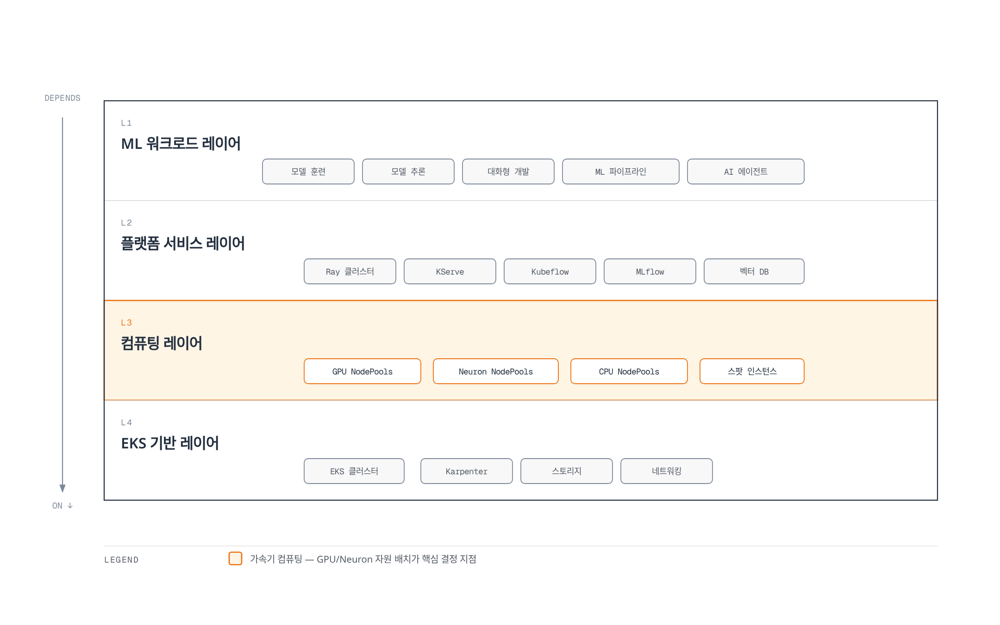
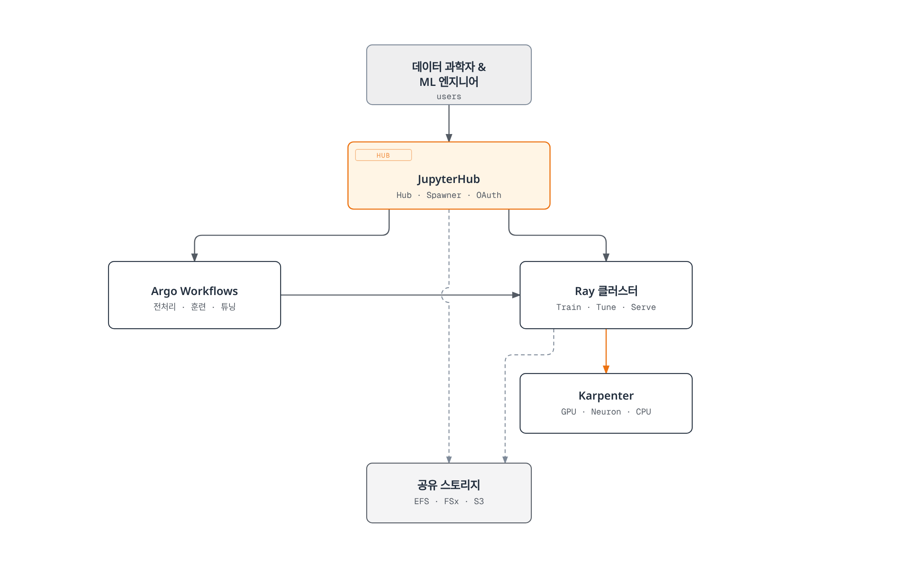
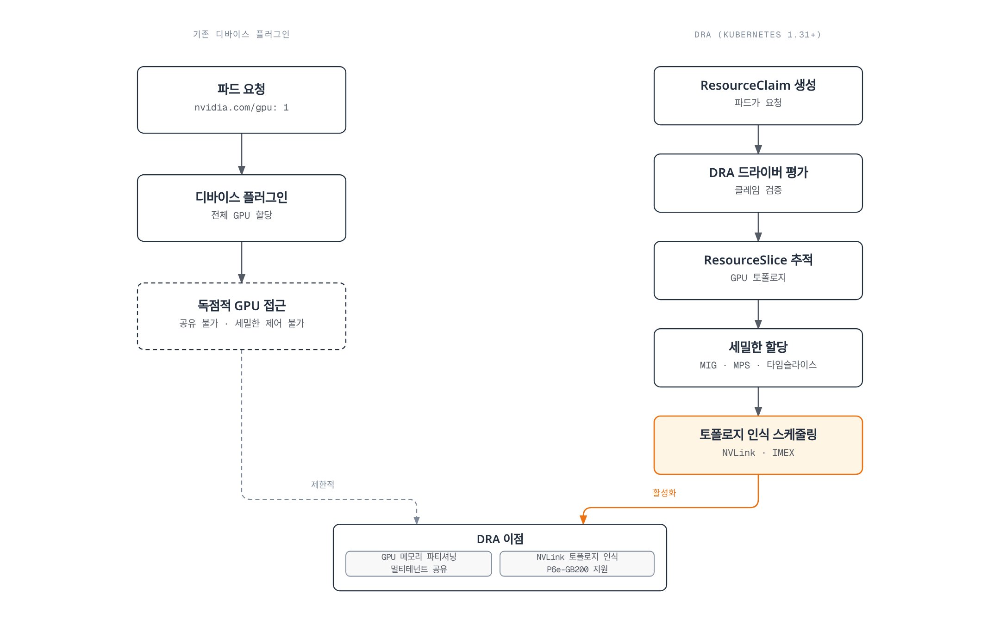

# EKS 기반 AI 인프라

> **지원 버전**: Kubernetes 1.31, 1.32, 1.33
> **마지막 업데이트**: 2026년 2월 25일

이 가이드에서는 Amazon EKS에서 AI/ML 인프라를 구축하는 방법을 다룹니다. JARK 스택, 동적 리소스 할당(DRA), AI 에이전트 개발을 위한 프로덕션 플랫폼을 포함합니다.

## AI/ML 인프라 아키텍처 개요

EKS 기반 AI/ML 인프라는 관심사를 분리하고 각 레이어의 독립적인 확장을 가능하게 하는 계층형 아키텍처를 따릅니다.



**레이어별 역할:**

| 레이어 | 구성 요소 | 목적 |
|--------|----------|------|
| **워크로드** | 훈련, 추론, 노트북, 파이프라인, 에이전트 | 사용자 대면 ML 애플리케이션 |
| **플랫폼** | Ray, KServe, Kubeflow, MLflow, 벡터 DB | ML 전용 오케스트레이션 및 도구 |
| **컴퓨팅** | GPU/Neuron/CPU NodePools, 스팟 인스턴스 | 하드웨어 가속 및 비용 최적화 |
| **기반** | EKS, Karpenter, 스토리지, 네트워킹 | 기반 인프라 |

---

## JARK 스택: 완전한 AI/ML 개발 환경

JARK 스택(JupyterHub + Argo Workflows + Ray + Karpenter)은 EKS에서 완전하고 프로덕션 준비된 AI/ML 개발 환경을 제공합니다.

### JARK 스택 아키텍처



### JARK 스택 구성 요소

#### 1. JupyterHub - 대화형 개발 환경

JupyterHub는 GPU 지원 노트북 프로필을 갖춘 다중 사용자 대화형 개발 환경을 제공합니다.

**GPU 프로필이 포함된 JupyterHub 구성:**

```yaml
# jupyterhub-config.yaml
apiVersion: v1
kind: ConfigMap
metadata:
  name: jupyterhub-config
  namespace: jupyterhub
data:
  jupyterhub_config.py: |
    c.JupyterHub.spawner_class = 'kubespawner.KubeSpawner'

    # Amazon Cognito 인증
    c.JupyterHub.authenticator_class = 'oauthenticator.generic.GenericOAuthenticator'
    c.GenericOAuthenticator.oauth_callback_url = 'https://jupyter.example.com/hub/oauth_callback'
    c.GenericOAuthenticator.client_id = 'your-cognito-client-id'
    c.GenericOAuthenticator.client_secret = 'your-cognito-client-secret'
    c.GenericOAuthenticator.authorize_url = 'https://your-domain.auth.us-west-2.amazoncognito.com/oauth2/authorize'
    c.GenericOAuthenticator.token_url = 'https://your-domain.auth.us-west-2.amazoncognito.com/oauth2/token'
    c.GenericOAuthenticator.userdata_url = 'https://your-domain.auth.us-west-2.amazoncognito.com/oauth2/userInfo'

    # 노트북 프로필 정의
    c.KubeSpawner.profile_list = [
        {
            'display_name': 'CPU - 소형 (2 CPU, 4GB RAM)',
            'slug': 'cpu-small',
            'kubespawner_override': {
                'cpu_limit': 2,
                'cpu_guarantee': 1,
                'mem_limit': '4G',
                'mem_guarantee': '2G',
                'image': 'jupyter/scipy-notebook:latest',
            }
        },
        {
            'display_name': 'CPU - 대형 (8 CPU, 32GB RAM)',
            'slug': 'cpu-large',
            'kubespawner_override': {
                'cpu_limit': 8,
                'cpu_guarantee': 4,
                'mem_limit': '32G',
                'mem_guarantee': '16G',
                'image': 'jupyter/tensorflow-notebook:latest',
            }
        },
        {
            'display_name': 'GPU - T4 (4 CPU, 16GB RAM, 1x T4)',
            'slug': 'gpu-t4',
            'kubespawner_override': {
                'cpu_limit': 4,
                'cpu_guarantee': 2,
                'mem_limit': '16G',
                'mem_guarantee': '8G',
                'image': 'jupyter/tensorflow-notebook:gpu',
                'extra_resource_limits': {'nvidia.com/gpu': '1'},
                'extra_resource_guarantees': {'nvidia.com/gpu': '1'},
                'node_selector': {'nvidia.com/gpu.product': 'Tesla-T4'},
            }
        },
        {
            'display_name': 'GPU - A10G (8 CPU, 64GB RAM, 1x A10G)',
            'slug': 'gpu-a10g',
            'kubespawner_override': {
                'cpu_limit': 8,
                'cpu_guarantee': 4,
                'mem_limit': '64G',
                'mem_guarantee': '32G',
                'image': 'jupyter/tensorflow-notebook:gpu',
                'extra_resource_limits': {'nvidia.com/gpu': '1'},
                'extra_resource_guarantees': {'nvidia.com/gpu': '1'},
                'node_selector': {'nvidia.com/gpu.product': 'NVIDIA-A10G'},
            }
        },
        {
            'display_name': 'GPU - A100 (16 CPU, 128GB RAM, 1x A100 80GB)',
            'slug': 'gpu-a100',
            'kubespawner_override': {
                'cpu_limit': 16,
                'cpu_guarantee': 8,
                'mem_limit': '128G',
                'mem_guarantee': '64G',
                'image': 'jupyter/tensorflow-notebook:gpu',
                'extra_resource_limits': {'nvidia.com/gpu': '1'},
                'extra_resource_guarantees': {'nvidia.com/gpu': '1'},
                'node_selector': {'nvidia.com/gpu.product': 'NVIDIA-A100-SXM4-80GB'},
            }
        },
    ]

    # 노트북용 영구 스토리지
    c.KubeSpawner.storage_class = 'efs-sc'
    c.KubeSpawner.storage_pvc_ensure = True
    c.KubeSpawner.pvc_name_template = 'claim-{username}'
    c.KubeSpawner.storage_capacity = '50Gi'

    # 공유 읽기 전용 데이터셋 마운트
    c.KubeSpawner.volumes = [
        {
            'name': 'shared-datasets',
            'persistentVolumeClaim': {'claimName': 'shared-datasets-pvc'}
        },
        {
            'name': 'shared-models',
            'persistentVolumeClaim': {'claimName': 'shared-models-pvc'}
        }
    ]
    c.KubeSpawner.volume_mounts = [
        {'name': 'shared-datasets', 'mountPath': '/home/jovyan/datasets', 'readOnly': True},
        {'name': 'shared-models', 'mountPath': '/home/jovyan/models', 'readOnly': False}
    ]
```

**JupyterHub Helm 설치:**

```bash
# JupyterHub Helm 저장소 추가
helm repo add jupyterhub https://jupyterhub.github.io/helm-chart/
helm repo update

# 네임스페이스 생성
kubectl create namespace jupyterhub

# JupyterHub 설치
helm upgrade --install jupyterhub jupyterhub/jupyterhub \
  --namespace jupyterhub \
  --version 3.2.1 \
  --values jupyterhub-values.yaml \
  --timeout 10m
```

#### 2. Argo Workflows - ML 파이프라인 오케스트레이션

Argo Workflows는 DAG 기반 워크플로우를 통해 복잡한 ML 파이프라인 오케스트레이션을 가능하게 합니다.

**ML 훈련 파이프라인 예시:**

```yaml
apiVersion: argoproj.io/v1alpha1
kind: Workflow
metadata:
  generateName: ml-training-pipeline-
  namespace: argo
spec:
  entrypoint: ml-pipeline
  serviceAccountName: argo-workflow

  # 아티팩트 저장소 구성
  artifactRepositoryRef:
    configMap: artifact-repositories
    key: default-v1

  # 워크플로우 매개변수
  arguments:
    parameters:
    - name: model-name
      value: "resnet50"
    - name: dataset-path
      value: "s3://ml-datasets/imagenet"
    - name: epochs
      value: "100"
    - name: batch-size
      value: "64"
    - name: learning-rate
      value: "0.001"

  templates:
  - name: ml-pipeline
    dag:
      tasks:
      # 데이터 검증 태스크
      - name: validate-data
        template: data-validation
        arguments:
          parameters:
          - name: dataset-path
            value: "{{workflow.parameters.dataset-path}}"

      # 데이터 전처리 태스크
      - name: preprocess-data
        template: data-preprocessing
        dependencies: [validate-data]
        arguments:
          parameters:
          - name: dataset-path
            value: "{{workflow.parameters.dataset-path}}"

      # Ray Tune을 사용한 하이퍼파라미터 튜닝
      - name: hyperparameter-tuning
        template: ray-tune
        dependencies: [preprocess-data]
        arguments:
          parameters:
          - name: model-name
            value: "{{workflow.parameters.model-name}}"

      # Ray Train을 사용한 분산 훈련
      - name: distributed-training
        template: ray-train
        dependencies: [hyperparameter-tuning]
        arguments:
          parameters:
          - name: model-name
            value: "{{workflow.parameters.model-name}}"
          - name: epochs
            value: "{{workflow.parameters.epochs}}"
          - name: best-params
            value: "{{tasks.hyperparameter-tuning.outputs.parameters.best-params}}"

      # 모델 평가
      - name: evaluate-model
        template: model-evaluation
        dependencies: [distributed-training]
        arguments:
          artifacts:
          - name: model
            from: "{{tasks.distributed-training.outputs.artifacts.model}}"

      # 모델 등록
      - name: register-model
        template: model-registration
        dependencies: [evaluate-model]
        when: "{{tasks.evaluate-model.outputs.parameters.accuracy}} > 0.95"
        arguments:
          parameters:
          - name: accuracy
            value: "{{tasks.evaluate-model.outputs.parameters.accuracy}}"

  # 데이터 검증 템플릿
  - name: data-validation
    inputs:
      parameters:
      - name: dataset-path
    container:
      image: python:3.11-slim
      command: [python]
      args:
      - -c
      - |
        import boto3
        # 데이터셋 존재 여부 및 예상 구조 검증
        print(f"데이터셋 검증 중: {{inputs.parameters.dataset-path}}")
        # 검증 로직 추가
      resources:
        requests:
          cpu: "1"
          memory: "2Gi"

  # Ray Tune 하이퍼파라미터 최적화 템플릿
  - name: ray-tune
    inputs:
      parameters:
      - name: model-name
    outputs:
      parameters:
      - name: best-params
        valueFrom:
          path: /tmp/best_params.json
    container:
      image: rayproject/ray-ml:2.9.0-py310-gpu
      command: [python]
      args:
      - -c
      - |
        import ray
        from ray import tune
        from ray.tune.schedulers import ASHAScheduler
        import json

        ray.init()

        def train_func(config):
            # 하이퍼파라미터 검색을 위한 훈련 함수
            accuracy = config["lr"] * 0.5 + config["batch_size"] * 0.001
            return {"accuracy": accuracy}

        scheduler = ASHAScheduler(max_t=100, grace_period=10)

        analysis = tune.run(
            train_func,
            config={
                "lr": tune.loguniform(1e-5, 1e-1),
                "batch_size": tune.choice([16, 32, 64, 128]),
                "hidden_size": tune.choice([64, 128, 256, 512]),
            },
            num_samples=50,
            scheduler=scheduler,
            resources_per_trial={"cpu": 2, "gpu": 0.5},
        )

        best_config = analysis.get_best_config(metric="accuracy", mode="max")
        with open("/tmp/best_params.json", "w") as f:
            json.dump(best_config, f)
      resources:
        requests:
          cpu: "4"
          memory: "16Gi"
          nvidia.com/gpu: "1"
        limits:
          nvidia.com/gpu: "1"
```

#### 3. Ray (KubeRay) - 분산 컴퓨팅

Ray는 훈련, 튜닝, 서빙을 포함한 ML 워크로드를 위한 통합 분산 컴퓨팅을 제공합니다.

**RayCluster 구성:**

```yaml
apiVersion: ray.io/v1
kind: RayCluster
metadata:
  name: ml-cluster
  namespace: ray-system
spec:
  rayVersion: '2.9.0'
  enableInTreeAutoscaling: true

  # 헤드 노드 구성
  headGroupSpec:
    serviceType: ClusterIP
    rayStartParams:
      dashboard-host: '0.0.0.0'
      block: 'true'
    template:
      spec:
        containers:
        - name: ray-head
          image: rayproject/ray-ml:2.9.0-py310-gpu
          ports:
          - containerPort: 6379
            name: gcs
          - containerPort: 8265
            name: dashboard
          - containerPort: 10001
            name: client
          resources:
            limits:
              cpu: "8"
              memory: "32Gi"
            requests:
              cpu: "4"
              memory: "16Gi"
          env:
          - name: RAY_GRAFANA_HOST
            value: "http://grafana.monitoring:3000"
          - name: RAY_PROMETHEUS_HOST
            value: "http://prometheus.monitoring:9090"
        nodeSelector:
          node-type: cpu

  # 워커 그룹 사양
  workerGroupSpecs:
  # 데이터 처리용 CPU 워커
  - replicas: 2
    minReplicas: 1
    maxReplicas: 10
    groupName: cpu-workers
    rayStartParams:
      block: 'true'
    template:
      spec:
        containers:
        - name: ray-worker
          image: rayproject/ray-ml:2.9.0-py310
          resources:
            limits:
              cpu: "8"
              memory: "32Gi"
            requests:
              cpu: "4"
              memory: "16Gi"
        nodeSelector:
          node-type: cpu

  # 훈련용 GPU 워커 (g5 인스턴스 - A10G)
  - replicas: 2
    minReplicas: 0
    maxReplicas: 8
    groupName: gpu-a10g-workers
    rayStartParams:
      block: 'true'
      num-gpus: '1'
    template:
      spec:
        containers:
        - name: ray-worker
          image: rayproject/ray-ml:2.9.0-py310-gpu
          resources:
            limits:
              cpu: "8"
              memory: "64Gi"
              nvidia.com/gpu: "1"
            requests:
              cpu: "4"
              memory: "32Gi"
              nvidia.com/gpu: "1"
        nodeSelector:
          nvidia.com/gpu.product: NVIDIA-A10G
        tolerations:
        - key: nvidia.com/gpu
          operator: Exists
          effect: NoSchedule

  # 고성능 GPU 워커 (p4d/p5 인스턴스 - A100/H100)
  - replicas: 0
    minReplicas: 0
    maxReplicas: 4
    groupName: gpu-a100-workers
    rayStartParams:
      block: 'true'
      num-gpus: '8'
    template:
      spec:
        containers:
        - name: ray-worker
          image: rayproject/ray-ml:2.9.0-py310-gpu
          resources:
            limits:
              cpu: "96"
              memory: "1024Gi"
              nvidia.com/gpu: "8"
            requests:
              cpu: "48"
              memory: "512Gi"
              nvidia.com/gpu: "8"
        nodeSelector:
          nvidia.com/gpu.product: NVIDIA-A100-SXM4-80GB
        tolerations:
        - key: nvidia.com/gpu
          operator: Exists
          effect: NoSchedule

  # AWS Neuron 워커 (inf2/trn1 인스턴스)
  - replicas: 0
    minReplicas: 0
    maxReplicas: 4
    groupName: neuron-workers
    rayStartParams:
      block: 'true'
    template:
      spec:
        containers:
        - name: ray-worker
          image: public.ecr.aws/neuron/pytorch-training-neuronx:2.1
          resources:
            limits:
              cpu: "32"
              memory: "128Gi"
              aws.amazon.com/neuron: "16"
            requests:
              cpu: "16"
              memory: "64Gi"
              aws.amazon.com/neuron: "16"
        nodeSelector:
          node.kubernetes.io/instance-type: trn1.32xlarge
        tolerations:
        - key: aws.amazon.com/neuron
          operator: Exists
          effect: NoSchedule
```

#### 4. Karpenter - 지능형 노드 프로비저닝

Karpenter는 GPU 및 Neuron 지원을 통해 빠르고 비용 효율적인 노드 프로비저닝을 제공합니다.

**GPU 및 Neuron NodePools:**

```yaml
# NVIDIA GPU용 GPU NodePool
apiVersion: karpenter.sh/v1
kind: NodePool
metadata:
  name: gpu-nodepool
spec:
  template:
    metadata:
      labels:
        node-type: gpu
    spec:
      requirements:
      - key: kubernetes.io/arch
        operator: In
        values: ["amd64"]
      - key: karpenter.sh/capacity-type
        operator: In
        values: ["on-demand", "spot"]
      - key: node.kubernetes.io/instance-type
        operator: In
        values:
        # g5 인스턴스 (A10G GPU)
        - g5.xlarge
        - g5.2xlarge
        - g5.4xlarge
        - g5.8xlarge
        - g5.12xlarge
        - g5.16xlarge
        - g5.24xlarge
        - g5.48xlarge
        # p4d 인스턴스 (A100 GPU)
        - p4d.24xlarge
        # p5 인스턴스 (H100 GPU)
        - p5.48xlarge
      nodeClassRef:
        group: karpenter.k8s.aws
        kind: EC2NodeClass
        name: gpu-nodeclass
      taints:
      - key: nvidia.com/gpu
        effect: NoSchedule

  limits:
    cpu: 1000
    memory: 4000Gi
    nvidia.com/gpu: 100

  disruption:
    consolidationPolicy: WhenEmptyOrUnderutilized
    consolidateAfter: 5m

  weight: 10
---
# GPU 인스턴스용 EC2NodeClass
apiVersion: karpenter.k8s.aws/v1
kind: EC2NodeClass
metadata:
  name: gpu-nodeclass
spec:
  amiFamily: AL2
  role: KarpenterNodeRole-ml-cluster

  # GPU 드라이버가 포함된 EKS 최적화 AMI 사용
  amiSelectorTerms:
  - alias: al2@latest

  subnetSelectorTerms:
  - tags:
      karpenter.sh/discovery: ml-cluster

  securityGroupSelectorTerms:
  - tags:
      karpenter.sh/discovery: ml-cluster

  # NVIDIA 드라이버 및 컨테이너 툴킷 설치
  userData: |
    #!/bin/bash
    set -e

    # NVIDIA 드라이버 설치
    yum install -y kernel-devel-$(uname -r) kernel-headers-$(uname -r)

    # NVIDIA용 containerd 구성
    cat <<EOF > /etc/containerd/config.toml
    version = 2
    [plugins."io.containerd.grpc.v1.cri".containerd]
      default_runtime_name = "nvidia"
      [plugins."io.containerd.grpc.v1.cri".containerd.runtimes.nvidia]
        runtime_type = "io.containerd.runc.v2"
        [plugins."io.containerd.grpc.v1.cri".containerd.runtimes.nvidia.options]
          BinaryName = "/usr/bin/nvidia-container-runtime"
    EOF

    systemctl restart containerd

  blockDeviceMappings:
  - deviceName: /dev/xvda
    ebs:
      volumeSize: 200Gi
      volumeType: gp3
      iops: 10000
      throughput: 500
      encrypted: true

  # 임시 데이터용 인스턴스 스토어
  instanceStorePolicy: RAID0

  tags:
    Environment: production
    Team: ml-platform
---
# AWS Inferentia/Trainium용 Neuron NodePool
apiVersion: karpenter.sh/v1
kind: NodePool
metadata:
  name: neuron-nodepool
spec:
  template:
    metadata:
      labels:
        node-type: neuron
    spec:
      requirements:
      - key: kubernetes.io/arch
        operator: In
        values: ["amd64"]
      - key: karpenter.sh/capacity-type
        operator: In
        values: ["on-demand"]
      - key: node.kubernetes.io/instance-type
        operator: In
        values:
        # inf2 인스턴스 (Inferentia2)
        - inf2.xlarge
        - inf2.8xlarge
        - inf2.24xlarge
        - inf2.48xlarge
        # trn1 인스턴스 (Trainium)
        - trn1.2xlarge
        - trn1.32xlarge
        - trn1n.32xlarge
      nodeClassRef:
        group: karpenter.k8s.aws
        kind: EC2NodeClass
        name: neuron-nodeclass
      taints:
      - key: aws.amazon.com/neuron
        effect: NoSchedule

  limits:
    cpu: 500
    memory: 2000Gi
    aws.amazon.com/neuron: 64

  disruption:
    consolidationPolicy: WhenEmpty
    consolidateAfter: 10m

  weight: 5
```

---

## GPU를 위한 동적 리소스 할당(DRA)

동적 리소스 할당(DRA)은 기존 디바이스 플러그인으로는 달성할 수 없는 GPU 리소스에 대한 세밀한 제어를 제공하는 Kubernetes의 차세대 GPU 스케줄링 접근 방식입니다.

### DRA vs 기존 GPU 스케줄링



### DRA를 사용한 GPU 공유 전략

DRA는 다양한 사용 사례에 대해 여러 GPU 공유 전략을 지원합니다:

| 전략 | 사용 사례 | GPU 활용률 | 격리 | 지연 시간 |
|------|----------|-----------|------|---------|
| **Exclusive** | 훈련, HPC | 100% 전용 | 완전 | 최저 |
| **MIG** | 멀티테넌트 추론 | 하드웨어 파티션 | 강함 | 낮음 |
| **Time-Slicing** | 개발, 테스트 | 시간 공유 | 약함 | 가변 |
| **MPS** | 병렬 소규모 워크로드 | CUDA 컨텍스트 공유 | 중간 | 중간 |

**GPU 공유를 위한 DRA ResourceClaim:**

```yaml
# MIG 파티셔닝을 사용한 GPU ResourceClaimTemplate
apiVersion: resource.k8s.io/v1alpha3
kind: ResourceClaimTemplate
metadata:
  name: gpu-mig-3g20gb
  namespace: ml-workloads
spec:
  spec:
    devices:
      requests:
      - name: gpu
        deviceClassName: gpu.nvidia.com
        selectors:
        - cel:
            expression: device.attributes["gpu.nvidia.com/mig.profile"] == "3g.20gb"
      config:
      - requests: ["gpu"]
        opaque:
          driver: gpu.nvidia.com
          parameters:
            # MIG 프로필: 3개 GPU 인스턴스, 각 20GB
            migProfile: "3g.20gb"
            # 공유 모드
            sharingMode: "mig"
---
# 타임슬라이싱을 위한 ResourceClaimTemplate
apiVersion: resource.k8s.io/v1alpha3
kind: ResourceClaimTemplate
metadata:
  name: gpu-timeslice
  namespace: ml-workloads
spec:
  spec:
    devices:
      requests:
      - name: gpu
        deviceClassName: gpu.nvidia.com
      config:
      - requests: ["gpu"]
        opaque:
          driver: gpu.nvidia.com
          parameters:
            sharingMode: "time-slicing"
            timeSlice: "default"
            replicas: 4  # 4개 파드가 1개 GPU 공유
---
# MPS를 위한 ResourceClaimTemplate
apiVersion: resource.k8s.io/v1alpha3
kind: ResourceClaimTemplate
metadata:
  name: gpu-mps
  namespace: ml-workloads
spec:
  spec:
    devices:
      requests:
      - name: gpu
        deviceClassName: gpu.nvidia.com
      config:
      - requests: ["gpu"]
        opaque:
          driver: gpu.nvidia.com
          parameters:
            sharingMode: "mps"
            mpsActiveThreadPercentage: 50
---
# DRA ResourceClaim을 사용하는 파드
apiVersion: v1
kind: Pod
metadata:
  name: inference-pod
  namespace: ml-workloads
spec:
  containers:
  - name: inference
    image: nvcr.io/nvidia/pytorch:24.01-py3
    command: ["python", "/app/inference.py"]
    resources:
      claims:
      - name: gpu-claim
  resourceClaims:
  - name: gpu-claim
    resourceClaimTemplateName: gpu-mig-3g20gb
```

### DRA 지원이 포함된 NVIDIA GPU Operator

DRA는 완전한 지원을 위해 NVIDIA GPU Operator v25.3.0 이상이 필요합니다.

```yaml
# DRA가 활성화된 NVIDIA GPU Operator 설치
apiVersion: v1
kind: Namespace
metadata:
  name: gpu-operator
---
# DRA용 GPU Operator Helm 값
# helm install gpu-operator nvidia/gpu-operator -n gpu-operator -f values.yaml
apiVersion: v1
kind: ConfigMap
metadata:
  name: gpu-operator-values
  namespace: gpu-operator
data:
  values.yaml: |
    operator:
      defaultRuntime: containerd

    driver:
      enabled: true
      version: "550.90.07"

    toolkit:
      enabled: true
      version: "v1.15.0"

    devicePlugin:
      enabled: true
      config:
        name: device-plugin-config
        default: any
        data:
          any: |-
            version: v1
            sharing:
              timeSlicing:
                renameByDefault: false
                failRequestsGreaterThanOne: false
                resources:
                - name: nvidia.com/gpu
                  replicas: 4

    # DRA 드라이버 구성 (v25.3.0+)
    draDriver:
      enabled: true
      version: "v0.1.0"
      config:
        sharing:
          mps:
            enabled: true
          timeSlicing:
            enabled: true
          mig:
            enabled: true
            strategy: mixed

    # 자동 MIG 구성을 위한 MIG 관리자
    migManager:
      enabled: true
      config:
        default: all-disabled

    # GPU 메트릭용 DCGM 익스포터
    dcgmExporter:
      enabled: true
      serviceMonitor:
        enabled: true

    # GPU Feature Discovery
    gfd:
      enabled: true
```

### NVLink/IMEX를 위한 토폴로지 인식 스케줄링

멀티 GPU 훈련 워크로드의 경우, 토폴로지 인식 스케줄링은 NVLink로 연결된 GPU가 함께 할당되도록 보장합니다.

```yaml
# 토폴로지 인식 멀티 GPU 할당을 위한 ResourceClaim
apiVersion: resource.k8s.io/v1alpha3
kind: ResourceClaim
metadata:
  name: multi-gpu-nvlink
  namespace: ml-training
spec:
  devices:
    requests:
    - name: gpu-group
      deviceClassName: gpu.nvidia.com
      count: 8  # 8개 GPU 요청
      selectors:
      # 모든 GPU가 동일 노드에 있도록 보장
      - cel:
          expression: device.topology.node == device.topology.node
      # NVLink 연결 GPU 선호
      - cel:
          expression: device.attributes["gpu.nvidia.com/nvlink.capable"] == "true"
    constraints:
    # 최상의 성능을 위해 모든 GPU가 동일 NUMA 노드에서 제공되어야 함
    - requests: ["gpu-group"]
      matchAttribute: device.topology.numa
```

### P6e-GB200 UltraServer 지원

NVIDIA GB200 NVL72(P6e 인스턴스)는 72개의 상호 연결된 GPU로 구성된 고유한 아키텍처로 인해 적절한 리소스 관리를 위해 DRA가 필요합니다.

```yaml
# GB200 NVL72 토폴로지를 나타내는 ResourceSlice
apiVersion: resource.k8s.io/v1alpha3
kind: ResourceSlice
metadata:
  name: gb200-nvl72-node-1
spec:
  nodeName: p6e-gb200-node-1
  pool:
    name: gb200-pool
    generation: 1
    resourceSliceCount: 1
  driver: gpu.nvidia.com
  devices:
  - name: gpu-0
    basic:
      attributes:
        gpu.nvidia.com/product: "NVIDIA-GB200"
        gpu.nvidia.com/memory: "192Gi"
        gpu.nvidia.com/nvlink.version: "5.0"
        gpu.nvidia.com/nvswitch.connected: "true"
        gpu.nvidia.com/imex.capable: "true"
      capacity:
        gpu.nvidia.com/gpu: 1
---
# GB200 GPU용 DeviceClass
apiVersion: resource.k8s.io/v1alpha3
kind: DeviceClass
metadata:
  name: gpu.nvidia.com.gb200
spec:
  selectors:
  - cel:
      expression: device.attributes["gpu.nvidia.com/product"] == "NVIDIA-GB200"
  config:
  - opaque:
      driver: gpu.nvidia.com
      parameters:
        # GB200용 IMEX(In-Memory Exchange) 활성화
        imexEnabled: true
        # NVSwitch 기반 통신
        nvswitchEnabled: true
        # Grace-Hopper 전용 최적화
        graceHopperMode: true
```

---

## EKS 기반 Agents 플랫폼

EKS 기반 Agents 플랫폼은 소스 제어, 관찰 가능성, 벡터 스토리지, 도구 검색을 위한 통합 도구와 함께 AI 에이전트를 구축하고 배포하기 위한 인프라를 제공합니다.

### Agents 플랫폼 아키텍처

```yaml
# 소스 제어 및 CI/CD를 위한 GitLab
apiVersion: v1
kind: Namespace
metadata:
  name: gitlab
---
apiVersion: helm.toolkit.fluxcd.io/v2
kind: HelmRelease
metadata:
  name: gitlab
  namespace: gitlab
spec:
  interval: 10m
  chart:
    spec:
      chart: gitlab
      version: "7.8.0"
      sourceRef:
        kind: HelmRepository
        name: gitlab
        namespace: flux-system
  values:
    global:
      hosts:
        domain: agents.example.com
        gitlab:
          name: gitlab.agents.example.com
      ingress:
        configureCertmanager: true
        class: alb
---
# LLM 관찰 가능성을 위한 Langfuse
apiVersion: v1
kind: Namespace
metadata:
  name: langfuse
---
apiVersion: apps/v1
kind: Deployment
metadata:
  name: langfuse
  namespace: langfuse
spec:
  replicas: 2
  selector:
    matchLabels:
      app: langfuse
  template:
    metadata:
      labels:
        app: langfuse
    spec:
      containers:
      - name: langfuse
        image: langfuse/langfuse:2.50.0
        ports:
        - containerPort: 3000
        env:
        - name: DATABASE_URL
          valueFrom:
            secretKeyRef:
              name: langfuse-secrets
              key: database-url
        - name: NEXTAUTH_URL
          value: "https://langfuse.agents.example.com"
        resources:
          requests:
            cpu: "500m"
            memory: "1Gi"
          limits:
            cpu: "2"
            memory: "4Gi"
---
# RAG를 위한 Milvus 벡터 데이터베이스
apiVersion: v1
kind: Namespace
metadata:
  name: milvus
---
apiVersion: helm.toolkit.fluxcd.io/v2
kind: HelmRelease
metadata:
  name: milvus
  namespace: milvus
spec:
  interval: 10m
  chart:
    spec:
      chart: milvus
      version: "4.1.0"
      sourceRef:
        kind: HelmRepository
        name: milvus
        namespace: flux-system
  values:
    cluster:
      enabled: true

    # GPU 가속이 포함된 쿼리 노드
    queryNode:
      replicas: 2
      resources:
        requests:
          cpu: "2"
          memory: "8Gi"
          nvidia.com/gpu: "1"
        limits:
          nvidia.com/gpu: "1"

    # 벡터 인덱싱을 위한 인덱스 노드
    indexNode:
      replicas: 2
      resources:
        requests:
          cpu: "4"
          memory: "16Gi"
          nvidia.com/gpu: "1"
        limits:
          nvidia.com/gpu: "1"
---
# 도구 검색을 위한 MCP Gateway
apiVersion: v1
kind: Namespace
metadata:
  name: mcp-gateway
---
apiVersion: apps/v1
kind: Deployment
metadata:
  name: mcp-gateway
  namespace: mcp-gateway
spec:
  replicas: 3
  selector:
    matchLabels:
      app: mcp-gateway
  template:
    metadata:
      labels:
        app: mcp-gateway
    spec:
      containers:
      - name: mcp-gateway
        image: ghcr.io/anthropics/mcp-gateway:latest
        ports:
        - containerPort: 8080
          name: http
        - containerPort: 9090
          name: grpc
        env:
        - name: REGISTRY_BACKEND
          value: "kubernetes"
        - name: DISCOVERY_MODE
          value: "auto"
        resources:
          requests:
            cpu: "250m"
            memory: "512Mi"
          limits:
            cpu: "1"
            memory: "2Gi"
```

### AI 에이전트 배포 예시

```yaml
# RAG 기능을 갖춘 AI 에이전트 배포
apiVersion: apps/v1
kind: Deployment
metadata:
  name: ai-agent
  namespace: ai-agents
spec:
  replicas: 3
  selector:
    matchLabels:
      app: ai-agent
  template:
    metadata:
      labels:
        app: ai-agent
      annotations:
        prometheus.io/scrape: "true"
        prometheus.io/port: "8000"
    spec:
      serviceAccountName: ai-agent
      containers:
      - name: agent
        image: ai-agents/customer-support:v1.2.0
        ports:
        - containerPort: 8000
          name: http
        env:
        # LLM 구성
        - name: LLM_PROVIDER
          value: "bedrock"
        - name: LLM_MODEL
          value: "anthropic.claude-3-5-sonnet-20241022-v2:0"
        - name: AWS_REGION
          value: "us-west-2"

        # RAG를 위한 벡터 데이터베이스
        - name: MILVUS_HOST
          value: "milvus.milvus.svc.cluster.local"
        - name: MILVUS_PORT
          value: "19530"

        # 관찰 가능성을 위한 Langfuse
        - name: LANGFUSE_HOST
          value: "https://langfuse.agents.example.com"

        # 도구 검색을 위한 MCP Gateway
        - name: MCP_GATEWAY_URL
          value: "http://mcp-gateway.mcp-gateway.svc.cluster.local:8080"

        resources:
          requests:
            cpu: "1"
            memory: "4Gi"
          limits:
            cpu: "4"
            memory: "16Gi"
```

---

## AI/ML용 스토리지 솔루션

### 공유 모델 스토리지를 위한 Amazon EFS

```yaml
# 공유 노트북 및 모델용 EFS StorageClass
apiVersion: storage.k8s.io/v1
kind: StorageClass
metadata:
  name: efs-sc
provisioner: efs.csi.aws.com
parameters:
  provisioningMode: efs-ap
  fileSystemId: fs-xxxxxxxxx
  directoryPerms: "755"
  basePath: "/ml-storage"
mountOptions:
  - tls
  - iam
---
# 공유 모델 PVC
apiVersion: v1
kind: PersistentVolumeClaim
metadata:
  name: shared-models-pvc
  namespace: ml-platform
spec:
  accessModes:
    - ReadWriteMany
  storageClassName: efs-sc
  resources:
    requests:
      storage: 500Gi
```

### 고처리량 훈련을 위한 FSx for Lustre

```yaml
# 훈련 워크로드용 FSx for Lustre StorageClass
apiVersion: storage.k8s.io/v1
kind: StorageClass
metadata:
  name: fsx-lustre-sc
provisioner: fsx.csi.aws.com
parameters:
  subnetId: subnet-xxxxxxxxx
  securityGroupIds: sg-xxxxxxxxx
  deploymentType: PERSISTENT_2
  perUnitStorageThroughput: "500"  # TiB당 MB/s
  dataCompressionType: LZ4
  s3ImportPath: s3://ml-datasets
  s3ExportPath: s3://ml-training-outputs
mountOptions:
  - flock
---
# 훈련 데이터용 FSx for Lustre PVC
apiVersion: v1
kind: PersistentVolumeClaim
metadata:
  name: training-data-pvc
  namespace: ml-training
spec:
  accessModes:
    - ReadWriteMany
  storageClassName: fsx-lustre-sc
  resources:
    requests:
      storage: 10Ti
```

---

## AI 워크로드를 위한 네트워킹

### 멀티 노드 훈련을 위한 Elastic Fabric Adapter(EFA)

EFA는 분산 훈련에 필수적인 고대역폭, 저지연 네트워킹을 제공합니다.

```yaml
# EFA 지원 NodePool
apiVersion: karpenter.sh/v1
kind: NodePool
metadata:
  name: efa-training-nodepool
spec:
  template:
    metadata:
      labels:
        node-type: efa-training
    spec:
      requirements:
      - key: node.kubernetes.io/instance-type
        operator: In
        values:
        # EFA 지원 GPU 인스턴스
        - p4d.24xlarge   # 4x 400 Gbps EFA
        - p5.48xlarge    # 32x 400 Gbps EFA
        - trn1.32xlarge  # 8x 800 Gbps EFA
        - trn1n.32xlarge # 16x 1600 Gbps EFA
      nodeClassRef:
        group: karpenter.k8s.aws
        kind: EC2NodeClass
        name: efa-nodeclass
      taints:
      - key: nvidia.com/gpu
        effect: NoSchedule
---
# EFA Device Plugin DaemonSet
apiVersion: apps/v1
kind: DaemonSet
metadata:
  name: aws-efa-k8s-device-plugin
  namespace: kube-system
spec:
  selector:
    matchLabels:
      name: aws-efa-k8s-device-plugin
  template:
    metadata:
      labels:
        name: aws-efa-k8s-device-plugin
    spec:
      tolerations:
      - key: nvidia.com/gpu
        operator: Exists
        effect: NoSchedule
      priorityClassName: system-node-critical
      containers:
      - name: aws-efa-k8s-device-plugin
        image: public.ecr.aws/eks/aws-efa-k8s-device-plugin:v0.5.0
        securityContext:
          allowPrivilegeEscalation: false
          capabilities:
            drop: ["ALL"]
        volumeMounts:
        - name: device-plugin
          mountPath: /var/lib/kubelet/device-plugins
      volumes:
      - name: device-plugin
        hostPath:
          path: /var/lib/kubelet/device-plugins
      nodeSelector:
        node-type: efa-training
---
# EFA를 사용한 분산 훈련 잡
apiVersion: kubeflow.org/v1
kind: PyTorchJob
metadata:
  name: distributed-training-efa
  namespace: ml-training
spec:
  nprocPerNode: "8"
  pytorchReplicaSpecs:
    Master:
      replicas: 1
      restartPolicy: OnFailure
      template:
        spec:
          containers:
          - name: pytorch
            image: nvcr.io/nvidia/pytorch:24.01-py3
            command:
            - torchrun
            - --nproc_per_node=8
            - --nnodes=4
            - --node_rank=0
            - --master_addr=$(MASTER_ADDR)
            - --master_port=29500
            - /app/train.py
            env:
            - name: NCCL_DEBUG
              value: "INFO"
            - name: FI_PROVIDER
              value: "efa"
            - name: FI_EFA_USE_DEVICE_RDMA
              value: "1"
            resources:
              limits:
                nvidia.com/gpu: 8
                vpc.amazonaws.com/efa: 4
              requests:
                nvidia.com/gpu: 8
                vpc.amazonaws.com/efa: 4
          nodeSelector:
            node-type: efa-training
    Worker:
      replicas: 3
      restartPolicy: OnFailure
      template:
        spec:
          containers:
          - name: pytorch
            image: nvcr.io/nvidia/pytorch:24.01-py3
            command:
            - torchrun
            - --nproc_per_node=8
            - --nnodes=4
            - --node_rank=$(RANK)
            - --master_addr=$(MASTER_ADDR)
            - --master_port=29500
            - /app/train.py
            env:
            - name: FI_PROVIDER
              value: "efa"
            - name: FI_EFA_USE_DEVICE_RDMA
              value: "1"
            resources:
              limits:
                nvidia.com/gpu: 8
                vpc.amazonaws.com/efa: 4
              requests:
                nvidia.com/gpu: 8
                vpc.amazonaws.com/efa: 4
          nodeSelector:
            node-type: efa-training
```

---

## 모니터링 및 관찰 가능성

### Prometheus 및 Grafana 스택

```yaml
# GPU 메트릭용 Prometheus 구성
apiVersion: v1
kind: ConfigMap
metadata:
  name: prometheus-gpu-config
  namespace: monitoring
data:
  prometheus.yml: |
    global:
      scrape_interval: 15s
      evaluation_interval: 15s

    scrape_configs:
    # NVIDIA GPU 메트릭용 DCGM Exporter
    - job_name: 'dcgm-exporter'
      kubernetes_sd_configs:
      - role: pod
      relabel_configs:
      - source_labels: [__meta_kubernetes_pod_label_app]
        action: keep
        regex: dcgm-exporter
      - source_labels: [__meta_kubernetes_pod_container_port_number]
        action: keep
        regex: '9400'

    # AWS Inferentia/Trainium용 Neuron Monitor
    - job_name: 'neuron-monitor'
      kubernetes_sd_configs:
      - role: pod
      relabel_configs:
      - source_labels: [__meta_kubernetes_pod_label_app]
        action: keep
        regex: neuron-monitor

    # Ray 메트릭
    - job_name: 'ray-metrics'
      kubernetes_sd_configs:
      - role: service
      relabel_configs:
      - source_labels: [__meta_kubernetes_service_label_ray_io_cluster]
        action: keep
        regex: .+

    # Karpenter 메트릭
    - job_name: 'karpenter'
      kubernetes_sd_configs:
      - role: pod
        namespaces:
          names: ['karpenter']
---
# DCGM Exporter DaemonSet
apiVersion: apps/v1
kind: DaemonSet
metadata:
  name: dcgm-exporter
  namespace: monitoring
spec:
  selector:
    matchLabels:
      app: dcgm-exporter
  template:
    metadata:
      labels:
        app: dcgm-exporter
      annotations:
        prometheus.io/scrape: "true"
        prometheus.io/port: "9400"
    spec:
      tolerations:
      - key: nvidia.com/gpu
        operator: Exists
        effect: NoSchedule
      containers:
      - name: dcgm-exporter
        image: nvcr.io/nvidia/k8s/dcgm-exporter:3.3.5-3.4.0-ubuntu22.04
        ports:
        - containerPort: 9400
          name: metrics
        env:
        - name: DCGM_EXPORTER_LISTEN
          value: ":9400"
        - name: DCGM_EXPORTER_KUBERNETES
          value: "true"
        securityContext:
          runAsNonRoot: false
          runAsUser: 0
          capabilities:
            add: ["SYS_ADMIN"]
        volumeMounts:
        - name: pod-resources
          mountPath: /var/lib/kubelet/pod-resources
      volumes:
      - name: pod-resources
        hostPath:
          path: /var/lib/kubelet/pod-resources
      nodeSelector:
        nvidia.com/gpu.present: "true"
```

### GPU 활용률 알림

```yaml
# GPU 알림용 PrometheusRule
apiVersion: monitoring.coreos.com/v1
kind: PrometheusRule
metadata:
  name: gpu-alerts
  namespace: monitoring
spec:
  groups:
  - name: gpu.rules
    interval: 30s
    rules:
    # GPU 활용률 알림
    - alert: GPULowUtilization
      expr: avg_over_time(DCGM_FI_DEV_GPU_UTIL[30m]) < 20
      for: 1h
      labels:
        severity: warning
      annotations:
        summary: "{{ $labels.node }}에서 낮은 GPU 활용률"
        description: "{{ $labels.node }} 노드의 GPU {{ $labels.gpu }}가 1시간 이상 활용률이 낮습니다(<20%). 워크로드 통합을 고려하세요."

    - alert: GPUHighTemperature
      expr: DCGM_FI_DEV_GPU_TEMP > 85
      for: 5m
      labels:
        severity: critical
      annotations:
        summary: "{{ $labels.node }}에서 높은 GPU 온도"
        description: "{{ $labels.node }} 노드의 GPU {{ $labels.gpu }} 온도가 {{ $value }}C로 안전 임계값을 초과했습니다."

    - alert: GPUMemoryExhausted
      expr: (DCGM_FI_DEV_FB_USED / (DCGM_FI_DEV_FB_USED + DCGM_FI_DEV_FB_FREE)) * 100 > 95
      for: 5m
      labels:
        severity: critical
      annotations:
        summary: "{{ $labels.node }}에서 GPU 메모리 거의 소진"
        description: "{{ $labels.node }} 노드의 GPU {{ $labels.gpu }} 메모리 사용량이 {{ $value }}%입니다."

    - alert: GPUXIDError
      expr: increase(DCGM_FI_DEV_XID_ERRORS[5m]) > 0
      for: 1m
      labels:
        severity: critical
      annotations:
        summary: "{{ $labels.node }}에서 GPU XID 오류 감지"
        description: "{{ $labels.node }} 노드의 GPU {{ $labels.gpu }}에서 XID 오류가 보고되어 잠재적 하드웨어 문제를 나타냅니다."

    # Karpenter 스케일링 알림
    - alert: GPUNodePoolExhausted
      expr: karpenter_nodepools_limit{resource="nvidia.com/gpu"} - karpenter_nodepools_usage{resource="nvidia.com/gpu"} < 2
      for: 10m
      labels:
        severity: warning
      annotations:
        summary: "GPU NodePool이 한계에 근접"
        description: "GPU NodePool {{ $labels.nodepool }}이 한계에 도달하기 전 {{ $value }}개의 GPU만 남았습니다."

    - alert: PendingGPUPods
      expr: sum(kube_pod_status_phase{phase="Pending"} * on(pod, namespace) group_left() kube_pod_container_resource_requests{resource="nvidia.com/gpu"}) > 0
      for: 15m
      labels:
        severity: warning
      annotations:
        summary: "GPU 가용성 부족으로 대기 중인 파드"
        description: "{{ $value }}개의 GPU 요청 파드가 15분 이상 대기 중입니다."
```

---

## 모범 사례 요약

### 인프라 모범 사례

| 카테고리 | 권장 사항 | 근거 |
|---------|----------|-----|
| **컴퓨팅** | GPU 유형별로 별도 NodePool과 함께 Karpenter 사용 | 빠른 프로비저닝, 비용 최적화 |
| **스토리지** | 공유 데이터는 EFS, 훈련에는 FSx Lustre | I/O 패턴과 워크로드 요구사항 일치 |
| **네트워킹** | 멀티 노드 훈련에 EFA 활성화 | NCCL용 400+ Gbps 대역폭 |
| **스케줄링** | Kubernetes 1.31+에서 GPU 공유에 DRA 사용 | 세밀한 GPU 할당 |
| **모니터링** | 모든 GPU 노드에 DCGM exporter 배포 | GPU 전용 메트릭 및 알림 |

### 비용 최적화 전략

1. **스팟 인스턴스**: 체크포인팅이 있는 장애 허용 훈련에 스팟 사용
2. **적정 크기 조정**: GPU 유형을 워크로드에 맞춤(개발은 T4, 프로덕션 훈련은 A100)
3. **통합**: Karpenter의 통합 기능으로 GPU 워크로드 빈 패킹
4. **타임슬라이싱**: DRA로 추론 워크로드에 GPU 공유
5. **Neuron 인스턴스**: 추론에 inf2/trn1 고려(최대 50% 비용 절감)

### 보안 고려사항

1. **네트워크 격리**: GPU 노드용 전용 서브넷 사용
2. **IAM 역할**: S3/시크릿 액세스에 최소 권한 IRSA 구현
3. **암호화**: EBS, EFS, S3에 암호화 활성화
4. **시크릿 관리**: API 키에 External Secrets Operator 사용
5. **컨테이너 보안**: GPU 컨테이너 이미지의 취약점 스캔

---

## 참고 자료

- [AI on EKS - AWS Labs](https://awslabs.github.io/ai-on-eks/)
- [NVIDIA GPU Operator 문서](https://docs.nvidia.com/datacenter/cloud-native/gpu-operator/latest/)
- [Ray on Kubernetes 문서](https://docs.ray.io/en/latest/cluster/kubernetes/)
- [Karpenter 문서](https://karpenter.sh/)
- [Amazon EKS 모범 사례 가이드 - AI/ML](https://aws.github.io/aws-eks-best-practices/ai-ml/)
- [NVIDIA DCGM 문서](https://docs.nvidia.com/datacenter/dcgm/latest/)
- [동적 리소스 할당 KEP](https://github.com/kubernetes/enhancements/tree/master/keps/sig-node/3063-dynamic-resource-allocation)

---

**퀴즈**: [AI 인프라 퀴즈](../quizzes/ai-ml/06-ai-infrastructure-quiz.md)로 지식을 테스트해보세요.
