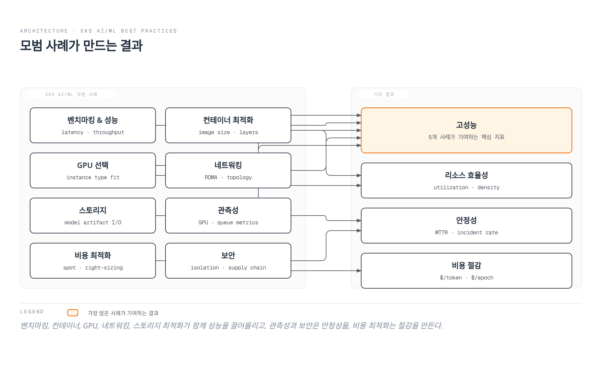
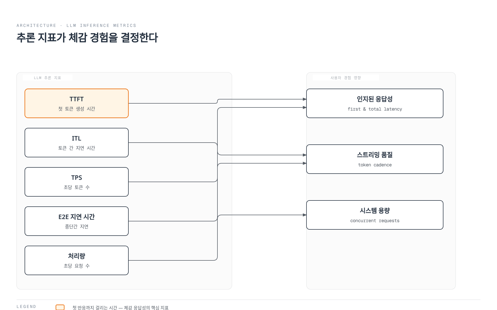
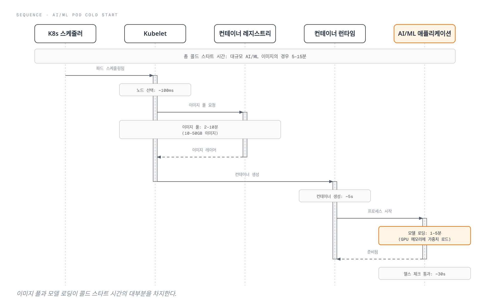

# EKS에서의 AI/ML 모범 사례

> **지원 버전**: Kubernetes 1.31, 1.32, 1.33
> **마지막 업데이트**: 2026년 2월 25일

이 가이드는 Amazon EKS에서 AI/ML 워크로드를 실행하기 위한 종합적인 모범 사례를 다룹니다. 벤치마킹, 컨테이너 최적화, GPU 선택, 네트워킹, 스토리지, 관측성, 비용 최적화, 보안에 대해 알아봅니다.

## 개요

Kubernetes에서 AI/ML 워크로드를 효율적으로 실행하려면 여러 차원에서 신중한 고려가 필요합니다:



## LLM 추론 벤치마킹

벤치마킹은 LLM 추론 서비스의 성능 특성을 이해하는 데 필수적입니다. 적절한 벤치마킹을 통해 스케일링, 리소스 할당, 최적화에 대한 정보에 입각한 결정을 내릴 수 있습니다.

### 핵심 성능 지표

LLM 추론 성능을 평가하기 위한 핵심 지표를 이해하는 것이 중요합니다:



| 지표 | 설명 | 공식 | 목표 범위 |
|------|------|------|----------|
| **TTFT** | 요청부터 첫 토큰 생성까지의 시간 | `t_first_token - t_request` | 대화형 앱에서 < 500ms |
| **ITL** | 연속 토큰 간 평균 시간 | `(t_last_token - t_first_token) / (n_tokens - 1)` | 부드러운 스트리밍을 위해 < 50ms |
| **TPS** | 요청당 초당 생성 토큰 수 | `n_tokens / total_generation_time` | 좋은 UX를 위해 > 20 TPS |
| **E2E 지연 시간** | 요청부터 완료까지 총 시간 | `t_complete - t_request` | 출력 길이에 따라 다름 |
| **처리량** | 초당 처리되는 요청 수 | `total_requests / time_window` | 지연 시간 SLO 내에서 최대화 |

### 벤치마킹 도구

#### inference-perf 도구

AI on EKS의 `inference-perf` 도구는 포괄적인 벤치마킹 기능을 제공합니다:

```bash
# inference-perf 설치
pip install inference-perf

# vLLM 엔드포인트에 대한 기본 벤치마크
inference-perf benchmark \
  --endpoint http://vllm-service:8000/v1/completions \
  --model meta-llama/Llama-3.1-8B-Instruct \
  --num-requests 1000 \
  --concurrency 10 \
  --prompt-length 128 \
  --max-tokens 256
```

다양한 테스트 시나리오 구성:

```yaml
# benchmark-config.yaml
apiVersion: v1
kind: ConfigMap
metadata:
  name: inference-perf-config
data:
  config.yaml: |
    endpoint:
      url: http://vllm-service:8000/v1/completions
      model: meta-llama/Llama-3.1-8B-Instruct

    scenarios:
      baseline:
        description: "단일 요청 기준선"
        concurrency: 1
        num_requests: 100
        prompt_length: 128
        max_tokens: 256

      saturation:
        description: "최대 처리량 측정"
        concurrency: [1, 5, 10, 20, 50, 100]
        num_requests: 500
        prompt_length: 256
        max_tokens: 512

      production:
        description: "프로덕션 트래픽 시뮬레이션"
        concurrency: 20
        num_requests: 10000
        prompt_distribution: "zipf"
        prompt_length_range: [64, 2048]
        max_tokens_range: [128, 1024]

      real_dataset:
        description: "실제 대화 데이터 사용"
        dataset: "ShareGPT"
        num_requests: 5000
        concurrency: 15
```

#### NVIDIA GenAI-Perf 도구

상세한 GPU 수준 메트릭을 위해 NVIDIA의 GenAI-Perf를 사용합니다:

```bash
# GenAI-Perf 설치 (Triton Inference Server의 일부)
pip install genai-perf

# 상세 GPU 메트릭과 함께 벤치마크 실행
genai-perf profile \
  --model llama-3-8b \
  --backend vllm \
  --endpoint localhost:8000 \
  --concurrency 10 \
  --request-count 1000 \
  --streaming \
  --output-format json \
  --profile-export-file results.json
```

### 테스트 시나리오

| 시나리오 | 목적 | 구성 | 주요 관찰 지표 |
|----------|------|------|----------------|
| **기준선** | 단일 요청 성능 확립 | 동시성=1, 100 요청 | TTFT, ITL, E2E 지연 시간 |
| **포화** | 처리량 한계 찾기 | 지연 시간 저하까지 동시성 증가 | 처리량 vs 지연 시간 곡선 |
| **프로덕션 시뮬레이션** | 실제 성능 검증 | 가변 프롬프트, 현실적 동시성 | P50/P95/P99 지연 시간 |
| **실제 데이터셋** | 실제 대화 패턴 테스트 | ShareGPT 또는 도메인 특화 데이터 | 토큰 분포 분석 |
| **긴 컨텍스트** | 컨텍스트 윈도우 처리 테스트 | 4K-128K 토큰 프롬프트 | 메모리 사용량, TTFT 스케일링 |
| **버스트 트래픽** | 오토스케일링 응답 테스트 | 10에서 100 동시성으로 스파이크 | 스케일업 시간, 오류율 |

### 벤치마킹용 Kubernetes Job

```yaml
apiVersion: batch/v1
kind: Job
metadata:
  name: llm-benchmark
  namespace: ai-ml
spec:
  template:
    spec:
      containers:
      - name: benchmark
        image: public.ecr.aws/ai-on-eks/inference-perf:latest
        command:
        - inference-perf
        - benchmark
        - --config
        - /config/benchmark-config.yaml
        - --output
        - /results/benchmark-results.json
        volumeMounts:
        - name: config
          mountPath: /config
        - name: results
          mountPath: /results
        resources:
          requests:
            cpu: "2"
            memory: 4Gi
          limits:
            cpu: "4"
            memory: 8Gi
      volumes:
      - name: config
        configMap:
          name: inference-perf-config
      - name: results
        persistentVolumeClaim:
          claimName: benchmark-results-pvc
      restartPolicy: Never
  backoffLimit: 3
```

### 결과 해석

```bash
# 샘플 벤치마크 출력 분석
{
  "summary": {
    "total_requests": 1000,
    "successful_requests": 998,
    "failed_requests": 2,
    "total_duration_sec": 120.5,
    "requests_per_second": 8.3
  },
  "latency": {
    "ttft_ms": {
      "p50": 245,
      "p95": 512,
      "p99": 890,
      "mean": 298
    },
    "itl_ms": {
      "p50": 32,
      "p95": 48,
      "p99": 72,
      "mean": 35
    },
    "e2e_ms": {
      "p50": 2450,
      "p95": 4200,
      "p99": 6800,
      "mean": 2780
    }
  },
  "throughput": {
    "tokens_per_second": 1245,
    "tokens_per_request_mean": 150
  }
}
```

**성능 가이드라인**:
- TTFT P95 > 1s: 프리필 최적화 또는 배치 크기 조정 고려
- ITL P95 > 100ms: GPU 메모리 압력 확인, 더 작은 배치 크기 고려
- 높은 동시성에서 처리량 감소: GPU 메모리 또는 컴퓨팅 병목
- 지연 시간의 높은 변동성: 노이지 네이버 또는 열 스로틀링 확인

## 컨테이너 시작 최적화

AI/ML 컨테이너는 큰 이미지 크기와 모델 로딩 요구 사항으로 인해 고유한 콜드 스타트 문제에 직면합니다.

### 콜드 스타트 타임라인 분석



### 이미지 크기 분석

일반적인 AI/ML 컨테이너 이미지 구성:

| 구성 요소 | 크기 범위 | 최적화 가능성 |
|-----------|----------|---------------|
| 기본 OS (Ubuntu/Debian) | 100-500MB | slim/distroless 사용 |
| CUDA 런타임 | 2-4GB | runtime 전용 이미지 사용 |
| Python + 의존성 | 1-3GB | 멀티 스테이지 빌드 |
| ML 프레임워크 (PyTorch/TensorFlow) | 2-5GB | 최적화된 빌드 사용 |
| 모델 가중치 | 5-100GB+ | 이미지에서 분리 |
| **총계** | **10-115GB** | **목표: 5-10GB** |

### 전략 1: 모델 아티팩트 분리

모델 가중치를 컨테이너 이미지에서 분리합니다:

```yaml
# 시작 시 S3에서 모델을 로드하는 파드
apiVersion: v1
kind: Pod
metadata:
  name: llm-inference
spec:
  initContainers:
  # 메인 컨테이너 시작 전 S3에서 모델 다운로드
  - name: model-downloader
    image: amazon/aws-cli:latest
    command:
    - sh
    - -c
    - |
      aws s3 sync s3://models-bucket/llama-3-8b /models/llama-3-8b \
        --only-show-errors
      echo "모델 다운로드 완료"
    volumeMounts:
    - name: model-storage
      mountPath: /models
    env:
    - name: AWS_REGION
      value: us-west-2
    resources:
      requests:
        cpu: "2"
        memory: 4Gi

  containers:
  - name: vllm
    image: vllm/vllm-openai:v0.6.0  # 모델 없는 슬림 이미지
    args:
    - --model
    - /models/llama-3-8b
    - --tensor-parallel-size
    - "1"
    volumeMounts:
    - name: model-storage
      mountPath: /models
    resources:
      limits:
        nvidia.com/gpu: 1

  volumes:
  - name: model-storage
    emptyDir:
      sizeLimit: 50Gi

  # 노드 간 공유 모델 캐싱을 위해 EFS 사용
  # - name: model-storage
  #   persistentVolumeClaim:
  #     claimName: models-efs-pvc
```

### 전략 2: 멀티 스테이지 빌드

최소 런타임 이미지를 위한 Dockerfile 최적화:

```dockerfile
# 빌드 스테이지 - 모든 빌드 의존성 포함
FROM nvidia/cuda:12.4.0-devel-ubuntu22.04 AS builder

RUN apt-get update && apt-get install -y \
    python3.11 python3.11-dev python3-pip git \
    && rm -rf /var/lib/apt/lists/*

WORKDIR /build
COPY requirements.txt .
RUN pip3 install --no-cache-dir --target=/install \
    -r requirements.txt

# 런타임 스테이지 - 최소 의존성만
FROM nvidia/cuda:12.4.0-runtime-ubuntu22.04 AS runtime

# 런타임 Python만 설치 (개발 패키지 없음)
RUN apt-get update && apt-get install -y --no-install-recommends \
    python3.11 python3.11-distutils \
    && rm -rf /var/lib/apt/lists/* \
    && ln -s /usr/bin/python3.11 /usr/bin/python

# 빌더에서 설치된 패키지 복사
COPY --from=builder /install /usr/local/lib/python3.11/dist-packages

# 애플리케이션 코드만 복사
COPY src/ /app/
WORKDIR /app

# 보안을 위한 비루트 사용자
RUN useradd -m -u 1000 appuser
USER appuser

ENTRYPOINT ["python", "serve.py"]
```

이미지 크기 비교:

| 접근 방식 | 이미지 크기 | 풀 시간 (1Gbps) |
|-----------|------------|-----------------|
| 단순 (모든 것을 하나의 이미지에) | 45GB | ~6분 |
| 멀티 스테이지 빌드 | 12GB | ~1.5분 |
| 멀티 스테이지 + 외부 모델 | 5GB | ~40초 |

### 전략 3: containerd Snapshotter

지연 풀링을 위한 SOCI (Seekable OCI) snapshotter 사용:

```yaml
# EKS 노드에 SOCI snapshotter 설치
apiVersion: apps/v1
kind: DaemonSet
metadata:
  name: soci-snapshotter-installer
  namespace: kube-system
spec:
  selector:
    matchLabels:
      app: soci-snapshotter
  template:
    metadata:
      labels:
        app: soci-snapshotter
    spec:
      hostPID: true
      hostNetwork: true
      containers:
      - name: installer
        image: public.ecr.aws/soci-workshop/soci-snapshotter:latest
        securityContext:
          privileged: true
        volumeMounts:
        - name: containerd-config
          mountPath: /etc/containerd
        - name: containerd-socket
          mountPath: /run/containerd
      volumes:
      - name: containerd-config
        hostPath:
          path: /etc/containerd
      - name: containerd-socket
        hostPath:
          path: /run/containerd
```

이미지에 대한 SOCI 인덱스 생성:

```bash
# 더 빠른 지연 로딩을 위한 SOCI 인덱스 생성
soci create \
  --ref public.ecr.aws/myrepo/vllm:latest \
  --platform linux/amd64

# ECR에 인덱스 푸시
soci push \
  --ref public.ecr.aws/myrepo/vllm:latest
```

### 전략 4: Bottlerocket에서 이미지 프리페칭

이미지 프리페칭을 위한 Bottlerocket 구성:

```toml
# bottlerocket-settings.toml
[settings.container-registry]
# 노드 시작 시 이미지 미리 풀
[settings.container-registry.credentials]
[settings.container-registry.credentials."public.ecr.aws"]

# 이미지 사전 캐싱 구성
[settings.kubernetes]
# GPU 워크로드를 위한 권한 있는 컨테이너 허용
allowed-unsafe-sysctls = ["net.core.*"]

[settings.bootstrap-containers.prefetch-images]
source = "public.ecr.aws/bottlerocket/bottlerocket-bootstrap-prefetch:latest"
mode = "once"
essential = false
user-data = """
#!/bin/bash
# 노드 부트스트랩 중 AI/ML 이미지 사전 가져오기
ctr images pull public.ecr.aws/myrepo/vllm:v0.6.0
ctr images pull public.ecr.aws/nvidia/cuda:12.4.0-runtime-ubuntu22.04
"""
```

프리페칭이 포함된 Karpenter NodePool:

```yaml
apiVersion: karpenter.sh/v1
kind: NodePool
metadata:
  name: gpu-inference
spec:
  template:
    spec:
      nodeClassRef:
        group: karpenter.k8s.aws
        kind: EC2NodeClass
        name: gpu-bottlerocket
      requirements:
      - key: node.kubernetes.io/instance-type
        operator: In
        values: ["g5.xlarge", "g5.2xlarge", "g5.4xlarge"]
      - key: karpenter.sh/capacity-type
        operator: In
        values: ["on-demand", "spot"]
---
apiVersion: karpenter.k8s.aws/v1
kind: EC2NodeClass
metadata:
  name: gpu-bottlerocket
spec:
  amiSelectorTerms:
  - alias: bottlerocket@latest

  # 이미지 프리페칭을 위한 사용자 정의 데이터
  userData: |
    [settings.bootstrap-containers.prefetch]
    source = "public.ecr.aws/myrepo/image-prefetcher:latest"
    mode = "once"
    essential = false

    [settings.kubernetes.node-labels]
    "ai-ml/images-prefetched" = "true"
```

### 콜드 스타트 최적화 요약

| 기법 | 시작 시간 단축 | 구현 난이도 |
|------|----------------|-------------|
| 모델 분리 | 50-70% | 중간 |
| 멀티 스테이지 빌드 | 30-50% | 낮음 |
| SOCI snapshotter | 60-80% | 중간 |
| 이미지 프리페칭 | 70-90% | 낮음 |
| 통합 접근 방식 | 80-95% | 높음 |

## GPU 인스턴스 선택 가이드

올바른 GPU 인스턴스 유형 선택은 비용 효율적인 AI/ML 워크로드에 중요합니다.

### GPU 인스턴스 비교

| 인스턴스 패밀리 | GPU 유형 | GPU 메모리 | GPU 수 | vCPU | 메모리 | 네트워크 | 사용 사례 | 비용 등급 |
|-----------------|----------|------------|--------|------|--------|----------|-----------|-----------|
| **G5** | NVIDIA A10G | 24GB | 1-8 | 4-192 | 16-768GB | 최대 100 Gbps | 추론, 파인튜닝 | $$ |
| **G5g** | NVIDIA T4G | 16GB | 1-2 | 4-64 | 8-256GB | 최대 25 Gbps | 비용 효율적 추론 | $ |
| **G6** | NVIDIA L4 | 24GB | 1-8 | 4-192 | 16-768GB | 최대 100 Gbps | 추론, 비디오 | $$ |
| **G6e** | NVIDIA L40S | 48GB | 1-8 | 8-384 | 32-1536GB | 최대 100 Gbps | 대규모 모델 추론 | $$$ |
| **P4d** | NVIDIA A100 | 40GB | 8 | 96 | 1152GB | 400 Gbps EFA | 대규모 훈련 | $$$$ |
| **P4de** | NVIDIA A100 | 80GB | 8 | 96 | 1152GB | 400 Gbps EFA | LLM 훈련 | $$$$ |
| **P5** | NVIDIA H100 | 80GB | 8 | 192 | 2048GB | 3200 Gbps EFA | 최첨단 모델 훈련 | $$$$$ |
| **P5e** | NVIDIA H200 | 141GB | 8 | 192 | 2048GB | 3200 Gbps EFA | 최대 규모 모델 | $$$$$ |
| **Trn1** | AWS Trainium | 32GB | 1-16 | 8-128 | 32-512GB | 최대 800 Gbps | 훈련 (최적화) | $$$ |
| **Inf2** | AWS Inferentia2 | 32GB | 1-12 | 4-96 | 16-384GB | 최대 100 Gbps | 추론 (최적화) | $$ |

### 워크로드 기반 선택 가이드

```yaml
# 워크로드 요구 사항에서 인스턴스로의 매핑
workload_selection:

  small_model_inference:  # 모델 < 7B 파라미터
    recommended:
      - g5.xlarge       # 1x A10G, 비용 효율적
      - g6.xlarge       # 1x L4, 최신 세대
      - inf2.xlarge     # 1x Inferentia2, 최고의 가격/성능
    requirements:
      gpu_memory: "8-16GB"
      throughput: "10-50 req/s"
      latency: "< 500ms P95"

  medium_model_inference:  # 모델 7B-30B 파라미터
    recommended:
      - g5.4xlarge      # 1x A10G 24GB
      - g6e.2xlarge     # 1x L40S 48GB
      - inf2.8xlarge    # 1x Inferentia2
    requirements:
      gpu_memory: "24-48GB"
      throughput: "5-20 req/s"
      latency: "< 1s P95"

  large_model_inference:  # 모델 30B-70B 파라미터
    recommended:
      - g5.12xlarge     # 4x A10G (텐서 병렬)
      - g6e.12xlarge    # 4x L40S
      - p4d.24xlarge    # 8x A100 (70B+용)
    requirements:
      gpu_memory: "80-320GB"
      throughput: "1-10 req/s"
      latency: "< 3s P95"

  distributed_training:  # 멀티 노드 훈련
    recommended:
      - p4d.24xlarge    # 8x A100, EFA
      - p5.48xlarge     # 8x H100, EFA
      - trn1.32xlarge   # 16x Trainium
    requirements:
      interconnect: "EFA 필수"
      gpu_memory: "노드당 320GB+"
      scaling: "2-64+ 노드"

  fine_tuning:  # LoRA, QLoRA, 전체 파인튜닝
    recommended:
      - g5.4xlarge      # 소형 모델, LoRA
      - g5.12xlarge     # 중형 모델
      - p4d.24xlarge    # 대형 모델, 전체 파인튜닝
    requirements:
      gpu_memory: "24-640GB"
      training_time: "몇 시간에서 며칠"
```

### 인스턴스 선택 결정 트리

```python
def select_gpu_instance(model_size_b, workload_type, budget):
    """
    요구 사항에 따라 최적의 GPU 인스턴스를 선택합니다.

    Args:
        model_size_b: 수십억 파라미터 단위의 모델 크기
        workload_type: 'inference', 'training', 'fine_tuning'
        budget: 'low', 'medium', 'high'
    """

    # 메모리 추정 (대략): FP16의 경우 파라미터당 2바이트
    required_memory_gb = model_size_b * 2

    if workload_type == 'inference':
        if model_size_b <= 7:
            return 'g5.xlarge' if budget == 'low' else 'g6.xlarge'
        elif model_size_b <= 13:
            return 'g5.2xlarge' if budget == 'low' else 'g6e.2xlarge'
        elif model_size_b <= 30:
            return 'g5.4xlarge' if budget != 'high' else 'g6e.4xlarge'
        elif model_size_b <= 70:
            return 'g5.12xlarge'  # 4-way 텐서 병렬
        else:
            return 'p4d.24xlarge'  # 8-way 텐서 병렬

    elif workload_type == 'training':
        if model_size_b <= 7:
            return 'g5.12xlarge'
        elif model_size_b <= 30:
            return 'p4d.24xlarge'
        else:
            return 'p5.48xlarge'  # 멀티 노드 필요

    elif workload_type == 'fine_tuning':
        # LoRA는 메모리를 ~10배 줄임
        if budget == 'low':
            return 'g5.xlarge'  # 대부분의 모델에서 LoRA
        else:
            return 'g5.4xlarge'  # 소형 모델 전체 파인튜닝
```

## 네트워킹 모범 사례

고성능 네트워킹은 분산 AI/ML 워크로드에 필수적입니다.

### 분산 훈련을 위한 EFA 설정

Elastic Fabric Adapter (EFA)는 멀티 노드 훈련에 필수적인 저지연, 고대역폭 네트워킹을 제공합니다:

```yaml
# EFA 지원 노드 구성
apiVersion: karpenter.k8s.aws/v1
kind: EC2NodeClass
metadata:
  name: efa-training-nodes
spec:
  amiSelectorTerms:
  - alias: al2023@latest

  # EFA는 최적 성능을 위해 배치 그룹 필요
  subnetSelectorTerms:
  - tags:
      karpenter.sh/discovery: my-cluster
      network/efa-enabled: "true"

  # 빠른 로컬 스크래치를 위한 인스턴스 스토어
  instanceStorePolicy: RAID0

  blockDeviceMappings:
  - deviceName: /dev/xvda
    ebs:
      volumeSize: 200Gi
      volumeType: gp3
      iops: 10000
      throughput: 500

  userData: |
    #!/bin/bash
    # EFA 드라이버 설치
    curl -O https://efa-installer.amazonaws.com/aws-efa-installer-latest.tar.gz
    tar -xf aws-efa-installer-latest.tar.gz
    cd aws-efa-installer && ./efa_installer.sh -y

    # EFA 설치 확인
    fi_info -p efa
---
apiVersion: karpenter.sh/v1
kind: NodePool
metadata:
  name: efa-training
spec:
  template:
    spec:
      nodeClassRef:
        group: karpenter.k8s.aws
        kind: EC2NodeClass
        name: efa-training-nodes
      requirements:
      - key: node.kubernetes.io/instance-type
        operator: In
        values: ["p4d.24xlarge", "p5.48xlarge"]
      - key: karpenter.sh/capacity-type
        operator: In
        values: ["on-demand"]
      taints:
      - key: nvidia.com/gpu
        value: "true"
        effect: NoSchedule
```

### NCCL 구성

EFA를 위한 NVIDIA Collective Communication Library (NCCL) 최적화:

```yaml
apiVersion: v1
kind: ConfigMap
metadata:
  name: nccl-config
  namespace: ai-ml
data:
  nccl-env.sh: |
    # EFA 최적화 NCCL 설정
    export NCCL_DEBUG=INFO
    export NCCL_DEBUG_SUBSYS=ALL

    # 노드 간 통신에 EFA 사용
    export FI_PROVIDER=efa
    export FI_EFA_USE_DEVICE_RDMA=1
    export FI_EFA_FORK_SAFE=1

    # P4d/P5 인스턴스 최적화
    export NCCL_ALGO=Ring,Tree
    export NCCL_PROTO=Simple

    # 네트워크 인터페이스 선택
    export NCCL_SOCKET_IFNAME=eth0
    export NCCL_IB_DISABLE=1

    # 대규모 모델을 위한 버퍼 크기
    export NCCL_BUFFSIZE=8388608
    export NCCL_P2P_NET_CHUNKSIZE=524288

    # 타임아웃 설정
    export NCCL_TIMEOUT=1800

    # AWS OFI NCCL 플러그인
    export LD_LIBRARY_PATH=/opt/amazon/efa/lib:$LD_LIBRARY_PATH
    export FI_EFA_ENABLE_SHM_TRANSFER=1
---
apiVersion: v1
kind: Pod
metadata:
  name: distributed-training
spec:
  containers:
  - name: trainer
    image: my-training-image:latest
    command: ["/bin/bash", "-c"]
    args:
    - |
      source /config/nccl-env.sh
      torchrun --nproc_per_node=8 \
               --nnodes=$WORLD_SIZE \
               --node_rank=$RANK \
               --master_addr=$MASTER_ADDR \
               --master_port=29500 \
               train.py
    volumeMounts:
    - name: nccl-config
      mountPath: /config
    - name: shm
      mountPath: /dev/shm
    resources:
      limits:
        nvidia.com/gpu: 8
        vpc.amazonaws.com/efa: 4  # EFA 장치 요청
  volumes:
  - name: nccl-config
    configMap:
      name: nccl-config
  - name: shm
    emptyDir:
      medium: Memory
      sizeLimit: 64Gi
```

### 배치 그룹

최적의 네트워크 성능을 위한 배치 그룹 구성:

```yaml
# 분산 훈련을 위한 클러스터 배치 그룹
apiVersion: karpenter.k8s.aws/v1
kind: EC2NodeClass
metadata:
  name: training-cluster-pg
spec:
  # ... 기타 구성 ...

  # 최저 지연 시간을 위해 클러스터 배치 그룹 사용
  tags:
    aws:ec2:placement-group: training-cluster-pg
---
# AWS CLI를 통한 배치 그룹 생성
# aws ec2 create-placement-group \
#   --group-name training-cluster-pg \
#   --strategy cluster \
#   --tag-specifications 'ResourceType=placement-group,Tags=[{Key=Purpose,Value=ai-training}]'
```

### GPU 트래픽을 위한 보안 그룹 규칙

```yaml
# 분산 훈련을 위한 보안 그룹 구성
# Terraform 또는 CloudFormation을 통해 적용

security_group_rules:
  # 배치 그룹 내 모든 트래픽 허용
  - type: ingress
    from_port: 0
    to_port: 65535
    protocol: tcp
    self: true
    description: "클러스터 내 통신"

  # NCCL 통신 포트
  - type: ingress
    from_port: 29500
    to_port: 29600
    protocol: tcp
    self: true
    description: "PyTorch 분산 훈련"

  # EFA 트래픽 (특정 규칙 필요)
  - type: ingress
    from_port: 0
    to_port: 0
    protocol: "-1"  # 모든 프로토콜
    self: true
    description: "EFA 트래픽"
```

### 추론 엔드포인트용 네트워크 정책

```yaml
apiVersion: networking.k8s.io/v1
kind: NetworkPolicy
metadata:
  name: llm-inference-policy
  namespace: ai-ml
spec:
  podSelector:
    matchLabels:
      app: llm-inference
  policyTypes:
  - Ingress
  - Egress

  ingress:
  # API 게이트웨이에서의 트래픽 허용
  - from:
    - namespaceSelector:
        matchLabels:
          name: api-gateway
    ports:
    - protocol: TCP
      port: 8000

  # kubelet의 헬스 체크 허용
  - from:
    - ipBlock:
        cidr: 10.0.0.0/8
    ports:
    - protocol: TCP
      port: 8000

  egress:
  # DNS 허용
  - to:
    - namespaceSelector: {}
    ports:
    - protocol: UDP
      port: 53

  # 모델 다운로드를 위한 S3 액세스 허용
  - to:
    - ipBlock:
        cidr: 0.0.0.0/0
    ports:
    - protocol: TCP
      port: 443
```

## 스토리지 모범 사례

올바른 스토리지 솔루션 선택은 AI/ML 워크로드 성능에 큰 영향을 미칩니다.

### 스토리지 선택 가이드

| 스토리지 유형 | 처리량 | 지연 시간 | 용량 | 사용 사례 | 비용 |
|--------------|--------|----------|------|-----------|------|
| **인스턴스 스토어** | 최대 7.5 GB/s | < 1ms | 최대 7.6TB | 스크래치 공간, 체크포인트 | 포함 |
| **EBS gp3** | 최대 1 GB/s | 1-2ms | 최대 16TB | 부팅, 소규모 데이터셋 | $ |
| **EBS io2** | 최대 4 GB/s | < 1ms | 최대 64TB | 높은 IOPS 요구 사항 | $$$ |
| **EFS** | 버스팅/프로비저닝 | 2-5ms | 무제한 | 공유 모델, 데이터셋 | $$ |
| **FSx Lustre** | 최대 1+ TB/s | < 1ms | 페타바이트 | 대규모 훈련 데이터셋 | $$$ |
| **S3** | 사실상 무제한 | 50-100ms | 무제한 | 모델 아티팩트, 아카이브 | $ |

### 각 스토리지 유형 사용 시기

```yaml
# 스토리지 결정 매트릭스
storage_recommendations:

  model_weights:
    primary: EFS  # 파드 간 공유
    alternative: S3 + init 컨테이너 다운로드
    reasoning: |
      - 모델은 여러 파드에서 접근 가능해야 함
      - EFS는 캐싱과 함께 공유 액세스 제공
      - S3는 더 저렴하지만 다운로드 시간 필요

  training_datasets:
    small: EBS gp3  # < 500GB, 단일 노드
    medium: EFS  # 500GB-10TB, 멀티 노드 읽기
    large: FSx Lustre  # > 10TB, 높은 처리량
    reasoning: |
      - FSx Lustre는 병렬 파일 시스템 제공
      - 데이터 로딩을 위해 S3에 직접 연결 가능

  checkpoints:
    training: 인스턴스 스토어  # 빠름, 임시
    persistent: S3  # 장기 저장
    reasoning: |
      - 체크포인트는 훈련 중 자주 기록됨
      - 인스턴스 스토어는 가장 낮은 지연 시간 제공
      - 내구성을 위해 S3로 주기적 동기화

  inference_cache:
    kv_cache: 인스턴스 스토어 또는 tmpfs
    model_cache: EFS 또는 로컬 EBS
    reasoning: |
      - KV 캐시는 임시적이며 가장 낮은 지연 시간 필요
      - 모델 캐시는 지속성의 이점을 받음
```

### 모델 캐싱 전략

```yaml
# 공유 모델 캐시용 PVC
apiVersion: v1
kind: PersistentVolumeClaim
metadata:
  name: model-cache-efs
  namespace: ai-ml
spec:
  accessModes:
  - ReadWriteMany  # 모든 추론 파드 간 공유
  storageClassName: efs-sc
  resources:
    requests:
      storage: 500Gi
---
# 모델 캐시 사이드카
apiVersion: v1
kind: Pod
metadata:
  name: llm-inference
spec:
  initContainers:
  # 캐시 확인, 없으면 다운로드
  - name: model-cache-check
    image: amazon/aws-cli:latest
    command:
    - sh
    - -c
    - |
      MODEL_PATH="/models/llama-3-8b"
      if [ ! -f "$MODEL_PATH/config.json" ]; then
        echo "캐시에 모델 없음, 다운로드 중..."
        aws s3 sync s3://models/llama-3-8b $MODEL_PATH
      else
        echo "캐시에서 모델 발견"
      fi
    volumeMounts:
    - name: model-cache
      mountPath: /models

  containers:
  - name: vllm
    image: vllm/vllm-openai:latest
    args:
    - --model
    - /models/llama-3-8b
    volumeMounts:
    - name: model-cache
      mountPath: /models
      readOnly: true  # 추론을 위해 읽기 전용
    resources:
      limits:
        nvidia.com/gpu: 1

  volumes:
  - name: model-cache
    persistentVolumeClaim:
      claimName: model-cache-efs
```

### 훈련을 위한 체크포인트 관리

```yaml
apiVersion: v1
kind: ConfigMap
metadata:
  name: checkpoint-manager
data:
  checkpoint-sync.sh: |
    #!/bin/bash
    # 주기적으로 체크포인트를 S3로 동기화

    LOCAL_CKPT_DIR="/scratch/checkpoints"
    S3_CKPT_PATH="s3://training-checkpoints/${JOB_NAME}"
    SYNC_INTERVAL=1800  # 30분

    while true; do
      sleep $SYNC_INTERVAL

      # 최신 체크포인트 찾기
      LATEST=$(ls -t $LOCAL_CKPT_DIR/checkpoint-* 2>/dev/null | head -1)

      if [ -n "$LATEST" ]; then
        echo "$LATEST를 S3로 동기화 중..."
        aws s3 cp --recursive $LATEST $S3_CKPT_PATH/$(basename $LATEST)

        # 로컬에 마지막 3개 체크포인트만 유지
        ls -t $LOCAL_CKPT_DIR/checkpoint-* | tail -n +4 | xargs rm -rf
      fi
    done
---
apiVersion: v1
kind: Pod
metadata:
  name: training-job
spec:
  containers:
  - name: trainer
    image: training-image:latest
    volumeMounts:
    - name: scratch
      mountPath: /scratch
    env:
    - name: CHECKPOINT_DIR
      value: /scratch/checkpoints

  - name: checkpoint-sync
    image: amazon/aws-cli:latest
    command: ["/scripts/checkpoint-sync.sh"]
    volumeMounts:
    - name: scratch
      mountPath: /scratch
      readOnly: true
    - name: scripts
      mountPath: /scripts
    env:
    - name: JOB_NAME
      valueFrom:
        fieldRef:
          fieldPath: metadata.name

  volumes:
  - name: scratch
    emptyDir:
      medium: Memory  # 또는 인스턴스 스토어 사용
      sizeLimit: 100Gi
  - name: scripts
    configMap:
      name: checkpoint-manager
      defaultMode: 0755
```

### FSx for Lustre 설정

```yaml
# FSx Lustre용 StorageClass
apiVersion: storage.k8s.io/v1
kind: StorageClass
metadata:
  name: fsx-lustre-sc
provisioner: fsx.csi.aws.com
parameters:
  subnetId: subnet-0123456789abcdef0
  securityGroupIds: sg-0123456789abcdef0
  deploymentType: PERSISTENT_2
  perUnitStorageThroughput: "250"  # TiB당 MB/s
  dataCompressionType: LZ4

  # 투명한 데이터 액세스를 위해 S3에 연결
  s3ImportPath: s3://training-data
  s3ExportPath: s3://training-data
  autoImportPolicy: NEW_CHANGED_DELETED
---
apiVersion: v1
kind: PersistentVolumeClaim
metadata:
  name: training-data-fsx
spec:
  accessModes:
  - ReadWriteMany
  storageClassName: fsx-lustre-sc
  resources:
    requests:
      storage: 2400Gi  # 최소 1.2TiB, 2.4TiB 단위로 증가
```

## AI/ML 관측성

포괄적인 관측성은 대규모 AI/ML 워크로드 운영에 필수적입니다.

### NVIDIA DCGM Exporter 설정

GPU 메트릭을 위한 DCGM exporter 배포:

```yaml
apiVersion: apps/v1
kind: DaemonSet
metadata:
  name: dcgm-exporter
  namespace: monitoring
spec:
  selector:
    matchLabels:
      app: dcgm-exporter
  template:
    metadata:
      labels:
        app: dcgm-exporter
      annotations:
        prometheus.io/scrape: "true"
        prometheus.io/port: "9400"
    spec:
      nodeSelector:
        nvidia.com/gpu.present: "true"
      tolerations:
      - key: nvidia.com/gpu
        operator: Exists
        effect: NoSchedule

      containers:
      - name: dcgm-exporter
        image: nvcr.io/nvidia/k8s/dcgm-exporter:3.3.5-3.4.0-ubuntu22.04
        ports:
        - containerPort: 9400
          name: metrics
        env:
        - name: DCGM_EXPORTER_LISTEN
          value: ":9400"
        - name: DCGM_EXPORTER_KUBERNETES
          value: "true"
        - name: DCGM_EXPORTER_COLLECTORS
          value: "/etc/dcgm-exporter/dcp-metrics-included.csv"
        securityContext:
          runAsNonRoot: false
          runAsUser: 0
          capabilities:
            add: ["SYS_ADMIN"]
        volumeMounts:
        - name: pod-resources
          mountPath: /var/lib/kubelet/pod-resources
          readOnly: true
        resources:
          requests:
            cpu: 100m
            memory: 128Mi
          limits:
            cpu: 500m
            memory: 512Mi

      volumes:
      - name: pod-resources
        hostPath:
          path: /var/lib/kubelet/pod-resources
---
apiVersion: v1
kind: Service
metadata:
  name: dcgm-exporter
  namespace: monitoring
  labels:
    app: dcgm-exporter
spec:
  type: ClusterIP
  ports:
  - port: 9400
    targetPort: 9400
    name: metrics
  selector:
    app: dcgm-exporter
```

### GPU 메트릭 수집

모니터링할 주요 GPU 메트릭:

```yaml
# Prometheus Operator용 ServiceMonitor
apiVersion: monitoring.coreos.com/v1
kind: ServiceMonitor
metadata:
  name: dcgm-exporter
  namespace: monitoring
spec:
  selector:
    matchLabels:
      app: dcgm-exporter
  endpoints:
  - port: metrics
    interval: 15s
    path: /metrics
---
# GPU 알림용 PrometheusRule
apiVersion: monitoring.coreos.com/v1
kind: PrometheusRule
metadata:
  name: gpu-alerts
  namespace: monitoring
spec:
  groups:
  - name: gpu.rules
    rules:
    # GPU 사용률 알림
    - alert: GPUHighUtilization
      expr: DCGM_FI_DEV_GPU_UTIL > 95
      for: 10m
      labels:
        severity: warning
      annotations:
        summary: "GPU {{ $labels.gpu }} 사용률이 95% 이상"
        description: "GPU 사용률이 10분 동안 95% 이상 유지됨"

    # GPU 메모리 알림
    - alert: GPUMemoryAlmostFull
      expr: (DCGM_FI_DEV_FB_USED / DCGM_FI_DEV_FB_TOTAL) > 0.95
      for: 5m
      labels:
        severity: warning
      annotations:
        summary: "GPU {{ $labels.gpu }} 메모리 사용량이 95% 이상"

    # GPU 온도 알림
    - alert: GPUHighTemperature
      expr: DCGM_FI_DEV_GPU_TEMP > 80
      for: 5m
      labels:
        severity: warning
      annotations:
        summary: "GPU {{ $labels.gpu }} 온도가 80C 이상"

    - alert: GPUCriticalTemperature
      expr: DCGM_FI_DEV_GPU_TEMP > 90
      for: 1m
      labels:
        severity: critical
      annotations:
        summary: "GPU {{ $labels.gpu }} 온도 위험 (>90C)"

    # GPU 오류
    - alert: GPUXidErrors
      expr: increase(DCGM_FI_DEV_XID_ERRORS[5m]) > 0
      labels:
        severity: critical
      annotations:
        summary: "GPU {{ $labels.gpu }} XID 오류 감지됨"
```

### 주요 GPU 메트릭 참조

| 메트릭 | 설명 | 알림 임계값 |
|--------|------|-------------|
| `DCGM_FI_DEV_GPU_UTIL` | GPU 컴퓨팅 사용률 % | > 95% 지속 |
| `DCGM_FI_DEV_MEM_COPY_UTIL` | 메모리 복사 사용률 % | > 90% 지속 |
| `DCGM_FI_DEV_FB_USED` | 사용된 프레임 버퍼 메모리 (바이트) | > 전체의 95% |
| `DCGM_FI_DEV_GPU_TEMP` | GPU 온도 (섭씨) | > 80C 경고, > 90C 심각 |
| `DCGM_FI_DEV_POWER_USAGE` | 전력 소비 (와트) | TDP 한계 근접 |
| `DCGM_FI_DEV_SM_CLOCK` | SM 클럭 주파수 (MHz) | 스로틀링 감지 |
| `DCGM_FI_DEV_XID_ERRORS` | XID 오류 횟수 | 모든 증가 |
| `DCGM_FI_DEV_NVLINK_BANDWIDTH_TOTAL` | NVLink 대역폭 | 예상 미만 |

### 모델 서빙 메트릭

```yaml
# vLLM 메트릭 구성
apiVersion: v1
kind: ConfigMap
metadata:
  name: vllm-metrics-config
data:
  prometheus.yaml: |
    # vLLM은 /metrics 엔드포인트에서 메트릭 노출
    # 모니터링할 주요 메트릭:

    # 요청 메트릭
    # - vllm:num_requests_running - 현재 실행 중인 요청
    # - vllm:num_requests_waiting - 대기 중인 요청
    # - vllm:request_success_total - 성공한 요청
    # - vllm:request_prompt_tokens_total - 처리된 입력 토큰
    # - vllm:request_generation_tokens_total - 생성된 출력 토큰

    # 지연 시간 메트릭
    # - vllm:time_to_first_token_seconds - TTFT 히스토그램
    # - vllm:time_per_output_token_seconds - ITL 히스토그램
    # - vllm:e2e_request_latency_seconds - 종단간 지연 시간

    # GPU 메트릭
    # - vllm:gpu_cache_usage_perc - KV 캐시 사용률
    # - vllm:gpu_prefix_cache_hit_rate - 프리픽스 캐싱 효율성

    # 배치 메트릭
    # - vllm:num_preemptions_total - 요청 선점
    # - vllm:iteration_tokens_total - 반복당 토큰
---
apiVersion: monitoring.coreos.com/v1
kind: PrometheusRule
metadata:
  name: vllm-alerts
  namespace: ai-ml
spec:
  groups:
  - name: vllm.rules
    rules:
    - alert: vLLMHighQueueDepth
      expr: vllm:num_requests_waiting > 50
      for: 5m
      labels:
        severity: warning
      annotations:
        summary: "vLLM 요청 대기열 깊이가 높음"
        description: "50개 이상의 요청이 처리 대기 중"

    - alert: vLLMHighTTFT
      expr: histogram_quantile(0.95, rate(vllm:time_to_first_token_seconds_bucket[5m])) > 2
      for: 10m
      labels:
        severity: warning
      annotations:
        summary: "vLLM TTFT P95가 2초 초과"

    - alert: vLLMKVCacheFull
      expr: vllm:gpu_cache_usage_perc > 0.95
      for: 5m
      labels:
        severity: critical
      annotations:
        summary: "vLLM KV 캐시가 거의 가득 참"
        description: "KV 캐시 사용량이 95% 이상, 요청이 거부될 수 있음"
```

### Grafana 대시보드 구성

```json
{
  "dashboard": {
    "title": "AI/ML 워크로드 개요",
    "panels": [
      {
        "title": "노드별 GPU 사용률",
        "type": "timeseries",
        "targets": [
          {
            "expr": "DCGM_FI_DEV_GPU_UTIL",
            "legendFormat": "{{node}}-GPU{{gpu}}"
          }
        ]
      },
      {
        "title": "GPU 메모리 사용량",
        "type": "gauge",
        "targets": [
          {
            "expr": "DCGM_FI_DEV_FB_USED / DCGM_FI_DEV_FB_TOTAL * 100",
            "legendFormat": "{{node}}-GPU{{gpu}}"
          }
        ],
        "fieldConfig": {
          "defaults": {
            "thresholds": {
              "steps": [
                {"color": "green", "value": 0},
                {"color": "yellow", "value": 70},
                {"color": "red", "value": 90}
              ]
            }
          }
        }
      },
      {
        "title": "추론 지연 시간 (TTFT P95)",
        "type": "timeseries",
        "targets": [
          {
            "expr": "histogram_quantile(0.95, rate(vllm:time_to_first_token_seconds_bucket[5m]))",
            "legendFormat": "{{pod}}"
          }
        ]
      },
      {
        "title": "초당 요청 수",
        "type": "stat",
        "targets": [
          {
            "expr": "sum(rate(vllm:request_success_total[5m]))",
            "legendFormat": "총 RPS"
          }
        ]
      },
      {
        "title": "초당 토큰 수",
        "type": "timeseries",
        "targets": [
          {
            "expr": "sum(rate(vllm:request_generation_tokens_total[5m]))",
            "legendFormat": "생성 TPS"
          }
        ]
      },
      {
        "title": "GPU 온도",
        "type": "timeseries",
        "targets": [
          {
            "expr": "DCGM_FI_DEV_GPU_TEMP",
            "legendFormat": "{{node}}-GPU{{gpu}}"
          }
        ],
        "fieldConfig": {
          "defaults": {
            "custom": {
              "thresholdsStyle": {
                "mode": "line"
              }
            },
            "thresholds": {
              "steps": [
                {"color": "green", "value": 0},
                {"color": "yellow", "value": 75},
                {"color": "red", "value": 85}
              ]
            }
          }
        }
      }
    ]
  }
}
```

## 비용 최적화

비용 최적화 전략을 구현하면 AI/ML 인프라 비용을 크게 줄일 수 있습니다.

### 추론을 위한 스팟 인스턴스

```yaml
# 추론을 위한 스팟을 포함한 Karpenter NodePool
apiVersion: karpenter.sh/v1
kind: NodePool
metadata:
  name: inference-spot
spec:
  template:
    spec:
      nodeClassRef:
        group: karpenter.k8s.aws
        kind: EC2NodeClass
        name: inference-ec2
      requirements:
      - key: node.kubernetes.io/instance-type
        operator: In
        values:
        - g5.xlarge
        - g5.2xlarge
        - g6.xlarge
        - g6.2xlarge
      - key: karpenter.sh/capacity-type
        operator: In
        values: ["spot"]  # 스팟 선호
      - key: kubernetes.io/arch
        operator: In
        values: ["amd64"]

      taints:
      - key: nvidia.com/gpu
        value: "true"
        effect: NoSchedule

  # 스팟을 위한 중단 설정
  disruption:
    consolidationPolicy: WhenEmptyOrUnderutilized
    consolidateAfter: 1m
    budgets:
    - nodes: "20%"  # 노드의 20% 중단 허용

  limits:
    cpu: 1000
    memory: 4000Gi
    nvidia.com/gpu: 100
---
# 우아한 스팟 종료를 위한 파드 구성
apiVersion: v1
kind: Pod
metadata:
  name: inference-pod
spec:
  terminationGracePeriodSeconds: 120  # 스팟 인터럽션 처리
  containers:
  - name: inference
    image: vllm/vllm-openai:latest
    lifecycle:
      preStop:
        exec:
          command:
          - /bin/sh
          - -c
          - |
            # 요청을 우아하게 드레인
            curl -X POST localhost:8000/drain
            sleep 30
```

### Karpenter 통합 정책

```yaml
apiVersion: karpenter.sh/v1
kind: NodePool
metadata:
  name: gpu-workloads
spec:
  template:
    spec:
      nodeClassRef:
        group: karpenter.k8s.aws
        kind: EC2NodeClass
        name: gpu-nodes
      requirements:
      - key: node.kubernetes.io/instance-type
        operator: In
        values:
        - g5.xlarge
        - g5.2xlarge
        - g5.4xlarge
        - g5.8xlarge
        - g5.12xlarge
      - key: karpenter.sh/capacity-type
        operator: In
        values: ["spot", "on-demand"]

  disruption:
    # 미활용 노드 통합
    consolidationPolicy: WhenEmptyOrUnderutilized
    consolidateAfter: 5m

    # 피크 시간 중 중단 방지를 위한 예산
    budgets:
    - nodes: "0"
      schedule: "0 9-17 * * 1-5"  # 업무 시간 중 통합 없음
      duration: 8h
    - nodes: "30%"  # 비피크 시간에 30% 허용

  # 비용 최적화를 위한 가중치
  weight: 100  # 높은 가중치 = 스케줄링 선호
```

### 적정 크기 조정 권장 사항

```yaml
# 추론 워크로드를 위한 VPA
apiVersion: autoscaling.k8s.io/v1
kind: VerticalPodAutoscaler
metadata:
  name: llm-inference-vpa
  namespace: ai-ml
spec:
  targetRef:
    apiVersion: apps/v1
    kind: Deployment
    name: llm-inference
  updatePolicy:
    updateMode: "Off"  # 권장 사항만
  resourcePolicy:
    containerPolicies:
    - containerName: inference
      minAllowed:
        cpu: "2"
        memory: 8Gi
      maxAllowed:
        cpu: "16"
        memory: 64Gi
      controlledResources: ["cpu", "memory"]
      controlledValues: RequestsAndLimits
---
# GPU 사용률 분석 및 적정 크기 조정 권장 스크립트
apiVersion: v1
kind: ConfigMap
metadata:
  name: rightsizing-analysis
data:
  analyze.sh: |
    #!/bin/bash
    # Prometheus에서 GPU 사용률 쿼리

    echo "=== GPU 적정 크기 조정 분석 ==="

    # 지난 7일간 평균 GPU 사용률
    GPU_UTIL=$(curl -s "http://prometheus:9090/api/v1/query" \
      --data-urlencode 'query=avg_over_time(DCGM_FI_DEV_GPU_UTIL[7d])' \
      | jq -r '.data.result[0].value[1]')

    # 평균 GPU 메모리 사용률
    GPU_MEM=$(curl -s "http://prometheus:9090/api/v1/query" \
      --data-urlencode 'query=avg_over_time((DCGM_FI_DEV_FB_USED/DCGM_FI_DEV_FB_TOTAL)[7d])' \
      | jq -r '.data.result[0].value[1]')

    echo "평균 GPU 사용률: ${GPU_UTIL}%"
    echo "평균 GPU 메모리: ${GPU_MEM}%"

    # 권장 사항
    if (( $(echo "$GPU_UTIL < 30" | bc -l) )); then
      echo "권장: 더 작은 GPU 인스턴스 또는 GPU 공유 고려"
    elif (( $(echo "$GPU_UTIL > 90" | bc -l) )); then
      echo "권장: 더 큰 GPU 인스턴스 또는 스케일 아웃 고려"
    fi

    if (( $(echo "$GPU_MEM < 50" | bc -l) )); then
      echo "권장: GPU 메모리가 적은 인스턴스 고려"
    elif (( $(echo "$GPU_MEM > 90" | bc -l) )); then
      echo "권장: GPU 메모리가 많은 인스턴스 고려"
    fi
```

### 비용 비교 및 Savings Plans

| 전략 | 일반적인 절감 | 구현 복잡도 | 적합한 용도 |
|------|--------------|-------------|-------------|
| 스팟 인스턴스 | 60-90% | 중간 | 상태 비저장 추론 |
| Savings Plans (1년) | 30-40% | 낮음 | 기준선 용량 |
| Savings Plans (3년) | 50-60% | 낮음 | 안정적인 워크로드 |
| Reserved Instances | 40-70% | 중간 | 예측 가능한 사용량 |
| Karpenter 통합 | 20-40% | 낮음 | 가변적인 워크로드 |
| GPU 공유 (MIG/MPS) | 30-50% | 높음 | 소규모 모델 |
| 적정 크기 조정 | 20-50% | 중간 | 과다 프로비저닝된 경우 |

```yaml
# 비용 최적화 배포 전략 예시
apiVersion: apps/v1
kind: Deployment
metadata:
  name: llm-inference-cost-optimized
spec:
  replicas: 10
  strategy:
    type: RollingUpdate
    rollingUpdate:
      maxSurge: 2
      maxUnavailable: 1
  template:
    spec:
      # 가용성을 위한 토폴로지 분산
      topologySpreadConstraints:
      - maxSkew: 2
        topologyKey: topology.kubernetes.io/zone
        whenUnsatisfiable: ScheduleAnyway
        labelSelector:
          matchLabels:
            app: llm-inference

      # 스팟 선호, 온디맨드로 폴백
      affinity:
        nodeAffinity:
          preferredDuringSchedulingIgnoredDuringExecution:
          - weight: 100
            preference:
              matchExpressions:
              - key: karpenter.sh/capacity-type
                operator: In
                values: ["spot"]
          - weight: 50
            preference:
              matchExpressions:
              - key: karpenter.sh/capacity-type
                operator: In
                values: ["on-demand"]

      containers:
      - name: inference
        resources:
          requests:
            nvidia.com/gpu: 1
            cpu: "4"
            memory: 16Gi
          limits:
            nvidia.com/gpu: 1
            cpu: "8"
            memory: 32Gi
```

## 보안 고려 사항

민감한 데이터나 귀중한 모델을 다루는 AI/ML 워크로드를 배포할 때 보안은 매우 중요합니다.

### 모델 액세스 제어

```yaml
# S3 모델 액세스를 위한 IRSA
apiVersion: v1
kind: ServiceAccount
metadata:
  name: model-loader
  namespace: ai-ml
  annotations:
    eks.amazonaws.com/role-arn: arn:aws:iam::123456789012:role/ModelLoaderRole
---
# 모델 액세스를 위한 IAM 정책 (Terraform으로 적용)
# {
#   "Version": "2012-10-17",
#   "Statement": [
#     {
#       "Effect": "Allow",
#       "Action": [
#         "s3:GetObject",
#         "s3:ListBucket"
#       ],
#       "Resource": [
#         "arn:aws:s3:::models-bucket",
#         "arn:aws:s3:::models-bucket/*"
#       ],
#       "Condition": {
#         "StringEquals": {
#           "aws:ResourceTag/Environment": "production"
#         }
#       }
#     }
#   ]
# }
---
# IRSA를 사용하는 파드
apiVersion: v1
kind: Pod
metadata:
  name: inference-pod
spec:
  serviceAccountName: model-loader
  containers:
  - name: inference
    image: vllm/vllm-openai:latest
    # AWS SDK가 자동으로 IRSA 자격 증명 사용
```

### API 키를 위한 시크릿 관리

```yaml
# HuggingFace/NGC 토큰을 위한 External Secrets Operator
apiVersion: external-secrets.io/v1beta1
kind: ExternalSecret
metadata:
  name: model-registry-secrets
  namespace: ai-ml
spec:
  refreshInterval: 1h
  secretStoreRef:
    name: aws-secretsmanager
    kind: ClusterSecretStore
  target:
    name: model-registry-credentials
    creationPolicy: Owner
  data:
  - secretKey: HUGGING_FACE_HUB_TOKEN
    remoteRef:
      key: ai-ml/huggingface-token
      property: token
  - secretKey: NGC_API_KEY
    remoteRef:
      key: ai-ml/ngc-api-key
      property: key
---
# 외부 시크릿을 사용하는 파드
apiVersion: v1
kind: Pod
metadata:
  name: model-downloader
spec:
  containers:
  - name: downloader
    image: python:3.11-slim
    command: ["python", "download_model.py"]
    env:
    - name: HUGGING_FACE_HUB_TOKEN
      valueFrom:
        secretKeyRef:
          name: model-registry-credentials
          key: HUGGING_FACE_HUB_TOKEN
    - name: NGC_API_KEY
      valueFrom:
        secretKeyRef:
          name: model-registry-credentials
          key: NGC_API_KEY
    securityContext:
      readOnlyRootFilesystem: true
      runAsNonRoot: true
      runAsUser: 1000
      allowPrivilegeEscalation: false
      capabilities:
        drop: ["ALL"]
```

### 추론 엔드포인트를 위한 네트워크 정책

```yaml
# LLM 추론을 위한 엄격한 네트워크 정책
apiVersion: networking.k8s.io/v1
kind: NetworkPolicy
metadata:
  name: llm-inference-strict
  namespace: ai-ml
spec:
  podSelector:
    matchLabels:
      app: llm-inference
  policyTypes:
  - Ingress
  - Egress

  ingress:
  # API 게이트웨이 네임스페이스에서만 허용
  - from:
    - namespaceSelector:
        matchLabels:
          name: api-gateway
      podSelector:
        matchLabels:
          app: gateway
    ports:
    - protocol: TCP
      port: 8000

  # Prometheus 스크래핑 허용
  - from:
    - namespaceSelector:
        matchLabels:
          name: monitoring
      podSelector:
        matchLabels:
          app: prometheus
    ports:
    - protocol: TCP
      port: 8000

  egress:
  # DNS 해석
  - to:
    - namespaceSelector: {}
      podSelector:
        matchLabels:
          k8s-app: kube-dns
    ports:
    - protocol: UDP
      port: 53

  # 다른 모든 이그레스 차단 (모델은 미리 로드되어야 함)
  # 외부 API 호출이 필요한 경우 특정 규칙 추가
---
# 파드 보안 표준
apiVersion: v1
kind: Pod
metadata:
  name: secure-inference
spec:
  securityContext:
    runAsNonRoot: true
    runAsUser: 1000
    runAsGroup: 1000
    fsGroup: 1000
    seccompProfile:
      type: RuntimeDefault

  containers:
  - name: inference
    image: vllm/vllm-openai:latest
    securityContext:
      allowPrivilegeEscalation: false
      readOnlyRootFilesystem: false  # vLLM은 쓰기 액세스 필요
      capabilities:
        drop: ["ALL"]

    volumeMounts:
    - name: model-cache
      mountPath: /models
      readOnly: true
    - name: tmp
      mountPath: /tmp
    - name: cache
      mountPath: /.cache

  volumes:
  - name: model-cache
    persistentVolumeClaim:
      claimName: models-pvc
      readOnly: true
  - name: tmp
    emptyDir:
      sizeLimit: 10Gi
  - name: cache
    emptyDir:
      sizeLimit: 5Gi
```

### 모델 액세스 감사 로깅

```yaml
# 모델 액세스 감사를 위한 CloudWatch 로깅
apiVersion: v1
kind: ConfigMap
metadata:
  name: fluent-bit-config
  namespace: logging
data:
  fluent-bit.conf: |
    [SERVICE]
        Parsers_File parsers.conf

    [INPUT]
        Name              tail
        Tag               inference.access
        Path              /var/log/containers/llm-inference*.log
        Parser            docker
        Mem_Buf_Limit     50MB
        Skip_Long_Lines   On

    [FILTER]
        Name              grep
        Match             inference.access
        Regex             log .*"request".*

    [OUTPUT]
        Name              cloudwatch_logs
        Match             inference.access
        region            us-west-2
        log_group_name    /eks/ai-ml/inference-audit
        log_stream_prefix inference-
        auto_create_group true
```

## 참고 자료

- [AI on EKS - 모범 사례 및 블루프린트](https://awslabs.github.io/ai-on-eks/)
- [NVIDIA GPU Operator 문서](https://docs.nvidia.com/datacenter/cloud-native/gpu-operator/overview.html)
- [Amazon EKS 모범 사례 가이드 - AI/ML](https://aws.github.io/aws-eks-best-practices/machine-learning/)
- [vLLM 문서](https://docs.vllm.ai/)
- [NVIDIA DCGM 문서](https://docs.nvidia.com/datacenter/dcgm/latest/)
- [Karpenter 문서](https://karpenter.sh/)
- [EFA 사용자 가이드](https://docs.aws.amazon.com/AWSEC2/latest/UserGuide/efa.html)
- [FSx for Lustre 사용자 가이드](https://docs.aws.amazon.com/fsx/latest/LustreGuide/)

---

**퀴즈**: [AI/ML 모범 사례 퀴즈](../quizzes/ai-ml/07-ai-ml-best-practices-quiz.md)로 이해도를 테스트해 보세요.
