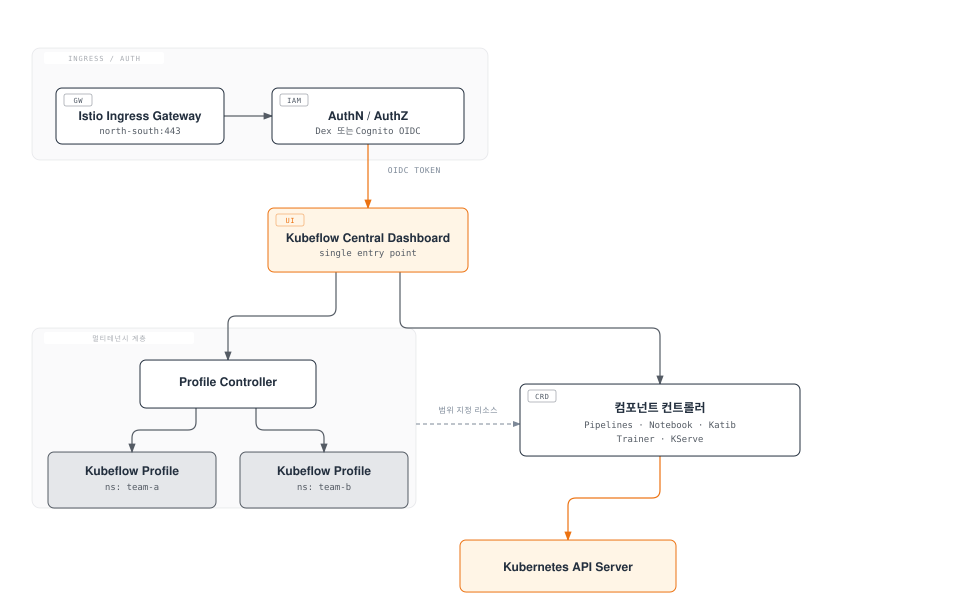

# Part 1: EKS에서의 Kubeflow 아키텍처와 설치

> **지원 버전**: Kubeflow Community Distribution 26.03 (Kubeflow Pipelines 2.16.0, Katib 0.19.0), Kubernetes 1.34+
> **마지막 업데이트**: 2026년 8월 19일

## 실습 환경 준비

이 문서의 예제를 따라 하려면 다음 도구와 환경이 필요합니다.

### 필요한 도구

* kubectl v1.34 이상
* 동작 중인 Amazon EKS 클러스터
* 매니페스트 기반 배포를 위한 kustomize (최신 kubectl에 내장되어 있거나 별도 설치)
* Terraform 기반 배포 경로를 사용할 경우 Terraform
* S3 또는 RDS에 접근해야 하는 Pod를 위한 IAM 역할(IRSA 또는 EKS Pod Identity)
* Dex 대신 Cognito로 클러스터 인증을 구성할 경우 Amazon Cognito 사용자 풀

## Kubeflow란 무엇인가

Kubeflow는 Kubernetes 위에서 네이티브로 동작하는 오픈소스 머신러닝 플랫폼입니다. 단일 도구가 아니라, 독립적으로 개발된 여러 컴포넌트를 하나의 설치와 하나의 Central Dashboard 아래 묶어놓은 배포판(distribution)입니다.

- **Kubeflow Pipelines** — 여러 단계로 구성된 ML 워크플로를 컨테이너화된 단계들의 방향성 비순환 그래프(DAG)로 오케스트레이션합니다.
- **Notebooks** — Jupyter(및 다른) 노트북 서버를 사용자 네임스페이스 범위 내 Kubernetes Pod로 프로비저닝합니다.
- **Katib** — 하이퍼파라미터 튜닝과 신경망 구조 탐색(NAS)을 Kubernetes 네이티브 Job으로 실행합니다.
- **Kubeflow Trainer** — 분산 학습 Job을 스케줄링합니다 (레거시 Training Operator와 그 후속 버전인 v2를 모두 이 시리즈에서 다룹니다).
- **KServe** — 학습된 모델을 확장 가능한 추론 엔드포인트로 서빙하며, 대시보드 안의 전용 웹앱을 통해서도 제공됩니다.

핵심 가치는 이 모든 컴포넌트가 동일한 Kubernetes API, 동일한 RBAC·네임스페이스 모델, 동일한 하부 컴퓨트 위에서 동작한다는 점입니다. 즉 이미 Kubernetes를 운영하는 플랫폼 팀이라면 ML 전용 워크로드를 위해 별도의 두 번째 스택을 구축할 필요가 없습니다.

### CNCF 졸업 — 2026년 8월 17일

2026년 8월 17일, CNCF(Cloud Native Computing Foundation)는 [Kubeflow가 졸업(Graduated) 단계에 도달했다고 발표했습니다](https://www.cncf.io/announcements/2026/08/17/cncf-announces-kubeflows-graduation-solidifying-the-standard-for-cloud-native-ai-operations/). 졸업은 CNCF의 최고 성숙도 등급으로, 광범위한 프로덕션 도입, 건강한 다중 벤더 기여자 기반, 견고한 거버넌스를 입증한 프로젝트에만 부여됩니다. Kubeflow는 2017년 Google에서 시작되어 2023년 CNCF Incubating 프로젝트로 편입되었고, 졸업에 도달하기 위해 독립적인 제3자 보안 감사를 통과하고 프로젝트 거버넌스를 위한 공식 스티어링 커미티를 구성했습니다. Kubeflow 도입을 검토하는 플랫폼 팀에게 이는 의미 있는 신호입니다 — 더 이상 초기 단계의 베팅이 아니라, CNCF가 규제 산업의 프로덕션 AI 워크로드에도 적합하다고 판단할 만큼 안정적인 프로젝트로 인정받았다는 뜻입니다.

## 릴리스 모델과 현재 버전

Kubeflow 프로젝트 자체가 유지하는 레퍼런스 배포판인 **Kubeflow Community Distribution**(AWS가 `kubeflow-manifests`로 패키징하는 벤더 배포판과는 별개)은 **캘린더 버전(`YY.MM.patch`)**을 사용하며, 연 2회 정도 기본 릴리스를 냅니다. 이 글을 쓰는 시점의 기본 릴리스는 **26.03**이며, 다음 버전들을 함께 묶어 배포합니다.

| 컴포넌트 | 26.03 버전 |
| --- | --- |
| Kubeflow Pipelines | 2.16.0 |
| KServe 웹앱 | 0.16.1 |
| Training Operator (레거시 v1) | 1.9.2 |
| Kubeflow Trainer (v2) | v2.1.0 |
| Katib | 0.19.0 |
| Notebooks | v2 출시를 앞둔 상태 |

이후 나온 패치 릴리스 **26.03.1**은 이 중 일부를 더 올렸습니다(Kubeflow Pipelines 2.16.1, KServe 웹앱 v0.18.0, Kubeflow Trainer v2.2.0, Notebooks의 v2 `workspaces`가 베타 단계 진입). 26.03 자체가 항상 최신이라고 가정하지 말고, [Kubeflow Community Distribution 릴리스 목록](https://github.com/kubeflow/community-distribution/releases)에서 현재 패치 레벨을 확인하세요.

여기서 짚어야 할 뉘앙스가 하나 있습니다. **Kubeflow Trainer v2**는 새로운 `TrainJob`, `ClusterTrainingRuntime`, `TrainingRuntime` 커스텀 리소스를 중심으로 구축된, 26.03에서 1.9.2로 배포된 레거시 Training Operator(v1)의 프로젝트 공식 후속 버전입니다. 전환기 동안 두 버전은 나란히 존재합니다. 이 시리즈의 Part 5에서 Trainer v2의 API와 마이그레이션 경로를 깊이 다룹니다. 설치에 초점을 맞춘 이번 Part에서는, 배포판의 Training Operator 버전 번호만으로는 실제로 어떤 학습 API를 대상으로 Job을 작성하게 될지 전부 알 수 없다는 점을 기억하는 것으로 충분합니다.

## 컴포넌트 아키텍처

Kubeflow의 아키텍처는 모든 컴포넌트가 컨트롤러와 CRD 집합으로서 대화하는 공유 Kubernetes API 서버를 중심으로 하며, Istio 기반의 멀티테넌시 계층이 네임스페이스 격리를 제공하고 Central Dashboard가 단일 UI 진입점을 제공합니다.

몇 가지 짚어둘 점이 있습니다.

- **테넌시 경계로서의 Profile.** "Kubeflow Profile"은 Kubernetes 네임스페이스와, 이를 하나의 `Profile` 커스텀 리소스로부터 Profile Controller가 조정(reconcile)하는 RBAC 바인딩·리소스 쿼터·Istio `AuthorizationPolicy` 묶음입니다. 사용자나 팀마다 보통 하나의 프로필을 부여받으며, 다른 모든 컴포넌트(Notebooks, Pipelines 실행, Katib 실험)는 요청한 사용자의 프로필 네임스페이스 안에 리소스를 생성합니다.
- **격리 메커니즘으로서의 Istio.** Kubeflow는 Istio의 사이드카 프록시와 `AuthorizationPolicy` 리소스에 의존해, 한 프로필의 네임스페이스로 향하는 요청이 다른 프로필의 워크로드에서 처리되지 않도록 강제합니다. 이 덕분에 각 컴포넌트가 저마다의 인가 로직을 새로 구현하지 않고도 멀티테넌시가 가능해집니다.
- **독립된 컨트롤러로서의 컴포넌트들.** Pipelines, Notebooks, Katib, Trainer, KServe는 각각 동일한 Kubernetes API 서버를 대상으로 조정을 수행하는 독립된 컨트롤러·CRD 집합입니다. 그래서 Kubeflow 릴리스를 "배포판"이라고 부르는 것입니다 — 프로젝트가 각 컴포넌트의 호환 버전을 고정하고 함께 배포하지만, 각 컴포넌트는 독립적으로 버전이 매겨지며 원칙적으로는 단독 실행도 가능합니다.

## EKS에서의 설치 방식

Kubeflow의 업스트림 매니페스트는 상당히 자체 완결적인 배포를 가정합니다: 인증에는 Dex, Pipelines/Katib 메타데이터에는 클러스터 내부 MySQL StatefulSet, Pipelines 아티팩트 저장에는 MinIO를 사용합니다. 이 기본값들은 프로덕션 EKS 배포에 이상적이지 않기 때문에, AWS는 Kubeflow가 기본 제공하는 자체 호스팅 의존성 대신 관리형 AWS 서비스를 대입하는 배포판 오버레이인 **`awslabs/kubeflow-manifests`**를 유지합니다.

| Kubeflow 기본값 | AWS 네이티브 대체재 |
| --- | --- |
| Dex (정적 또는 LDAP 기반 OIDC) | OIDC 공급자로서의 Amazon Cognito 사용자 풀 |
| Pipelines/Katib 메타데이터용 클러스터 내부 MySQL | Amazon RDS (MySQL 호환) |
| Pipelines 아티팩트 저장용 MinIO | Amazon S3 |

`awslabs/kubeflow-manifests`는 이러한 대체 구성을 연결하는 두 가지 병렬 배포 경로를 문서화하고 있습니다.

1. **매니페스트 기반 (`kustomize`)** — 업스트림 Kubeflow 매니페스트 위에 얹는 kustomize 오버레이 집합으로, 미리 준비된(또는 새로 생성한) RDS 인스턴스, S3 버킷, Cognito 사용자 풀을 대상으로 `kubectl apply -k`를 직접 실행해 배포합니다.
2. **Terraform 기반** — 지원 AWS 인프라(RDS, S3, Cognito, IAM 역할)를 프로비저닝하고, 같은 apply 과정 안에서 kustomize 기반 매니페스트 설치까지 이어서 수행하는 Terraform 모듈입니다. AWS 쪽과 Kubernetes 쪽을 서로 분리된 두 단계가 아니라 함께 구축할 수 있습니다.

둘 중 무엇을 선택할지는 대부분 나머지 인프라를 이미 어떻게 프로비저닝하고 있느냐의 문제입니다. 다른 EKS 애드온과 지원 AWS 리소스를 이미 Terraform으로 관리하는 팀은 일관성을 위해 Terraform 경로를 선호하는 경향이 있고, 좀 더 수동적이고 눈으로 확인 가능한 설치를 선호하거나 이미 다른 IaC 도구로 RDS/S3/Cognito를 프로비저닝해 둔 팀은 순수 kustomize 가이드로 시작하는 경우가 많습니다.

## IAM 접근 패턴: IRSA, KFPv2, 그리고 Pod Identity로의 전환

Kubeflow Pipelines Pod에 S3 아티팩트 버킷 접근 권한을 부여하는 문제는 EKS 설치에서 가장 먼저 마주치는 IAM 의사결정이며, 대충 넘길 게 아니라 알아둘 필요가 있는 이력을 가지고 있습니다.

- **IRSA는 표준적인 메커니즘이었습니다.** IAM 역할을 Kubernetes 서비스 어카운트에 바인딩해 Pipelines Pod가 장기 존속 정적 자격 증명 없이 S3를 읽고 쓸 수 있게 하는 방식으로, `kubeflow-manifests`가 RDS/S3 배포 경로에서 문서화하는 일반적인 최소 권한·Pod 단위 스코핑 접근법입니다.
- **KFPv2에 대한 IRSA 지원은 역사적으로 뒤처져 있었습니다.** 이전 `kubeflow-manifests` 가이드는 IRSA가 KFPv1 파이프라인에서는 지원되지만 KFPv2에서는 아직 지원되지 않는다고 명시했고, 그 사이에는 KFPv2 배포에 정적 자격 증명을 사용하는 전용 IAM 사용자를 임시 해법으로 권장했으며, KFPv2에 대한 IRSA 지원은 추후 제공될 예정으로 안내되어 있었습니다.
- **EKS Pod Identity는 EKS 전반에서 새로운 IAM-Pod 바인딩을 구성할 때의 전반적인 방향입니다.** AWS가 Pod에 AWS 권한을 부여하는 방식으로 점점 더 권장하고 있는, 더 새롭고 단순한 메커니즘이며 Kubeflow에만 국한되지 않고 EKS 워크로드 전반에 적용됩니다. 이 글을 읽는 시점에 `awslabs/kubeflow-manifests`의 Pipelines 가이드가 KFPv2에 대한 Pod Identity 지원을 완전히 반영했는지는, 특정 가정을 전제로 설치를 설계하기 전에 현재의 `awslabs/kubeflow-manifests` 공식 문서를 직접 확인해 보는 것이 좋습니다 — AWS 배포판의 이 영역은 변화가 빠르므로, 예전 문서를 근거로 가정하기보다 그때그때 실시간으로 확인하는 편이 낫습니다.

실무적인 결론은 이렇습니다: 여러분의 Pipelines 버전에 현재 어떤 메커니즘(IRSA, IAM 사용자 임시 해법, 또는 Pod Identity)이 필요한지 단정적으로 가정한 채 IAM 리소스를 프로비저닝하지 말고, 항상 최신 컴포넌트 가이드를 먼저 확인하십시오.

## 왜 관리형 대안 대신 EKS에서 Kubeflow를 운영하는가

Amazon SageMaker(및 유사한 완전 관리형 ML 플랫폼)는 이 문서에서 다룬 운영 부담을 거의 전부 제거해 줍니다 — 적용할 매니페스트도, 업그레이드할 컨트롤러도, 고민해야 할 Istio 메시도 없습니다. 이는 특히 기존 Kubernetes 운영 역량이 없는 팀에게는 합리적이고 종종 정답인 선택입니다.

EKS에서 Kubeflow를 운영하는 복잡성이 정당화되는 경우는 다음 조건들이 이미 성립할 때입니다.

- **이미 EKS에서 다양한 워크로드를 혼용해서 운영하고 있는 경우.** 데이터 처리, 애플리케이션 서비스, ML 학습이 모두 하나의 클러스터의 노드 풀, Karpenter 오토스케일링, 관측성 스택을 공유해야 한다면, ML 플랫폼을 그저 또 다른 Kubernetes 컨트롤러 집합으로 운영하는 편이 병렬적인 별도 운영 체계를 유지하는 것보다 낫습니다.
- **이동성이 필요하거나 플랫폼 종속을 피하고 싶은 경우.** Kubeflow의 파이프라인, 학습 Job, 서빙 매니페스트는 Kubernetes 네이티브 아티팩트입니다. 동일한 YAML이 (다소의 조정을 거쳐) 어떤 표준 준수 Kubernetes 클러스터에서도 실행될 수 있다는 점은 멀티클라우드나 온프레미스+클라우드 전략에서 중요합니다.
- **학습/서빙 스택에 대한 세밀한 제어가 필요한 경우.** 커스텀 학습 런타임, 특정 가속기 스케줄링 동작, 관리형 서비스가 원하는 방식으로 노출하지 않는 서빙 프레임워크 등은 하부 컨트롤러를 직접 소유할 때 훨씬 수용하기 쉽습니다.

트레이드오프는 실질적입니다. 팀은 매니페스트·CRD 업그레이드 관리, Istio 운영 지식, 그리고 앞서 설명한 IAM/네트워킹 배관 작업까지 떠안게 됩니다. 이 문서 사이트의 다른 데이터·ML 도구 섹션들이 다루는 "왜 EKS에서 운영하는가"와 마찬가지로, 이는 Kubeflow가 SageMaker보다 절대적으로 더 낫다는 주장이 아니라, 추가되는 운영 비용을 감당할 만한 조건이 무엇인지를 설명하는 것입니다.

## 다음 단계

이 시리즈의 Part 2에서는 Kubeflow Pipelines를 깊이 다룹니다: 파이프라인 작성, KFP SDK, 그리고 EKS에서의 아티팩트/메타데이터 저장 패턴입니다.

[메인 페이지로 돌아가기](./README.md)

## 퀴즈

이 장에서 배운 내용을 확인하려면 [주제 퀴즈](../../quizzes/ai-ml/kubeflow/01-architecture-installation-quiz.md)를 풀어보세요.
