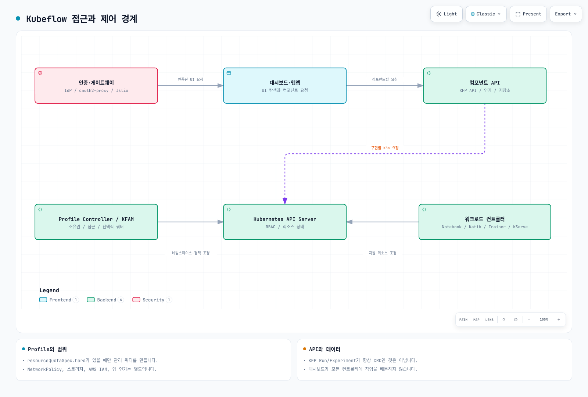

# Part 1: EKS에서의 Kubeflow 아키텍처와 설치

> **검토 기준**: Community Distribution 26.03.1; Dashboard 2.0.0; KFP 2.16.1
> **마지막 검토**: 2026년 9월 12일
> **검증 범위**: kubectl 1.36.2 / Kustomize 5.8.1로 Profile 오버레이를 로컬 렌더링했습니다. EKS 설치나 AWS 신원 연동은 실행하지 않았습니다.

## 실습 환경 준비

설치 명령보다 먼저 배포판 릴리스를 선택하세요. EKS/Kubernetes 버전, 노드 아키텍처, CNI, StorageClass, 신원 공급자, 필요한 컴포넌트를 기록해야 합니다. `Kubernetes 1.34+`가 이후 모든 버전의 지원을 보장하지는 않습니다.

26.03.1은 Kubernetes 1.36 CI 검증과 Kind 0.32+ 사용을 명시합니다. 이것이 모든 EKS 애드온 조합의 인증은 아닙니다. README는 일부 이미지가 ARM64를 지원하지 않을 수 있다고 설명합니다. 렌더링에는 Kustomize가 포함된 kubectl 또는 배포판이 지정한 독립 Kustomize가 필요하며, 실제 적용에는 대상 클러스터, 권한, 준비된 의존성이 추가로 필요합니다.

## Kubeflow란 무엇인가

Kubeflow는 독립적으로 릴리스되는 ML 컴포넌트로 구성됩니다. Community Distribution은 리비전과 공통 서비스를 묶습니다. 일부 워크로드는 CRD를 사용하지만 다른 작업은 애플리케이션 API, 데이터베이스, 오브젝트 스토리지를 사용합니다. 대시보드는 UI 진입점이며 모든 컴포넌트의 실행기나 스케줄러가 아닙니다.

### CNCF 졸업 — 2026년 8월 17일

[CNCF 발표](https://www.cncf.io/announcements/2026/08/17/cncf-announces-kubeflows-graduation-solidifying-the-standard-for-cloud-native-ai-operations/)는 졸업, 독립 보안 감사, 공식 거버넌스를 설명합니다. 이는 프로젝트 성숙도의 평가 근거입니다. 개별 배포의 위협 모델링, 테넌트 격리 시험, 규제 준수 검토를 대신하지는 않습니다.

## 릴리스 모델과 현재 기준

배포판은 `YY.MM.patch`를 사용하고 연간 약 두 차례의 기본 릴리스를 계획하며 커뮤니티 지원을 약 6개월의 best effort로 설명합니다. 벤더 지원 SLA와는 다릅니다.

2026년 6월 15일 발표된 [26.03.1 릴리스](https://github.com/kubeflow/community-distribution/releases/tag/26.03.1)와 [태그에 고정된 목록](https://github.com/kubeflow/community-distribution/blob/26.03.1/README.md)의 기준입니다.

| 컴포넌트 | 포함된 리비전 |
| --- | --- |
| Dashboard / Profile Controller / 접근 관리 | 2.0.0 |
| Pipelines | 2.16.1 |
| Notebooks v1 | 1.11.0 |
| Trainer v2 / 레거시 Training Operator | 2.2.0 / 1.9.2 |
| Katib | 0.19.0 |
| KServe / Models Web Application | 0.18.0 / 0.18.0 |
| Hub / Spark Operator | 0.3.9 / 2.5.0 |
| Istio / Knative | 1.30.1 / 1.22.0 |
| cert-manager / Dex / oauth2-proxy | 1.20.2 / 2.45.1 / 7.15.2 |

릴리스는 Workspaces(Notebooks v2)를 베타로 설명합니다. 위 표의 안정 Notebooks v1이 곧바로 대체된다는 뜻은 아닙니다. 레거시 Training Operator와 Trainer v2는 서로 다른 API로 공존합니다. 학습 Job 작성 전에 설치된 CRD와 런타임 정의를 확인하세요.

## 컴포넌트 아키텍처



[🔍 인터랙티브 다이어그램 보기](https://www.atomai.click/kubernetes-docs/archmaps/ko-ai-ml-kubeflow-01-architecture-installation-0.html)

| 경계 | 제공 기능 | 별도로 구성할 내용 |
| --- | --- | --- |
| 신원 공급자, oauth2-proxy, 게이트웨이 | 브라우저 인증과 신뢰 신원 전달 | OIDC 클라이언트, TLS, 신뢰 헤더, 서비스 간 인증 |
| 대시보드와 컴포넌트 웹앱 | 탐색과 애플리케이션 인터페이스 | 각 API의 인가와 서비스 신원 |
| Profile Controller와 접근 관리(KFAM) | 네임스페이스 소유권, 소유자·구성원 접근, RBAC·Istio 정책 생성 | 쿼터, 네트워크 격리, 워크로드·스토리지·AWS 권한 |
| 컴포넌트 컨트롤러 | 지원하는 Kubernetes 리소스 조정 | admission, 스케줄링, 의존성, 상태 |
| KFP API와 저장소 | 파이프라인·실행·실험, 메타데이터, 아티팩트 | DB·오브젝트 저장소 가용성, 인가, 백업 |

클러스터 범위 `Profile`은 소유자를 지정하고 네임스페이스를 관리하며 구성원은 접근 관리 기능으로 처리합니다. Dashboard 2.0.0은 `spec.resourceQuotaSpec.hard`가 비어 있지 않을 때만 자신의 `ResourceQuota`를 생성합니다. 생략하면 기본 자원 상한이 생기지 않으며, 필드를 비우면 컨트롤러가 관리하던 쿼터가 제거됩니다.

Profile의 RBAC와 Istio `AuthorizationPolicy`만으로 완전한 테넌트 격리가 구성되지는 않습니다. NetworkPolicy 집행, Pod 권한, 스토리지 접근, AWS IAM, 애플리케이션 인가는 별도입니다. Profile 오버레이의 NetworkPolicy는 그 컨트롤러·접근 관리 서비스를 보호하며 모든 사용자 네임스페이스의 정책이 아닙니다.

KFP의 Pipeline, Run, Experiment 개념이 항상 CRD인 것은 아닙니다. 선택적 Kubernetes Native API 모드는 `Pipeline`, `PipelineVersion` CRD를 추가합니다. KFP Experiment와 Katib Experiment는 다른 리소스입니다.

### Profile 예제

소유자와 명시적 쿼터를 선언하는 예제입니다. 설치 명령이나 완전한 격리 정책은 아닙니다.

```yaml
apiVersion: kubeflow.org/v1
kind: Profile
metadata:
  name: team-a
spec:
  owner:
    kind: User
    name: owner@example.com
  resourceQuotaSpec:
    hard:
      requests.cpu: "8"
      requests.memory: 32Gi
      requests.nvidia.com/gpu: "2"
      persistentvolumeclaims: "10"
```

컨트롤러는 소유권이 맞지 않는 기존 네임스페이스를 인수하지 않습니다. 네임스페이스에 Profile 소유자 참조도 설정하므로 Profile을 삭제하면 네임스페이스와 내부 리소스가 삭제될 수 있습니다. Dashboard v2 이전 때는 릴리스별 절차로 이전 컨트롤러 리소스를 정리하고 Profile CRD, Profile 객체, 사용자 네임스페이스를 보존해야 합니다.

## EKS에서의 설치 방식

| 경로 | 근거와 제약 |
| --- | --- |
| Community Distribution 26.03.1 | 검토한 커뮤니티 배포판. 릴리스에 맞게 EKS 네트워크, 스토리지, ingress, 신원을 구성해야 함 |
| `awslabs/kubeflow-manifests` | 확인한 최신 공개 릴리스는 `v1.7.0-aws-b1.0.3`(2023년 9월 1일). 이전 OIDC 이미지 제거로 신규 설치가 실패한다고 릴리스 페이지에 명시됨 |
| 벤더 지원 배포판 | 자체 버전 표, 지원, 연동, 마이그레이션 경로를 평가해야 함 |

[AWS 릴리스 경고](https://github.com/awslabs/kubeflow-manifests/releases/tag/v1.7.0-aws-b1.0.3)를 고려하면 이전 매니페스트·Terraform 가이드는 검증된 26.03.1 설치 방법이 아닙니다. 최근 저장소 활동만으로 해당 릴리스의 호환성이 달라지지는 않습니다.

이전 AWS 오버레이는 Cognito, RDS, S3 연동을 설명합니다. 자체 운영 신원·DB·오브젝트 저장소의 부담을 줄일 수 있지만 단순 교체 가능한 기본값은 아닙니다. issuer·claim 매핑, DB 호환성, 네트워크, IAM, 비용, 데이터 이전을 검토하고 오래된 오버레이를 새 릴리스에 결합하기 전에 검증하세요.

### 적용 전에 렌더링하기

다음 명령은 검토한 릴리스를 받고 Profile 컨트롤러 오버레이만 렌더링합니다. 로컬 파일을 만들며 Kubernetes에 접속하지 않습니다.

```bash
git clone --depth 1 --branch 26.03.1 \
  https://github.com/kubeflow/community-distribution.git kubeflow-26.03.1
cd kubeflow-26.03.1
kubectl kustomize \
  applications/dashboard/upstream/profile-controller/overlays/kubeflow \
  > profile-controller.rendered.yaml
```

오버레이는 Profile CRD, RBAC, Service, `kubeflow`의 `profiles-deployment` 등을 포함한 14개 리소스를 생성했습니다. 컨테이너는 Dashboard 2.0.0의 Profile Controller와 접근 관리 이미지를 사용합니다. 오버레이 자체는 `kubeflow` 네임스페이스를 만들지 않으며 Istio·네트워크 정책 의존성도 필요합니다.

실제 설치는 고정된 릴리스의 개별 컴포넌트 순서를 따르세요. 렌더링을 검토하고 CRD를 등록한 뒤 컨트롤러·웹훅이 준비되면 커스텀 리소스를 적용합니다. admission이나 필드 소유권 오류는 반복 강제 적용 대신 원인을 확인하세요. 렌더링 성공은 API admission이나 EKS 배포 성공의 증명이 아닙니다.

## IAM 접근 패턴: IRSA, KFPv2, Pod Identity

[현재 KFP 오브젝트 저장소 가이드](https://www.kubeflow.org/docs/components/pipelines/operator-guides/configure-object-store/)는 IRSA와 launcher의 `credentials.fromEnv: true`를 이용한 S3 접근을 설명합니다. 이전 AWS 배포판의 “IRSA는 KFPv1만 지원”이라는 설명을 현재 KFPv2 전체의 제약으로 적용하면 안 됩니다.

KFP 2.16.1의 `fromEnv`는 Go Cloud의 버킷 opener로 위임됩니다. 고정된 `gocloud.dev` 0.40.0은 SDK를 별도로 지정하지 않으면 AWS SDK v2의 기본 자격 증명 체인을 사용합니다. 정적 액세스 키 환경 변수만 읽는다는 뜻은 아닙니다.

파이프라인 실행 ServiceAccount와 아티팩트 접근 컴포넌트를 각각 구성하세요. 저장소 설정에 따라 API 서버 접근도 필요합니다. 실제 컨테이너의 SDK/provider 지원, 버킷 접두사, KMS 권한을 확인해야 합니다. IRSA에는 annotation 외에도 역할 신뢰와 projected credential이 필요합니다. Pod Identity에는 지원되는 EKS 환경, 에이전트, association, SDK 지원도 필요하며 이번 검토에서는 이 연동을 실행하지 않았습니다.

Dashboard의 `AwsIamForServiceAccount` Profile 플러그인은 Pod Identity 스위치가 아닙니다. 구현은 `default-editor`에 annotation을 추가하고 IAM 역할의 신뢰 정책도 변경할 수 있으므로 컨트롤러 권한과 신뢰 변경을 검토해야 합니다. 위 예제는 이 플러그인을 켜지 않습니다. 이전 IAM 사용자·정적 키 임시 해법을 신규 배포에 복사하기보다 범위를 제한한 권한과 워크로드 신원을 사용하세요.

## 관리형 대안 대신 EKS에서 운영하는 이유

Kubernetes 운영 역량이 있고 공통 도구, 커스텀 학습 런타임, 특정 스케줄링·서빙 동작이 필요한 팀에는 EKS가 적합할 수 있습니다. 컨트롤러, CRD, 테넌트 경계, 복구, 용량, 업그레이드는 팀의 책임입니다.

SageMaker AI는 인프라 운영을 줄일 수 있지만 애플리케이션, 데이터, IAM, 모델 품질의 책임을 없애지는 않습니다. 실제 필요한 서비스와 배포 모드를 비교하세요.

## 근거와 검증

태그에 고정된 배포판 매니페스트, Dashboard 2.0.0의 Profile 코드, KFP 2.16.1의 오브젝트 저장소 코드를 검토했습니다. Profile 오버레이를 로컬 렌더링하고 예제를 CRD 스키마로 검증했습니다. 종단 간 인증·격리·아티팩트 접근을 검증한 것은 아닙니다.

- [Dashboard Profile 컨트롤러](https://github.com/kubeflow/dashboard/blob/v2.0.0/components/profile-controller/controllers/profile_controller.go)
- [Dashboard AWS Profile 플러그인](https://github.com/kubeflow/dashboard/blob/v2.0.0/components/profile-controller/controllers/plugin_iam.go)
- [KFP 오브젝트 저장소 구현](https://github.com/kubeflow/pipelines/blob/2.16.1/backend/src/v2/objectstore/object_store.go)

## 다음 단계

[Part 2: Pipelines](02-pipelines.md)로 이어집니다.

[메인 페이지로 돌아가기](README.md)

## 퀴즈

[주제 퀴즈](../../quizzes/ai-ml/kubeflow/01-architecture-installation-quiz.md)를 풀어보세요.
