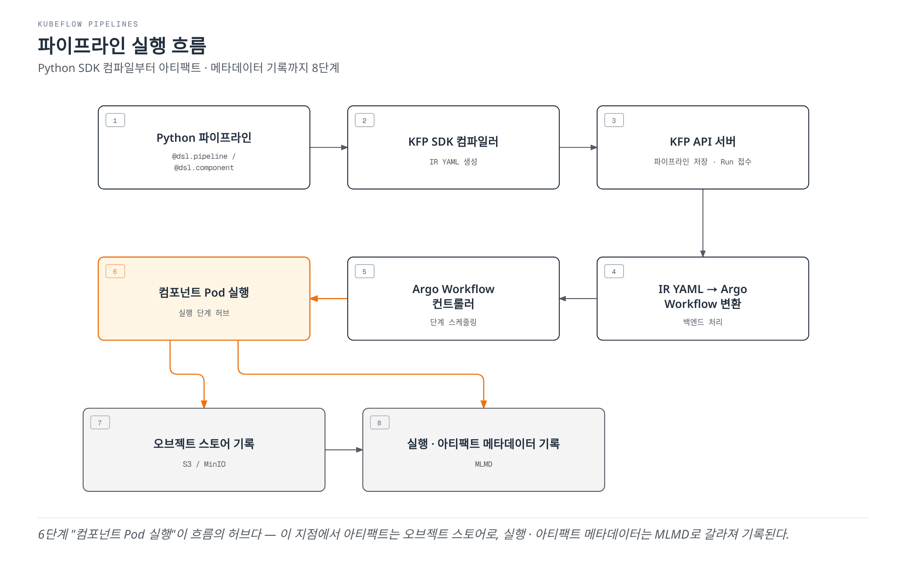

# Part 2: Kubeflow Pipelines

> **지원 버전**: Kubeflow Pipelines 2.16.0, Kubeflow Community Distribution 26.03
> **마지막 업데이트**: 2026년 8월 19일

## 실습 환경 준비

이 문서의 예제를 따라 하려면 다음 도구와 환경이 필요합니다.

### 필수 도구

* 로컬에서 파이프라인을 컴파일하기 위한 Python 3.10 이상과 `kfp` SDK (`pip install kfp`)
* Kubeflow Pipelines가 설치된 클러스터를 가리키는 kubectl v1.34 이상 (설치 과정은 Part 1 참고)
* KFP의 아티팩트 저장소를 S3로 연결하려는 경우, S3 접근 권한을 부여하는 IRSA 역할 또는 EKS Pod Identity 연결 (아래 "EKS에서의 아티팩트 저장소" 참고)

## Kubeflow Pipelines란

Kubeflow Pipelines(KFP)는 Kubeflow 플랫폼 안에서 ML 파이프라인 — 각각 타입이 지정된 입력/출력을 가진 컨테이너화된 단계들의 DAG — 를 만들고 실행하고 추적하는 워크플로 오케스트레이션 엔진입니다. Python으로 KFP SDK를 이용해 파이프라인을 작성하고 컴파일한 뒤 KFP 백엔드에 제출하면, 백엔드가 각 단계를 Pod로 스케줄링하고 실행(Run)의 상태와 아티팩트를 추적합니다.

내부적으로 KFP의 백엔드는 [Argo Workflows](https://argoproj.github.io/workflows/) 위에 구축되어 있습니다. 컴파일된 파이프라인이 KFP API 서버에 도달하면 Argo `Workflow` 리소스로 변환되고, 실제로 Pod를 생성하고 순서를 조율하는 것은 Argo의 컨트롤러입니다. KFP는 Argo 혼자서는 제공하지 않는 계층 — 파이프라인을 작성하기 위한 Python SDK, 실행(Run)과 아티팩트를 조회하는 UI, Experiment/Run 추적 모델, 리니지를 위한 ML Metadata(MLMD) 저장소 — 를 그 위에 얹습니다.

## KFP v2 아키텍처: Argo YAML 직접 생성 대신 IR YAML

Kubeflow Pipelines 2.16.0은 Kubeflow Community Distribution 26.03에 포함된 버전입니다. 이 버전은 KFP v2 SDK와 백엔드를 기반으로 하는데, Python으로 작성한 파이프라인 정의가 실행 가능한 워크플로로 바뀌는 방식이 기존 v1 SDK와 달라졌습니다.

* **v1 SDK**: `dsl-compile`이 Python 파이프라인 함수를 Argo `Workflow` YAML 매니페스트로 직접 컴파일했습니다. 컴파일된 산출물은 Argo에 특화되어 있어서, 다른 백엔드를 쓰고 싶다면 다른 컴파일러가 필요했습니다.
* **v2 SDK**: 파이프라인은 **중간 표현(Intermediate Representation, IR) YAML** — DAG, 컴포넌트, 타입이 지정된 아티팩트와 파라미터를 기술하는 백엔드에 종속되지 않는 `PipelineSpec` — 로 컴파일됩니다. KFP 백엔드는 제출 시점에 이 IR을 Argo `Workflow`로 변환합니다.

실질적인 이점은 Argo의 객체 모델에 종속되지 않는 안정적이고 문서화된 파이프라인 스펙을 갖게 된다는 점입니다. 즉 `kfp.compiler.Compiler().compile(...)`로 얻는 산출물 — IR YAML — 은 KFP와 호환되는 어떤 백엔드에도 넘길 수 있고, KFP API 서버가 저장해두고 그 파이프라인이 실행될 때마다 다시 제출하는 대상이 됩니다. 매번 새로 생성되는 일회성 Argo 매니페스트가 아닙니다.

## 핵심 개념

* **Pipeline(파이프라인)** — `@dsl.pipeline` 데코레이터로 Python에 작성하고 IR YAML로 컴파일되는 컴포넌트들의 DAG.
* **Component(컴포넌트)** — 타입이 지정된 입력/출력을 가진 하나의 컨테이너화된 단계. `@dsl.component`로 작성하며, 자체 컨테이너 스펙으로 컴파일되어 실행 시 하나의 Pod(또는 실행기 설정에 따라 Pod 내 한 스텝)가 됩니다.
* **Run(실행)** — 특정 입력 파라미터 값으로 파이프라인(또는 단일 컴포넌트)을 한 번 실행한 것.
* **Experiment(실험)** — 관련된 Run들을 모아놓은 이름 있는 그룹으로, 결과를 조직하고 비교하는 데 사용합니다(예: 같은 파이프라인의 서로 다른 하이퍼파라미터 실행들).
* **Artifact(아티팩트)** — 컴포넌트 사이를 흐르는, 오브젝트 스토어에 저장된 파일을 기반으로 하는 타입이 지정된 출력물입니다. KFP v2는 아티팩트에 `Dataset`, `Model`, `Metrics`, `ClassificationMetrics`, `HTML`, `Markdown` 같은 1급 타입을 부여하므로, 컴포넌트의 시그니처만 봐도 출력물이 있다는 사실뿐 아니라 어떤 종류인지까지 알 수 있습니다.
* **ML Metadata(MLMD) 저장소** — 대부분의 KFP 설치에서 MySQL 기반으로 동작하며, 모든 컴포넌트 실행과 그 입출력, 관련된 아티팩트를 기록하는 백엔드 저장소입니다. 이 덕분에 KFP UI에서 학습된 모델을 거꾸로 추적해 어떤 데이터셋과 코드로 만들어졌는지, 여러 실행에 걸친 아티팩트 리니지를 확인할 수 있습니다.

## 파이프라인 실행이 시스템을 거치는 흐름



KFP SDK의 역할은 IR YAML을 만드는 데서 끝나며, API 서버 이후의 모든 과정은 백엔드의 책임입니다. 이 분리 구조가 "백엔드에 종속되지 않는 스펙"이라는 주장을 실질적으로 보여줍니다 — SDK는 그 아래에서 실제로 스케줄링을 담당하는 것이 Argo Workflows라는 사실을 알 필요도, 신경 쓸 필요도 없습니다.

## EKS에서의 아티팩트 저장소

KFP는 기본 아티팩트 저장소로 클러스터 내부에 배포되는 MinIO를 함께 제공합니다. 별도로 재구성하지 않으면 컴포넌트가 생성하는 모든 아티팩트(`Dataset`, 학습된 `Model`, 메트릭 파일 등)가 실제 S3 버킷이 아니라 MinIO 버킷에 기록됩니다. 자체 완결형 데모에는 문제가 없지만, EKS 환경에서는 S3가 이미 무료로 제공하는 내구성, 클러스터 외부 접근, IAM 기반 접근 제어를 중복으로 구현하는 스테이트풀 서비스를 추가로 운영해야 한다는 부담이 남습니다.

`awslabs/kubeflow-manifests` 프로젝트는 KFP의 아티팩트 저장소를 클러스터 내부 MinIO 대신 S3로 연결하는 패턴을 문서화하고 있습니다 — 파이프라인 루트와 아티팩트 오브젝트 스토어 자격 증명을 재구성해서 컴포넌트가 S3 버킷을 직접 읽고 쓰게 만드는 방식입니다. 바로 이 지점에서 [Part 1](./01-architecture-installation.md)에서 다룬 신원(identity) 메커니즘이 직접적으로 연관됩니다 — KFP 파이프라인 Pod(특히 `pipeline-runner` ServiceAccount)가 사용하는 ServiceAccount는 해당 S3 버킷에 대한 권한을 가진 IRSA 역할이나 EKS Pod Identity 연결이 있어야 합니다. 아티팩트를 읽고 쓸 때 발생하는 오브젝트 스토어 호출이 클러스터 내부 MinIO 엔드포인트가 아니라 곧바로 AWS로 향하기 때문입니다. IRSA/Pod Identity 설정 자체는 Part 1에서 자세히 다루므로, 이 절에서는 파이프라인 라이프사이클의 어느 지점에서 그 신원이 실제로 쓰이는지만 짚습니다.

## 간단한 2단계 파이프라인

다음은 KFP v2 SDK의 데코레이터를 사용한 최소한의 `data-prep -> train` 파이프라인 예시로, 첫 번째 컴포넌트에서 두 번째 컴포넌트로 타입이 지정된 `Dataset` 아티팩트가 전달되는 과정을 보여줍니다.

```python
from kfp import dsl, compiler
from kfp.dsl import Dataset, Model, Output, Input

@dsl.component(base_image="python:3.11-slim")
def prepare_data(output_dataset: Output[Dataset]):
    import pandas as pd

    # 실제 파이프라인에서는 S3 등 외부 소스에서 데이터를 읽어옵니다
    df = pd.DataFrame({"feature": [1, 2, 3, 4], "label": [0, 1, 0, 1]})
    df.to_csv(output_dataset.path, index=False)

@dsl.component(base_image="python:3.11-slim", packages_to_install=["scikit-learn", "pandas"])
def train_model(input_dataset: Input[Dataset], output_model: Output[Model]):
    import pandas as pd
    from sklearn.linear_model import LogisticRegression
    import pickle

    df = pd.read_csv(input_dataset.path)
    clf = LogisticRegression().fit(df[["feature"]], df["label"])
    with open(output_model.path, "wb") as f:
        pickle.dump(clf, f)

@dsl.pipeline(name="data-prep-train-pipeline")
def data_prep_train_pipeline():
    prep_task = prepare_data()
    train_task = train_model(input_dataset=prep_task.outputs["output_dataset"])

compiler.Compiler().compile(
    pipeline_func=data_prep_train_pipeline,
    package_path="data_prep_train_pipeline.yaml",
)
```

이 예제에서 눈여겨볼 부분입니다.

* `output_dataset: Output[Dataset]`과 `input_dataset: Input[Dataset]`은 KFP v2에서 타입이 지정된 아티팩트 파라미터를 선언하는 방식입니다 — SDK가 `prep_task.outputs["output_dataset"]`을 `train_model`의 입력으로 연결하는 배선을 처리하며, 각 컴포넌트가 쓰고 읽을 저장 경로도 자동으로 준비합니다.
* `@dsl.component`는 각각 독립된 컨테이너 이미지 빌드 컨텍스트로 컴파일되거나(또는 `packages_to_install`로 지정한 Python 패키지가 설치된 `base_image`를 재사용), `prepare_data`와 `train_model`은 서로 독립된 Pod로 실행되고 선언된 아티팩트를 통해서만 연결됩니다.
* `compiler.Compiler().compile(...)`은 앞서 설명한 IR YAML을 생성합니다 — 이 파일이 KFP UI에 업로드하거나 KFP Python 클라이언트로 제출해 Run을 생성할 때 사용하는 대상입니다.

## 캐싱 동작

KFP는 컴포넌트의 입력(파라미터 값, 입력 아티팩트 내용, 컴포넌트 자체의 정의)을 해시로 만들어 실행을 캐싱합니다. 이후 실행에서 이전에 성공한 실행과 동일한 입력 해시를 가진 컴포넌트를 제출하면 KFP는 재실행을 건너뛰고 캐시된 출력을 재사용합니다 — 그래서 `train_model` 단계만 수정한 뒤 파이프라인을 다시 실행해도, `prepare_data`의 입력과 코드가 바뀌지 않았다면 그 단계를 다시 실행하느라 시간을 낭비하지 않습니다.

이 동작은 반복적인 개발 과정에는 편리하지만, 실제로는 다시 실행되길 원했던 상황을 조용히 가려버릴 수도 있습니다(예: 선언된 입력에는 반영되지 않은 외부 상태에 의존하는 컴포넌트가 있는 경우). 캐싱은 다음과 같이 비활성화할 수 있습니다.

* 컴포넌트 단위로는, 파이프라인 함수 안의 태스크에 `set_caching_options(enable_caching=False)`를 호출합니다. 예: `prep_task.set_caching_options(enable_caching=False)`.
* Run 단위로는, 컴포넌트별로가 아니라 파이프라인 제출 전체에 대해 캐싱을 끌 수 있습니다 — KFP UI의 "Run" 제출 화면에는 제출 시점에 캐싱을 켜고 끌 수 있는 토글이 있습니다.

## 다음 단계

파이프라인을 작성하고 컴파일해서 실행할 수 있게 되었다면, 다음 질문은 보통 이 파이프라인 컴포넌트에 들어가는 코드를 애초에 어디서 개발하느냐입니다. [Part 3: Kubeflow Notebooks](./03-notebooks.md)에서는 팀이 파이프라인 컴포넌트로 패키징할 코드를 작성하고 반복 개발하는 데 쓰는 사용자별 노트북 환경을 다룹니다. 그리고 이 시리즈 뒷부분의 [Part 6: KServe — Kubernetes 기반 모델 서빙](./06-kserve.md)에서는 그 파이프라인이 최종적으로 만들어낸 모델을 서빙하는 방법을 다룹니다.

[메인 페이지로 돌아가기](./README.md)

## 퀴즈

이 장에서 배운 내용을 확인하려면 [주제 퀴즈](../../quizzes/ai-ml/kubeflow/02-pipelines-quiz.md)를 풀어보세요.
