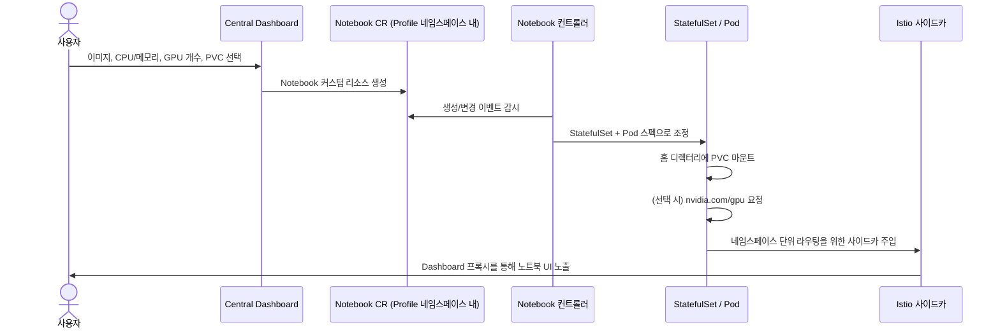

# Part 3: Kubeflow Notebooks

> **지원 버전**: Kubeflow Community Distribution 26.03, Kubernetes 1.34+
> **마지막 업데이트**: 2026년 8월 19일

## 실습 환경 준비

이 문서의 예제를 따라 하려면 다음 도구와 환경이 필요합니다.

### 필요한 도구

* Kubeflow가 설치된 클러스터를 가리키는 kubectl v1.34 이상 (설치 과정은 Part 1 참고)
* 노트북 서버를 띄울 수 있는 Kubeflow Central Dashboard의 사용자 Profile(네임스페이스) 접근 권한
* GPU 기반 노트북을 띄울 계획이라면 [Karpenter](../../autoscaling/02-karpenter.md)로 구성한 GPU 지원 `NodePool`/`EC2NodeClass` 조합
* 커스텀 노트북 이미지를 빌드하고 참조할 계획이라면 컨테이너 레지스트리(예: Amazon ECR)에 대한 push 권한

## Kubeflow Notebooks란 무엇인가

Kubeflow Notebooks는 데이터 과학자가 Deployment 매니페스트나 Dockerfile을 직접 작성하지 않고도 JupyterLab, RStudio, code-server(브라우저에서 동작하는 VS Code) 같은 대화형 개발 환경을 클러스터 내부의 Pod로 즉시 띄울 수 있게 해주는 기능입니다. 컨트롤러가 원하는 노트북(이미지, CPU/메모리/GPU 요청량, 스토리지)을 기술하는 커스텀 리소스를 감시하고 이를 일반적인 Kubernetes 오브젝트로 조정(reconcile)하며, Istio의 네임스페이스별 라우팅이 그 결과물을 나머지 Kubeflow 컴포넌트와 동일한 Central Dashboard를 통해 노출합니다.

공유 JupyterHub 배포나 일회성 `kubectl run` 대신 이런 방식으로 노트북을 운영하는 핵심 이유는, 각 사용자의 환경이 클러스터의 일반적인 운영 모델에 완전히 편입된다는 점입니다. 동일한 스케줄러가 스케줄링을 담당하므로(다른 워크로드와 마찬가지로 GPU 노드 풀을 두고 경쟁하고 그 이점도 함께 누립니다), 동일한 네임스페이스 단위 RBAC와 네트워크 정책의 적용을 받으며, 플랫폼 팀이 다른 모든 리소스에 사용하는 것과 동일한 `kubectl`/GitOps 도구로 일시 정지·크기 조정·삭제가 가능합니다.

## 버전 맥락: Notebooks v1과 다가오는 v2

26.03 Kubeflow Community Distribution 기준으로 Kubeflow Notebooks는 오랫동안 사용되어 온 **v1** 설계로 동작합니다 — Central Dashboard의 노트북 UI를 통해 생성되는, Kubernetes `StatefulSet`/Pod 스펙을 비교적 얇게 감싸는 `Notebook` 커스텀 리소스입니다. 이 문서의 나머지 내용은 이 아키텍처를 다루며, 26.03을 배포할 때 실제로 마주하게 될 구조입니다.

프로젝트는 `Workspace`와 `WorkspaceKind`라는 두 개의 새로운 커스텀 리소스를 중심으로 한 **v2 릴리스를 향해 활발히 작업 중**입니다. 이 설계는 "노트북 환경이 어떻게 생겼는가"(관리자가 정의하고 버전을 관리하는 `WorkspaceKind` 템플릿)와 "어떤 사용자가 어떤 환경을 실행하고 있는가"(특정 kind를 참조하는 `Workspace`)를 분리합니다. 26.03 기본 배포판 기준으로 v2(`Workspaces`)는 테스트용 알파 매니페스트 단계였고, 26.03.1 패치에서 **베타** 단계로 올라갔지만 **아직 정식 출시(GA)에는 도달하지 않았습니다**. v2가 프로덕션에서 사용할 준비가 되면 v1 `Notebook` CRD는 유지보수 전용 상태로 전환될 것으로 예상됩니다. v2는 아직 미래 지향적인 참고 사항으로 다루고, 프로덕션 플랫폼 설계를 어느 한쪽 API에 확정하기 전에 [Kubeflow Notebooks 공식 문서](https://www.kubeflow.org/docs/components/notebooks/)에서 현재 GA 상태를 확인하시기 바랍니다.

## 멀티테넌시 모델: 노트북의 경계가 되는 Profile

Kubeflow Notebooks를 사용하는 모든 사용자는 **Profile** 안에서 동작합니다 — Kubeflow 전체에서 사용되는 사용자별 네임스페이스 구조로, Part 1에서 다룬 개념입니다. Profile을 생성하면 다음이 함께 프로비저닝됩니다.

* 해당 사용자(또는 팀)를 위한 전용 Kubernetes 네임스페이스.
* Profile 컨트롤러를 통해 사용자의 권한을 자신의 네임스페이스로만 한정하는 RBAC 바인딩.
* 해당 네임스페이스 내부의 서비스(노트북 Pod 포함)에 어떤 identity가 접근할 수 있는지를 제한하는 Istio `AuthorizationPolicy`. 이를 통해 기본적으로 한 사용자의 노트북이 다른 사용자의 워크로드에 접근하거나 접근받지 않도록 막습니다.

노트북 서버는 항상 Profile 네임스페이스 안에서 생성되며, 공유 네임스페이스에서 생성되지 않습니다. 이것이 플랫폼 팀이 사용자에게 셀프서비스 방식의 노트북 생성 권한을 부여하면서도 사용자 간 Pod가 서로 접근 가능한 상태가 되지 않도록 하는 핵심 장치이며, 파이프라인 실행이나 KServe 엔드포인트를 비롯한 클러스터 내 다른 사용자별 리소스에도 동일한 격리 경계가 적용됩니다.

### 영구 스토리지

Central Dashboard의 스포너(spawner) UI에서는 사용자가 하나 이상의 PersistentVolumeClaim을 노트북 Pod에 연결할 수 있으며, 일반적으로 노트북 서버의 홈 디렉터리(Jupyter Docker Stacks 관례를 따르는 Jupyter 기반 이미지의 경우 `/home/jovyan` 등)에 마운트됩니다. Pod가 아니라 클레임이 영속적인 객체이기 때문에, 사용자의 파일, 설치한 패키지, Jupyter 설정은 Pod 재시작, 노드 교체, 또는 의도적인 노트북 중지/재시작 사이클을 거쳐도 그대로 유지됩니다. EKS에서는 이 PVC가 단일 Pod의 ReadWriteOnce 접근에는 Amazon EBS CSI 드라이버로, 여러 노트북/파이프라인 Pod 간에 동일한 작업 디렉터리를 읽기-쓰기로 공유해야 하는 경우에는 Amazon EFS CSI 드라이버로 뒷받침되는 것이 일반적입니다.

### 유휴 컬링(Idle Culling)

실행 중인 노트북 Pod는 누군가 실제로 사용하고 있는지와 무관하게 존재하는 동안 계속 CPU, 메모리, 그리고 가장 비용이 큰 GPU 할당을 점유합니다. 이 때문에 Kubeflow Notebooks에는 설정된 기간 동안 유휴 상태로 방치된 노트북을 (삭제가 아니라) 중지시키는 컬링 메커니즘이 포함되어 있습니다. 컬링은 유휴 노트북이 점유하고 있던 노드 용량을 회수하는데, 특히 GPU가 연결된 노트북에서 가장 중요합니다 — 사용자가 자리를 비운 뒤에도 유휴 노트북이 비싼 GPU 인스턴스를 몇 시간씩 붙잡고 있을 수 있기 때문입니다. 컬링이 발생해도 기반이 되는 PVC는 그대로 유지되므로, 컬링된 노트북을 다시 시작하면 사용자가 남겨둔 환경과 파일이 그대로 보존되어 있습니다.

## 노트북 조정(Reconciliation) 흐름

컨트롤러의 조정 루프는 Kubernetes 전반에서 사용되는 동일한 패턴을 따릅니다. 대시보드에서 사용자가 무언가를 조작할 때마다 Pod를 직접 생성하는 것이 아니라, `Notebook` 커스텀 리소스가 현재 선언하고 있는 상태를 향해 실제 `StatefulSet`을 지속적으로 조정합니다. 예를 들어 대시보드에서 노트북을 중지하면 명령형으로 Pod를 삭제하는 것이 아니라 커스텀 리소스의 원하는 replica 수를 0으로 갱신하는 방식으로 동작하며, 결국 노트북 Pod가 실행되어야 하는지에 대한 단일 진실 공급원(source of truth)은 대시보드 UI가 아니라 컨트롤러입니다.

## EKS에서의 노트북 GPU 스케줄링

가속기 접근이 필요한 노트북 Pod도 클러스터의 다른 Pod와 동일한 방식으로 이를 요청합니다. 스포너의 GPU 설정 필드는 `Notebook` 커스텀 리소스를 거쳐 하위 Pod 스펙의 `resources.limits."nvidia.com/gpu"` 항목으로 변환되며, GPU 노드에서 실행 중인 NVIDIA 디바이스 플러그인이 `nvidia.com/gpu`를 스케줄러에 할당 가능한 리소스로 알립니다.

즉 노트북의 GPU 스케줄링은 클러스터 전체 GPU 용량과 분리된 별도의 서브시스템이 아니라, 학습 작업이나 KServe 엔드포인트 등 다른 GPU 워크로드를 뒷받침하는 동일한 GPU 지원 노드 풀을 두고 경쟁하며 그 풀에 의해 서비스됩니다. EKS에서는 이러한 용량이 흔히 Karpenter를 통해 동적으로 프로비저닝됩니다. Karpenter는 노트북 Pod의 `nvidia.com/gpu` 요청을 기존 용량으로 충족할 수 없을 때 GPU `NodePool`을 확장하고, 노트북이 컬링되거나 중지되면 다시 축소할 수 있습니다. GPU를 인식하는 Karpenter NodePool 구성, 인스턴스 타입 선택, 가속기 노드용 taint/toleration의 세부 메커니즘은 [Karpenter를 활용한 오토스케일링](../../autoscaling/02-karpenter.md) 문서에서 깊이 다루고 있으며, 여기서 기억해야 할 노트북 관련 핵심은 유휴 상태의 GPU 노트북이 GPU 노드 풀이 0으로 스케일 다운되지 못하는 가장 흔한 원인 중 하나라는 점이며, 이것이 바로 위에서 설명한 컬링 동작이 존재하는 이유입니다.

## 커스텀 노트북 이미지

Kubeflow 스포너가 기본 제공하는 스톡 노트북 이미지는 일반적인 JupyterLab/RStudio/code-server 기본 환경을 다루지만, 프로덕션에서 노트북을 운영하는 대부분의 팀은 자체 커스텀 이미지를 빌드하고 참조합니다. 이는 각 데이터 과학자가 실행 중인 컨테이너 안에서 손으로 `pip install`을 하는 대신, 동일하고 재현 가능한 환경에서 시작할 수 있도록 하기 위한 것입니다.

일반적인 패턴은 다음과 같습니다.

1. **업스트림 Kubeflow(또는 Jupyter Docker Stacks) 베이스 이미지에서 시작합니다.** 이 이미지에는 이미 노트북 서버, Kubeflow SDK 연동, 스포너가 기대하는 UID/작업 디렉터리 관례가 포함되어 있습니다.
2. **팀에서 실제로 사용하는 의존성을 레이어로 추가합니다.** 고정된 Python/R 패키지 집합, 내부 라이브러리, (대상 노드 풀의 CUDA 드라이버와 맞춘) GPU 프레임워크 버전, 팀이 표준화한 자격 증명이 필요 없는 도구 등입니다.
3. **클러스터가 pull할 수 있는 레지스트리에 이미지를 빌드하여 푸시합니다.** EKS에서는 일반적으로 Amazon ECR을 사용하며, 다른 프로덕션 이미지와 동일하게 이미지 스캐닝과 라이프사이클 정책을 적용합니다.
4. **스포너에서 해당 이미지를 참조합니다.** Central Dashboard의 스포너 UI는 이미지 필드에 임의의 이미지 참조를 입력받을 수 있으므로(관리자가 설정한 허용 목록이 있다면 그 범위 내에서), 최종 사용자 입장에서는 커스텀 이미지도 스톡 이미지와 동일하게 동작합니다 — 그저 선택 가능한 또 다른 옵션일 뿐입니다.

이러한 이미지를 다른 애플리케이션 이미지와 동일한 CI 파이프라인을 통해 버전 관리하고 재빌드하는 것이, 팀 전체에 걸쳐 노트북 환경의 재현성을 확보하는 방법입니다. 동일한 이미지 태그를 선택한 두 데이터 과학자는 수작업 설치로 인해 시간이 지나면서 커널이 서로 달라지는 것이 아니라, 완전히 동일한 패키지 집합을 갖게 됩니다.

## 다음 단계

이 문서에서는 Kubeflow Notebooks가 무엇을 하는지, 각 사용자의 노트북을 격리하는 Profile 기반 멀티테넌시 모델, 영구 스토리지와 유휴 컬링, 노트북 컨트롤러의 조정 흐름, EKS에서의 GPU 스케줄링, 그리고 재현 가능한 환경을 위한 커스텀 노트북 이미지 구축 방법을 다루었습니다. Part 4에서는 여기서 소개한 것과 동일한 Profile 및 커스텀 리소스 패턴을 기반으로 Katib와 하이퍼파라미터 튜닝을 다룹니다.

[메인 페이지로 돌아가기](./README.md)

## 퀴즈

이 장에서 배운 내용을 확인하려면 [주제 퀴즈](../../quizzes/ai-ml/kubeflow/03-notebooks-quiz.md)를 풀어보세요.
