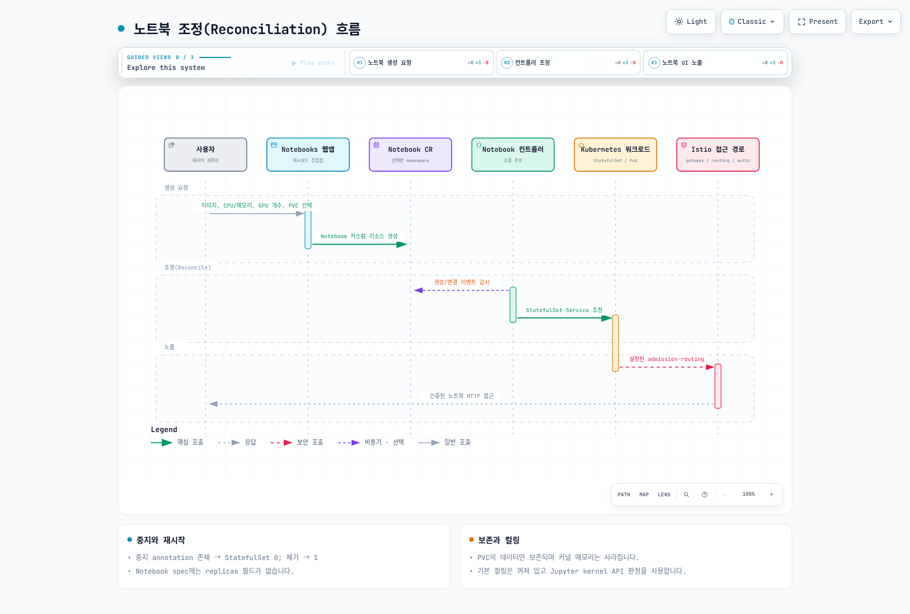

# Part 3: Kubeflow Notebooks

> **지원 버전**: Kubeflow Notebooks 1.11.0; Community Distribution 26.03.1
> **마지막 업데이트**: 2026년 9월 12일

## 실습 환경 준비

호환되는 Kubernetes 클러스터, Notebooks 1.11.0 컨트롤러·웹앱, 사용자 네임스페이스 권한, 스토리지·접근 경로가 필요합니다. 전체 배포판 호환성은 [Part 1](01-architecture-installation.md)을 참고하세요. GPU를 사용한다면 지원되는 드라이버와 디바이스 플러그인, 적합한 노드 용량이 필요하며 Karpenter는 용량 공급 방법 중 하나입니다.

## Kubeflow Notebooks란 무엇인가

Notebooks 웹앱은 이미지·자원·볼륨 설정으로 `Notebook` 리소스를 생성합니다. 컨트롤러가 StatefulSet, Service, 구성에 따른 Istio VirtualService를 관리하고 StatefulSet 컨트롤러가 Pod를 생성합니다. Kubernetes 스케줄러가 노드에 배치합니다. 대시보드는 웹앱 진입점이며 Pod 생성기나 모든 트래픽의 프록시는 아닙니다.

Notebook 리소스는 namespace 범위이고 PodSpec을 포함합니다. GitOps나 Kubernetes API로도 관리할 수 있지만 컨트롤러가 관리하는 StatefulSet을 직접 수정하면 원래 상태로 되돌아갈 수 있습니다.

## 버전 맥락: Notebooks v1과 Workspaces

이 장은 배포판 26.03.1의 **Notebooks v1.11.0**과 `Notebook` API를 검토합니다. Workspaces는 `Workspace`와 `WorkspaceKind`를 사용하는 별도 v2 설계이며 직접 호환되는 CRD 교체가 아닙니다.

26.03.1 릴리스 설명은 Workspaces를 베타라고 부르지만, 태그에 고정된 controller/backend/frontend 매니페스트의 이미지 버전은 **v2.0.0-alpha.3**입니다. 발표 문구와 실제 이미지 태그를 구분해야 합니다. 이 검토는 v2의 GA나 v1 지원 종료 시점을 확정하지 않습니다. 채택 전 실제 릴리스, API와 마이그레이션 지원을 확인하세요.

## 멀티테넌시 모델: Profile과 별도 격리 정책

전체 Kubeflow UI에서는 선택한 Profile 네임스페이스에 노트북을 만듭니다. Profile은 팀 구성원이 공유할 수도 있으며, Notebook CRD 자체가 모든 네임스페이스에 Profile 존재를 강제하는 것은 아닙니다. standalone 설치와 전체 플랫폼의 접근 모델도 다릅니다.

Profile의 소유권·구성원 관리, RBAC, Istio AuthorizationPolicy는 접근 제어의 일부입니다. 다른 RBAC 권한을 취소하거나 모든 Pod 통신·스토리지·AWS 접근을 자동 차단하지는 않습니다. NetworkPolicy 집행, Pod 권한, 볼륨 권한, 워크로드 IAM, 애플리케이션 인가를 별도로 검토하세요.

### 영구 스토리지

기본 UI는 보통 `/home/jovyan`에 workspace PVC를 마운트합니다. **그 볼륨에 저장한 데이터만** Pod 교체 후 남습니다. `/opt/conda`, 시스템 디렉터리, 컨테이너 writable layer에 설치한 패키지와 메모리의 커널 상태는 PVC가 보존하지 않습니다. 홈 디렉터리의 사용자 패키지는 남아도 새 이미지와 호환되지 않을 수 있습니다.

PVC와 실제 볼륨의 수명·백업·reclaim policy도 확인해야 합니다. EBS의 ReadWriteOnce는 한 **노드**에서 읽기·쓰기를 허용한다는 뜻이며 한 Pod만의 사용을 보장하지 않습니다. 단일 Pod 집행은 지원되는 CSI의 ReadWriteOncePod 등 별도 조건이 필요합니다. EBS는 AZ·볼륨 연결 제약을 고려하고 EFS 공유 스토리지는 POSIX 권한과 동시 접근을 설계하세요.

### 유휴 컬링(Idle Culling)

검토한 v1.11.0 기본값은 `ENABLE_CULLING=false`, `CULL_IDLE_TIME=1440`, `IDLENESS_CHECK_PERIOD=1`이며 시간 단위는 분입니다. 설치만으로 자동 중지가 활성화되지 않습니다.

컬러는 Jupyter의 `/api/kernels`와 마지막 활동 정보를 사용합니다. 브라우저를 닫았는지, 셸 프로세스가 GPU를 사용하는지를 완전히 감지하지 않습니다. RStudio/code-server에 동일한 Jupyter API가 있다고 가정해서도 안 됩니다. API 조회 실패나 빈 커널 목록이면 마지막 활동 값이 갱신되지 않으므로 이전 값이 오래되면 중지될 수 있습니다. 실제 이미지·접근 정책으로 판정을 검증한 뒤 활성화하세요.

컬링은 중지 annotation을 추가해 StatefulSet을 0으로 조정하며 PVC를 삭제하지 않습니다. Pod 자원 요청이 사라져도 EC2 노드가 종료되는지는 다른 워크로드, PDB, Karpenter 정책·예산 등에 달려 있습니다. 노드 종료 전에는 인스턴스 비용이 계속 발생할 수 있습니다.

## 노트북 조정(Reconciliation) 흐름



[🔍 인터랙티브 다이어그램 보기](https://www.atomai.click/kubernetes-docs/archmaps/ko-ai-ml-kubeflow-03-notebooks-0.html)

Notebook v1.11.0의 spec에는 `replicas` 필드가 없습니다. 컨트롤러는 `kubeflow-resource-stopped` annotation이 **존재하면** StatefulSet replica를 0으로, 없으면 1로 생성합니다. 값이 `"false"`여도 annotation이 있으면 중지됩니다. 재시작하려면 값을 바꾸는 대신 annotation을 제거해야 합니다.

```bash
# 선택한 노트북 중지: 실행 중인 커널·프로세스가 종료됩니다.
kubectl annotate notebook -n team-a analysis \
  kubeflow-resource-stopped="2026-09-12T00:00:00Z" --overwrite
# 재시작: 중지 annotation 제거
kubectl annotate notebook -n team-a analysis kubeflow-resource-stopped-
```

위 날짜는 annotation 값의 형식을 보여주는 예시입니다. 대상 네임스페이스·노트북을 바꿔 사용하고 작업을 저장한 뒤 실행하세요. Istio sidecar 주입은 admission webhook이 구성된 경우 수행하며 Notebook 컨트롤러가 직접 주입하지 않습니다.

## EKS에서의 노트북 GPU 스케줄링

GPU 요청은 Pod의 `resources.limits["nvidia.com/gpu"]` 등 표준 확장 리소스로 표현합니다. 디바이스 플러그인, 드라이버, 노드 용량, taint/toleration과 affinity가 맞아야 합니다. GPU 자원만 선언한다고 적합한 노드가 반드시 만들어지지는 않습니다.

Karpenter는 지원되는 Pending Pod와 NodePool 조건을 기준으로 용량을 공급할 수 있지만 EC2 가용 용량, 할당량, 제한, 네트워크·부팅 실패 등에 영향을 받습니다. 노트북 중지와 EC2 축소도 별도 과정입니다. [Karpenter 가이드](../../autoscaling/02-karpenter.md)의 배치·중단 조건을 확인하세요.

## 커스텀 노트북 이미지

검토한 spawner 설정의 `allowCustomImage` 기본값은 `true`입니다. UI 목록 제한만으로 직접 Notebook API를 호출하는 사용자의 이미지 선택을 강제하지는 못합니다. 필요한 제약은 RBAC와 admission 정책에도 적용하세요.

이미지는 서버 포트, `/notebook/<namespace>/<name>/` 경로 또는 rewrite 설정, UID/GID, 쓰기 가능한 홈, 프로브, 런타임 의존성을 충족해야 합니다. Jupyter Docker Stacks 이미지라고 자동으로 모든 Kubeflow 관례나 SDK가 포함되는 것은 아닙니다. 고정한 의존성을 빌드하고 ECR 등에서 digest로 참조하며, 대상 CPU 아키텍처와 GPU 드라이버도 확인하세요.

동일한 태그만으로 동일한 바이트가 보장되지는 않습니다. 이미지 digest가 같아도 PVC의 사용자 패키지·설정, 시작 스크립트, 설치 과정이 달라지면 실행 환경이 달라질 수 있습니다.

## 검증과 근거

26.03.1의 Notebooks 컨트롤러 오버레이를 로컬 Kustomize로 렌더링하고, v1.11.0의 CRD·중지 처리·컬링·spawner 설정을 검토했습니다. 실제 노트북, GPU, PVC 복구, 유휴 감지, EKS 용량 공급은 실행하지 않았습니다.

- [v1.11.0 Notebook 컨트롤러](https://github.com/kubeflow/notebooks/blob/v1.11.0/components/notebook-controller/controllers/notebook_controller.go)
- [v1.11.0 컬링 구현](https://github.com/kubeflow/notebooks/blob/v1.11.0/components/notebook-controller/controllers/culling_controller.go)
- [v1.11.0 spawner 기본값](https://github.com/kubeflow/notebooks/blob/v1.11.0/components/crud-web-apps/jupyter/manifests/base/configs/spawner_ui_config.yaml)
- [26.03.1 Workspaces 이미지 태그](https://github.com/kubeflow/community-distribution/blob/26.03.1/applications/workspaces/upstream/controller/base/manager/kustomization.yaml)

## 다음 단계

[Part 4: Katib](04-katib.md)에서 실험과 하이퍼파라미터 튜닝을 다룹니다.

[메인 페이지로 돌아가기](./README.md)

## 퀴즈

이 장에서 배운 내용을 확인하려면 [주제 퀴즈](../../quizzes/ai-ml/kubeflow/03-notebooks-quiz.md)를 풀어보세요.
