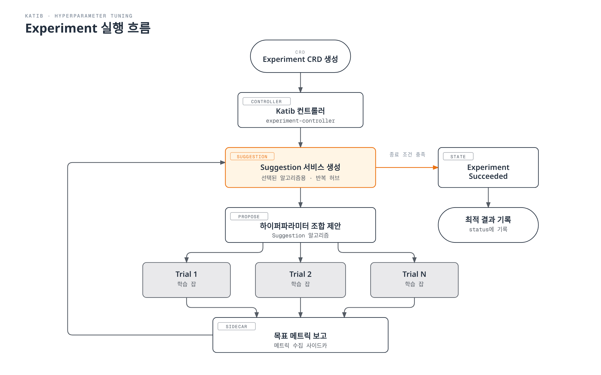

# Part 4: Katib — 하이퍼파라미터 튜닝과 AutoML

> **지원 버전**: Katib 0.19.0, Kubeflow Community Distribution 26.03
> **마지막 업데이트**: 2026년 8월 19일

## 실습 환경 준비

이 문서의 예제를 따라 하려면 다음 도구와 환경이 필요합니다.

### 필요한 도구

* Kubeflow가 설치된 클러스터를 가리키는 kubectl v1.34 이상 (설치 과정은 Part 1 참고)
* Experiment를 제출할 수 있는 Kubeflow Central Dashboard의 사용자 Profile(네임스페이스) 접근 권한
* GPU 기반 Trial을 실행할 계획이라면 [Karpenter](../../autoscaling/02-karpenter.md)로 구성한 GPU 지원 `NodePool`/`EC2NodeClass` 조합
* `trialTemplate`에서 참조할 동작하는 학습 잡 템플릿 (예: Part 5의 `TrainJob`/`ClusterTrainingRuntime` 조합, 또는 평범한 Kubernetes `Job`)

## Katib이란 무엇인가

앞선 시리즈에서는 Kubeflow의 노트북과 파이프라인 레이어를 다뤘습니다. 이번 문서는 Kubeflow의 Kubernetes 네이티브 하이퍼파라미터 튜닝/AutoML 컴포넌트인 **Katib**을 다룹니다. Katib은 "학습률, 배치 크기, 네트워크 깊이를 어떻게 잡아야 할까?"라는 질문을 사람이 수동으로 값을 바꿔가며 실행-확인을 반복하는 루프가 아니라, 선언적으로 정의하고 클러스터가 스케줄링하는 탐색으로 바꿔줍니다. 이는 별도의 스케줄러를 새로 만든 것이 아니라, Custom Resource·Pod·Service 같은 평범한 Kubernetes 오브젝트를 조합해서 구현됩니다.

Katib은 서로 다른 하이퍼파라미터 조합으로 여러 학습 잡을 병렬로 실행하고, 그 결과를 바탕으로 다음에 어떤 조합을 시도할지 결정하는 방식으로 하이퍼파라미터 최적화(HPO)와 신경망 구조 탐색(NAS)을 자동화합니다. 이를 위해 서로 협력하는 세 가지 요소로 구성됩니다.

* **Experiment** — 하나의 튜닝 실행을 기술하는 CRD입니다. 최적화할 목표(objective), 하이퍼파라미터 탐색 공간, 사용할 탐색 알고리즘, 그리고 학습 잡 하나를 실행하는 방법을 담은 템플릿을 정의합니다.
* **Trial** — Katib 컨트롤러가 생성하는 CRD로, 특정 하이퍼파라미터 조합 하나로 실행되는 단일 학습 실행을 나타냅니다. `maxTrialCount: 50`으로 설정된 Experiment는 전체 수명 동안 최대 50개의 Trial을 만들어냅니다.
* **Suggestion** — 탐색 알고리즘을 구현하는 서비스(역시 CRD로 뒷받침됩니다)입니다. 완료되었거나 진행 중인 Trial들의 결과를 받아 다음에 시도할 하이퍼파라미터 조합을 제안합니다.

이들의 관계는 계층적입니다. 하나의 Experiment가 여러 Trial을 소유하고, 각 Trial은 실제 학습 잡(Kubernetes `Job`, 또는 Kubeflow Trainer와 연동될 경우 `TrainJob`과 같은 학습 잡 리소스 — Part 5 참고)을 소유하며, 이 잡은 다른 워크로드와 마찬가지로 Kubernetes가 스케줄링하고 실행합니다. 모든 것이 CRD이기 때문에 `kubectl get experiments`, `kubectl get trials`, 이들에 대한 `kubectl describe`는 Deployment나 Job에 대해 쓰는 것과 완전히 동일하게 동작합니다 — 상태를 확인하기 위한 별도의 CLI나 UI가 필요하지 않지만, Kubeflow Central Dashboard에 포함된 Katib UI를 쓰면 Trial 진행 상황과 메트릭 곡선을 시각적으로 볼 수 있습니다.

## 탐색 알고리즘

Katib은 Suggestion 서비스를 통해 노출되는 플러그형 탐색 알고리즘 여러 개를 기본으로 제공합니다. 각 알고리즘은 "지금까지의 결과를 바탕으로 다음 Trial(들)은 무엇을 시도해야 하는가?"라는 동일한 질문에 서로 다른 전략과, 탐색 비용과 탐색 효율성 사이의 서로 다른 트레이드오프로 답합니다.

| 알고리즘 | 적합한 상황 | 개념적 동작 방식 |
|---|---|---|
| **랜덤 탐색(Random search)** | 저렴한 베이스라인이 필요할 때, 또는 탐색 공간이 매우 크거나 잘 파악되지 않았을 때 | 정의된 탐색 공간에서 하이퍼파라미터 조합을 독립적으로, 균등한 무작위로 샘플링합니다. 과거 Trial에 대한 기억이 없습니다. |
| **그리드 탐색(Grid search)** | 차원이 낮고 작은 탐색 공간에서 전체 탐색이 감당 가능할 때 | 각 하이퍼파라미터에 지정된 이산 값들의 모든 조합을 나열합니다. 전체 커버리지를 보장하지만 파라미터 수에 따라 조합 수가 기하급수적으로 늘어납니다. |
| **베이지안 최적화(Bayesian optimization)** | 학습 비용이 큰 모델에서 각 Trial의 비용이 중요하고, 정보에 기반한 샘플링이 이득이 될 때 | 하이퍼파라미터가 목표 메트릭에 어떻게 매핑되는지에 대한 확률 모델을 만들고, 이 모델을 이용해 지금까지 관찰된 최고 결과를 개선할 가능성이 가장 높은 다음 지점(들)을 고릅니다. 많은 워크로드에서 랜덤 탐색보다 더 적은 Trial 수로 수렴하지만, 제안 사이에 순차적 의존성이 다소 생깁니다. |
| **Hyperband** | "이 설정이 초반부터 유망해 보이는가?"라는 신호가 저렴하고 유용한 정보인 워크로드(예: 몇 epoch 만에 드러나는 loss 곡선) | 작은 리소스 예산으로 많은 설정을 동시에 실행하고, 성적이 가장 나쁜 것들을 적극적으로 걸러낸 뒤 남은 예산을 살아남은 설정들에 더 오래 재할당합니다. 설정별로 낱낱이 정보를 얻는 대신 조기 가지치기를 택하는 방식입니다. |
| **CMA-ES 및 기타 고급 전략** | 연속적이고 차원이 높은 탐색 공간, 또는 population-based training처럼 집단(population) 방식 탐색이 유리한 워크로드 | 여러 세대에 걸쳐 후보 설정들의 집단(또는 분포)을 진화시키며, 어떤 후보가 좋은 성과를 냈는지에 따라 샘플링 분포를 적응시킵니다. 단순 샘플링보다는 진화/최적화 알고리즘에 개념적으로 더 가깝습니다. |

어떤 알고리즘을 선택할지는 각 Trial의 비용과 탐색 공간이 가진 구조에 따라 달라집니다. 랜덤 탐색은 베이스라인을 잡기에 합리적인 기본값이고, 베이지안 최적화와 Hyperband는 Trial 하나를 학습시키는 비용이 커서 전체 Trial 수를 줄이는 것이 실질적으로 중요해질 때 더 흔히 선택됩니다.

## Experiment 스펙의 구조

Experiment의 스펙에서 튜닝 실행의 동작 방식을 좌우하는 핵심 부분은 세 가지입니다.

* **`objective`** — 최적화할 메트릭(예: `accuracy`, `loss`)과 목표(`maximize` 또는 `minimize`)를 지정합니다. 목표값에 도달하면 Experiment를 "충분히 좋다"고 판단해 조기에 종료하는 데 쓸 수 있는 선택적 목표값도 함께 지정할 수 있습니다.
* **`parameters`** — 탐색 공간입니다. 하이퍼파라미터마다 이름, 타입, 그리고 연속 범위(최소/최대값, 학습률 같은 값에 적합) 또는 이산 값 목록(옵티마이저 선택이나 카테고리형 아키텍처 플래그 같은 값에 적합) 중 하나를 지정합니다.
* **`trialTemplate`** — 각 Trial의 실제 학습 잡을 어떻게 만들지 기술합니다. 기반이 되는 잡 스펙 템플릿에, Suggestion 서비스가 그 Trial을 위해 제안한 구체적인 하이퍼파라미터 값으로 치환되는 플레이스홀더가 들어갑니다. 요즘 Kubeflow 배포에서는 이 템플릿이 흔히 **Kubeflow Trainer**(Part 5에서 자세히 다룹니다)가 관리하는 학습 잡 리소스를 가리킵니다 — 여기서 Katib의 역할은 분산 학습 잡을 어떻게 실행할지를 다시 구현하는 것이 아니라, *어떤 값을* 주입할지 결정하는 것입니다.

탐색이 무엇을 찾을지가 아니라 어떻게 실행될지를 좌우하는 필드도 두 가지 더 있습니다.

* **`parallelTrialCount`** — 동시에 실행될 수 있는 Trial 수입니다.
* **`maxTrialCount`** — 목표 메트릭 값에 도달했는지와 무관하게, Experiment가 멈추기 전까지 전체 수명 동안 실행할 Trial의 총 개수입니다.

## 조기 종료(Early Stopping)

모든 Trial이 끝까지 완료돼야만 "이건 이길 가능성이 없다"는 것을 알 수 있는 건 아닙니다. Katib은 **조기 종료**를 지원해서, 학습 중간에 명백히 성적이 나쁜 Trial을 전체 리소스 할당량을 다 쓰기 전에 종료할 수 있습니다. 흔히 쓰이는 방식은 **median-stopping rule**로, 학습의 특정 시점에서 한 Trial의 중간 목표 값을 같은 시점의 다른 Trial들의 중간 값 중앙값과 비교합니다. 만약 의미 있게 뒤처진다면, 어차피 경쟁력 없을 가능성이 큰 결과를 위해 끝까지 실행시키는 대신 그 Trial을 중단시킵니다.

조기 종료와 Hyperband 같은 알고리즘은 서로 관련된 문제, 즉 "어디로도 가지 못하는 학습에 컴퓨트를 낭비하지 않는 것"을 다루지만, 서로 다른 층위에서 작동합니다. Hyperband는 각 설정에 처음부터 얼마의 예산을 줄지 결정하는 *탐색 전략*이고, 조기 종료는 이미 진행 중인 Trial에 대해 다른 Trial들과 비교해 진행 상황이 어떤지를 기준으로 적용되는 *실행 중 판단*입니다.

## Experiment의 전체 실행 흐름

전체 루프는 다음과 같습니다. Katib 컨트롤러가 Experiment를 리컨사일하고 요청된 알고리즘용 Suggestion 서비스를 시작합니다. Suggestion 서비스는 (`parallelTrialCount`로 제한된 개수만큼) 하나 이상의 하이퍼파라미터 조합을 제안합니다. 컨트롤러는 각각에 대해 Trial CRD(및 그 하위의 학습 잡)를 생성합니다. Trial들이 결과를 보고하면 그 결과는 다시 Suggestion 서비스로 피드백되어 다음 라운드의 제안에 반영됩니다. 이 루프는 `maxTrialCount`에 도달하거나 목표(objective)의 목표값이 충족될 때까지 계속됩니다. 이 과정 전체에서 Experiment의 상태는 지금까지 관찰된 최고 성과 Trial로 계속 갱신되고, Experiment가 완료되면 그 최고 Trial의 하이퍼파라미터와 메트릭 값이 최종 결과로 기록됩니다.

## 메트릭 수집

학습 잡은 그 자체로는 자신이 Katib Experiment의 일부라는 사실을 알지 못하므로, Katib은 각 Trial의 Pod에서 목표 메트릭을 끌어낼 방법이 필요합니다. 이는 학습 컨테이너와 함께 Trial Pod에 주입되는 **메트릭 수집(metrics-collector) 사이드카**를 통해 이루어집니다. 이 사이드카의 역할은 학습 컨테이너의 출력을 관찰하는 것입니다 — 보통은 stdout/로그 파일을 인식 가능한 메트릭 패턴으로 tail하거나, 학습 코드가 노출하는 메트릭 엔드포인트를 스크래핑하는 방식으로 — 그리고 파싱된 목표 메트릭 값을 Katib의 메트릭 저장소로 보고합니다.

이 사이드카 패턴 덕분에 학습 코드 자체는 대체로 Katib에 대해 알 필요가 없습니다. 이미 매 epoch마다 정확도나 loss를 파싱 가능한 형식으로 출력하는 학습 스크립트라면, Katib과 연동하기 위해 다시 작성할 필요가 없습니다 — 추출은 수집기가 대신 해줍니다. 또한 수집 전략(로그 파싱 vs. 엔드포인트 스크래핑)의 선택은 Katib이 중간 진행 상황을 얼마나 신뢰성 있고 얼마나 자주 관찰할 수 있는지에 영향을 주며, 이는 다시 조기 종료나 Hyperband 방식 알고리즘이 그 진행 상황을 얼마나 잘 활용할 수 있는지에 영향을 줍니다.

## EKS에서 Katib Experiment를 돌릴 때: 리소스 압박

Katib의 동시성 설정 값들은 클러스터 용량과 직접적으로 상호작용하는데, 고정되고 여유 있게 프로비저닝된 온프레미스 클러스터보다 EKS에서 이 상호작용이 더 중요하게 작용합니다.

* **`parallelTrialCount`는 리소스 수요를 그대로 곱해버립니다.** 동시에 실행되는 Trial 하나하나가 완전한 학습 잡입니다 — 개별 Trial이 GPU를 요청한다면, `parallelTrialCount`가 8이라는 것은 8개의 GPU 요청이 시간에 걸쳐 분산되는 게 아니라 한꺼번에 클러스터를 때린다는 뜻입니다. 종이 위로는 소박해 보이는 Experiment(`maxTrialCount: 100`)도 `parallelTrialCount`를 높게 잡으면 짧고 뾰족한 수요 스파이크를 만들어낼 수 있습니다.
* **클러스터 오토스케일링이 이를 따라가야 합니다.** EKS에서는 이런 압박을 보통 [Karpenter](../../autoscaling/02-karpenter.md)가 대기 중인 Trial Pod의 급증에 반응해 새 GPU 노드를 프로비저닝하는 방식으로 흡수합니다. GPU 인스턴스 타입은 범용 인스턴스보다 프로비저닝 소요 시간이 긴 경우가 많아서, `parallelTrialCount`를 높게 잡으면 초기 Trial들이 실제로 학습하지 못하고 노드를 기다리며 대기하는 상태에 머무를 수 있습니다 — Suggestion 알고리즘 자체가 느리다고 단정하기 전에 Trial Pod의 이벤트를 먼저 확인해 볼 가치가 있습니다.
* **`parallelTrialCount`와 `maxTrialCount`는 따로가 아니라 함께 튜닝해야 합니다.** 같은 총 Trial 수를 더 빨리 끝내기 위해 `parallelTrialCount`를 높게 잡는 것보다, `parallelTrialCount`를 낮추고 Experiment를 더 오래 걸리게 하는 쪽이 공유 클러스터 용량에 더 부담이 적은 경우가 많습니다 — 어느 쪽이 맞는지는 그 클러스터가 이 튜닝 실행을 위해 전용으로 쓰이는지, 다른 워크로드와 공유되는지에 따라 달라집니다.
* **조기 종료는 낭비되는 비용을 직접 줄여줍니다.** 조기에 종료된 Trial은 그만큼 빨리 GPU 할당을 반환하므로, median-stopping rule(위 "조기 종료(Early Stopping)" 참고)은 단순히 탐색 효율을 높이는 장치가 아니라 EKS에서는 좋은 하이퍼파라미터 조합에 수렴하기까지 튜닝 실행이 소모하는 GPU 시간당 비용을 직접 낮추는 레버이기도 합니다.

## 다음 단계

Katib은 하이퍼파라미터 탐색을 Kubernetes 네이티브 제어 루프로 바꿔줍니다. Experiment가 목표와 탐색 공간을 기술하고, Suggestion 서비스가 플러그형 탐색 알고리즘을 이용해 하이퍼파라미터 조합을 제안하고, Trial들이 그 조합을 평범한 학습 잡으로 실행하고, 메트릭 수집 사이드카가 결과를 다시 보고해서 탐색이 최적의 설정으로 수렴하도록 합니다. EKS에서 실질적으로 다뤄야 할 레버는 `parallelTrialCount`/`maxTrialCount`를 오토스케일링 용량과 맞춰 조율하는 것입니다 — 특히 GPU 기반 Trial의 경우, 튜닝 실행의 동시성이 클러스터가 실제로 노드를 프로비저닝할 수 있는 속도를 앞지르지 않도록 해야 합니다.

Part 5에서는 Katib의 `trialTemplate`이 각 Trial의 분산 학습 잡을 실행하기 위해 흔히 위임하는 대상인 **Kubeflow Trainer**를 다룹니다.

[메인 페이지로 돌아가기](./README.md)

## 퀴즈

이 장에서 배운 내용을 확인하려면 [주제 퀴즈](../../quizzes/ai-ml/kubeflow/04-katib-quiz.md)를 풀어보세요.
