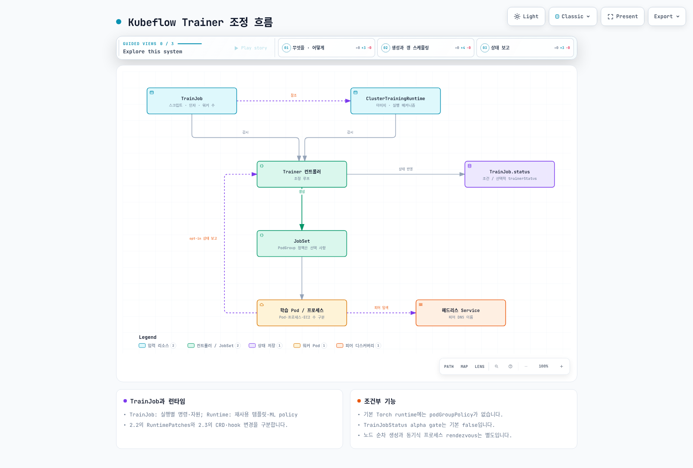

# Part 5: Kubeflow Trainer와 분산 학습

> **검토 기준**: Trainer 2.2.0 / Community Distribution 26.03.1; 2.3.0 업그레이드 차이 별도 검토
> **마지막 업데이트**: 2026년 9월 12일

## 실습 환경 준비

선택한 릴리스와 호환되는 Kubernetes, Trainer 컨트롤러·CRD, 런타임과 해당 런타임의 JobSet 등 의존성이 필요합니다. GPU는 학습 워크로드에 따라 선택하며 CPU 작업도 가능합니다. GPU를 사용한다면 드라이버·디바이스 플러그인·노드 용량과 네트워크를 별도로 구성하세요. 이 장의 검증은 Helm 렌더링과 스키마 검사이며 학습을 실행하지 않았습니다.

## 프레임워크별 오퍼레이터에서 통합 API로

Kubernetes 위 분산 학습은 Kubeflow 프로젝트 내부에서 실제로 큰 아키텍처 전환을 겪었습니다. YAML을 만지기 전에 이 흐름을 이해하는 것이 가장 중요합니다.

### 기존 Training Operator (v1)

Kubeflow가 2021년에 통합한 Training Operator는 **프레임워크별 CRD** 방식을 택했습니다. 지원하는 각 ML 프레임워크마다 별도의 Custom Resource Definition을 두고, 각 CRD는 그 프레임워크 고유의 분산 학습 규약을 구현하는 자체 컨트롤러를 가졌습니다.

* **`PyTorchJob`** — 컨트롤러가 PyTorch의 분산 실행 규약을 이해하고, 각 워커 Pod에 `MASTER_ADDR`, `RANK`, `WORLD_SIZE` 같은 환경 변수를 주입해 `torch.distributed`가 프로세스 그룹을 구성할 수 있게 했습니다.
* **`TFJob`** — 컨트롤러가 대신 `TF_CONFIG` 환경 변수(클러스터의 태스크 역할 — chief, worker, parameter server 등을 기술하는 JSON)를 구성해, TensorFlow의 분산 전략이 이를 참조하도록 했습니다.
* **`MPIJob`** — 컨트롤러가 Pod들에 걸쳐 MPI 작업을 실행하는 역할을 맡아, 워커 Pod 집합에 대해 `mpirun` 방식의 런처를 조율했습니다.

이 세 가지 외에도 v1 Training Operator는 몇몇 다른 프레임워크용 CRD도 함께 제공했습니다. 각 CRD는 "워커가 서로를 찾고 역할을 합의하는 방법"에 대한 프레임워크별 개념을 별도의 컨트롤러에 직접 인코딩했기 때문에, 프레임워크별 통합이 필요했습니다. 다만 공통 Job 컨트롤러 코드도 재사용하므로 매번 전체 제어 로직을 새로 작성한다는 뜻은 아닙니다.

### Kubeflow Trainer v2로의 전환

Kubeflow Trainer v2는 이를 프레임워크당 CRD 하나 대신, 두 가지 개념으로 이루어진 단일 통합 API로 대체합니다.

* **`TrainJob`** — *무엇을* 실행할지를 기술합니다: 학습 스크립트/엔트리포인트, 인자, 리소스 개수(예: 워커 수), 그리고 이를 실행할 런타임에 대한 참조입니다. ML 실무자가 개별 학습 실행 하나를 위해 생성하는 객체입니다.
* **`TrainingRuntime` / `ClusterTrainingRuntime`** — *어떻게* 실행할지를 기술합니다: 컨테이너 이미지, 분산 실행 메커니즘(워커가 서로를 어떻게 찾고 어떤 환경 변수나 런처 프로세스를 쓰는지), 기본 리소스 형태를 담은 재사용 가능한 프레임워크별 실행 템플릿입니다. 플랫폼 팀이 이런 런타임을 한 번만 정의해두면 — 예를 들어 PyTorch DDP 런타임, MPI 런타임 등 — 서로 다른 여러 `TrainJob`이 여러 번의 학습 실행에 걸쳐 같은 런타임을 참조할 수 있습니다.

이는 Kubernetes 다른 곳에서도 보이는 패턴과 비슷합니다. 재사용 가능한 "템플릿" 리소스와 그것을 소비하는 "인스턴스"를 분리하는 방식으로, `StorageClass`가 여러 `PersistentVolumeClaim`이 참조하는 재사용 가능한 템플릿이라는 것과 취지가 비슷합니다. 실질적인 이점은 플랫폼 팀이 까다로운 분산 실행 메커니즘을 런타임 한 곳에서 소유하고 버전을 관리할 수 있고, 작업을 제출하는 ML 실무자는 스크립트를 넘기고 런타임 이름만 지정하면 된다는 점입니다 — 런타임이 반복 설정을 줄여줍니다. 학습 코드의 분산 초기화, 데이터 분할, 체크포인트·실패 복구는 여전히 맞춰야 합니다.

### 2.2.0과 2.3.0의 차이

[Trainer 2.2.0](https://github.com/kubeflow/trainer/releases/tag/v2.2.0)은 2026년 3월 20일 출시되었고 26.03.1에 포함됩니다. JAX·XGBoost 런타임과 Flux 정책·통합이 추가되었지만, 포함된 기능이 모든 이미지·네트워크·가속기 조합에서 검증되었다는 뜻은 아닙니다.

2.2.0에는 `PodTemplateOverrides`를 `RuntimePatches`로 바꾸고 Torch policy의 `numProcPerNode`와 `ElasticPolicy`를 제거하는 breaking change도 있습니다. 실행별 `trainer.numProcPerNode`와 런타임 Torch policy 필드를 혼동하지 마세요. 이전 2.x 매니페스트도 변환 검토가 필요합니다.

학습 진행·메트릭을 위한 `status.trainerStatus`는 **TrainJobStatus feature gate를 켜야 하는 alpha 기능이며 기본값은 false**입니다. 학습 코드가 상태 서버로 보고해야 하고, 서버의 TLS·projected ServiceAccount token 접근이 필요합니다. 주입되는 token·CA 환경 변수의 값은 비밀 값 자체가 아닌 파일 경로입니다. 단순 로그 출력만으로 상태 메트릭이 자동 생성되지는 않습니다.

[2.3.0](https://github.com/kubeflow/trainer/releases/tag/v2.3.0)은 2026년 8월 7일 출시됐으며, 런타임 finalizer 제거·snapshot 처리와 Helm CRD 위치 변경을 포함합니다. 릴리스는 2.0/2.1/2.2에서 더 이후 버전으로 이동하려면 먼저 2.3을 거치라고 명시합니다. 실제 업그레이드 전에 CRD의 Helm 소유권과 릴리스별 이전 절차를 확인하고, 기존 CRD 삭제로 해결하려 하지 마세요.

실제 OCI 차트 렌더링에서도 차이가 있습니다. 2.2는 기본 런타임 8개를 직접 리소스로 렌더링하지만, 2.3은 `runtimes.yaml` ConfigMap과 post-install/post-upgrade installer Job으로 적용합니다. 2.3 hook은 실행 중 kubectl 설치, server-side 강제 적용, 관리 라벨 기반 prune을 수행하며 pre-delete hook도 있습니다. GitOps 도구의 hook 처리, 네트워크 접근, 런타임 소유권을 검토해야 합니다. 이번 검증은 렌더링만 했으며 hook을 실행하지 않았습니다.

### 레거시 API의 마이그레이션

26.03.1은 Trainer 2.2.0과 레거시 Training Operator 1.9.2를 함께 포함합니다. 이 사실이 특정 팀의 이전 진행률을 말해주지는 않습니다. `PyTorchJob`/`TFJob`/`MPIJob`과 `TrainJob`은 별도 API이며 자동 변환되지 않습니다.

[고정된 공식 마이그레이션 문서](https://github.com/kubeflow/trainer/blob/v2.3.0/docs/operator-guides/migration.md)는 PyTorchJob에서 기본 Torch runtime으로 옮기는 예제와 SDK 방향을 제공합니다. 모든 프레임워크·필드의 완전한 대응표는 아닙니다. replica 역할, 실행 명령, 환경 변수, 재시도, 스토리지, 스케줄링·네트워크와 체크포인트 복구를 실제 작업별로 비교해야 합니다.

## TrainJob과 런타임의 책임

`TrainingRuntime`은 네임스페이스 범위이며 `ClusterTrainingRuntime`은 클러스터 범위입니다. 둘 다 실행 템플릿과 ML policy를 담습니다. `TrainJob.runtimeRef`는 대상 kind와 name을 선택하고 trainer 설정으로 명령·인자·학습 Pod 수·Pod당 자원을 지정할 수 있습니다. 권한과 허용된 override 범위는 별도로 관리해야 합니다.

기본 `torch-distributed` 런타임은 `mlPolicy.numNodes: 1`, `torch: {}`와 JobSet 템플릿을 사용하며 2.2.0의 이미지 참조는 `pytorch/pytorch:2.10.0-cuda12.8-cudnn9-runtime`입니다. 이미지·런타임 리비전을 기록하고 대상 CPU 아키텍처·드라이버·통신 라이브러리를 확인해야 합니다. 이 장에서는 이미지를 실행하거나 모델을 학습하지 않았습니다.

`numNodes`는 여기서 학습 Pod의 수를 표현하며 EC2 인스턴스 수와 일대일 관계가 아닙니다. 프로세스 수, Pod당 GPU, 여러 Pod의 노드 배치를 따로 계산해야 합니다.

## Kubernetes에서의 분산 학습 메커니즘

JobSet과 런타임은 Job·Pod를 조합하고 Service·DNS, rank·rendezvous 설정으로 분산 프로세스의 탐색을 돕습니다. headless Service만으로 상태나 IP가 영구 보존되지는 않으며 안정적인 Pod 이름·hostname/subdomain과 네트워크 조건이 함께 필요합니다.

**Trainer 설치만으로 갱 스케줄링이 활성화되지는 않습니다.** 2.2.0 기본 Torch runtime에는 podGroupPolicy가 없습니다. Coscheduling/Volcano 같은 정책·CRD·스케줄러를 설치하고 연결해야 해당 PodGroup 경로가 작동합니다. Kueue admission과 실제 Pod 스케줄링도 구분해야 합니다.

동기식 고정 크기 작업은 통신을 시작할 때 필요한 모든 프로세스가 준비되어야 하지만 노드가 같은 순간에 생성되어야 하는 것은 아닙니다. 순차 프로비저닝 후 rendezvous timeout 안에 모일 수도 있고, 지원되는 elastic 작업은 다른 규칙을 사용할 수 있습니다. gang admission은 부분 할당 문제를 줄이지만 EC2 용량 부족이나 애플리케이션 교착을 모두 해결하지는 않습니다. [Karpenter](../../autoscaling/02-karpenter.md)의 용량 공급과 JobSet·스케줄러·프레임워크의 timeout/retry를 함께 설계하세요.

[🔍 인터랙티브 다이어그램 보기](https://www.atomai.click/kubernetes-docs/archmaps/ko-ai-ml-kubeflow-05-training-operator-0.html)

## 참고: Katib와 TrainJob

Katib 0.19.0은 설정된 Trial 템플릿에서 TrainJob을 사용할 수 있습니다. trialResources 등록, 런타임, success/failure 조건, primary Pod·컨테이너와 메트릭 수집을 맞춰야 합니다. Katib의 메트릭 보고는 Trainer의 opt-in status 서버와 별도 경로입니다. 성공한 TrainJob이 모델을 KServe에 자동 배포하지도 않습니다.

## 검증과 근거

공식 OCI의 Trainer Helm 차트 2.2.0·2.3.0을 내려받아 기본 런타임 포함 렌더링을 비교하고 CRD·런타임 스키마를 확인했습니다. API admission/CEL, 실제 업그레이드, JobSet 생성, 분산 학습·GPU·상태 서버 보고는 실행하지 않았습니다.

- [2.2.0 TrainJob API](https://github.com/kubeflow/trainer/blob/v2.2.0/pkg/apis/trainer/v1alpha1/trainjob_types.go)
- [TrainJobStatus 기본 feature gate](https://github.com/kubeflow/trainer/blob/v2.2.0/pkg/features/features.go)
- [Coscheduling 조건부 PodGroup 생성](https://github.com/kubeflow/trainer/blob/v2.2.0/pkg/runtime/framework/plugins/coscheduling/coscheduling.go)
- [기본 Torch runtime](https://github.com/kubeflow/trainer/blob/v2.2.0/manifests/base/runtimes/torch_distributed.yaml)

## 다음 단계

프레임워크별 CRD에서 통합된 `TrainJob`/런타임 모델로의 전환을 이해했다면, [Part 6: KServe — Kubernetes 기반 모델 서빙](./06-kserve.md)에서는 `TrainJob`으로 학습이 끝난 모델을 어떻게 서빙하는지를 다룹니다.

[메인 페이지로 돌아가기](./README.md)

## 퀴즈

이 장에서 배운 내용을 확인하려면 [주제 퀴즈](../../quizzes/ai-ml/kubeflow/05-training-operator-quiz.md)를 풀어보세요.
