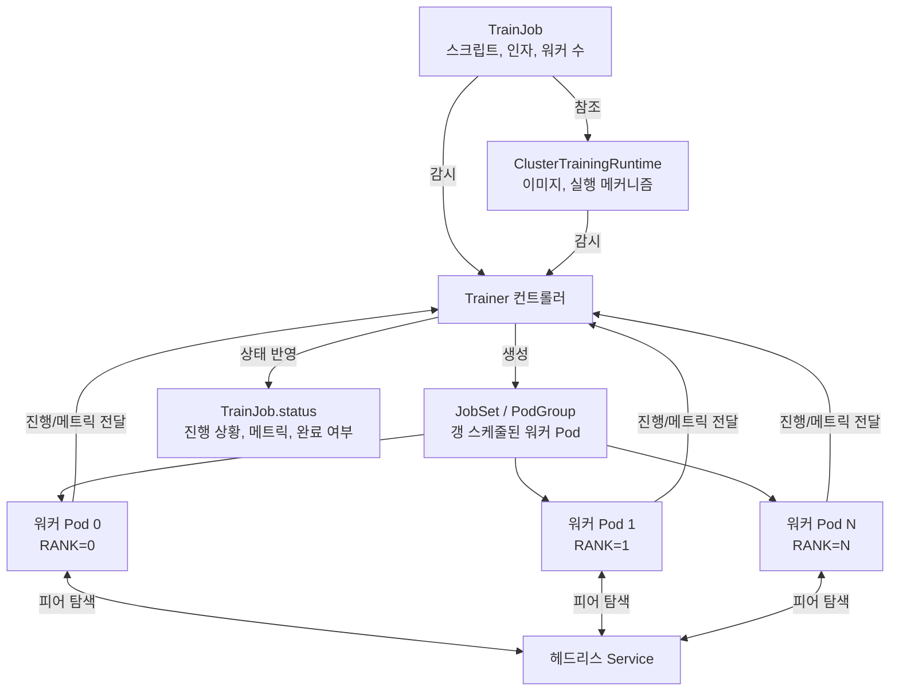

# Part 5: Kubeflow Trainer와 분산 학습

> **지원 버전**: Kubeflow Trainer v2.1(26.03에 포함)~v2.3, 레거시 Training Operator 1.9.2 (Kubeflow Community Distribution 26.03에 포함)
> **마지막 업데이트**: 2026년 8월 19일

## 실습 환경 준비

이 문서의 예제를 따라 하려면 다음 도구와 환경이 필요합니다.

### 필수 도구

* kubectl v1.34 이상
* GPU 노드 풀을 갖춘 Amazon EKS 클러스터 (GPU 노드 풀 구성 자체는 이 사이트의 [Karpenter](../../autoscaling/02-karpenter.md) 및 GPU 스케줄링 문서에서 다루며, 이 문서에서는 다시 설명하지 않습니다)
* Kubeflow Community Distribution을 통해 설치되었거나, Kubeflow Trainer를 단독으로 설치한 환경

## 프레임워크별 오퍼레이터에서 통합 API로

Kubernetes 위 분산 학습은 Kubeflow 프로젝트 내부에서 실제로 큰 아키텍처 전환을 겪었습니다. YAML을 만지기 전에 이 흐름을 이해하는 것이 가장 중요합니다.

### 기존 Training Operator (v1)

Kubeflow가 2021년에 통합한 Training Operator는 **프레임워크별 CRD** 방식을 택했습니다. 지원하는 각 ML 프레임워크마다 별도의 Custom Resource Definition을 두고, 각 CRD는 그 프레임워크 고유의 분산 학습 규약을 구현하는 자체 컨트롤러를 가졌습니다.

* **`PyTorchJob`** — 컨트롤러가 PyTorch의 분산 실행 규약을 이해하고, 각 워커 Pod에 `MASTER_ADDR`, `RANK`, `WORLD_SIZE` 같은 환경 변수를 주입해 `torch.distributed`가 프로세스 그룹을 구성할 수 있게 했습니다.
* **`TFJob`** — 컨트롤러가 대신 `TF_CONFIG` 환경 변수(클러스터의 태스크 역할 — chief, worker, parameter server 등을 기술하는 JSON)를 구성해, TensorFlow의 분산 전략이 이를 참조하도록 했습니다.
* **`MPIJob`** — 컨트롤러가 Pod들에 걸쳐 MPI 작업을 실행하는 역할을 맡아, 워커 Pod 집합에 대해 `mpirun` 방식의 런처를 조율했습니다.

이 세 가지 외에도 v1 Training Operator는 몇몇 다른 프레임워크용 CRD도 함께 제공했습니다. 각 CRD는 "워커가 서로를 찾고 역할을 합의하는 방법"에 대한 프레임워크별 개념을 별도의 컨트롤러에 직접 인코딩했기 때문에, 새 프레임워크를 추가한다는 것은 기존 로직을 재사용하는 대신 완전히 새로운 컨트롤러를 작성한다는 뜻이었습니다.

### Kubeflow Trainer v2로의 전환

Kubeflow Trainer v2는 이를 프레임워크당 CRD 하나 대신, 두 가지 개념으로 이루어진 단일 통합 API로 대체합니다.

* **`TrainJob`** — *무엇을* 실행할지를 기술합니다: 학습 스크립트/엔트리포인트, 인자, 리소스 개수(예: 워커 수), 그리고 이를 실행할 런타임에 대한 참조입니다. ML 실무자가 개별 학습 실행 하나를 위해 생성하는 객체입니다.
* **`TrainingRuntime` / `ClusterTrainingRuntime`** — *어떻게* 실행할지를 기술합니다: 컨테이너 이미지, 분산 실행 메커니즘(워커가 서로를 어떻게 찾고 어떤 환경 변수나 런처 프로세스를 쓰는지), 기본 리소스 형태를 담은 재사용 가능한 프레임워크별 실행 템플릿입니다. 플랫폼 팀이 이런 런타임을 한 번만 정의해두면 — 예를 들어 PyTorch DDP 런타임, MPI 런타임 등 — 서로 다른 여러 `TrainJob`이 여러 번의 학습 실행에 걸쳐 같은 런타임을 참조할 수 있습니다.

이는 Kubernetes 다른 곳에서도 보이는 패턴과 비슷합니다. 재사용 가능한 "템플릿" 리소스와 그것을 소비하는 "인스턴스"를 분리하는 방식으로, `StorageClass`가 여러 `PersistentVolumeClaim`이 참조하는 재사용 가능한 템플릿이라는 것과 취지가 비슷합니다. 실질적인 이점은 플랫폼 팀이 까다로운 분산 실행 메커니즘을 런타임 한 곳에서 소유하고 버전을 관리할 수 있고, 작업을 제출하는 ML 실무자는 스크립트를 넘기고 런타임 이름만 지정하면 된다는 점입니다 — 랭크 할당이나 주소 탐색이 실제로 어떻게 이루어지는지는 알 필요가 없습니다.

[릴리스 노트](https://github.com/kubeflow/trainer/releases)에 따르면 **Kubeflow Trainer v2.2**(2026년 3월경 출시, Kubeflow Community Distribution에는 26.03.1 패치부터 포함 — 26.03 자체는 v2.1.0을 배포)는 여기에 다음을 더했습니다.

* 기존 PyTorch 지원에 더해 **JAX**와 **XGBoost** 학습 런타임을 정식으로 지원 — 이 프레임워크들의 분산 학습도 별도의 CRD가 아니라 동일한 `TrainJob`/런타임 구조를 거치게 되었습니다.
* 향상된 **관측성(observability)**: 학습 스크립트 자체에서 진행 상황과 메트릭을 `TrainJob`의 상태(status)까지 전달할 수 있어, 실행 진행 상황을 보기 위해 로그나 별도의 메트릭 백엔드를 뒤질 필요가 줄었습니다.
* **Flux Framework 연동**: HPC 스타일의 작업 런처를 Trainer 생태계에 들여와 MPI 스타일 워크로드를 지원합니다 — 단순한 `mpirun` 실행보다 Flux의 스케줄링 및 프로세스 실행 모델의 이점을 살릴 수 있는, 강하게 결합된 HPC 성격의 분산 작업에 유용합니다.

### 실제로 진행 중이지만 아직 끝나지 않은 전환

생태계가 실제로 어디까지 왔는지를 과장하지 않는 것이 중요합니다. **Kubeflow Community Distribution 26.03**은 그 릴리스 시점에도 여전히 **레거시 Training Operator 1.9.2**(v1, 프레임워크별 CRD 오퍼레이터)를 함께 배포합니다. Kubeflow Trainer v2와 레거시 Training Operator는 현재 생태계 안에서 공존하고 있으며, `PyTorchJob`/`TFJob`/`MPIJob` 매니페스트에서 `TrainJob` + 런타임으로 실제 워크로드를 옮기는 마이그레이션은 많은 팀이 아직 절반쯤 진행 중인 **현재진행형 전환**입니다 — 특정 클러스터에서 이미 완료됐다고 가정할 수 있는 일회성 전환이 아닙니다.

실제 마이그레이션을 계획하고 있다면 이 문서를 마이그레이션 가이드로 삼지 마세요. 필드 단위의 권위 있는 참고 자료는 [kubeflow.org](https://www.kubeflow.org/docs/components/trainer/operator-guides/migration/)의 **"Migrating to Kubeflow Trainer v2"** 문서입니다. 이 가이드는 v1 CRD의 각 필드가 `TrainJob`과 기본 런타임으로 어떻게 매핑되는지를 구체적으로 다루므로, 여기서 모든 단계를 다시 나열하지는 않습니다.

이미 Trainer v2를 운영 중인 팀을 위한 별도 안내: v2.2 이후 **Trainer v2.3.0**(2026년 8월 출시)이 이 문서에서 설명한 런타임 CRD에 대해 호환성이 깨지는(breaking) 변경을 도입했습니다 — Runtime Finalizer가 제거되었고, CRD가 Helm 차트의 템플릿 디렉터리로 이동했습니다. v2.3.0 [릴리스 노트](https://github.com/kubeflow/trainer/releases)는 v2.0/v2.1/v2.2를 운영 중인 클러스터라면 그다음 버전으로 넘어가기 전에 반드시 v2.3으로 먼저 업그레이드해야 한다고 명시하고 있습니다. Trainer v2를 이미 운영 중인 클러스터를 업그레이드하기 전에는 이 안내를 직접 확인하세요.

## TrainJob의 개념적 구조

정확히 검증하지 않은 필드명을 임의로 만들어내지 않는 선에서, PyTorch DDP(distributed data-parallel) 실행을 위한 `TrainJob`은 대략 다음과 같이 책임이 나뉩니다.

* 플랫폼 팀이 한 번 만들어두는 **`ClusterTrainingRuntime`** — 학습 컨테이너 이미지(또는 베이스 이미지 요건), 기본 워커 복제본 수, PyTorch DDP를 위한 분산 실행 메커니즘(워커들이 랑데부 주소를 어떻게 찾고 랭크/월드 사이즈를 어떻게 합의하는지)을 묶어둡니다.
* 학습 실행마다 생성되는 **`TrainJob`** — 이름으로 위 `ClusterTrainingRuntime`을 참조하고, 실행별로 달라지는 부분(실제 학습 스크립트나 실행 명령, 스크립트 인자 — 학습률, 데이터셋 경로, epoch 수 등, 이 실행에 필요한 워커 수)을 채워 넣습니다.

`TrainJob`은 일부러 "가벼운" 객체로 설계되어 있습니다 — 분산 조율이 *어떻게* 일어나는지에 대한 복잡성 대부분은 개별 작업 매니페스트가 아니라 런타임 쪽에 있습니다. 이 덕분에 런타임이 여러 학습 실행에 걸쳐 재사용될 수 있고, 개별 데이터 과학자가 아니라 플랫폼 팀이 런타임 정의를 소유하고 강건하게 관리하는 것이 일반적입니다.

## Kubernetes에서의 분산 학습 메커니즘

어떤 프레임워크의 런타임을 쓰든, Kubernetes 위에서 다중 워커/다중 노드 분산 학습은 대체로 동일한 몇 가지 기본 요소를 통해 조율됩니다.

* **헤드리스 Service**를 워커 Pod 앞에 두어, 재스케줄링 시 바뀔 수 있는 Pod IP에 의존하지 않고 각 워커가 다른 워커를 가리키는 안정적이고 조회 가능한 DNS 이름을 갖게 합니다.
* **주입된 환경 변수**(또는 이에 준하는 설정 파일/초기화 단계)로 각 워커에게 자신의 랭크, 전체 워커 수, 랑데부/코디네이터 역할을 맡은 워커의 주소를 알려줍니다 — PyTorch에서 `MASTER_ADDR`/`RANK`/`WORLD_SIZE`가, TensorFlow에서 `TF_CONFIG`가 담당했던 역할을, Trainer v2에서는 런타임 추상화 아래로 일반화한 것입니다.
* **갱 스케줄링(gang scheduling) 고려사항**: 분산 학습 작업은 일반적으로 학습을 시작하기 전에 *모든* 워커가 함께 스케줄되어 실행 중이어야 합니다 — 워커 절반만 스케줄되고 나머지를 무한정 기다리는 작업은 GPU 자원을 낭비하고 데드락에 빠질 수 있습니다. 이 때문에 분산 학습 컨트롤러는 흔히 갱 스케줄링 메커니즘(작업의 Pod들을 all-or-nothing 단위로 묶어 스케줄러가 처리하도록 하는 것)에 의존하거나 이와 연동하며, 각 Pod를 독립적으로 스케줄하는 Kubernetes의 기본 동작에만 맡기지 않습니다.

EKS에서는 이것이 GPU 노드 풀을 어떻게 프로비저닝하고 스케일링하는지와 직접 맞닿습니다 — 예를 들어 GPU 워커 8개가 필요한 분산 작업은 오토스케일러가 하나씩 늘려주는 것이 아니라 8개의 GPU 가용 노드(또는 슬롯)가 동시에 준비되어 있어야 합니다. GPU 노드 풀 크기 산정과 스케일링(Karpenter NodePool, 인스턴스 타입 선택, GPU 빈패킹)에 대한 자세한 메커니즘은 이 사이트의 오토스케일링 및 GPU 스케줄링 문서에서 다루므로 여기서 다시 설명하지 않습니다. 이 문서에서 가져갈 핵심은, 갱 스케줄링 요구사항과 GPU 노드 풀의 탄력성을 함께 설계해야 한다는 점입니다 — 모든 워커를 한 번에 스케줄받지 못하는 학습 작업은 `TrainJob`/런타임 설정이 아무리 정확해도 멈춰버립니다.

## 참고: Katib와 TrainJob

이 시리즈의 Part 4는 Kubeflow의 하이퍼파라미터 튜닝 컴포넌트인 Katib을 다룹니다. Katib 실험(Experiment)의 각 Trial은 특정 하이퍼파라미터 조합 하나를 실제로 실행할 학습 작업이 필요한데, Trainer v2 기반 환경에서는 이 학습 작업이 보통 Katib이 Trial마다 템플릿으로 찍어내는 `TrainJob`입니다 — 각 Trial에서 선택된 하이퍼파라미터 값은 스크립트 인자로 주입됩니다. 위에서 설명한 런타임/작업 분리는 여기서도 그대로 적용됩니다. Katib은 분산 실행 메커니즘에 대해 전혀 알 필요가 없습니다 — 플랫폼 팀이 이미 정의해둔 런타임을 대상으로 Trial마다 `TrainJob`을 찍어내고, 보고된 메트릭을 읽어 다음 탐색 방향을 결정할 뿐입니다.

## 다음 단계

프레임워크별 CRD에서 통합된 `TrainJob`/런타임 모델로의 전환을 이해했다면, [Part 6: KServe — Kubernetes 기반 모델 서빙](./06-kserve.md)에서는 `TrainJob`으로 학습이 끝난 모델을 어떻게 서빙하는지를 다룹니다.

[메인 페이지로 돌아가기](./README.md)

## 퀴즈

이 장에서 배운 내용을 확인하려면 [주제 퀴즈](../../quizzes/ai-ml/kubeflow/05-training-operator-quiz.md)를 풀어보세요.
