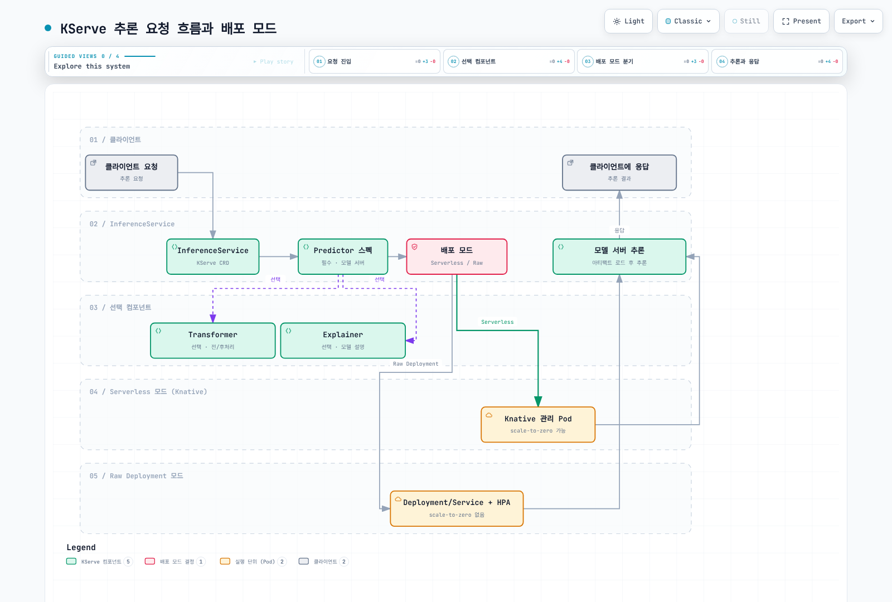

# Part 6: KServe — Kubernetes 위에서의 모델 서빙

> **지원 버전**: KServe (Kubeflow Community Distribution 26.03에 포함된 웹 앱 v0.16.1)
> **마지막 업데이트**: 2026년 8월 19일

## 실습 환경 준비

이 문서의 예제를 따라 하려면 다음 도구와 환경이 필요합니다.

### 필수 도구

* kubectl v1.34 이상, 동작 중인 EKS 클러스터
* Kubeflow가 설치되어 있고(Part 1), Central Dashboard에서 KServe 웹 앱이 보이는 상태
* GPU 기반 모델을 서빙할 계획이라면 GPU 지원 `NodePool`/`EC2NodeClass` 조합이 구성된 [Karpenter](../../autoscaling/02-karpenter.md)
* KServe의 Serverless 배포 모드를 사용할 계획이라면 클러스터에 설치된 Knative Serving

## KServe란 무엇이며 Kubeflow와는 어떤 관계인가

Part 1~5에서는 Kubeflow의 전체 아키텍처, Pipelines, Notebooks, Katib, 그리고 Kubeflow Trainer를 다루며 EKS 위에서 모델을 *학습*시키는 데 필요한 모든 것을 살펴봤습니다. 이번 마지막 파트에서는 학습이 끝난 이후, 즉 그 모델을 확장 가능한 프로덕션급 추론 엔드포인트로 서빙하는 **KServe**를 다룹니다.

KServe는 처음부터 독립적인 프로젝트로 시작한 것이 아닙니다. 원래는 Kubeflow 내부의 컴포넌트인 **KFServing**으로 출발했으며, 학습된 모델을 실제로 동작하는 추론 엔드포인트로 전환하는 역할을 맡았습니다. 프로젝트가 성숙해지면서 별도의 최상위 독립 저장소로 분리되어 **KServe**라는 이름으로 다시 태어났고, 더 이상 Kubeflow에만 종속된 하위 컴포넌트가 아닙니다 — Kubeflow가 전혀 설치되지 않은 임의의 Kubernetes 클러스터에도 독립적으로 설치하고 운영할 수 있습니다.

그럼에도 Kubeflow는 여전히 KServe를 기본 모델 서빙 계층으로 함께 제공합니다. Central Dashboard의 모델 서빙 웹 앱은 KServe CRD 위에 얹힌 얇은 UI일 뿐이며, Kubeflow Community Distribution은 배포판의 다른 컴포넌트들과 함께 이 웹 앱의 특정 버전을 고정해 배포합니다.

여기서 실무적으로 중요한 사실 하나는, **KServe 컨트롤러/CRD 버전과 Kubeflow 웹 앱 UI 버전은 같은 숫자가 아니며, 서로 발맞춰 움직이지도 않는다는 점**입니다. KServe는 자체 메인테이너와 자체 로드맵에 따라 독립적인 릴리스 주기를 갖고 있으며, 이는 Kubeflow Community Distribution의 캘린더 버저닝 릴리스 트레인과는 별개입니다(이 문서 상단의 `26.03`은 KServe 자체가 아니라 배포판을 가리키는 숫자입니다). Kubeflow Community Distribution 26.03 릴리스는 KServe 웹 애플리케이션을 **v0.16.1**으로 포함하고 있지만, 이 숫자는 대시보드 통합 부분을 가리킬 뿐이며 클러스터에서 실제로 실행 중인 KServe 컨트롤러와 CRD의 버전을 반드시 의미하지는 않습니다. 플랫폼 팀은 KServe 컨트롤러를 그것과 통신하는 Kubeflow 웹 앱과 독립적으로 업그레이드할 수 있고, 실제로 그렇게 하는 경우가 흔하기 때문입니다. `InferenceService`를 트러블슈팅할 때는 Kubeflow 대시보드에 표시되는 버전을 그대로 신뢰하기보다, 클러스터에 설치된 컨트롤러/CRD 버전을 직접 확인하는 것(예: KServe 컨트롤러 매니저의 이미지 태그를 통해)이 안전합니다.

설치된 버전과 무관하게 KServe가 노출하는 핵심 추상화는 **`InferenceService`** 커스텀 리소스입니다 — 모델과 서빙 방식, 그리고 스케일링 방식을 하나의 Kubernetes 오브젝트로 기술하는 리소스입니다.

## InferenceService의 구성: Predictor, Transformer, Explainer

`InferenceService`는 최대 세 가지 논리적 컴포넌트로 구성되며, 이 중 필수는 하나뿐입니다.

* **Predictor(필수)** — 모델 서버 그 자체입니다. 실제로 모델 아티팩트를 로드하고 추론 요청에 응답하는 컴포넌트입니다. KServe는 SKLearn, XGBoost, (TorchServe를 통한) PyTorch, NVIDIA Triton Inference Server처럼 흔히 쓰이는 프레임워크를 위한 빌트인 predictor를 기본으로 제공하므로, 이런 프레임워크에 해당하는 predictor 스펙은 모델 아티팩트 위치만 지정하면 서빙 코드를 따로 작성하지 않고도 동작하는 서버를 얻을 수 있습니다. 이런 빌트인 서버 범위를 벗어나는 경우에는 predictor가 KServe의 추론 프로토콜을 직접 구현한 **커스텀 컨테이너**를 실행하도록 구성할 수도 있습니다.
* **Transformer(선택)** — predictor 앞단에 위치하는 전/후처리 단계입니다. 일반적으로 요청이 모델에 도달하기 전 입력 피처 엔지니어링을 수행하거나, 모델의 원시 출력을 다운스트림 소비자가 기대하는 형식으로 재구성하는 역할을 합니다. 이를 predictor에서 분리해 두면 모델 서버 자체는 범용적이고 재사용 가능한 상태로 유지할 수 있습니다.
* **Explainer(선택)** — 단순 예측값과 함께, 또는 그것을 대신해 모델 설명(예: 피처 중요도나 반사실적 설명)을 생성하는 컴포넌트입니다. 소비 애플리케이션이 모델의 출력을 단순히 받는 것을 넘어 그 근거를 설명해야 하는 경우에 유용합니다.

필수인 것은 predictor뿐이며, 실제 프로덕션 환경의 많은 `InferenceService` 오브젝트는 predictor만으로 구성되고, 전/후처리나 설명 가능성이 특별히 필요한 경우에만 transformer나 explainer를 추가합니다.

## 배포 모드: Serverless vs. Raw Deployment

KServe는 `InferenceService`의 Pod가 실제로 어떻게 생성되고 관리되는지에 대해 두 가지 배포 모드를 지원합니다. EKS에서 KServe를 운영할 때 이 둘 중 하나를 선택하는 것은 가장 중요한 운영상의 결정 중 하나입니다.

### Serverless 모드 (Knative 기반)

Serverless 모드에서는 KServe가 Pod 라이프사이클 관리를 **Knative Serving**에 위임합니다. Knative는 `InferenceService`와 그 하부의 Deployment 사이에 위치하며 요청 트래픽을 관찰해 predictor(그리고 존재한다면 transformer/explainer) Pod 수를 늘리거나 줄이는데, 트래픽이 전혀 없을 때는 **Pod를 0개까지** 줄일 수도 있습니다. 이것이 Serverless 모드의 핵심 기능입니다 — 간헐적으로만 요청을 받는 모델은 유휴 상태에서 Pod를(그리고 그에 따른 GPU도) 계속 유지할 필요가 없습니다.

그 대가는 **콜드 스타트 지연**입니다. 0개로 스케일 다운된 상태에서 요청이 들어오면 Knative는 새 Pod를 스케줄링하고, 컨테이너가 시작되기를 기다리고, 모델 서버가 모델 아티팩트를 메모리에 로드하기를 기다린 뒤에야 첫 요청에 응답할 수 있습니다. 대형 모델을 GPU 기반 인스턴스에서 서빙하는 경우 이 콜드 스타트는 상당히 길어질 수 있습니다 — 모델 아티팩트 다운로드와 GPU 드라이버/런타임 초기화 모두 Pod가 서빙 준비 상태가 되기까지 실질적인 시간을 추가하기 때문입니다.

### Raw Deployment 모드

Raw Deployment 모드에서는 KServe가 일반적인 Kubernetes **Deployment**, **Service**, (선택적으로) **HorizontalPodAutoscaler**를 직접 관리합니다 — Knative에 대한 의존성이 전혀 없습니다. 이 모드는 운영상 더 단순하고(설치·업그레이드·이해해야 할 시스템이 하나 줄어듦) Knative의 콜드 스타트 문제를 완전히 피할 수 있습니다. Deployment에 설정된 최소 레플리카 수 이하로는 절대 스케일 다운되지 않기 때문입니다. 대가는 Raw Deployment 모드에는 **scale-to-zero가 없다는 것**입니다 — 트래픽이 있든 없든 최소 개수의 predictor Pod(그리고 그 GPU까지)가 항상 실행 상태로 유지됩니다.

### 어떻게 선택할 것인가

| 고려 사항 | Serverless (Knative) | Raw Deployment |
| --- | --- | --- |
| Scale-to-zero | 가능 | 불가능 |
| 0에서 스케일 업할 때의 콜드 스타트 지연 | 존재하며, 대형/GPU 모델에서는 상당할 수 있음 | 해당 없음 |
| 추가 클러스터 의존성 | Knative Serving 설치 필요 | 없음 |
| 적합한 상황 | 유휴 GPU 비용이 중요한, 간헐적이거나 트래픽이 튀는 추론 워크로드 | 항상 웜 Pod가 대기하고 있어야 하는 지연에 민감하거나 트래픽이 꾸준한 워크로드 |

실무적인 판단 기준은 다음과 같습니다. 요청 사이 유휴 상태에서 GPU 비용이 실제 예산 문제가 되고, 가끔의 콜드 스타트 지연을 감내할 수 있는 워크로드라면 Serverless 모드의 scale-to-zero가 Knative 의존성 추가를 감수할 만한 가치가 있습니다. 반대로 매 요청마다 일관되게 낮은 지연이 필요하거나, 이미 트래픽이 꾸준해서 Pod가 유휴 상태로 남을 일이 거의 없다면 Raw Deployment 모드의 단순함과 웜 Pod 보장이 더 나은 선택인 경우가 많습니다.

[🔍 인터랙티브 다이어그램 보기](https://www.atomai.click/kubernetes-docs/archmaps/ko-ai-ml-kubeflow-06-kserve-0.html)

## 오토스케일링: Knative Concurrency/RPS vs. HPA

두 배포 모드는 scale-to-zero 여부만 다른 것이 아니라, 워크로드가 실행되고 있는 동안의 오토스케일링 방식 자체가 근본적으로 다릅니다.

* **Serverless 모드**는 **Knative 자체의 오토스케일러**를 사용하며, 리소스 사용률이 아니라 요청 단위 신호 — 일반적으로 **동시성(concurrency, 한 Pod가 동시에 처리 중인 요청 수)**이나 **초당 요청 수(RPS)** — 를 기준으로 Pod를 스케일링합니다. 이는 추론 워크로드에 더 직접적으로 맞는 방식인 경우가 많은데, 느린 모델은 CPU가 포화되기 훨씬 전에 동시 요청 수에서 먼저 포화되기 때문에, 요청 단위 신호로 스케일링하는 것이 CPU 기반 신호보다 트래픽 폭증에 더 빠르게 반응합니다.
* **Raw Deployment 모드**는 표준 Kubernetes **HorizontalPodAutoscaler**에 의존하며, CPU/메모리 사용률이나 커스텀 메트릭(예: 메트릭 어댑터를 통해 노출되는 GPU 사용률 메트릭)을 기준으로 스케일링합니다 — 클러스터의 다른 일반 Deployment와 동일한 오토스케일링 모델입니다.

어느 쪽 방식이 보편적으로 더 우수하다고 할 수는 없으며, 올바른 선택은 앞의 "배포 모드" 절의 결정과 궤를 같이합니다. 동시성/RPS 기반 스케일링은 요청 단위 백프레셔가 실제 병목인, 트래픽이 튀는 추론 워크로드에 적합하고, HPA 기반 스케일링은 CPU/GPU 사용률이 이미 부하를 잘 대표하는 지표이고 굳이 요청 단위 신호를 얻기 위해 Knative를 도입하고 싶지 않은 경우에 적합합니다.

## 점진적 모델 업데이트를 위한 캐너리 롤아웃

새 모델 버전을 안전하게 배포하는 것 — 전체 트래픽을 완전히 넘기기 전에 실제 트래픽의 일부로 먼저 검증하는 것 — 은 서빙에서 핵심적인 관심사이며, KServe는 이를 위한 내장 메커니즘을 제공합니다. `InferenceService`를 새 모델 리비전을 가리키도록 업데이트하면 KServe는 설정된 비율에 따라 이전(stable) 리비전과 새(canary) 리비전 사이에 실제 트래픽을 분산시키며, 신뢰가 쌓일수록 새 리비전으로 트래픽을 점진적으로 더 많이 옮기거나, 새 리비전에 문제가 생기면 트래픽 분산 비율을 되돌리는 것만으로 이전 리비전으로 롤백할 수 있습니다.

이는 이 문서 사이트의 다른 곳에서 다루는 Istio나 Argo Rollouts 기반 트래픽 분산 패턴과는 다른 메커니즘입니다(참고: [Istio 트래픽 관리](../../service-mesh/istio/traffic-management/04-traffic-splitting.md), [Argo Rollouts](../../service-mesh/istio/advanced/08-argo-rollouts.md)) — KServe의 캐너리 롤아웃은 서비스 메시의 트래픽 분산 프리미티브나 범용 점진적 배포 컨트롤러를 거치지 않고, KServe 컨트롤 플레인 자체에 내장된 채로 `InferenceService` 리비전 단위에서 동작합니다. 이미 다른 모든 워크로드의 캐너리 배포를 Istio나 Argo Rollouts로 표준화해 둔 플랫폼 팀이라면, KServe 자체의 메커니즘이 별도의, 모델 서빙에 특화된 경로라는 점을 알아둘 필요가 있습니다 — 기존 방식을 대체해야 한다는 뜻은 아니지만, 다루는 대상이 구체적으로 `InferenceService`일 때는 알아둘 만한 별개의 도구입니다.

## EKS에서의 GPU 추론

모델을 GPU에서 서빙하는 것은 다른 어떤 Kubernetes Pod와 마찬가지로 predictor 스펙이 컨테이너의 리소스 요청/제한을 통해 GPU device plugin이 노출하는 리소스(예: NVIDIA GPU 리소스 타입)를 요청하는 문제로 귀결됩니다. PyTorch나 Triton 같은 프레임워크용 KServe 빌트인 predictor 서버는 기본적으로 GPU를 인식하므로, predictor 스펙이 GPU를 요청하기만 하면 별도의 KServe 전용 설정 없이도 하부 모델 서버가 추론에 그 GPU를 사용합니다.

이 요청의 노드 프로비저닝 측면에서 직접적으로 관련되는 것이 이 사이트의 오토스케일링 자료에서 다루는 [Karpenter의 GPU 노드 풀](../../autoscaling/02-karpenter.md)입니다. 기존 노드로는 충족할 수 없는 GPU 리소스를 요청하는 `InferenceService` predictor Pod가 생기면 Karpenter가 그에 맞는 GPU 기반 EC2 인스턴스를 프로비저닝하며, Pod가 더 이상 그 GPU를 필요로 하지 않게 되면 Karpenter의 통합(consolidation) 동작이 해당 용량을 적절히 재조정하거나 회수할 수 있습니다 — 특히 Serverless 모드에서는 predictor가 0으로 스케일 다운되면 그 뒤에 있던 GPU 노드가 무기한 예약된 상태로 남는 대신 통합 대상이 된다는 점에서 이 상호작용이 더욱 중요합니다. KServe 자체의 스케일링 결정(위 "오토스케일링" 절 참고)과 그에 대한 Karpenter의 노드 단위 대응은, 이 문서에서 EKS의 다른 오토스케일 워크로드에 대해 설명하는 것과 동일한 2단계 오토스케일링 패턴을 그대로 따릅니다 — 하나의 제어 루프는 얼마나 많은 Pod가 필요한지를 결정하고, 별개의 독립적인 제어 루프는 그 Pod들을 실행하기 위해 얼마나 많은 노드가 필요한지를 결정합니다.

## 다음 단계

KServe는 필수 predictor와 선택적 transformer/explainer 컴포넌트로 구성된 단일 `InferenceService` 리소스를 통해 학습된 모델을 Kubernetes 네이티브 추론 엔드포인트로 전환합니다. 가장 중요한 운영상의 결정은 Serverless(Knative 기반, scale-to-zero, 동시성/RPS 오토스케일링, 콜드 스타트 위험)와 Raw Deployment(일반 Deployment/HPA, 항상 웜 상태, Knative 비의존) 사이의 선택이며, 이는 특정 모델의 트래픽 패턴에서 유휴 GPU 비용과 일관된 저지연 중 어느 것이 더 중요한지에 따라 결정되어야 합니다. 내장 캐너리 롤아웃은 KServe에 플랫폼의 다른 곳에서 쓰이는 Istio/Argo Rollouts 메커니즘과는 구분되는, 모델에 특화된 점진적 배포 경로를 제공하며, GPU 기반 predictor는 Karpenter의 GPU 노드 풀과 직접 결합해 EKS에서 적정 규모의 추론 용량을 확보할 수 있습니다.

이것으로 6부작 Kubeflow on EKS 시리즈를 마무리합니다: 아키텍처와 설치(Part 1), Pipelines(Part 2), Notebooks(Part 3), Katib(Part 4), Kubeflow Trainer(Part 5), 그리고 이번 파트의 모델 서빙 계층인 KServe(Part 6)까지입니다.

---

[메인 페이지로 돌아가기](./README.md)

## 퀴즈

이 장에서 배운 내용을 확인하려면 [주제 퀴즈](../../quizzes/ai-ml/kubeflow/06-kserve-quiz.md)를 풀어보세요.
