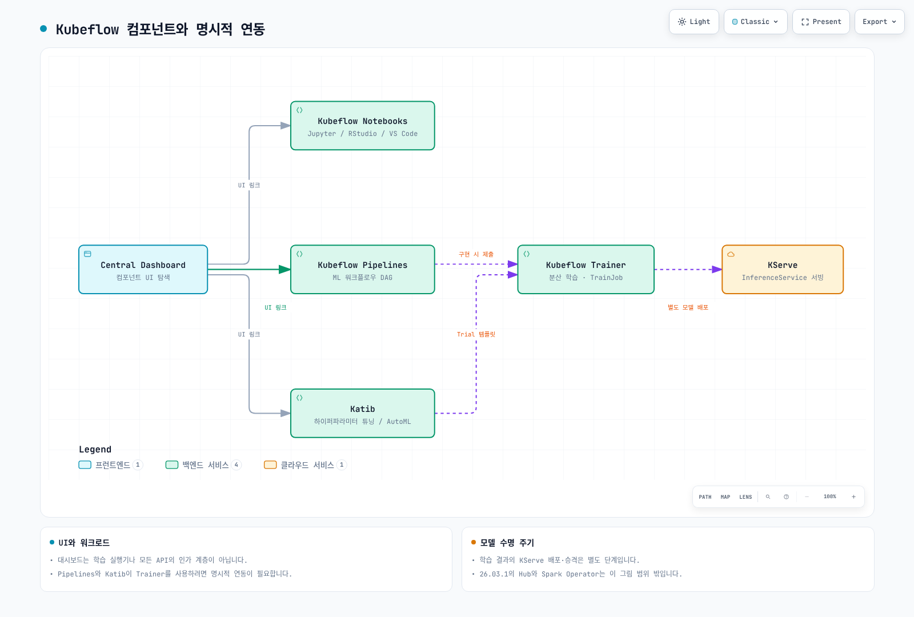

# Kubeflow on EKS 딥다이브

> **검토 기준**: Kubeflow Community Distribution 26.03.1
> **마지막 검토**: 2026년 9월 12일

## 개요

Kubeflow는 ML 파이프라인, 노트북, 튜닝, 학습, 서빙을 위한 Kubernetes 기반 도구를 제공합니다. Community Distribution은 컴포넌트 리비전, 공통 서비스, 대시보드를 묶으며, 개별 프로젝트에도 자체 릴리스와 설치 조건이 있습니다.

CNCF는 [2026년 8월 17일 Kubeflow의 졸업을 발표했습니다](https://www.cncf.io/announcements/2026/08/17/cncf-announces-kubeflows-graduation-solidifying-the-standard-for-cloud-native-ai-operations/). 이는 독립 보안 감사를 포함한 프로젝트 성숙도와 거버넌스를 인정한 것입니다. 특정 EKS 배포의 보안이나 규제 준수를 인증하는 것은 아닙니다.

## 컴포넌트 맵

| 컴포넌트 | 목적 | API 또는 개념 | 가이드 |
| --- | --- | --- | --- |
| Dashboard, Profiles, 접근 관리 | UI 탐색, 네임스페이스 소유권과 구성원 관리 | 클러스터 범위 `Profile`; 선택적 쿼터 | [Part 1](01-architecture-installation.md) |
| Pipelines | 워크플로 컴파일·실행, 이력과 아티팩트 관리 | Pipeline/Run/Experiment API; 선택적 Kubernetes Native API 모드의 `Pipeline`/`PipelineVersion` CRD | [Part 2](02-pipelines.md) |
| Notebooks | 사용자 노트북 워크로드 | `Notebook`; 이미지와 PVC 설정 | [Part 3](03-notebooks.md) |
| Katib | 하이퍼파라미터 탐색과 시험 실행 | `Experiment`, `Trial`, `Suggestion` CRD | [Part 4](04-katib.md) |
| Trainer | 설정된 런타임을 이용한 분산 학습 | `TrainJob`, `TrainingRuntime`, `ClusterTrainingRuntime` | [Part 5](05-training-operator.md) |
| KServe | 모델 추론 서비스 | `InferenceService`; 배포 모드별 의존성 | [Part 6](06-kserve.md) |

이 표는 가이드의 범위이며 전체 배포판 목록은 아닙니다. 26.03.1에는 Hub/모델 레지스트리와 Spark Operator도 포함됩니다. KFP Experiment는 Katib Experiment CRD와 다릅니다.

[🔍 인터랙티브 다이어그램 보기](https://www.atomai.click/kubernetes-docs/archmaps/ko-ai-ml-kubeflow-readme-0.html)

대시보드는 각 컴포넌트 UI의 진입점을 제공합니다. 파이프라인이나 Katib이 Trainer를 사용하려면 구현에서 지원되는 학습 리소스를 명시적으로 제출해야 합니다. 학습 아티팩트를 KServe에 연결하는 과정도 별도 배포 단계이며, 그림이 자동 모델 승격을 뜻하지는 않습니다.

## 왜 EKS에서 운영하는가

기존 EKS 플랫폼의 용량 관리, 스토리지 연동, 워크로드 신원, 모니터링을 ML에도 적용할 수 있습니다. 다만 Kubernetes 버전, CPU 아키텍처, 이미지, 네트워크, 스토리지 드라이버, 인증 설정의 호환성을 확인해야 합니다. Kubernetes 표준 준수만으로 충분하지 않으며, 릴리스 문서도 ARM64 이미지 지원이 완전하지 않음을 명시합니다.

컴포넌트·CRD 업그레이드, 테넌트 인가, 영속 데이터, 자격 증명, 복구는 운영팀의 책임입니다. [Amazon SageMaker AI](../sagemaker-ai/README.md)는 일부 인프라 운영을 줄여주지만 데이터 접근, 애플리케이션 동작, 모델 품질, 비용 관리는 여전히 필요합니다. 필요한 인터페이스, 운영 역량, 워크로드 조건을 기준으로 선택하세요.

## 현재 제공 중인 문서

1. [Part 1: EKS 아키텍처와 설치](01-architecture-installation.md) — Community 릴리스, 기존 AWS 배포판의 제약, Profile, 신원, 매니페스트 렌더링.
2. [Part 2: Pipelines](02-pipelines.md) — SDK v2, 컴파일, 실행, 아티팩트 저장.
3. [Part 3: Notebooks](03-notebooks.md) — 워크로드, Profile, 스토리지, GPU 배치.
4. [Part 4: Katib](04-katib.md) — Experiment, Trial, 탐색, 조기 종료.
5. [Part 5: Trainer](05-training-operator.md) — 레거시 Training Operator와 Trainer v2 API.
6. [Part 6: KServe](06-kserve.md) — 추론 리소스, 배포 모드, 롤아웃.

각 장의 컴포넌트 기준 버전을 확인하세요. 설치를 선택하기 전 [26.03.1 릴리스](https://github.com/kubeflow/community-distribution/releases/tag/26.03.1)와 [고정된 목록](https://github.com/kubeflow/community-distribution/blob/26.03.1/README.md)을 확인해야 합니다.
