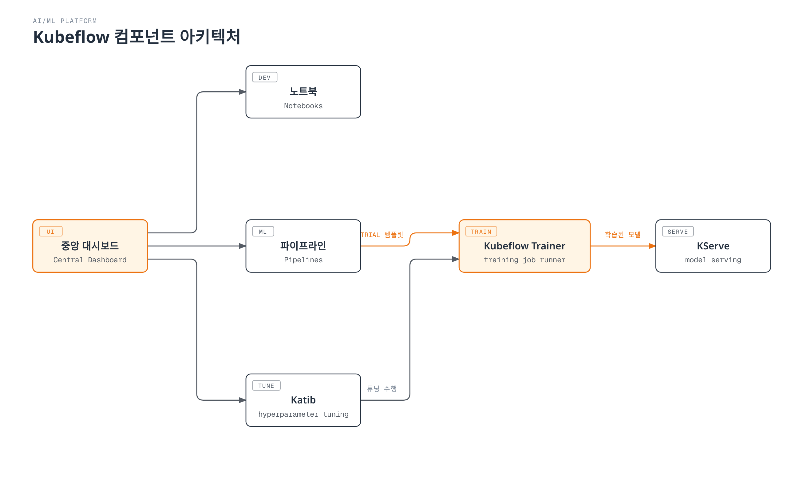

# Kubeflow on EKS 딥다이브

> **지원 버전**: Kubeflow Community Distribution 26.03
> **마지막 업데이트**: 2026년 8월 19일

## 개요

Kubeflow는 파이프라인 오케스트레이션, 노트북, 하이퍼파라미터 튜닝, 분산 학습, 모델 서빙까지 ML 워크로드를 처음부터 끝까지 운영하는 데 필요한 요소들을 하나의 거대한 애플리케이션이 아니라 여러 개의 Kubernetes 네이티브 컨트롤러/CRD 묶음으로 제공하는 오픈소스 머신러닝 플랫폼입니다. 2026년 8월 17일 CNCF는 Kubeflow의 졸업(Graduation)을 발표했습니다. 2023년 인큐베이팅 프로젝트로 합류한 이후, 독립 보안 감사를 통과하고 정식 운영위원회(Steering Committee)를 구성한 결과로, 프로젝트의 프로덕션 성숙도를 보여주는 강력한 신호입니다.

## 컴포넌트 맵

| 컴포넌트 | 해결하는 문제 | 핵심 CRD/개념 | 심화 가이드 |
|-----------|--------------------|---------------------|-----------|
| **Central Dashboard & Profiles** | 멀티테넌트 접근 제어, 사용자별 네임스페이스 격리 | Profile(네임스페이스) | [Part 1](01-architecture-installation.md) |
| **Kubeflow Pipelines** | 여러 단계로 구성된 ML 워크플로우를 DAG로 오케스트레이션 | `Pipeline`, `Run`, `Experiment` | [Part 2](02-pipelines.md) |
| **Kubeflow Notebooks** | 사용자별 관리형 Jupyter/RStudio/VS Code 환경 | `Notebook` | [Part 3](03-notebooks.md) |
| **Katib** | 하이퍼파라미터 튜닝과 AutoML | `Experiment`, `Trial`, `Suggestion` | [Part 4](04-katib.md) |
| **Kubeflow Trainer** | 여러 프레임워크에 걸친 분산 모델 학습 | `TrainJob`, `ClusterTrainingRuntime` | [Part 5](05-training-operator.md) |
| **KServe** | 모델 서빙과 추론 | `InferenceService` | [Part 6](06-kserve.md) |

## 왜 EKS에서 운영하는가

Kubeflow의 각 컴포넌트는 표준을 준수하는 모든 Kubernetes 클러스터에서 동작하도록 설계되어 있습니다. 즉, 이 문서 사이트가 이미 다루고 있는 EKS 운영 방식 — Karpenter 기반 오토스케일링(GPU 노드 풀 포함), AWS 서비스 접근을 위한 IRSA/Pod Identity, EBS/S3 스토리지 연동, Prometheus/Grafana 기반 관측성 — 을 별도의 ML 전용 플랫폼 없이 ML 워크로드에도 그대로 적용할 수 있습니다. Amazon SageMaker 같은 완전관리형 서비스 대비 트레이드오프는 [Data on EKS](../../data-on-eks/README.md)에서 다룬 것과 동일합니다: 운영 부담(Operator 업그레이드, 스토리지/자격증명 연동)은 더 크지만, 클러스터의 모든 워크로드에 걸쳐 동일한 배포/관측 모델을 유지할 수 있고, 플랫폼 전체를 한 번에 도입하지 않고도 Kubeflow의 각 컴포넌트를 독립적으로 사용할 수 있습니다.

## 현재 제공 중인 문서

1. [Part 1: Kubeflow 아키텍처와 EKS 설치](01-architecture-installation.md) — 컴포넌트 아키텍처, CNCF 졸업 배경, `awslabs/kubeflow-manifests`를 통한 EKS 설치
2. [Part 2: Kubeflow Pipelines](02-pipelines.md) — KFP SDK v2, IR 기반 파이프라인 컴파일, S3 기반 아티팩트 저장소
3. [Part 3: Kubeflow Notebooks](03-notebooks.md) — 사용자별 노트북 서버, Profile 기반 멀티테넌시, GPU 스케줄링
4. [Part 4: Katib — 하이퍼파라미터 튜닝과 AutoML](04-katib.md) — Experiment/Trial/Suggestion 모델, 탐색 알고리즘, 조기 종료
5. [Part 5: Kubeflow Trainer와 분산 학습](05-training-operator.md) — v1 Training Operator에서 Kubeflow Trainer v2로의 전환, TrainJob/TrainingRuntime
6. [Part 6: KServe — Kubernetes 기반 모델 서빙](06-kserve.md) — InferenceService, Serverless vs. Raw Deployment 모드, 캐너리 롤아웃
