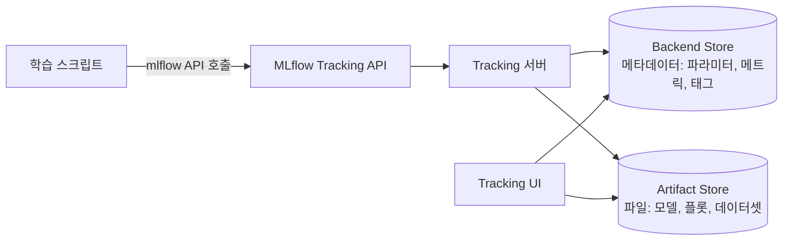

# Part 1: MLflow Tracking

> **지원 버전**: MLflow 3.15.1
> **마지막 업데이트**: 2026년 8월 19일

## 실습 환경 준비

이 문서의 예제를 따라 하려면 다음 도구와 환경이 필요합니다.

### 필수 도구

* Python 3.10 이상
* `pip install mlflow` (이 문서는 MLflow 3.x를 기준으로 작성되었습니다. 예제와 정확히 동일한 환경을 원한다면 `mlflow==3.15.1`처럼 특정 버전을 고정해서 설치하세요)
* 실행 중인 MLflow tracking 서버, 또는 예제 실행을 위해 로컬에서 `mlflow server`로 직접 띄운 서버 — 프로덕션용 tracking 서버를 EKS에 구축하는 방법은 [Part 3: EKS 배포](./03-eks-deployment.md)에서 다룹니다
* 로깅 코드를 몇 줄 추가할 수 있는 학습 스크립트나 노트북 (scikit-learn, PyTorch 등 어떤 예제든 무방합니다)

## MLflow Tracking이란 무엇인가?

MLflow Tracking은 머신러닝 학습 실행(run)에 대한 정보를 기록하고 조회하는 MLflow의 구성 요소입니다. 데이터를 기록하는 Python(및 REST) API와, 기록된 데이터를 조회하는 UI를 함께 제공합니다. 기록 대상은 크게 몇 가지로 나뉩니다: 파라미터(학습률, 배치 크기 등 run에 대한 입력값), 메트릭(정확도, 손실값처럼 학습 중 또는 학습 후에 측정되는 출력값), 아티팩트(플롯, 데이터셋, 직렬화된 모델 등 run이 만들어내는 임의의 파일), 그리고 MLflow 3부터는 모델 자체도 단순 파일이 아니라 독립적인 엔티티로 기록됩니다.

이 모든 기록은 **tracking 서버**를 통해 이루어지는데, 실제로는 하나의 API 뒤에서 함께 동작하는 두 개의 저장소로 구성됩니다: 구조화된 메타데이터를 담는 backend store와, 크고 무거운 바이너리 파일을 담는 artifact store입니다. 이 문서에서는 Tracking을 일상적으로 사용하는 데 필요한 개념을 다루고, backend store와 artifact store의 구분은 직접 tracking 서버를 배포할 때 더 중요해지므로 Part 3에서 더 깊이 다시 살펴봅니다.

## 핵심 개념: Experiment와 Run

**Experiment**는 이름이 붙은 Run들의 모음으로, 보통 프로젝트 하나 또는 반복 실험 중인 모델 하나에 하나씩 대응합니다. **Run**은 학습 코드를 한 번 실행한 결과입니다 — 모델을 한 번 학습시키거나, 평가하거나, 그 외에 기록할 가치가 있는 결과를 만들어내는 한 번의 실행입니다. 각 run은 자신만의 파라미터, 메트릭, 태그, 아티팩트를 가지므로, 같은 experiment 안에서 여러 run을 서로 비교해 어떤 설정이 가장 좋은 성능을 냈는지 확인할 수 있습니다.

가장 기본적인 tracking 코드는 다음과 같습니다.

```python
import mlflow

with mlflow.start_run():
    mlflow.log_param("learning_rate", 0.01)
    mlflow.log_metric("accuracy", 0.92)
    mlflow.log_artifact("confusion_matrix.png")
```

`with mlflow.start_run()` 컨텍스트 매니저는 run을 하나 열고, 블록 내부의 모든 로깅 호출을 그 run과 연결한 뒤, 블록이 끝나면 자동으로 run을 종료합니다.

### 오토로깅(Autologging)

관심 있는 값마다 `log_param`, `log_metric`을 일일이 호출하는 것은 금방 번거로워집니다. MLflow의 **오토로깅** 기능은 주요 ML 라이브러리를 계측하여, 학습 코드를 바꾸지 않아도 파라미터, 메트릭, 아티팩트가 자동으로 기록되게 해줍니다. 다음 한 줄로 활성화할 수 있습니다.

```python
mlflow.autolog()
```

이 호출은 현재 프로세스에서 사용 중인, 지원되는 프레임워크에 대해 오토로깅을 활성화합니다. MLflow는 scikit-learn용, PyTorch용처럼 프레임워크별 오토로그 함수도 별도로 제공하므로, MLflow가 감지할 수 있는 모든 프레임워크가 아니라 특정 라이브러리 하나에만 오토로깅을 적용하고 싶을 때 사용할 수 있습니다. 일상적인 학습 run에는 오토로깅을 기본값으로 쓰는 것이 좋고, 오토로깅이 알지 못하는 값 — 커스텀 평가 메트릭이나 도메인 특화 아티팩트 등 — 을 기록해야 할 때는 수동 로깅이 여전히 유용합니다.

## MLflow 3의 전환점: 1급 엔티티가 된 모델

MLflow 1.x나 2.x를 사용해봤다면, 모델 추적 방식이 지금과 달랐다는 것을 알 것입니다. 과거의 run 중심 모델에서는 기록된 모델이 **Run 아래에 종속된 하나의 아티팩트**일 뿐이었습니다. 활성화된 `mlflow.start_run()` 블록 안에서 `mlflow.sklearn.log_model(...)`을 호출하면, 모델 파일은 다른 플롯이나 데이터셋과 함께 그 run의 아티팩트 디렉터리에 저장되었습니다. 모델을 찾으려면 먼저 그 모델을 만들어낸 run을 찾아야 했습니다.

MLflow 3는 **`LoggedModel`**을 그 모델을 만든 run과는 별개인, 독립적인 1급 엔티티로 도입하면서 이 구조를 바꿨습니다. 여기서 몇 가지 변화가 따라옵니다.

* 활성화된 `mlflow.start_run()` 컨텍스트 없이도 `mlflow.sklearn.log_model(...)`을 직접 호출할 수 있습니다 — 모델을 추적하기 위해 반드시 어떤 run 아래에 종속되어야 할 필요가 없어졌습니다.
* Tracking UI에는 Experiments/Runs 화면과 구분되는 전용 **Logged Models** 화면이 생겨, 관심 있는 모델을 만든 run을 일일이 뒤지는 대신 모델을 직접 조회하고 비교할 수 있습니다.
* 모델이 더 이상 특정 run 하나에 속한 파일이 아니게 되면서, MLflow 3는 모델과 그에 연관된 run, trace, 프롬프트, 평가 메트릭 사이의 계보(lineage)를 더 풍부하게 추적할 수 있습니다. 모델을 학습시킨 run, 그 모델을 평가한 run들, 그 모델을 서빙하며 생성된 trace들을 하나의 실행에 영구히 묶이지 않고 서로 연결할 수 있습니다.

이 변화로 모델의 버저닝과 비교가 특정 학습 run 하나에 묶이지 않게 됩니다. 같은 모델을 여러 run에 걸쳐 반복 개선하거나, 전통적인 학습 루프 밖에서 모델을 만들어내는 경우(예: 기존 LLM을 커스텀 로직으로 감싸는 경우)에 특히 중요해지는 부분입니다.

## GenAI와 LLM 관찰성: 트레이싱(Tracing)

MLflow는 원래 학습 run에 대한 파라미터, 메트릭, 아티팩트를 기록하는 전통적인 ML 실험 추적을 목표로 했습니다. MLflow 3는 이 동일한 tracking 시스템을 확장해 **GenAI와 에이전트 관찰성**을 별도의 도구가 아니라 핵심 기능으로 포함시켰습니다. 이를 가능하게 하는 메커니즘이 **트레이싱**입니다.

트레이싱은 LLM 또는 에이전트 호출의 내부 단계를 **span**들의 트리 구조로 기록합니다. 각 span은 검색(retrieval) 호출, 도구 호출, 기반 모델 호출 등 한 단계를 나타내며, 각 단계별 토큰 사용량과 비용도 함께 기록됩니다. MLflow는 LangChain을 비롯한 널리 쓰이는 LLM·에이전트 프레임워크에 대한 자동 계측을 제공하며, PydanticAI, smolagents 같은 프레임워크를 위한 새로운 자동 트레이싱 연동도 추가되고 있어, 많은 경우 애플리케이션 코드를 거의 또는 전혀 수정하지 않고도 트레이싱을 활성화할 수 있습니다. Trace는 experiment·run을 조회하던 동일한 tracking UI에서 확인할 수 있으며, MLflow 3가 추적하는 계보에 따라 그 trace를 만들어낸 모델, 프롬프트, 평가 run으로 다시 연결될 수 있습니다.

실무적으로 이는, 전통적인 ML 학습과 LLM·에이전트 개발을 함께 하는 팀이 GenAI 쪽을 위한 별도의 관찰성 도구를 따로 구축하지 않고, 하나의 MLflow Tracking 배포로 두 영역을 모두 다룰 수 있다는 뜻입니다.

## Backend Store와 Artifact Store

Tracking 서버는 저장하는 데이터를 두 범주로 나누고, 이를 각각 다른 종류의 저장소로 처리합니다.

* **Backend store**: 파라미터, 메트릭, 태그, 그리고 experiment·run·(MLflow 3부터는) logged model을 설명하는 레코드 같은 구조화된 메타데이터를 저장합니다. 간단한 로컬 실험 수준을 넘어서는 팀 규모에서는 기본으로 제공되는 로컬 파일 기반 저장소 대신 PostgreSQL, MySQL 같은 실제 관계형 데이터베이스가 필요합니다.
* **Artifact store**: 모델 파일, 플롯, 데이터셋 등 run이 만들어내는 대용량 바이너리 객체를 저장합니다. 데이터베이스보다는 S3 호환 버킷 같은 객체 스토리지가 일반적입니다.

이 구분이 중요한 이유는 두 저장소의 내구성, 확장성, 접근 패턴 요구사항이 서로 다르기 때문입니다. 데이터베이스는 작고 구조화된 쓰기·조회가 많은 상황에 적합하고, 객체 스토리지는 크기가 큰 파일을 저장하고 조회하는 데 적합합니다. 직접 EKS에서 tracking 서버를 운영할 때 이 구분이 어떤 인프라 선택으로 이어지는지는 [Part 3: EKS 배포](./03-eks-deployment.md)에서 자세히 다룹니다. 지금은 두 저장소가 존재하며 서로 다른 목적을 담당한다는 점만 알아두면 충분합니다.



학습 스크립트는 두 저장소와 직접 통신하지 않고 항상 Tracking API를 통해서만 접근합니다. Tracking 서버는 이 API를 통해 들어온 요청 중 메타데이터 쓰기는 backend store로, 파일 쓰기는 artifact store로 각각 라우팅합니다. UI는 experiment, run, logged model, trace를 화면에 표시하기 위해 두 저장소를 모두 조회합니다.

## 다음 단계

이 문서에서는 MLflow Tracking이 무엇을 기록하는지, Experiment와 Run이 그 데이터를 어떻게 구조화하는지, MLflow 3의 `LoggedModel` 엔티티가 이전의 run 종속형 모델 추적 방식을 어떻게 바꿨는지, 그리고 트레이싱이 동일한 시스템을 GenAI·에이전트 관찰성으로 어떻게 확장하는지를 살펴봤습니다. run이 남길 가치가 있는 모델을 만들어낸 이후에 무엇을 해야 하는지 — 모델을 등록하고, 버전을 관리하고, `champion` 같은 별칭(alias)으로 프로덕션으로 승격시키는 방법 — 은 [Part 2: Model Registry](./02-model-registry.md)에서 다룹니다. 직접 tracking 서버를 EKS에서 운영하는 방법과, 위에서 소개한 backend store·artifact store 선택은 [Part 3: EKS 배포](./03-eks-deployment.md)에서 다룹니다.

[메인 페이지로 돌아가기](./README.md)

## 퀴즈

이 장에서 배운 내용을 테스트하려면 [주제 퀴즈](../../quizzes/ai-ml/mlflow/01-tracking-quiz.md)를 풀어보세요.
