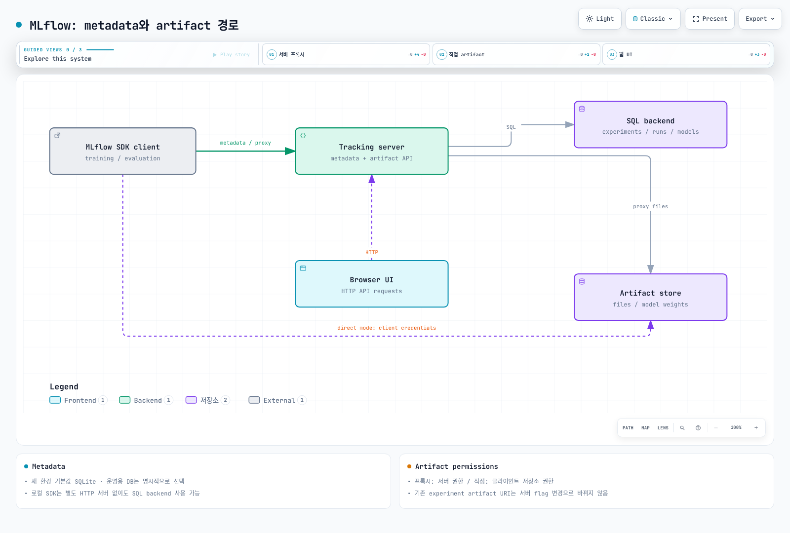

# Part 1: MLflow Tracking

> **검토 기준**: MLflow 3.16.0 · 2026-09-12

## 실습 환경 준비

Python 3.10 이상 환경에 `mlflow==3.16.0`을 설치합니다. 아래 예제는 Python 3.12에서 SQLite와 로컬 artifact 저장소로 확인했으며 GPU·학습 모델·원격 서버가 필요하지 않습니다. 팀용 HTTP 서버와 EKS 운영은 [Part 3](03-eks-deployment.md)에서 다룹니다.

## MLflow Tracking이란 무엇인가?

Tracking은 experiment, run, parameter, metric, artifact, logged model과 trace를 기록·검색하는 API와 UI를 제공합니다. SDK는 HTTP tracking 서버뿐 아니라 로컬 파일 또는 SQL backend에 직접 연결할 수도 있습니다. 따라서 모든 사용에 별도 서버 프로세스가 필요한 것은 아닙니다.

원격 서버 구성에서도 metadata와 artifact 전송 경로는 같지 않을 수 있습니다. metadata는 tracking API로 보내지만 artifact는 서버가 프록시하거나 클라이언트가 S3 등에 직접 전송할 수 있습니다. 뒤에서 두 구성을 구분합니다.

## 핵심 개념: Experiment와 Run

**Experiment**는 run과 관련 결과를 묶는 이름 있는 단위입니다. **Run**은 학습뿐 아니라 평가·전처리·비교 실험도 표현할 수 있습니다. 같은 parameter key는 한 run에서 다른 값으로 바꾸지 않으며, metric은 timestamp·step을 가진 여러 관측값으로 기록할 수 있습니다. 현재 metric 요약과 전체 이력을 구분합니다.

다음은 실제 정확도 측정이 아닌 **Tracking API 연습용 값**입니다. 존재하지 않는 이미지 파일을 요구하지 않도록 JSON artifact를 직접 생성합니다.

```python
from pathlib import Path
import mlflow
from mlflow import MlflowClient

root = Path(".mlflow-demo").resolve()
root.mkdir(exist_ok=True)
mlflow.set_tracking_uri(f"sqlite:///{root / 'mlflow.db'}")
client = MlflowClient()
experiment = client.get_experiment_by_name("tracking-demo")
experiment_id = (
    experiment.experiment_id if experiment else
    client.create_experiment(
        "tracking-demo", artifact_location=(root / "artifacts").as_uri()
    )
)
mlflow.set_experiment(experiment_id=experiment_id)

with mlflow.start_run(run_name="demo") as run:
    mlflow.log_param("learning_rate", 0.01)
    mlflow.log_metric("demo_score", 0.92, step=0)
    mlflow.log_metric("demo_score", 0.95, step=1)
    mlflow.log_dict({"synthetic_example": True}, "summary.json")
    run_id = run.info.run_id

assert client.get_run(run_id).info.status == "FINISHED"
assert len(client.get_metric_history(run_id, "demo_score")) == 2
```

context가 정상 종료되면 run이 `FINISHED`, 블록 안에서 예외가 발생하면 `FAILED`로 종료됩니다. Run 종료는 artifact 백업이나 학습 프로세스 전체의 성공 검증을 대신하지 않습니다. 재실행하면 동일 experiment에 새 run을 추가합니다. 기존 experiment의 artifact location은 위 조건문으로 바뀌지 않습니다.

### 오토로깅(Autologging)

`mlflow.autolog()`는 지원되는 integration을 설정합니다. 기록되는 값, framework version 범위, 모델 저장 및 입력 예제 수집은 integration마다 다릅니다. 일반 PyTorch 학습 루프와 Lightning 경로가 똑같이 자동 계측된다고 가정하지 않습니다. 필요한 framework 전용 API와 지원 버전을 확인하고, 추가 metric은 수동 기록합니다.

Autologging을 무조건 기본값으로 켜기보다 원문·입출력·모델·데이터 샘플이 어디에 저장되는지 검토합니다. 기능을 켠 것만으로 PII가 제거되거나 모든 custom code가 관측되는 것은 아닙니다.

## MLflow 3의 전환점: 1급 엔티티가 된 모델

`LoggedModel`에는 run과 별개의 `model_id`, 상태, artifact location과 metadata가 있습니다. `source_run_id`로 학습 run과 연결하고 다른 평가 run·metric·trace와도 관계를 기록할 수 있습니다. Registered Model/Model Version과는 별도 엔티티입니다.

**활성 `start_run()` 블록 없이 `log_model()`을 호출할 수 있다는 점 자체는 3.x의 새 기능이 아닙니다.** 2.22.0의 `Model.log()`도 필요하면 `_get_or_start_run()`으로 run을 시작했고, 3.16.0의 모델 로깅 경로에도 이 동작이 있습니다. 달라진 핵심은 독립적인 모델 식별과 관계 추적입니다.

다음은 모델 metadata만 만드는 예제입니다. 앞의 tracking 설정 이후, 활성 run이 없는 상태에서 실행합니다.

```python
model = mlflow.initialize_logged_model(
    name="metadata-only", model_type="demo"
)
assert mlflow.active_run() is None
assert model.source_run_id is None
print(model.model_id, model.status)  # PENDING
```

이 시점에는 사용할 수 있는 학습 가중치나 model flavor가 없습니다. 실제 모델 로깅·artifact 보존·finalization을 마쳐야 합니다. `READY`도 배포·성능·보안 검토를 통과했다는 의미가 아닙니다.

## GenAI와 LLM 관찰성: 트레이싱(Tracing)

MLflow Tracing은 **2.14.0(2024-06-17)**에 이미 도입됐습니다. 3.x에서 모델·평가·GenAI UI 연계를 확장했으며, 3.16.0에는 span link와 새 trace UI가 추가됐습니다. “3부터 처음 tracing이 가능하다”는 설명은 정확하지 않습니다.

Trace는 요청의 retrieval·tool·LLM 호출 같은 작업을 span으로 표현합니다. parent/child 구조와 span link를 구분합니다. 토큰 수집은 integration과 provider 응답에 의존하며, 검색·도구 span에 항상 LLM 토큰/비용이 있는 것은 아닙니다. 비용 추정은 모델 식별·사용량·가격 정보가 있어야 하며 실제 청구 총액과 동일하지 않습니다.

자동 계측과 수동 span을 함께 사용할 수 있습니다. 입력·출력·예외·tool argument·reasoning에 민감정보가 포함될 수 있으므로 수집 범위, 접근 권한, redaction, 보존 기간을 정합니다. integration을 설치한 것만으로 모든 경로가 연결되거나 비용이 완전 집계되지는 않습니다.

## Backend Store와 Artifact Store

| 구분 | 저장 내용과 구성 |
|---|---|
| Backend | experiment/run/parameter/metric/model 등의 metadata; SQLite, PostgreSQL, MySQL 등 |
| Artifact | 모델 파일·플롯·JSON 등의 파일; 로컬 경로, S3 등의 저장소 |
| 기본값 | 새 3.16.0 환경은 `sqlite:///mlflow.db`; 기존 `./mlruns`가 있는 경우 호환 동작을 확인 |
| 기존 file backend | maintenance mode; 새 운영 환경은 명시적 SQL backend와 migration 계획 사용 |

SQLite도 관계형 데이터베이스입니다. 작은 로컬 실습에 적합하지만 팀의 동시 쓰기·여러 server replica·백업·고가용성 요구는 별도로 평가해야 합니다. artifact 파일을 SQL metadata와 함께 백업한 것으로 착각하면 안 됩니다.

### 원격 서버의 두 artifact 경로

- **프록시 모드**: 클라이언트가 `mlflow-artifacts:` 경로를 통해 서버로 보내고 서버가 artifact store 권한을 사용합니다. 클라이언트별 S3 권한이 불필요할 수 있으나 tracking 서버의 인증·인가가 중요합니다.
- **직접 모드**: `--no-serve-artifacts`와 직접 `s3://...` artifact root를 사용하는 구성에서는 클라이언트가 저장소에 접근합니다. 클라이언트의 AWS 권한·네트워크·라이브러리가 필요합니다.

기존 experiment의 artifact URI는 서버 flag를 바꾼 것만으로 소급 변경되지 않습니다. 실제 experiment/run URI를 확인해야 합니다. 웹 UI는 서버 HTTP API를 통해 조회하며 브라우저가 PostgreSQL에 직접 연결하는 구조가 아닙니다.



[인터랙티브 다이어그램](https://www.atomai.click/kubernetes-docs/archmaps/ko-ai-ml-mlflow-01-tracking-0.html)

## 다음 단계

모델을 등록·버전화하고 alias를 관리하는 방법은 [Part 2](02-model-registry.md), EKS 서버의 저장소·접근 제어는 [Part 3](03-eks-deployment.md)를 참고합니다. Alias 변경만으로 모든 serving 프로세스가 자동 재배포되지는 않습니다.

## 공식 근거

- [MLflow 3.16.0 릴리스](https://github.com/mlflow/mlflow/releases/tag/v3.16.0)
- [Backend store](https://mlflow.org/docs/3.16.0/self-hosting/architecture/backend-store/)
- [Artifact store](https://mlflow.org/docs/3.16.0/self-hosting/architecture/artifact-store/)
- [2.22.0 모델 로깅 구현](https://github.com/mlflow/mlflow/blob/v2.22.0/mlflow/models/model.py)
- [3.16.0 Tracking API 구현](https://github.com/mlflow/mlflow/blob/v3.16.0/mlflow/tracking/fluent.py)
- [Tracing 도입: 2.14.0](https://github.com/mlflow/mlflow/releases/tag/v2.14.0)

[메인 페이지로 돌아가기](README.md) · [퀴즈](../../quizzes/ai-ml/mlflow/01-tracking-quiz.md)
