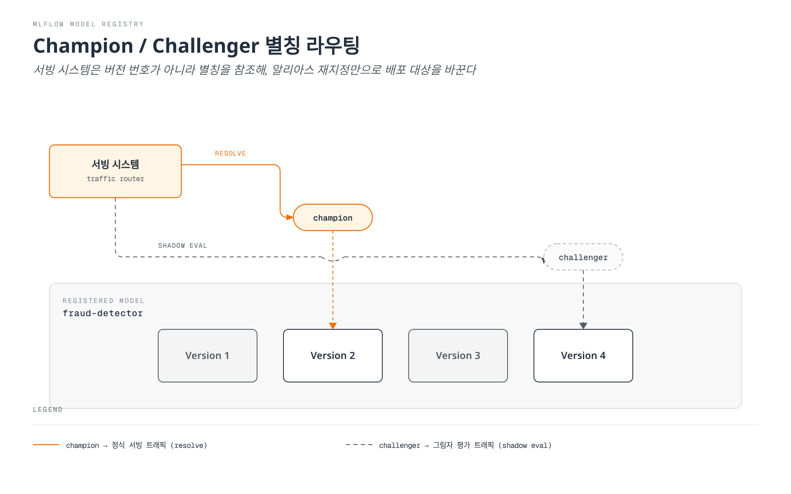

# Part 2: MLflow Model Registry

> **지원 버전**: MLflow 3.15.1
> **마지막 업데이트**: 2026년 8월 19일

## 실습 환경 준비

이 문서의 예제를 따라 하려면 다음 도구와 환경이 필요합니다.

### 필요한 도구 및 리소스
- Python 3.10 이상
- `pip install mlflow`
- 레지스트리에 접근 가능한 MLflow 트래킹 서버 (구축 방법은 [Part 1: MLflow Tracking](01-tracking.md) 참고, 클러스터에 직접 배포하려면 [Part 3: MLflow를 EKS에 배포하기](03-eks-deployment.md) 참고)

## Model Registry란 무엇인가

[Part 1](01-tracking.md)에서는 Tracking, 즉 Run과 Experiment에 파라미터, 메트릭, 아티팩트, `LoggedModel` 엔티티를 기록하는 방법을 다뤘습니다. Run은 한 번의 학습 시도에 대한 기록입니다. "지금 서빙 중인 모델"을 가리키는 용도로는 적합하지 않습니다. Run의 정체성은 언제, 어떻게 실행됐는지에 묶여 있을 뿐, 그 결과가 비즈니스적으로 무엇을 의미하는지와는 별개이기 때문입니다.

Model Registry는 이 문제를 **Registered Model**이라는 개념으로 해결합니다. Registered Model은 이름이 붙은, 버전이 관리되는 모델 버전들의 모음입니다. 이를 통해 모델은 특정 학습 Run이나 Experiment 하나에 종속되지 않는 안정적인 정체성을 갖게 됩니다. "어떤 Run이 지금 프로덕션에 있는 모델을 만들었는가"라고 묻는 대신, "지금 `fraud-detector`는 무엇인가"라고 물을 수 있고, 그 사이에 얼마나 많은 실험이 돌았는지와 무관하게 일관된 답을 얻을 수 있습니다.

Model Registry는 개발부터 프로덕션까지 모델의 라이프사이클, 즉 등록·검토·승격·최종 폐기를 하나의 고정된 이름 아래에서 관리하기 위해 존재합니다.

## 핵심 개념

### Registered Model

Registered Model은 이름입니다. 예를 들어 `fraud-detector`입니다. 레지스트리의 최상위 엔티티이며, 이 모델의 생애 동안 쌓이는 모든 버전, alias, 태그, 설명이 이 하나의 이름 아래에 모입니다.

### Model Version

Model Version은 Registered Model 이름 아래 등록되는, 불변이고 번호가 매겨진 버전입니다(`fraud-detector`의 version 1, version 2 등). 각 버전은 한 번 생성되면 이후에 변경되지 않습니다. 새로운 학습 결과는 기존 버전을 수정하는 것이 아니라 새로운 버전이 됩니다.

모든 Model Version은 그 버전이 유래한 `LoggedModel`(또는 그것을 만들어낸 Run)을 다시 가리킵니다. 이 연결이 레지스트리를 Tracking과 이어주는 지점입니다. 버전은 Run 히스토리의 특정 시점을 가리키는 포인터일 뿐, 원본에서 분리되어 따로 존재하는 복사본이 아닙니다.

### Alias

alias는 특정 Model Version을 가리키는, 변경 가능한 이름이 붙은 포인터입니다. 예를 들어 `champion`이나 `challenger`입니다. 버전 번호와 달리 alias는 옮길 수 있습니다. 오늘은 `champion`이 version 4를 가리키고 있더라도, 평가를 통과한 뒤에는 alias를 소비하는 쪽의 코드를 전혀 건드리지 않고 version 7로 다시 가리키게 할 수 있습니다.

alias는 레지스트리에서 모델의 역할이나 라이프사이클 단계를 표현하는 현재의 주된 방식입니다. 서빙 시스템이나 다운스트림 작업은 `models:/fraud-detector@champion`을 한 번만 작성해두면, 그 alias가 현재 가리키는 버전이 무엇이든 항상 그것을 로드하며, 실제 버전이 바뀌어도 코드를 수정할 필요가 없습니다.

### 참고: 레거시 Stage 모델

과거 MLflow에서는 다른 방식을 썼습니다. 각 Model Version이 `Staging`, `Production`, `Archived` 중 하나의 **stage**를 가졌고, 모델을 다음 단계로 넘긴다는 것은 stage를 전환한다는 의미였습니다. 이 방식은 alias와 태그의 조합으로 대체되었습니다. 하나의 버전이 여러 alias를 동시에 가질 수도(또는 하나도 갖지 않을 수도) 있고, alias 이름이 고정된 라이프사이클 라벨 집합에 묶이지 않기 때문에 더 유연합니다. 새로 작업할 때는 stage가 아니라 alias와 태그를 사용해야 합니다. 오래된 MLflow 배포 환경에서 stage 전환 방식을 여전히 볼 수도 있는데, 이는 지금은 지양되는 레거시 접근 방식입니다.

## 모델 등록하기

Model Version은 두 가지 방법으로 생성됩니다. 둘 다 Part 1에서 다룬 내용을 그대로 이어받습니다.

**로깅 후 등록.** 학습 Run이 모델을 아티팩트(또는 Part 1에서 다룬 `LoggedModel`)로 이미 로깅한 뒤, `mlflow.register_model(model_uri, name)`을 호출해 별도로 등록할 수 있습니다. 여기서 `model_uri`는 이미 로깅된 모델을 가리키고, `name`은 등록할 Registered Model 이름입니다. 모델을 등록할지 여부를 학습 단계와 분리해서 결정하는 경우, 예를 들어 평가 기준을 통과한 모델만 등록하는 리뷰 단계에 적합합니다.

**로깅 시점에 등록.** 또는 플레이버별 `log_model` 호출(예: `mlflow.sklearn.log_model(..., registered_model_name="fraud-detector")`)에 `registered_model_name` 파라미터를 넘기면, 모델을 로깅하는 동시에 새로운 Model Version으로 등록됩니다. 특정 학습 스크립트가 실행될 때마다 자동으로 후보 버전을 만들어내야 하는 경우에 적합합니다.

두 방법 모두 지정한 Registered Model 아래에 새롭고 불변인 Model Version을 만듭니다. 어느 쪽도 alias를 옮기지는 않습니다. alias 이동은 아래에서 설명하는 별도의, 의도적인 작업입니다.

## 거버넌스와 핸드오프 워크플로우

Model Registry의 조직적 가치는 무엇보다 두 가지 서로 다른 관심사, 즉 "후보 모델을 만드는 일"과 "어떤 후보를 서빙할 만큼 신뢰할 수 있는지 결정하는 일"을 잇는 핸드오프 지점 역할에 있습니다.

전형적인 워크플로우는 다음과 같습니다.

1. 데이터 사이언스 팀이 모델을 학습시키고, 앞서 소개한 두 등록 방법 중 하나로 유망한 결과를 공유 Registered Model 이름 아래 새 Model Version으로 등록합니다.
2. 평가 또는 승인 프로세스가 — CI/CD로 자동화되어 있든, 수동이든, 둘 다이든 — 테스트 데이터, 공정성 검사, 비즈니스 지표를 기준으로 후보 버전을 검토합니다.
3. 이 게이트를 통과한 버전에 대해서만 `champion` alias를 옮깁니다. 보통은 사람이 직접 하는 것이 아니라 자동화된 파이프라인에서 클라이언트 API(`set_registered_model_alias`)를 통해 수행됩니다.
4. (이 문서의 범위를 벗어나는) 서빙 인프라는 `models:/fraud-detector@champion`을 한 번만 작성해두면 버전 번호를 하드코딩할 필요가 없습니다. `champion`이 이동하면 다음 번 resolve 시점에 새 버전이 자연스럽게 반영됩니다.

이렇게 분리해두면, 후보 모델을 만드는 사람이나 시스템이 실제로 무엇이 프로덕션에서 서빙되는지 직접 통제할 필요가 없고, 모델을 소비하는 시스템도 버전 번호를 수동으로 추적할 필요가 없습니다. `challenger` alias는 `champion`과 함께 자주 사용되며, 현재 서빙 중인 것을 건드리지 않으면서 승격 검토 중인 버전을 표시하는 용도로 쓰입니다.

## 모델 계보와 재현성

모든 Model Version은 자신을 만들어낸 Run(그리고 그 Run을 통해 이어지는, Part 1에서 다룬 파라미터·코드·데이터셋 참조)으로의 연결을 계속 유지합니다. 그래서 "지금 `champion`으로 서빙 중인 모델을 정확히 어떤 코드와 데이터가 만들어냈는가"와 같은 감사(audit) 질문에 언제든 답할 수 있습니다. 그 연결 고리는 alias에서 Model Version으로, Model Version에서 Run으로, Run에서 그 Run이 기록한 파라미터와 아티팩트로 이어집니다.

Model Version은 그 기반이 되는 Run의 태그와는 별도로, 자신만의 태그와 설명도 가질 수 있습니다. 이는 레지스트리에 특화된 맥락, 예를 들어 누가 이 버전의 승격을 승인했는지, 또는 alias를 옮기게 된 근거가 된 평가 리포트 링크 같은 정보를 학습 Run 자체의 메타데이터와 뒤섞지 않고 기록할 때 유용합니다.

## 다음 단계

Part 2에서는 Model Registry 자체, 즉 Registered Model, Model Version, 현재의 주된 라이프사이클 메커니즘인 alias, 그리고 등록이 [Part 1: MLflow Tracking](01-tracking.md)과 어떻게 연결되는지를 다뤘습니다. 등록된 모델을 실제 추론 엔드포인트로 로드하는 작업은 이 시리즈의 범위 밖입니다 — 대신 [Part 3: MLflow를 EKS에 배포하기](03-eks-deployment.md)에서는 Tracking과 Model Registry가 함께 의존하는 트래킹 서버와 백엔드 저장소를 구성하는 방법을 다룹니다.

[메인 페이지로 돌아가기](./README.md)

## 퀴즈

[Model Registry 퀴즈](../../quizzes/ai-ml/mlflow/02-model-registry-quiz.md)로 이해도를 확인해 보세요.
