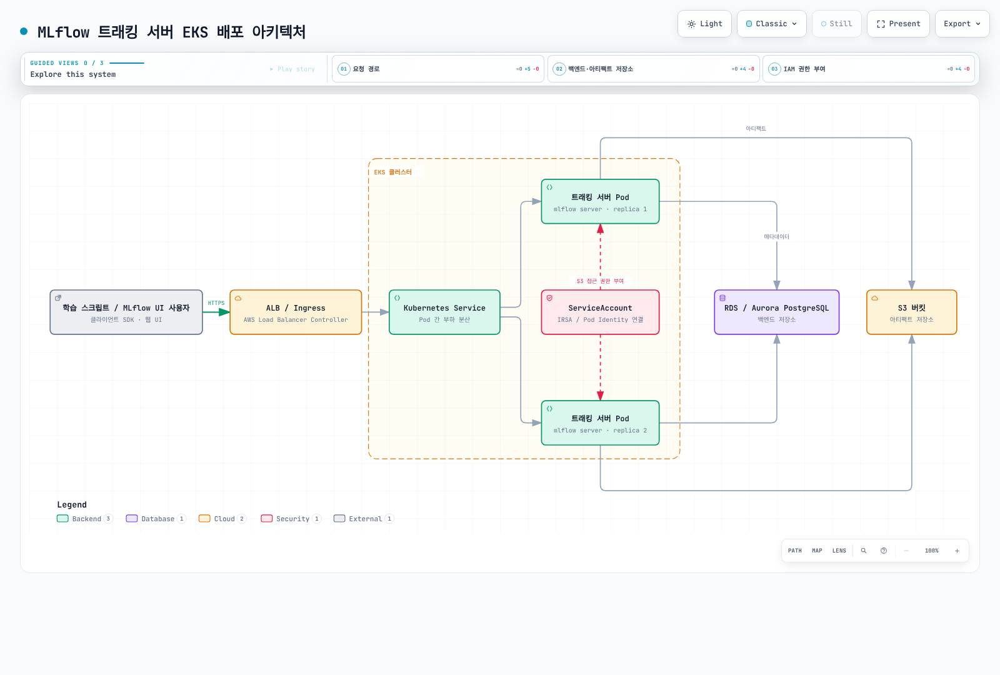

# Part 3: MLflow를 EKS에 배포하기

> **지원 버전**: MLflow 3.15.1, Kubernetes 1.34+
> **마지막 업데이트**: 2026년 8월 19일

## 실습 환경 준비

이 문서의 예제를 따라 하려면 다음 도구와 환경이 필요합니다.

### 필수 도구

* kubectl v1.34 이상, 정상 동작하는 Amazon EKS 클러스터에 연결된 상태
* Helm v3 (커뮤니티 Helm 차트로 설치하는 경우)
* 백엔드 저장소용 Amazon RDS 또는 Aurora PostgreSQL 인스턴스(이미 있거나 새로 만들 수 있어야 함)
* 아티팩트 저장소용 S3 버킷
* 트래킹 서버가 해당 S3 버킷에 접근할 수 있도록 부여된 IRSA 역할 또는 EKS Pod Identity 연결

## MLflow 트래킹 서버를 EKS에서 운영하는 이유

여기서의 트레이드오프는 이 문서 사이트에서 다룬 다른 자체 호스팅 ML 인프라와 동일한 패턴을 따릅니다. 이미 EKS를 운영 중인 팀은 클러스터의 다른 워크로드에 쓰던 배포 매니페스트, 관측성 스택, IAM 패턴(IRSA 또는 Pod Identity)을 MLflow에도 그대로 재사용할 수 있습니다. 그 대신 트래킹 서버 프로세스 자체와 백엔드 저장소, 아티팩트 저장소를 직접 운영해야 하는 부담을 지게 됩니다 — 예를 들어 Databricks가 관리하는 MLflow나 SageMaker의 MLflow 호환 트래킹 기능처럼 관리형 대안을 쓰는 대신입니다. 어느 쪽도 절대적으로 정답이라고 할 수는 없으며, 기존 Kubernetes 운영 범위에 서비스를 하나 더 얹을지, 아예 운영 부담을 하나 줄일지의 선택입니다.

## 아키텍처

EKS에서의 프로덕션 MLflow 배포는 세 가지 구성 요소로 이루어지며, 여러 팀이 트래킹 서버를 공유하는 순간부터 셋 다 선택이 아니라 필수가 됩니다.

**MLflow 트래킹 서버.** `mlflow server`를 실행하는 컨테이너로, 클라이언트 SDK(`mlflow.log_metric`, `mlflow.log_artifact` 등)가 호출하는 REST API와 실험/Run을 조회하는 웹 UI를 모두 노출합니다. 지속적인 상태는 모두 백엔드 저장소와 아티팩트 저장소에 있으므로 트래킹 서버 자체는 설계상 무상태(stateless)이며, 그래서 Kubernetes Deployment로 자연스럽게 표현되고 그 앞에 Service와 Ingress(일반적으로 AWS Load Balancer Controller가 프로비저닝하는 ALB)를 둘 수 있습니다.

**백엔드 저장소.** MLflow의 기본 백엔드 저장소는 로컬 SQLite 파일입니다. 노트북에서 혼자 실험할 때는 문제가 없지만, 둘 이상의 프로세스가 동시에 쓰기를 시도하는 순간 한계가 드러납니다 — SQLite는 팀이 공유하는 트래킹 서버가 필요로 하는 수준의 동시 쓰기를 지원하지 않습니다. AWS에서는 이를 실제 관계형 데이터베이스로 대체하는 것이 표준입니다: Amazon RDS for PostgreSQL, 또는 트래킹 부하에 맞춰 자동으로 스케일하길 원한다면 Aurora Serverless v2입니다. 백엔드 저장소에는 MLflow의 구조화된 메타데이터 전체 — 실험, Run, 파라미터, 메트릭, Registered Model, Model Version, alias([Part 2](02-model-registry.md) 참고) — 즉 SQL로 조회하기 좋은 모든 것이 저장됩니다.

**아티팩트 저장소.** 백엔드 저장소의 행(row)은 작지만, 그 옆에 함께 기록되는 것들은 종종 그렇지 않습니다. 직렬화된 모델, 플롯, 데이터셋 같은 대용량 바이너리 객체는 데이터베이스가 아니라 별도의 아티팩트 저장소로 갑니다. AWS에서는 Amazon S3가 그 역할을 맡습니다: 트래킹 서버는 기본 아티팩트 루트로 설정된 S3 URI 하위에 아티팩트를 읽고 쓰며, 클라이언트는 서버 설정에 따라 트래킹 서버를 경유해서, 또는 S3에 직접 접근해서 아티팩트를 가져옵니다.



[🔍 인터랙티브 다이어그램 보기](https://www.atomai.click/kubernetes-docs/archmaps/ko-ai-ml-mlflow-03-eks-deployment-0.html)

## 설치 방식

위 구성 요소를 클러스터에 올리는 실질적인 방법은 두 가지입니다.

**직접 매니페스트 작성.** `mlflow server` 컨테이너를 실행하는 Deployment, 그 앞의 Service, 외부 노출을 위한 Ingress(또는 `LoadBalancer` 타입 Service)를 작성하고, 백엔드 저장소 연결 문자열과 S3 아티팩트 루트를 컨테이너의 환경 변수나 커맨드라인 플래그로 전달합니다. 모든 세부 사항을 직접 제어할 수 있지만, 그만큼 YAML을 스스로 유지보수해야 합니다.

**커뮤니티 Helm 차트 사용.** `community-charts/helm-charts` 프로젝트는 정확히 이 용도를 위한 MLflow 차트를 유지 관리합니다.

```bash
helm repo add community-charts https://community-charts.github.io/helm-charts
helm repo update
helm search repo community-charts/mlflow
```

이 차트는 앞서 설명한 구성 요소들을 개념적인 수준에서 설정할 수 있게 해줍니다 — 백엔드 저장소를 SQLite 대신 외부 데이터베이스 연결로 가리키기, 아티팩트 저장소를 S3 버킷으로 가리키기, 그리고 replica 수, 리소스 요청량, Ingress 설정 같은 일반적인 Kubernetes 관심사입니다. 정확한 `values.yaml` 키와 현재 기본값은 배포 전에 차트 버전별 문서에서 직접 확인하십시오. 차트 버전에 따라 달라질 수 있습니다.

두 방식 모두 결국 같은 런타임 아키텍처로 귀결됩니다: 무상태 트래킹 서버 Pod 여러 개가 동일한 데이터베이스와 동일한 S3 버킷을 가리키는 구조입니다.

## 아티팩트 저장소에 대한 IAM 접근 권한

트래킹 서버 Pod는 S3 아티팩트 버킷의 객체를 읽고 쓸 수 있는 AWS 권한이 필요합니다 — 예를 들어 해당 버킷 prefix로 범위를 좁힌 `s3:PutObject`, `s3:GetObject`입니다. EKS에서 IAM 역할을 Kubernetes ServiceAccount에 연결하는 오래된 방식은 IRSA(IAM Roles for Service Accounts)로, ServiceAccount에 `eks.amazonaws.com/role-arn` 어노테이션을 붙여 그 ServiceAccount를 사용하는 Pod가 해당 역할의 임시 자격 증명을 받도록 합니다. EKS Pod Identity는 IAM 역할을 Pod에 연결하는 더 새로운 방식이며, 워크로드 종류와 무관하게 EKS에서 새로 IAM-Pod 연결을 구성할 때 점점 더 기본으로 권장되는 방식입니다. 두 방식 모두 트래킹 서버의 환경 변수나 설정 파일에 정적 AWS 자격 증명이 남지 않도록 해줍니다. 새로 MLflow를 배포한다면 Pod Identity를 더 현대적인 기본 선택으로 삼고, 이미 IRSA로 표준화된 클러스터나 팀이라면 IRSA도 여전히 유효한 선택입니다.

## 운영 시 고려사항

**Replica를 2개 이상 운영하십시오.** Postgres 기반 트래킹 서버는 모든 공유 상태가 Pod가 아니라 데이터베이스와 S3에 있으므로 무상태입니다. 따라서 가용성을 위해 Service와 Ingress 뒤에 여러 replica를 두는 것이 안전합니다. 이는 SQLite 기반 단일 프로세스 기본 구성과의 실질적인 차이입니다 — SQLite는 동시 쓰기를 견디지 못하므로 애초에 스케일 아웃이 안전하지 않습니다.

**헬스 프로브를 연결하십시오.** 오래 실행되는 다른 Kubernetes 서비스와 마찬가지로, 트래킹 서버의 헬스 체크 엔드포인트에 대해 readiness/liveness 프로브를 설정해서 Service가 실제로 요청을 처리할 수 있는 Pod에만 트래픽을 보내고, 응답이 멈춘 Pod는 자동으로 재시작되도록 하십시오. 정확한 헬스 체크 경로는 릴리스에 따라 달라질 수 있으니 임의로 가정하지 말고 사용 중인 MLflow 버전 문서로 확인하십시오.

**쓰기 패턴에 맞춰 데이터베이스 크기를 정하십시오.** 로깅되는 모든 파라미터, 메트릭, 메트릭 스텝은 백엔드 저장소에 대한 쓰기 하나입니다. 따라서 에폭 단위가 아니라 스텝 단위로 자주 메트릭을 기록하는 학습 작업은 데이터베이스에 실질적인 부하를 줍니다. Aurora Serverless v2는 특히 이런 경우에 고려할 만합니다. 연중 최대 부하에 맞춰 미리 크기를 정해 두지 않고도 학습 실행이 만드는 순간적인 트래킹 부하를 흡수할 수 있기 때문입니다.

## 다음 단계

이번 3부작 MLflow 시리즈는 여기서 마칩니다. [Part 1](01-tracking.md)에서는 실험과 Run을 기록하는 방법을, [Part 2](02-model-registry.md)에서는 학습된 모델에 안정적이고 버전화된 식별자를 부여하는 Model Registry를, 이번 파트에서는 트래킹 서버·백엔드 저장소·아티팩트 저장소를 EKS에서 운영하는 방법을 다뤘습니다. 모델이 Registered Model Version이나 alias를 갖게 된 이후, 많은 팀이 자연스럽게 다음으로 가는 단계는 그 특정 버전을 서빙 시스템에 로드하는 것입니다 — KServe, 직접 만든 FastAPI나 Flask 래퍼, SageMaker, 또는 그 외의 방식일 수 있습니다. 서빙 계층 자체는 별도의 넓은 주제이며 이 시리즈의 범위 밖입니다.

[메인 페이지로 돌아가기](./README.md)

## 퀴즈

이 장에서 배운 내용을 확인하려면 [주제 퀴즈](../../quizzes/ai-ml/mlflow/03-eks-deployment-quiz.md)를 풀어보세요.
