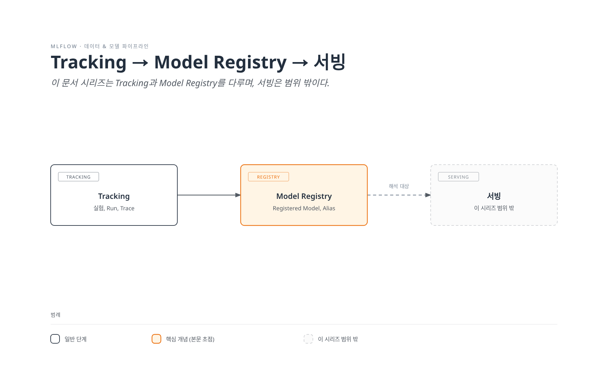

# MLflow on EKS 딥다이브

> **지원 버전**: MLflow 3.15.1
> **마지막 업데이트**: 2026년 8월 19일

## 개요

MLflow는 머신러닝 라이프사이클 전체 — 실험 추적, 모델 패키징과 버전 관리, 그리고 (MLflow 3부터는) GenAI/LLM 관측성까지 — 를 관리하는 오픈소스 플랫폼입니다. 학습 스크립트나 에이전트가 간단한 API로 로그를 남기는 트래킹 서버를 중심으로 동작합니다. 여러 Kubernetes 네이티브 컨트롤러 묶음을 제공하는 Kubeflow와 달리, MLflow는 단일 서비스(트래킹 서버 + 백엔드/아티팩트 저장소)라서 Kubeflow, 자체 구축한 학습 환경, 혹은 그 무엇도 없이 단독으로도 흔히 운영됩니다.

## 컴포넌트 맵

| 개념 | 해결하는 문제 | 심화 가이드 |
|---------|--------------------|-----------|
| **Tracking** | 실험 파라미터, 메트릭, 아티팩트, 모델, GenAI trace를 기록하고 조회 | [Part 1](01-tracking.md) |
| **Model Registry** | 특정 학습 실행에 종속되지 않는 안정적이고 버전화된 모델 식별자 제공 | [Part 2](02-model-registry.md) |
| **EKS 배포** | 트래킹 서버, 백엔드 저장소, 아티팩트 저장소를 EKS에서 운영 | [Part 3](03-eks-deployment.md) |

## 왜 EKS에서 운영하는가

트레이드오프는 이 문서 사이트의 다른 데이터/ML 섹션과 동일합니다. 이미 EKS를 운영 중인 팀은 클러스터의 다른 워크로드와 동일한 배포, IAM(IRSA/Pod Identity), 관측성 패턴을 MLflow 트래킹 서버에도 그대로 적용할 수 있는 대신, 관리형 대안을 쓰는 것보다 트래킹 서버·백엔드 데이터베이스·아티팩트 저장소를 직접 운영해야 하는 부담을 지게 됩니다.

## 현재 제공 중인 문서

1. [Part 1: MLflow Tracking](01-tracking.md) — 실험, Run, 오토로깅, MLflow 3의 `LoggedModel` 전환, GenAI 트레이싱
2. [Part 2: MLflow Model Registry](02-model-registry.md) — Registered Model, Model Version, 별칭(alias), 계보(lineage)
3. [Part 3: MLflow를 EKS에 배포하기](03-eks-deployment.md) — 트래킹 서버, PostgreSQL 백엔드 저장소, S3 아티팩트 저장소, IAM 접근
