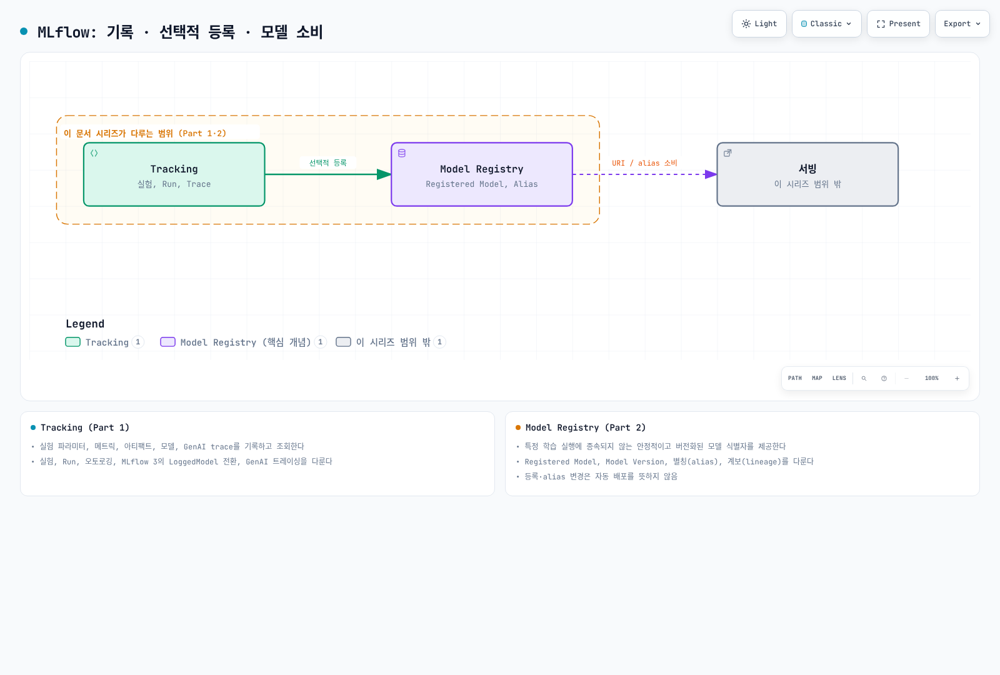

# MLflow on EKS 딥다이브

> **검토 기준**: MLflow 3.16.0
> **문서 검토일**: 2026년 9월 12일

## 개요

MLflow는 실험 추적, 모델 기록·등록·버전 관리, GenAI 평가와 tracing을 제공하는 오픈소스 플랫폼입니다. Tracing은 2.14.0에서 도입됐고 3.x에서 LoggedModel·평가·UI 연계가 확장됐습니다. 3.16.0은 2026-09-04에 공개됐습니다.

로컬 SDK와 SQLite만으로 사용할 수도 있고 HTTP tracking 서버, SQL metadata DB, artifact store를 분리해 팀 서비스로 운영할 수도 있습니다. “단일 서비스”가 반드시 하나의 Pod나 저장소를 의미하지는 않습니다. 이 시리즈는 Tracking·Registry·EKS 배포를 다루며 모든 MLflow 기능이나 GPU 학습 성공을 검증한 가이드는 아닙니다.

## 컴포넌트 맵

| 개념 | 해결하는 문제 | 심화 가이드 |
|---------|--------------------|-----------|
| **Tracking** | 실험 파라미터, 메트릭, 아티팩트, 모델, GenAI trace를 기록하고 조회 | [Part 1](01-tracking.md) |
| **Model Registry** | 특정 학습 실행에 종속되지 않는 안정적이고 버전화된 모델 식별자 제공 | [Part 2](02-model-registry.md) |
| **EKS 배포** | 트래킹 서버, 백엔드 저장소, 아티팩트 저장소를 EKS에서 운영 | [Part 3](03-eks-deployment.md) |

[🔍 인터랙티브 다이어그램 보기](https://www.atomai.click/kubernetes-docs/archmaps/ko-ai-ml-mlflow-readme-0.html)

## 왜 EKS에서 운영하는가

트레이드오프는 이 문서 사이트의 다른 데이터/ML 섹션과 동일합니다. 이미 EKS를 운영 중인 팀은 클러스터의 다른 워크로드와 동일한 배포, IAM(IRSA/Pod Identity), 관측성 패턴을 MLflow 트래킹 서버에도 그대로 적용할 수 있는 대신, 관리형 대안을 쓰는 것보다 트래킹 서버·백엔드 데이터베이스·아티팩트 저장소를 직접 운영해야 하는 부담을 지게 됩니다.

관리형 MLflow App과 EKS MLflow의 Qwen 비교 설계는 [SageMaker AI 가이드북](../sagemaker-ai/README.md)을 참고하세요. 그 예제는 별도의 과거 version pin을 사용하며 지원 종료 DLC로 GPU 실행이 차단된 상태입니다. 이 시리즈의 MLflow 3.16.0 로컬 검증을 그 예제의 end-to-end 실행 결과로 해석하지 않습니다.

Model Registry 등록은 선택적인 수명주기 단계입니다. 모델 URI/alias를 소비하는 serving 구성은 별도이며, 등록·alias 변경만으로 자동 배포되지는 않습니다.

## 현재 제공 중인 문서

1. [Part 1: MLflow Tracking](01-tracking.md) — 실험, Run, 오토로깅, MLflow 3의 `LoggedModel` 전환, GenAI 트레이싱
2. [Part 2: MLflow Model Registry](02-model-registry.md) — Registered Model, Model Version, 별칭(alias), 계보(lineage)
3. [Part 3: MLflow를 EKS에 배포하기](03-eks-deployment.md) — 트래킹 서버, PostgreSQL 백엔드 저장소, S3 아티팩트 저장소, IAM 접근

## 공식 근거

- [MLflow 3.16.0 릴리스](https://github.com/mlflow/mlflow/releases/tag/v3.16.0)
- [MLflow 2.14.0 Tracing 도입](https://github.com/mlflow/mlflow/releases/tag/v2.14.0)
- [Backend store](https://mlflow.org/docs/3.16.0/self-hosting/architecture/backend-store/)
