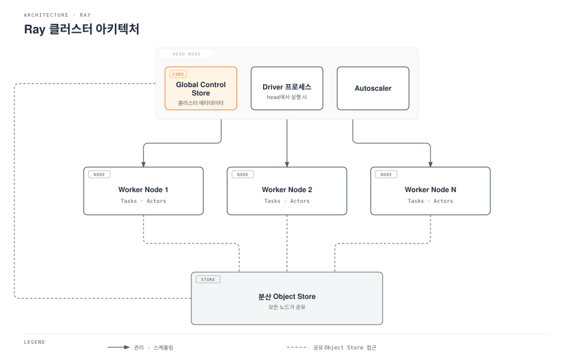

# Part 1: Ray 아키텍처

> **지원 버전**: Ray 2.57.0
> **마지막 업데이트**: 2026년 8월 20일

## 실습 환경 준비

이 문서의 예제를 따라 하려면 다음 도구와 환경이 필요합니다.

### 필수 도구

* Python 3.10 이상
* `pip install ray[default]` (`default` extra는 이후 예제에서 사용하는 대시보드와 클러스터 런처 의존성을 함께 설치합니다. 이 문서에 나온 핵심 API만 필요하다면 `pip install ray`만으로도 충분합니다)
* 여유 CPU 코어가 몇 개 있는 로컬 머신이나 VM이면 아래 예제를 실행하기에 충분합니다 — Part 1의 예제에는 별도 클러스터가 필요하지 않습니다

## Ray란 무엇인가?

Ray는 Python 워크로드를 확장하기 위한 오픈소스 분산 컴퓨팅 프레임워크입니다. 학습 전용이나 서빙 전용 도구처럼 하나의 워크로드만을 위해 만들어진 프레임워크가 아닙니다. 대신 Ray는 일반적인 목적의 작은 primitive 집합을 제공하여, 평범한 Python 코드를 비교적 적은 수정만으로 여러 CPU 코어나 여러 머신에 걸쳐 실행할 수 있게 해줍니다.

이 primitive들은 다양한 사용 사례를 폭넓게 다룰 만큼 범용적입니다: 임시로 모아둔 함수 호출들을 병렬화하는 것부터, 분산 모델 학습을 실행하거나, 여러 트라이얼에 걸쳐 하이퍼파라미터 탐색을 수행하거나, 확장 가능한 추론 엔드포인트 뒤에서 모델을 서빙하는 것까지 모두 포함됩니다. 아래에서 간단히 소개하고 이 시리즈의 이후 파트에서 자세히 다룰 Ray Train, Ray Tune, Ray Serve 같은 상위 레벨 라이브러리들은 모두 서로 무관한 별도 도구가 아니라, 동일한 기반 primitive 위에 구축되어 있습니다. 이렇게 기반을 공유한다는 점이, 워크로드마다 각자의 실행 모델을 가진 개별 도구들을 한데 묶어 놓은 생태계와 Ray를 구분하는 핵심적인 아키텍처 차이입니다.

## 핵심 Primitive

Ray의 프로그래밍 모델은 task, actor, object store라는 세 가지 primitive를 기반으로 합니다.

### Task

**Task**는 호출한 프로세스가 아니라 원격에서 Ray가 실행하는 상태 없는(stateless) 함수입니다. 평범한 Python 함수에 `@ray.remote` 데코레이터를 적용하면 task로 바뀝니다. 데코레이터가 적용된 함수를 호출하면 함수가 끝날 때까지 블로킹되는 대신, future(`ObjectRef`)를 즉시 반환합니다. 실제 실행은 Ray가 클러스터의 리소스 풀 안에서 적절한 워커에 스케줄링합니다. Task는 호출 사이에 상태를 유지하지 않기 때문에, Ray는 여유가 있는 어떤 워커에서든 특정 호출을 실행할 수 있고, 이 특성이 task를 손쉽게 확장할 수 있게 해줍니다.

Task는 서로 독립적인 병렬 작업, 즉 embarrassingly parallel 작업에 잘 맞습니다: 같은 함수를 여러 독립적인 입력에 적용하거나, 여러 독립적인 시뮬레이션을 실행하거나, 여러 데이터 샤드를 전처리하는 경우입니다. 각 task 호출이 독립적이고 상태가 없기 때문에, Ray는 호출 간의 관계를 추적할 필요 없이 클러스터 전체에 걸쳐 많은 수의 task를 스케줄링할 수 있습니다.

### Actor

**Actor**는 task와 대비되는, 상태를 가지는(stateful) primitive입니다. Python 클래스에 `@ray.remote`를 적용하면 actor가 됩니다. Ray는 워커에서 그 클래스의 인스턴스를 생성한 뒤, 반환되고 사라지는 단일 호출이 아니라 오래 살아 있는 원격 프로세스로 그 인스턴스를 계속 유지합니다. 이후 actor 핸들에 대한 메서드 호출은 그 동일한 인스턴스로 라우팅되므로, 모델 가중치, 카운터, 열려 있는 연결 같은 인스턴스에 저장된 상태가 호출 간에 계속 유지됩니다.

호출 사이에 상태를 유지해야 할 때는 actor가 적합한 primitive입니다: 값을 누적하는 카운터, 요청마다 다시 불러오는 대신 메모리에 상주시켜 둔 모델, 호출마다 한 단계씩 진행되는 상태 기반 시뮬레이션 등이 그 예입니다. Task와 actor는 서로 경쟁하는 선택지가 아니라 보완적인 관계입니다 — 일반적인 Ray 애플리케이션은 상태가 없는 병렬 작업에는 task를, 상태를 유지해야 하는 부분에는 actor를 함께 사용합니다.

### Object Store

**Object store**는 task와 actor가 서로 전달하는 객체 — 함수 인자, 반환값, 그리고 명시적으로 저장된 그 외의 값 — 를 담는 분산 공유 메모리 저장소입니다. 클러스터의 각 노드는 자신만의 로컬 object store를 실행하며, Ray는 필요할 때 이들 사이의 데이터 이동을 조율하여 한 워커에서 실행 중인 task가 다른 워커에서 만들어진 객체를 읽을 수 있게 합니다.

Object store는 큰 객체를 다룰 때 특히 중요합니다: 큰 NumPy 배열, 데이터셋 샤드, 모델 가중치 같은 경우입니다. 이런 객체를 필요로 하는 프로세스마다 직렬화해서 복사해 넣는 대신, Ray는 노드의 공유 메모리에 한 개의 사본만 유지하고, 그 노드의 여러 로컬 프로세스가 각자의 메모리에 중복 저장하지 않고 그 사본을 읽게 할 수 있습니다. 이 덕분에 Ray는 호출마다 직렬화·복사 비용을 지불하는 대신, task와 actor 사이에서 대용량 데이터를 효율적으로 옮길 수 있습니다.

## 클러스터 아키텍처: Head Node와 Worker Node

Ray 클러스터는 하나의 **head node**와 여러 개의 **worker node**로 구성됩니다. Head node와 worker node 모두 Ray 프로세스를 실행하며, 클러스터가 공유하는 리소스 풀에 CPU, GPU, 메모리를 제공합니다.

Head node는 worker node가 하는 일 외에 몇 가지 추가 역할을 담당합니다.

* **Global Control Store(GCS)**: 어떤 actor와 객체가 존재하는지, 그것들이 어디에 있는지를 추적하는 클러스터의 메타데이터 저장소이며, 스케줄링과 장애 복구가 의존하는 그 외의 클러스터 상태도 함께 관리합니다.
* **Driver 프로세스**: 최상위 Ray 스크립트나 인터랙티브 세션을 head node에서 실행하는 경우, 그 스크립트를 실행하는 driver가 head node에 위치하며 클러스터로 task와 actor 호출을 제출합니다.
* **Autoscaler**: 클러스터에 남아 있는 워크로드가 더 많은 리소스를 요구할 때 worker node를 추가로 요청하고, 더 이상 필요하지 않은 유휴 worker를 제거하는 프로세스입니다.

Worker node는 task와 actor를 실행하고, 클러스터 전체가 사용하는 리소스 풀에 자신의 CPU, GPU, 메모리를 더하는 역할을 합니다. 여기서 Ray 스케줄링 모델의 핵심적인 특징이 하나 따라옵니다: Ray는 개별 노드의 리소스를 따로 보는 것이 아니라, 클러스터 전체가 합쳐진 리소스 풀을 기준으로 task와 actor를 스케줄링합니다. CPU 2개를 요청하는 task는 클러스터 안에서 CPU 2개가 남아 있는 어떤 노드로든 배치될 수 있습니다 — 스케줄러가 특정 머신에 작업을 수동으로 배치하는 방식이 아닙니다.

모든 노드는 분산 object store에 함께 참여하므로, 한 worker node의 task가 만들어낸 객체를 다른 worker node에서 실행 중인 task나 actor가 읽을 수 있으며, 그 사이의 데이터 이동은 Ray가 처리합니다.

## 동일한 기반 위에 구축된 상위 레벨 라이브러리

Ray는 특정 ML 워크로드를 다루는 여러 상위 레벨 라이브러리를 제공하는데, 이들 모두 별도의 실행 모델을 새로 도입하는 것이 아니라 앞서 설명한 task, actor, object store 위에 구축되어 있습니다.

* **Ray Train**은 여러 워커에 걸쳐 모델 학습을 분산시키며, 이 시리즈의 [Part 3: Ray Train과 Ray Tune](./03-ray-train-tune.md)에서 다룹니다.
* **Ray Tune**은 여러 트라이얼에 걸쳐 하이퍼파라미터 탐색을 병렬로 실행하며, 마찬가지로 Part 3에서 다룹니다.
* **Ray Serve**는 확장 가능한 서빙 레이어 뒤에서 모델을 배포하며, 이 시리즈의 [Part 4: Ray Serve](./04-ray-serve.md)에서 다룹니다.

이렇게 기반을 공유한다는 점은 특별히 짚어둘 만합니다. 워크로드마다 스케줄링, 장애 복구, 데이터 이동을 각자 다시 구현한 개별 도구를 한데 묶는 대신, Ray는 이런 관심사를 core primitive 안에서 단 한 번만 구현하고, 각 상위 레벨 라이브러리가 이를 재사용하도록 합니다. 분산 학습과 하이퍼파라미터 튜닝은 겉으로 보이는 형태만 다를 뿐, 내부적으로는 Ray actor나 task로 실행되는 워커들이 평범한 `@ray.remote` 함수와 동일한 object store를 통해 데이터를 주고받는 방식입니다.

이 문서를 작성하는 시점 기준으로 Ray 2.57.0이 최신 stable 릴리스입니다. Ray 3.0 개발 라인이 존재한다는 것은 앞으로 참고할 만한 맥락이지만, 아직 릴리스되지 않았으므로 이 문서는 그것과 관련된 어떤 구체적인 내용에도 의존하지 않습니다.

## Kubernetes에서 이 내용이 중요한 이유

Ray는 head node, worker node, 그리고 worker 규모를 늘리고 줄이는 autoscaler로 구성된 자기만의 클러스터 개념을 가지고 있으며, 이는 Kubernetes 자체의 스케줄링·오토스케일링과는 다른 레이어입니다. Ray를 Kubernetes 위에서 실행한다는 것은, Ray 클러스터의 구성(head 1개, 각자 특정 리소스 요구사항을 가진 여러 worker)을 Kubernetes 스케줄러가 실제로 이해하고 EKS 노드에 배치할 수 있는 Pod, Deployment 같은 Kubernetes 객체로 변환해줄 무언가가 필요하다는 뜻입니다. 이 시리즈의 다음 파트인 [Part 2: KubeRay Operator](./02-kuberay-operator.md)가 다루는 것이 바로 이 변환 문제입니다.

## 다음 단계

이 문서에서는 Ray가 무엇인지, Ray의 세 가지 핵심 primitive(task, actor, object store)가 무엇인지, 그리고 Ray 클러스터의 head node와 worker node가 어떻게 협력해 공유 리소스 풀 전체에 걸쳐 작업을 스케줄링하는지를 살펴봤습니다. [Part 2: KubeRay Operator](./02-kuberay-operator.md)에서는 KubeRay operator가 이 Ray 클러스터 모델을 EKS의 네이티브 Kubernetes 리소스로 어떻게 매핑하는지 다룹니다. [Part 3: Ray Train과 Ray Tune](./03-ray-train-tune.md)과 [Part 4: Ray Serve](./04-ray-serve.md)은 각각 학습과 서빙 워크로드를 위해 여기서 소개한 primitive를 기반으로 확장됩니다.

[메인 페이지로 돌아가기](./README.md)

## 퀴즈

이 장에서 배운 내용을 테스트하려면 [주제 퀴즈](../../quizzes/ai-ml/ray/01-architecture-quiz.md)를 풀어보세요.
