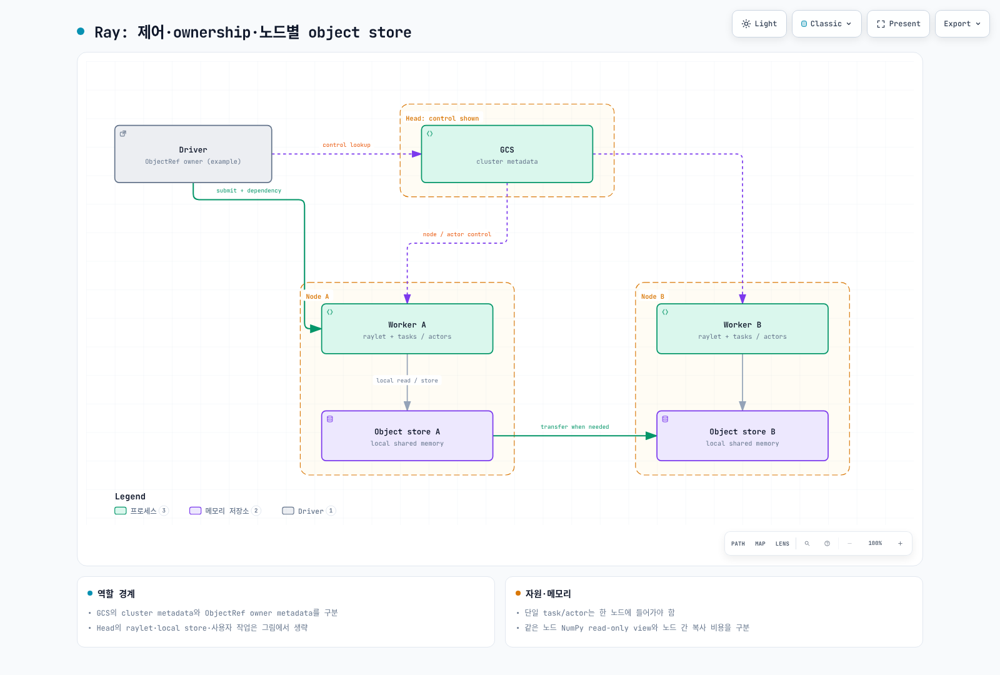

# Part 1: Ray 아키텍처

> **검토 기준**: Ray 2.58.0 · 2026-09-12

## 실습 환경 준비

로컬 예제는 Python 3.12, `ray==2.58.0`, `numpy==2.2.6`에서 확인했습니다. Task·actor·ObjectRef 예제에는 GPU나 학습 모델, Kubernetes가 필요하지 않습니다. Dashboard 등을 사용할 때 필요한 extra는 해당 기능 문서에서 별도로 확인합니다.

Ray 프로세스를 무제한 기본값으로 시작하지 않도록 예제는 논리 CPU 2개와 object store 80 MiB를 지정하고 마지막에 종료합니다. Ray의 resource 설정은 운영체제 수준의 전체 CPU/RAM 상한이 아니며 control/worker process 메모리는 추가로 필요합니다.

## Ray란 무엇인가?

Ray Core는 원격 함수(task), 상태를 가진 원격 인스턴스(actor), ObjectRef와 노드별 object store를 제공합니다. Train·Tune·Serve 같은 라이브러리가 이 기반을 사용합니다. 공통 기반을 사용한다는 것이 각 라이브러리에 별도의 controller, retry, checkpoint, framework 통신 로직이 없다는 뜻은 아닙니다.

## 핵심 Primitive

### Task

함수에 `@ray.remote`를 적용한 뒤 **`f.remote(...)`**로 제출합니다. 일반 함수처럼 `f(...)`를 호출하는 것은 맞지 않습니다. 단일 반환 예제에서는 `ObjectRef`를 받고 `ray.get()`으로 결과를 읽습니다.

Task가 상태 없는 실행 단위라는 설명은 함수가 반드시 순수하거나 부작용이 없다는 보장이 아닙니다. 파일·DB를 변경하는 작업은 재시도에 대비한 idempotency를 설계해야 합니다. Worker가 재사용될 수도 있으므로 module global cache가 우연히 남는 것과 명시적 상태 관리도 구분합니다.

Ray는 작업 간 관계를 추적합니다. 상위 작업의 ObjectRef를 다음 작업의 최상위 인자로 넘기면 값이 준비된 뒤 실행되는 의존성을 만들 수 있습니다. 모든 task가 서로 독립적이라는 설명은 잘못입니다.

### Actor

클래스의 `Actor.remote()`는 원격 인스턴스 handle을 만들고 `handle.method.remote()`는 그 인스턴스에 메서드를 제출합니다. Actor 메모리의 counter·연결·모델 같은 상태를 호출 사이에 재사용할 수 있습니다.

그 상태가 자동으로 영속 저장되는 것은 아닙니다. 2.58.0의 `max_restarts` 기본값은 0이며, 재시작을 설정해도 constructor를 다시 실행할 뿐 애플리케이션 상태를 자동 복구하지 않습니다. Checkpoint와 복구 로직은 별도로 설계합니다. 동기·async·threaded actor의 실행 순서와 동시성도 구분해야 합니다.

### Object Store

원격 객체 값은 immutable이며 각 노드의 로컬 object store에 저장·복제될 수 있습니다. ObjectRef가 같은 값을 가리켜도 모든 노드가 하나의 물리 메모리를 공유하는 것은 아닙니다. 다른 노드에 값이 필요하면 전송·직렬화 비용이 발생할 수 있습니다.

**동일 노드의 NumPy 배열**은 공유 메모리의 읽기 전용 view로 접근할 수 있습니다. 수정하려면 복사해야 합니다. 이것을 모든 Python 객체, 노드 간 전송, GPU tensor/모델 가중치까지 항상 zero-copy라는 주장으로 확대하면 안 됩니다. 작은 값과 큰 객체의 전달 경로도 같지 않을 수 있습니다.

## 작은 로컬 예제

아래는 실제 학습이나 성능 benchmark가 아닌 API 동작 확인입니다.

```python
import ray
import numpy as np

try:
    ray.init(address="local", num_cpus=2, include_dashboard=False,
             object_store_memory=80 * 1024 * 1024)

    @ray.remote(num_cpus=1)
    def twice(value):
        return value * 2

    first = twice.remote(2)
    second = twice.remote(first)  # ObjectRef dependency
    assert ray.get(second, timeout=15) == 8

    @ray.remote(num_cpus=1)
    class Counter:
        def __init__(self):
            self.value = 0
        def increment(self):
            self.value += 1
            return self.value

    counter = Counter.remote()
    assert ray.get([counter.increment.remote(),
                    counter.increment.remote()], timeout=15) == [1, 2]
    ref = ray.put(np.arange(256_000, dtype=np.int64))
    array = ray.get(ref, timeout=15)
    assert not array.flags.writeable
finally:
    ray.shutdown()
```

같은 노드의 작은 실험으로 여러 노드의 장애 복구, GPU memory sharing, network 성능까지 검증한 것은 아닙니다.

## 클러스터 아키텍처: Head Node와 Worker Node

Head에는 **Global Control Service(GCS)** 등 cluster control 기능이 있습니다. Worker와 head의 raylet, worker process, 로컬 object store가 실행과 데이터 전달에 참여합니다. Head의 논리 CPU를 0으로 설정해 사용자 task 배치를 제한할 수도 있으므로 head가 항상 같은 계산 자원을 제공한다고 가정하지 않습니다.

Driver는 top-level 애플리케이션을 실행하는 프로세스입니다. 반드시 head에 있어야 하는 것은 아니며 제출 방식에 따라 위치가 달라집니다. Autoscaler도 활성화·구성된 배포에서 동작하는 구성 요소이지 모든 로컬 `ray.init()`에 worker 증설이 자동 제공된다는 뜻은 아닙니다.

GCS는 actor·node·placement group 같은 cluster metadata를 관리합니다. **객체의 ownership metadata를 전부 GCS가 중앙 관리한다고 설명하면 안 됩니다.** ObjectRef를 처음 만든 process가 object owner이며, 그 process는 값을 계산한 worker와 다를 수 있습니다.

### 자원 배치

Ray는 cluster 상태를 보고 후보 노드를 선택하지만 **각 task/actor는 한 노드의 요구 자원을 충족해야 합니다.** CPU 1개씩 남은 두 노드의 합이 2라고 해서 CPU 2개를 요구하는 단일 task를 나눠 실행하지 않습니다. Feasible/available 상태, data locality, placement/label/affinity 조건을 함께 고려합니다.

논리 CPU/GPU resource는 admission과 scheduling에 쓰입니다. `num_cpus=1`이 프로세스의 모든 OS thread를 한 core로 강제 제한하는 것은 아닙니다. 실제 container request/limit과 library thread 설정도 관리합니다.



[인터랙티브 다이어그램](https://www.atomai.click/kubernetes-docs/archmaps/ko-ai-ml-ray-01-architecture-0.html)

## 장애 복구와 상위 라이브러리

GCS는 기본적으로 in-memory이며 durable backend 설정 없이 head를 잃었을 때의 복구를 보장하지 않습니다. 2.58.0 문서는 외부 Redis 지원과 embedded RocksDB **alpha**를 구분합니다. GCS metadata 복구가 actor 애플리케이션 상태나 모든 object value 복구를 대신하지는 않습니다.

Object 복구에는 owner·lineage·재시도 가능성 등의 조건이 있습니다. `ray.put()` 값과 task가 재계산할 수 있는 결과를 동일하게 취급하지 않으며, object spilling을 장기 backup으로 간주하지 않습니다.

Train·Tune·Serve는 Core를 재사용하면서 학습 checkpoint, trial scheduling, serving controller 같은 추가 정책을 제공합니다. 특히 학습 framework의 collective 통신 등을 모두 object store 한 경로로 설명하면 부정확합니다.

## Kubernetes에서 이 내용이 중요한 이유

KubeRay는 RayCluster/RayJob/RayService 같은 CR을 조정해 Ray Pod와 관련 리소스를 관리합니다. Ray의 task/actor scheduling, Kubernetes의 Pod placement, Karpenter 등의 실제 EC2 node 공급은 서로 다른 계층입니다. KubeRay가 Train/Tune/Serve 중 어떤 library를 쓸지 자동으로 결정하는 dispatcher는 아닙니다.

## 공식 근거

- [Ray 2.58.0 release](https://github.com/ray-project/ray/releases/tag/ray-2.58.0)
- [Objects](https://docs.ray.io/en/releases-2.58.0/ray-core/objects.html)
- [Serialization과 NumPy zero-copy](https://docs.ray.io/en/releases-2.58.0/ray-core/objects/serialization.html)
- [Scheduling](https://docs.ray.io/en/releases-2.58.0/ray-core/scheduling/index.html)
- [Logical resources](https://docs.ray.io/en/releases-2.58.0/ray-core/scheduling/resources.html)
- [Actor fault tolerance](https://docs.ray.io/en/releases-2.58.0/ray-core/fault_tolerance/actors.html)
- [Object fault tolerance](https://docs.ray.io/en/releases-2.58.0/ray-core/fault_tolerance/objects.html)
- [GCS fault tolerance](https://docs.ray.io/en/releases-2.58.0/ray-core/fault_tolerance/gcs.html)

[다음: KubeRay](02-kuberay-operator.md) · [메인 페이지](README.md) · [퀴즈](../../quizzes/ai-ml/ray/01-architecture-quiz.md)
