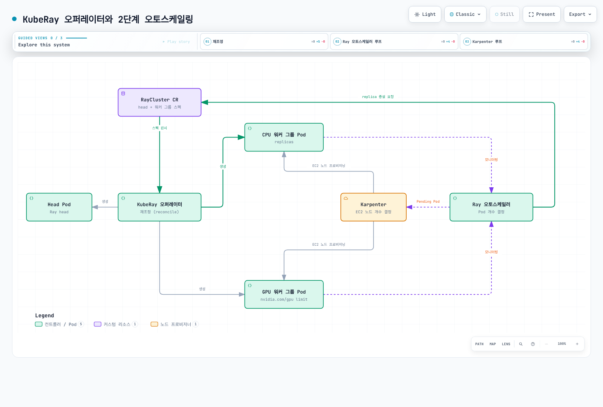

# Part 2: KubeRay 오퍼레이터

> **지원 버전**: KubeRay v1.6.1, Ray 2.57.0
> **마지막 업데이트**: 2026년 8월 20일

## 실습 환경 준비

이 문서의 예제를 따라 하려면 다음 도구와 환경이 필요합니다.

### 필수 도구

* kubectl v1.34 이상, 정상 동작하는 Amazon EKS 클러스터에 연결된 상태
* Helm v3
* GPU 워커 그룹을 테스트하려는 경우, Karpenter로 프로비저닝한 GPU 지원 `NodePool`/`EC2NodeClass` 쌍

## KubeRay가 하는 일

[Part 1](01-architecture.md)에서는 Ray 클러스터를 head 노드와 하나 이상의 워커 노드 그룹으로 구성된 형태로 설명했습니다. 이 구조는 Kubernetes의 개념이 아니라 Ray 고유의 개념이므로, 이를 실제 Pod, Service, 그리고 그 외 Kubernetes 오브젝트로 변환해 줄 무언가가 필요합니다. 그 역할을 하는 것이 KubeRay입니다.

KubeRay는 Ray 클러스터를 Kubernetes 네이티브 커스텀 리소스로 관리하는 Kubernetes 오퍼레이터입니다. head 노드와 각 워커 그룹마다 Deployment, StatefulSet, Service를 일일이 작성하는 대신, 오퍼레이터 사용자는 원하는 Ray 클러스터 형태를 YAML 매니페스트로 선언하고, KubeRay의 컨트롤러가 클러스터의 실제 상태를 그 선언된 스펙에 맞춰 지속적으로 재조정(reconcile)합니다. 이것이 "Kubernetes 위의 Ray"를 선언적으로 만들어 주는 핵심입니다. 원하는 상태는 커스텀 리소스에 담겨 있고, 그 상태에 맞춰 하위 Pod를 생성·수정·삭제하는 작업은 오퍼레이터가 대신 처리합니다.

이 문서는 **KubeRay v1.6.1**을 기준으로 합니다 — KubeRay는 이 문서와 별개의 릴리스 주기로 배포되므로, 현재 버전은 [KubeRay 릴리스 페이지](https://github.com/ray-project/kuberay/releases)에서 확인하세요. KubeRay v1.6은 Ray의 인증 토큰 모드에 대한 완전한 지원(실행 중인 클러스터의 대시보드와 클라이언트 포트 접근 보호)을 추가했고, RayJob의 기본 submitter 이미지를 더 가벼운 것으로 교체해 RayJob의 시작 성능을 이전 기본값보다 개선했습니다. 그전의 v1.5 릴리스에서는 이미 RayService의 증분/롤링 업그레이드 기능이 추가되어, 전체 클러스터를 통째로 블루/그린 방식으로 교체하는 것보다 리소스 오버헤드가 적으면서도 무중단 업데이트를 목표로 했습니다 — 다만 이런 기능은 프로젝트가 성숙해지면서 옵트인·피처 게이트 상태에서 기본 활성화 상태로 바뀔 수 있으므로, 실제로 의존하기 전에 현재 릴리스 노트를 확인하세요.

## 핵심 CRD

KubeRay는 주로 세 가지 CRD(Custom Resource Definition)를 통해 기능을 제공하며, 각각 Ray를 Kubernetes에서 운영하는 서로 다른 방식을 겨냅니다(KubeRay Helm 차트는 아직 발전 중인 최신 기능을 위한 CRD도 함께 설치하므로, 이 세 가지가 전부라고 단정하기 전에 현재 릴리스 노트를 확인하세요).

**RayCluster**는 가장 기본이 되는 리소스로, head Pod 하나와 하나 이상의 워커 그룹으로 구성된 순수한 Ray 클러스터입니다. 각 워커 그룹은 동질적인(homogeneous) 워커 Pod들의 집합입니다 — 예를 들어 일반적인 Ray 작업을 위한 CPU 워커 그룹과, 모델 학습이나 추론을 위한 별도의 GPU 워커 그룹처럼 나눌 수 있습니다. KubeRay 오퍼레이터는 실제 Pod들을 RayCluster 스펙과 지속적으로 재조정하며, 스펙(또는 아래에서 설명할 오토스케일러)이 특정 워커 그룹의 원하는 replica 수를 바꾸면 그에 맞춰 워커 Pod를 생성하거나 제거합니다.

**RayJob**은 Ray 클러스터에 배치 작업을 제출하며, 선택적으로 그 클러스터의 전체 생명주기까지 관리할 수 있습니다 — RayCluster를 생성하고, 제출된 작업을 실행하고, 작업이 끝나면 클러스터를 정리하는 것까지입니다. 이는 실행 사이에 유휴 상태로 클러스터를 남겨두고 싶지 않은 일회성 또는 스케줄링된 배치 워크로드에 자연스럽게 맞는 방식입니다.

**RayService**는 프로덕션 모델 서빙을 목표로 합니다. RayCluster와 그 위에 배포된 Ray Serve 애플리케이션을 함께 관리하며, 기반 클러스터와 애플리케이션을 무중단으로 롤링 업그레이드하는 기능도 제공합니다 — 이 업그레이드 경로의 성숙도와 전제 조건은 실제로 의존하기 전에 현재 릴리스 노트에서 확인하세요.



[🔍 인터랙티브 다이어그램 보기](https://www.atomai.click/kubernetes-docs/archmaps/ko-ai-ml-ray-02-kuberay-operator-0.html)

## 2단계 오토스케일링: Ray 오토스케일러와 Karpenter

EKS에서 Ray를 운영한다는 것은 서로 다른 두 개의 오토스케일링 제어 루프를 다뤄야 한다는 뜻입니다. 이 문서 사이트에서 Flink나 Katib 같은 다른 오토스케일링 워크로드를 다룰 때도 등장하는 동일한 패턴입니다. 두 루프는 서로 다른 질문에 답하며, 어느 한쪽이 다른 쪽의 질문에 대신 답할 수는 없습니다.

**Ray 오토스케일러**는 Ray 클러스터 자체의 일부로 실행되며, KubeRay를 통해 조율됩니다. 현재 워커에 배치할 수 없는 대기 중인 태스크와 액터 같은 Ray 자체의 스케줄링 상태를 관찰하고, 몇 개의 Ray 워커 Pod가 필요한지 결정합니다. 그 결정은 해당 RayCluster 워커 그룹의 replica 수를 조정하는 방식으로 실행되며, 이는 다시 KubeRay 오퍼레이터에게 워커 Pod를 생성(또는 제거)하도록 전달됩니다. 오토스케일러에는 `idleTimeoutSeconds` 설정도 있는데, 기본값은 60초이며, 태스크·액터·참조된 오브젝트가 전혀 없는 유휴 워커 Pod를 스케일 다운하기까지 기다리는 시간입니다.

**Karpenter**(또는 Karpenter를 쓰지 않는 클러스터라면 Kubernetes Cluster Autoscaler)는 한 단계 아래, Kubernetes 노드 수준에서 동작합니다. Ray의 태스크나 액터에 대해서는 전혀 알지 못하며, 오직 배치할 노드가 없어 Pending 상태인 Pod에 반응해서 그 Pod들에 맞는 새 EC2 노드를 프로비저닝할 뿐입니다.

정리하면, Ray 오토스케일러는 *몇 개의 Ray 워커 Pod*가 필요한지를 결정하고, Karpenter는 그것들을 실제로 실행할 *몇 개의 EC2 노드*가 필요한지를 결정합니다. 하나의 제어 루프는 Pod 개수를, 다른 하나는 노드 개수를 각각 담당하며, 둘은 오직 간접적으로 — Pending 상태라는 평범한 Kubernetes 스케줄링 상태를 통해서만 — 소통합니다. 노드 프로비저닝 쪽 루프가 어떻게 동작하는지 더 자세히 알고 싶다면 이 저장소의 [Karpenter 문서](../../autoscaling/02-karpenter.md)를 참고하십시오.

## GPU 스케줄링

GPU 워커 그룹의 Pod 스펙은 그 그룹의 Ray 워커가 인식하는 GPU 개수에 대한 단 하나의 소스 오브 트루스(single source of truth)입니다. 워커 그룹의 컨테이너 스펙에 GPU 리소스 limit이 설정되면 — 예를 들어 `nvidia.com/gpu: 1` — KubeRay는 그 limit을 읽어 Ray 스케줄러와 Ray 오토스케일러 모두에게 해당 워커 Pod의 GPU 용량으로 알립니다. KubeRay는 또한 Pod 스펙의 GPU limit에 맞춰 그 워커의 Ray 프로세스 `--num-gpus` 플래그를 자동으로 설정하므로, GPU 개수를 별도로 어딘가에 맞춰 관리할 필요가 없습니다.

즉 GPU를 인식하는 스케줄링과 GPU를 인식하는 오토스케일링 모두 동일한 Kubernetes 네이티브 선언에서 자연스럽게 도출됩니다. Ray 오토스케일러는 GPU를 필요로 하는 태스크가 실제로 대기 중일 때만 GPU 워커 replica 증설을 요청하며, Karpenter는 [Karpenter](../../autoscaling/02-karpenter.md) 문서에서 설명한 노드 풀·노드 클래스 구성을 이용해 그 Pod들을 충족할 GPU 기반 EC2 노드를 프로비저닝합니다 — 그 메커니즘 자체는 이 문서에서 다시 설명하지 않습니다.

## 오퍼레이터 설치

KubeRay를 설치하는 표준 방법은 `ray-project/kuberay-helm` 저장소에서 배포하는 공식 Helm 차트를 사용하는 것입니다.

```bash
helm repo add kuberay https://ray-project.github.io/kuberay-helm/
helm repo update
helm install kuberay-operator kuberay/kuberay-operator --version 1.6.1
```

이 명령은 오퍼레이터의 컨트롤러와 위에서 설명한 RayCluster, RayJob, RayService를 포함한 CRD들을 클러스터에 설치합니다. 오퍼레이터 Pod가 실행되면, (설치 플래그에 따라 클러스터 전체 또는 특정 네임스페이스의) RayCluster, RayJob, RayService 오브젝트를 감시하고 재조정을 시작합니다.

## 다음 단계

이번 파트에서는 KubeRay가 무엇인지, 핵심 CRD가 무엇인지, 그리고 2단계 오토스케일링 모델이 Karpenter와 역할을 어떻게 나누는지를 다뤘습니다. 다음 파트에서는 클러스터 운영 메커니즘에서 벗어나, KubeRay가 관리하는 클러스터 위에서 실행되는 Ray의 ML 라이브러리를 다룹니다. [Part 3: Ray Train과 Ray Tune](03-ray-train-tune.md)을 참고하십시오.

[메인 페이지로 돌아가기](./README.md)

## 퀴즈

이 장에서 배운 내용을 확인하려면 [주제 퀴즈](../../quizzes/ai-ml/ray/02-kuberay-operator-quiz.md)를 풀어보세요.
