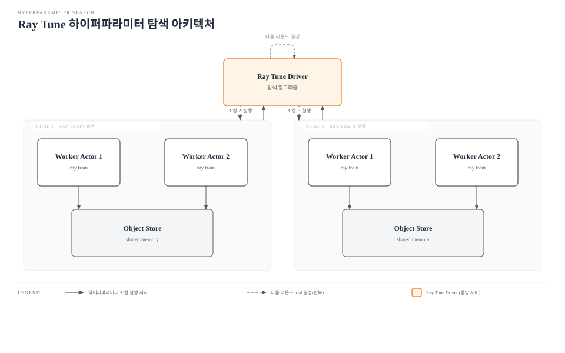

# Part 3: Ray Train과 Ray Tune

> **지원 버전**: Ray 2.57.0
> **마지막 업데이트**: 2026년 8월 20일

## 실습 환경 준비

이 문서의 예제를 따라 하려면 다음 도구와 환경이 필요합니다.

### 필수 도구

* Python 3.10 이상
* `pip install "ray[train,tune]"`
* Ray 클러스터에 대한 접근 (EKS 위에 클러스터를 구성하는 방법은 [Part 2: KubeRay Operator](02-kuberay-operator.md) 참고, 이 문서의 예제만 실행하려면 로컬에서 `ray.init()`으로도 충분합니다)

## Ray Train: Ray의 기본 원시 개념 위에서 동작하는 분산 학습

[Part 1](01-architecture.md)에서는 Ray의 핵심 원시 개념인 task, actor, object store를 소개했습니다. 이 원시 개념들 위에 분산 학습 작업을 직접 작성하는 것도 가능하지만, 그럴 경우 GPU마다 워커 프로세스를 하나씩 띄우는 일, 그 워커들이 gradient를 동기화하기 위해 사용하는 통신 그룹을 구성하는 일, 여러 워커에 걸쳐 체크포인트를 일관되게 조율하는 일 같은 상당한 보일러플레이트를 직접 손으로 작성해야 합니다.

**Ray Train**은 Ray의 task와 actor 원시 개념 위에 만들어진 라이브러리로, 이 보일러플레이트를 대신 처리해줍니다. Ray Train은 익숙한 프레임워크 API(가장 흔한 경우는 PyTorch이지만, Ray Train은 다른 프레임워크도 지원합니다)로 작성된 학습 함수를 받아, 원하는 만큼의 분산 워커에 걸쳐 실행합니다. 학습 함수를 작성하는 사람은 워커 실행, 워커 간 통신, 체크포인트 조율을 직접 관리할 필요가 없습니다.

### Ray Train V2

Ray Train의 퍼블릭 API는 프로젝트 역사에서 계속 발전해왔습니다. 사용자가 실제로 쓰는 import 경로는 PyTorch 학습 기준으로 여전히 `ray.train.torch.TorchTrainer`이지만, 그 경로 뒤에 있는 구현은 다시 작성되었습니다 — 이 재작성("Train V2")은 이전 세대의 여러 Trainer 클래스가 내부적으로 동작하던 방식을 통합하고 단순화했고, 지금은 동일한 import 경로에서 기본으로 쓰이는 구현입니다. 이 재작성이 반영되기 전 Ray 릴리스에 고정된 오래된 코드베이스를 만난다면, 그것이 깨졌다고 단정하기보다는 이전 구현으로 동작하고 있다고 이해하는 편이 맞습니다. 기본값이 정확히 어느 버전에서 바뀌었는지는 Ray 릴리스마다 달라질 수 있는 세부 사항이므로, 구체적인 내용은 docs.ray.io의 Ray 공식 문서를 참고하시기 바랍니다.

## Ray Train의 핵심 개념

### Trainer

**Trainer**(예: `TorchTrainer`)는 사용자가 작성한 학습 함수를 감싸는 클래스입니다. 학습 함수 안에는 선택한 프레임워크에서 흔히 쓰는 일반적인 모델 학습 로직, 즉 모델을 구성하고, 배치를 순회하고, loss를 계산하고, optimizer를 한 단계 진행하는 코드가 들어갑니다. Trainer는 이 함수를 워커마다 한 번씩, 해당 프레임워크의 데이터 병렬 학습이 요구하는 분산 프로세스 그룹(예: PyTorch DDP 프로세스 그룹) 안에서 실행하는 역할을 맡습니다. 따라서 학습 함수 자체는 이 통신 그룹을 직접 구성할 필요가 없습니다.

### ScalingConfig

**ScalingConfig**는 Trainer에게 워커를 몇 개 실행할지, 그리고 각 워커가 어떤 리소스를 필요로 하는지를 알려줍니다. 예를 들어 워커를 몇 개 실행할지, 각 워커에 GPU가 필요한지를 지정합니다. Trainer는 이 설정을 바탕으로 다른 일반적인 Ray task나 actor와 동일한 방식으로 기반 Ray 클러스터에 해당 리소스를 요청합니다.

### 체크포인팅

Ray Train 워커들은 학습 도중 체크포인트를 다시 보고할 수 있습니다. 체크포인트는 모델 weight와 optimizer 상태 등 학습을 처음부터 다시 시작하지 않고 그 지점부터 이어갈 수 있을 만큼의 상태를 담고 있습니다. 이는 두 가지 역할을 합니다. 하나는 오래 걸리는 분산 학습 작업이 워커 장애 이후에도 이전 진행 상황을 잃지 않고 복구할 수 있게 하는 것이고, 다른 하나는 학습된 모델을 워크플로우의 다음 단계로 넘겨주는 것입니다. 이 다음 단계는 아래에서 다룰 하이퍼파라미터 튜닝 관련 의사결정일 수도 있고, 이 문서 사이트의 MLflow Model Registry 관련 자료가 다루는 개념과 비슷하게 결과를 모델 버전으로 등록하는 일일 수도 있습니다(다만 그 자료 자체는 Ray에 특화된 내용은 아닙니다).

## Ray Tune: 클러스터 전역에서의 하이퍼파라미터 탐색

**Ray Tune**은 마찬가지로 Ray 위에 만들어진 하이퍼파라미터 튜닝 라이브러리로, 클러스터 전역에 걸쳐 많은 학습 trial을 병렬로 실행하고, pluggable한 탐색 알고리즘을 사용해 다음에 시도할 하이퍼파라미터 조합을 결정합니다. 각 trial은 특정 하이퍼파라미터 조합으로 모델을 학습시키고, Tune의 탐색 알고리즘이 다음 시도를 결정하는 데 쓸 수 있는 결과를 다시 보고합니다.

이는 이 문서 사이트의 Kubeflow 관련 자료가 다루는 Katib와 개념적으로 유사한 위치에 있습니다. 다만 Tune은 별도의 Kubernetes CRD 기반 시스템이 아니라 Ray 생태계에 네이티브한 라이브러리라는 점이 다릅니다.

## Ray Train과 Ray Tune의 결합

Ray Tune이 실행하는 trial이 반드시 단일 프로세스 함수여야 하는 것은 아닙니다. 흔히 쓰이는 패턴은 Tune이 탐색 대상으로 삼는 trainable로 Ray Train의 `Trainer`를 그대로 넘기는 것입니다. 이 경우 각 하이퍼파라미터 trial은 그 자체로 독립적인 분산 Ray Train 실행이 되며, 여러 GPU나 여러 노드에 걸쳐 실행될 수 있습니다.

이 결합은 모델을 학습시키는 데 비용이 커서, trial 하나만으로도 합리적인 시간 안에 끝내려면 분산 학습이 필요한 상황에서 중요해집니다. 이 결합이 없다면 팀은 곤란한 선택에 놓입니다. 분산 학습 작업을 대상으로 하이퍼파라미터를 순차적으로 튜닝하거나, 탐색 단계에서는 분산 학습을 포기해야 합니다. 두 라이브러리가 동일한 Ray 원시 개념을 공유하기 때문에, Tune은 각기 별도의 분산 워커 집합을 가진 여러 Ray Train 실행을 동시에 여러 개 구동할 수 있으며, 이를 위해 어느 쪽 라이브러리도 서로를 위한 특수한 통합 코드를 필요로 하지 않습니다.

## 리소스 할당과 클러스터 오토스케일러

Ray Train과 Ray Tune 모두 [Part 1](01-architecture.md)에서 설명한 Ray의 일반적인 task/actor 리소스 요청 메커니즘을 통해 워커의 CPU와 GPU를 요청합니다. 학습이나 튜닝만을 위한 별도의 리소스 요청 경로는 존재하지 않습니다. 이 점이 EKS에서 중요한 이유는, 바로 이 덕분에 [Part 2](02-kuberay-operator.md)에서 다룬 KubeRay 기반 오토스케일러가 학습이나 튜닝 작업의 실제 리소스 수요에 반응할 수 있다는 것입니다. 클러스터를 앞으로 실행될 가장 큰 작업의 크기에 맞춰 미리 고정할 필요가 없습니다. Ray Tune sweep이 더 많은 동시 trial을 실행하면 오토스케일러가 더 많은 워커 노드를 요청하고, trial이 끝나면 다시 축소할 수 있습니다.

## 실무 참고: EKS에서의 코스케줄링과 GPU 노드 프로비저닝 리드 타임

하나의 Ray Train 실행을 구성하는 분산 워커 프로세스들은 보통 코스케줄링, 즉 모두가 동시에 떠서 각자 할당된 GPU를 확보한 상태여야 그들이 구성하는 통신 그룹을 세울 수 있습니다. 이는 이 문서 사이트의 다른 부분에서 다른 분산 학습 시스템을 다룰 때 언급한 gang-scheduling 요구사항과 유사합니다. 클러스터의 오토스케일러가 요청된 모든 GPU 워커를 합리적인 시간 안에 프로비저닝하지 못하면, 학습 작업은 마지막 남은 워커들이 뜰 때까지 멈춰서 대기하게 됩니다.

이는 GPU 노드 풀 프로비저닝 리드 타임과 직접 관련됩니다. 노드 풀에서 새 GPU 용량을 확보하는 데는 시간이 걸리며, 이 시간은 일반 CPU 노드보다 더 길고 예측하기 어려운 경우가 많습니다. 노드 프로비저닝 메커니즘 자체는 이 문서 사이트의 [Karpenter 가이드](../../autoscaling/02-karpenter.md)에서 자세히 다룹니다. Ray Train/Tune을 계획할 때 기억해야 할 핵심은, EKS에서 학습 작업이 실제로 시작되는 시점은 작업을 제출한 시점이 아니라 클러스터가 요청받은 모든 워커를 얼마나 빠르게 코스케줄링할 수 있는지에 달려 있다는 점입니다.

## 다음 단계

Part 3에서는 Ray Train의 Trainer, ScalingConfig, 체크포인팅, Ray Tune의 trial 기반 하이퍼파라미터 탐색, 그리고 튜닝 trial 자체가 분산 학습을 필요로 할 때 두 라이브러리가 결합되는 방식을 다뤘습니다. [Part 4: Ray Serve](04-ray-serve.md)에서는 학습에서 서빙으로 넘어가, 학습된(그리고 필요하다면 튜닝까지 마친) 모델을 확장 가능한 추론 엔드포인트로 노출하는 방법을 다룹니다.

[메인 페이지로 돌아가기](./README.md)

## 퀴즈

[Ray Train과 Ray Tune 퀴즈](../../quizzes/ai-ml/ray/03-ray-train-tune-quiz.md)로 이해도를 확인해 보세요.
