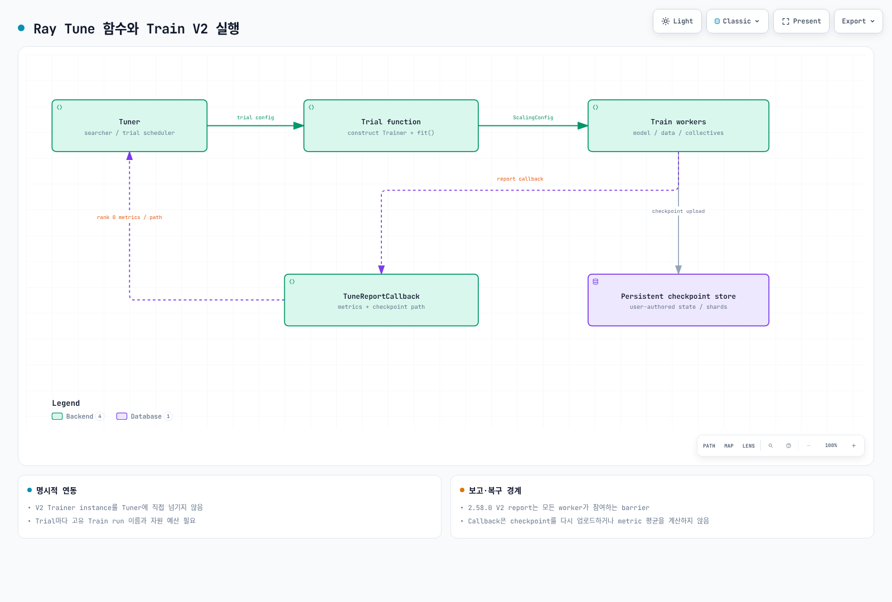

# Part 3: Ray Train과 Ray Tune

> **검토 기준**: Ray 2.58.0 · 2026-09-12

## 실습 환경 준비

검증 환경은 Python 3.12와 `ray[train,tune]==2.58.0`입니다. 이 extra는 Ray의 Train/Tune 의존성을 설치하며 **PyTorch 같은 학습 framework 자체는 별도**입니다. PyTorch·CUDA·driver 조합은 실제 workload에 맞춰 확인합니다.

이번 검증은 설정·callback·checkpoint API와 작은 CPU scalar Tune 예제입니다. PyTorch 학습, GPU, 분산 gradient 통신 또는 EKS autoscaling을 실행한 결과가 아닙니다.

## Ray Train V2와 학습 코드의 책임

2.58.0은 `RAY_TRAIN_V2_ENABLED`를 지정하지 않으면 V2가 기본입니다. `ray.train.torch.TorchTrainer` 경로도 이 조건에 따라 V2 구현을 선택합니다. 환경 변수로 이전 구현을 선택한 실행과 같은 API 계약이라고 가정하지 않습니다.

Trainer는 worker와 분산 process group 같은 기반 조율을 제공합니다. 그러나 모델·optimizer·loss·data loop, 데이터 분할, 학습 상태 저장·복구를 모두 자동 작성하지는 않습니다. PyTorch에서는 `prepare_model`, `prepare_data_loader` 등으로 device/DDP·sampler를 준비하고 실제 데이터 중복·gradient 동기화·평가를 확인해야 합니다. Framework의 collective 통신을 Ray object store로 모두 설명할 수도 없습니다.

## ScalingConfig와 자원 수요

`ScalingConfig`는 worker 수와 worker별 CPU/GPU 등 논리 자원을 선언합니다. 고정 worker 수뿐 아니라 지원되는 elastic 설정도 있으므로 실제 mode와 데이터 재분할·복구 조건을 확인합니다. 2.58.0 V2에서 이전 `trainer_resources`를 지정하면 deprecation 오류가 발생합니다. V2 controller의 논리 CPU와 training worker 자원, Tune trial driver 자원을 구분합니다.

Placement group과 worker 배치에 필요한 전체 자원을 확보해야 framework process group이 정상 시작할 수 있습니다. 이것은 Kubernetes scheduler 자체를 교체하거나 모든 Pod가 원자적으로 배치된다는 보장이 아닙니다. GPU가 부족하면 대기·timeout·실패할 수 있고, Ray/KubeRay의 최대 규모·quota·image 준비·EC2 가용성도 영향을 줍니다.

## 체크포인트와 보고

`Checkpoint.from_directory()`는 사용자가 준비한 파일을 가리키는 checkpoint 객체를 만듭니다. 자동으로 모델·optimizer·RNG·scheduler·dataset 위치를 수집하지 않습니다. 복구에 필요한 내용을 직접 저장하고, worker에서 `train.get_checkpoint()`로 받은 checkpoint를 읽어 상태를 복원합니다.

**2.58.0 V2의 `train.report`는 모든 worker가 같은 횟수로 호출해야 하는 barrier입니다.** Rank 0만 파일을 저장하더라도 다른 rank는 `checkpoint=None`으로 report에 참여해야 합니다. 일부 worker가 건너뛰면 학습이 멈출 수 있습니다. Metric은 자동으로 모든 worker의 평균이 되지 않습니다. 필요한 집계는 학습 코드에서 계산합니다.

기본 checkpoint 업로드 모드는 synchronous입니다. 비동기 업로드·validation 같은 다른 모드를 사용하면 완료 상태, 임시 파일 수명과 해당 기능의 제약을 따로 확인합니다. 여러 worker가 shard를 저장할 때는 파일명 충돌을 피해야 합니다.

다중 노드에서는 모든 worker가 사용할 수 있는 persistent storage를 `train.RunConfig(storage_path=...)`로 설정합니다. 로컬 Pod 디렉터리는 노드·Pod 삭제 후의 복구를 보장하지 않습니다. S3 경로를 지정할 때도 IAM·네트워크·저장소 보존 정책이 필요합니다.

### 실패 유형과 재시도

2.58.0 V2 `FailureConfig`의 기본값은 training worker 오류에 대한 `max_failures=0`, controller 오류의 `controller_failure_limit=-1`, preemption의 `max_preemption_failures=-1`입니다. **`max_failures=0`만으로 모든 종류의 재시도가 꺼진다고 해석하면 안 됩니다.** 각 실패 유형의 한도와 RayJob/운영 deadline을 함께 정합니다. Checkpoint가 없거나 불완전하면 재시도만으로 진행 상황이 복구되지 않습니다.

## Ray Tune: Searcher와 Scheduler

Tune은 trial의 configuration과 실행을 관리합니다. Searcher는 parameter 후보를 선택하고, trial scheduler는 중간 metric을 바탕으로 중단·일시정지·계속 실행 등을 결정합니다. Grid/random search가 반드시 이전 metric에 적응해서 다음 값을 선택하는 것은 아닙니다.

`max_concurrent_trials`, trial resource 설정, placement group과 cluster 용량을 함께 봅니다. Trial driver가 자원을 모두 점유해 내부 Train worker가 시작되지 못하는 구성도 피해야 합니다. 모든 trial의 CPU/GPU를 합산하는 것만으로 각 worker bundle의 배치 가능성까지 보장하지는 않습니다.

## 작은 Tune 예제

다음은 모델 학습이 아닌 **두 개의 scalar objective trial**입니다. 실제 실행에서 두 결과를 수집하고 `x=3`의 score 0을 확인했습니다.

```python
from pathlib import Path
import ray
from ray import tune

def objective(config):
    for step in range(2):
        tune.report({"score": -(config["x"] - 3) ** 2, "step": step})

try:
    ray.init(address="local", num_cpus=2, include_dashboard=False,
             object_store_memory=80 * 1024 * 1024)
    tuner = tune.Tuner(
        tune.with_resources(objective, {"cpu": 1}),
        param_space={"x": tune.grid_search([1, 3])},
        tune_config=tune.TuneConfig(
            metric="score", mode="max", max_concurrent_trials=1),
        run_config=tune.RunConfig(
            storage_path=str(Path(".tune-demo").resolve()),
            name="scalar-example", verbose=0),
    )
    results = tuner.fit()
    assert len(results) == 2 and not results.errors
    best = results.get_best_result()
    assert best.config["x"] == 3 and best.metrics["score"] == 0
finally:
    ray.shutdown()
```

Ray의 논리 자원 설정과 object store 크기는 전체 프로세스의 OS memory/CPU 상한이 아닙니다. Result 디렉터리를 다시 사용할 때는 새 실행·복구 의도를 확인합니다.

## Train과 Tune의 현재 연동 방식

**V2 Trainer instance를 그대로 `Tuner`에 넘기는 것을 현재 권장 경로로 제시하면 안 됩니다.** Native 검사에서 V2 DataParallelTrainer를 직접 넘기면 `TuneError`가 발생했습니다. 이전 BaseTrainer 경로의 호환·deprecation 코드와 V2를 구분합니다.

현재 공식 패턴은 Tune이 실행하는 **함수 trainable** 안에서 framework Trainer를 만들고 `.fit()`을 호출하는 것입니다. Trial별 parameter를 `train_loop_config`에 전달하고 고유한 Train run 이름과 storage 경로를 사용합니다.

중간 metric/checkpoint 경로를 전달하려면 `ray.tune.integration.ray_train.TuneReportCallback`을 Train의 `RunConfig(callbacks=[...])`에 연결할 수 있습니다. 이 callback은 Tune session 안에서 만들어야 합니다. 2.58.0 구현은 worker metric 목록의 첫 항목을 전달하며 평균을 계산하지 않습니다. Checkpoint는 다시 업로드하지 않고 경로를 metric에 추가합니다.

Tune에 넘기는 설정은 `tune.RunConfig`, Trainer에 넘기는 설정은 `train.RunConfig`입니다. 두 scope의 실패·저장·callback 설정을 혼용하지 않습니다. 이 연동에는 명시적인 연결 코드와 자원 배치 계획이 필요합니다.



[인터랙티브 다이어그램](https://www.atomai.click/kubernetes-docs/archmaps/ko-ai-ml-ray-03-ray-train-tune-0.html)

## EKS 운영 시 확인할 점

Ray의 pending resource/placement 요구, KubeRay worker group 규모, Kubernetes Pod placement와 실제 node 공급을 각각 확인합니다. Capacity 부족이 해결되더라도 image pull, dataset 접근, framework 초기화·통신과 checkpoint 권한에서 시작이 지연될 수 있습니다.

Autoscaling을 켰다고 즉시 GPU가 공급되거나 비용·완료 시간이 자동으로 제한되는 것은 아닙니다. Trial 동시성, worker 수, maxReplica, 실패별 retry 한도와 운영 deadline을 함께 설정합니다. RayJob/cluster 정리 전에 결과와 checkpoint의 실제 보존을 확인합니다.

## 공식 근거

- [Train overview](https://docs.ray.io/en/releases-2.58.0/train/overview.html)
- [Train + Tune](https://docs.ray.io/en/releases-2.58.0/train/user-guides/hyperparameter-optimization.html)
- [Checkpoint](https://docs.ray.io/en/releases-2.58.0/train/user-guides/checkpoints.html)
- [Persistent storage](https://docs.ray.io/en/releases-2.58.0/train/user-guides/persistent-storage.html)
- [Failure/preemption](https://docs.ray.io/en/releases-2.58.0/train/user-guides/fault-tolerance.html)
- [PyTorch 준비](https://docs.ray.io/en/releases-2.58.0/train/getting-started-pytorch.html)
- [2.58.0 report 구현](https://github.com/ray-project/ray/blob/ray-2.58.0/python/ray/train/v2/api/train_fn_utils.py)

[다음: Ray Serve](04-ray-serve.md) · [메인 페이지](README.md) · [퀴즈](../../quizzes/ai-ml/ray/03-ray-train-tune-quiz.md)
