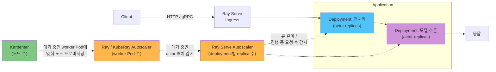

# Part 4: Ray Serve로 모델 서빙하기

> **지원 버전**: Ray 2.57.0
> **마지막 업데이트**: 2026년 8월 20일

## 실습 환경 준비

이 문서의 예제를 따라 하려면 다음 도구와 환경이 필요합니다.

### 필수 도구

* Python 3.10+
* 일반적인 Ray Serve 배포에는 `pip install "ray[serve]"`, 아래 Ray Serve LLM 섹션을 따라 하려면 대신 `pip install "ray[llm]"` — `ray[serve]`에는 포함되지 않는 vLLM 등 관련 의존성을 함께 설치합니다
* RayService 경로를 테스트하려면 정상 동작하는 Amazon EKS 클러스터를 가리키는 kubectl v1.34 이상
* GPU 기반 모델을 서빙하려면 Karpenter로 프로비저닝한 GPU 지원 `NodePool`/`EC2NodeClass` 쌍

## Ray Serve란 무엇인가

[Part 1](01-architecture.md)에서는 actor를 호출 사이에 메모리 상태를 유지하는, 상태를 갖고 주소로 접근 가능한 Ray의 기본 프리미티브로 소개했습니다. Ray Serve는 바로 이 프리미티브 위에 만들어진 모델 서빙 라이브러리입니다. Serve deployment는 Ray actor 하나, 또는 actor replica 그룹으로 구현되고, Ray Serve는 들어오는 HTTP/gRPC 요청을 그 replica들로 라우팅합니다. replica 메모리에 한 번 로드된 모델은 다시 로드하지 않고도 여러 요청에 응답할 수 있는데, 이는 정확히 actor가 설계된 목적에 부합하는 사용 패턴입니다.

하나의 deployment는 Ray Serve의 요청 라우터 뒤에 actor replica를 더 추가하는 것만으로 수평 확장됩니다. 이는 Ray에서 actor 기반 서비스가 확장되는 방식과 동일합니다. 더 흥미로운 점은, Ray Serve가 여러 deployment를 하나의 서빙 파이프라인 — application이라 부르는 단위 — 으로 조합할 수 있게 해준다는 것입니다. 흔한 예로 2단계 파이프라인을 들 수 있습니다. 한 deployment가 전처리(토큰화, 이미지 리사이즈, 피처 추출)를 담당하고, 그 출력을 실제 모델 추론을 수행하는 두 번째 deployment로 넘기는 구조입니다. 파이프라인의 각 deployment는 여전히 그 아래에서는 단순히 actor replica 그룹일 뿐이므로, 각각 독립적으로 스케일을 조절하고, 버전을 관리하고, 리소스를 배정할 수 있습니다.

## Ray Serve LLM

LLM 서빙은 continuous batching, 토큰 스트리밍, OpenAI 호환 요청 형식 등 그 자체로 하나의 독립된 패턴을 이룰 만큼 특수합니다. Ray는 이를 위한 전용 빌딩 블록으로 `ray.serve.llm` 모듈을 제공합니다. vLLM 엔진 인스턴스를 직접 관리하는 deployment를 손으로 조립하는 대신, `ray.serve.llm`은 앞서 설명한 Ray Serve의 일반적인 deployment 모델 위에 계층화된, LLM 서빙에 특화된 더 높은 수준의 구성 요소를 제공합니다.

`ray.serve.llm`은 vLLM을 지원 추론 엔진으로 문서화하고 있으며, 그 OpenAI 호환 API는 vLLM 자체의 OpenAI 호환 서버와 최대한 맞춰서 설계되어 있어, 일반적인 `vllm serve` 실행에서 동작하는 대부분의 `engine_kwargs`가 그대로 이어집니다. 실무적으로는, autoscaling, 다중 모델 서빙, Ray의 일반적인 분산 actor 배치 같은 기존 Ray Serve의 프로덕션 기능이 LLM 서빙에도 그대로 적용되고, LLM에 특화된 배선(vLLM 엔진 로딩·구성, OpenAI 호환 엔드포인트 노출)은 직접 만드는 대신 `ray.serve.llm`이 처리해준다는 뜻입니다. 이 영역은 Ray Serve에서도 특히 활발히 발전하는 부분이므로, 구체적인 필드명에 의존하기 전에 `docs.ray.io/en/latest/serve/llm/`의 최신 문서로 실제 구성 항목을 확인하십시오.

## Serve Deployment의 Autoscaling

Ray Serve deployment는 [Part 2](02-kuberay-operator.md)에서 다룬 클러스터 수준 autoscaling과는 별개의, 자체 autoscaling 계층을 갖습니다. Ray/KubeRay autoscaler가 RayCluster에 필요한 worker Pod 수를 결정하는 것과 달리, Ray Serve의 autoscaler는 한 단계 위에서 더 좁은 질문에 답합니다. "지금 이 deployment는 실제로 받고 있는 요청 부하를 기준으로 몇 개의 replica가 필요한가?"라는 질문입니다. Ray Serve는 replica당 진행 중인 요청 수(대기 중 + 처리 중)를 목표값과 비교해, 설정된 최소·최대 replica 수 범위 안에서 실제 부하가 목표값에 가깝도록 replica 수를 늘리거나 줄입니다.

이로써 EKS에서 실행되는 Serve application에도 이 문서 사이트에서 이제 익숙해진 3단계 autoscaling 구조가 그대로 적용됩니다.

1. **Ray Serve의 autoscaler**가 요청 부하를 기준으로 각 deployment에 필요한 actor replica 수를 결정합니다.
2. [Part 2](02-kuberay-operator.md)에서 다룬 **Ray/KubeRay autoscaler**가, Ray Serve autoscaler가 방금 요청한 replica를 포함해 대기 중인 actor 배치를 기준으로 하위 RayCluster에 필요한 worker Pod 수를 결정합니다.
3. **Karpenter**가 그 worker Pod들을 실제로 실행할 EC2 노드 수를 결정합니다. [Karpenter](../../autoscaling/02-karpenter.md)에서 설명한 것과 동일한 메커니즘입니다.

각 계층은 바로 아래 계층만 봅니다. Ray Serve의 autoscaler는 새 replica가 기존 노드에 배치되는지, 새 노드를 유발하는지 전혀 알지 못합니다. 그저 replica를 더 요청할 뿐입니다. 그 요청이 실제로 새 EC2 노드로 이어지는지, 그리고 그게 얼마나 걸리는지는 한 단계 더 아래에 있는 Karpenter의 몫입니다.

## GPU 추론

GPU가 필요한 모델 추론 deployment는 다른 Ray 워크로드와 동일한 방식으로 GPU를 요청합니다. 즉 [Part 3](03-ray-train-tune.md)에서 Ray Train·Ray Tune worker에 대해 다룬 것과 같은, actor 단위의 일반적인 Ray 리소스 요청 메커니즘을 그대로 사용합니다. Ray Serve는 요청된 GPU 수를 충족할 수 있는 worker에 해당 deployment의 actor replica를 스케줄링하며, [Part 2](02-kuberay-operator.md)에서 다룬 대로 worker group의 Pod spec이야말로 Ray 스케줄러에 GPU 용량을 알리는 실제 근거입니다.

이 지점에서 Ray Serve의 autoscaling과 Karpenter의 노드 프로비저닝 소요 시간은 이 사이트의 다른 GPU 워크로드와 정확히 같은 방식으로 상호작용합니다. Ray Serve의 autoscaler가 추론 deployment에 replica가 더 필요하다고 판단했는데 기존 GPU worker Pod에 여유가 없다면, 그 replica 요청은 대기 중인 Pod가 되고, Karpenter가 새 GPU 기반 EC2 노드를 프로비저닝해야 비로소 그 replica가 실제로 트래픽을 서빙할 수 있게 됩니다. GPU replica 수를 적극적으로 스케일하는 서빙 애플리케이션이라면 이 프로비저닝 소요 시간을 감안해야 합니다 — GPU 인스턴스 타입의 노드 프로비저닝 지연에 대한 더 깊은 설명은 [Karpenter](../../autoscaling/02-karpenter.md)를 참고하십시오.

## 프로덕션에서의 RayService

Kubernetes 밖에서 Serve application을 단독으로 실행하는 것은 로컬 개발에는 적합하지만, EKS 프로덕션 배포는 [Part 2](02-kuberay-operator.md)에서 소개한 `RayService` CRD를 사용합니다. RayService는 하위 RayCluster와 그 위에 배포된 Serve application을 하나의 단위로 함께 관리하며, 진행 중인 요청을 끊지 않는 것을 목표로 새 애플리케이션 버전이나 변경된 RayCluster spec을 롤아웃하는 기능을 지원하는 것이 바로 이 리소스입니다 — 이 업그레이드 경로의 성숙도와 전제 조건은 현재 KubeRay 릴리스 노트에서 확인하세요. 이 문서는 RayService의 CRD 동작 방식을 다시 설명하지 않습니다. 자세한 내용은 Part 2를 참고하십시오.

실무적으로 이는, 이 문서 앞부분에서 설명한 배포 구조 — 각자 자신의 actor replica 수를 autoscaling하는 하나 이상의 deployment로 구성된 application — 가 실제 EKS 클러스터에서 `RayService` 오브젝트가 생명주기를 관리하는 대상이 되며, 그 아래에서는 Ray/KubeRay와 Karpenter의 autoscaling 계층이 다른 RayCluster와 똑같이 동작한다는 뜻입니다.

## 다음 단계

이것으로 4부작 Ray 시리즈를 마칩니다. [Part 1](01-architecture.md)은 task, actor, object store라는 Ray의 핵심 프리미티브를 다뤘습니다. [Part 2](02-kuberay-operator.md)는 KubeRay의 `RayCluster`, `RayJob`, `RayService` CRD를 통해 Ray 클러스터를 Kubernetes에서 선언적으로 운영하는 방법과, Ray/KubeRay와 Karpenter로 나뉘는 autoscaling 구조를 다뤘습니다. [Part 3](03-ray-train-tune.md)은 그 클러스터 위에서 이루어지는 분산 학습과 하이퍼파라미터 튜닝을 다뤘습니다. 이번 파트는 Ray Serve로 마무리를 지었습니다. Part 1의 actor 프리미티브 위에 세워진 deployment, 그것들이 조합된 application, 자체 요청 부하 지표로 이루어지는 autoscaling, 그리고 프로덕션에서는 Part 2의 RayService CRD로 처음부터 끝까지 관리되는 흐름까지입니다.

[메인 페이지로 돌아가기](./README.md)

## 퀴즈

이 장에서 배운 내용을 확인하려면 [주제 퀴즈](../../quizzes/ai-ml/ray/04-ray-serve-quiz.md)를 풀어보세요.
