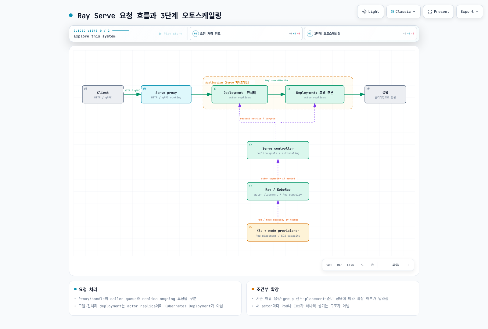

# Part 4: Ray Serve로 모델 서빙하기

> **검토 기준**: Ray 2.58.0 · KubeRay 1.7.0 · 2026-09-12

## 실습 환경 준비와 검증 범위

Python 3.12와 `ray[serve]==2.58.0`으로 작은 CPU 응답 예제를 확인했습니다. 이 환경에서는 HAProxy 관련 module이 Jinja2를 import하지만 extra 설치에 포함되지 않아, `Jinja2==3.1.6`을 추가한 뒤 정상 import됐습니다. 이미 다른 의존성으로 설치된 환경과 구분합니다.

LLM용 `ray[llm]`은 vLLM 등 큰 추론 의존성을 추가합니다. 여기서는 이를 설치하거나 모델 가중치·GPU·EKS를 실행하지 않았습니다. 아래 검증은 Serve 설정, HTTP 응답과 DeploymentHandle 호출에 한정됩니다.

## Deployment, Application과 요청 경로

Serve의 **Deployment**는 actor replica를 관리하는 논리 단위이며 Kubernetes Deployment와 다른 개념입니다. 한 Ray Pod 안에 여러 replica actor가 배치될 수 있으므로 replica 수와 Pod 수를 같게 취급하지 않습니다.

**Application**은 하나 이상의 deployment와 ingress deployment를 포함합니다. DeploymentHandle을 사용해 전처리와 추론 등을 연결할 수 있습니다. 모든 내부 호출이 HTTP를 다시 거치거나 Kubernetes Service를 하나씩 생성하는 구조는 아닙니다.

Controller는 Serve control 상태와 actor 수명주기를 관리합니다. Proxy는 HTTP/gRPC 진입 요청을 받아 적절한 deployment로 전달합니다. 2.58.0의 기본 proxy 위치는 **replica가 있는 node의 `EveryNode`**이며 `HeadOnly`, `Disabled`도 명시적으로 선택할 수 있습니다. 문서의 오래된 “head에 하나가 기본” 설명을 현재 API 기본값으로 사용하지 않습니다.

Proxy 또는 DeploymentHandle의 queue와 replica에 전달된 ongoing 요청을 구분합니다. 요청 처리 함수의 동기/async 동작, blocking 작업, timeout과 취소 전파도 application에서 검토해야 합니다.

## 작은 로컬 HTTP/Handle 예제

다음은 모델 추론이 아닌 응답 API 확인입니다. 검증에서는 private loopback의 비어 있는 port를 사용했고 HTTP 200과 `double(4) == 8`을 확인했습니다.

```python
import requests
import ray
from ray import serve

try:
    ray.init(address="local", num_cpus=2, include_dashboard=False,
             object_store_memory=80 * 1024 * 1024)
    serve.start(proxy_location="HeadOnly",
                http_options={"host": "127.0.0.1", "port": 18080})

    @serve.deployment(num_replicas=1,
                      ray_actor_options={"num_cpus": 1},
                      max_ongoing_requests=2, max_queued_requests=4)
    class Echo:
        async def __call__(self, request):
            return {"echo": request.query_params.get("value", "")}
        def double(self, value):
            return value * 2

    handle = serve.run(Echo.bind(), name="echo", route_prefix="/echo")
    response = requests.get("http://127.0.0.1:18080/echo",
                            params={"value": "fixture"}, timeout=15)
    assert response.status_code == 200
    assert response.json() == {"echo": "fixture"}
    assert handle.double.remote(4).result(timeout_s=15) == 8
finally:
    serve.shutdown()
    ray.shutdown()
```

Port 18080이 비어 있는 별도 실습 process에서 실행합니다. Ray 논리 자원과 object store 설정은 전체 OS memory/CPU 제한이 아닙니다. `serve.shutdown()`은 연결된 Serve instance를 종료하므로 공유 운영 cluster에서 예제 cleanup을 실행하지 않습니다.

## Replica 수, autoscaling과 backpressure

2.58.0에서 확인한 기본값을 구분합니다.

| 구성 | 확인한 값·의미 |
|---|---|
| 기본 Deployment | replica 1, autoscaling 미설정 |
| `num_replicas="auto"` | min 1, max 100, target ongoing 2를 적용 |
| 직접 `AutoscalingConfig()` | min 1, **max 1**; max를 명시하지 않으면 확대가 제한됨 |
| `max_ongoing_requests` | replica에 응답 없이 보낼 수 있는 요청 상한; 기본 5 |
| `max_queued_requests` | **각 caller**(proxy/handle)의 대기열 상한; 기본 -1(무제한) |
| scale 지연 | 기본 upscale 30초, downscale 600초; 실제 준비 완료 시간과는 다름 |

Autoscaling target은 처리 중·대기 부하를 관측하는 제어 값이며 max ongoing이나 전체 queue 한도와 동일하지 않습니다. Queue limit을 넘으면 handle은 BackPressureError, HTTP는 기본 503으로 거부할 수 있습니다. HTTP 거부 응답은 별도 backpressure 설정으로 바꿀 수 있습니다.

Min/max, 측정 window·지연, cold start, 모델 로딩, batching과 실제 처리 시간을 함께 조정합니다. `min_replicas=0`의 scale-to-zero는 재시작 지연을 없애지 않습니다. 설정된 replica 목표 수가 모두 준비됐다는 보장도 아닙니다.

## EKS의 여러 제어 계층

1. Serve는 요청 부하와 정책에 따라 deployment의 replica 목표를 조정합니다.
2. Ray는 actor/placement 요구를 배치하고, 켜져 있는 Ray autoscaler와 KubeRay가 필요하면 worker Pod 규모를 조정합니다.
3. Kubernetes가 Pod를 배치하고 Karpenter 등은 필요할 때 실제 node 용량을 공급합니다.

**Pending actor가 자동으로 Pending Pod 하나 또는 EC2 node 하나로 변환되는 것은 아닙니다.** 기존 Ray Pod에 여유가 생기면 그곳에 배치될 수도 있고, group 한도·placement·quota 때문에 더 진행하지 못할 수도 있습니다. 각 계층에 전달되는 수요와 준비 상태를 확인합니다.



[인터랙티브 다이어그램](https://www.atomai.click/kubernetes-docs/archmaps/ko-ai-ml-ray-04-ray-serve-0.html)

## GPU 추론과 Ray Serve LLM

일반 GPU replica는 `ray_actor_options` 등의 Ray 자원 설정을 사용합니다. 실제 GPU device·driver·Pod limit과 Ray의 structured resources/rayStartParams 우선순위를 함께 확인합니다. [Part 2](02-kuberay-operator.md)에서 설명했듯 Pod limit만이 언제나 유일한 값은 아닙니다.

Ray Serve LLM의 `LLMConfig`, `build_openai_app` 같은 API는 별도 LLM 구성 계층입니다. 2.58.0 문서와 패키지에는 **vLLM과 SGLang backend**가 나타납니다. `ray[llm]`의 확인된 의존성에는 `vllm[audio]==0.26.0`과 NIXL 관련 package가 있으며, 이것이 SGLang의 모든 의존성까지 준비한다는 뜻은 아닙니다.

`model_loading_config`, `deployment_config`, `engine_kwargs`, `server_cls`를 구분합니다. Engine별 field와 지원 조합을 확인하며 모든 `vllm serve` CLI 옵션이 그대로 동작한다고 가정하지 않습니다. 예를 들어 backend마다 tensor-parallel 설정 이름·worker 배치 방식이 다를 수 있습니다. 일부 API는 beta이며 이전 LLMServer/LLMRouter 경로에는 deprecation 안내가 있습니다.

모델 접근 권한·revision·가중치 다운로드, engine/CUDA/driver 호환성, KV cache와 tensor/pipeline parallel 자원도 따로 검증해야 합니다. OpenAI 호환 형식은 인증·보안·모든 기능의 동일성을 보장하지 않습니다. 이 장의 CPU Echo 검증으로 LLM의 성능이나 호환성을 주장하지 않습니다.

## RayService와 운영 업데이트

RayService는 EKS에서 Serve application과 RayCluster의 수명주기를 선언적으로 관리하는 선택지입니다. 모든 운영 배포가 반드시 RayService여야 하는 것은 아닙니다. Application config 변경과 cluster 변경, `NewCluster`와 Gateway 기반 incremental upgrade 전략을 구분합니다.

KubeRay 1.7의 incremental feature gate가 기본 활성이어도 Gateway API/구현, 여유 용량, readiness와 draining 조건을 맞춰야 합니다. 진행 중인 streaming 요청·긴 작업이 제한 시간 안에 종료되는지도 시험합니다. “업데이트하면 항상 요청 손실 0”으로 설명하지 않습니다.

HTTP 설정 같은 cluster-scoped 시작 옵션은 동적 변경에 제한이 있습니다. Deployment 설정 변경도 가벼운 재설정인지 actor 교체인지 확인합니다. 모델을 메모리에 로드한 replica는 재시작·교체 시 초기화 비용과 상태 복구가 필요합니다.

## 접근 제어와 검증 범위

API/Dashboard/Client 진입점, model artifact 접근, application 사용자 인증을 각각 제한합니다. Ray cluster token 설정이나 ClusterIP가 모든 Serve application endpoint의 인증·인가를 자동 제공하지는 않습니다. 요청·응답·prompt·로그에 민감정보를 남기지 않도록 검토하고 queue·timeout·resource 한도를 설정합니다.

이번에 확인한 것은 native 설정/decorator 검증과 작은 단일 노드 HTTP/Handle 실행입니다. Replica autoscaling 부하 시험, GPU/LLM, 다중 노드 장애 전환, RayService 롤아웃은 실행하지 않았습니다.

## 공식 근거

- [Serve 2.58.0](https://docs.ray.io/en/releases-2.58.0/serve/index.html)
- [Autoscaling](https://docs.ray.io/en/releases-2.58.0/serve/autoscaling-guide.html)
- [Serve LLM](https://docs.ray.io/en/releases-2.58.0/serve/llm/index.html)
- [Serve API·proxy 기본값](https://github.com/ray-project/ray/blob/ray-2.58.0/python/ray/serve/api.py)
- [Serve configuration](https://github.com/ray-project/ray/blob/ray-2.58.0/python/ray/serve/config.py)
- [Replica·queue configuration](https://github.com/ray-project/ray/blob/ray-2.58.0/python/ray/serve/_private/config.py)
- [KubeRay 1.7](https://github.com/ray-project/kuberay/releases/tag/v1.7.0)

[메인 페이지](README.md) · [퀴즈](../../quizzes/ai-ml/ray/04-ray-serve-quiz.md)
