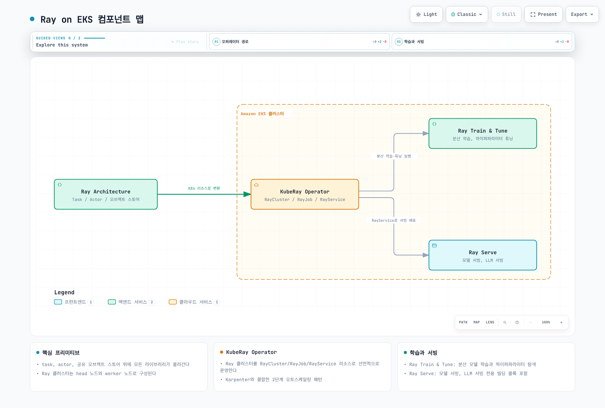

# Ray on EKS 딥다이브

> **지원 버전**: Ray 2.57.0, KubeRay v1.6.1
> **마지막 업데이트**: 2026년 8월 20일

## 개요

Ray는 임시 병렬 작업(task)부터 분산 학습, 하이퍼파라미터 튜닝, 모델 서빙까지 Python 워크로드를 확장하는 오픈소스 분산 컴퓨팅 프레임워크입니다. 워크로드별로 별도 도구를 두는 대신, task·actor·공유 오브젝트 스토어라는 소수의 핵심 프리미티브를 중심으로 설계되어 있습니다. Kubernetes에서는 KubeRay 오퍼레이터가 Ray 클러스터의 head/worker 노드 구조를 네이티브 Kubernetes 리소스로 변환해주므로, Ray 클러스터를 선언적으로 다룰 수 있고 EKS의 다른 워크로드와 동일한 배포·오토스케일링 방식을 그대로 활용할 수 있습니다.

## 컴포넌트 맵

| 개념 | 해결하는 문제 | 심화 가이드 |
|---------|--------------------|-----------|
| **Architecture** | 나머지 모든 것이 기반으로 삼는 task, actor, 오브젝트 스토어 | [Part 1](01-architecture.md) |
| **KubeRay Operator** | Ray 클러스터를 네이티브 Kubernetes 리소스(`RayCluster`/`RayJob`/`RayService`)로 운영 | [Part 2](02-kuberay-operator.md) |
| **Ray Train &amp; Tune** | 분산 모델 학습과 하이퍼파라미터 탐색 | [Part 3](03-ray-train-tune.md) |
| **Ray Serve** | 모델 서빙, LLM 서빙 전용 빌딩 블록 포함 | [Part 4](04-ray-serve.md) |

[🔍 인터랙티브 다이어그램 보기](https://www.atomai.click/kubernetes-docs/archmaps/ko-ai-ml-ray-readme-0.html)

## 왜 EKS에서 운영하는가

트레이드오프는 이 문서 사이트의 다른 데이터/ML 섹션과 동일합니다. 이미 EKS를 운영 중인 팀은 Karpenter 기반 노드 풀 오토스케일링, IAM, 관측성 패턴을 Ray 워크로드에도 클러스터의 다른 워크로드와 동일하게 적용할 수 있는 대신, 관리형 대안을 쓰는 것보다 KubeRay 오퍼레이터와 RayCluster/RayJob/RayService 리소스를 직접 운영해야 하는 부담을 지게 됩니다.

## 현재 제공 중인 문서

1. [Part 1: Ray Architecture](01-architecture.md) — task, actor, 오브젝트 스토어, head/worker 클러스터 모델
2. [Part 2: The KubeRay Operator](02-kuberay-operator.md) — RayCluster, RayJob, RayService, Karpenter와의 2단계 오토스케일링 패턴
3. [Part 3: Ray Train and Ray Tune](03-ray-train-tune.md) — 분산 학습과 하이퍼파라미터 튜닝
4. [Part 4: Ray Serve](04-ray-serve.md) — 모델 서빙, Ray Serve LLM, RayService 기반 프로덕션 배포
