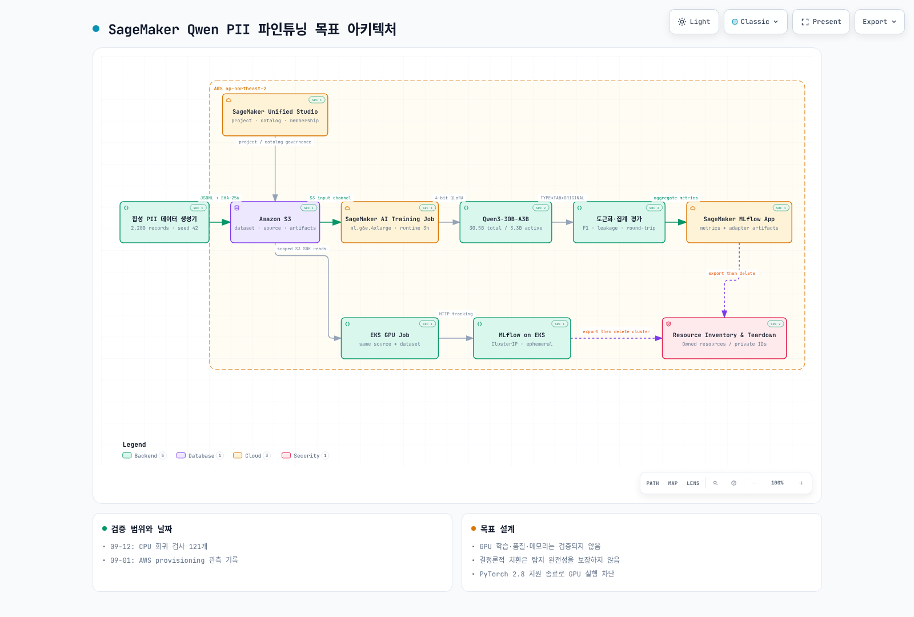

# Part 1: SageMaker Qwen PII 플랫폼 아키텍처

> **마지막 업데이트**: 2026년 9월 2일

## 목표 설계

아래 그림은 **실행 완료 증거가 아니라 재실행을 위한 목표 설계**입니다. 2026년 9월 1일 검증에서는 SageMaker Training Job과 EKS GPU Job을 실행하지 않았습니다.

[🔍 인터랙티브 다이어그램 보기](https://www.atomai.click/kubernetes-docs/archmaps/ko-ai-ml-sagemaker-ai-01-platform-architecture-0.html)

> 한국어로 작성한 노드와 카드는 그대로 표시되지만, Archify Viewer의 고정 컨트롤은 지원 언어 정책에 따라 영어로 표시됩니다.

## 책임 경계

| 구성 요소 | 책임 | 기록 가능한 정보 | 기록하면 안 되는 정보 |
|---|---|---|---|
| 합성 데이터 생성기 | 2,200개 문서와 정답 TSV를 결정론적으로 생성 | seed, split 수, SHA-256, 유형별 개수 | 실제 고객 PII |
| Amazon S3 | 소스 번들, 데이터셋, 집계 결과, 어댑터 아티팩트 저장 | 객체 해시, 비민감 manifest | raw prediction을 공개 경로에 저장 |
| SageMaker Unified Studio | 프로젝트·카탈로그·멤버십 거버넌스 | 프로젝트 상태, profile/blueprint 구성 | membership 없는 자동화 역할에 소유권 가정 |
| SageMaker AI Training Job | 격리된 관리형 GPU 학습 | hyperparameter, 상태, aggregate metric | 원문이나 token mapping 로그 |
| Qwen + QLoRA | `TYPE<TAB>ORIGINAL` 추출 학습 | 모델 ID, LoRA 설정, dependency 버전 | 최종 마스킹 로직 |
| SageMaker MLflow App | 실험 비교와 집계 아티팩트 추적 | 설정, 해시, F1/leakage 같은 집계값 | source text, raw completion |
| EKS GPU Job | 동일 계약의 Kubernetes 대안 실행 | 동일한 aggregate result schema | 장기 실행 클러스터를 기본값으로 유지 |
| Resource Inventory & Teardown | 생성 자원 기록, 내보내기, 삭제, 재확인 | 자원 유형과 최종 개수 | 계정 ID, ARN, presigned URL 게시 |

## 하나의 실험, 두 실행 경로

두 경로는 `config/experiment.yaml`, 데이터 해시, 학습 엔트리포인트, 평가 코드를 공유합니다.

| 결정 항목 | SageMaker AI + MLflow App | EKS GPU Job + MLflow on EKS |
|---|---|---|
| 운영 모델 | 관리형 Training Job과 최신 관리형 MLflow App | 클러스터, GPU 노드, MLflow 서버를 직접 운영 |
| 격리 단위 | Training Job | namespace + Kubernetes Job |
| 추적 | SageMaker MLflow App | ClusterIP MLflow |
| 데이터 전달 | S3 input channel | 제한 시간 presigned URL |
| 종료 | Training Job 종료 후 자원 회수 | Job 종료 후 결과 export, 클러스터 삭제 |
| 적합한 경우 | AWS 관리형 운영과 짧은 실험 수명 선호 | EKS 표준화, Kubernetes 제어, 동일 플랫폼 관측성 필요 |

두 경로의 결과가 비교 가능하려면 모델 ID, seed, split 해시, dependency lock, QLoRA 설정, smoke/full step 수를 변경하지 않아야 합니다.

## 모델과 파인튜닝 범위

기준 모델은 `Qwen/Qwen3-30B-A3B-Instruct-2507`입니다. 전체 가중치를 갱신하지 않고 다음 QLoRA 계약을 사용합니다.

| 항목 | 값 |
|---|---|
| 양자화 | 4-bit NF4, double quantization |
| 연산 dtype | `bfloat16` |
| LoRA rank / alpha | `16` / `32` |
| LoRA dropout | `0.05` |
| 최대 시퀀스 | `1024` |
| smoke / full | `10` / `80` steps |
| 최대 런타임 | `10,800`초 |

모델 출력은 추출 후보일 뿐입니다. whitelist 검사와 원문 포함 검사를 통과하지 못한 행은 버리고, 최종 치환은 모델 외부 코드가 수행합니다.

## 거버넌스가 학습보다 먼저인 이유

Unified Studio의 project는 협업과 자원 공유의 경계이며, project profile이 도구와 blueprint를 결정합니다. 자동화 역할도 project membership이 있어야 프로젝트를 조회·관리할 수 있습니다. 따라서 이 설계는 다음 순서를 강제합니다.

1. domain과 project profile의 사용 권한을 확인합니다.
2. 프로젝트 생성 시 실행 역할의 group profile을 owner membership으로 지정합니다.
3. MLflow App과 프로젝트가 준비된 뒤에만 Training Job 요청을 만듭니다.
4. 실패 시 GPU 자원을 만들기 전에 inventory 기반 teardown을 실행합니다.

다음: [Part 2 — PII 데이터와 결정론적 토큰화](02-pii-data-tokenization.md)
