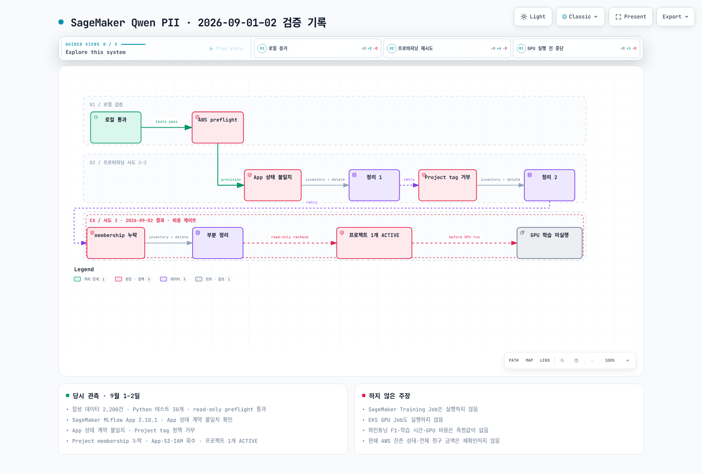

# Part 5: SageMaker Qwen PII 실제 검증 결과

> **마지막 업데이트**: 2026년 9월 2일
> **AWS 검증일**: 2026년 9월 1일
> **최종 상태**: GPU 학습 시작 전 차단

## 결론

합성 데이터, 결정론적 토큰화, 평가 코드, SageMaker/EKS 요청 계약은 로컬에서 검증했습니다. AWS에서는 quota, SageMaker MLflow App, Unified Studio project 생성 경로와 teardown을 실제로 확인했습니다.

그러나 세 번째 provisioning 시도에서 project membership이 누락됐고, 호출 역할은 생성된 프로젝트를 삭제할 수 없었습니다. 추가 자원 생성을 중단했기 때문에 **SageMaker Training Job과 EKS GPU Job은 모두 미실행**입니다.

## 확인된 사실

| 항목 | 결과 |
|---|---|
| 기준 모델 | `Qwen/Qwen3-30B-A3B-Instruct-2507` |
| 합성 레코드 | 2,200 |
| Train / Validation / Test | 1,600 / 200 / 400 |
| 한국어 / 영어 | 80% / 20% |
| Python 계약·회귀 테스트 | 30개 통과 |
| 추출 계약 | `TYPE<TAB>ORIGINAL` |
| 관찰된 SageMaker MLflow App 버전 | `3.10.1` |
| SageMaker training executed | `false` |
| EKS training executed | `false` |
| 2026년 9월 2일 잔존 project | 1개, `ACTIVE` |

## 실제 실행 흔적

아래 그림은 목표 아키텍처가 아니라 **실제로 수행한 로컬 검증, AWS preflight, 세 번의 provisioning 시도, 정리와 중단 지점**을 나타냅니다. 흐름은 GPU 학습 전에 종료됩니다.

[🔍 인터랙티브 검증 워크플로 보기](https://www.atomai.click/kubernetes-docs/archmaps/ko-ai-ml-sagemaker-ai-04-validation-results-0.html)

> 한국어로 작성한 노드와 카드는 그대로 표시되지만, Archify Viewer의 고정 컨트롤은 지원 언어 정책에 따라 영어로 표시됩니다.

## 세 번의 Provisioning 시도

| 시도 | 실제 결과 | GPU 학습 | 정리 결과 |
|---|---|---|---|
| 1 | MLflow App이 `Created`에 도달했지만 초기 스크립트가 존재하지 않는 App `ACTIVE` 상태를 기다림 | 시작 안 함 | App·S3·IAM 회수, 잔존 0 |
| 2 | Unified Studio domain이 custom project resource tag를 거부 | 시작 안 함 | App·S3·IAM 회수, 잔존 0 |
| 3 | project는 생성됐지만 호출 role group profile의 project membership이 없음 | 시작 안 함 | App·S3·IAM 회수, project 1개 잔존 |

## 반영한 수정

- MLflow App 준비 상태를 실제 enum인 `Created`/`Updated`로 판정
- 삭제 상태 `Deleted`를 terminal 상태로 판정
- custom project tag가 금지된 domain 지원
- project 생성 시 호출 IAM role의 group profile을 `PROJECT_OWNER`로 지정
- 존재 확인은 권한이 허용되는 `ListProjects` 결과를 사용
- Service Quotas 호출에 adaptive retry 적용
- 오류·인터럽트에서도 최신 inventory를 기록한 뒤 teardown 실행

수정은 코드와 계약 테스트에 반영됐지만, 잔존 project가 제거되기 전에는 재실행하지 않았습니다.

## 2026년 9월 2일 정리 상태

읽기 전용 재확인 결과:

| 자원 유형 | 상태 |
|---|---|
| SageMaker MLflow App | 잔존 없음 |
| 실험 S3 bucket | 잔존 없음 |
| 실험 IAM role | 잔존 없음 |
| EKS cluster / GPU instance | 생성하지 않음 |
| Unified Studio `qwen-pii-*` project | 1개 `ACTIVE` |

잔존 프로젝트는 domain owner가 삭제하거나, 현재 실행 role의 group profile을 project owner membership으로 추가한 후 삭제해야 합니다.

## 측정하지 않은 항목

| 항목 | 결과를 게시하지 않는 이유 |
|---|---|
| fine-tuned entity F1 | adapter 학습과 tuned evaluation 미실행 |
| baseline 대비 개선폭 | 동일 GPU 환경의 baseline/tuned 결과가 없음 |
| 학습 시간 | SageMaker/EKS 학습 Job 미실행 |
| peak GPU memory | GPU process 미실행 |
| GPU 비용 | GPU Job이 시작되지 않아 비교 가능한 측정값이 없음 |

설정 파일에 최대 runtime이나 step 수가 있다고 해서 실제 결과로 간주하지 않습니다.

## 재실행 게이트

다음 조건을 **순서대로 모두** 충족해야 합니다.

1. `qwen-pii-*` Unified Studio project가 하나도 남지 않았는지 확인
2. read-only preflight 통과
3. project 생성 요청에 실행 role group profile의 owner membership 포함
4. SageMaker smoke run 완료
5. CloudWatch와 MLflow에서 raw PII logging scan 통과
6. 그 뒤에만 full SageMaker Job 실행

EKS 비교도 SageMaker smoke 결과와 데이터 해시를 먼저 고정한 뒤 별도 smoke/full 순서로 실행합니다.

## 증거 위치

- 구조화 결과: `examples/ai-ml/qwen-pii-finetuning/results/provisioning-validation.json`
- 상세 검증 기록: `docs/superpowers/reports/2026-09-01-sagemaker-qwen-pii-validation.md`
- 실행 패키지: `examples/ai-ml/qwen-pii-finetuning/`

이전: [Part 4 — Unified Studio 거버넌스](../../data-on-eks/sagemaker-unified-studio/01-domains-projects-governance.md)

처음으로: [SageMaker Qwen PII 가이드북](README.md)
