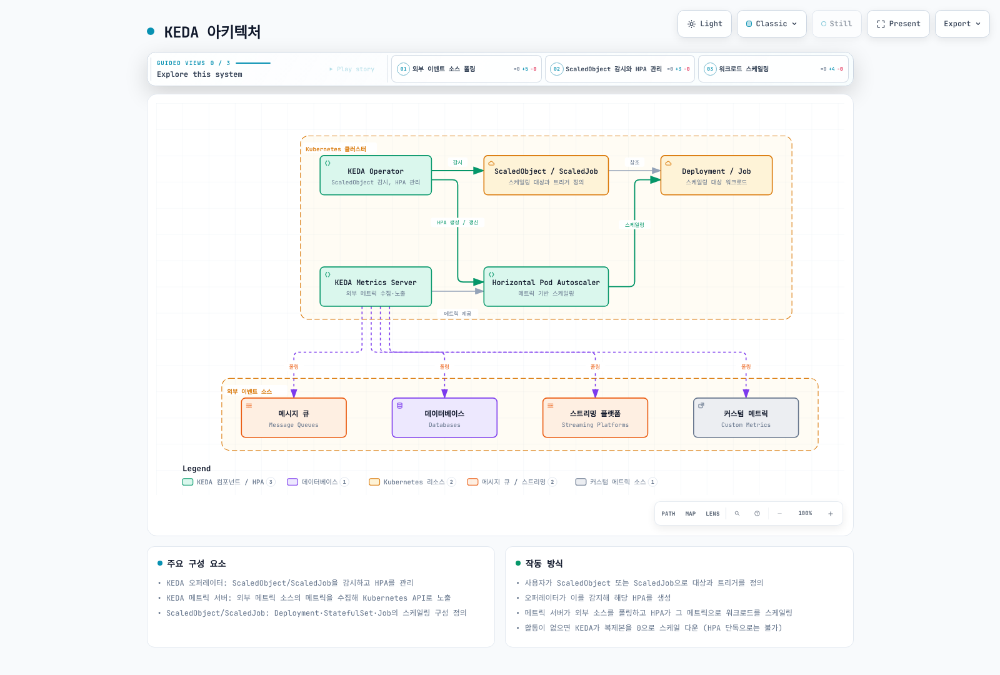

# KEDA (Kubernetes Event-driven Autoscaling)

> **예제 버전**: KEDA/Helm 차트 2.20.2; Kubernetes 테스트 호환 범위는 아래 참고.
> **마지막 업데이트**: 2026년 9월 11일

## 목차
- [소개](#소개)
- [아키텍처](#아키텍처)
- [설치 및 구성](#설치-및-구성)
- [스케일러](#스케일러)
- [커스텀 메트릭 스케일링](#커스텀-메트릭-스케일링)
- [Twitter 메트릭 스케일링](#twitter-메트릭-스케일링)
- [Google Calendar 스케일링](#google-calendar-스케일링)
- [Istio 메트릭 스케일링](#istio-메트릭-스케일링)
- [Cron 기반 스케일링](#cron-기반-스케일링)
- [Amazon EKS와의 통합](#amazon-eks와의-통합)
- [모범 사례](#모범-사례)
- [문제 해결](#문제-해결)
- [결론](#결론)

## 소개

KEDA(Kubernetes Event-driven Autoscaling)는 Kubernetes 애플리케이션을 이벤트 기반으로 자동 확장할 수 있게 해주는 오픈 소스 프로젝트입니다. KEDA는 Kubernetes의 기본 Horizontal Pod Autoscaler(HPA)를 확장하여 CPU 및 메모리 사용량 외에도 다양한 이벤트 소스와 메트릭을 기반으로 워크로드를 확장할 수 있게 해줍니다.

### KEDA의 주요 이점

1. **이벤트 기반 스케일링**: 다양한 이벤트 소스(메시지 큐, 데이터베이스, 스트림 등)에 기반한 스케일링
2. **제로 스케일링**: 지원하는 이벤트 트리거로 유휴 워크로드를 활성화하며 최소 복제본·활성화 임계값·쿨다운을 구성합니다.
3. **다양한 스케일러 지원**: 50개 이상의 내장 스케일러와 커스텀 스케일러 지원
4. **Kubernetes 네이티브**: 기존 Kubernetes HPA와 통합
5. **클라우드 중립적**: 필요한 API·네트워크·인증 구성을 갖춘 호환 Kubernetes 배포판에서 실행합니다.
6. **배포 모델**: 기본 설치는 오퍼레이터·메트릭 API 서버·어드미션 웹훅으로 구성됩니다.

### 기존 스케일링 방식과의 비교

| 기능 | KEDA | Kubernetes HPA | Cloud Provider Autoscaler |
|------|------|----------------|---------------------------|
| 메트릭 소스 | 내장 이벤트 스케일러·외부 스케일러 | 적절한 어댑터를 통한 리소스·커스텀·외부 메트릭 | 제품별 상이 |
| 제로 스케일링 | 지원 트리거와 설정 필요 | 버전·기능에 따라 다름; Kubernetes 1.37 beta는 object/external 메트릭으로 지원 | 제품별 상이 |
| 이벤트 기반 | 이벤트 소스 통합과 활성화 | 커스텀·외부 메트릭 어댑터로 가능 | 제품별 상이 |
| 클라우드 중립적 | ✅ | ✅ | ❌ |
| 배포 복잡성 | 오퍼레이터·메트릭 서버·웹훅·인증 구성 | 내장 컨트롤러, 필요 시 메트릭 어댑터 추가 | 제품별 상이 |
| 커스텀 메트릭 | 스케일러 통합 또는 HTTP/gRPC 생산자 | 적절한 메트릭 어댑터 필요 | 제품별 상이 |

## 아키텍처

KEDA는 Kubernetes 오퍼레이터 패턴을 기반으로 하며, 외부 메트릭 소스를 모니터링하고 Kubernetes HPA를 자동으로 관리합니다.



[🔍 인터랙티브 다이어그램 보기](https://www.atomai.click/kubernetes-docs/archmaps/ko-autoscaling-01-keda-0.html)


### 주요 구성 요소

1. **KEDA 오퍼레이터**: ScaledObject와 HPA를 조정하고 제로 활성화·비활성화를 처리하며 ScaledJob의 Job을 생성합니다.
2. **KEDA 메트릭 서버**: 오퍼레이터의 메트릭 서비스에서 스케일러 결과를 받아 Kubernetes 집계 API로 외부 메트릭을 제공합니다.
3. **ScaledObject**: 배포(Deployment), 상태 저장 세트(StatefulSet) 등의 스케일링 구성을 정의
4. **ScaledJob**: Kubernetes Job의 스케일링 구성을 정의
5. **트리거/스케일러**: 이벤트 소스의 메트릭과 활성화를 평가합니다. 어드미션 웹훅은 지원하는 리소스 구성을 검증합니다.

### 작동 방식

1. ScaledObject가 같은 네임스페이스의 호환 스케일 대상을 참조하면 KEDA가 HPA 하나를 관리합니다. 대상별 스케일링 소유자는 하나여야 합니다.
2. 오퍼레이터는 워크로드가 0개일 때도 `pollingInterval`에 따라 트리거 활성화를 조회합니다.
3. 복제본이 0보다 크면 HPA가 메트릭 API 서버와 오퍼레이터를 통해 외부 메트릭을 조회합니다. HPA 동기화와 메트릭 캐시 설정도 조회 빈도에 영향을 줍니다.
4. HPA는 0보다 큰 복제본 수를 조절하고 KEDA는 활성화와 설정된 제로 축소 쿨다운을 담당합니다. `cooldownPeriod`는 N→1 축소의 HPA 안정화 설정을 대체하지 않습니다.
5. ScaledJob은 별도 경로로 이벤트와 스케일링 전략에 따라 batch Job을 생성하며 해당 Job의 HPA를 만들지 않습니다.

## 설치 및 구성

예제는 대안이며 한꺼번에 적용할 매니페스트 묶음이 아닙니다. 참조하는 워크로드·Service·Secret·이미지를 준비하고 계정·큐·URL·이미지 자리표시자를 교체하세요. 같은 대상에 여러 ScaledObject/HPA를 붙이지 마세요. 자동 확장이 복제본을 관리하면 GitOps/apply의 `spec.replicas` 소유권도 조정해야 합니다. 이 레시피는 운영 환경에 배포하거나 실측하지 않았습니다.

Kubernetes 1.37은 object/external 메트릭의 HPA 제로 스케일링을 beta로 도입했고 `HPAScaleToZero`가 기본 활성화됩니다. CPU·메모리만으로는 0에서 활성화할 수 없습니다. 이것이 KEDA 2.20의 오퍼레이터/HPA 역할을 바꾸거나 Kubernetes 1.37 호환성을 입증하지는 않습니다.

### 사전 요구 사항

- 공급자와 선택한 KEDA 릴리스가 지원하는 Kubernetes를 선택하세요. KEDA 2.20 설치 문서의 최소 버전은 1.30이지만 공개된 **테스트 호환 범위는 1.33–1.35**입니다. 이 표가 1.36·1.37 호환성을 입증하지는 않으므로 별도 검증이 필요합니다.
- kubectl 설정
- Helm (선택 사항)

### 설치 방법

#### 1. Helm을 사용한 설치

```bash
helm repo add kedacore https://kedacore.github.io/charts
helm repo update
helm install keda kedacore/keda --version 2.20.2 --namespace keda --create-namespace
```

#### 2. YAML 매니페스트를 사용한 설치

```bash
kubectl apply --server-side -f https://github.com/kedacore/keda/releases/download/v2.20.2/keda-2.20.2.yaml
```

#### 3. 설치 확인

```bash
kubectl get deployments,pods -n keda
kubectl wait --for=condition=Available deployment --all -n keda --timeout=180s
kubectl get apiservice v1beta1.external.metrics.k8s.io
```

출력 형식 예시(차트 설정에 따라 이름·개수가 달라지며 실제 실행 결과가 아닙니다):
```
NAME                                      READY   STATUS    RESTARTS   AGE
keda-operator-<hash>-<id>                  1/1     Running   0          1m
keda-operator-metrics-apiserver-<hash>-<id> 1/1     Running   0          1m
keda-admission-webhooks-<hash>-<id>        1/1     Running   0          1m
```

### 기본 구성

뒤의 IRSA 값은 같은 고정 버전 Helm 값에 병합한 뒤 업그레이드에 적용해야 합니다. 결과 ServiceAccount 주석을 확인하고 인증을 변경하면 정상 롤아웃 절차로 오퍼레이터 Pod를 재생성하세요.

다음 값은 Helm 차트 2.20.2에 맞습니다. 오퍼레이터 2개는 리더 선출 대기 복제본을 제공하며 동시에 두 조정자가 활성화되는 것은 아닙니다. 메트릭 서버 이중화도 API 집계 라우팅에 영향을 받으며 전체 경로의 완전한 고가용성을 보장하지 않습니다. 리소스 값은 출발점이며 실측 사이징 결과가 아닙니다.

#### Helm 값 파일을 사용한 사용자 정의 구성

```yaml
operator:
  replicaCount: 2
metricsServer:
  replicaCount: 1
resources:
  operator:
    limits:
      cpu: '1'
      memory: 1000Mi
    requests:
      cpu: 100m
      memory: 100Mi
  metricServer:
    limits:
      cpu: '1'
      memory: 1000Mi
    requests:
      cpu: 100m
      memory: 100Mi
  webhooks:
    limits:
      cpu: '1'
      memory: 1000Mi
    requests:
      cpu: 100m
      memory: 100Mi
logging:
  operator:
    level: info
  metricServer:
    level: 0
```

```bash
helm upgrade --install keda kedacore/keda --version 2.20.2 --namespace keda --create-namespace -f values.yaml
```

## 스케일러

KEDA는 다양한 이벤트 소스에 대한 스케일러를 제공합니다. 각 스케일러는 특정 이벤트 소스에서 메트릭을 수집하고 이를 기반으로 워크로드를 스케일링합니다.

### 주요 스케일러

KEDA는 50개 이상의 스케일러를 지원하며, 주요 스케일러는 다음과 같습니다:

1. **메시지 큐**: 
   - Apache Kafka
   - RabbitMQ
   - AWS SQS
   - Azure Service Bus
   - Google Cloud Pub/Sub

2. **데이터베이스**: 
   - MySQL
   - PostgreSQL
   - MongoDB
   - Redis

3. **스트리밍 플랫폼**: 
   - Apache Kafka
   - AWS Kinesis
   - Azure Event Hubs

4. **클라우드 서비스**: 
   - AWS CloudWatch
   - Azure Monitor
   - Google Cloud Monitoring

5. **기타**: 
   - Prometheus
   - Influxdb
   - Cron
   - CPU/Memory

### 기본 ScaledObject 예시

대상 네임스페이스의 `rabbitmq-credentials` Secret에 완전하고 권한이 있는 AMQP/AMQPS 연결 URI를 `host` 키로 준비하세요. 참조한 `rabbitmq-consumer` Deployment는 해당 큐를 소비하도록 미리 설정되어 있어야 합니다. 격리되지 않은 망에서는 신뢰를 검증하는 TLS를 사용하세요. 예제가 브로커나 자격 증명을 생성하지는 않습니다.

```yaml
apiVersion: keda.sh/v1alpha1
kind: TriggerAuthentication
metadata:
  name: rabbitmq-auth
  namespace: default
spec:
  secretTargetRef:
  - parameter: host
    name: rabbitmq-credentials
    key: host
---
apiVersion: keda.sh/v1alpha1
kind: ScaledObject
metadata:
  name: rabbitmq-scaledobject
  namespace: default
spec:
  scaleTargetRef:
    apiVersion: apps/v1
    kind: Deployment
    name: rabbitmq-consumer
  pollingInterval: 15
  cooldownPeriod: 30
  minReplicaCount: 0
  maxReplicaCount: 30
  triggers:
  - type: rabbitmq
    metadata:
      protocol: amqp
      queueName: hello
      mode: QueueLength
      value: '5'
    authenticationRef:
      name: rabbitmq-auth
```

### 기본 ScaledJob 예시

위의 `rabbitmq-auth`·`rabbitmq-credentials`를 재사용합니다. 한정된 작업을 소비·승인하고 종료하는 실제 worker 이미지를 준비해야 Job이 완료됩니다. 재시도는 처리를 반복할 수 있으므로 애플리케이션 멱등성과 적절한 승인·가시성 시간 제한을 설계하세요. `jobTargetRef`는 JobSpec이며 Job이나 PodTemplate을 한 번 더 중첩하지 않습니다.

```yaml
apiVersion: keda.sh/v1alpha1
kind: ScaledJob
metadata:
  name: rabbitmq-scaledjob
  namespace: default
spec:
  jobTargetRef:
    template:
      spec:
        containers:
        - name: rabbitmq-worker
          image: rabbitmq-worker:latest
          imagePullPolicy: Always
          env:
          - name: RABBITMQ_HOST
            valueFrom:
              secretKeyRef:
                name: rabbitmq-credentials
                key: host
        restartPolicy: Never
    backoffLimit: 4
  pollingInterval: 15
  maxReplicaCount: 30
  successfulJobsHistoryLimit: 5
  failedJobsHistoryLimit: 5
  triggers:
  - type: rabbitmq
    metadata:
      protocol: amqp
      queueName: hello
      mode: QueueLength
      value: '5'
    authenticationRef:
      name: rabbitmq-auth
```
## 커스텀 메트릭 스케일링

KEDA는 다양한 내장 스케일러 외에도 커스텀 메트릭을 기반으로 스케일링할 수 있는 유연성을 제공합니다. 이를 통해 비즈니스 요구사항에 맞는 고유한 스케일링 로직을 구현할 수 있습니다.

### 외부 메트릭 API 사용

카운터 예제는 `rate(...[2m])`를 사용하므로 목표 단위는 누적 건수가 아닌 복제본당 초당 이벤트 수입니다. Prometheus 질의는 숫자 결과 하나를 반환해야 합니다. `ignoreNullValues: false`는 누락된 시계열을 오류로 드러냅니다. 빈 결과가 0인지 수집 장애인지 의도적으로 정하세요.

Prometheus와 같은 외부 메트릭 소스를 사용하여 커스텀 메트릭 기반 스케일링을 구현할 수 있습니다:

```yaml
apiVersion: keda.sh/v1alpha1
kind: ScaledObject
metadata:
  name: custom-metrics-scaler
  namespace: default
spec:
  scaleTargetRef:
    apiVersion: apps/v1
    kind: Deployment
    name: my-app
  minReplicaCount: 1
  maxReplicaCount: 10
  triggers:
  - type: prometheus
    metadata:
      serverAddress: http://prometheus-server.monitoring.svc.cluster.local
      threshold: '100'
      query: sum(rate(custom_metric_total{namespace="default",pod=~"my-app-.*"}[2m]))
      ignoreNullValues: 'false'
```

### HTTP 스케일러 사용

숫자 엔드포인트 데이터를 조회하는 `metrics-api` 스케일러입니다. 활성화를 위해 요청을 가로채고 버퍼링하는 별도 KEDA HTTP add-on과 다릅니다. 특히 대상이 0개일 때도 메트릭 엔드포인트는 대상과 독립적으로 사용 가능해야 합니다.

HTTP 엔드포인트에서 메트릭을 가져와 스케일링할 수 있습니다:

```yaml
apiVersion: keda.sh/v1alpha1
kind: ScaledObject
metadata:
  name: http-scaler
  namespace: default
spec:
  scaleTargetRef:
    apiVersion: apps/v1
    kind: Deployment
    name: my-app
  minReplicaCount: 1
  maxReplicaCount: 10
  triggers:
  - type: metrics-api
    metadata:
      targetValue: '100'
      url: https://metrics.example.com/metrics
      valueLocation: value
```

### 커스텀 스케일러 개발

다음 Go 코드는 내장 `metrics-api` 스케일러용 **HTTP JSON 메트릭 생산자**입니다. Kubernetes external.metrics.k8s.io나 KEDA 외부 스케일러 프로토콜 구현이 아닙니다. KEDA의 `external`·`external-push` 서비스는 공식 gRPC 메서드 `IsActive`·`GetMetricSpec`·`GetMetrics`와 푸시 활성화용 `StreamIsActive`를 구현해야 합니다.

1. 메트릭 서버 구현:

완전한 Go 서버는 숫자 `value`와 RFC3339 `observed_at`을 가진 JSON 스냅샷 `METRICS_FILE`을 읽습니다. 별도 업무 메트릭 생산자가 파일을 원자적으로 교체해야 합니다. 누락·형식 오류·음수·2분 이상 오래된 값은 HTTP503을 반환합니다. 다음 ScaledObject 사용 전에 서버를 빌드·배포하고 Service를 구성하세요. Kubernetes 집계 API 서버 구현은 아닙니다.

```go
package main

import (
    "encoding/json"
    "errors"
    "io"
    "log"
    "net/http"
    "os"
    "time"
)

type snapshot struct {
    Value *float64 `json:"value"`
    ObservedAt time.Time `json:"observed_at"`
}

func metricsHandler(path string) http.HandlerFunc {
    return func(w http.ResponseWriter, r *http.Request) {
        if r.Method != http.MethodGet {
            w.Header().Set("Allow", "GET")
            http.Error(w, "method not allowed", http.StatusMethodNotAllowed)
            return
        }
        f, err := os.Open(path)
        if err != nil {
            http.Error(w, "metric unavailable", http.StatusServiceUnavailable)
            return
        }
        defer f.Close()
        var v snapshot
        decoder := json.NewDecoder(io.LimitReader(f, 1<<20))
        if err = decoder.Decode(&v); err == nil {
            var extra any
            if err = decoder.Decode(&extra); !errors.Is(err, io.EOF) {
                http.Error(w, "invalid snapshot", http.StatusServiceUnavailable)
                return
            }
        } else {
            http.Error(w, "invalid snapshot", http.StatusServiceUnavailable)
            return
        }
        age := time.Since(v.ObservedAt)
        if v.Value == nil || *v.Value < 0 || v.ObservedAt.IsZero() || age < -5*time.Second || age > 2*time.Minute {
            http.Error(w, "stale or invalid metric", http.StatusServiceUnavailable)
            return
        }
        w.Header().Set("Content-Type", "application/json")
        w.Header().Set("Cache-Control", "no-store")
        _ = json.NewEncoder(w).Encode(v)
    }
}

func main() {
    path := os.Getenv("METRICS_FILE")
    if path == "" { log.Fatal("METRICS_FILE is required") }
    mux := http.NewServeMux()
    mux.HandleFunc("/metrics", metricsHandler(path))
    server := &http.Server{
        Addr: ":8080", Handler: mux,
        ReadHeaderTimeout: 5 * time.Second,
        WriteTimeout: 10 * time.Second,
        IdleTimeout: 60 * time.Second,
    }
    log.Fatal(server.ListenAndServe())
}
```

2. KEDA와 통합:

```yaml
apiVersion: keda.sh/v1alpha1
kind: ScaledObject
metadata:
  name: custom-scaler
  namespace: default
spec:
  scaleTargetRef:
    apiVersion: apps/v1
    kind: Deployment
    name: my-app
  minReplicaCount: 1
  maxReplicaCount: 10
  triggers:
  - type: metrics-api
    metadata:
      targetValue: '100'
      url: http://custom-metrics-server:8080/metrics
      valueLocation: value
```

## Twitter 메트릭 스케일링

X API(이전 Twitter)의 v2 recent-counts 엔드포인트를 사용합니다. 수집 시점 30초 전까지의 5분 구간 일치 건수이며 누적값이나 순간 게시 속도가 아닙니다. 계정 접근권·질의 의미·과금·호출 한도는 실제 사용 조건을 확인해야 합니다.

### 사전 요구 사항

- recent Post counts 접근권이 있는 X 개발자 앱과 앱 bearer token. 예제만으로 API 접근권이나 비용 조건이 보장되지 않습니다.
- 메트릭을 수집하고 노출하는 서비스

### 구현 단계

1. Twitter 메트릭 수집기 서비스 구현:

독립 예제를 `app.py`로 저장하고 Flask·requests·Gunicorn을 collector 이미지에 포함하세요. 배포는 Gunicorn worker 하나와 `app:create_app()`을 사용해 WSGI에서도 수집 스레드를 시작합니다. worker·복제본을 늘리면 API 폴링도 늘어납니다. 부분 결과·호출 제한·인증 오류는 실패 후 HTTP503으로 응답하며 잘린 검색 페이지 길이를 속도로 사용하지 않습니다. 실제 API 접근 조건에 맞춰 폴링을 조정하세요.

```python
import datetime as dt
import os
import threading
import time

import requests
from flask import Flask, jsonify

TOKEN = os.environ["X_BEARER_TOKEN"]
QUERY = os.environ.get("X_QUERY", "#kubernetes")
POLL_SECONDS = 60
MAX_AGE_SECONDS = 120
METRIC_NAME = "tweet_count"


def fetch_value():
    # Five-minute window ending 30 seconds ago; not a lifetime count or live rate.
    end = dt.datetime.now(dt.timezone.utc) - dt.timedelta(seconds=30)
    start = end - dt.timedelta(minutes=5)
    response = requests.get(
        "https://api.x.com/2/tweets/counts/recent",
        headers={"Authorization": f"Bearer {TOKEN}"},
        params={"query": QUERY, "granularity": "minute",
                "start_time": start.isoformat(), "end_time": end.isoformat()},
        timeout=(3, 10),
    )
    response.raise_for_status()
    body = response.json()
    meta = body["meta"]
    # Never silently scale from a partial result or an API error payload.
    if body.get("errors") or meta.get("next_token"):
        raise ValueError("incomplete counts response")
    value = meta["total_tweet_count"]
    if type(value) is not int or value < 0:
        raise ValueError("invalid count")
    return value


def create_app():
    app = Flask(__name__)
    lock = threading.Lock()
    state = {"value": None, "updated": 0.0, "healthy": False}

    def collect():
        while True:
            try:
                value = fetch_value()
                if type(value) is not int or value < 0:
                    raise ValueError("invalid metric")
                with lock:
                    state.update(value=value, updated=time.monotonic(), healthy=True)
            except Exception as exc:
                with lock:
                    state["healthy"] = False
                app.logger.warning("Metric refresh failed: %s", type(exc).__name__)
            time.sleep(POLL_SECONDS)

    @app.get("/metrics")
    def get_metrics():
        with lock:
            current = state.copy()
        if not current["healthy"] or time.monotonic() - current["updated"] > MAX_AGE_SECONDS:
            return jsonify(error="metric unavailable or stale"), 503
        response = jsonify({METRIC_NAME: current["value"]})
        response.headers["Cache-Control"] = "no-store"
        return response

    threading.Thread(target=collect, daemon=True).start()
    return app


if __name__ == "__main__":
    # Local development only; use a WSGI server for the deployment example.
    create_app().run(host="127.0.0.1", port=8080)
```

2. 메트릭 수집기 서비스 배포:

collector 이미지를 빌드하고 고정한 뒤 배포하세요. 토큰 값을 셸 인수에 넣지 않고 기존 파일로 Secret을 생성합니다.

```bash
kubectl create secret generic twitter-api-secrets --namespace default --from-file=bearer-token=./x-bearer-token
```

실행하면 Kubernetes Secret을 생성하는 명령이며 이번 감사에서는 실행하지 않았습니다. 원본 파일은 버전 관리에서 제외하세요.

```yaml
apiVersion: apps/v1
kind: Deployment
metadata:
  name: twitter-metrics-collector
  namespace: default
spec:
  replicas: 1
  selector:
    matchLabels:
      app: twitter-metrics-collector
  template:
    metadata:
      labels:
        app: twitter-metrics-collector
    spec:
      containers:
      - name: collector
        image: twitter-metrics-collector:latest
        ports:
        - containerPort: 8080
        env:
        - name: X_BEARER_TOKEN
          valueFrom:
            secretKeyRef:
              name: twitter-api-secrets
              key: bearer-token
        command:
        - gunicorn
        args:
        - --bind
        - 0.0.0.0:8080
        - --workers
        - '1'
        - --threads
        - '4'
        - app:create_app()
        resources:
          requests:
            cpu: 100m
            memory: 128Mi
          limits:
            memory: 256Mi
        readinessProbe:
          httpGet:
            path: /metrics
            port: 8080
          periodSeconds: 10
          failureThreshold: 3
      automountServiceAccountToken: false
---
apiVersion: v1
kind: Service
metadata:
  name: twitter-metrics-collector
  namespace: default
spec:
  selector:
    app: twitter-metrics-collector
  ports:
  - port: 80
    targetPort: 8080
```

3. KEDA ScaledObject 구성:

```yaml
apiVersion: keda.sh/v1alpha1
kind: ScaledObject
metadata:
  name: twitter-scaler
  namespace: default
spec:
  scaleTargetRef:
    apiVersion: apps/v1
    kind: Deployment
    name: twitter-processor
  minReplicaCount: 1
  maxReplicaCount: 20
  pollingInterval: 15
  cooldownPeriod: 30
  triggers:
  - type: metrics-api
    metadata:
      targetValue: "10"
      url: "http://twitter-metrics-collector/metrics"
      valueLocation: "tweet_count"
```

기본 AverageValue에서는 건수/목표 비율이 설정 범위 내 복제본 수를 제안하며 처리량을 직접 모델링하지는 않습니다. collector는 독립적으로 1개를 유지하고 사용 불가 시 503을 반환합니다. 상위 API 장애만으로 재시작하는 liveness probe는 두지 않았습니다. 운영 사용에는 인증·한도·수명주기·관측성을 별도로 검증해야 합니다.

## Google Calendar 스케일링

Google Calendar에서 **다음 1시간과 겹치는** 이벤트 인스턴스를 계산합니다. 이미 진행 중인 이벤트도 포함합니다. `timeMin`은 이벤트 종료 시각, `timeMax`는 시작 시각을 필터링합니다. 모든 페이지를 합산하며 부분·실패·오래된 수집값은 거짓 0 대신 메트릭 사용 불가로 응답합니다.

### 사전 요구 사항

- Calendar API를 활성화하고 특정 공유 캘린더에 읽기 권한이 있는 서비스 계정을 사용하세요. 실제 캘린더 ID가 필요하며 `primary`는 사용자 캘린더를 서비스 계정에 공유하는 작업을 대체하지 않습니다.
- 메트릭을 수집하고 노출하는 서비스

### 구현 단계

1. Google Calendar 메트릭 수집기 서비스 구현:

별도 이미지의 `app.py`로 저장하고 Flask·requests·google-auth·Gunicorn을 포함하세요. 수집 스레드 하나가 모든 페이지를 순회하고 반복 토큰이나 안전 페이지 한도에 도달하면 실패로 처리합니다. 값은 참가자 수나 필요한 복제본 수가 아닌 겹치는 이벤트 인스턴스 수입니다. 서비스 계정에 캘린더 접근권을 부여해야 하며 OAuth scope만으로 그 권한이 생기지는 않습니다.

```python
import datetime as dt
import os
import threading
import time
from urllib.parse import quote

from flask import Flask, jsonify
from google.auth.transport.requests import AuthorizedSession
from google.oauth2 import service_account

CALENDAR_ID = os.environ["CALENDAR_ID"]
SERVICE_ACCOUNT_FILE = "/etc/secrets/service-account.json"
POLL_SECONDS = 300
MAX_AGE_SECONDS = 360
METRIC_NAME = "upcoming_events"


def fetch_value():
    credentials = service_account.Credentials.from_service_account_file(
        SERVICE_ACCOUNT_FILE,
        scopes=["https://www.googleapis.com/auth/calendar.readonly"],
    )
    now = dt.datetime.now(dt.timezone.utc)
    params = {"timeMin": now.isoformat(),
              "timeMax": (now + dt.timedelta(hours=1)).isoformat(),
              "singleEvents": "true", "showDeleted": "false",
              "orderBy": "startTime", "maxResults": 2500}
    url = f"https://www.googleapis.com/calendar/v3/calendars/{quote(CALENDAR_ID, safe='')}/events"
    total = 0
    seen_tokens = set()
    with AuthorizedSession(credentials) as session:
        for _ in range(100):
            response = session.get(url, params=params, timeout=(3, 10))
            response.raise_for_status()
            body = response.json()
            if body.get("error") or body.get("kind") != "calendar#events" or not isinstance(body.get("items", []), list):
                raise ValueError("invalid events response")
            total += len(body.get("items", []))
            token = body.get("nextPageToken")
            if not token:
                return total
            if token in seen_tokens:
                raise ValueError("repeated page token")
            seen_tokens.add(token)
            params["pageToken"] = token
    raise ValueError("pagination limit exceeded; result is incomplete")


def create_app():
    app = Flask(__name__)
    lock = threading.Lock()
    state = {"value": None, "updated": 0.0, "healthy": False}

    def collect():
        while True:
            try:
                value = fetch_value()
                if type(value) is not int or value < 0:
                    raise ValueError("invalid metric")
                with lock:
                    state.update(value=value, updated=time.monotonic(), healthy=True)
            except Exception as exc:
                with lock:
                    state["healthy"] = False
                app.logger.warning("Metric refresh failed: %s", type(exc).__name__)
            time.sleep(POLL_SECONDS)

    @app.get("/metrics")
    def get_metrics():
        with lock:
            current = state.copy()
        if not current["healthy"] or time.monotonic() - current["updated"] > MAX_AGE_SECONDS:
            return jsonify(error="metric unavailable or stale"), 503
        response = jsonify({METRIC_NAME: current["value"]})
        response.headers["Cache-Control"] = "no-store"
        return response

    threading.Thread(target=collect, daemon=True).start()
    return app


if __name__ == "__main__":
    # Local development only; use a WSGI server for the deployment example.
    create_app().run(host="127.0.0.1", port=8080)
```

2. 메트릭 수집기 서비스 배포:

실제 공유 캘린더 ID와 기존 서비스 계정 JSON 파일을 사용하세요. 다음은 실행 시 Secret을 생성하는 명령이며 검토 중 실행하지 않았습니다.

```bash
kubectl create secret generic google-calendar-secrets --namespace default --from-file=service-account.json=./service-account.json
```

```yaml
apiVersion: apps/v1
kind: Deployment
metadata:
  name: calendar-metrics-collector
  namespace: default
spec:
  replicas: 1
  selector:
    matchLabels:
      app: calendar-metrics-collector
  template:
    metadata:
      labels:
        app: calendar-metrics-collector
    spec:
      containers:
      - name: collector
        image: calendar-metrics-collector:latest
        ports:
        - containerPort: 8080
        env:
        - name: CALENDAR_ID
          value: REPLACE_WITH_SHARED_CALENDAR_ID
        volumeMounts:
        - name: google-calendar-credentials
          mountPath: /etc/secrets
          readOnly: true
        command:
        - gunicorn
        args:
        - --bind
        - 0.0.0.0:8080
        - --workers
        - '1'
        - --threads
        - '4'
        - app:create_app()
        resources:
          requests:
            cpu: 100m
            memory: 128Mi
          limits:
            memory: 256Mi
        readinessProbe:
          httpGet:
            path: /metrics
            port: 8080
          periodSeconds: 10
          failureThreshold: 3
      volumes:
      - name: google-calendar-credentials
        secret:
          secretName: google-calendar-secrets
      automountServiceAccountToken: false
---
apiVersion: v1
kind: Service
metadata:
  name: calendar-metrics-collector
  namespace: default
spec:
  selector:
    app: calendar-metrics-collector
  ports:
  - port: 80
    targetPort: 8080
```

3. KEDA ScaledObject 구성:

```yaml
apiVersion: keda.sh/v1alpha1
kind: ScaledObject
metadata:
  name: calendar-scaler
  namespace: default
spec:
  scaleTargetRef:
    apiVersion: apps/v1
    kind: Deployment
    name: calendar-processor
  minReplicaCount: 1
  maxReplicaCount: 10
  pollingInterval: 15
  cooldownPeriod: 30
  triggers:
  - type: metrics-api
    metadata:
      targetValue: "1"
      url: "http://calendar-metrics-collector/metrics"
      valueLocation: "upcoming_events"
```

기본 AverageValue에서는 건수/목표 비율이 설정 범위 내 복제본 수를 제안하며 처리량을 직접 모델링하지는 않습니다. collector는 독립적으로 1개를 유지하고 사용 불가 시 503을 반환합니다. 상위 API 장애만으로 재시작하는 liveness probe는 두지 않았습니다. 운영 사용에는 인증·한도·수명주기·관측성을 별도로 검증해야 합니다.
## Istio 메트릭 스케일링

Istio 서비스 메시에서 수집된 메트릭을 기반으로 애플리케이션을 스케일링하는 예제입니다. 특히 초당 요청 수(requests per second, RPS)를 기반으로 스케일링하는 방법을 살펴보겠습니다.

### 사전 요구 사항

- Istio 서비스 메시 설치
- Prometheus 설치 및 Istio와 통합

### 구현 단계

1. 기존 Istio 사이드카 설치와 주입 정책을 확인합니다. 예제는 메시 내부 라우팅이므로 존재하지 않는 ingress Gateway 리소스를 가정하지 않습니다.

```bash
istioctl proxy-status
kubectl get namespace default --show-labels
kubectl get pods -n default
```

2. 샘플 애플리케이션 배포:

```yaml
apiVersion: apps/v1
kind: Deployment
metadata:
  name: sample-app
  namespace: default
spec:
  replicas: 1
  selector:
    matchLabels:
      app: sample-app
  template:
    metadata:
      labels:
        app: sample-app
    spec:
      containers:
      - name: sample-app
        image: nginx:1.30.4
        ports:
        - containerPort: 80
---
apiVersion: v1
kind: Service
metadata:
  name: sample-app
  namespace: default
spec:
  selector:
    app: sample-app
  ports:
  - port: 80
    targetPort: 80
---
apiVersion: networking.istio.io/v1
kind: VirtualService
metadata:
  name: sample-app
  namespace: default
spec:
  hosts:
  - sample-app.default.svc.cluster.local
  gateways:
  - mesh
  http:
  - route:
    - destination:
        host: sample-app
        port:
          number: 80
```

3. KEDA ScaledObject 구성:

```yaml
apiVersion: keda.sh/v1alpha1
kind: ScaledObject
metadata:
  name: istio-scaler
  namespace: default
spec:
  scaleTargetRef:
    apiVersion: apps/v1
    kind: Deployment
    name: sample-app
  minReplicaCount: 1
  maxReplicaCount: 10
  pollingInterval: 15
  cooldownPeriod: 30
  triggers:
  - type: prometheus
    metadata:
      serverAddress: http://prometheus.istio-system:9090
      threshold: '10'
      query: sum(rate(istio_requests_total{reporter="destination",destination_service="sample-app.default.svc.cluster.local"}[2m]))
      ignoreNullValues: 'false'
```

기본 `AverageValue` 메트릭에서 전체 100 RPS, 복제본당 목표 10 RPS는 HPA 허용 오차·안정화·한도 적용 전 약 10개 복제본을 제안합니다. 질의는 destination 보고만 선택해 송신·수신 프록시의 중복 집계를 피합니다. Prometheus가 실제 해당 트래픽을 수집해야 합니다.

### 고급 구성

다음 예제의 **제한된 `request_path` 사용자 정의 텔레메트리 라벨**은 Istio 기본 메트릭 차원이 아닙니다. 라벨을 먼저 설정·검증하고 임의 URL로 카디널리티를 늘리지 마세요. 준비되지 않았다면 앞의 기본 질의를 사용합니다. 같은 대상의 대안 ScaledObject이며 추가 소유자로 함께 적용하지 않습니다.

```yaml
apiVersion: keda.sh/v1alpha1
kind: ScaledObject
metadata:
  name: istio-path-scaler
  namespace: default
spec:
  scaleTargetRef:
    apiVersion: apps/v1
    kind: Deployment
    name: sample-app
  minReplicaCount: 1
  maxReplicaCount: 10
  pollingInterval: 15
  cooldownPeriod: 30
  triggers:
  - type: prometheus
    metadata:
      serverAddress: http://prometheus.istio-system:9090
      threshold: '5'
      query: sum(rate(istio_requests_total{reporter="destination",destination_service="sample-app.default.svc.cluster.local",request_path="/api/v1/products"}[2m]))
      ignoreNullValues: 'false'
```

오류 비율·지연은 스케일링보다 알림에 적합한 경우가 많습니다. 다음 선택적 예시는 서비스 전체 비율에 `metricType: Value`를 사용하고 0 분모를 방어하며 확장 속도를 제한합니다. 복제본 추가가 진단된 과부하를 줄인다는 가정이 필요합니다. 하위 시스템 오류나 적은 표본의 잡음은 오히려 해로운 확장을 유발할 수 있으며 운영 효과를 실측하지 않았습니다.

```yaml
apiVersion: keda.sh/v1alpha1
kind: ScaledObject
metadata:
  name: istio-error-scaler
  namespace: default
spec:
  scaleTargetRef:
    apiVersion: apps/v1
    kind: Deployment
    name: sample-app
  minReplicaCount: 1
  maxReplicaCount: 10
  pollingInterval: 15
  cooldownPeriod: 30
  triggers:
  - type: prometheus
    metadata:
      serverAddress: http://prometheus.istio-system:9090
      threshold: '0.05'
      query: (sum(rate(istio_requests_total{reporter="destination",destination_service="sample-app.default.svc.cluster.local",response_code=~"5.*"}[2m]))
        or vector(0)) / clamp_min(sum(rate(istio_requests_total{reporter="destination",destination_service="sample-app.default.svc.cluster.local"}[2m])),
        0.001)
      ignoreNullValues: 'false'
    metricType: Value
  advanced:
    horizontalPodAutoscalerConfig:
      behavior:
        scaleUp:
          policies:
          - type: Pods
            value: 1
            periodSeconds: 60
        scaleDown:
          stabilizationWindowSeconds: 300
```

## Cron 기반 스케일링

KEDA는 Cron 표현식을 사용하여 시간 기반 스케일링을 지원합니다. 이를 통해 예측 가능한 트래픽 패턴이나 일정에 따라 애플리케이션을 사전에 스케일링할 수 있습니다.

### 기본 Cron 스케일러

```yaml
apiVersion: keda.sh/v1alpha1
kind: ScaledObject
metadata:
  name: cron-scaler
  namespace: default
spec:
  scaleTargetRef:
    apiVersion: apps/v1
    kind: Deployment
    name: sample-app
  minReplicaCount: 0
  maxReplicaCount: 10
  pollingInterval: 15
  cooldownPeriod: 30
  triggers:
  - type: cron
    metadata:
      timezone: Asia/Seoul
      start: 30 * * * *
      end: 45 * * * *
      desiredReplicas: "5"
```

매시간 30–45분 사이에는 Cron 트리거가 최소 목표 5개를 제안합니다. 구간 밖에서는 비활성화되고 0으로 줄어들기까지 폴링·설정된 쿨다운(여기서는 30초)·컨트롤러 실행 지연이 필요합니다. 정확히 45분에 축소가 완료된다고 보장하지 않습니다.

### 업무 시간과 비업무 시간

`minReplicaCount: 2`를 비업무 시간 기준으로 두고 평일 업무 시간에 5개를 요청하는 Cron 하나를 사용합니다. 야간·주말 구간 중첩을 피할 수 있습니다. 업무 종료 후 감소는 HPA 안정화 설정으로 지연될 수 있습니다.

```yaml
apiVersion: keda.sh/v1alpha1
kind: ScaledObject
metadata:
  name: multi-cron-scaler
  namespace: default
spec:
  scaleTargetRef:
    apiVersion: apps/v1
    kind: Deployment
    name: sample-app
  minReplicaCount: 2
  maxReplicaCount: 10
  pollingInterval: 15
  cooldownPeriod: 30
  triggers:
  - type: cron
    metadata:
      timezone: Asia/Seoul
      start: 0 9 * * 1-5
      end: 0 18 * * 1-5
      desiredReplicas: '5'
```

### Cron과 다른 스케일러 결합

Cron 스케일러를 다른 스케일러와 결합하여 기본 스케일링 동작을 설정하고 실제 부하에 따라 추가로 스케일링할 수 있습니다:

```yaml
apiVersion: keda.sh/v1alpha1
kind: ScaledObject
metadata:
  name: combined-scaler
  namespace: default
spec:
  scaleTargetRef:
    apiVersion: apps/v1
    kind: Deployment
    name: sample-app
  minReplicaCount: 1
  maxReplicaCount: 20
  pollingInterval: 15
  cooldownPeriod: 30
  triggers:
  - type: cron
    metadata:
      timezone: Asia/Seoul
      start: 0 9 * * 1-5
      end: 0 18 * * 1-5
      desiredReplicas: '5'
  - type: prometheus
    metadata:
      serverAddress: http://prometheus.monitoring.svc.cluster.local:9090
      threshold: '10'
      query: sum(rate(http_requests_total{app="sample-app"}[1m]))
      ignoreNullValues: 'false'
```

## Amazon EKS와의 통합

KEDA는 Kubernetes 호환성·오퍼레이터 인증·권한·통신 경로를 구성하면 AWS 메트릭으로 EKS 워크로드를 확장할 수 있습니다. KEDA 자체가 컴퓨팅 용량을 추가하지는 않으므로 적절한 노드·Fargate 용량 설계와 함께 사용하세요.

### EKS에 KEDA 설치

```bash
helm status keda -n keda
kubectl get deployment -n keda
```

### AWS 서비스 기반 스케일링

#### SQS 대기열 기반 스케일링

```yaml
apiVersion: keda.sh/v1alpha1
kind: TriggerAuthentication
metadata:
  name: aws-credentials
  namespace: default
spec:
  podIdentity:
    provider: aws
    identityOwner: keda
---
apiVersion: keda.sh/v1alpha1
kind: ScaledObject
metadata:
  name: aws-sqs-scaler
  namespace: default
spec:
  scaleTargetRef:
    apiVersion: apps/v1
    kind: Deployment
    name: sqs-consumer
  minReplicaCount: 0
  maxReplicaCount: 10
  pollingInterval: 15
  cooldownPeriod: 30
  triggers:
  - type: aws-sqs-queue
    metadata:
      queueURL: https://sqs.us-west-2.amazonaws.com/123456789012/my-queue
      queueLength: '5'
      awsRegion: us-west-2
    authenticationRef:
      name: aws-credentials
```

#### CloudWatch 메트릭 기반 스케일링

```yaml
apiVersion: keda.sh/v1alpha1
kind: TriggerAuthentication
metadata:
  name: aws-credentials
  namespace: default
spec:
  podIdentity:
    provider: aws
    identityOwner: keda
---
apiVersion: keda.sh/v1alpha1
kind: ScaledObject
metadata:
  name: aws-cloudwatch-scaler
  namespace: default
spec:
  scaleTargetRef:
    apiVersion: apps/v1
    kind: Deployment
    name: cloudwatch-app
  minReplicaCount: 1
  maxReplicaCount: 10
  pollingInterval: 15
  cooldownPeriod: 30
  triggers:
  - type: aws-cloudwatch
    metadata:
      namespace: AWS/SQS
      dimensionName: QueueName
      dimensionValue: my-queue
      metricName: ApproximateNumberOfMessagesVisible
      targetMetricValue: '5'
      minMetricValue: '0'
      awsRegion: us-west-2
      metricStat: Average
      metricStatPeriod: '60'
      metricCollectionTime: '300'
    authenticationRef:
      name: aws-credentials
```

### IRSA(IAM Roles for Service Accounts) 통합

이 예제는 `system:serviceaccount:keda:keda-operator`용 **기존 IRSA 역할**을 가정합니다. 해당 클러스터 OIDC 공급자와 `aud: sts.amazonaws.com` 조건으로 신뢰를 제한하세요. 지정한 큐의 `sqs:GetQueueAttributes`와 필요한 CloudWatch 메트릭 조회 작업(예: `cloudwatch:GetMetricData`)을 허용합니다. 리소스 단위 제한을 지원하지 않는 CloudWatch 작업은 Resource 와일드카드가 필요하며 요청 리전으로 제한할 수 있습니다. 소비자 권한은 별도입니다. 아래 명령은 구성을 조회하며 역할 생성은 검토된 인프라 설정에서 처리합니다.

```bash
: "${KEDA_IAM_ROLE_NAME:?Set the existing IRSA role name}"
aws iam get-role --role-name "$KEDA_IAM_ROLE_NAME" --query Role.AssumeRolePolicyDocument
kubectl get serviceaccount keda-operator -n keda -o yaml
```

```yaml
serviceAccount:
  operator:
    create: true
    name: keda-operator
    annotations:
      eks.amazonaws.com/role-arn: arn:aws:iam::123456789012:role/keda-operator-role
      eks.amazonaws.com/sts-regional-endpoints: 'true'
```

## 모범 사례

### 성능 최적화

1. **적절한 폴링 간격 설정**: 워크로드 특성에 맞는 폴링 간격 설정
2. **쿨다운과 HPA 동작 분리**: 쿨다운은 제로 축소를, HPA 안정화·정책은 0보다 큰 복제본 수 변경을 제어합니다.
3. **리소스 요청 및 제한 설정**: KEDA 구성 요소에 적절한 리소스 할당
4. **효율적인 쿼리 작성**: 메트릭 쿼리 최적화

```yaml
apiVersion: keda.sh/v1alpha1
kind: ScaledObject
metadata:
  name: optimized-scaler
  namespace: default
spec:
  pollingInterval: 30
  cooldownPeriod: 300
  scaleTargetRef:
    name: my-app
  triggers:
  - type: prometheus
    metadata:
      serverAddress: http://prometheus.monitoring.svc.cluster.local:9090
      threshold: '100'
      query: sum(rate(http_requests_total{namespace="default",app="my-app"}[2m]))
      ignoreNullValues: 'false'
```

### 안정성 향상

1. **다중 트리거 이해**: HPA는 보통 가장 큰 복제본 제안을 선택하며 값을 합산하지 않습니다. 메트릭 오류가 축소를 막을 수도 있습니다.
2. **적절한 최소 및 최대 복제본 설정**: 워크로드 요구사항에 맞는 범위 설정
3. **장애 처리 전략**: KEDA 2.20 fallback은 CPU·메모리를 제외한 Value·AverageValue 트리거를 지원하며 ScaledObject용이고 ScaledJob용은 아닙니다. 통신·인증 장애 동작을 시험하세요.
4. **모니터링 및 알림 설정**: KEDA 작동 상태 모니터링

```yaml
apiVersion: keda.sh/v1alpha1
kind: ScaledObject
metadata:
  name: reliable-scaler
  namespace: default
spec:
  minReplicaCount: 2
  maxReplicaCount: 20
  fallback:
    failureThreshold: 3
    replicas: 5
  scaleTargetRef:
    name: my-app
  triggers:
  - type: prometheus
    metadata:
      serverAddress: http://prometheus.monitoring.svc.cluster.local:9090
      threshold: '100'
      query: sum(rate(http_requests_total{namespace="default",app="my-app"}[2m]))
      ignoreNullValues: 'false'
```

### 보안 강화

아래 NetworkPolicy는 Twitter collector의 TCP8080 인바운드를 KEDA 오퍼레이터로 제한하며 KEDA 제어 경로 전체의 정책이 아닙니다. 집행에는 NetworkPolicy 지원이 필요합니다. KEDA 자체를 제한하기 전에는 API 서버→메트릭 API·어드미션 웹훅, 오퍼레이터↔메트릭 서버, DNS, Kubernetes API, 스케일러별 엔드포인트를 고려하세요. EKS 제어 플레인은 단순히 `kube-system`의 Pod가 아닙니다.

1. **최소 권한 원칙 적용**: 필요한 권한만 부여
2. **시크릿 관리**: 민감한 정보 안전하게 관리
3. **네트워크 정책 적용**: KEDA 구성 요소에 대한 액세스 제한
4. **RBAC 설정**: 적절한 역할 기반 액세스 제어 구성

```yaml
apiVersion: keda.sh/v1alpha1
kind: TriggerAuthentication
metadata:
  name: secure-auth
  namespace: default
spec:
  secretTargetRef:
  - parameter: host
    name: rabbitmq-credentials
    key: host
---
apiVersion: networking.k8s.io/v1
kind: NetworkPolicy
metadata:
  name: twitter-metrics-from-keda
  namespace: default
spec:
  podSelector:
    matchLabels:
      app: twitter-metrics-collector
  policyTypes:
  - Ingress
  ingress:
  - from:
    - namespaceSelector:
        matchLabels:
          kubernetes.io/metadata.name: keda
      podSelector:
        matchLabels:
          app: keda-operator
    ports:
    - protocol: TCP
      port: 8080
```

## 문제 해결

### 일반적인 문제

#### 1. 스케일링이 작동하지 않음

**증상**: 메트릭이 임계값을 초과해도 파드가 스케일링되지 않음

**해결 방법**:
- KEDA 로그 확인
- 메트릭 소스 연결 확인
- 인증 구성 확인

```bash
# KEDA 오퍼레이터 로그 확인
kubectl logs -n keda -l app=keda-operator

# KEDA 메트릭 서버 로그 확인
kubectl logs -n keda -l app=keda-operator-metrics-apiserver

# ScaledObject 상태 확인
kubectl get scaledobject -n <namespace> <name> -o yaml
```

#### 2. 제로 스케일링 문제

**증상**: 활동이 없을 때 0으로 스케일 다운되지 않음

**해결 방법**:
- minReplicaCount 설정 확인
- 메트릭 값 확인
- HPA 상태 확인

```bash
# HPA 상태 확인
kubectl get hpa -n <namespace>

# 메트릭 값 직접 확인
kubectl get --raw "/apis/external.metrics.k8s.io/v1beta1/namespaces/<namespace>/<metric-name>?labelSelector=scaledobject.keda.sh%2Fname%3D<scaledobject-name>" | jq
```

#### 3. 인증 문제

**증상**: 메트릭 소스에 연결할 수 없음

**해결 방법**:
- TriggerAuthentication 구성 확인
- 시크릿 또는 환경 변수 확인
- 권한 확인

```bash
# TriggerAuthentication 확인
kubectl get triggerauthentication -n <namespace> <name> -o yaml

# 시크릿 확인
kubectl get secret -n <namespace> <name> -o json | jq '{name: .metadata.name, type: .type, keys: ((.data // {}) | keys)}'
```

### 디버깅 도구

```bash
# KEDA 버전 확인
kubectl get deployment -n keda keda-operator -o jsonpath="{.spec.template.spec.containers[0].image}"

# ScaledObject 상태 확인
kubectl describe scaledobject -n <namespace> <name>

# HPA 상태 확인
kubectl describe hpa -n <namespace> <name>

# 메트릭 값 확인
kubectl get --raw "/apis/external.metrics.k8s.io/v1beta1/namespaces/<namespace>/<metric-name>?labelSelector=scaledobject.keda.sh%2Fname%3D<scaledobject-name>"

# KEDA 로그 확인
kubectl logs -n keda -l app=keda-operator --tail=100
```

## 결론

KEDA(Kubernetes Event-driven Autoscaling)는 Kubernetes 환경에서 이벤트 기반 자동 확장을 제공하는 강력한 도구입니다. 기본 Kubernetes HPA를 확장하여 다양한 이벤트 소스와 메트릭을 기반으로 워크로드를 스케일링할 수 있게 해줍니다.

이 문서에서는 KEDA의 기본 개념, 설치 방법, 다양한 스케일러 사용법, 커스텀 메트릭 스케일링, Twitter 및 Google Calendar와 같은 외부 서비스 통합, Istio 메트릭 기반 스케일링, Cron 기반 스케일링, Amazon EKS와의 통합, 모범 사례 및 문제 해결에 대해 살펴보았습니다.

KEDA를 사용하면 애플리케이션을 더 효율적으로 스케일링하고, 리소스 사용을 최적화하며, 비용을 절감할 수 있습니다. 특히 이벤트 기반 아키텍처와 서버리스 패턴을 구현하는 데 매우 유용합니다.

### 다음 단계

- KEDA를 사용한 서버리스 아키텍처 구현
- 다양한 이벤트 소스와의 통합 탐색
- 커스텀 스케일러 개발
- 멀티 클러스터 환경에서의 KEDA 활용
- KEDA와 다른 클라우드 네이티브 도구와의 통합

## 참고 자료

- [KEDA 공식 문서](https://keda.sh/docs/)
- [KEDA GitHub 저장소](https://github.com/kedacore/keda)
- [KEDA 스케일러 목록](https://keda.sh/docs/latest/scalers/)
- [KEDA Operator Hub](https://operatorhub.io/operator/keda)
- [AWS IRSA 설정](https://docs.aws.amazon.com/eks/latest/userguide/associate-service-account-role.html)

## 퀴즈

이 장에서 배운 내용을 테스트하려면 [주제 퀴즈](../quizzes/autoscaling/05-keda-quiz.md)를 풀어보세요.

이번 수정에서 확인한 공식 자료: [KEDA compatibility](https://keda.sh/docs/2.20/operate/cluster/), [ScaledObject](https://keda.sh/docs/2.20/reference/scaledobject-spec/), [ScaledJob](https://keda.sh/docs/2.20/reference/scaledjob-spec/), [AWS authentication](https://keda.sh/docs/2.20/authentication-providers/aws/), [External scaler gRPC](https://keda.sh/docs/2.20/concepts/external-scalers/), [X counts](https://docs.x.com/x-api/posts/counts/quickstart), [Calendar events](https://developers.google.com/workspace/calendar/api/v3/reference/events/list), [HPA](https://kubernetes.io/docs/tasks/run-application/horizontal-pod-autoscale/).
