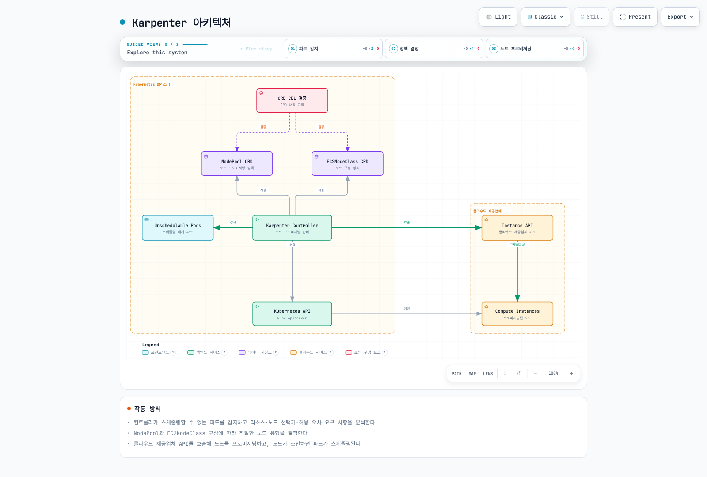
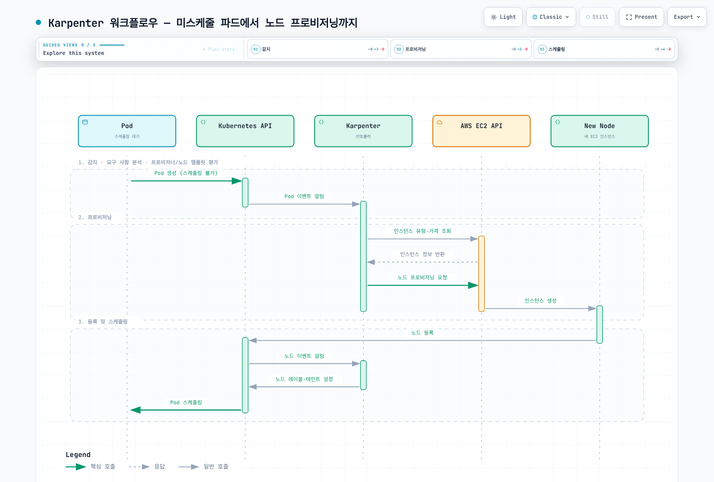
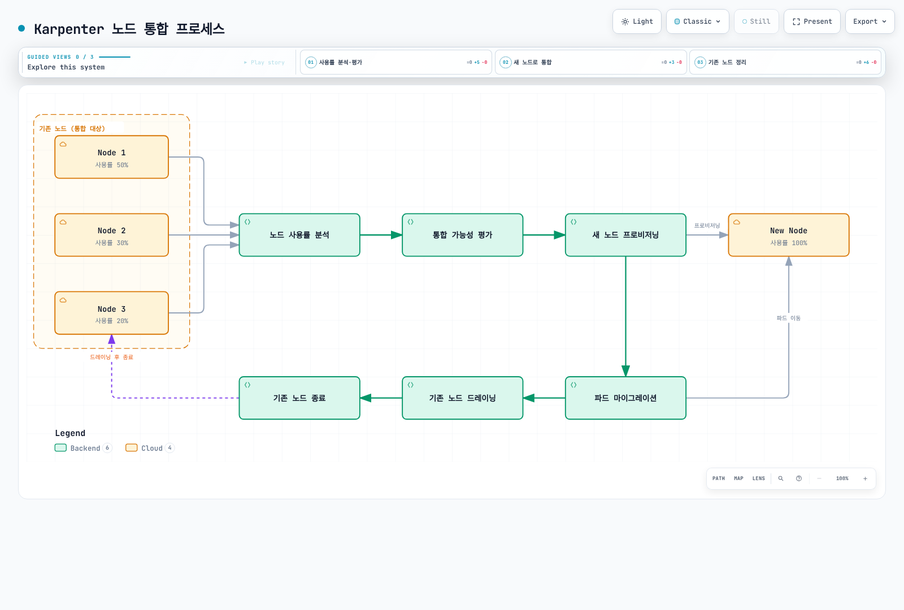
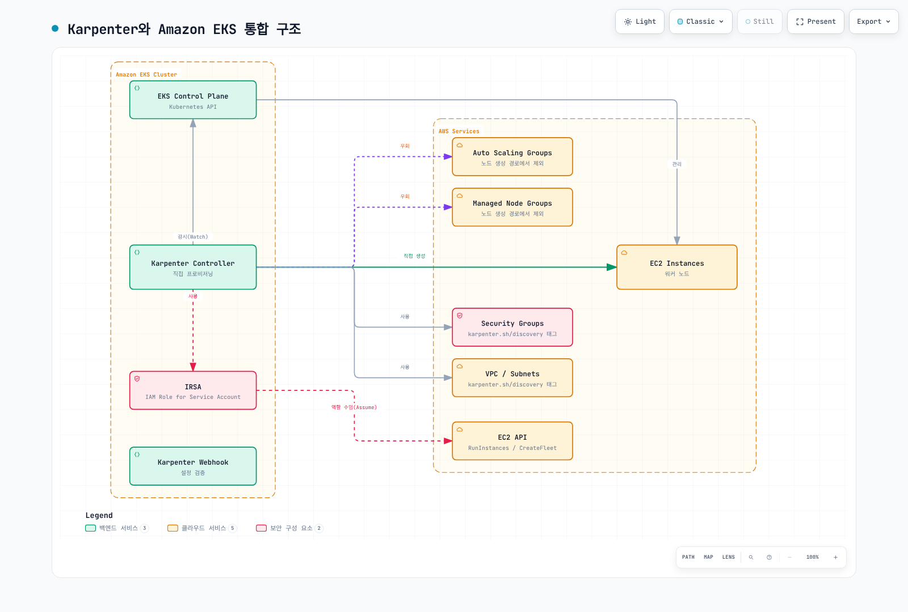
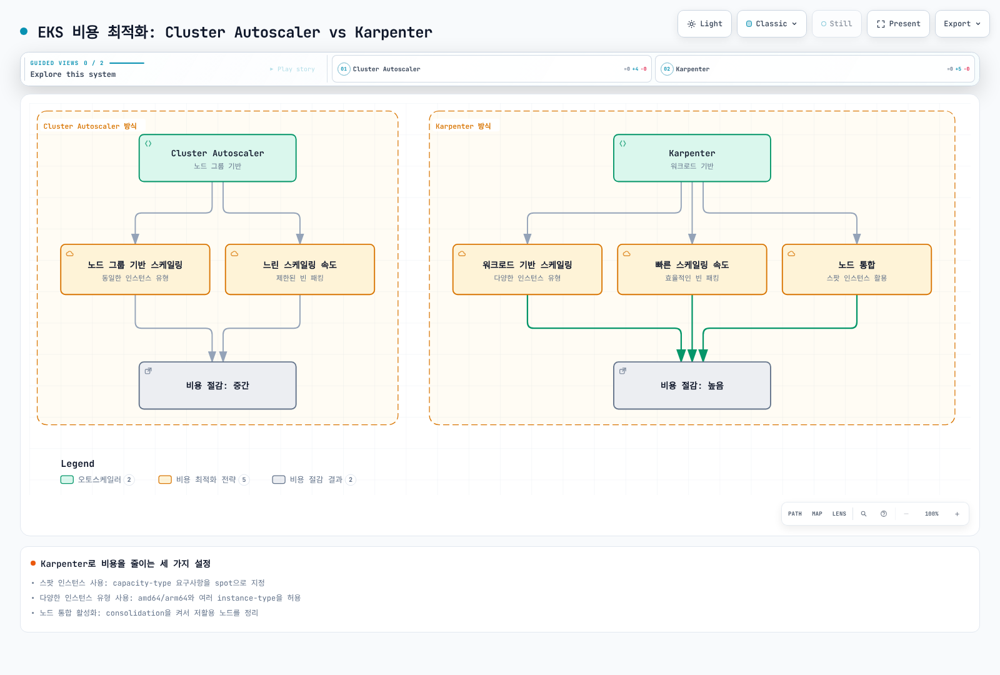
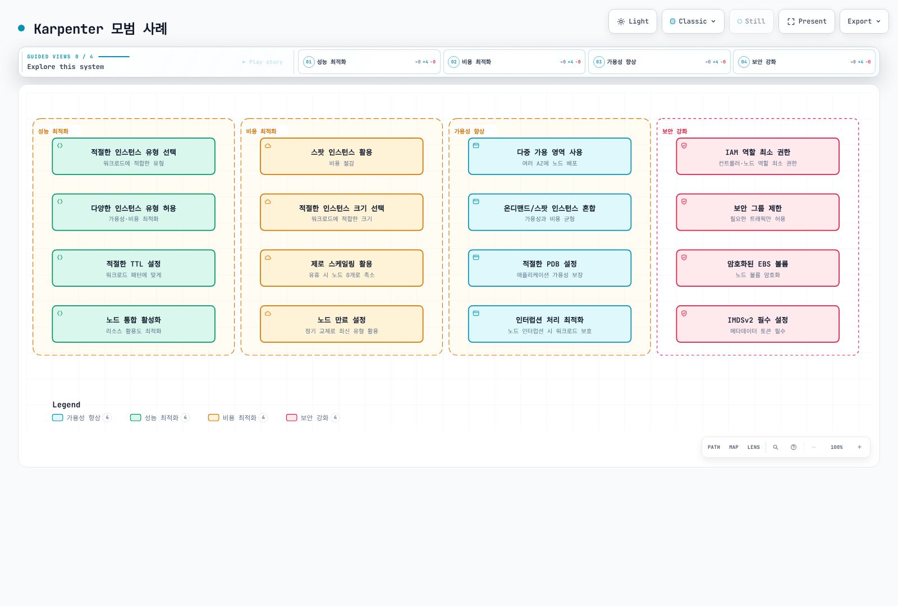

# Karpenter

> **지원 버전**: Karpenter 1.14 LTS(예제: 1.14.1); Kubernetes/EKS는 호환성 표와 공급자 지원 범위로 선택하세요.
> **마지막 업데이트**: 2026년 9월 11일

## 목차
- [소개](#소개)
- [아키텍처](#아키텍처)
- [설치 및 구성](#설치-및-구성)
- [NodePool](#nodepool)
- [노드 클래스](#노드-클래스)
- [인터럽션 처리](#인터럽션-처리)
- [통합](#통합)
- [Amazon EKS와의 통합](#amazon-eks와의-통합)
- [모범 사례](#모범-사례)
- [문제 해결](#문제-해결)
- [결론](#결론)

## 소개

Karpenter는 오픈 소스 노드 오토스케일러입니다. 이 장은 호환 Kubernetes 워크로드에 EC2 용량을 제공하는 AWS 공급자 구현을 다룹니다. 가용성·효율은 제약 조건, 클라우드 용량, 노드 초기화와 애플리케이션 설계에 따라 달라집니다.

### Karpenter의 주요 이점

1. **수요에 따른 스케일링**: 스케줄링되지 못하는 워크로드 수요에 반응해 프로비저닝을 시작하며 노드·애플리케이션 준비 시간은 고정적으로 보장되지 않습니다.
2. **비용 최적화**: 워크로드에 가장 적합한 인스턴스 유형 선택
3. **단순한 구성**: 선언적 API를 통한 간단한 구성
4. **워크로드 중심 설계**: 파드 요구 사항에 기반한 노드 프로비저닝
5. **클라우드 통합**: 클라우드 제공업체의 기능 활용
6. **효율적인 빈 패킹**: 리소스 활용도 최적화
7. **유연한 노드 관리**: 노드 수명 주기 관리 및 통합 인터럽션 처리

### 기존 오토스케일러와의 비교

| 기능 | Karpenter | Cluster Autoscaler | Cloud Provider 관리형 노드 그룹 |
|------|-----------|-------------------|---------------------------|
| 스케일링 속도 | 스케줄링·EC2 용량·초기화에 따라 다름 | 노드 그룹 확장·초기화에 따라 다름 | 확장 정책·용량·초기화에 따라 다름 |
| 인스턴스 유형 선택 | 동적 | 노드 그룹 기반 | 노드 그룹 기반 |
| 빈 패킹 효율성 | 워크로드·제약 조건에 따라 다름 | 워크로드·노드 그룹에 따라 다름 | 스케줄러·확장 컨트롤러에 따라 다름 |
| 구성 복잡성 | 낮음 | 중간 | 낮음 |
| 클라우드 통합 | 공급자별 구현 | 여러 클라우드 공급자 통합 | 공급자 기본 기능 |
| 노드 그룹 관리 | 불필요 | 필요 | 필요 |
| 인터럽션 처리 | 설정된 이벤트 처리·노드 수명주기 | 플랫폼·통합 구성에 따라 다름 | 플랫폼별 처리 |

> **참고**: EKS는 2026년4월8일 Managed Node Group warm pool 지원을 추가했습니다. 사전 초기화된 인스턴스는 반복 초기화 작업을 줄이며 Stopped·Running 상태는 전환 시간과 비용이 다르고 scale-in 재사용은 선택 사항입니다. AWS 발표에 따르면 Cluster Autoscaler 추가 설정은 필요하지 않습니다. 재개·노드 준비·애플리케이션 시작 시간은 남습니다. EKS Managed Node Group/Auto Scaling 기능이며 Karpenter가 관리하는 풀은 아닙니다.

## 아키텍처

Karpenter는 Kubernetes 컨트롤러로 작동하며, 스케줄링할 수 없는 파드를 감지하고 적절한 노드를 프로비저닝합니다.



[🔍 인터랙티브 다이어그램 보기](https://www.atomai.click/kubernetes-docs/archmaps/ko-autoscaling-02-karpenter-0.html)

### Karpenter 워크플로우

다음 다이어그램은 Karpenter가 EKS 클러스터에서 작동하는 방식을 보여줍니다:



[🔍 인터랙티브 다이어그램 보기](https://www.atomai.click/kubernetes-docs/archmaps/ko-autoscaling-02-karpenter-1.html)

### 주요 구성 요소

1. **Karpenter 컨트롤러**: 스케줄링 수요를 시뮬레이션하고 NodeClaim과 노드 수명주기를 관리합니다. 실제 Pod 바인딩은 Kubernetes 스케줄러가 수행합니다.
2. **CRD CEL 검증**: NodePool·EC2NodeClass를 CRD의 CEL 검증 규칙으로 유효성 검사 (어드미션·변환 웹훅은 Karpenter 1.1에서 제거)
3. **NodePool·NodeClaim CRD**: NodePool은 정책을 정의하고 NodeClaim은 개별 프로비저닝 노드의 요구사항·수명주기를 기록합니다.
4. **EC2NodeClass CRD**: 프로비저닝할 노드의 구성을 정의
5. **클라우드 제공업체 통합**: 클라우드 제공업체의 API와 통합하여 컴퓨팅 리소스 관리

### 작동 방식

1. Karpenter 컨트롤러가 스케줄링할 수 없는 파드를 감지
2. 파드 요구 사항(리소스, 노드 선택기, 허용 오차 등)을 분석
3. NodePool 및 EC2NodeClass 구성에 따라 적절한 노드 유형 결정
4. 클라우드 제공업체 API를 호출하여 노드 프로비저닝
5. 노드가 등록·준비되면 Kubernetes 스케줄러가 적합한 Pod를 바인딩할 수 있습니다. Karpenter가 kube-scheduler를 대체하지는 않습니다.
6. 통합·드리프트·만료·수동 삭제·클라우드 인터럽션은 서로 다른 계기와 보호 장치를 사용하며 모두 SQS 인터럽션 이벤트인 것은 아닙니다.

## 설치 및 구성

apiVersion/kind가 없는 YAML은 설명 중인 NodePool·EC2NodeClass spec의 설정 조각이며 단독 kubectl apply 문서가 아닙니다.

기존 클러스터용 독립 학습 예제이며 운영 준비가 검증된 배포 묶음이 아닙니다. 반복되는 객체 이름은 대안입니다. 설치 전에 IAM/OIDC·노드 접근·승인된 서브넷/보안 그룹·부트스트랩 용량·인터럽션 큐를 준비·검증하세요. YAML의 `my-cluster` 등은 문자 그대로의 예시 이름이며 kubectl은 저장된 YAML 안의 `${CLUSTER_NAME}`를 확장하지 않습니다. 이번 감사에서는 AWS 생성·Karpenter 설치·스케일링 실측을 수행하지 않았습니다. 신규 설치 명령은 같은 릴리스가 있으면 실패하며 기존 설치는 버전별 업그레이드·CRD 마이그레이션 지침을 따라야 합니다.

### 사전 요구 사항

- 플랫폼 지원 버전과 Karpenter 호환성 표를 함께 확인하세요. 공개 표의 최소 Karpenter 버전은 Kubernetes1.34에1.6, 1.35에1.9, 1.36에1.13입니다. 최소 버전이라고 모든 구형 마이너가 계속 유지 보수된다는 뜻은 아닙니다. 현재 표는1.37 호환성을 입증하지 않습니다. EKS 제공·지원 버전은 별도로 확인해야 합니다.
- kubectl 설정
- 클라우드 제공업체 자격 증명 및 권한
- Helm (선택 사항)

### AWS EKS에 설치

#### 1. IAM 역할 및 정책 설정

조회 명령은 기존 컨트롤러·노드 역할과 API 또는 API_AND_CONFIG_MAP EKS 인증을 가정합니다. CONFIG_MAP 전용 클러스터는 list-access-entries 대신 기존 aws-auth 노드 매핑을 확인해야 하며 설정 도중 인증 모드를 부수적으로 변경하지 마세요. 노드 역할은 EC2를 신뢰하고 AmazonEKSWorkerNodePolicy·AmazonEC2ContainerRegistryPullOnly 등의 워커·ECR 다운로드 권한이 필요합니다. 지원되는 경우 VPC CNI에 별도 인증을 부여하세요. SSM 권한은 선택 사항이며 설정된 에이전트가 필요합니다. AmazonEKSClusterPolicy는 Karpenter 컨트롤러 정책의 대체물이 아닙니다.

```bash
# Set the existing cluster and Region; these commands only inspect AWS/Kubernetes.
export CLUSTER_NAME="my-cluster"
export AWS_REGION="us-west-2"
export KARPENTER_VERSION="1.14.1"
ACCOUNT_ID=$(aws sts get-caller-identity --query Account --output text)
CLUSTER_ENDPOINT=$(aws eks describe-cluster --region "$AWS_REGION" --name "$CLUSTER_NAME" --query cluster.endpoint --output text)
export ACCOUNT_ID CLUSTER_ENDPOINT
kubectl config current-context
aws iam get-role --role-name "KarpenterControllerRole-${CLUSTER_NAME}" --query Role.AssumeRolePolicyDocument
aws iam get-role --role-name "KarpenterNodeRole-${CLUSTER_NAME}" --query Role.AssumeRolePolicyDocument
aws eks list-access-entries --region "$AWS_REGION" --cluster-name "$CLUSTER_NAME"
```

#### 2. Helm을 사용한 설치

참조 큐와 부트스트랩 용량을 준비한 뒤 신규 설치 예제를 한 번만 사용하세요. 업그레이드는 버전별 마이그레이션 지침과 해당 CRD 갱신(예: 별도로 관리하는 karpenter-crd 차트)이 필요합니다. 컨트롤러 차트 업그레이드만으로 CRD가 일반적으로 갱신되지는 않습니다. 기존 CRD 관리 방식을 옮기기 전에 소유권을 확인하세요.

```bash
# Run only after the prerequisites and the current kubectl context are verified.
: "${CLUSTER_NAME:?Set the existing cluster name}"
: "${ACCOUNT_ID:?Set the AWS account ID}"
: "${CLUSTER_ENDPOINT:?Set the matching EKS endpoint}"
KARPENTER_VERSION="1.14.1"
helm install karpenter oci://public.ecr.aws/karpenter/karpenter \
  --version "$KARPENTER_VERSION" \
  --namespace karpenter --create-namespace \
  --set-string 'serviceAccount.annotations.eks\.amazonaws\.com/role-arn'="arn:aws:iam::${ACCOUNT_ID}:role/KarpenterControllerRole-${CLUSTER_NAME}" \
  --set-string settings.clusterName="$CLUSTER_NAME" \
  --set-string settings.clusterEndpoint="$CLUSTER_ENDPOINT" \
  --set-string settings.interruptionQueue="$CLUSTER_NAME" \
  --wait --timeout 5m
```

#### 3. 설치 확인

```bash
kubectl get deployments,pods -n karpenter
kubectl rollout status deployment/karpenter -n karpenter --timeout=180s
kubectl get nodepools,ec2nodeclasses,nodeclaims
```

기본 컨트롤러 복제본2개의 출력 형식 예시이며 이번 감사의 실행 결과가 아닙니다:
```
NAME                         READY   STATUS    RESTARTS   AGE
karpenter-<hash>-<id-1>      1/1     Running   0          1m
karpenter-<hash>-<id-2>      1/1     Running   0          1m
```

### 기본 NodePool 및 EC2NodeClass 구성

```yaml
apiVersion: karpenter.sh/v1
kind: NodePool
metadata:
  name: default
spec:
  disruption:
    consolidationPolicy: WhenEmpty
    consolidateAfter: 30s
  limits:
    cpu: '1000'
    memory: 1000Gi
  template:
    spec:
      requirements:
      - key: karpenter.sh/capacity-type
        operator: In
        values:
        - on-demand
      - key: kubernetes.io/arch
        operator: In
        values:
        - amd64
      - key: node.kubernetes.io/instance-type
        operator: In
        values:
        - m5.large
        - m5.xlarge
        - m5.2xlarge
      nodeClassRef:
        group: karpenter.k8s.aws
        kind: EC2NodeClass
        name: default
---
apiVersion: karpenter.k8s.aws/v1
kind: EC2NodeClass
metadata:
  name: default
spec:
  role: KarpenterNodeRole-my-cluster
  amiSelectorTerms:
  - alias: al2023@latest
  subnetSelectorTerms:
  - tags:
      karpenter.sh/discovery: my-cluster
  securityGroupSelectorTerms:
  - tags:
      karpenter.sh/discovery: my-cluster
  tags:
    karpenter.sh/discovery: my-cluster
  blockDeviceMappings:
  - deviceName: /dev/xvda
    ebs:
      volumeSize: 100Gi
      volumeType: gp3
      deleteOnTermination: true
      encrypted: true
```

## NodePool

NodePool은 Karpenter가 노드를 프로비저닝하는 방법을 정의하는 Kubernetes 사용자 정의 리소스입니다. 이전의 Provisioner를 대체합니다.

### 기본 NodePool 구성

아래 특수 taint는 의도적으로 워크로드의 일치하는 toleration을 요구합니다. 설정한 taint를 제거하는 초기화 담당자를 검증하기 전까지 startupTaints는 비워둡니다. 담당자 없는 taint를 임의로 추가하면 노드를 사용할 수 없게 될 수 있습니다. 리소스·초기화·중단 예제는 대안이며 운영 NodePool에 모두 더하는 변경이 아닙니다.

```yaml
apiVersion: karpenter.sh/v1
kind: NodePool
metadata:
  name: default
spec:
  template:
    metadata:
      labels:
        environment: training
        app: web
    spec:
      requirements:
      - key: karpenter.sh/capacity-type
        operator: In
        values:
        - on-demand
      - key: kubernetes.io/arch
        operator: In
        values:
        - amd64
      - key: node.kubernetes.io/instance-type
        operator: In
        values:
        - m5.large
        - m5.xlarge
        - m5.2xlarge
      nodeClassRef:
        group: karpenter.k8s.aws
        kind: EC2NodeClass
        name: default
      taints:
      - key: example.com/special-taint
        value: 'true'
        effect: NoSchedule
      startupTaints: []
      expireAfter: 720h
  limits:
    cpu: '1000'
    memory: 1000Gi
  disruption:
    consolidationPolicy: WhenEmpty
    consolidateAfter: 30s
```

### 요구 사항 구성

요구사항은 서로, EC2NodeClass, Pod 제약과 교집합으로 적용됩니다. amd64·arm64를 모두 허용해도 적합한 인스턴스·AMI·컨테이너 이미지가 두 아키텍처를 지원해야 의미가 있습니다. AZ·용량 유형 목록만으로 균등 분산이 보장되지는 않으므로 워크로드 토폴로지 제약을 사용하세요.

요구 사항은 Karpenter가 프로비저닝할 노드의 특성을 정의합니다:

```yaml
template:
  spec:
    requirements:
    - key: karpenter.sh/capacity-type
      operator: In
      values:
      - on-demand
      - spot
    - key: kubernetes.io/arch
      operator: In
      values:
      - amd64
      - arm64
    - key: node.kubernetes.io/instance-type
      operator: In
      values:
      - m5.large
      - m5.xlarge
      - c5.large
      - m6g.large
      - c6g.large
    - key: topology.kubernetes.io/zone
      operator: In
      values:
      - us-west-2a
      - us-west-2b
      - us-west-2c
    - key: kubernetes.io/os
      operator: In
      values:
      - linux
```

### 제한 구성

`spec.limits`는 총 프로비저닝 리소스를 제한하지만 병렬 프로비저닝의 검사는 최종 일관성이므로 일시적으로 초과할 수 있습니다. 엄격한 과금 상한이 아닙니다. 문자열 수량으로 API·GitOps 형식 차이를 줄일 수 있습니다.

```yaml
limits:
  cpu: '1000'
  memory: 1000Gi
  nvidia.com/gpu: '10'
```

### 실험적인 DRA 할당 추적 (v1.13)

코어 Karpenter v1.13은 DRA 디바이스 할당 추적을 추가했습니다. 일반적인 운영 DRA 프로비저닝을 보장하는 것은 아닙니다. AWS1.14.1 차트는 `settings.ignoreDRARequests: true`가 기본이고 업스트림도 정식 DRA 지원은 아직 GA가 아니라고 명시합니다. Kubernetes1.29 이상이라는 조건만으로 호환성을 판단할 수 없습니다. 정확한 Kubernetes 리소스 API·DRA 드라이버·ResourceClaim/ResourceSlice·Karpenter 설정을 검증해야 하며 아래 디바이스 플러그인 확장 리소스 예제와 동일하게 취급하지 마세요.

### 노드 만료 구성

`expireAfter`는 만료에 따른 드레이닝 시작 시점이며 교체 완료 시간을 보장하지 않습니다. 아래 선택적 `terminationGracePeriod`는 드레이닝을 제한하지만 PDB에 막힌 Pod도 강제 삭제할 수 있습니다. 애플리케이션 종료·복구 요구를 검증한 뒤 기한을 선택하세요.

```yaml
spec:
  template:
    spec:
      expireAfter: 720h
      terminationGracePeriod: 30m
  disruption:
    consolidationPolicy: WhenEmpty
    consolidateAfter: 30s
```

### NodeReadinessController Taint 인식 (v1.13)

코어 Karpenter v1.13은 별도 NodeReadinessController의 `readiness.k8s.io/` taint를 초기화 전 관리 노드의 스케줄링 시뮬레이션에서 임시 taint로 인식합니다. 초기화 완료는 해당 taint가 제거될 때까지 기다립니다. Karpenter가 taint를 삭제하거나 Kubernetes 스케줄러가 우회하게 하는 기능이 아닙니다. 다른 초기화 taint에는 정확한 `startupTaints` 설정과 이를 제거하는 컨트롤러가 여전히 필요합니다.

### 2026년 7월 업데이트: v1.14 릴리스

2026년 7월 11일 릴리스된 Karpenter v1.14의 주요 기능:

- **CapacityBuffers API 지원**: alpha 용량 버퍼 통합이며 `CapacityBuffer`는 기본 비활성화입니다. 해당 CRD·컨트롤러 구성이 필요하고 예비 용량이 무료이거나 지연을 보장하는 것은 아닙니다.
- **프리뷰 인스턴스 타입 지원**: 적합한 프리뷰 제공 용량을 인식하지만 실제 프로비저닝에는 계정·리전 접근권과 용량이 필요합니다.
- **Nitro Enclaves 지원**: NodeClaim 리소스 요청에 `eks.amazonaws.com/nip-slots`가 있으면 공급자 구현이 생성한 시작 템플릿의 `EnclaveOptions.Enabled`를 설정합니다. 호환 인스턴스·AMI·디바이스 플러그인이 필요하며1.14.1에 `EC2NodeClass.spec.enclaveOptions` 필드는 없습니다.
- 버그 수정: 보조 ENI의 기본 IP 계산 반영, Zonal Shift 초기 캐시 동기화 수정, AWS SDK 클라이언트 타임아웃 설정 등

자세한 내용은 [v1.14.0 릴리스 노트](https://github.com/aws/karpenter-provider-aws/releases/tag/v1.14.0)를 참고하세요.

2026년7월17일 구형 브랜치에1.3.8·1.11.3 등의 패치가 배포되었습니다. 이 역사적 백포트가 모든 중간 마이너의 계속된 지원을 뜻하지는 않습니다. 현재 지원 정책은 LTS1.9를2027년2월까지, LTS1.14를2027년7월까지 지원하며 일반 마이너는 다음 마이너가 나올 때까지만 지원합니다. 구형 라인이 계속 유지된다고 가정하지 말고 지원되는 라인과 마이그레이션 지침을 선택하세요.

AWS의2026년7월22일 발표는 Karpenter/EKS Auto Mode의 EFA 인터페이스·배치 그룹 구성을 추가했습니다. AWS Karpenter1.14.1의 실제 필드는 NodePool이 아닌 `EC2NodeClass.spec.networkInterfaces`와 `spec.placementGroupSelector`입니다. EFA-only 인터페이스는 VPC IP를 소비하지 않지만 device/card index0의 기본 `interface`는 여전히 필요합니다. 기존 배치 그룹을 이름 또는 ID로 선택하며 해당 cluster/spread/partition 전략과 지원 인스턴스가 배치를 제한합니다. 이 예제에서 HPC 워크로드를 구성·검증하지는 않았습니다.

### 2026년 8월 업데이트: v1.14.1 패치 릴리스

2026년 8월 21일 v1.14 라인의 첫 패치인 [v1.14.1](https://github.com/aws/karpenter-provider-aws/releases/tag/v1.14.1)이 공개되었습니다. 업스트림 `sigs.k8s.io/karpenter` 버전 갱신과 v1.14.0 이후 수정 사항의 체리픽을 담은 유지 보수 릴리스입니다.

## 노드 클래스

노드 클래스는 Karpenter가 프로비저닝하는 노드의 구성을 정의합니다. AWS에서는 EC2NodeClass CRD를 사용합니다.

### AWS EC2NodeClass 구성

```yaml
apiVersion: karpenter.k8s.aws/v1
kind: EC2NodeClass
metadata:
  name: default
spec:
  subnetSelectorTerms:
  - tags:
      karpenter.sh/discovery: my-cluster
  securityGroupSelectorTerms:
  - tags:
      karpenter.sh/discovery: my-cluster
  tags:
    karpenter.sh/discovery: my-cluster
    environment: training
  blockDeviceMappings:
  - deviceName: /dev/xvda
    ebs:
      volumeSize: 100Gi
      volumeType: gp3
      deleteOnTermination: true
      encrypted: true
  role: KarpenterNodeRole-my-cluster
  amiSelectorTerms:
  - alias: al2023@latest
  userData: '#!/bin/bash

    echo "Hello from Karpenter node!"

    '
  metadataOptions:
    httpEndpoint: enabled
    httpProtocolIPv6: disabled
    httpPutResponseHopLimit: 1
    httpTokens: required
```

### 서브넷 및 보안 그룹 선택

서브넷과 보안 그룹은 태그 기반 선택 조건(selector terms)을 사용하여 선택할 수 있습니다. 여러 term은 OR로, 하나의 term 안의 태그는 AND로 평가됩니다:

```yaml
subnetSelectorTerms:
- tags:
    karpenter.sh/discovery: my-cluster
    Name: private-*
securityGroupSelectorTerms:
- tags:
    karpenter.sh/discovery: my-cluster
```

### AMI 구성

Karpenter는 `amiSelectorTerms`로 AMI를 선택합니다. alias는 패밀리·버전을 선택하지만 **`@latest`는 버전 고정이 아닙니다.** 해석된 AMI가 바뀌면 드리프트가 발생할 수 있으며 아래 `@latest`는 학습 예제입니다. 운영에서는 실제 릴리스 날짜의 `al2023@vYYYYMMDD` 또는 승인한 AMI ID를 조회·시험한 뒤 배포하세요. EKS AL2 AMI는 Kubernetes1.33 이상에 게시되지 않습니다. 아래 변형들은 대안이며 Custom AMI에는 올바른 부트스트랩·등록 taint·kubelet·CNI/런타임·인증 구성이 필요합니다.

```yaml
# Amazon Linux 2023
amiSelectorTerms:
  - alias: al2023@latest
---
# Bottlerocket
amiSelectorTerms:
  - alias: bottlerocket@latest
---
# 사용자 정의 AMI (ID 지정) — alias 항목이 없으면 amiFamily가 필수
amiFamily: Custom
amiSelectorTerms:
  - id: "ami-0123456789abcdef0"
# Ubuntu: v1 alias 없음 — amiFamily: Custom과 id/tags/name 항목을 사용
```

### 블록 디바이스 구성

디바이스 매핑은 AMI 패밀리별로 다릅니다. AL2023 예제는 루트 /dev/xvda를 사용하며 다른 AMI는 실제 레이아웃을 확인하세요. 추가 볼륨은 파일시스템·마운트 또는 애플리케이션 저장 계획이 필요합니다. 고객 관리 KMS 키에는 해당 키·IAM 권한도 필요합니다.

노드의 스토리지 구성을 정의할 수 있습니다:

```yaml
blockDeviceMappings:
- deviceName: /dev/xvda
  ebs:
    volumeSize: 100Gi
    volumeType: gp3
    iops: 3000
    throughput: 125
    deleteOnTermination: true
    encrypted: true
    kmsKeyID: arn:aws:kms:us-west-2:111122223333:key/1234abcd-12ab-34cd-56ef-1234567890ab
- deviceName: /dev/xvdb
  ebs:
    volumeSize: 500Gi
    volumeType: gp3
    deleteOnTermination: true
    encrypted: true
```

### 사용자 데이터 구성

이 셸 사용자 데이터는 AL2023을 가정하며 Karpenter가 생성하는 bootstrap/nodeadm 설정과 병합됩니다. Bottlerocket·Windows에 그대로 사용하는 일반 부트스트랩이 아닙니다. 시작할 때마다 무제한 패키지 갱신을 하지 말고 AMI에 패키지를 넣어 검증하세요. CloudWatch Agent 설치·시작만으로 설정·IAM·통신 경로가 없는 상태에서 수집이 이루어지지는 않습니다.

```yaml
userData: |
  #!/bin/bash
  set -euo pipefail
  # Only for a workload that requires this setting; keep node packages in a tested AMI.
  cat > /etc/sysctl.d/99-workload-map-count.conf <<'EOF'
  vm.max_map_count=262144
  EOF
  sysctl -p /etc/sysctl.d/99-workload-map-count.conf
```

### 노드 통합 프로세스

다음 다이어그램은 Karpenter의 노드 통합(consolidation) 프로세스를 보여줍니다. 이 기능은 클러스터 효율성을 최적화하고 비용을 절감하는 데 중요합니다:



[🔍 인터랙티브 다이어그램 보기](https://www.atomai.click/kubernetes-docs/archmaps/ko-autoscaling-02-karpenter-2.html)

## 인터럽션 처리

설정된 인터럽션 처리는 용량 손실 전에 대응을 시도합니다. 알림·대체 용량·종료 기한·애플리케이션 복구에 따라 결과가 달라지며 무중단을 보장하지 않습니다.

### 통합 인터럽션 처리

클라우드 인터럽션 처리는 통합·만료와 별개이며 다음과 같은 신호를 다룹니다.

1. **Spot 중단 경고**: 가능한 경우 드레이닝과 대체 용량 요청을 시작하지만 알림 시간은 복구 SLA가 아닙니다.
2. **예정된 상태·유지 보수 이벤트**: 영향을 받는 인스턴스에 대응합니다.
3. **인스턴스 중지·종료 이벤트**: 서비스를 떠나는 용량을 조정합니다.
4. **EC2 인스턴스 상태 검사 실패**: 필요한 EC2 권한으로 상태를 확인합니다. Rebalance recommendation만으로는 자동 taint·drain·terminate를 수행하지 않고 이벤트를 게시합니다.

### 인터럽션 처리 구성

```yaml
apiVersion: karpenter.sh/v1
kind: NodePool
metadata:
  name: default
spec:
  template:
    spec:
      requirements:
        - key: karpenter.sh/capacity-type
          operator: In
          values: ["on-demand"]
      nodeClassRef:
        group: karpenter.k8s.aws
        kind: EC2NodeClass
        name: default

      # 노드 만료 설정
      expireAfter: 720h  # 30일

  # 통합(consolidation) 설정
  disruption:
    consolidationPolicy: WhenEmpty
    consolidateAfter: 30s
```

### 드레이닝 구성

Karpenter는 정상 드레이닝에서 eviction을 사용합니다. Helm은 컨트롤러를 설정하고 NodePool disruption budget은 자발적인 통합·드리프트 시작을 제한하며 모든 동시 노드 손실을 제한하지는 않습니다.30% 예산은 올림 후 삭제 중·준비되지 않은 노드 수를 차감하므로 엄격한30% 상한이 아닙니다. 만료·인터럽션·복구는 강제 종료 동작이 다를 수 있습니다. `interruptionQueue` 활성화 전에 SQS 큐·EventBridge 규칙/대상·큐 정책·컨트롤러 권한을 구성해야 하며 Helm 필드만으로 생성되지 않습니다.

```yaml
settings:
  clusterName: my-cluster
  interruptionQueue: my-cluster
  batchMaxDuration: 10s
  batchIdleDuration: 1s
  featureGates:
    spotToSpotConsolidation: false
controller:
  resources:
    requests:
      cpu: 1
      memory: 1Gi
    limits:
      cpu: '1'
      memory: 1Gi
logLevel: info
```

```yaml
apiVersion: karpenter.sh/v1
kind: NodePool
metadata:
  name: default
spec:
  template:
    spec:
      requirements:
        - key: karpenter.sh/capacity-type
          operator: In
          values: ["on-demand"]
      nodeClassRef:
        group: karpenter.k8s.aws
        kind: EC2NodeClass
        name: default
      expireAfter: 720h
  disruption:
    consolidationPolicy: WhenEmpty
    consolidateAfter: 30s
    budgets:
      - nodes: "30%"   # 자발적 교체 예산: 올림 후 삭제 중·준비되지 않은 노드 수 차감
```

### PDB(PodDisruptionBudget) 통합

PDB는 정상 복제본 수에 따라 자발적인 eviction을 제한하지만 복제본을 생성하거나 애플리케이션 가용성을 보장하지 않습니다. 아래 `minAvailable: 2`는 축출 전에 충분한 정상 Pod가 필요합니다. 인스턴스 손실이나 강제 종료 기한은 여전히 영향을 줄 수 있습니다.

```yaml
apiVersion: policy/v1
kind: PodDisruptionBudget
metadata:
  name: app-pdb
  namespace: default
spec:
  minAvailable: 2
  selector:
    matchLabels:
      app: my-app
```

## 통합

Karpenter는 다양한 Kubernetes 및 클라우드 서비스와 통합됩니다.

### Kubernetes 통합

#### 1. Pod Topology Spread Constraints

Karpenter는 Pod Topology Spread Constraints를 고려하여 노드를 프로비저닝합니다:

```yaml
apiVersion: apps/v1
kind: Deployment
metadata:
  name: web-server
  namespace: default
spec:
  replicas: 10
  template:
    spec:
      topologySpreadConstraints:
      - maxSkew: 1
        topologyKey: topology.kubernetes.io/zone
        whenUnsatisfiable: DoNotSchedule
        labelSelector:
          matchLabels:
            app: web-server
      containers:
      - name: web-server
        image: nginx:1.30.4
        ports:
        - containerPort: 80
        resources:
          requests:
            cpu: 100m
            memory: 128Mi
          limits:
            memory: 256Mi
    metadata:
      labels:
        app: web-server
  selector:
    matchLabels:
      app: web-server
```

#### 2. Pod Affinity/Anti-Affinity

Karpenter는 Pod Affinity 및 Anti-Affinity 규칙을 고려합니다:

```yaml
apiVersion: apps/v1
kind: Deployment
metadata:
  name: web-server
  namespace: default
spec:
  replicas: 10
  template:
    spec:
      affinity:
        podAntiAffinity:
          requiredDuringSchedulingIgnoredDuringExecution:
          - labelSelector:
              matchExpressions:
              - key: app
                operator: In
                values:
                - web-server
            topologyKey: kubernetes.io/hostname
      containers:
      - name: web-server
        image: nginx:1.30.4
        ports:
        - containerPort: 80
        resources:
          requests:
            cpu: 100m
            memory: 128Mi
          limits:
            memory: 256Mi
    metadata:
      labels:
        app: web-server
  selector:
    matchLabels:
      app: web-server
```

#### 3. 테인트 및 허용 오차

GPU 예제에는 호환 가속 AMI·NVIDIA 드라이버와 GPU taint를 허용해 nvidia.com/gpu를 광고하는 디바이스 플러그인 DaemonSet이 필요합니다. BusyBox Pod는 GPU 예약만 보여주며 CUDA를 실행·벤치마크하지 않습니다. 실제 GPU 애플리케이션 이미지는 별도 검증하세요.

Karpenter는 테인트 및 허용 오차를 고려하여 노드를 프로비저닝합니다:

```yaml
apiVersion: karpenter.sh/v1
kind: NodePool
metadata:
  name: gpu
spec:
  template:
    spec:
      requirements:
      - key: node.kubernetes.io/instance-type
        operator: In
        values:
        - g4dn.xlarge
        - g4dn.2xlarge
      taints:
      - key: nvidia.com/gpu
        value: 'true'
        effect: NoSchedule
      nodeClassRef:
        group: karpenter.k8s.aws
        kind: EC2NodeClass
        name: default
---
apiVersion: apps/v1
kind: Deployment
metadata:
  name: gpu-app
  namespace: default
spec:
  replicas: 3
  template:
    spec:
      tolerations:
      - key: nvidia.com/gpu
        operator: Exists
        effect: NoSchedule
      nodeSelector:
        karpenter.sh/nodepool: gpu
      containers:
      - name: gpu-allocation-demo
        image: busybox:1.37.0
        command:
        - sh
        - -c
        - sleep 3600
        resources:
          requests:
            cpu: 100m
            memory: 64Mi
          limits:
            memory: 128Mi
            nvidia.com/gpu: 1
    metadata:
      labels:
        app: gpu-app
  selector:
    matchLabels:
      app: gpu-app
```

### AWS 통합

#### 1. EC2 Spot 인스턴스

Karpenter는 EC2 Spot 인스턴스를 지원하여 비용을 최적화합니다:

```yaml
apiVersion: karpenter.sh/v1
kind: NodePool
metadata:
  name: spot
spec:
  template:
    spec:
      requirements:
      - key: karpenter.sh/capacity-type
        operator: In
        values:
        - spot
      nodeClassRef:
        group: karpenter.k8s.aws
        kind: EC2NodeClass
        name: spot
---
apiVersion: karpenter.k8s.aws/v1
kind: EC2NodeClass
metadata:
  name: spot
spec:
  role: KarpenterNodeRole-my-cluster
  amiSelectorTerms:
  - alias: al2023@latest
  subnetSelectorTerms:
  - tags:
      karpenter.sh/discovery: my-cluster
  securityGroupSelectorTerms:
  - tags:
      karpenter.sh/discovery: my-cluster
```

#### 2. EC2 인스턴스 프로필

role과 instanceProfile은 상호 배타적입니다. role을 사용하면 Karpenter가 인스턴스 프로필을 관리하므로 해당 IAM API 권한·통신 경로가 필요합니다. IAM 엔드포인트로 갈 경로가 없다면 미리 만든 instanceProfile을 사용하세요. IAM에는 PrivateLink 엔드포인트가 없습니다. 컨트롤러는 노드 역할에 대한 PassRole이 여전히 필요하며 EC2 자격 증명 보유와 EKS 노드 접근은 별개입니다.

Karpenter는 EC2 인스턴스 프로필을 사용하여 노드에 IAM 권한을 부여합니다:

```yaml
apiVersion: karpenter.k8s.aws/v1
kind: EC2NodeClass
metadata:
  name: default
spec:
  instanceProfile: KarpenterNodeInstanceProfile-my-cluster
  amiSelectorTerms:
  - alias: al2023@latest
  subnetSelectorTerms:
  - tags:
      karpenter.sh/discovery: my-cluster
  securityGroupSelectorTerms:
  - tags:
      karpenter.sh/discovery: my-cluster
```

#### 3. Launch Template 대체 (EC2NodeClass)

Karpenter v1에서는 사용자가 만든 EC2 시작 템플릿을 직접 참조하는 `launchTemplate` 필드가 제거되었습니다. 대신 Karpenter가 `EC2NodeClass`의 `amiSelectorTerms`, `blockDeviceMappings`, `userData`, `metadataOptions`, `tags` 등을 바탕으로 시작 템플릿을 자동 생성·관리합니다. 기존 시작 템플릿에 담겨 있던 설정은 해당 `EC2NodeClass` 필드로 옮겨 표현하세요:

```yaml
apiVersion: karpenter.k8s.aws/v1
kind: EC2NodeClass
metadata:
  name: node-config
spec:
  role: KarpenterNodeRole-my-cluster
  subnetSelectorTerms:
  - tags:
      karpenter.sh/discovery: my-cluster
  securityGroupSelectorTerms:
  - tags:
      karpenter.sh/discovery: my-cluster
  amiSelectorTerms:
  - alias: al2023@latest
  userData: '#!/bin/bash

    echo "Hello from Karpenter node!"

    '
  blockDeviceMappings:
  - deviceName: /dev/xvda
    ebs:
      volumeSize: 100Gi
      volumeType: gp3
      deleteOnTermination: true
      encrypted: true
  metadataOptions:
    httpEndpoint: enabled
    httpProtocolIPv6: disabled
    httpPutResponseHopLimit: 1
    httpTokens: required
```
## Amazon EKS와의 통합

Karpenter AWS 공급자는 인증·네트워크·노드 접근·부트스트랩을 구성하면 EKS 관리형 컴퓨팅과 함께 EC2 용량을 제공할 수 있습니다.



[🔍 인터랙티브 다이어그램 보기](https://www.atomai.click/kubernetes-docs/archmaps/ko-autoscaling-02-karpenter-3.html)

### EKS 클러스터 준비

모든 예시 이름을 일관되게 교체하세요. 워커에 적합한 서브넷·보안 그룹만 선택해야 하며 제어 플레인의 모든 서브넷에 태그를 붙이는 것은 안전한 검색 전략이 아닙니다. 노드 시작을 허용하기 전에 경로·보안 규칙·CNI IP 용량·필요한 사설 엔드포인트를 확인하세요.

#### 1. 클러스터 태그 설정

인프라 설정에서 승인된 워커 서브넷·보안 그룹에만 태그를 부여하세요. VPC 태그가 이들 리소스를 선택하는 것은 아닙니다. discovery 값은 예제의 `my-cluster`와 맞아야 하며 태그만으로 사설 라우팅·보안 규칙·여유 주소가 증명되지 않습니다. NodePool 적용 전에 실제 리소스와 경로를 확인하세요.

```bash
# Inspect resources that your infrastructure configuration has tagged for this cluster.
: "${CLUSTER_NAME:?Set the existing cluster name}"
: "${AWS_REGION:?Set the cluster Region}"
aws ec2 describe-subnets --region "$AWS_REGION" \
  --filters "Name=tag:karpenter.sh/discovery,Values=${CLUSTER_NAME}" \
  --query 'Subnets[].{ID:SubnetId,AZ:AvailabilityZone,FreeIPs:AvailableIpAddressCount,PublicIPOnLaunch:MapPublicIpOnLaunch,VPC:VpcId}'
aws ec2 describe-security-groups --region "$AWS_REGION" \
  --filters "Name=tag:karpenter.sh/discovery,Values=${CLUSTER_NAME}" \
  --query 'SecurityGroups[].{ID:GroupId,VPC:VpcId,Name:GroupName}'
# Inspect explicit and main route-table associations for the intended subnets.
aws ec2 describe-route-tables --region "$AWS_REGION" \
  --filters "Name=vpc-id,Values=$(aws eks describe-cluster --region "$AWS_REGION" --name "$CLUSTER_NAME" --query cluster.resourcesVpcConfig.vpcId --output text)"
```

#### 2. IAM 역할 설정

불완전한 수동 전체 허용 정책 대신 아래 버전별 컨트롤러 정책·인프라 참조를 사용하세요. 컨트롤러 인증(여기서는 IRSA), 노드 인증, VPC CNI·워크로드 인증은 별도입니다. 컨트롤러 신뢰는 클러스터 OIDC 공급자, `system:serviceaccount:karpenter:karpenter`, `aud: sts.amazonaws.com`에 맞추고 이 버전과 기능에 필요한 작업·리소스·조건만 허용해야 합니다. 노드 역할은 EKS 조인 권한이 필요하며 API 인증을 켠 경우 보통 `EC2_LINUX` access entry를 사용합니다. 아래 조회 명령은 IAM 역할이나 access entry를 생성하지 않습니다.

```bash
# Download a versioned reference for review; this does not create a CloudFormation stack.
KARPENTER_VERSION="1.14.1"
curl --fail --show-error --location \
  "https://raw.githubusercontent.com/aws/karpenter-provider-aws/v${KARPENTER_VERSION}/website/content/en/preview/getting-started/getting-started-with-karpenter/cloudformation.yaml" \
  --output karpenter-cloudformation-reference.yaml
# Inspect the existing role's attached and inline policies.
: "${CLUSTER_NAME:?Set the existing cluster name}"
aws iam list-attached-role-policies --role-name "KarpenterControllerRole-${CLUSTER_NAME}"
aws iam list-role-policies --role-name "KarpenterControllerRole-${CLUSTER_NAME}"
```

### EKS 클러스터에 Karpenter 설치

```bash
# Run only after the prerequisites and the current kubectl context are verified.
: "${CLUSTER_NAME:?Set the existing cluster name}"
: "${ACCOUNT_ID:?Set the AWS account ID}"
: "${CLUSTER_ENDPOINT:?Set the matching EKS endpoint}"
KARPENTER_VERSION="1.14.1"
helm install karpenter oci://public.ecr.aws/karpenter/karpenter \
  --version "$KARPENTER_VERSION" \
  --namespace karpenter --create-namespace \
  --set-string 'serviceAccount.annotations.eks\.amazonaws\.com/role-arn'="arn:aws:iam::${ACCOUNT_ID}:role/KarpenterControllerRole-${CLUSTER_NAME}" \
  --set-string settings.clusterName="$CLUSTER_NAME" \
  --set-string settings.clusterEndpoint="$CLUSTER_ENDPOINT" \
  --set-string settings.interruptionQueue="$CLUSTER_NAME" \
  --wait --timeout 5m
```

### EKS 관리형 노드 그룹과 함께 사용

Karpenter는 EKS Managed Node Group과 공존할 수 있습니다. 아래 NodePool은 별도 EC2 노드를 프로비저닝하며 Managed Node Group을 관리하지 않습니다. 컨트롤러는 안정적인 부트스트랩 용량에 두세요. 기본 차트는 Karpenter 노드를 제외하고 서로 다른 호스트의 복제본2개를 요청합니다.

```yaml
apiVersion: karpenter.sh/v1
kind: NodePool
metadata:
  name: managed-ng
spec:
  template:
    metadata:
      labels:
        managed-by: karpenter
    spec:
      requirements:
      - key: karpenter.sh/capacity-type
        operator: In
        values:
        - on-demand
      - key: node.kubernetes.io/instance-type
        operator: In
        values:
        - m5.large
        - m5.xlarge
      taints:
      - key: managed-by
        value: karpenter
        effect: NoSchedule
      nodeClassRef:
        group: karpenter.k8s.aws
        kind: EC2NodeClass
        name: managed-ng
  disruption:
    consolidationPolicy: WhenEmpty
    consolidateAfter: 30s
---
apiVersion: karpenter.k8s.aws/v1
kind: EC2NodeClass
metadata:
  name: managed-ng
spec:
  role: KarpenterNodeRole-my-cluster
  amiSelectorTerms:
  - alias: al2023@latest
  subnetSelectorTerms:
  - tags:
      karpenter.sh/discovery: my-cluster
  securityGroupSelectorTerms:
  - tags:
      karpenter.sh/discovery: my-cluster
  tags:
    karpenter.sh/discovery: my-cluster
```

### EKS Fargate와 함께 사용

Fargate는 Kubernetes topologySpreadConstraints를 지원하지 않으며 affinity/anti-affinity 규칙도 적용하지 않습니다. 기본 차트의 EC2 배치 제약이 Fargate AZ 분리를 보장한다고 가정하지 말고 프로파일·서브넷 배치를 별도로 설계·확인하세요.

좁게 선택한 Fargate 프로파일에 컨트롤러 Pod를 두고 Karpenter로 EC2 워커를 제공할 수 있습니다. Karpenter가 Fargate 용량·프로파일을 만들거나 관리하지는 않습니다. `default`·`kube-system` 전체 대신 `karpenter` 네임스페이스와 컨트롤러 라벨을 선택하세요. JSON 선택기 형식은 `[{"namespace":"karpenter","labels":{"app.kubernetes.io/name":"karpenter"}}]`입니다. 프로파일에는 별도 Pod 실행 역할·사설 서브넷이 필요하고 컨트롤러 AWS 권한에는 IRSA가 필요합니다(EKS Pod Identity는 Fargate 미지원). 아래 명령은 기존 프로파일을 조회합니다.

```bash
# Inspect an existing, narrowly selected controller Fargate profile.
: "${CLUSTER_NAME:?Set the existing cluster name}"
: "${AWS_REGION:?Set the cluster Region}"
aws eks describe-fargate-profile --region "$AWS_REGION" \
  --cluster-name "$CLUSTER_NAME" --fargate-profile-name karpenter-controller
```

```yaml
apiVersion: karpenter.sh/v1
kind: NodePool
metadata:
  name: ec2
spec:
  template:
    spec:
      requirements:
      - key: karpenter.sh/capacity-type
        operator: In
        values:
        - on-demand
      nodeClassRef:
        group: karpenter.k8s.aws
        kind: EC2NodeClass
        name: ec2
  disruption:
    consolidationPolicy: WhenEmpty
    consolidateAfter: 30s
---
apiVersion: karpenter.k8s.aws/v1
kind: EC2NodeClass
metadata:
  name: ec2
spec:
  role: KarpenterNodeRole-my-cluster
  amiSelectorTerms:
  - alias: al2023@latest
  subnetSelectorTerms:
  - tags:
      karpenter.sh/discovery: my-cluster
  securityGroupSelectorTerms:
  - tags:
      karpenter.sh/discovery: my-cluster
```

### AZ 장애 대응: Amazon ARC Zonal Shift 통합 (2026년 5월)

Karpenter는 활성화된 EKS ARC zonal-shift 리소스와 연동할 수 있습니다. 수동 zonal shift나 설정된 autoshift가 활성화되면 해당 AZ에 새 용량을 만들지 않습니다. 모든 AZ 장애를 독립적으로 감지하는 기능은 아니며 특정 AZ에 고정된 Pod·PV 요구사항을 무시하지도 않습니다.

shift가 활성화되면 해당 AZ의 자발적 교체를 중단하고, Pod를 해당 AZ로 보내야 하는 정상 AZ의 교체도 막습니다. 모든 정상 AZ의 자발적 교체를 무조건 일괄 중단하는 것은 아닙니다. EKS/ARC 사전 조건, `eks:DescribeCluster`·ARC 권한, `settings.enableZonalShift: true`(환경 옵션 `ENABLE_ZONAL_SHIFT`)를 구성하세요. Autoshift는 별도 선택·연습 설정이 필요합니다. 별도 ARC CRD는 필요하지 않으며 shift 종료 후 일반 동작을 재개합니다.

### EKS 비용 최적화

Karpenter를 사용하여 EKS 클러스터의 비용을 최적화할 수 있습니다:



[🔍 인터랙티브 다이어그램 보기](https://www.atomai.click/kubernetes-docs/archmaps/ko-autoscaling-02-karpenter-4.html)

#### 1. 스팟 인스턴스 사용

```yaml
apiVersion: karpenter.sh/v1
kind: NodePool
metadata:
  name: spot
spec:
  template:
    spec:
      requirements:
      - key: karpenter.sh/capacity-type
        operator: In
        values:
        - spot
      - key: kubernetes.io/arch
        operator: In
        values:
        - amd64
        - arm64
      nodeClassRef:
        group: karpenter.k8s.aws
        kind: EC2NodeClass
        name: spot
  disruption:
    consolidationPolicy: WhenEmpty
    consolidateAfter: 30s
---
apiVersion: karpenter.k8s.aws/v1
kind: EC2NodeClass
metadata:
  name: spot
spec:
  role: KarpenterNodeRole-my-cluster
  amiSelectorTerms:
  - alias: al2023@latest
  subnetSelectorTerms:
  - tags:
      karpenter.sh/discovery: my-cluster
  securityGroupSelectorTerms:
  - tags:
      karpenter.sh/discovery: my-cluster
```

#### 2. 다양한 인스턴스 유형 사용

```yaml
apiVersion: karpenter.sh/v1
kind: NodePool
metadata:
  name: flexible
spec:
  template:
    spec:
      requirements:
      - key: karpenter.sh/capacity-type
        operator: In
        values:
        - on-demand
        - spot
      - key: kubernetes.io/arch
        operator: In
        values:
        - amd64
        - arm64
      - key: node.kubernetes.io/instance-type
        operator: In
        values:
        - m5.large
        - m5.xlarge
        - m5.2xlarge
        - m6g.large
        - m6g.xlarge
        - m6g.2xlarge
        - c5.large
        - c5.xlarge
        - c5.2xlarge
        - c6g.large
        - c6g.xlarge
        - c6g.2xlarge
        - r5.large
        - r5.xlarge
        - r5.2xlarge
        - r6g.large
        - r6g.xlarge
        - r6g.2xlarge
      nodeClassRef:
        group: karpenter.k8s.aws
        kind: EC2NodeClass
        name: default
  disruption:
    consolidationPolicy: WhenEmpty
    consolidateAfter: 30s
```

#### 3. 노드 통합 활성화

```yaml
apiVersion: karpenter.sh/v1
kind: NodePool
metadata:
  name: default
spec:
  template:
    spec:
      requirements:
        - key: karpenter.sh/capacity-type
          operator: In
          values: ["on-demand"]
      nodeClassRef:
        group: karpenter.k8s.aws
        kind: EC2NodeClass
        name: default
  disruption:
    consolidationPolicy: WhenEmptyOrUnderutilized
    consolidateAfter: 1m
```

## 모범 사례



[🔍 인터랙티브 다이어그램 보기](https://www.atomai.click/kubernetes-docs/archmaps/ko-autoscaling-02-karpenter-5.html)

### 성능 최적화

1. **적절한 인스턴스 유형 선택**: 워크로드에 적합한 인스턴스 유형 선택
2. **다양한 인스턴스 유형 허용**: 가용성 및 비용 최적화를 위해 다양한 인스턴스 유형 허용
3. **적절한 TTL 설정**: 워크로드 패턴에 맞는 TTL 설정
4. **노드 통합 활성화**: 리소스 활용도 최적화를 위한 노드 통합 활성화

```yaml
apiVersion: karpenter.sh/v1
kind: NodePool
metadata:
  name: optimized
spec:
  template:
    spec:
      requirements:
      - key: node.kubernetes.io/instance-type
        operator: In
        values:
        - m5.large
        - m5.xlarge
        - m5.2xlarge
        - c5.large
        - c5.xlarge
        - c5.2xlarge
        - r5.large
        - r5.xlarge
        - r5.2xlarge
      nodeClassRef:
        group: karpenter.k8s.aws
        kind: EC2NodeClass
        name: default
      expireAfter: 720h
  disruption:
    consolidationPolicy: WhenEmpty
    consolidateAfter: 30s
```

### 비용 최적화

1. **스팟 인스턴스 활용**: 비용 절감을 위한 스팟 인스턴스 사용
2. **적절한 인스턴스 크기 선택**: 워크로드에 적합한 인스턴스 크기 선택
3. **빈 노드 제거 평가**: 적합한 워커 NodePool은0개가 될 수 있지만 컨트롤러·부트스트랩 용량과 다른 클러스터 비용은 남습니다.
4. **노드 갱신 계획**: 만료는 현재 제약에 따라 용량을 교체하며 새 인스턴스 유형을 자동 선택하거나 고정 AMI를 패치하지는 않습니다.

```yaml
apiVersion: karpenter.sh/v1
kind: NodePool
metadata:
  name: cost-optimized
spec:
  template:
    spec:
      requirements:
      - key: karpenter.sh/capacity-type
        operator: In
        values:
        - spot
      nodeClassRef:
        group: karpenter.k8s.aws
        kind: EC2NodeClass
        name: default
      expireAfter: 168h
  disruption:
    consolidationPolicy: WhenEmpty
    consolidateAfter: 30s
```

### 가용성 향상

1. **다중 가용 영역 사용**: 여러 가용 영역에 걸쳐 노드 배포
2. **온디맨드 및 스팟 인스턴스 혼합**: 가용성과 비용 균형 유지
3. **적절한 PDB 설정**: 실제 정상 복제본 범위에서 자발적 eviction을 제한하고 이중화·복구 설계와 함께 사용합니다.
4. **인터럽션 처리 설정·검증**: 무중단을 가정하지 말고 알림 경로·종료 기한·대체 용량을 확인합니다.

```yaml
apiVersion: karpenter.sh/v1
kind: NodePool
metadata:
  name: high-availability
spec:
  template:
    spec:
      requirements:
      - key: topology.kubernetes.io/zone
        operator: In
        values:
        - us-west-2a
        - us-west-2b
        - us-west-2c
      - key: karpenter.sh/capacity-type
        operator: In
        values:
        - on-demand
        - spot
      nodeClassRef:
        group: karpenter.k8s.aws
        kind: EC2NodeClass
        name: default
      expireAfter: 720h
  disruption:
    consolidationPolicy: WhenEmptyOrUnderutilized
    consolidateAfter: 60s
```

## 문제 해결

### 일반적인 문제

#### 1. 노드 프로비저닝 실패

**증상**: 파드가 Pending 상태로 유지되고 노드가 프로비저닝되지 않음

**해결 방법**:
- Karpenter 로그 확인
- IAM 권한 확인
- NodePool 구성 확인

```bash
# Karpenter 로그 확인
kubectl logs -n karpenter -l app.kubernetes.io/name=karpenter -c controller

# NodePool 상태 확인
kubectl describe nodepool <name>

# 파드 이벤트 확인
kubectl describe pod <name>
```

#### 2. 노드 제거 문제

**증상**: 노드가 예상대로 제거되지 않음

**해결 방법**:
- TTL 설정 확인
- 노드 통합 설정 확인
- 파드 드레이닝 상태 확인

```bash
# 노드 상태 확인
kubectl describe node <name>

# 노드 레이블 확인
kubectl get node <name> --show-labels

# Karpenter 로그 확인
kubectl logs -n karpenter -l app.kubernetes.io/name=karpenter -c controller --since=30m
```

#### 3. 인스턴스 유형 선택 문제

**증상**: 예상하지 않은 인스턴스 유형이 프로비저닝됨

**해결 방법**:
- NodePool 요구 사항 확인
- 파드 리소스 요청 확인
- 가용 영역 제약 조건 확인

```bash
# NodePool 요구 사항 확인
kubectl get nodepool <name> -o yaml

# 파드 리소스 요청 확인
kubectl describe pod <name>

# 노드 정보 확인
kubectl describe node <name>
```

### 디버깅 도구

```bash
# Karpenter 버전 확인
kubectl get deployment -n karpenter karpenter -o jsonpath="{.spec.template.spec.containers[0].image}"

# Karpenter 로그 확인
kubectl logs -n karpenter -l app.kubernetes.io/name=karpenter -c controller

# NodePool 목록 확인
kubectl get nodepools

# EC2NodeClass 목록 확인
kubectl get ec2nodeclasses

# 이벤트 확인
kubectl get events --sort-by='.lastTimestamp'

# Inspect the installed chart version and values before any optional log-level change.
helm list --namespace karpenter --filter '^karpenter$'
helm get values karpenter --namespace karpenter
kubectl get nodeclaims -o wide
```

## 결론

Karpenter는 워크로드·인프라 제약에 따라 노드 프로비저닝과 수명주기를 자동화합니다. 용량 관리를 개선할 수 있지만 가용성·성능·비용 결과는 워크로드별 검증이 필요합니다.

이 문서에서는 Karpenter의 기본 개념, 설치 방법, NodePool 및 EC2NodeClass 구성, 인터럽션 처리, 다양한 통합, Amazon EKS와의 통합, 모범 사례 및 문제 해결에 대해 살펴보았습니다.

Karpenter를 사용하면 클러스터 관리를 간소화하고, 리소스 활용도를 최적화하며, 비용을 절감할 수 있습니다. 특히 Amazon EKS와 같은 클라우드 관리형 Kubernetes 환경에서 Karpenter의 이점을 최대한 활용할 수 있습니다.

### 다음 단계

- Karpenter를 사용한 비용 최적화 전략 구현
- 다양한 워크로드 유형에 맞는 NodePool 구성
- 하이브리드 클러스터 아키텍처 설계
- Karpenter와 다른 Kubernetes 도구와의 통합
- 고급 노드 수명 주기 관리 전략 개발

## 참고 자료

- [Karpenter 공식 문서](https://karpenter.sh/)
- [Karpenter AWS 공급자 저장소](https://github.com/aws/karpenter-provider-aws)
- [Amazon EKS 워크숍 - Karpenter](https://www.eksworkshop.com/docs/autoscaling/compute/karpenter/)
- [AWS 블로그 - Karpenter](https://aws.amazon.com/blogs/aws/introducing-karpenter-an-open-source-high-performance-kubernetes-cluster-autoscaler/)
- [Karpenter 모범 사례](https://aws.github.io/aws-eks-best-practices/karpenter/)
- [Karpenter GitHub Releases](https://github.com/aws/karpenter-provider-aws/releases)
- [AWS What's New - Karpenter ARC Zonal Shift 지원](https://aws.amazon.com/about-aws/whats-new/2026/05/karpenter-arc-zonal-shift/)
- [AWS What's New - Amazon EKS Managed Node Group Warm Pool 지원](https://aws.amazon.com/about-aws/whats-new/2026/04/amazon-eks-managed-node-groups-ec2-warm-pools/)

## 퀴즈

이 장에서 배운 내용을 테스트하려면 [주제 퀴즈](../quizzes/autoscaling/06-karpenter-quiz.md)를 풀어보세요.

이번 수정에서 확인한 공식 자료: [Compatibility](https://karpenter.sh/v1.14/upgrading/compatibility/), [NodePool](https://karpenter.sh/v1.14/concepts/nodepools/), [EC2NodeClass](https://karpenter.sh/v1.14/concepts/nodeclasses/), [Disruption](https://karpenter.sh/v1.14/concepts/disruption/), [Support policy](https://github.com/aws/karpenter-provider-aws/blob/main/SUPPORT.md), [Pinned Helm values](https://github.com/aws/karpenter-provider-aws/blob/v1.14.1/charts/karpenter/values.yaml), [Readiness taints](https://github.com/kubernetes-sigs/karpenter/commit/05431485c90c76a3a662b678a46c1a8da330038d), [Pinned DRA option](https://github.com/kubernetes-sigs/karpenter/blob/6e7eab7a0f48/pkg/operator/options/options.go), [EKS node IAM](https://docs.aws.amazon.com/eks/latest/userguide/create-node-role.html), [Fargate profiles](https://docs.aws.amazon.com/eks/latest/userguide/fargate-profile.html).
