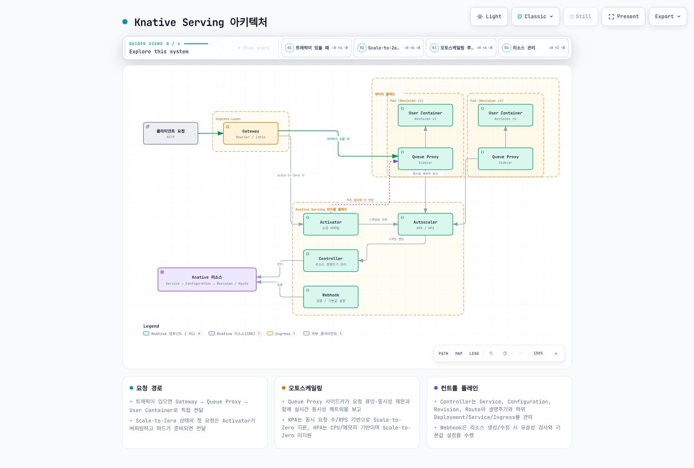
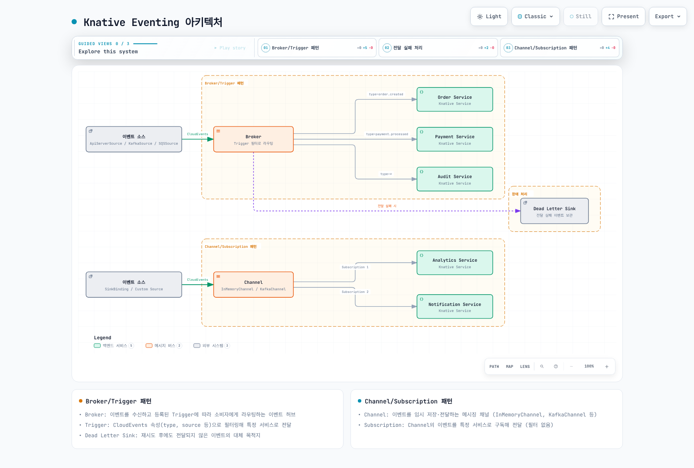
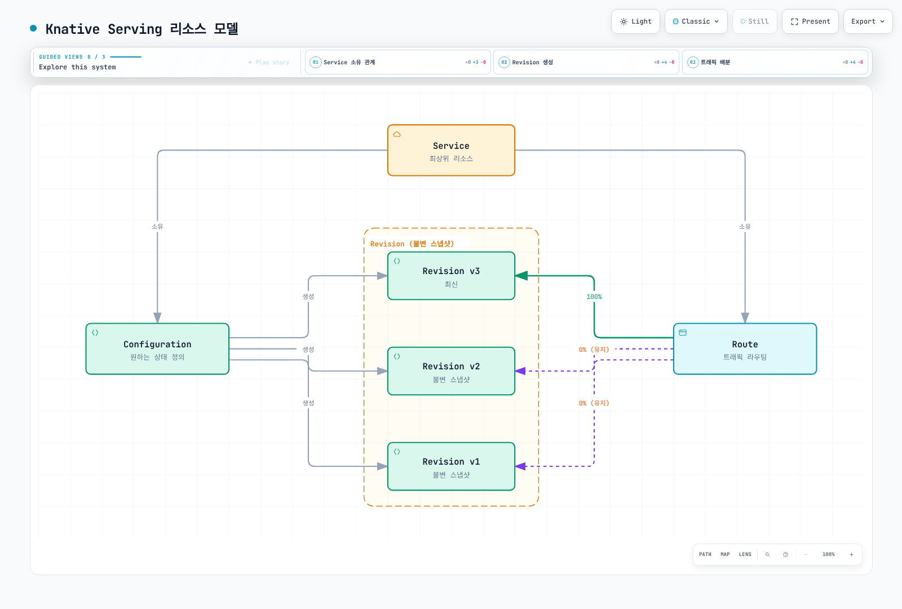
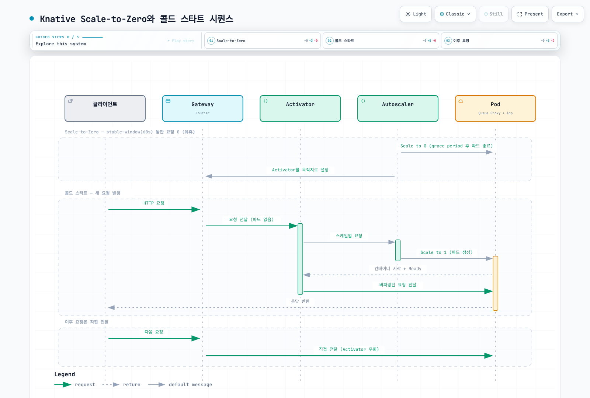
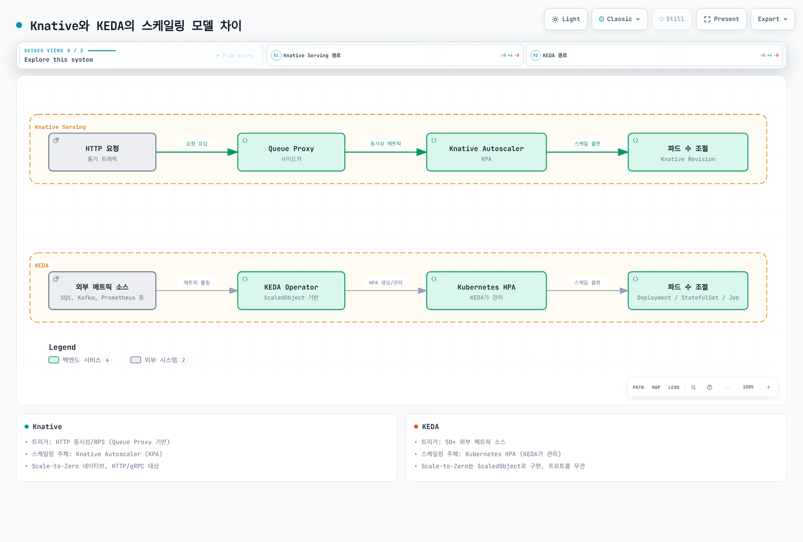

# Knative

> **예제 버전**: Serving/Eventing/Kourier 1.23.0, Operator 1.23.1. 설치 전 Kubernetes/EKS 호환성을 확인하세요.
> **마지막 업데이트**: 2026년 9월 11일

< [이전: Karpenter](02-karpenter.md) | 다음: 없음 >

## 목차

* [개요 및 학습 목표](03-knative.md#개요-및-학습-목표)
* [Knative 아키텍처](03-knative.md#knative-아키텍처)
* [EKS 설치 및 구성](03-knative.md#eks-설치-및-구성)
* [Knative Serving 심화](03-knative.md#knative-serving-심화)
* [Knative Eventing 심화](03-knative.md#knative-eventing-심화)
* [KEDA와 Knative 비교](03-knative.md#keda와-knative-비교)
* [프로덕션 운영](03-knative.md#프로덕션-운영)
* [모범 사례](03-knative.md#모범-사례)
* [참고 문서](03-knative.md#참고-문서)

***

## 개요 및 학습 목표

### Knative란?

Knative는 Kubernetes 위에서 서버리스(Serverless) 워크로드를 배포, 실행, 관리하기 위한 오픈 소스 플랫폼입니다. 2022년 CNCF Incubating 프로젝트로 승인되었으며, 2025년 9월 11일 **CNCF Graduated** 프로젝트로 졸업했습니다. 이 프로젝트 성숙도 분류가 개별 배포의 운영 준비 상태를 보장하지는 않습니다.

Knative는 개발자가 컨테이너 기반 애플리케이션을 서버리스 방식으로 운영할 수 있도록 두 가지 핵심 컴포넌트를 제공합니다:

* **Knative Serving**: HTTP 요청 기반의 서버리스 워크로드 배포 및 오토스케일링 (Scale-to-Zero 포함)
* **Knative Eventing**: 이벤트 드리븐 아키텍처를 위한 이벤트 소싱, 라우팅, 필터링 프레임워크

### Serverless on Kubernetes

전통적인 서버리스 플랫폼(AWS Lambda, Google Cloud Functions)은 특정 클라우드 벤더에 종속되는 반면, Knative는 Kubernetes가 실행되는 어디에서든 서버리스 경험을 제공합니다. 이를 통해 다음을 달성할 수 있습니다:

1. **이식 가능한 API**: 지원 Kubernetes 환경에서 공통 API를 사용하며 클라우드 인증·스토리지·네트워크 의존성은 별도 검증
2. **컨테이너 기반 실행**: PORT·HTTP·시작·준비 상태 등 Knative Serving 런타임 계약을 충족하는 이미지 사용
3. **Kubernetes 생태계 활용**: 기존 Kubernetes 도구, 모니터링, 보안 정책을 그대로 사용
4. **Scale-to-Zero**: 트래픽이 없을 때 파드를 0으로 축소하여 리소스 비용 절감

### Knative Serving vs Eventing

| 구분                | Knative Serving                         | Knative Eventing                               |
| ----------------- | --------------------------------------- | ---------------------------------------------- |
| **목적**            | HTTP 요청 기반 서버리스 워크로드                    | 이벤트 드리븐 아키텍처                                   |
| **트리거**           | HTTP 요청                                 | CloudEvents (Kafka, SQS, API Server 등)         |
| **스케일링**          | 동시 요청 수 기반 자동 스케일링                      | 이벤트 소스에 따라 다름                                  |
| **Scale-to-Zero** | 네이티브 지원                                 | 소비자 워크로드에 따라 다름                                |
| **주요 사용처**        | API 서버, 웹 앱, ML 추론                      | 비동기 처리, 데이터 파이프라인, 워크플로                        |
| **리소스 모델**        | Service, Configuration, Revision, Route | Source, Broker, Trigger, Channel, Subscription |

### Knative vs AWS Lambda/Fargate 비교

| 기능 | EKS의 Knative Serving | AWS Lambda(표준 컴퓨팅) | AWS Fargate |
|---|---|---|---|
| 런타임 | Serving 런타임 계약을 충족하는 컨테이너 | 지원 Lambda 런타임 또는 런타임 API를 구현한 이미지 | 지원 ECS task/EKS Pod; 플랫폼 제약 적용 |
| 요청·실행 수명 | 요청 타임아웃 설정 가능; 기본300초, 최대 허용값은 별도 설정 전600초 | 일반 함수 타임아웃 최대900초 | Lambda 호출 제한이 아닌 task/Pod 수명주기에 따름 |
| Scale-to-Zero | KPA가 유휴 Revision의0개 축소 지원 | 온디맨드 실행 | ECS desired task·Kubernetes replica를0으로 설정 가능; 활성화는 적절한 컨트롤러·메트릭 필요 |
| 콜드 스타트 | 기본 복제본·이미지·시작·준비 상태 조정 | 런타임별 최적화·Provisioned Concurrency | task/Pod 시작·이미지·네트워크 설정에 따라 다르며 고정 시간 비교 불가 |
| 메모리 | 노드 allocatable·컨테이너 요청·사이드카에 따라 다름 |128–10,240MB 설정 | EKS Fargate 슬롯 최대120GB; 플랫폼 오버헤드·CPU/메모리 조합 제약 적용 |
| GPU | 적합한 노드·디바이스 플러그인·리소스 요청·PodSpec 기능 활성화 필요 | 표준 Lambda 컴퓨팅에 GPU 없음 | Fargate는 GPU 미지원 |
| 네트워킹 | Kubernetes/CNI·게이트웨이 구성 | 고객 VPC 연결은 선택 사항 | VPC 네트워킹; EKS Fargate 플랫폼 제약 적용 |
| 이식성 | Kubernetes/Knative API 사용; 클라우드 인증·스토리지 통합은 별도 | AWS 런타임·서비스 API | ECS/EKS 통합과 지원 플랫폼 API |
| 이벤트 입력 | HTTP/CloudEvents·설정한 어댑터 | 지원 AWS 이벤트 통합 | 애플리케이션·컨트롤러 통합; 범용 이벤트 라우터는 아님 |
| 로컬 검증 | 로컬 Kubernetes가 도움이 되지만 클라우드 동작은 별도 검증 | 로컬 도구·에뮬레이터는 선택이며 재현 범위에 한계 | 컨테이너 로직은 로컬 시험 가능, 플랫폼 동작은 다름 |
| 관측성 | 메트릭·로그·추적 내보내기 구성 | CloudWatch·지원 추적 통합 | 지원 AWS/OpenTelemetry 수집 구성 |
| 비용 기준 | 할당된 클러스터·스토리지·로드밸런서·보조 리소스 | 요청·실행시간·선택한 기능 | 할당 task/Pod CPU·메모리와 관련 리소스 |

Lambda 열은 표준 컴퓨팅 기준입니다. Lambda Managed Instances의 지원되는 비동기·이벤트 소스 호출은 서비스별 예외를 두고 최대90분까지 허용할 수 있으며 운영 제약이 다릅니다. Pod가0개가 되어도 EC2 노드·영구 스토리지·로드밸런서 비용이 자동 제거되지는 않습니다.

### 학습 목표

이 문서를 통해 다음을 학습합니다:

1. Knative Serving과 Eventing의 아키텍처 및 핵심 컴포넌트 이해
2. Amazon EKS 클러스터에 Knative를 설치하고 구성하는 방법
3. Knative Service를 사용한 서버리스 워크로드 배포 및 트래픽 관리
4. Knative Eventing을 사용한 이벤트 드리븐 아키텍처 구현
5. KEDA와 Knative의 차이점과 적절한 사용 시나리오
6. 프로덕션 환경에서의 운영, 모니터링, 문제 해결 방법

***

## Knative 아키텍처

### Serving 아키텍처

Knative Serving은 서버리스 워크로드의 배포, 스케일링, 네트워킹을 관리하는 핵심 컴포넌트입니다.



[🔍 인터랙티브 다이어그램 보기](https://www.atomai.click/kubernetes-docs/archmaps/ko-autoscaling-03-knative-0.html)

#### 핵심 컴포넌트 설명

**1. Activator**

* Scale-to-Zero 상태에서 들어오는 첫 번째 요청을 버퍼링
* Autoscaler에 스케일업을 요청하고, 파드가 준비되면 요청을 전달
* 버스트 트래픽 시 요청 큐잉을 통한 과부하 방지

**2. Autoscaler**

* **KPA (Knative Pod Autoscaler)**: Knative 기본 오토스케일러. 동시 요청 수(concurrency) 또는 RPS(requests per second) 기반 스케일링. Scale-to-Zero 지원
* **HPA (Horizontal Pod Autoscaler)**: Kubernetes 기본 HPA 사용. CPU/메모리 기반 스케일링 가능하나 Scale-to-Zero 미지원

**3. Queue Proxy**

* 모든 Knative 파드에 사이드카로 주입되는 프록시 컨테이너
* 요청 큐잉, 동시성 제한(concurrency enforcement), 메트릭 수집 수행
* Autoscaler에 실시간 동시성 메트릭 보고
* 헬스체크 프로브 처리

**4. Controller**

* Knative Service, Configuration, Revision, Route 리소스의 생명주기 관리
* Kubernetes Deployment, Service, Ingress 등 하위 리소스 생성 및 동기화

**5. Webhook**

* Knative 리소스의 생성/수정 시 유효성 검사(Validation) 및 기본값 설정(Defaulting)

### Eventing 아키텍처

Knative Eventing은 느슨하게 결합된 이벤트 드리븐 아키텍처를 제공합니다.



[🔍 인터랙티브 다이어그램 보기](https://www.atomai.click/kubernetes-docs/archmaps/ko-autoscaling-03-knative-1.html)

#### Broker/Trigger 패턴

* **Broker**: 이벤트를 수신하고 등록된 Trigger에 따라 적절한 소비자에게 라우팅하는 이벤트 허브
* **Trigger**: Broker에 등록되는 이벤트 필터. CloudEvents 속성(type, source 등)으로 필터링하여 특정 서비스로 전달

#### Channel/Subscription 패턴

참조한 구독 서비스·reply Channel을 먼저 생성해야 합니다. reply는 구독자가 반환한 유효한 CloudEvent를 전달하며 빈204 승인 응답이 reply 이벤트를 만들지는 않습니다. Kafka 영속성도 KafkaChannel 종류만이 아니라 복제·보존·승인·장애 처리에 달려 있습니다.

* **Channel**: 이벤트를 임시 저장하고 전달하는 메시징 채널 (InMemoryChannel, KafkaChannel 등)
* **Subscription**: Channel의 이벤트를 특정 서비스로 구독하여 전달

#### Event Source

* **ApiServerSource**: Kubernetes API Server의 이벤트(리소스 생성/수정/삭제)를 CloudEvents로 변환
* **SinkBinding**: 기존 Kubernetes 워크로드에 이벤트 전송 기능을 주입
* **KafkaSource**: Apache Kafka 토픽의 메시지를 CloudEvents로 변환
* **SQSSource**: Amazon SQS 큐의 메시지를 CloudEvents로 변환

***

## EKS 설치 및 구성

설치 예제는 격리된 테스트 환경용이며 자리표시자를 포함합니다. LoadBalancer를 포함한 Serving을 적용하면 설치된 컨트롤러가 AWS 리소스를 만들 수 있으며 이번 감사에서는 실행하지 않았습니다. Operator 소유 ConfigMap·Service·워크로드는 KnativeServing/KnativeEventing으로 설정합니다. 병합 패치를 만들 때 기존 설정, 특히 배열 필드를 보존하세요. 뒤의 예제에 필요한 네임스페이스·ServiceAccount·Secret·이미지·Kafka/SQS 리소스·IAM 역할을 먼저 준비해야 하며 스키마 검사가 운영 준비 상태를 입증하지는 않습니다.

### 사전 요구 사항

```bash
kubectl config current-context
kubectl version -o yaml
kubectl get nodes
```

### Knative Operator를 사용한 설치

이 예제는 기존 테스트 클러스터에 Operator1.23.1과 Serving/Eventing/Kourier1.23.0을 새로 설치합니다. 기존1.16 설치를 한 번에 업그레이드하는 절차가 아닙니다. 지원되는 EKS 버전과 Knative 업그레이드 지침을 확인하세요.

```bash
# Fresh installation on the intended test cluster; review versioned upgrade guidance for existing installs.
kubectl config current-context
kubectl apply --server-side -f https://github.com/knative/operator/releases/download/knative-v1.23.1/operator.yaml
kubectl wait --for=condition=Established crd/knativeservings.operator.knative.dev crd/knativeeventings.operator.knative.dev --timeout=120s
kubectl wait --for=condition=Available deployment/knative-operator deployment/operator-webhook -n knative-operator --timeout=300s
```

```yaml
apiVersion: operator.knative.dev/v1beta1
kind: KnativeServing
metadata:
  name: knative-serving
  namespace: knative-serving
spec:
  version: 1.23.0
  ingress:
    kourier:
      enabled: true
  config:
    network:
      ingress-class: kourier.ingress.networking.knative.dev
    autoscaler:
      pod-autoscaler-class: kpa.autoscaling.knative.dev
      container-concurrency-target-percentage: '70'
      enable-scale-to-zero: 'true'
    defaults:
      revision-timeout-seconds: '300'
      max-revision-timeout-seconds: '600'
    deployment:
      queue-sidecar-cpu-request: 25m
      queue-sidecar-memory-request: 400Mi
      queue-sidecar-memory-limit: 800Mi
  services:
  - name: kourier
    annotations:
      service.beta.kubernetes.io/aws-load-balancer-type: external
      service.beta.kubernetes.io/aws-load-balancer-nlb-target-type: ip
      service.beta.kubernetes.io/aws-load-balancer-scheme: internet-facing
```

```bash
kubectl create namespace knative-serving --dry-run=client -o yaml | kubectl apply -f -
kubectl create namespace knative-demo --dry-run=client -o yaml | kubectl apply -f -
kubectl apply -f knative-serving.yaml
kubectl wait --for=condition=Ready knativeserving/knative-serving -n knative-serving --timeout=600s
kubectl get deployments,pods,services -n knative-serving
```

```yaml
apiVersion: operator.knative.dev/v1beta1
kind: KnativeEventing
metadata:
  name: knative-eventing
  namespace: knative-eventing
spec:
  version: 1.23.0
  defaultBrokerClass: MTChannelBasedBroker
  config:
    default-ch-webhook:
      default-ch-config: "clusterDefault:\n  apiVersion: messaging.knative.dev/v1\n\
        \  kind: InMemoryChannel\n"
  sinkBindingSelectionMode: inclusion
```

```bash
kubectl create namespace knative-eventing --dry-run=client -o yaml | kubectl apply -f -
kubectl apply -f knative-eventing.yaml
kubectl wait --for=condition=Ready knativeeventing/knative-eventing -n knative-eventing --timeout=600s
kubectl get deployments,pods -n knative-eventing
kubectl get crd inmemorychannels.messaging.knative.dev integrationsources.sources.knative.dev
```

### Kourier (경량 Ingress) 설치

Kourier는 Knative용 Envoy 기반 네트워킹 구현입니다. 지원 기능이 워크로드에 적합한지 확인하고 리소스·지연 이점은 측정해야 합니다. Operator 경로에서는 gateway Service가 `knative-serving`에 생성됩니다. 독립 수동 설치의 `kourier-system` 경로를 이 구성에 중복 적용하지 마세요.

```bash
# Operator-managed Kourier uses the KnativeServing namespace.
kubectl get deployment net-kourier-controller 3scale-kourier-gateway -n knative-serving
kubectl get service kourier -n knative-serving -o yaml
```

```bash
kubectl get service kourier -n knative-serving -o jsonpath='{.spec.loadBalancerClass}{"\n"}{.status.loadBalancer.ingress}{"\n"}'
```

### DNS 구성

Knative Service에는 실제 Route/DomainMapping 호스트와 일치하는 DNS가 필요합니다. 아래 예제는 AWS Load Balancer Controller가 관리하는 NLB를 가정하며 해당 컨트롤러·IAM·서브넷을 먼저 준비해야 합니다. Service 주석은 ALB를 만드는 설정이 아니고 EKS Auto Mode도 별도 관리 경로입니다.

#### Magic DNS (sslip.io) - 개발/테스트 환경용

sslip.io는 지원하는 IP 포함 이름을 해석합니다. AWS 로드밸런서 호스트명과 바뀔 수 있는 IP를 운영용 고정 DNS로 취급하지 마세요. 이 Operator 예제는 명시적 도메인을 사용하며 standalone default-domain 도우미로 Operator 소유 설정을 중복 변경하지 않습니다.

```bash
# Inspect the address type; this Operator workflow uses an explicitly configured domain.
kubectl get service kourier -n knative-serving -o jsonpath='{.status.loadBalancer.ingress}'
kubectl get ksvc -n knative-demo
```

#### Real DNS (Route53) - 프로덕션 환경용

제어하는 도메인·호스팅 영역과 생성된 변경 내용을 확인한 뒤 적용하세요. 아래 AWS 명령은 실행 시 해당 DNS 영역을 변경하며 이번 감사에서 실행하지 않았습니다. Terraform 코드는 별도의 구성 조각이므로 필요한 provider·조회 리소스를 정의하고 DNS 소유자를 하나로 정해야 합니다.

```bash
# Review the intended zone/domain and wait for the NLB hostname before preparing a DNS change.
set -euo pipefail
export KOURIER_HOST
KOURIER_HOST=$(kubectl get service kourier -n knative-serving -o jsonpath='{.status.loadBalancer.ingress[0].hostname}')
: "${KOURIER_HOST:?Wait for the load-balancer hostname}"
export KNATIVE_DOMAIN="knative.example.com"
export HOSTED_ZONE_ID="REPLACE_WITH_HOSTED_ZONE_ID"
python3 - <<'PYDNS'
import json, os
from pathlib import Path
host = os.environ["KOURIER_HOST"].strip()
if not host or any(c.isspace() for c in host):
    raise SystemExit("Invalid load-balancer hostname")
change = {"Changes": [{"Action": "UPSERT", "ResourceRecordSet": {
    "Name": "*." + os.environ["KNATIVE_DOMAIN"], "Type": "CNAME", "TTL": 300,
    "ResourceRecords": [{"Value": host}]
}}]}
Path("knative-dns-change.json").write_text(json.dumps(change, indent=2))
patch = {"spec": {"config": {"domain": {os.environ["KNATIVE_DOMAIN"]: ""}}}}
Path("knative-domain.patch.json").write_text(json.dumps(patch))
PYDNS
# These commands change the selected DNS zone and Operator configuration when run.
aws route53 change-resource-record-sets --hosted-zone-id "$HOSTED_ZONE_ID" --change-batch file://knative-dns-change.json
kubectl patch knativeserving knative-serving -n knative-serving --type merge --patch-file knative-domain.patch.json
```

```hcl
# Provider 인증과 기존 hosted zone은 별도로 구성합니다.
data "kubernetes_service_v1" "kourier" {
  metadata {
    name      = "kourier"
    namespace = "knative-serving"
  }
}

variable "hosted_zone_id" {
  type = string
}

resource "aws_route53_record" "knative_wildcard" {
  zone_id = var.hosted_zone_id
  name    = "*.knative.example.com"
  type    = "CNAME"
  ttl     = 300
  records = [data.kubernetes_service_v1.kourier.status[0].load_balancer[0].ingress[0].hostname]
}
```

#### ExternalDNS 연동

ExternalDNS의 `knative-serving` 소스·DNS 권한·도메인 필터가 필요합니다. 주석만으로 새로운 Knative Route가 생기지는 않으므로 실제 Service URL 또는 DomainMapping 호스트와 일치시켜야 합니다. 같은 레코드를 Terraform·수동 명령과 동시에 관리하지 마세요.

```yaml
apiVersion: serving.knative.dev/v1
kind: Service
metadata:
  name: my-app
  annotations:
    external-dns.alpha.kubernetes.io/hostname: my-app.knative-demo.knative.example.com
  namespace: knative-demo
spec:
  template:
    spec:
      containers:
      - image: my-app:latest
```

### Cert-manager TLS 연동

Serving1.23 컨트롤러에 cert-manager 통합이 포함되어 있으므로 보관된 net-certmanager 저장소의 별도 릴리스를 설치하지 않습니다. 호환 cert-manager와 Route53 DNS01용 별도 IAM 인증·권한을 먼저 준비하세요. 처음에는 staging 발급자로 검증하며 staging 인증서는 공개적으로 신뢰되지 않습니다. 발급·갱신을 검증한 뒤 운영 발급자로 전환하세요.

```yaml
apiVersion: cert-manager.io/v1
kind: ClusterIssuer
metadata:
  name: letsencrypt-staging
spec:
  acme:
    server: https://acme-staging-v02.api.letsencrypt.org/directory
    email: REPLACE_WITH_CERTIFICATE_CONTACT_EMAIL
    privateKeySecretRef:
      name: letsencrypt-staging-key
    solvers:
    - dns01:
        route53:
          region: us-west-2
          hostedZoneID: REPLACE_WITH_HOSTED_ZONE_ID
```

위 발급자를 `cluster-issuer.yaml`, 다음 Operator 병합 패치를 `serving-tls.patch.yaml`로 저장하세요.

```yaml
spec:
  config:
    network:
      certificate-class: cert-manager.certificate.networking.knative.dev
      external-domain-tls: Enabled
      http-protocol: Redirected
    certmanager:
      issuerRef: |
        group: cert-manager.io
        kind: ClusterIssuer
        name: letsencrypt-staging
```

```bash
# cert-manager and its Route 53 identity must already be configured.
kubectl apply -f cluster-issuer.yaml
kubectl wait --for=condition=Ready clusterissuer/letsencrypt-staging --timeout=180s
kubectl patch knativeserving knative-serving -n knative-serving --type merge --patch-file serving-tls.patch.yaml
# The integration starts in the Serving controller after the setting is effective.
kubectl get configmap config-network -n knative-serving -o yaml
kubectl rollout restart deployment/controller -n knative-serving
kubectl rollout status deployment/controller -n knative-serving --timeout=300s
```

### HPA vs KPA 오토스케일러 선택

| 기준                | KPA (Knative Pod Autoscaler) | HPA (Horizontal Pod Autoscaler) |
| ----------------- | ---------------------------- | ------------------------------- |
| **Scale-to-Zero** | 지원                           | 미지원 (최소 1 파드)                   |
| **메트릭**           | 동시 요청 수, RPS                 | CPU, 메모리, 커스텀 메트릭               |
| **반응 속도**         | 빠름 (초 단위)                    | 보통 (15-30초)                     |
| **안정 구간**         | 60초 (설정 가능)                  | 5분 (기본)                         |
| **사용 사례**         | HTTP 워크로드, Scale-to-Zero 필요  | CPU/메모리 바운드 워크로드                |

```yaml
spec:
  additionalManifests:
  - URL: https://github.com/knative/serving/releases/download/knative-v1.23.0/serving-hpa.yaml
  config:
    autoscaler:
      pod-autoscaler-class: kpa.autoscaling.knative.dev
      stable-window: 60s
      panic-window-percentage: '10'
      panic-threshold-percentage: '200'
      scale-to-zero-grace-period: 30s
      scale-to-zero-pod-retention-period: 0s
      target-burst-capacity: '211'
      requests-per-second-target-default: '200'
      container-concurrency-target-default: '100'
```

`serving-autoscaler.patch.yaml`로 저장해 기존 Operator 리소스에 병합합니다. 기존 `additionalManifests`가 있다면 함께 보존하세요.

```bash
kubectl patch knativeserving knative-serving -n knative-serving --type merge --patch-file serving-autoscaler.patch.yaml
kubectl get deployment autoscaler-hpa -n knative-serving
```

```yaml
apiVersion: serving.knative.dev/v1
kind: Service
metadata:
  name: kpa-service
  namespace: knative-demo
spec:
  template:
    metadata:
      annotations:
        autoscaling.knative.dev/class: kpa.autoscaling.knative.dev
        autoscaling.knative.dev/metric: concurrency
        autoscaling.knative.dev/target: '100'
    spec:
      containers:
      - image: my-app:latest
---
apiVersion: serving.knative.dev/v1
kind: Service
metadata:
  name: hpa-service
  namespace: knative-demo
spec:
  template:
    metadata:
      annotations:
        autoscaling.knative.dev/class: hpa.autoscaling.knative.dev
        autoscaling.knative.dev/metric: cpu
        autoscaling.knative.dev/target: '70'
    spec:
      containers:
      - image: my-app:latest
        resources:
          requests:
            cpu: 500m
          limits:
            cpu: '1'
```

***

## Knative Serving 심화

### 리소스 모델

Knative Serving의 네 가지 핵심 리소스는 다음과 같이 연결됩니다:



[🔍 인터랙티브 다이어그램 보기](https://www.atomai.click/kubernetes-docs/archmaps/ko-autoscaling-03-knative-2.html)

* **Service**: 전체 서버리스 워크로드를 정의하는 최상위 리소스. Configuration과 Route를 자동으로 관리
* **Configuration**: 워크로드 템플릿을 정의하며 해당 템플릿 변경이 새 Revision을 생성합니다. 메타데이터·트래픽 변경마다 생성되는 것은 아닙니다.
* **Revision**: 불변 워크로드 spec이며 외부 Secret·ConfigMap·스토리지 상태까지 고정하지 않습니다. 보존·GC 정책이 롤백 가능한 Revision을 결정합니다.
* **Route**: 트래픽을 하나 이상의 Revision으로 라우팅. 비율 기반 트래픽 분할 지원

### 완전한 Knative Service YAML

참조한 이미지·ServiceAccount·Secret을 먼저 준비하세요. Serving 컨트롤러의 레지스트리 태그/다이제스트 해석과 노드의 이미지 다운로드는 별도로 가능해야 하며 EKS 노드 권한만으로 컨트롤러 접근이 보장되지는 않습니다. 프로브 경로는 실제 앱에 맞추고 하위 시스템 장애가 재시작 폭주를 만들지 않게 설계하세요.

```yaml
apiVersion: serving.knative.dev/v1
kind: Service
metadata:
  name: order-api
  namespace: knative-demo
  labels:
    app: order-api
    team: backend
  annotations: {}
spec:
  template:
    metadata:
      annotations:
        autoscaling.knative.dev/metric: concurrency
        autoscaling.knative.dev/target: '100'
        autoscaling.knative.dev/min-scale: '2'
        autoscaling.knative.dev/max-scale: '50'
        autoscaling.knative.dev/initial-scale: '3'
        autoscaling.knative.dev/scale-down-delay: 15m
        autoscaling.knative.dev/window: 60s
        autoscaling.knative.dev/class: kpa.autoscaling.knative.dev
      labels:
        app: order-api
        version: v1
      name: order-api-v1
    spec:
      containerConcurrency: 0
      timeoutSeconds: 300
      serviceAccountName: order-api-sa
      containers:
      - image: 123456789012.dkr.ecr.ap-northeast-2.amazonaws.com/order-api:v1.2.3
        ports:
        - containerPort: 8080
          protocol: TCP
        env:
        - name: DB_HOST
          valueFrom:
            secretKeyRef:
              name: db-credentials
              key: host
        - name: LOG_LEVEL
          value: info
        resources:
          requests:
            cpu: 500m
            memory: 512Mi
          limits:
            cpu: '2'
            memory: 2Gi
        readinessProbe:
          httpGet:
            path: /healthz
            port: 8080
          initialDelaySeconds: 5
          periodSeconds: 10
        livenessProbe:
          httpGet:
            path: /healthz
            port: 8080
          initialDelaySeconds: 15
          periodSeconds: 20
```

### 트래픽 분할

#### Canary 배포

위의 완전한 기본 Service와 준비된 `order-api-v1`에서 시작하는 대안 실습입니다. 이미지·이름을 검증한 값으로 교체하고 템플릿을 변경할 때마다 사용하지 않은 Revision 이름을 지정하세요. JSON 패치는 containers 목록 전체를 바꾸지 않고 환경 변수·ServiceAccount·프로브·리소스를 보존하며 기본 예제의 수신 컨테이너가 index0이라고 가정합니다.0% 태그는 테스트 경로를 제공하지만 전체 용량의 준비를 보장하지 않습니다.

`canary-template.patch.json`로 저장합니다:

```json
[
  {
    "op": "add",
    "path": "/spec/traffic",
    "value": [
      {
        "revisionName": "order-api-v1",
        "percent": 100
      },
      {
        "revisionName": "order-api-v2",
        "percent": 0,
        "tag": "canary"
      }
    ]
  },
  {
    "op": "add",
    "path": "/spec/template/metadata/name",
    "value": "order-api-v2"
  },
  {
    "op": "replace",
    "path": "/spec/template/spec/containers/0/image",
    "value": "123456789012.dkr.ecr.ap-northeast-2.amazonaws.com/order-api:v2.0.0"
  }
]
```

```bash
kubectl wait --for=condition=Ready revision/order-api-v1 -n knative-demo --timeout=300s
kubectl patch ksvc order-api -n knative-demo --type json --patch-file canary-template.patch.json
kubectl wait --for=jsonpath='{.status.latestCreatedRevisionName}'=order-api-v2 ksvc/order-api -n knative-demo --timeout=180s
kubectl wait --for=condition=Ready revision/order-api-v2 -n knative-demo --timeout=300s
kubectl get ksvc order-api -n knative-demo -o jsonpath='{.status.traffic}'

# Route10%, then50%, then100% only after validating each stage.
kubectl patch ksvc order-api -n knative-demo --type merge --patch '{"spec":{"traffic":[{"revisionName":"order-api-v1","percent":90},{"revisionName":"order-api-v2","percent":10,"tag":"canary"}]}}'
kubectl patch ksvc order-api -n knative-demo --type merge --patch '{"spec":{"traffic":[{"revisionName":"order-api-v1","percent":50},{"revisionName":"order-api-v2","percent":50,"tag":"canary"}]}}'
kubectl patch ksvc order-api -n knative-demo --type merge --patch '{"spec":{"traffic":[{"revisionName":"order-api-v1","percent":0},{"revisionName":"order-api-v2","percent":100,"tag":"canary"}]}}'
```

태그 URL은 도메인·태그 템플릿과 TLS 설정에 따라 달라지므로 `status.traffic`에서 확인하세요. 변경마다 Route 준비 상태·반영된 설정·애플리케이션 지표를 확인합니다. 비율은 라우팅 정책이며 작은 요청 표본의 정확한 건수를 보장하지 않습니다.

#### Blue-Green 배포

기본 `order-api-v1`에서 별도로 실습하거나 현재 검증된 기준 트래픽을 처리하는 Revision 이름으로 stable 대상을 수정하세요. 다음을 `green-template.patch.json`로 저장합니다:

```json
[
  {
    "op": "add",
    "path": "/spec/traffic",
    "value": [
      {
        "revisionName": "order-api-v1",
        "percent": 100
      },
      {
        "revisionName": "order-api-green",
        "percent": 0,
        "tag": "green"
      }
    ]
  },
  {
    "op": "add",
    "path": "/spec/template/metadata/name",
    "value": "order-api-green"
  },
  {
    "op": "replace",
    "path": "/spec/template/spec/containers/0/image",
    "value": "123456789012.dkr.ecr.ap-northeast-2.amazonaws.com/order-api:v2.0.0"
  }
]
```

```bash
kubectl patch ksvc order-api -n knative-demo --type json --patch-file green-template.patch.json
kubectl wait --for=jsonpath='{.status.latestCreatedRevisionName}'=order-api-green ksvc/order-api -n knative-demo --timeout=180s
kubectl wait --for=condition=Ready revision/order-api-green -n knative-demo --timeout=300s
kubectl get ksvc order-api -n knative-demo -o jsonpath='{.status.traffic}'
# Validate the green tag URL and capacity before requesting this switch.
kubectl patch ksvc order-api -n knative-demo --type merge --patch '{"spec":{"traffic":[{"revisionName":"order-api-v1","percent":0},{"revisionName":"order-api-green","percent":100,"tag":"green"}]}}'
```

트래픽 변경은 비동기로 반영되며 연결·진행 중 요청은 이전 Revision을 계속 사용할 수 있습니다. 롤백을 위해 이전 Revision과 외부 의존성을 보존하고 실제 전파·준비 시간을 측정하세요. 이 명령을 실제 클러스터에서 실행하지 않았습니다.

### Scale-to-Zero 동작 원리

Scale-to-Zero는 Knative의 핵심 기능으로, 트래픽이 없을 때 파드를 0으로 축소하여 리소스를 절약합니다.



[🔍 인터랙티브 다이어그램 보기](https://www.atomai.click/kubernetes-docs/archmaps/ko-autoscaling-03-knative-3.html)

**동작 단계:**

1. **유휴 감지**: Autoscaler가 `stable-window` (기본 60초) 동안 동시 요청 수가 0인 것을 감지
2. **네트워크 준비**: `scale-to-zero-grace-period`(기본30초)는 마지막 Pod 제거 전 제로 활성화 경로 준비의 상한이며 마지막 요청 후30초 보존을 보장하지 않습니다.
3. **Activator 경로 확인**: 마지막 복제본 제거 전 내부 라우팅을 준비합니다. 별도 retention 설정은 제로 축소 결정 후 마지막 Pod의 최소 유지 시간을 제어합니다.
4. **콜드 스타트**: 새 요청이 오면 Activator가 버퍼링하고 Autoscaler에 스케일업 요청
5. **요청 전달**: 파드가 Ready 상태가 되면 버퍼링된 요청을 전달

### Concurrency 기반 스케일링

```yaml
apiVersion: serving.knative.dev/v1
kind: Service
metadata:
  name: concurrency-demo
  namespace: knative-demo
spec:
  template:
    metadata:
      annotations:
        autoscaling.knative.dev/target: '10'
        autoscaling.knative.dev/metric: concurrency
        autoscaling.knative.dev/target-utilization-percentage: '70'
    spec:
      containerConcurrency: 50
      containers:
      - image: my-app:latest
```

Readiness는 실제 준비 상태를 검증해야 하며 프로브 간격을 줄이는 것만으로 앱·모델 초기화가 빨라지지는 않습니다. `containerConcurrency: 1`도 모든 복제본의 전역 직렬 처리나 컨테이너 내부 스레드 안전성을 보장하지 않습니다.

**소프트 타겟 vs 하드 리밋:**

* `autoscaling.knative.dev/target` (소프트): Autoscaler의 스케일링 목표. 이 값을 기준으로 파드 수 계산
* `containerConcurrency` (하드): Queue Proxy가 강제하는 절대 최대 동시성. 초과 요청은 큐잉되거나 503 반환

**스케일링 계산 예시:**

* 현재 동시 요청: 70
* Target: 10, Utilization: 70%
* 실제 타겟: 10 \* 0.7 = 7
* 필요 파드 수: 70 / 7 = 10개

### 콜드 스타트 최적화

```yaml
apiVersion: serving.knative.dev/v1
kind: Service
metadata:
  name: low-latency-api
  namespace: knative-demo
spec:
  template:
    metadata:
      annotations:
        autoscaling.knative.dev/min-scale: '2'
        autoscaling.knative.dev/initial-scale: '3'
        autoscaling.knative.dev/scale-down-delay: 5m
        autoscaling.knative.dev/window: 120s
    spec:
      containers:
      - image: my-app:latest
        resources:
          requests:
            cpu: '1'
            memory: 1Gi
        readinessProbe:
          httpGet:
            path: /ready
            port: 8080
          initialDelaySeconds: 1
          periodSeconds: 2
          timeoutSeconds: 1
          failureThreshold: 3
```

사전 풀 DaemonSet 예시는 셸을 포함하는 NGINX1.30.4를 캐시합니다. 실제 앱에는 그 이미지에 유효한 명령·동일 다이제스트·아키텍처가 필요합니다. Distroless에 셸이 있다고 가정하지 마세요. Fargate는 DaemonSet 미지원이며 노드 교체·이미지 GC로 캐시가 사라질 수 있습니다.

**콜드 스타트 최적화 전략:**

| 전략                | 설정                       | 효과                       |
| ----------------- | ------------------------ | ------------------------ |
| 최소 인스턴스 유지 | `min-scale: 1+` | 일반적인 유휴 제로 축소 방지; 새 Revision·재시작·추가 확장에는 초기화가 남음 |
| 초기 스케일 설정         | `initial-scale: N`       | 첫 배포 시 빠른 응답             |
| 스케일 다운 지연         | `scale-down-delay: 5m`   | 간헐적 트래픽에서 불필요한 스케일 다운 방지 |
| 컨테이너 이미지 최적화      | 경량 베이스 이미지 사용            | 이미지 풀 시간 단축              |
| Readiness 프로브 최적화 | 짧은 `initialDelaySeconds` | 트래픽 수신 시작 시간 단축          |
| 이미지 사전 풀 | 호환 EC2 노드의 사전 캐시 | 같은 다이제스트·아키텍처·남아 있는 캐시에 한해 다운로드를 줄임; Fargate는 DaemonSet 미지원 |

### Private/Public 서비스

```yaml
apiVersion: serving.knative.dev/v1
kind: Service
metadata:
  name: public-api
  labels: {}
  namespace: knative-demo
spec:
  template:
    spec:
      containers:
      - image: order-api:latest
---
apiVersion: serving.knative.dev/v1
kind: Service
metadata:
  name: internal-processor
  labels:
    networking.knative.dev/visibility: cluster-local
  namespace: knative-demo
spec:
  template:
    spec:
      containers:
      - image: my-processor:latest
```

```bash
# Private 서비스 접근 방식 (클러스터 내부에서)
# http://internal-processor.knative-demo.svc.cluster.local
curl http://internal-processor.knative-demo.svc.cluster.local
```

***

## Knative Eventing 심화

### Event Source

#### ApiServerSource

Kubernetes API Server의 이벤트를 CloudEvents로 변환하여 전달합니다.

```yaml
apiVersion: v1
kind: ServiceAccount
metadata:
  name: k8s-events-sa
  namespace: knative-demo
---
apiVersion: rbac.authorization.k8s.io/v1
kind: Role
metadata:
  name: k8s-events-reader
  namespace: knative-demo
rules:
- apiGroups:
  - ''
  resources:
  - pods
  verbs:
  - get
  - list
  - watch
- apiGroups:
  - apps
  resources:
  - deployments
  verbs:
  - get
  - list
  - watch
---
apiVersion: rbac.authorization.k8s.io/v1
kind: RoleBinding
metadata:
  name: k8s-events-reader
  namespace: knative-demo
subjects:
- kind: ServiceAccount
  name: k8s-events-sa
  namespace: knative-demo
roleRef:
  apiGroup: rbac.authorization.k8s.io
  kind: Role
  name: k8s-events-reader
---
apiVersion: rbac.authorization.k8s.io/v1
kind: ClusterRole
metadata:
  name: knative-demo-namespace-discovery
rules:
- apiGroups:
  - ''
  resources:
  - namespaces
  verbs:
  - get
  - list
  - watch
---
apiVersion: rbac.authorization.k8s.io/v1
kind: ClusterRoleBinding
metadata:
  name: knative-demo-namespace-discovery
subjects:
- kind: ServiceAccount
  name: k8s-events-sa
  namespace: knative-demo
roleRef:
  apiGroup: rbac.authorization.k8s.io
  kind: ClusterRole
  name: knative-demo-namespace-discovery
---
apiVersion: sources.knative.dev/v1
kind: ApiServerSource
metadata:
  name: k8s-events
  namespace: knative-demo
spec:
  resources:
  - apiVersion: v1
    kind: Pod
  - apiVersion: apps/v1
    kind: Deployment
  mode: Reference
  sink:
    ref:
      apiVersion: eventing.knative.dev/v1
      kind: Broker
      name: default
  serviceAccountName: k8s-events-sa
  namespaceSelector:
    matchLabels:
      kubernetes.io/metadata.name: knative-demo
```

#### SinkBinding

Eventing 설정은 inclusion 모드를 사용합니다. 데모 네임스페이스만 주입 대상으로 표시하고 subject Deployment의 네임스페이스·메타데이터 이름/라벨이 맞는지 확인하세요. 이미 실행 중인 워크로드는 주입된 환경을 사용하기 위해 정상 롤아웃이 필요할 수 있습니다:

```bash
kubectl label namespace knative-demo bindings.knative.dev/include=true --overwrite
```

SinkBinding은 목적지 `K_SINK`와 `K_CE_OVERRIDES`를 주입합니다. 애플리케이션이 이를 읽어 전송해야 하며 임의의 HTTP 요청을 자동으로 바꾸지 않습니다. 아래 생산자는 올바른 구조화 CloudEvent, 타임아웃·응답 확인을 사용합니다. 동일한 논리 이벤트를 재시도할 때는 `event_id`를 유지하세요.

```yaml
apiVersion: sources.knative.dev/v1
kind: SinkBinding
metadata:
  name: order-events-binding
  namespace: knative-demo
spec:
  subject:
    apiVersion: apps/v1
    kind: Deployment
    selector:
      matchLabels:
        app: order-service
  sink:
    ref:
      apiVersion: eventing.knative.dev/v1
      kind: Broker
      name: default
  ceOverrides:
    extensions:
      team: commerce
      producer: /orders/api
```

```python
import json
import os
import re

import requests
from cloudevents.http import CloudEvent
from cloudevents.conversion import to_structured

CORE_ATTRIBUTES = {"specversion", "id", "source", "type", "time", "subject", "datacontenttype", "dataschema"}


def emit_order_event(order_id, event_type, data, event_id):
    """Use one stable event_id for retries of the same logical event."""
    attributes = {
        "specversion": "1.0", "id": event_id,
        "type": f"com.example.order.{event_type}",
        "source": "/orders/api", "subject": f"order/{order_id}",
        "datacontenttype": "application/json",
    }
    overrides = json.loads(os.environ.get("K_CE_OVERRIDES", "{}"))
    for key, value in overrides.get("extensions", {}).items():
        if key in CORE_ATTRIBUTES or not re.fullmatch(r"[a-z0-9]+", key):
            raise ValueError("Only valid extension attributes may be overridden")
        attributes[key] = value
    event = CloudEvent(attributes, data)
    headers, body = to_structured(event)
    response = requests.post(
        os.environ["K_SINK"], data=body, headers=headers, timeout=(3, 10)
    )
    response.raise_for_status()
    return response.status_code
```

#### KafkaSource

KafkaSource·KafkaChannel에는 해당 Kafka 확장과 설정된 기존 Kafka 클러스터가 필요합니다(bootstrap/TLS/SASL과 복제 계수에 충분한 브로커 포함). 다음1.23.1 URL을 기존 additionalManifests와 합쳐 KnativeEventing으로 관리하고 같은 확장을 다른 경로에서 동시에 관리하지 마세요. eventing-kafka.patch.yaml로 저장합니다:

```yaml
spec:
  additionalManifests:
  - URL: https://github.com/knative-extensions/eventing-kafka-broker/releases/download/knative-v1.23.1/eventing-kafka-controller.yaml
  - URL: https://github.com/knative-extensions/eventing-kafka-broker/releases/download/knative-v1.23.1/eventing-kafka-source.yaml
  - URL: https://github.com/knative-extensions/eventing-kafka-broker/releases/download/knative-v1.23.1/eventing-kafka-channel.yaml
```

```bash
kubectl patch knativeeventing knative-eventing -n knative-eventing --type merge --patch-file eventing-kafka.patch.yaml
GENERATION=$(kubectl get knativeeventing knative-eventing -n knative-eventing -o jsonpath='{.metadata.generation}')
kubectl wait --for=jsonpath='{.status.observedGeneration}'="$GENERATION" knativeeventing/knative-eventing -n knative-eventing --timeout=600s
kubectl wait --for=condition=Ready knativeeventing/knative-eventing -n knative-eventing --timeout=600s
kubectl get crd kafkasources.sources.knative.dev kafkachannels.messaging.knative.dev
```

```yaml
apiVersion: sources.knative.dev/v1
kind: KafkaSource
metadata:
  name: kafka-order-events
  namespace: knative-demo
spec:
  consumerGroup: knative-order-consumer
  bootstrapServers:
  - kafka-bootstrap.kafka:9092
  topics:
  - orders
  - order-updates
  net:
    sasl:
      enable: true
      type:
        secretKeyRef:
          name: kafka-credentials
          key: sasl-type
      user:
        secretKeyRef:
          name: kafka-credentials
          key: user
      password:
        secretKeyRef:
          name: kafka-credentials
          key: password
    tls:
      enable: true
  sink:
    ref:
      apiVersion: eventing.knative.dev/v1
      kind: Broker
      name: default
```

#### SQSSource (AWS 연동)

보관된 TriggerMesh 예제를1.23 core의 alpha IntegrationSource로 대체했습니다. 기존 전용 테스트 큐와 IRSA 역할을 준비하고 ReceiveMessage/DeleteMessage/GetQueueAttributes/GetQueueUrl 권한을 해당 큐로 제한하세요. 실행하면 메시지를 소비·삭제하며 이번 감사에서는 배포하지 않았습니다. autoCreateQueue는 false입니다. 실제 adapter의 CloudEvent type/source와 승인·가시성 시간 제한·실패 동작을 확인해야 하며 수동 주문 이벤트용 Trigger 필터를 그대로 적용할 수 있다고 가정하지 마세요. EKS Pod Identity는 지원되는 EC2 Pod에서만 대안이며 Fargate에서는 사용할 수 없습니다.

```yaml
apiVersion: v1
kind: ServiceAccount
metadata:
  name: sqs-event-source
  namespace: knative-demo
  annotations:
    eks.amazonaws.com/role-arn: arn:aws:iam::123456789012:role/KnativeSqsSourceRole
---
apiVersion: sources.knative.dev/v1alpha1
kind: IntegrationSource
metadata:
  name: sqs-order-events
  namespace: knative-demo
spec:
  aws:
    sqs:
      arn: arn:aws:sqs:us-west-2:123456789012:knative-demo-orders
      region: us-west-2
      autoCreateQueue: false
      deleteAfterRead: true
      visibilityTimeout: 120
    auth:
      serviceAccountName: sqs-event-source
  sink:
    ref:
      apiVersion: eventing.knative.dev/v1
      kind: Broker
      name: default
```

### Broker/Trigger 패턴

#### 완전한 Broker/Trigger YAML

```yaml
apiVersion: v1
kind: ConfigMap
metadata:
  name: demo-broker-channel
  namespace: knative-demo
data:
  channel-template-spec: |
    apiVersion: messaging.knative.dev/v1
    kind: InMemoryChannel
---
apiVersion: eventing.knative.dev/v1
kind: Broker
metadata:
  name: default
  namespace: knative-demo
  annotations:
    eventing.knative.dev/broker.class: MTChannelBasedBroker
spec:
  config:
    apiVersion: v1
    kind: ConfigMap
    name: demo-broker-channel
    namespace: knative-demo
  delivery:
    deadLetterSink:
      ref:
        apiVersion: serving.knative.dev/v1
        kind: Service
        name: dead-letter-handler
    retry: 3
    backoffPolicy: exponential
    backoffDelay: PT2S
---
apiVersion: eventing.knative.dev/v1
kind: Trigger
metadata:
  name: order-created-trigger
  namespace: knative-demo
spec:
  broker: default
  filter:
    attributes:
      type: com.example.order.created
      source: /orders/api
  subscriber:
    ref:
      apiVersion: serving.knative.dev/v1
      kind: Service
      name: order-processor
    uri: /process
  delivery:
    deadLetterSink:
      ref:
        apiVersion: serving.knative.dev/v1
        kind: Service
        name: order-dlq-handler
    retry: 5
    backoffPolicy: exponential
    backoffDelay: PT1S
---
apiVersion: eventing.knative.dev/v1
kind: Trigger
metadata:
  name: payment-processed-trigger
  namespace: knative-demo
spec:
  broker: default
  filter:
    attributes:
      type: com.example.payment.processed
  subscriber:
    ref:
      apiVersion: serving.knative.dev/v1
      kind: Service
      name: shipping-service
---
apiVersion: eventing.knative.dev/v1
kind: Trigger
metadata:
  name: audit-all-events
  namespace: knative-demo
spec:
  broker: default
  subscriber:
    ref:
      apiVersion: serving.knative.dev/v1
      kind: Service
      name: audit-logger
```

### CloudEvents 표준

아래 수신기는 형식 확인과 수신 승인 데모입니다. 주문·결제 트랜잭션을 구현하지 않으며 실제 소비자는 처리·멱등성 기록을 완료한 뒤 승인해야 합니다. 각 Python 예제는 별도 이미지의 `app.py`로 저장하고 WSGI 서버로 실행하세요.

Knative Eventing은 **CloudEvents v1.0** 사양을 표준 이벤트 형식으로 사용합니다.

```json
{
  "specversion": "1.0",
  "type": "com.example.order.created",
  "source": "/orders/api",
  "id": "a1b2c3d4-e5f6-7890-abcd-ef1234567890",
  "time": "2025-06-15T10:30:00Z",
  "datacontenttype": "application/json",
  "subject": "order/12345",
  "data": {
    "orderId": "12345",
    "customerId": "C001",
    "items": [
      {"productId": "P100", "quantity": 2, "price": 29900}
    ],
    "totalAmount": 59800
  }
}
```

```python
import json

from flask import Flask, request
from cloudevents.http import from_http


def create_app():
    app = Flask(__name__)
    app.config["MAX_CONTENT_LENGTH"] = 1024 * 1024

    @app.post("/")
    def receive_event():
        try:
            event = from_http(request.headers, request.get_data())
            metadata = {key: event[key] for key in ("source", "id", "type")}
        except Exception:
            # This boundary converts malformed input into a client error.
            return "invalid CloudEvent", 400
        app.logger.info("Received CloudEvent metadata: %s", json.dumps(metadata))
        # Receipt-only demo. Real consumers must commit processing before acknowledging.
        return "", 204

    return app
```

### Channel/Subscription 패턴

```yaml
apiVersion: messaging.knative.dev/v1
kind: KafkaChannel
metadata:
  name: order-events-channel
  namespace: knative-demo
spec:
  numPartitions: 6
  replicationFactor: 3
  retentionDuration: PT168H
---
apiVersion: messaging.knative.dev/v1
kind: Subscription
metadata:
  name: analytics-subscription
  namespace: knative-demo
spec:
  channel:
    apiVersion: messaging.knative.dev/v1
    kind: KafkaChannel
    name: order-events-channel
  subscriber:
    ref:
      apiVersion: serving.knative.dev/v1
      kind: Service
      name: analytics-service
    uri: /events/orders
  reply:
    ref:
      apiVersion: messaging.knative.dev/v1
      kind: KafkaChannel
      name: analytics-results-channel
  delivery:
    deadLetterSink:
      ref:
        apiVersion: serving.knative.dev/v1
        kind: Service
        name: dlq-handler
    retry: 3
    backoffPolicy: linear
    backoffDelay: PT5S
---
apiVersion: messaging.knative.dev/v1
kind: Subscription
metadata:
  name: notification-subscription
  namespace: knative-demo
spec:
  channel:
    apiVersion: messaging.knative.dev/v1
    kind: KafkaChannel
    name: order-events-channel
  subscriber:
    ref:
      apiVersion: serving.knative.dev/v1
      kind: Service
      name: notification-service
```

### Dead Letter Sink

처리기 이미지는 Flask·CloudEvents·boto3·Gunicorn과 아래 `app.py`로 직접 빌드해야 합니다. 기존의 보호된 버킷, 전용 ServiceAccount의 제한된 `s3:PutObject`·필요한 KMS 권한, 통신 경로가 필요합니다. `S3_BUCKET`·`AWS_REGION`을 설정하고 정적 AWS 자격 증명을 넣지 마세요. 실행 예시는 `gunicorn --bind 0.0.0.0:8080 --workers 1 --threads 4 --timeout 90 --graceful-timeout 60 app:create_app()`이며 Knative·프록시·Pod 종료 기한과 맞춰 검증해야 합니다.

DLS는 구독자 전달 실패 시 사용하는 설정된 대체 목적지입니다. DLS 자체도 실패할 수 있으며 영속 저장은 처리기와 저장소가 구현해야 합니다. 저장 성공 후 승인하고 CloudEvent의 source+id로 중복을 다루어야 합니다.

```yaml
apiVersion: v1
kind: ServiceAccount
metadata:
  name: dead-letter-writer
  namespace: knative-demo
  annotations:
    eks.amazonaws.com/role-arn: arn:aws:iam::123456789012:role/KnativeDeadLetterWriterRole
---
apiVersion: serving.knative.dev/v1
kind: Service
metadata:
  name: dead-letter-handler
  namespace: knative-demo
  labels:
    networking.knative.dev/visibility: cluster-local
spec:
  template:
    metadata:
      annotations:
        autoscaling.knative.dev/min-scale: '1'
    spec:
      containers:
      - image: dead-letter-handler:latest
        env:
        - name: S3_BUCKET
          value: REPLACE_WITH_EXISTING_BUCKET
        - name: AWS_REGION
          value: us-west-2
        ports:
        - containerPort: 8080
        command:
        - gunicorn
        args:
        - --bind
        - 0.0.0.0:8080
        - --workers
        - '1'
        - --threads
        - '4'
        - --timeout
        - '90'
        - --graceful-timeout
        - '60'
        - app:create_app()
      serviceAccountName: dead-letter-writer
      timeoutSeconds: 60
```

```python
import base64
import hashlib
import json
import os

import boto3
from botocore.config import Config
from botocore.exceptions import BotoCoreError, ClientError
from cloudevents.http import from_http
from flask import Flask, request


def create_app(s3_client=None):
    app = Flask(__name__)
    app.config["MAX_CONTENT_LENGTH"] = 1024 * 1024
    bucket = os.environ["S3_BUCKET"]
    if s3_client is None:
        # Create once per application worker; IRSA/Pod Identity uses the credential chain.
        s3_client = boto3.client(
            "s3", region_name=os.environ["AWS_REGION"],
            config=Config(connect_timeout=3, read_timeout=10,
                          retries={"mode": "standard", "total_max_attempts": 2}),
        )

    @app.post("/")
    def store_dead_letter():
        raw_body = request.get_data()
        try:
            event = from_http(request.headers, raw_body)
            source, event_id = str(event["source"]), str(event["id"])
        except Exception:
            return "invalid CloudEvent", 400
        identity = json.dumps([source, event_id], ensure_ascii=False,
                              separators=(",", ":")).encode("utf-8")
        key = "dead-letters/" + hashlib.sha256(identity).hexdigest() + ".json"
        record = {
            "source": source, "id": event_id,
            "content_type": request.headers.get("Content-Type", "application/octet-stream"),
            # Preserve CloudEvents transport attributes, never Authorization/Cookie headers.
            "ce_headers": {k.lower(): v for k, v in request.headers.items()
                           if k.lower().startswith("ce-")},
            "body_base64": base64.b64encode(raw_body).decode("ascii"),
        }
        try:
            s3_client.put_object(
                Bucket=bucket, Key=key,
                Body=json.dumps(record, ensure_ascii=False).encode("utf-8"),
                ContentType="application/json", IfNoneMatch="*",
            )
        except ClientError as exc:
            # HTTP boundary: acknowledge a stored duplicate; retry other storage failures.
            status = exc.response.get("ResponseMetadata", {}).get("HTTPStatusCode")
            if status == 412:
                return "", 204
            app.logger.error("DLS storage failed: %s", exc.response.get("Error", {}).get("Code"))
            return "storage unavailable", 503
        except BotoCoreError as exc:
            app.logger.error("DLS storage unavailable: %s", type(exc).__name__)
            return "storage unavailable", 503
        return "", 204

    return app
```

본문을 Base64로 보존하고 CloudEvents 전송 헤더만 저장하므로 바이너리 이벤트를 유지하고 Authorization/Cookie 헤더를 제외합니다. `(source, id)` 키와 조건부 저장을 사용하며 기존 키의412는 승인,409와 다른 저장 실패는 전달 정책이 재시도하도록503을 반환합니다. 보존·삭제 정책과 생산자의 ID 재사용이 중복 처리에 영향을 주므로 업무 처리의 정확히1회 보장은 아닙니다.1MiB 초과 요청은 거부합니다. 로컬 모의 테스트만 수행했고 실제 버킷·Eventing 배포를 시험하지 않았습니다.

### Event 필터링

#### Attributes 기반 필터링

```yaml
apiVersion: eventing.knative.dev/v1
kind: Trigger
metadata:
  name: exact-filter
  namespace: knative-demo
spec:
  broker: default
  filter:
    attributes:
      type: com.example.order.created
      source: /orders/api
  subscriber:
    ref:
      apiVersion: serving.knative.dev/v1
      kind: Service
      name: order-handler
```

#### 고급 필터 API (1.23 예제)

선택한1.23 API는 `spec.filters`의 any/all/not·exact/prefix/suffix 등 표현식을 제공합니다. 기존 `spec.filter.attributes`는 AND이며 두 필터 형식을 섞지 마세요. 사용하는 Broker 구현의 지원도 확인해야 합니다.

```yaml
apiVersion: eventing.knative.dev/v1
kind: Trigger
metadata:
  name: advanced-filter
  namespace: knative-demo
spec:
  broker: default
  filters:
  - all:
    - prefix:
        type: com.example.order.
    - exact:
        source: order-service
    - not:
        exact:
          priority: low
  subscriber:
    ref:
      apiVersion: serving.knative.dev/v1
      kind: Service
      name: high-priority-order-handler
---
apiVersion: eventing.knative.dev/v1
kind: Trigger
metadata:
  name: multi-event-filter
  namespace: knative-demo
spec:
  broker: default
  filters:
  - any:
    - exact:
        type: com.example.order.created
    - exact:
        type: com.example.order.updated
    - exact:
        type: com.example.order.cancelled
  subscriber:
    ref:
      apiVersion: serving.knative.dev/v1
      kind: Service
      name: order-lifecycle-handler
```

***

## KEDA와 Knative 비교

### 스케일링 모델 차이



[🔍 인터랙티브 다이어그램 보기](https://www.atomai.click/kubernetes-docs/archmaps/ko-autoscaling-03-knative-4.html)

| 비교 항목        | Knative                              | KEDA                            |
| ------------ | ------------------------------------ | ------------------------------- |
| **스케일링 트리거** | HTTP 동시성/RPS (Queue Proxy 기반)        | 50+ 외부 메트릭 소스                   |
| **스케일링 주체** | KPA 또는 선택적 HPA 확장 | ScaledObject는 오퍼레이터 활성화+HPA, ScaledJob은 직접 Job 생성 |
| **메트릭 수집**   | Queue Proxy 사이드카                     | KEDA Metrics Server             |
| **최소 스케일**   | 0 (Scale-to-Zero 네이티브)               | 0 (ScaledObject로 구현)            |
| **스케일링 대상** | Knative Revision의 관리 Deployment | 호환 scale 대상은 ScaledObject, Job 생성은 ScaledJob |
| **네트워킹**     | Ingress 포함 (Kourier/Istio)           | 네트워킹 불포함                        |
| **서비스 모델**   | Knative Service (Revision, Route 포함) | 기존 Kubernetes 워크로드 그대로 사용       |
| **프로토콜**     | HTTP/gRPC                            | 프로토콜 무관                         |

### Scale-to-Zero 동작 차이

| 측면            | Knative Scale-to-Zero            | KEDA Scale-to-Zero               |
| ------------- | -------------------------------- | -------------------------------- |
| **구현 방식**     | Activator가 트래픽을 버퍼링하고 파드 기동 후 전달 | 외부 메트릭이 임계값 이하일 때 replicas=0     |
| **콜드 스타트 처리** | Activator가 용량·타임아웃 범위에서 대기 | 큐·소비자가 보존/승인을 구현; KEDA 자체는 메시지를 저장하지 않음 |
| **트리거 방식**    | HTTP 요청이 직접 스케일업 트리거             | 메트릭 폴링으로 감지 (pollingInterval 지연) |
| **스케일업 지연**   | 컨테이너 시작 시간                       | pollingInterval + 컨테이너 시작 시간     |
| **적합한 워크로드**  | 동기 HTTP API, 웹 서비스               | 비동기 큐 처리, 배치 작업                  |

### 이벤트 드리븐 아키텍처에서의 역할

**Knative Eventing**: 이벤트 라우팅 및 전달 프레임워크

* CloudEvents 표준 기반 이벤트 소싱
* Broker/Trigger 패턴으로 이벤트 필터링 및 라우팅
* 이벤트 소스에서 소비자까지의 전체 파이프라인 관리

**KEDA**: 이벤트 기반 스케일링 엔진

* 이벤트 큐 깊이에 따른 워커 스케일링
* 다양한 메시지 브로커(SQS, Kafka, RabbitMQ 등) 직접 연동
* 메트릭 기반으로 워크로드 수를 동적으로 조절

### 사용 시나리오 가이드

| 시나리오                   | 권장 도구                            | 이유                                          |
| ---------------------- | -------------------------------- | ------------------------------------------- |
| HTTP API 서버리스 배포       | **Knative Serving**              | Scale-to-Zero + HTTP 라우팅 + 트래픽 분할           |
| SQS 큐 메시지 처리 워커        | **KEDA**                         | SQS 큐 깊이 기반 스케일링에 최적화                       |
| Kafka 이벤트 스트림 처리       | **KEDA** 또는 **Knative Eventing** | 단순 스케일링: KEDA, 이벤트 라우팅 필요: Knative          |
| ML 추론 서비스              | **Knative Serving**              | HTTP 기반 + Scale-to-Zero로 GPU 비용 절감          |
| 일정 기반 Job / 이벤트 배치 | **CronJob / KEDA** | 일정마다 실행할 Job은 Kubernetes CronJob, 이벤트 수요의 Job 생성은 ScaledJob. KEDA Cron은 시간 구간의 복제본 목표이며 CronJob 확장이 아님 |
| 마이크로서비스 이벤트 파이프라인      | **Knative Eventing**             | CloudEvents + Broker/Trigger로 복잡한 이벤트 흐름 관리 |
| Prometheus 메트릭 기반 스케일링 | **KEDA**                         | Prometheus 스케일러로 커스텀 메트릭 연동                 |

### 함께 사용하는 시나리오

Knative와 KEDA는 상호 배타적이지 않으며, 같은 클러스터에서 함께 사용할 수 있습니다.

```yaml
apiVersion: keda.sh/v1alpha1
kind: TriggerAuthentication
metadata:
  name: keda-aws-credentials
  namespace: knative-demo
spec:
  podIdentity:
    provider: aws
    identityOwner: keda
---
apiVersion: serving.knative.dev/v1
kind: Service
metadata:
  name: order-api
  namespace: knative-demo
spec:
  template:
    metadata:
      annotations:
        autoscaling.knative.dev/target: '50'
        autoscaling.knative.dev/min-scale: '1'
    spec:
      containers:
      - image: order-api:latest
        env:
        - name: SQS_QUEUE_URL
          value: https://sqs.ap-northeast-2.amazonaws.com/123456789012/order-queue
---
apiVersion: keda.sh/v1alpha1
kind: ScaledObject
metadata:
  name: order-worker-scaler
  namespace: knative-demo
spec:
  scaleTargetRef:
    name: order-worker
  minReplicaCount: 0
  maxReplicaCount: 100
  triggers:
  - type: aws-sqs-queue
    metadata:
      queueURL: https://sqs.ap-northeast-2.amazonaws.com/123456789012/order-queue
      queueLength: '5'
      awsRegion: ap-northeast-2
    authenticationRef:
      name: keda-aws-credentials
```

***

## 프로덕션 운영

### 리소스 제한 및 QoS

```yaml
apiVersion: serving.knative.dev/v1
kind: Service
metadata:
  name: production-api
  namespace: knative-demo
spec:
  template:
    metadata:
      annotations:
        autoscaling.knative.dev/min-scale: '2'
        autoscaling.knative.dev/max-scale: '100'
        autoscaling.knative.dev/target: '80'
    spec:
      containerConcurrency: 200
      timeoutSeconds: 60
      containers:
      - image: production-api:latest
        resources:
          requests:
            cpu: '1'
            memory: 1Gi
            ephemeral-storage: 512Mi
          limits:
            cpu: '2'
            memory: 2Gi
            ephemeral-storage: 1Gi
```

**QoS 클래스와 실제 Pod 확인:**

CPU·메모리 QoS는 Queue Proxy 등 모든 관련 컨테이너를 기준으로 정해집니다. 위 예제는 requests와 limits가 달라 Burstable이며 Guaranteed가 아닙니다. ephemeral-storage는 QoS 클래스 결정 기준이 아닙니다. 리소스 제한은 OOM·축출 방지를 보장하지 않으며 앱에서 값을 생략해도 Knative 기본값·사이드카 요청이 적용될 수 있습니다.

* **프로덕션 API**: `Guaranteed` (requests = limits) 또는 `Burstable` (limits > requests)
* **배치 처리**: `Burstable` (유연한 리소스 사용)
* **개발/테스트**: `BestEffort` 가능 (리소스 제한 없음)

### Revision GC (가비지 컬렉션) 정책

오래된 Revision을 자동으로 정리하여 클러스터 리소스를 확보합니다.

```bash
cat > serving-gc.patch.yaml <<'YAML'
spec:
  config:
    gc:
      min-non-active-revisions: "2"
      max-non-active-revisions: "10"
      retain-since-create-time: "48h"
      retain-since-last-active-time: "24h"
YAML
kubectl patch knativeserving knative-serving -n knative-serving --type merge --patch-file serving-gc.patch.yaml
```

| 설정                              | 기본값 | 설명                    |
| ------------------------------- | --- | --------------------- |
| `max-non-active-revisions`      |1000| 비활성 Revision 최대 보관 수  |
| `retain-since-create-time`      | 48h | 생성 후 최소 보존 시간         |
| `retain-since-last-active-time` | 15h | 마지막 활성 후 최소 보존 시간     |
| `min-non-active-revisions`      |20| 최소 보관할 비활성 Revision 수 |

### 고가용성 구성

```yaml
spec:
  version: 1.23.0
  high-availability:
    replicas: 3
  ingress:
    kourier:
      enabled: true
  config:
    network:
      ingress-class: kourier.ingress.networking.knative.dev
    autoscaler:
      enable-scale-to-zero: 'true'
      stable-window: 120s
      panic-window-percentage: '10.0'
      panic-threshold-percentage: '200.0'
    features:
      kubernetes.podspec-topologyspreadconstraints: enabled
```

Operator 병합 패치를 serving-ha.patch.yaml로 저장하고 기존 workloads·배열 항목을 보존하세요. 복제본 수만으로 HA를 보장하지 말고 배치·리소스·장애 동작을 검증해야 합니다.

```bash
kubectl patch knativeserving knative-serving -n knative-serving --type merge --patch-file serving-ha.patch.yaml
```

```yaml
apiVersion: serving.knative.dev/v1
kind: Service
metadata:
  name: ha-api
  namespace: knative-demo
spec:
  template:
    spec:
      topologySpreadConstraints:
      - maxSkew: 1
        topologyKey: topology.kubernetes.io/zone
        whenUnsatisfiable: DoNotSchedule
        labelSelector:
          matchLabels:
            serving.knative.dev/service: ha-api
      containers:
      - image: ha-api:latest
```

### 모니터링 (Prometheus 메트릭)

Knative1.23은 OpenTelemetry를 사용하며 메트릭 내보내기는 기본 비활성화입니다. 기존 Prometheus/Prometheus Operator 배포를 가정합니다. OTLP 수신기(`--web.enable-otlp-receiver` 또는 해당 Operator 설정)를 활성화하고 접근 범위·리소스 속성 승격을 구성하세요. 다음은 Helm 값이 아닌 **Prometheus 기본 설정 조각**이며 설치 버전의 지원을 확인해야 합니다:

```yaml
otlp:
  translation_strategy: UnderscoreEscapingWithSuffixes
  convert_histograms_to_nhcb: false
  promote_resource_attributes:
  - k8s.namespace.name
  - k8s.pod.name
  - kn.service.name
  - kn.configuration.name
  - kn.revision.name
```

다음을 `serving-metrics.patch.yaml`로 저장해 Operator 관리 Serving에 병합합니다. 엔드포인트는 실제 OTLP 수신기로 교체해야 하며 이 Service 이름이 자동 존재한다고 가정하지 않습니다. 컨트롤 플레인은 스크레이프하고 요청 메트릭은 전송하므로 Queue Proxy 관리 포트를 스크레이프하지 않습니다:

```yaml
spec:
  config:
    observability:
      metrics-protocol: prometheus
      request-metrics-protocol: http/protobuf
      request-metrics-endpoint: http://prometheus-operated.monitoring.svc.cluster.local:9090/api/v1/otlp/v1/metrics
      request-metrics-export-interval: 10s
```

```bash
kubectl patch knativeserving knative-serving -n knative-serving --type merge --patch-file serving-metrics.patch.yaml
kubectl patch knativeeventing knative-eventing -n knative-eventing --type merge --patch '{"spec":{"config":{"observability":{"metrics-protocol":"prometheus"}}}}'
kubectl get service prometheus-operated -n monitoring
```

다음 ServiceMonitor는 릴리스의 컨트롤 플레인 Service 라벨과 `http-metrics` Service 포트에 맞습니다. 모니터 네임스페이스·라벨도 Prometheus 리소스의 선택 조건과 맞아야 합니다. 설정 또는 필요한 롤아웃 후 실제 엔드포인트를 확인하세요:

```yaml
apiVersion: monitoring.coreos.com/v1
kind: ServiceMonitor
metadata:
  name: knative-serving-control-plane
  namespace: monitoring
  labels:
    release: prometheus
spec:
  namespaceSelector:
    matchNames:
    - knative-serving
  selector:
    matchExpressions:
    - key: app
      operator: In
      values:
      - controller
      - webhook
      - autoscaler
      - activator
  endpoints:
  - port: http-metrics
    path: /metrics
    interval: 30s
    honorLabels: true
```

**현재 메트릭 이름**(OTel 계측 이름이며 선택한 Prometheus 변환은 점을 바꾸고 실제 단위 접미사를 추가합니다):

| 계측 이름 | 의미 |
|---|---|
| `kn.serving.invocation.duration` | 초 단위 요청 완료 지연 히스토그램; count로 완료 요청 속도를 계산할 수 있음 |
| `kn.serving.queue.depth` | Queue Proxy 큐·진행 중 요청 표본이며 항상 최신인 전체 동시성 수치는 아님 |
| `kn.revision.pods.desired` / `kn.revision.pods.requested` / `kn.revision.pods.count` | 원하는·요청한·현재 할당된 Pod 게이지 |
| `kn.revision.pods.not_ready.count` / `kn.revision.pods.pending.count` | 준비되지 않은·대기 중 Pod 게이지 |
| `kn.revision.concurrency.stable` / `kn.revision.concurrency.panic` | 각 윈도우의 관찰 Pod당 평균 동시성; Pod 수로 다시 나누지 않음 |
| `kn.revision.request.concurrency` | Activator를 지나는 요청 동시성이며 콜드 스타트 횟수가 아님 |
| `kn.workqueue.depth` / `kn.workqueue.process.duration` | 컨트롤러 대기열 깊이·처리 시간 |

Eventing Broker·Source·백엔드 메트릭은 구현에 따라 다릅니다. 공식 페이지도 예전 OpenCensus 표 일부의 마이그레이션이 끝나지 않았다고 명시하므로 `broker_event_count`·`trigger_filter_event_count`가 있다고 가정하지 마세요. 선택한 구현의 내보낸 메트릭과 전달 상태를 확인해야 합니다. 이번 감사에서는 실제 스크레이프·추적 전송을 실행하지 않았습니다.

### Grafana 대시보드

HTTP API의 `dashboard` 래퍼가 아닌 대시보드 JSON 정의입니다. 가져오기 전에 데이터 소스 UID를 교체하세요. 쿼리는 위 변환 방식·일반 히스토그램 버킷·승격된 속성을 가정하며 실제 배포의 라벨·집계를 확인해야 합니다. panic 윈도우 값은 패닉 모드의 Boolean 표시가 아니며 복제본이0보다 커도 Activator를 사용할 수 있습니다:

```json
{
  "id": null,
  "uid": "knative-demo-overview",
  "title": "Knative Demo Overview",
  "schemaVersion": 39,
  "version": 1,
  "refresh": "30s",
  "time": {
    "from": "now-1h",
    "to": "now"
  },
  "panels": [
    {
      "id": 1,
      "title": "Completed Request Rate",
      "type": "timeseries",
      "gridPos": {
        "x": 0,
        "y": 0,
        "w": 12,
        "h": 8
      },
      "datasource": {
        "type": "prometheus",
        "uid": "REPLACE_WITH_PROMETHEUS_DATASOURCE_UID"
      },
      "fieldConfig": {
        "defaults": {
          "unit": "reqps"
        },
        "overrides": []
      },
      "targets": [
        {
          "refId": "A",
          "expr": "sum by (k8s_namespace_name, kn_revision_name) (rate(kn_serving_invocation_duration_seconds_count{k8s_namespace_name=\"knative-demo\"}[5m]))",
          "legendFormat": "{{kn_revision_name}}"
        }
      ]
    },
    {
      "id": 2,
      "title": "Request Duration P99",
      "type": "timeseries",
      "gridPos": {
        "x": 12,
        "y": 0,
        "w": 12,
        "h": 8
      },
      "datasource": {
        "type": "prometheus",
        "uid": "REPLACE_WITH_PROMETHEUS_DATASOURCE_UID"
      },
      "fieldConfig": {
        "defaults": {
          "unit": "s"
        },
        "overrides": []
      },
      "targets": [
        {
          "refId": "A",
          "expr": "histogram_quantile(0.99, sum by (le, k8s_namespace_name, kn_revision_name) (rate(kn_serving_invocation_duration_seconds_bucket{k8s_namespace_name=\"knative-demo\"}[5m])))",
          "legendFormat": "{{kn_revision_name}}"
        }
      ]
    },
    {
      "id": 3,
      "title": "Queue Depth Sample",
      "type": "timeseries",
      "gridPos": {
        "x": 0,
        "y": 8,
        "w": 12,
        "h": 8
      },
      "datasource": {
        "type": "prometheus",
        "uid": "REPLACE_WITH_PROMETHEUS_DATASOURCE_UID"
      },
      "fieldConfig": {
        "defaults": {
          "unit": "short"
        },
        "overrides": []
      },
      "targets": [
        {
          "refId": "A",
          "expr": "max by (k8s_namespace_name, kn_revision_name) (kn_serving_queue_depth{k8s_namespace_name=\"knative-demo\"})",
          "legendFormat": "{{kn_revision_name}}"
        }
      ]
    },
    {
      "id": 4,
      "title": "Desired and Actual Pods",
      "type": "timeseries",
      "gridPos": {
        "x": 12,
        "y": 8,
        "w": 12,
        "h": 8
      },
      "datasource": {
        "type": "prometheus",
        "uid": "REPLACE_WITH_PROMETHEUS_DATASOURCE_UID"
      },
      "fieldConfig": {
        "defaults": {
          "unit": "short"
        },
        "overrides": []
      },
      "targets": [
        {
          "refId": "A",
          "expr": "max by (k8s_namespace_name, kn_revision_name) (kn_revision_pods_desired{k8s_namespace_name=\"knative-demo\"})",
          "legendFormat": "{{kn_revision_name}}"
        },
        {
          "refId": "B",
          "expr": "max by (k8s_namespace_name, kn_revision_name) (kn_revision_pods_count{k8s_namespace_name=\"knative-demo\"})",
          "legendFormat": "actual {{kn_revision_name}}"
        }
      ]
    },
    {
      "id": 5,
      "title": "Stable and Panic Window Concurrency",
      "type": "timeseries",
      "gridPos": {
        "x": 0,
        "y": 16,
        "w": 12,
        "h": 8
      },
      "datasource": {
        "type": "prometheus",
        "uid": "REPLACE_WITH_PROMETHEUS_DATASOURCE_UID"
      },
      "fieldConfig": {
        "defaults": {
          "unit": "short"
        },
        "overrides": []
      },
      "targets": [
        {
          "refId": "A",
          "expr": "max by (k8s_namespace_name, kn_revision_name) (kn_revision_concurrency_stable{k8s_namespace_name=\"knative-demo\"})",
          "legendFormat": "{{kn_revision_name}}"
        },
        {
          "refId": "B",
          "expr": "max by (k8s_namespace_name, kn_revision_name) (kn_revision_concurrency_panic{k8s_namespace_name=\"knative-demo\"})",
          "legendFormat": "panic window {{kn_revision_name}}"
        }
      ]
    },
    {
      "id": 6,
      "title": "Requests Through Activator",
      "type": "timeseries",
      "gridPos": {
        "x": 12,
        "y": 16,
        "w": 12,
        "h": 8
      },
      "datasource": {
        "type": "prometheus",
        "uid": "REPLACE_WITH_PROMETHEUS_DATASOURCE_UID"
      },
      "fieldConfig": {
        "defaults": {
          "unit": "short"
        },
        "overrides": []
      },
      "targets": [
        {
          "refId": "A",
          "expr": "max by (k8s_namespace_name, kn_revision_name) (kn_revision_request_concurrency{k8s_namespace_name=\"knative-demo\"})",
          "legendFormat": "{{kn_revision_name}}"
        }
      ]
    }
  ]
}
```

`knative-overview.json`로 저장하세요. Grafana 사이드카로 ConfigMap을 읽으려면 라벨·네임스페이스 선택을 구성해야 하며 추가 `dashboard` 래퍼를 넣지 않습니다. 실제 Grafana 렌더링·메트릭 수집은 검증하지 않았습니다.

```bash
kubectl create configmap knative-serving-dashboard -n monitoring --from-file=knative-serving.json=knative-overview.json --dry-run=client -o yaml | kubectl apply -f -
kubectl label configmap knative-serving-dashboard -n monitoring grafana_dashboard=1 --overwrite
```

### 문제 해결

#### 콜드 스타트 지연

```bash
# 증상: Scale-to-Zero 후 첫 요청 응답이 느림

# 1. 콜드 스타트 시간 측정
kubectl logs -n knative-serving -l app=activator -c activator | grep "request buffered"

# 2. 이미지 풀 시간 확인
kubectl describe pod <pod-name> | grep -A5 "Events:"

# 3. 해결: 최소 인스턴스 설정
kubectl patch ksvc order-api -n knative-demo --type merge -p '
{
  "spec": {
    "template": {
      "metadata": {
        "annotations": {
          "autoscaling.knative.dev/min-scale": "1"
        }
      }
    }
  }
}'

# 4. 해결: 이미지 사전 캐싱 (DaemonSet)
kubectl apply -f - <<EOF
apiVersion: apps/v1
kind: DaemonSet
metadata:
  name: image-cache
  namespace: knative-demo
spec:
  selector:
    matchLabels:
      app: image-cache
  template:
    metadata:
      labels:
        app: image-cache
    spec:
      nodeSelector:
        kubernetes.io/os: linux
      initContainers:
        - name: cache-demo-image
          image: nginx:1.30.4
          command: ["sh", "-c", "echo cached"]
      containers:
        - name: pause
          image: registry.k8s.io/pause:3.10.1
EOF
```

#### 스케일링 지연

```bash
# 증상: 트래픽 급증 시 스케일링이 느림

# 1. Autoscaler 로그 확인
kubectl logs -n knative-serving -l app=autoscaler --tail=50

# 2. 현재 스케일링 상태 확인
kubectl get podautoscaler -n knative-demo
kubectl describe podautoscaler <name> -n knative-demo

# 3. 해결: 패닉 모드 임계값 조정
kubectl patch knativeserving knative-serving -n knative-serving --type merge --patch '{"spec":{"config":{"autoscaler":{"panic-window-percentage":"10","panic-threshold-percentage":"150"}}}}'

# 4. 해결: initialScale로 시작 파드 수 확보
kubectl patch ksvc order-api -n knative-demo --type merge -p '
{
  "spec": {
    "template": {
      "metadata": {
        "annotations": {
          "autoscaling.knative.dev/initial-scale": "5"
        }
      }
    }
  }
}'
```

#### Ingress/네트워킹 문제

```bash
# Kourier 상태 확인
kubectl get pods -n knative-serving
kubectl logs -n knative-serving -l app=3scale-kourier-gateway --tail=50

# Knative 서비스 URL 확인
kubectl get ksvc -n knative-demo
kubectl get king -n knative-demo  # Knative Ingress 확인

# DNS 확인
nslookup order-api.knative-demo.knative.example.com

# Gateway diagnostics: keep this terminal open.
kubectl port-forward -n knative-serving svc/kourier 8080:80
```

다른 터미널에서 실제 Route 호스트로 요청합니다. TLS 리다이렉트 설정에 따라 리다이렉트 응답이 정상일 수 있으며 완전한 TLS 검증은 실제 Service URL로 수행하세요.

```bash
SERVICE_URL=$(kubectl get ksvc order-api -n knative-demo -o jsonpath='{.status.url}')
SERVICE_HOST=${SERVICE_URL#*://}
SERVICE_HOST=${SERVICE_HOST%%/*}
curl --fail --show-error -H "Host: ${SERVICE_HOST}" http://127.0.0.1:8080/
# Stop port-forward with Ctrl+C after diagnostics.
```

#### Eventing 이벤트 전달 실패

```bash
# Broker 상태 확인
kubectl get broker -n knative-demo
kubectl describe broker default -n knative-demo

# Trigger 상태 확인
kubectl get trigger -n knative-demo
kubectl describe trigger <trigger-name> -n knative-demo

# 이벤트 소스 상태 확인
kubectl get sources -A

# Dead Letter Sink에 쌓인 이벤트 확인
kubectl logs -n knative-demo -l serving.knative.dev/service=dead-letter-handler --tail=50

# MTChannelBasedBroker example: first terminal.
kubectl port-forward -n knative-eventing svc/broker-ingress 8081:80
```

다른 터미널에서 전용 데모 Broker에만 테스트 이벤트를 보냅니다. 실제 실행 기록이 아닙니다. 인증을 활성화한 배포에서는 해당 인증도 필요합니다.

```bash
python3 - <<'PYCE'
import json, uuid
from pathlib import Path
Path("manual-event.json").write_text(json.dumps({
    "specversion": "1.0", "type": "com.example.test",
    "source": "urn:example:knative-demo:manual", "id": str(uuid.uuid4()),
    "datacontenttype": "application/json", "data": {"message": "hello"}
}))
PYCE
curl --fail --show-error --request POST http://127.0.0.1:8081/knative-demo/default \
  --header 'Content-Type: application/cloudevents+json' --data-binary @manual-event.json
# Stop port-forward with Ctrl+C after diagnostics.
```

***

## 모범 사례

### 서비스 설계 패턴

**1. 빠른 시작을 위한 경량 컨테이너 설계**

```dockerfile
# 권장: 멀티 스테이지 빌드로 이미지 크기 최소화
FROM golang:1.27.1 AS builder
WORKDIR /app
COPY . .
RUN CGO_ENABLED=0 GOOS=linux go build -o server .

FROM gcr.io/distroless/static-debian12:nonroot
COPY --from=builder /app/server /server
CMD ["/server"]
# 원문의 ~15MB는 검증되지 않은 예시 추정이며 실제 빌드 크기가 아닙니다.
```

**2. 상태 비저장(Stateless) 설계 원칙**

```yaml
apiVersion: serving.knative.dev/v1
kind: Service
metadata:
  name: stateless-api
  namespace: knative-demo
spec:
  template:
    spec:
      containers:
      - image: stateless-api:latest
        env:
        - name: REDIS_URL
          value: redis://redis.cache:6379
        - name: S3_BUCKET
          value: my-app-data
        - name: CACHE_ENDPOINT
          value: cache.abc123.apne2.cache.amazonaws.com:6379
```

**3. Graceful Shutdown 구현**

```bash
exec gunicorn --bind 0.0.0.0:8080 --workers 1 --threads 4 \
  --timeout 90 --graceful-timeout 60 'app:create_app()'
```

신호 처리기에서 즉시 종료하지 말고 WSGI 서버의 정상 종료 기능을 사용하세요. 아래 예시 값은 프록시 드레이닝과 서버 유예 시간보다 긴 Pod 종료 예산이 필요합니다. 요청 기한과 맞추고 부하 중 종료 동작을 검증해야 합니다.

### 이벤트 드리븐 마이크로서비스 패턴

CQRS·Event Sourcing에서는 명령을 승인하기 전에 원본 이벤트 또는 트랜잭션 outbox를 확정해야 합니다. Broker는 전달 계층이며 원본 이벤트 저장소가 아닙니다. 아래 비동기 보관 소비자만으로 트랜잭션이 성립하지 않습니다. 순서·멱등성·재생·실패 구간을 애플리케이션에서 검증해야 합니다.

```yaml
apiVersion: serving.knative.dev/v1
kind: Service
metadata:
  name: command-api
  namespace: knative-demo
spec:
  template:
    metadata:
      annotations:
        autoscaling.knative.dev/target: '50'
    spec:
      containers:
      - image: command-api:latest
---
apiVersion: serving.knative.dev/v1
kind: Service
metadata:
  name: event-archive-writer
  labels:
    networking.knative.dev/visibility: cluster-local
  namespace: knative-demo
spec:
  template:
    metadata:
      annotations:
        autoscaling.knative.dev/min-scale: '1'
    spec:
      containers:
      - image: event-archive-writer:latest
---
apiVersion: eventing.knative.dev/v1
kind: Trigger
metadata:
  name: event-store-trigger
  namespace: knative-demo
spec:
  broker: default
  filter:
    attributes:
      source: command-api
  subscriber:
    ref:
      apiVersion: serving.knative.dev/v1
      kind: Service
      name: event-archive-writer
```

### 비용 최적화 (Scale-to-Zero 활용)

**1. 개발/스테이징 환경에서의 활용**

```yaml
apiVersion: serving.knative.dev/v1
kind: Service
metadata:
  name: dev-api
  namespace: knative-demo
spec:
  template:
    metadata:
      annotations:
        autoscaling.knative.dev/min-scale: '0'
        autoscaling.knative.dev/max-scale: '3'
        autoscaling.knative.dev/scale-to-zero-pod-retention-period: 0s
    spec:
      containers:
      - image: dev-api:latest
        resources:
          requests:
            cpu: 100m
            memory: 128Mi
```

**2. 비용 절감 효과 추정**

다음은 원문의 수치를 보존한 **출처 미확인 추정**이며 실측 결과나 현재 요금 견적이 아닙니다. Pod 시간과 청구되는 노드 시간은 다르고 컨트롤 플레인·스토리지·LB·약정 비용을 포함하지 않습니다.

| 환경        | 서비스 수 | 기존 방식 (Always-On) | Knative (Scale-to-Zero) | 절감률   |
| --------- | ----- | ----------------- | ----------------------- | ----- |
| 개발        | 30    | 30 파드 x 24시간      | 평균 5 파드 x 8시간           | \~83% |
| 스테이징      | 20    | 20 파드 x 24시간      | 평균 3 파드 x 12시간          | \~92% |
| 프로덕션 (야간) | 10    | 10 파드 x 24시간      | 야간 2 파드 x 8시간           | \~33% |

원문 표의 산술도 확정값으로 사용하면 안 됩니다. 나머지 시간의 Pod가0개라는 가정이면 개발은720→40 Pod시간으로 약94.4%, 스테이징은480→36으로92.5%입니다. 운영이 낮16시간10개·밤8시간2개라면240→176으로 약26.7%이며 원문의33%와 다릅니다. 이는 재측정이 아닌 명시적 가정에 따른 계산입니다.

### GPU 워크로드에서의 Knative

모델 PVC는 먼저 채우고 동시 Pod·노드·AZ를 지원하는 CSI/접근 모드(적합한 ReadOnlyMany/ReadWriteMany 등) 또는 Pod별 복사본을 사용하세요. RWO가 Pod1개를 뜻하지는 않지만 다른 노드 연결을 막을 수 있습니다. 읽기 전용 마운트이므로 persistent-volume-write는 켜지 않습니다. min-scale0은 콜드 활성화를 허용하며 양수 기본 용량은 지연·비용 정책에 따라 선택하세요. 평균 윈도우와 요청 타임아웃은 별개입니다.

노드 선택자·toleration·선택적 읽기 전용 PVC 예제에는 아래 PodSpec 확장이 필요합니다. serving-gpu-features.patch.yaml로 저장해 기존 Operator에 병합하세요. 참조한 gpu NodePool은 시스템·Queue Proxy 오버헤드를 뺀 CPU/메모리/GPU 용량과 드라이버·디바이스 플러그인을 제공해야 합니다. 모델 서빙·GPU 사이징 실측 결과가 아닌 미검증 예제입니다.

```yaml
spec:
  config:
    features:
      kubernetes.podspec-nodeselector: enabled
      kubernetes.podspec-tolerations: enabled
      kubernetes.podspec-persistent-volume-claim: enabled
```

```bash
kubectl patch knativeserving knative-serving -n knative-serving --type merge --patch-file serving-gpu-features.patch.yaml
```

ML 추론 서비스에 Knative를 사용하면 GPU 비용을 크게 절감할 수 있습니다.

```yaml
apiVersion: serving.knative.dev/v1
kind: Service
metadata:
  name: ml-inference
  namespace: knative-demo
spec:
  template:
    metadata:
      annotations:
        autoscaling.knative.dev/min-scale: '0'
        autoscaling.knative.dev/max-scale: '10'
        autoscaling.knative.dev/target: '1'
        autoscaling.knative.dev/metric: concurrency
        autoscaling.knative.dev/scale-down-delay: 30m
        autoscaling.knative.dev/window: 300s
    spec:
      containerConcurrency: 1
      timeoutSeconds: 600
      containers:
      - image: ml-inference:latest
        ports:
        - containerPort: 8080
        resources:
          requests:
            cpu: '4'
            memory: 16Gi
            nvidia.com/gpu: '1'
          limits:
            cpu: '6'
            memory: 24Gi
            nvidia.com/gpu: '1'
        env:
        - name: MODEL_PATH
          value: /models/llama-7b
        volumeMounts:
        - name: model-cache
          mountPath: /models
          readOnly: true
      volumes:
      - name: model-cache
        persistentVolumeClaim:
          claimName: model-cache-pvc
          readOnly: true
      nodeSelector:
        karpenter.sh/nodepool: gpu
      tolerations:
      - key: nvidia.com/gpu
        operator: Exists
        effect: NoSchedule
```

**GPU Scale-to-Zero 비용 절감 예시:**

아래 `$3.06/시간`과 일별 금액은 원문의 가정 단가를 보존한 계산이며 현재 리전별 가격 또는 실측 청구액이 아닙니다. Pod 종료만으로 GPU 노드가 즉시 종료되지 않습니다. min-scale·지연·캐시·스토리지·약정·기본 용량을 포함해 실제 비용을 확인해야 합니다.

* GPU 인스턴스 (p3.2xlarge): 약 $3.06/시간
* 하루 추론 요청: 8시간 x 불규칙적 (실제 GPU 사용 약 4시간)
* Always-On: $3.06 x 24 = $73.44/일
* Scale-to-Zero: $3.06 x 4 = $12.24/일 (약 83% 절감)

***

## 참고 문서

### 공식 문서

* [Knative 공식 문서](https://knative.dev/docs/)
* [Knative GitHub 저장소](https://github.com/knative)
* [Knative Serving API 명세](https://knative.dev/docs/reference/api/serving-api/)
* [Knative Eventing API 명세](https://knative.dev/docs/reference/api/eventing-api/)
* [Kourier GitHub 저장소](https://github.com/knative-extensions/net-kourier)
* [CloudEvents 사양](https://cloudevents.io/)
* [CNCF Knative 프로젝트 페이지](https://www.cncf.io/projects/knative/)

### AWS 관련 문서

* [Amazon EKS에서 Knative 실행](https://aws.amazon.com/blogs/containers/)
* [AWS Controllers for Kubernetes (ACK)](https://aws-controllers-k8s.github.io/community/)
* [Knative IntegrationSource SQS](https://knative.dev/docs/eventing/sources/integration-source/aws_sqs/)

### 관련 내부 문서

* [KEDA (Kubernetes Event-driven Autoscaling)](01-keda.md) - 이벤트 기반 스케일링 도구
* [Karpenter](02-karpenter.md) - 노드 레벨 오토스케일링
* [EKS 비용 최적화](../eks/07-eks-cost-optimization.md) - EKS 환경에서의 비용 최적화 전략
* [Istio Traffic Management](../service-mesh/istio/traffic-management/README.md) - 서비스 메시 기반 트래픽 관리
* [Prometheus](../observability/metrics/01-prometheus.md) - Knative 메트릭 수집 및 모니터링
* [cert-manager](../security/10-cert-manager.md) - TLS 인증서 자동 관리

***

## 결론

Knative는 Kubernetes 위에 요청 기반 확장·트래픽 관리·CloudEvents 전달 기능을 제공합니다. CNCF Graduated 상태가 이 예제의 운영 안정성·비용 효과를 입증하지는 않습니다. 실제 워크로드·의존성·장애 복구를 별도로 검증해야 합니다.

이 문서에서는 Knative의 아키텍처, EKS에서의 설치 및 구성, Serving과 Eventing의 심화 사용법, KEDA와의 비교, 프로덕션 운영 전략에 대해 살펴보았습니다.

### 다음 단계

* Knative Serving을 사용한 서버리스 API 배포 실습
* Knative Eventing을 사용한 이벤트 드리븐 마이크로서비스 파이프라인 구축
* KEDA와 Knative를 함께 사용하는 하이브리드 아키텍처 설계
* GPU 워크로드에서의 Scale-to-Zero를 통한 비용 최적화

## 퀴즈

이 장에서 배운 내용을 테스트하려면 [주제 퀴즈](../quizzes/autoscaling/03-knative-quiz.md)를 풀어보세요.

< [이전: Karpenter](02-karpenter.md) | 다음: 없음 >

이번 수정에서 확인한 공식 자료: [Serving1.23](https://github.com/knative/serving/releases/tag/knative-v1.23.0), [Operator1.23.1](https://github.com/knative/operator/releases/tag/knative-v1.23.1), [CNCF milestone](https://www.cncf.io/projects/knative/), [Operator configuration](https://knative.dev/docs/install/operator/configuring-serving-cr/), [Scale-to-zero semantics](https://knative.dev/docs/serving/autoscaling/scale-to-zero/), [HPA implementation](https://github.com/knative/serving/blob/knative-v1.23.0/pkg/reconciler/autoscaling/hpa/resources/hpa.go), [SQS IntegrationSource](https://knative.dev/docs/eventing/sources/integration-source/aws_sqs/), [CloudEvents HTTP binding](https://github.com/cloudevents/spec/blob/v1.0.2/cloudevents/bindings/http-protocol-binding.md), [S3 conditional put](https://boto3.amazonaws.com/v1/documentation/api/latest/reference/services/s3/client/put_object.html), [Serving metrics](https://knative.dev/docs/serving/observability/metrics/serving-metrics/), [Prometheus OTLP configuration](https://github.com/prometheus/prometheus/blob/main/docs/configuration/configuration.md).
