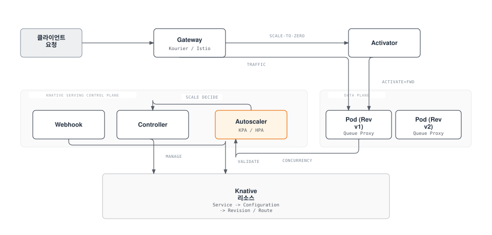
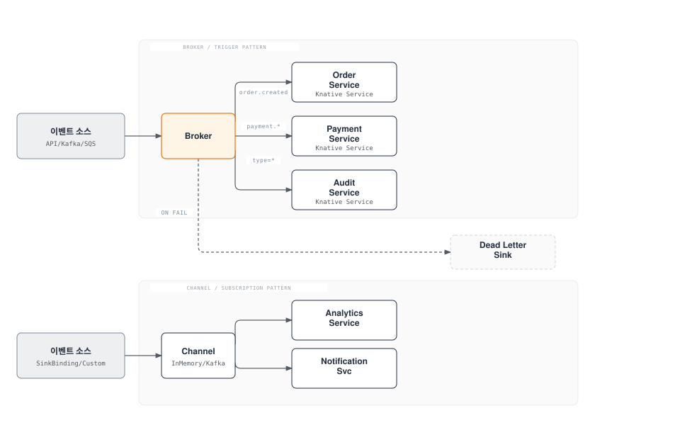
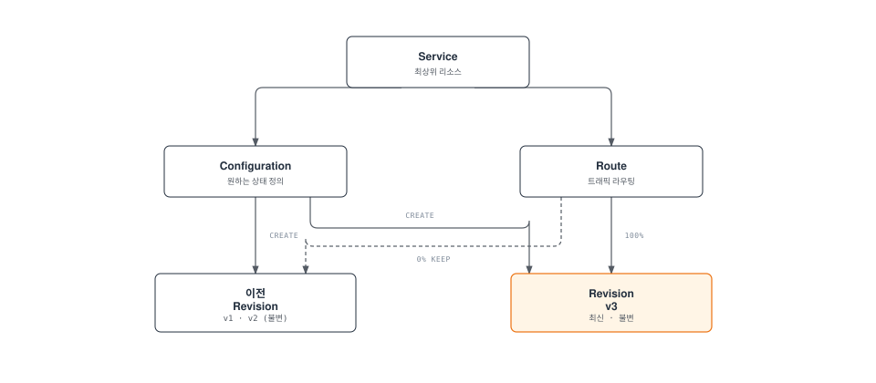
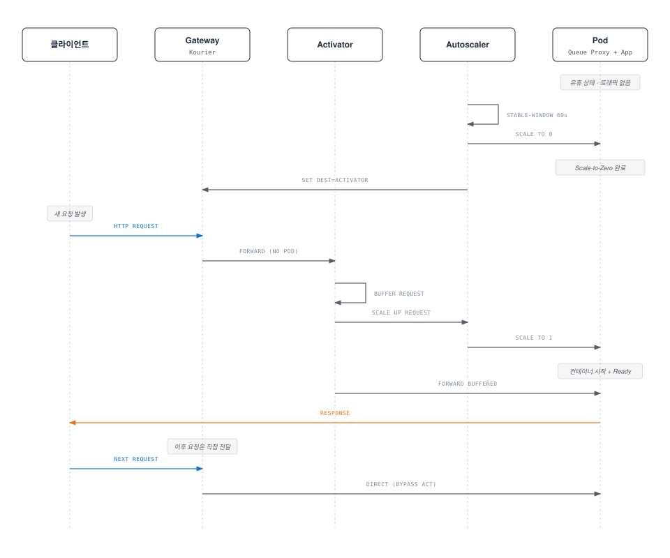
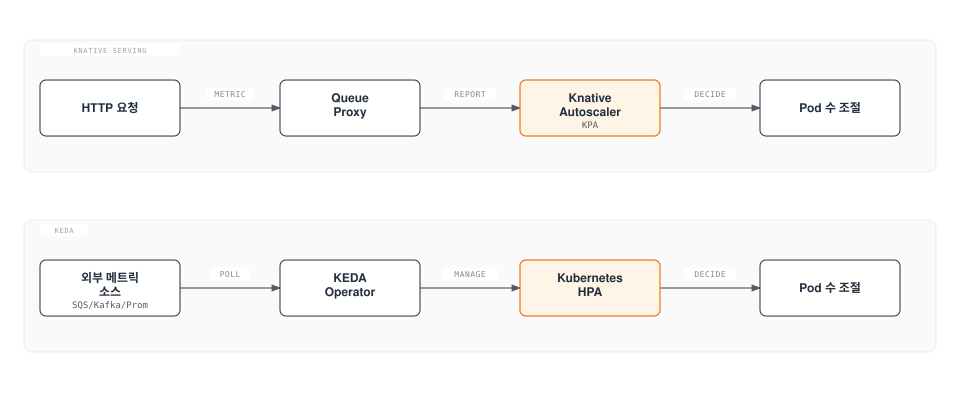

# Knative

> **지원 버전**: Knative v1.16+, Kourier v1.16+ **마지막 업데이트**: 2025년 6월

< [이전: Karpenter](02-karpenter.md) | 다음: 없음 >

## 목차

* [개요 및 학습 목표](03-knative.md#개요-및-학습-목표)
* [Knative 아키텍처](03-knative.md#knative-아키텍처)
* [EKS 설치 및 구성](03-knative.md#eks-설치-및-구성)
* [Knative Serving 심화](03-knative.md#knative-serving-심화)
* [Knative Eventing 심화](03-knative.md#knative-eventing-심화)
* [KEDA와 Knative 비교](03-knative.md#keda와-knative-비교)
* [프로덕션 운영](03-knative.md#프로덕션-운영)
* [모범 사례](03-knative.md#모범-사례)
* [참고 문서](03-knative.md#참고-문서)

***

## 개요 및 학습 목표

### Knative란?

Knative는 Kubernetes 위에서 서버리스(Serverless) 워크로드를 배포, 실행, 관리하기 위한 오픈 소스 플랫폼입니다. 2022년 CNCF Incubating 프로젝트로 승인되었으며, 2025년 3월에 **CNCF Graduated** 프로젝트로 졸업하여 프로덕션 성숙도를 공식적으로 인정받았습니다.

Knative는 개발자가 컨테이너 기반 애플리케이션을 서버리스 방식으로 운영할 수 있도록 두 가지 핵심 컴포넌트를 제공합니다:

* **Knative Serving**: HTTP 요청 기반의 서버리스 워크로드 배포 및 오토스케일링 (Scale-to-Zero 포함)
* **Knative Eventing**: 이벤트 드리븐 아키텍처를 위한 이벤트 소싱, 라우팅, 필터링 프레임워크

### Serverless on Kubernetes

전통적인 서버리스 플랫폼(AWS Lambda, Google Cloud Functions)은 특정 클라우드 벤더에 종속되는 반면, Knative는 Kubernetes가 실행되는 어디에서든 서버리스 경험을 제공합니다. 이를 통해 다음을 달성할 수 있습니다:

1. **벤더 독립성**: 어떤 Kubernetes 환경에서든 동일한 서버리스 워크로드 실행
2. **컨테이너 자유도**: 언어, 프레임워크, 런타임에 제한 없이 모든 컨테이너를 서버리스로 배포
3. **Kubernetes 생태계 활용**: 기존 Kubernetes 도구, 모니터링, 보안 정책을 그대로 사용
4. **Scale-to-Zero**: 트래픽이 없을 때 파드를 0으로 축소하여 리소스 비용 절감

### Knative Serving vs Eventing

| 구분                | Knative Serving                         | Knative Eventing                               |
| ----------------- | --------------------------------------- | ---------------------------------------------- |
| **목적**            | HTTP 요청 기반 서버리스 워크로드                    | 이벤트 드리븐 아키텍처                                   |
| **트리거**           | HTTP 요청                                 | CloudEvents (Kafka, SQS, API Server 등)         |
| **스케일링**          | 동시 요청 수 기반 자동 스케일링                      | 이벤트 소스에 따라 다름                                  |
| **Scale-to-Zero** | 네이티브 지원                                 | 소비자 워크로드에 따라 다름                                |
| **주요 사용처**        | API 서버, 웹 앱, ML 추론                      | 비동기 처리, 데이터 파이프라인, 워크플로                        |
| **리소스 모델**        | Service, Configuration, Revision, Route | Source, Broker, Trigger, Channel, Subscription |

### Knative vs AWS Lambda/Fargate 비교

| 기능                | Knative (EKS)              | AWS Lambda        | AWS Fargate   |
| ----------------- | -------------------------- | ----------------- | ------------- |
| **실행 환경**         | 모든 컨테이너                    | 특정 런타임 + 컨테이너 이미지 | 모든 컨테이너       |
| **최대 실행 시간**      | 제한 없음                      | 15분               | 제한 없음         |
| **Scale-to-Zero** | 지원                         | 지원                | 미지원           |
| **콜드 스타트**        | 컨테이너 시작 시간 (초\~분)          | 밀리초\~초            | 분 단위          |
| **최대 메모리**        | 노드 리소스에 따라 유연              | 10GB              | 120GB         |
| **GPU 지원**        | 지원                         | 미지원               | 미지원           |
| **네트워킹**          | Kubernetes 네이티브 (VPC CNI)  | VPC 연결 필요         | VPC 네이티브      |
| **벤더 종속**         | 없음 (CNCF 표준)               | AWS 전용            | AWS 전용        |
| **비용 모델**         | 노드 비용 (Scale-to-Zero로 절감)  | 요청 + 실행시간         | vCPU + 메모리 시간 |
| **로컬 개발**         | Docker + Kubernetes로 동일 환경 | SAM/LocalStack 필요 | 로컬 재현 어려움     |
| **이벤트 소스**        | CloudEvents 표준 (확장 가능)     | AWS 서비스 네이티브 연동   | 해당 없음         |

### 학습 목표

이 문서를 통해 다음을 학습합니다:

1. Knative Serving과 Eventing의 아키텍처 및 핵심 컴포넌트 이해
2. Amazon EKS 클러스터에 Knative를 설치하고 구성하는 방법
3. Knative Service를 사용한 서버리스 워크로드 배포 및 트래픽 관리
4. Knative Eventing을 사용한 이벤트 드리븐 아키텍처 구현
5. KEDA와 Knative의 차이점과 적절한 사용 시나리오
6. 프로덕션 환경에서의 운영, 모니터링, 문제 해결 방법

***

## Knative 아키텍처

### Serving 아키텍처

Knative Serving은 서버리스 워크로드의 배포, 스케일링, 네트워킹을 관리하는 핵심 컴포넌트입니다.



#### 핵심 컴포넌트 설명

**1. Activator**

* Scale-to-Zero 상태에서 들어오는 첫 번째 요청을 버퍼링
* Autoscaler에 스케일업을 요청하고, 파드가 준비되면 요청을 전달
* 버스트 트래픽 시 요청 큐잉을 통한 과부하 방지

**2. Autoscaler**

* **KPA (Knative Pod Autoscaler)**: Knative 기본 오토스케일러. 동시 요청 수(concurrency) 또는 RPS(requests per second) 기반 스케일링. Scale-to-Zero 지원
* **HPA (Horizontal Pod Autoscaler)**: Kubernetes 기본 HPA 사용. CPU/메모리 기반 스케일링 가능하나 Scale-to-Zero 미지원

**3. Queue Proxy**

* 모든 Knative 파드에 사이드카로 주입되는 프록시 컨테이너
* 요청 큐잉, 동시성 제한(concurrency enforcement), 메트릭 수집 수행
* Autoscaler에 실시간 동시성 메트릭 보고
* 헬스체크 프로브 처리

**4. Controller**

* Knative Service, Configuration, Revision, Route 리소스의 생명주기 관리
* Kubernetes Deployment, Service, Ingress 등 하위 리소스 생성 및 동기화

**5. Webhook**

* Knative 리소스의 생성/수정 시 유효성 검사(Validation) 및 기본값 설정(Defaulting)

### Eventing 아키텍처

Knative Eventing은 느슨하게 결합된 이벤트 드리븐 아키텍처를 제공합니다.



#### Broker/Trigger 패턴

* **Broker**: 이벤트를 수신하고 등록된 Trigger에 따라 적절한 소비자에게 라우팅하는 이벤트 허브
* **Trigger**: Broker에 등록되는 이벤트 필터. CloudEvents 속성(type, source 등)으로 필터링하여 특정 서비스로 전달

#### Channel/Subscription 패턴

* **Channel**: 이벤트를 임시 저장하고 전달하는 메시징 채널 (InMemoryChannel, KafkaChannel 등)
* **Subscription**: Channel의 이벤트를 특정 서비스로 구독하여 전달

#### Event Source

* **ApiServerSource**: Kubernetes API Server의 이벤트(리소스 생성/수정/삭제)를 CloudEvents로 변환
* **SinkBinding**: 기존 Kubernetes 워크로드에 이벤트 전송 기능을 주입
* **KafkaSource**: Apache Kafka 토픽의 메시지를 CloudEvents로 변환
* **SQSSource**: Amazon SQS 큐의 메시지를 CloudEvents로 변환

***

## EKS 설치 및 구성

### 사전 요구 사항

```bash
# EKS 클러스터 확인
kubectl cluster-info

# 클러스터 버전 확인 (1.28+ 권장)
kubectl version --short

# 필요한 도구 확인
kubectl version --client
helm version
```

### Knative Operator를 사용한 설치

Knative Operator는 Knative 컴포넌트의 설치, 업그레이드, 관리를 자동화합니다.

```bash
# 1. Knative Operator 설치
kubectl apply -f https://github.com/knative/operator/releases/download/knative-v1.16.0/operator.yaml

# Operator 배포 확인
kubectl get deployment knative-operator -n default
```

```yaml
# 2. Knative Serving 설치 (KnativeServing CR)
apiVersion: operator.knative.dev/v1beta1
kind: KnativeServing
metadata:
  name: knative-serving
  namespace: knative-serving
spec:
  version: "1.16.0"
  ingress:
    kourier:
      enabled: true
  config:
    network:
      ingress-class: kourier.ingress.networking.knative.dev
    autoscaler:
      # KPA 기본 설정
      container-concurrency-target-default: "100"
      enable-scale-to-zero: "true"
      scale-to-zero-grace-period: "30s"
      scale-to-zero-pod-retention-period: "0s"
    deployment:
      registries-skipping-tag-resolving: "kind.local,ko.local,dev.local"
  high-availability:
    replicas: 2
```

```bash
# 네임스페이스 생성 및 Serving 설치
kubectl create namespace knative-serving
kubectl apply -f knative-serving.yaml

# 설치 확인
kubectl get pods -n knative-serving
kubectl get KnativeServing knative-serving -n knative-serving
```

```yaml
# 3. Knative Eventing 설치 (KnativeEventing CR)
apiVersion: operator.knative.dev/v1beta1
kind: KnativeEventing
metadata:
  name: knative-eventing
  namespace: knative-eventing
spec:
  version: "1.16.0"
  config:
    default-ch-webhook:
      default-ch-config: |
        clusterDefault:
          apiVersion: messaging.knative.dev/v1
          kind: InMemoryChannel
  high-availability:
    replicas: 2
```

```bash
# 네임스페이스 생성 및 Eventing 설치
kubectl create namespace knative-eventing
kubectl apply -f knative-eventing.yaml

# 설치 확인
kubectl get pods -n knative-eventing
kubectl get KnativeEventing knative-eventing -n knative-eventing
```

### Kourier (경량 Ingress) 설치

Kourier는 Knative를 위해 설계된 경량 Envoy 기반 Ingress입니다. Istio보다 리소스 사용량이 적어 Knative 전용 환경에 적합합니다.

```bash
# Kourier가 Operator로 설치된 경우 자동 배포됨
# 수동 설치 시:
kubectl apply -f https://github.com/knative/net-kourier/releases/download/knative-v1.16.0/kourier.yaml

# Kourier 서비스 확인
kubectl get svc kourier -n kourier-system
kubectl get svc kourier-internal -n kourier-system
```

```bash
# Kourier 외부 IP/Hostname 확인 (EKS에서는 NLB 또는 ALB)
kubectl get svc kourier -n kourier-system -o jsonpath='{.status.loadBalancer.ingress[0].hostname}'
```

### DNS 구성

Knative Service에 접근하기 위해서는 DNS 구성이 필요합니다.

#### Magic DNS (sslip.io) - 개발/테스트 환경용

```bash
# Magic DNS 설치 (sslip.io 사용)
kubectl apply -f https://github.com/knative/serving/releases/download/knative-v1.16.0/serving-default-domain.yaml

# 확인: *.sslip.io 도메인으로 서비스 접근 가능
kubectl get ksvc
```

#### Real DNS (Route53) - 프로덕션 환경용

```bash
# 1. Route53 호스팅 영역에 와일드카드 CNAME 레코드 추가
# *.knative.example.com -> Kourier LoadBalancer 호스트명

# Kourier 외부 호스트명 확인
KOURIER_HOST=$(kubectl get svc kourier -n kourier-system \
  -o jsonpath='{.status.loadBalancer.ingress[0].hostname}')
echo $KOURIER_HOST

# 2. Knative 도메인 구성
kubectl patch configmap/config-domain \
  -n knative-serving \
  --type merge \
  -p '{"data":{"knative.example.com":""}}'
```

```yaml
# Route53 레코드 구성 예시 (Terraform)
resource "aws_route53_record" "knative_wildcard" {
  zone_id = aws_route53_zone.main.zone_id
  name    = "*.knative.example.com"
  type    = "CNAME"
  ttl     = 300
  records = [data.kubernetes_service.kourier.status[0].load_balancer[0].ingress[0].hostname]
}
```

#### ExternalDNS 연동

```yaml
# ExternalDNS가 이미 설치된 경우, annotation으로 자동 DNS 등록
apiVersion: serving.knative.dev/v1
kind: Service
metadata:
  name: my-app
  annotations:
    external-dns.alpha.kubernetes.io/hostname: my-app.knative.example.com
spec:
  template:
    spec:
      containers:
        - image: my-app:latest
```

### Cert-manager TLS 연동

```yaml
# 1. Knative에서 cert-manager 사용 설정
kubectl apply -f https://github.com/knative/net-certmanager/releases/download/knative-v1.16.0/release.yaml

# 2. ClusterIssuer 생성 (Let's Encrypt)
apiVersion: cert-manager.io/v1
kind: ClusterIssuer
metadata:
  name: letsencrypt-prod
spec:
  acme:
    server: https://acme-v02.api.letsencrypt.org/directory
    email: admin@example.com
    privateKeySecretRef:
      name: letsencrypt-prod
    solvers:
      - dns01:
          route53:
            region: ap-northeast-2
            hostedZoneID: Z1234567890
```

```bash
# 3. Knative에 cert-manager 및 자동 TLS 구성
kubectl patch configmap/config-network \
  -n knative-serving \
  --type merge \
  -p '{"data":{
    "certificate-class":"cert-manager.certificate.networking.knative.dev",
    "external-domain-tls":"Enabled",
    "auto-tls":"Enabled"
  }}'

# 4. config-certmanager에 ClusterIssuer 설정
kubectl patch configmap/config-certmanager \
  -n knative-serving \
  --type merge \
  -p '{"data":{"issuerRef":"kind: ClusterIssuer\nname: letsencrypt-prod"}}'
```

### HPA vs KPA 오토스케일러 선택

| 기준                | KPA (Knative Pod Autoscaler) | HPA (Horizontal Pod Autoscaler) |
| ----------------- | ---------------------------- | ------------------------------- |
| **Scale-to-Zero** | 지원                           | 미지원 (최소 1 파드)                   |
| **메트릭**           | 동시 요청 수, RPS                 | CPU, 메모리, 커스텀 메트릭               |
| **반응 속도**         | 빠름 (초 단위)                    | 보통 (15-30초)                     |
| **안정 구간**         | 60초 (설정 가능)                  | 5분 (기본)                         |
| **사용 사례**         | HTTP 워크로드, Scale-to-Zero 필요  | CPU/메모리 바운드 워크로드                |

```yaml
# KPA 사용 (기본값)
apiVersion: serving.knative.dev/v1
kind: Service
metadata:
  name: kpa-service
spec:
  template:
    metadata:
      annotations:
        autoscaling.knative.dev/class: "kpa.autoscaling.knative.dev"
        autoscaling.knative.dev/metric: "concurrency"
        autoscaling.knative.dev/target: "100"
    spec:
      containers:
        - image: my-app:latest
---
# HPA 사용
apiVersion: serving.knative.dev/v1
kind: Service
metadata:
  name: hpa-service
spec:
  template:
    metadata:
      annotations:
        autoscaling.knative.dev/class: "hpa.autoscaling.knative.dev"
        autoscaling.knative.dev/metric: "cpu"
        autoscaling.knative.dev/target: "70"
    spec:
      containers:
        - image: my-app:latest
          resources:
            requests:
              cpu: 500m
            limits:
              cpu: "1"
```

***

## Knative Serving 심화

### 리소스 모델

Knative Serving의 네 가지 핵심 리소스는 다음과 같이 연결됩니다:



* **Service**: 전체 서버리스 워크로드를 정의하는 최상위 리소스. Configuration과 Route를 자동으로 관리
* **Configuration**: 배포할 컨테이너의 원하는 상태를 정의. 변경 시 새 Revision 자동 생성
* **Revision**: Configuration의 특정 시점 불변(Immutable) 스냅샷. 코드 및 설정의 버전 관리 단위
* **Route**: 트래픽을 하나 이상의 Revision으로 라우팅. 비율 기반 트래픽 분할 지원

### 완전한 Knative Service YAML

```yaml
apiVersion: serving.knative.dev/v1
kind: Service
metadata:
  name: my-api
  namespace: production
  labels:
    app: my-api
    team: backend
  annotations:
    # 오토스케일링 설정
    autoscaling.knative.dev/class: "kpa.autoscaling.knative.dev"
spec:
  template:
    metadata:
      annotations:
        # 스케일링 설정
        autoscaling.knative.dev/metric: "concurrency"
        autoscaling.knative.dev/target: "100"
        autoscaling.knative.dev/min-scale: "2"
        autoscaling.knative.dev/max-scale: "50"
        autoscaling.knative.dev/initial-scale: "3"
        autoscaling.knative.dev/scale-down-delay: "15m"
        autoscaling.knative.dev/window: "60s"
        # Revision 이름 자동 생성 비활성화 (선택)
        # autoscaling.knative.dev/target-utilization-percentage: "70"
      labels:
        app: my-api
        version: v1
    spec:
      # 요청당 최대 동시성 (0 = 무제한)
      containerConcurrency: 0
      # 요청 타임아웃 (초)
      timeoutSeconds: 300
      # 서비스 어카운트
      serviceAccountName: my-api-sa
      containers:
        - image: 123456789012.dkr.ecr.ap-northeast-2.amazonaws.com/my-api:v1.2.3
          ports:
            - containerPort: 8080
              protocol: TCP
          env:
            - name: DB_HOST
              valueFrom:
                secretKeyRef:
                  name: db-credentials
                  key: host
            - name: LOG_LEVEL
              value: "info"
          resources:
            requests:
              cpu: 500m
              memory: 512Mi
            limits:
              cpu: "2"
              memory: 2Gi
          readinessProbe:
            httpGet:
              path: /healthz
              port: 8080
            initialDelaySeconds: 5
            periodSeconds: 10
          livenessProbe:
            httpGet:
              path: /healthz
              port: 8080
            initialDelaySeconds: 15
            periodSeconds: 20
```

### 트래픽 분할

#### Canary 배포

```yaml
apiVersion: serving.knative.dev/v1
kind: Service
metadata:
  name: my-api
  namespace: production
spec:
  template:
    metadata:
      name: my-api-v2  # 새 Revision 이름 지정
    spec:
      containers:
        - image: 123456789012.dkr.ecr.ap-northeast-2.amazonaws.com/my-api:v2.0.0
          ports:
            - containerPort: 8080
  traffic:
    # 기존 버전에 90% 트래픽
    - revisionName: my-api-v1
      percent: 90
    # 새 버전에 10% 트래픽 (Canary)
    - revisionName: my-api-v2
      percent: 10
      tag: canary  # canary-my-api.knative.example.com 으로 직접 접근 가능
    # 최신 Revision에 태그만 부여 (트래픽 0%)
    - latestRevision: true
      tag: latest
      percent: 0
```

```bash
# Canary 비율 점진적 증가
# 10% -> 30% -> 50% -> 100%
kubectl patch ksvc my-api --type merge -p '
{
  "spec": {
    "traffic": [
      {"revisionName": "my-api-v1", "percent": 70},
      {"revisionName": "my-api-v2", "percent": 30, "tag": "canary"}
    ]
  }
}'
```

#### Blue-Green 배포

```yaml
apiVersion: serving.knative.dev/v1
kind: Service
metadata:
  name: my-api
  namespace: production
spec:
  template:
    metadata:
      name: my-api-green
    spec:
      containers:
        - image: 123456789012.dkr.ecr.ap-northeast-2.amazonaws.com/my-api:v2.0.0
  traffic:
    # Blue (현재 프로덕션) - 100% 트래픽
    - revisionName: my-api-blue
      percent: 100
      tag: blue
    # Green (새 버전) - 0% 트래픽, 태그로만 접근
    - revisionName: my-api-green
      percent: 0
      tag: green
```

```bash
# Green 환경 검증 후 트래픽 전환
# green-my-api.knative.example.com 으로 테스트 후
kubectl patch ksvc my-api --type merge -p '
{
  "spec": {
    "traffic": [
      {"revisionName": "my-api-blue", "percent": 0, "tag": "blue"},
      {"revisionName": "my-api-green", "percent": 100, "tag": "green"}
    ]
  }
}'
```

### Scale-to-Zero 동작 원리

Scale-to-Zero는 Knative의 핵심 기능으로, 트래픽이 없을 때 파드를 0으로 축소하여 리소스를 절약합니다.



**동작 단계:**

1. **유휴 감지**: Autoscaler가 `stable-window` (기본 60초) 동안 동시 요청 수가 0인 것을 감지
2. **Grace Period**: `scale-to-zero-grace-period` (기본 30초) 후 파드 종료
3. **Activator 전환**: Ingress 라우팅이 Activator로 변경됨
4. **콜드 스타트**: 새 요청이 오면 Activator가 버퍼링하고 Autoscaler에 스케일업 요청
5. **요청 전달**: 파드가 Ready 상태가 되면 버퍼링된 요청을 전달

### Concurrency 기반 스케일링

```yaml
apiVersion: serving.knative.dev/v1
kind: Service
metadata:
  name: concurrency-demo
spec:
  template:
    metadata:
      annotations:
        # 소프트 타겟: 오토스케일러가 이 수치를 목표로 스케일링
        # Pod 수 = 현재 동시 요청 / target
        autoscaling.knative.dev/target: "10"
        # 메트릭 유형 (concurrency 또는 rps)
        autoscaling.knative.dev/metric: "concurrency"
        # 타겟 활용률 (기본 70%)
        # 실제 타겟 = target * utilization = 10 * 0.7 = 7
        autoscaling.knative.dev/target-utilization-percentage: "70"
    spec:
      # 하드 리밋: 파드당 최대 동시 요청 수 (초과 시 큐잉/503)
      # 0 = 무제한 (소프트 타겟만 사용)
      containerConcurrency: 50
      containers:
        - image: my-app:latest
```

**소프트 타겟 vs 하드 리밋:**

* `autoscaling.knative.dev/target` (소프트): Autoscaler의 스케일링 목표. 이 값을 기준으로 파드 수 계산
* `containerConcurrency` (하드): Queue Proxy가 강제하는 절대 최대 동시성. 초과 요청은 큐잉되거나 503 반환

**스케일링 계산 예시:**

* 현재 동시 요청: 70
* Target: 10, Utilization: 70%
* 실제 타겟: 10 \* 0.7 = 7
* 필요 파드 수: 70 / 7 = 10개

### 콜드 스타트 최적화

```yaml
apiVersion: serving.knative.dev/v1
kind: Service
metadata:
  name: low-latency-api
spec:
  template:
    metadata:
      annotations:
        # 최소 파드 수 (Scale-to-Zero 비활성화)
        autoscaling.knative.dev/min-scale: "2"
        # 초기 파드 수 (첫 배포 시)
        autoscaling.knative.dev/initial-scale: "3"
        # 스케일 다운 지연 (마지막 요청 후 대기 시간)
        autoscaling.knative.dev/scale-down-delay: "5m"
        # 안정화 윈도우 (스케일 결정 전 메트릭 수집 기간)
        autoscaling.knative.dev/window: "120s"
    spec:
      containers:
        - image: my-app:latest
          # 빠른 시작을 위한 리소스 보장
          resources:
            requests:
              cpu: "1"
              memory: 1Gi
          # 빠른 Readiness 프로브
          readinessProbe:
            httpGet:
              path: /ready
              port: 8080
            initialDelaySeconds: 1
            periodSeconds: 2
            timeoutSeconds: 1
            failureThreshold: 3
```

**콜드 스타트 최적화 전략:**

| 전략                | 설정                       | 효과                       |
| ----------------- | ------------------------ | ------------------------ |
| 최소 인스턴스 유지        | `min-scale: 1+`          | 콜드 스타트 완전 방지 (비용 증가)     |
| 초기 스케일 설정         | `initial-scale: N`       | 첫 배포 시 빠른 응답             |
| 스케일 다운 지연         | `scale-down-delay: 5m`   | 간헐적 트래픽에서 불필요한 스케일 다운 방지 |
| 컨테이너 이미지 최적화      | 경량 베이스 이미지 사용            | 이미지 풀 시간 단축              |
| Readiness 프로브 최적화 | 짧은 `initialDelaySeconds` | 트래픽 수신 시작 시간 단축          |
| 이미지 사전 풀          | DaemonSet으로 노드에 이미지 캐싱   | 이미지 풀 시간 제거              |

### Private/Public 서비스

```yaml
# Public 서비스 (기본값) - 외부에서 접근 가능
apiVersion: serving.knative.dev/v1
kind: Service
metadata:
  name: public-api
  labels:
    networking.knative.dev/visibility: cluster-external
spec:
  template:
    spec:
      containers:
        - image: my-api:latest
---
# Private 서비스 - 클러스터 내부에서만 접근 가능
apiVersion: serving.knative.dev/v1
kind: Service
metadata:
  name: internal-processor
  labels:
    networking.knative.dev/visibility: cluster-local
spec:
  template:
    spec:
      containers:
        - image: my-processor:latest
```

```bash
# Private 서비스 접근 방식 (클러스터 내부에서)
# http://internal-processor.production.svc.cluster.local
curl http://internal-processor.production.svc.cluster.local
```

***

## Knative Eventing 심화

### Event Source

#### ApiServerSource

Kubernetes API Server의 이벤트를 CloudEvents로 변환하여 전달합니다.

```yaml
apiVersion: sources.knative.dev/v1
kind: ApiServerSource
metadata:
  name: k8s-events
  namespace: default
spec:
  # 감시할 리소스 유형
  resources:
    - apiVersion: v1
      kind: Pod
      controller: true
    - apiVersion: apps/v1
      kind: Deployment
      controller: true
  # 이벤트 모드: Reference (참조만) 또는 Resource (전체 객체 포함)
  mode: Reference
  # 이벤트를 보낼 대상
  sink:
    ref:
      apiVersion: eventing.knative.dev/v1
      kind: Broker
      name: default
  # RBAC 서비스 어카운트
  serviceAccountName: k8s-events-sa
---
# 필요한 RBAC
apiVersion: v1
kind: ServiceAccount
metadata:
  name: k8s-events-sa
  namespace: default
---
apiVersion: rbac.authorization.k8s.io/v1
kind: ClusterRoleBinding
metadata:
  name: k8s-events-reader
subjects:
  - kind: ServiceAccount
    name: k8s-events-sa
    namespace: default
roleRef:
  kind: ClusterRole
  name: view
  apiGroup: rbac.authorization.k8s.io
```

#### SinkBinding

기존 Kubernetes 워크로드에 이벤트 전송 기능(K\_SINK 환경 변수)을 주입합니다.

```yaml
apiVersion: sources.knative.dev/v1
kind: SinkBinding
metadata:
  name: order-events-binding
  namespace: default
spec:
  # 이벤트를 보내는 주체 (기존 워크로드)
  subject:
    apiVersion: apps/v1
    kind: Deployment
    selector:
      matchLabels:
        app: order-service
  # 이벤트를 받을 대상
  sink:
    ref:
      apiVersion: eventing.knative.dev/v1
      kind: Broker
      name: default
  # CloudEvents 속성 오버라이드
  ceOverrides:
    extensions:
      source: order-service
      team: commerce
```

```python
# SinkBinding을 사용하는 애플리케이션 코드 예시
import os
import requests
from cloudevents.http import CloudEvent
from cloudevents.conversion import to_structured

# K_SINK 환경변수는 SinkBinding이 자동으로 주입
sink_url = os.environ.get("K_SINK")

def emit_order_event(order_id, event_type, data):
    """주문 이벤트를 CloudEvents 형식으로 전송"""
    attributes = {
        "type": f"com.example.order.{event_type}",
        "source": "order-service",
        "subject": f"order/{order_id}",
    }
    event = CloudEvent(attributes, data)
    headers, body = to_structured(event)
    
    response = requests.post(sink_url, data=body, headers=headers)
    return response.status_code
```

#### KafkaSource

```yaml
apiVersion: sources.knative.dev/v1beta1
kind: KafkaSource
metadata:
  name: kafka-order-events
  namespace: default
spec:
  consumerGroup: knative-order-consumer
  bootstrapServers:
    - kafka-bootstrap.kafka:9092
  topics:
    - orders
    - order-updates
  # 인증 설정 (SASL/SSL)
  net:
    sasl:
      enable: true
      type:
        secretKeyRef:
          name: kafka-credentials
          key: sasl-type
      user:
        secretKeyRef:
          name: kafka-credentials
          key: user
      password:
        secretKeyRef:
          name: kafka-credentials
          key: password
    tls:
      enable: true
  sink:
    ref:
      apiVersion: eventing.knative.dev/v1
      kind: Broker
      name: default
```

#### SQSSource (AWS 연동)

```yaml
# AWS SQS Source를 사용하려면 AWS 컨트롤러 설치 필요
# https://github.com/triggermesh/triggermesh
apiVersion: sources.triggermesh.io/v1alpha1
kind: AWSSQSSource
metadata:
  name: sqs-order-events
  namespace: default
spec:
  arn: arn:aws:sqs:ap-northeast-2:123456789012:order-events
  # EKS IRSA 또는 Pod Identity로 인증
  auth:
    credentials:
      accessKeyID:
        valueFromSecret:
          name: aws-credentials
          key: access-key-id
      secretAccessKey:
        valueFromSecret:
          name: aws-credentials
          key: secret-access-key
  sink:
    ref:
      apiVersion: eventing.knative.dev/v1
      kind: Broker
      name: default
```

### Broker/Trigger 패턴

#### 완전한 Broker/Trigger YAML

```yaml
# 1. Broker 생성
apiVersion: eventing.knative.dev/v1
kind: Broker
metadata:
  name: default
  namespace: production
  annotations:
    # Dead Letter Sink 설정
    eventing.knative.dev/broker.class: MTChannelBasedBroker
spec:
  config:
    apiVersion: v1
    kind: ConfigMap
    name: config-br-defaults
    namespace: knative-eventing
  # 전달 실패 시 Dead Letter Queue로 전송
  delivery:
    deadLetterSink:
      ref:
        apiVersion: serving.knative.dev/v1
        kind: Service
        name: dead-letter-handler
    retry: 3
    backoffPolicy: exponential
    backoffDelay: "PT2S"  # ISO 8601 Duration: 2초
---
# 2. 주문 생성 이벤트 Trigger
apiVersion: eventing.knative.dev/v1
kind: Trigger
metadata:
  name: order-created-trigger
  namespace: production
spec:
  broker: default
  filter:
    attributes:
      type: com.example.order.created
      source: order-service
  subscriber:
    ref:
      apiVersion: serving.knative.dev/v1
      kind: Service
      name: order-processor
    uri: /process  # 서비스 내 특정 경로로 전달
  delivery:
    deadLetterSink:
      ref:
        apiVersion: serving.knative.dev/v1
        kind: Service
        name: order-dlq-handler
    retry: 5
    backoffPolicy: exponential
    backoffDelay: "PT1S"
---
# 3. 결제 완료 이벤트 Trigger
apiVersion: eventing.knative.dev/v1
kind: Trigger
metadata:
  name: payment-processed-trigger
  namespace: production
spec:
  broker: default
  filter:
    attributes:
      type: com.example.payment.processed
  subscriber:
    ref:
      apiVersion: serving.knative.dev/v1
      kind: Service
      name: shipping-service
---
# 4. 모든 이벤트를 감사 로그로 전달
apiVersion: eventing.knative.dev/v1
kind: Trigger
metadata:
  name: audit-all-events
  namespace: production
spec:
  broker: default
  # filter를 생략하면 모든 이벤트를 수신
  subscriber:
    ref:
      apiVersion: serving.knative.dev/v1
      kind: Service
      name: audit-logger
```

### CloudEvents 표준

Knative Eventing은 **CloudEvents v1.0** 사양을 표준 이벤트 형식으로 사용합니다.

```json
{
  "specversion": "1.0",
  "type": "com.example.order.created",
  "source": "/apis/v1/namespaces/production/orders",
  "id": "a1b2c3d4-e5f6-7890-abcd-ef1234567890",
  "time": "2025-06-15T10:30:00Z",
  "datacontenttype": "application/json",
  "subject": "order/12345",
  "data": {
    "orderId": "12345",
    "customerId": "C001",
    "items": [
      {"productId": "P100", "quantity": 2, "price": 29900}
    ],
    "totalAmount": 59800
  }
}
```

```python
# CloudEvents 수신 및 처리 (Python)
from flask import Flask, request
from cloudevents.http import from_http

app = Flask(__name__)

@app.route("/", methods=["POST"])
def handle_event():
    # CloudEvent 파싱
    event = from_http(request.headers, request.get_data())
    
    print(f"Received event: {event['type']}")
    print(f"Source: {event['source']}")
    print(f"Data: {event.data}")
    
    if event["type"] == "com.example.order.created":
        process_order(event.data)
    elif event["type"] == "com.example.payment.processed":
        process_payment(event.data)
    
    return "", 200

def process_order(data):
    order_id = data["orderId"]
    # 주문 처리 로직
    print(f"Processing order: {order_id}")

def process_payment(data):
    # 결제 처리 로직
    pass

if __name__ == "__main__":
    app.run(host="0.0.0.0", port=8080)
```

### Channel/Subscription 패턴

```yaml
# 1. Kafka 기반 Channel 생성
apiVersion: messaging.knative.dev/v1beta1
kind: KafkaChannel
metadata:
  name: order-events-channel
  namespace: production
spec:
  numPartitions: 6
  replicationFactor: 3
  retentionDuration: PT168H  # 7일 보존
---
# 2. Subscription 1: 분석 서비스
apiVersion: messaging.knative.dev/v1
kind: Subscription
metadata:
  name: analytics-subscription
  namespace: production
spec:
  channel:
    apiVersion: messaging.knative.dev/v1beta1
    kind: KafkaChannel
    name: order-events-channel
  subscriber:
    ref:
      apiVersion: serving.knative.dev/v1
      kind: Service
      name: analytics-service
    uri: /events/orders
  # 응답을 다른 채널로 전달 (체이닝)
  reply:
    ref:
      apiVersion: messaging.knative.dev/v1beta1
      kind: KafkaChannel
      name: analytics-results-channel
  delivery:
    deadLetterSink:
      ref:
        apiVersion: serving.knative.dev/v1
        kind: Service
        name: dlq-handler
    retry: 3
    backoffPolicy: linear
    backoffDelay: "PT5S"
---
# 3. Subscription 2: 알림 서비스
apiVersion: messaging.knative.dev/v1
kind: Subscription
metadata:
  name: notification-subscription
  namespace: production
spec:
  channel:
    apiVersion: messaging.knative.dev/v1beta1
    kind: KafkaChannel
    name: order-events-channel
  subscriber:
    ref:
      apiVersion: serving.knative.dev/v1
      kind: Service
      name: notification-service
```

### Dead Letter Sink

전달 실패한 이벤트를 안전하게 저장하고 나중에 재처리할 수 있도록 합니다.

```yaml
# Dead Letter 처리 서비스
apiVersion: serving.knative.dev/v1
kind: Service
metadata:
  name: dead-letter-handler
  namespace: production
spec:
  template:
    metadata:
      annotations:
        autoscaling.knative.dev/min-scale: "1"
    spec:
      containers:
        - image: dead-letter-handler:latest
          env:
            - name: S3_BUCKET
              value: "my-dead-letters-bucket"
            - name: AWS_REGION
              value: "ap-northeast-2"
```

```python
# Dead Letter Handler 구현 예시
import json
import boto3
from flask import Flask, request
from cloudevents.http import from_http
from datetime import datetime

app = Flask(__name__)
s3 = boto3.client('s3', region_name='ap-northeast-2')

@app.route("/", methods=["POST"])
def handle_dead_letter():
    event = from_http(request.headers, request.get_data())
    
    # S3에 실패 이벤트 저장
    key = f"dead-letters/{event['type']}/{datetime.utcnow().isoformat()}/{event['id']}.json"
    s3.put_object(
        Bucket='my-dead-letters-bucket',
        Key=key,
        Body=json.dumps({
            "event_type": event["type"],
            "event_source": event["source"],
            "event_id": event["id"],
            "event_time": str(event["time"]),
            "data": event.data,
            "headers": dict(request.headers)
        }),
        ContentType='application/json'
    )
    
    # 알림 전송 (선택)
    print(f"Dead letter stored: {key}")
    
    return "", 200
```

### Event 필터링

#### Attributes 기반 필터링

```yaml
# 정확한 속성 매칭
apiVersion: eventing.knative.dev/v1
kind: Trigger
metadata:
  name: exact-filter
spec:
  broker: default
  filter:
    attributes:
      type: com.example.order.created
      source: /apis/v1/namespaces/production/orders
  subscriber:
    ref:
      apiVersion: serving.knative.dev/v1
      kind: Service
      name: order-handler
```

#### 새로운 필터 API (v1.16+)

Knative v1.15부터 새로운 `filters` 필드를 통해 더 강력한 필터링을 지원합니다.

```yaml
# 복합 필터링 (AND, OR, NOT, prefix, suffix 등)
apiVersion: eventing.knative.dev/v1
kind: Trigger
metadata:
  name: advanced-filter
spec:
  broker: default
  filters:
    # 모든 조건을 만족해야 함 (AND)
    - all:
        # type이 order로 시작
        - prefix:
            type: "com.example.order."
        # source가 특정 값과 정확히 일치
        - exact:
            source: "order-service"
        # 특정 extension이 아닌 것 (NOT)
        - not:
            exact:
              priority: "low"
  subscriber:
    ref:
      apiVersion: serving.knative.dev/v1
      kind: Service
      name: high-priority-order-handler
---
# OR 조건 필터링
apiVersion: eventing.knative.dev/v1
kind: Trigger
metadata:
  name: multi-event-filter
spec:
  broker: default
  filters:
    - any:
        - exact:
            type: "com.example.order.created"
        - exact:
            type: "com.example.order.updated"
        - exact:
            type: "com.example.order.cancelled"
  subscriber:
    ref:
      apiVersion: serving.knative.dev/v1
      kind: Service
      name: order-lifecycle-handler
```

***

## KEDA와 Knative 비교

### 스케일링 모델 차이



| 비교 항목        | Knative                              | KEDA                            |
| ------------ | ------------------------------------ | ------------------------------- |
| **스케일링 트리거** | HTTP 동시성/RPS (Queue Proxy 기반)        | 50+ 외부 메트릭 소스                   |
| **스케일링 주체**  | Knative Autoscaler (KPA)             | Kubernetes HPA (KEDA가 관리)       |
| **메트릭 수집**   | Queue Proxy 사이드카                     | KEDA Metrics Server             |
| **최소 스케일**   | 0 (Scale-to-Zero 네이티브)               | 0 (ScaledObject로 구현)            |
| **스케일링 대상**  | Knative Revision (Deployment)        | 모든 Deployment, StatefulSet, Job |
| **네트워킹**     | Ingress 포함 (Kourier/Istio)           | 네트워킹 불포함                        |
| **서비스 모델**   | Knative Service (Revision, Route 포함) | 기존 Kubernetes 워크로드 그대로 사용       |
| **프로토콜**     | HTTP/gRPC                            | 프로토콜 무관                         |

### Scale-to-Zero 동작 차이

| 측면            | Knative Scale-to-Zero            | KEDA Scale-to-Zero               |
| ------------- | -------------------------------- | -------------------------------- |
| **구현 방식**     | Activator가 트래픽을 버퍼링하고 파드 기동 후 전달 | 외부 메트릭이 임계값 이하일 때 replicas=0     |
| **콜드 스타트 처리** | Activator가 요청을 대기시킴 (클라이언트에 투명)  | 요청 손실 가능 (메시지 큐일 경우 재처리)         |
| **트리거 방식**    | HTTP 요청이 직접 스케일업 트리거             | 메트릭 폴링으로 감지 (pollingInterval 지연) |
| **스케일업 지연**   | 컨테이너 시작 시간                       | pollingInterval + 컨테이너 시작 시간     |
| **적합한 워크로드**  | 동기 HTTP API, 웹 서비스               | 비동기 큐 처리, 배치 작업                  |

### 이벤트 드리븐 아키텍처에서의 역할

**Knative Eventing**: 이벤트 라우팅 및 전달 프레임워크

* CloudEvents 표준 기반 이벤트 소싱
* Broker/Trigger 패턴으로 이벤트 필터링 및 라우팅
* 이벤트 소스에서 소비자까지의 전체 파이프라인 관리

**KEDA**: 이벤트 기반 스케일링 엔진

* 이벤트 큐 깊이에 따른 워커 스케일링
* 다양한 메시지 브로커(SQS, Kafka, RabbitMQ 등) 직접 연동
* 메트릭 기반으로 워크로드 수를 동적으로 조절

### 사용 시나리오 가이드

| 시나리오                   | 권장 도구                            | 이유                                          |
| ---------------------- | -------------------------------- | ------------------------------------------- |
| HTTP API 서버리스 배포       | **Knative Serving**              | Scale-to-Zero + HTTP 라우팅 + 트래픽 분할           |
| SQS 큐 메시지 처리 워커        | **KEDA**                         | SQS 큐 깊이 기반 스케일링에 최적화                       |
| Kafka 이벤트 스트림 처리       | **KEDA** 또는 **Knative Eventing** | 단순 스케일링: KEDA, 이벤트 라우팅 필요: Knative          |
| ML 추론 서비스              | **Knative Serving**              | HTTP 기반 + Scale-to-Zero로 GPU 비용 절감          |
| Cron 기반 배치 작업          | **KEDA**                         | ScaledJob으로 Cron 기반 Job 스케일링                |
| 마이크로서비스 이벤트 파이프라인      | **Knative Eventing**             | CloudEvents + Broker/Trigger로 복잡한 이벤트 흐름 관리 |
| Prometheus 메트릭 기반 스케일링 | **KEDA**                         | Prometheus 스케일러로 커스텀 메트릭 연동                 |

### 함께 사용하는 시나리오

Knative와 KEDA는 상호 배타적이지 않으며, 같은 클러스터에서 함께 사용할 수 있습니다.

```yaml
# 예: Knative Serving으로 API 배포 + KEDA로 백그라운드 워커 스케일링
# 
# [사용자] --> [Knative Service: API] --> [SQS 큐] --> [KEDA ScaledObject: Worker]
#
# 1. Knative Serving: 프론트엔드 API (HTTP 기반 Scale-to-Zero)
apiVersion: serving.knative.dev/v1
kind: Service
metadata:
  name: order-api
spec:
  template:
    metadata:
      annotations:
        autoscaling.knative.dev/target: "50"
        autoscaling.knative.dev/min-scale: "1"
    spec:
      containers:
        - image: order-api:latest
          env:
            - name: SQS_QUEUE_URL
              value: "https://sqs.ap-northeast-2.amazonaws.com/123456789012/order-queue"
---
# 2. KEDA: 백그라운드 주문 처리 워커 (SQS 큐 기반 스케일링)
apiVersion: keda.sh/v1alpha1
kind: ScaledObject
metadata:
  name: order-worker-scaler
spec:
  scaleTargetRef:
    name: order-worker
  minReplicaCount: 0
  maxReplicaCount: 100
  triggers:
    - type: aws-sqs-queue
      metadata:
        queueURL: "https://sqs.ap-northeast-2.amazonaws.com/123456789012/order-queue"
        queueLength: "5"
        awsRegion: "ap-northeast-2"
        identityOwner: pod
```

***

## 프로덕션 운영

### 리소스 제한 및 QoS

```yaml
apiVersion: serving.knative.dev/v1
kind: Service
metadata:
  name: production-api
spec:
  template:
    metadata:
      annotations:
        autoscaling.knative.dev/min-scale: "2"
        autoscaling.knative.dev/max-scale: "100"
        autoscaling.knative.dev/target: "80"
    spec:
      containerConcurrency: 200
      timeoutSeconds: 60
      containers:
        - image: production-api:latest
          resources:
            # Guaranteed QoS를 위해 requests = limits
            requests:
              cpu: "1"
              memory: 1Gi
              ephemeral-storage: 512Mi
            limits:
              cpu: "2"
              memory: 2Gi
              ephemeral-storage: 1Gi
```

**QoS 클래스 권장사항:**

* **프로덕션 API**: `Guaranteed` (requests = limits) 또는 `Burstable` (limits > requests)
* **배치 처리**: `Burstable` (유연한 리소스 사용)
* **개발/테스트**: `BestEffort` 가능 (리소스 제한 없음)

### Revision GC (가비지 컬렉션) 정책

오래된 Revision을 자동으로 정리하여 클러스터 리소스를 확보합니다.

```bash
# Revision GC 설정
kubectl patch configmap/config-gc \
  -n knative-serving \
  --type merge \
  -p '{
    "data": {
      "max-non-active-revisions": "10",
      "retain-since-create-time": "48h",
      "retain-since-last-active-time": "24h",
      "min-non-active-revisions": "2"
    }
  }'
```

| 설정                              | 기본값 | 설명                    |
| ------------------------------- | --- | --------------------- |
| `max-non-active-revisions`      | 무제한 | 비활성 Revision 최대 보관 수  |
| `retain-since-create-time`      | 48h | 생성 후 최소 보존 시간         |
| `retain-since-last-active-time` | 15h | 마지막 활성 후 최소 보존 시간     |
| `min-non-active-revisions`      | 0   | 최소 보관할 비활성 Revision 수 |

### 고가용성 구성

```yaml
# Knative Serving HA 구성
apiVersion: operator.knative.dev/v1beta1
kind: KnativeServing
metadata:
  name: knative-serving
  namespace: knative-serving
spec:
  version: "1.16.0"
  high-availability:
    replicas: 3  # 컨트롤 플레인 컴포넌트 3중화
  ingress:
    kourier:
      enabled: true
  config:
    network:
      ingress-class: kourier.ingress.networking.knative.dev
    autoscaler:
      enable-scale-to-zero: "true"
      # 안정화 윈도우 늘려서 플래핑 방지
      stable-window: "120s"
      panic-window-percentage: "10.0"
      panic-threshold-percentage: "200.0"
    features:
      # Pod Topology Spread 지원
      kubernetes.podspec-topologyspreadconstraints: "enabled"
```

```yaml
# Knative Service에 Pod Topology Spread 적용
apiVersion: serving.knative.dev/v1
kind: Service
metadata:
  name: ha-api
spec:
  template:
    spec:
      topologySpreadConstraints:
        - maxSkew: 1
          topologyKey: topology.kubernetes.io/zone
          whenUnsatisfiable: DoNotSchedule
          labelSelector:
            matchLabels:
              serving.knative.dev/service: ha-api
      containers:
        - image: ha-api:latest
```

### 모니터링 (Prometheus 메트릭)

Knative는 다양한 Prometheus 메트릭을 노출합니다.

```yaml
# Knative 메트릭 수집을 위한 PodMonitor
apiVersion: monitoring.coreos.com/v1
kind: PodMonitor
metadata:
  name: knative-serving-metrics
  namespace: knative-serving
spec:
  selector:
    matchLabels:
      app.kubernetes.io/part-of: knative
  podMetricsEndpoints:
    - port: metrics
      path: /metrics
---
# Queue Proxy 메트릭 수집
apiVersion: monitoring.coreos.com/v1
kind: PodMonitor
metadata:
  name: knative-queue-proxy-metrics
  namespace: production
spec:
  selector:
    matchExpressions:
      - key: serving.knative.dev/service
        operator: Exists
  podMetricsEndpoints:
    - port: http-usermetric
      path: /metrics
    - port: http-queueadm
      path: /metrics
```

**주요 Knative 메트릭:**

| 메트릭                          | 설명                   | 용도          |
| ---------------------------- | -------------------- | ----------- |
| `revision_request_count`     | Revision별 총 요청 수     | 트래픽 모니터링    |
| `revision_request_latencies` | 요청 지연 시간 (히스토그램)     | 성능 모니터링     |
| `revision_app_request_count` | 앱 컨테이너 요청 수          | 앱 레벨 모니터링   |
| `desired_pods`               | Autoscaler가 원하는 파드 수 | 스케일링 동작 확인  |
| `requested_pods`             | 실제 요청된 파드 수          | 스케일링 지연 확인  |
| `actual_pods`                | 현재 실행 중인 파드 수        | 스케일링 결과 확인  |
| `stable_request_concurrency` | 안정 윈도우 내 평균 동시성      | 스케일링 입력값 확인 |
| `panic_request_concurrency`  | 패닉 윈도우 내 평균 동시성      | 패닉 모드 감지    |
| `target_concurrency_per_pod` | 파드당 목표 동시성           | 설정 확인       |

### Grafana 대시보드

```bash
# Knative Serving 대시보드 ConfigMap
kubectl apply -f - <<EOF
apiVersion: v1
kind: ConfigMap
metadata:
  name: knative-serving-dashboard
  namespace: monitoring
  labels:
    grafana_dashboard: "1"
data:
  knative-serving.json: |
    {
      "dashboard": {
        "title": "Knative Serving Overview",
        "panels": [
          {
            "title": "Request Rate by Revision",
            "targets": [{
              "expr": "sum(rate(revision_request_count{namespace=\"production\"}[5m])) by (revision_name)"
            }]
          },
          {
            "title": "Request Latency (p99)",
            "targets": [{
              "expr": "histogram_quantile(0.99, sum(rate(revision_request_latencies_bucket{namespace=\"production\"}[5m])) by (le, revision_name))"
            }]
          },
          {
            "title": "Pod Count (Desired vs Actual)",
            "targets": [
              {"expr": "sum(desired_pods{namespace=\"production\"}) by (revision_name)"},
              {"expr": "sum(actual_pods{namespace=\"production\"}) by (revision_name)"}
            ]
          },
          {
            "title": "Concurrency per Pod",
            "targets": [{
              "expr": "sum(stable_request_concurrency{namespace=\"production\"}) by (revision_name) / sum(actual_pods{namespace=\"production\"}) by (revision_name)"
            }]
          }
        ]
      }
    }
EOF
```

**주요 대시보드 패널:**

1. **서비스 개요**: 요청 수, 에러율, 지연 시간 (RED 메트릭)
2. **오토스케일링**: Desired vs Actual 파드 수, 동시성 추이
3. **Revision 비교**: 트래픽 분할 비율, Revision별 성능
4. **Scale-to-Zero**: 스케일 다운/업 빈도, 콜드 스타트 지연 시간

### 문제 해결

#### 콜드 스타트 지연

```bash
# 증상: Scale-to-Zero 후 첫 요청 응답이 느림

# 1. 콜드 스타트 시간 측정
kubectl logs -n knative-serving -l app=activator -c activator | grep "request buffered"

# 2. 이미지 풀 시간 확인
kubectl describe pod <pod-name> | grep -A5 "Events:"

# 3. 해결: 최소 인스턴스 설정
kubectl patch ksvc my-api --type merge -p '
{
  "spec": {
    "template": {
      "metadata": {
        "annotations": {
          "autoscaling.knative.dev/min-scale": "1"
        }
      }
    }
  }
}'

# 4. 해결: 이미지 사전 캐싱 (DaemonSet)
kubectl apply -f - <<EOF
apiVersion: apps/v1
kind: DaemonSet
metadata:
  name: image-cache
spec:
  selector:
    matchLabels:
      app: image-cache
  template:
    metadata:
      labels:
        app: image-cache
    spec:
      initContainers:
        - name: cache-my-api
          image: my-api:latest
          command: ["sh", "-c", "echo cached"]
      containers:
        - name: pause
          image: registry.k8s.io/pause:3.9
EOF
```

#### 스케일링 지연

```bash
# 증상: 트래픽 급증 시 스케일링이 느림

# 1. Autoscaler 로그 확인
kubectl logs -n knative-serving -l app=autoscaler --tail=50

# 2. 현재 스케일링 상태 확인
kubectl get podautoscaler -n production
kubectl describe podautoscaler <name> -n production

# 3. 해결: 패닉 모드 임계값 조정
kubectl patch configmap/config-autoscaler \
  -n knative-serving \
  --type merge \
  -p '{
    "data": {
      "panic-window-percentage": "10.0",
      "panic-threshold-percentage": "150.0"
    }
  }'

# 4. 해결: initialScale로 시작 파드 수 확보
kubectl patch ksvc my-api --type merge -p '
{
  "spec": {
    "template": {
      "metadata": {
        "annotations": {
          "autoscaling.knative.dev/initial-scale": "5"
        }
      }
    }
  }
}'
```

#### Ingress/네트워킹 문제

```bash
# Kourier 상태 확인
kubectl get pods -n kourier-system
kubectl logs -n kourier-system -l app=3scale-kourier-gateway --tail=50

# Knative 서비스 URL 확인
kubectl get ksvc -n production
kubectl get king -n production  # Knative Ingress 확인

# DNS 확인
nslookup my-api.production.knative.example.com

# 직접 Activator를 통해 테스트
kubectl port-forward -n knative-serving svc/activator-service 8080:80
curl -H "Host: my-api.production.svc.cluster.local" http://localhost:8080
```

#### Eventing 이벤트 전달 실패

```bash
# Broker 상태 확인
kubectl get broker -n production
kubectl describe broker default -n production

# Trigger 상태 확인
kubectl get trigger -n production
kubectl describe trigger <trigger-name> -n production

# 이벤트 소스 상태 확인
kubectl get sources -A

# Dead Letter Sink에 쌓인 이벤트 확인
kubectl logs -n production -l serving.knative.dev/service=dead-letter-handler --tail=50

# 수동 CloudEvent 전송으로 테스트
curl -X POST http://broker-ingress.knative-eventing.svc.cluster.local/production/default \
  -H "Content-Type: application/cloudevents+json" \
  -d '{
    "specversion": "1.0",
    "type": "com.example.test",
    "source": "manual-test",
    "id": "test-001",
    "data": {"message": "hello"}
  }'
```

***

## 모범 사례

### 서비스 설계 패턴

**1. 빠른 시작을 위한 경량 컨테이너 설계**

```dockerfile
# 권장: 멀티 스테이지 빌드로 이미지 크기 최소화
FROM golang:1.22 AS builder
WORKDIR /app
COPY . .
RUN CGO_ENABLED=0 GOOS=linux go build -o server .

FROM gcr.io/distroless/static-debian12
COPY --from=builder /app/server /server
CMD ["/server"]
# 결과 이미지: ~15MB (콜드 스타트 시 이미지 풀 시간 최소화)
```

**2. 상태 비저장(Stateless) 설계 원칙**

```yaml
# Scale-to-Zero 환경에서는 파드가 언제든 종료될 수 있으므로
# 모든 상태는 외부 저장소(Redis, DynamoDB, S3)에 저장
apiVersion: serving.knative.dev/v1
kind: Service
metadata:
  name: stateless-api
spec:
  template:
    spec:
      containers:
        - image: stateless-api:latest
          env:
            # 세션 상태: Redis
            - name: REDIS_URL
              value: "redis://redis.cache:6379"
            # 파일 저장: S3
            - name: S3_BUCKET
              value: "my-app-data"
            # 캐시: ElastiCache
            - name: CACHE_ENDPOINT
              value: "cache.abc123.apne2.cache.amazonaws.com:6379"
```

**3. Graceful Shutdown 구현**

```python
# Knative는 파드 종료 시 SIGTERM을 전송
# 진행 중인 요청을 완료하고 정리 작업 수행
import signal
import sys
from flask import Flask

app = Flask(__name__)

def graceful_shutdown(signum, frame):
    print("Received SIGTERM, completing in-flight requests...")
    # 새 요청 수신 중단
    # 진행 중인 요청 완료 대기
    # DB 커넥션 풀 정리
    sys.exit(0)

signal.signal(signal.SIGTERM, graceful_shutdown)
```

### 이벤트 드리븐 마이크로서비스 패턴

```yaml
# CQRS + Event Sourcing 패턴 예시
#
# [명령] --> [Knative Service: Command API] --> [Broker] --> [Trigger] --> [Event Store]
#                                                         --> [Trigger] --> [Read Model Updater]
# [조회] --> [Knative Service: Query API] --> [Read DB]

# Command API
apiVersion: serving.knative.dev/v1
kind: Service
metadata:
  name: command-api
spec:
  template:
    metadata:
      annotations:
        autoscaling.knative.dev/target: "50"
    spec:
      containers:
        - image: command-api:latest
---
# Event Store Writer (이벤트 영구 저장)
apiVersion: serving.knative.dev/v1
kind: Service
metadata:
  name: event-store-writer
  labels:
    networking.knative.dev/visibility: cluster-local
spec:
  template:
    metadata:
      annotations:
        autoscaling.knative.dev/min-scale: "1"
    spec:
      containers:
        - image: event-store-writer:latest
---
# Trigger: 모든 도메인 이벤트를 Event Store로
apiVersion: eventing.knative.dev/v1
kind: Trigger
metadata:
  name: event-store-trigger
spec:
  broker: default
  filter:
    attributes:
      source: command-api
  subscriber:
    ref:
      apiVersion: serving.knative.dev/v1
      kind: Service
      name: event-store-writer
```

### 비용 최적화 (Scale-to-Zero 활용)

**1. 개발/스테이징 환경에서의 활용**

```yaml
# 개발 환경: 모든 서비스를 Scale-to-Zero로 설정
# 수십 개의 마이크로서비스가 사용하지 않을 때 리소스 0 소비
apiVersion: serving.knative.dev/v1
kind: Service
metadata:
  name: dev-api
  namespace: development
spec:
  template:
    metadata:
      annotations:
        autoscaling.knative.dev/min-scale: "0"
        autoscaling.knative.dev/max-scale: "3"
        # 빠른 Scale-to-Zero (개발 환경에서는 비용 절감 우선)
        autoscaling.knative.dev/scale-to-zero-pod-retention-period: "0s"
    spec:
      containers:
        - image: dev-api:latest
          resources:
            requests:
              cpu: 100m
              memory: 128Mi
```

**2. 비용 절감 효과 추정**

| 환경        | 서비스 수 | 기존 방식 (Always-On) | Knative (Scale-to-Zero) | 절감률   |
| --------- | ----- | ----------------- | ----------------------- | ----- |
| 개발        | 30    | 30 파드 x 24시간      | 평균 5 파드 x 8시간           | \~83% |
| 스테이징      | 20    | 20 파드 x 24시간      | 평균 3 파드 x 12시간          | \~92% |
| 프로덕션 (야간) | 10    | 10 파드 x 24시간      | 야간 2 파드 x 8시간           | \~33% |

### GPU 워크로드에서의 Knative

ML 추론 서비스에 Knative를 사용하면 GPU 비용을 크게 절감할 수 있습니다.

```yaml
apiVersion: serving.knative.dev/v1
kind: Service
metadata:
  name: ml-inference
spec:
  template:
    metadata:
      annotations:
        # GPU 콜드 스타트가 길므로 최소 1 파드 유지 고려
        autoscaling.knative.dev/min-scale: "0"
        autoscaling.knative.dev/max-scale: "10"
        # GPU 워크로드는 낮은 동시성 타겟
        autoscaling.knative.dev/target: "1"
        autoscaling.knative.dev/metric: "concurrency"
        # 긴 스케일 다운 지연 (GPU 콜드 스타트 비용 고려)
        autoscaling.knative.dev/scale-down-delay: "30m"
        # 긴 타임아웃 (추론 시간)
        autoscaling.knative.dev/window: "300s"
    spec:
      containerConcurrency: 1  # GPU는 보통 1 요청씩 처리
      timeoutSeconds: 600  # 추론 타임아웃 10분
      containers:
        - image: ml-inference:latest
          ports:
            - containerPort: 8080
          resources:
            requests:
              cpu: "4"
              memory: 16Gi
              nvidia.com/gpu: "1"
            limits:
              cpu: "8"
              memory: 32Gi
              nvidia.com/gpu: "1"
          env:
            - name: MODEL_PATH
              value: "/models/llama-7b"
          volumeMounts:
            - name: model-cache
              mountPath: /models
      volumes:
        - name: model-cache
          persistentVolumeClaim:
            claimName: model-cache-pvc
      # GPU 노드에 스케줄링
      nodeSelector:
        node.kubernetes.io/instance-type: p3.2xlarge
      tolerations:
        - key: nvidia.com/gpu
          operator: Exists
          effect: NoSchedule
```

**GPU Scale-to-Zero 비용 절감 예시:**

* GPU 인스턴스 (p3.2xlarge): 약 $3.06/시간
* 하루 추론 요청: 8시간 x 불규칙적 (실제 GPU 사용 약 4시간)
* Always-On: $3.06 x 24 = $73.44/일
* Scale-to-Zero: $3.06 x 4 = $12.24/일 (약 83% 절감)

***

## 참고 문서

### 공식 문서

* [Knative 공식 문서](https://knative.dev/docs/)
* [Knative GitHub 저장소](https://github.com/knative)
* [Knative Serving API 명세](https://knative.dev/docs/reference/api/serving-api/)
* [Knative Eventing API 명세](https://knative.dev/docs/reference/api/eventing-api/)
* [Kourier GitHub 저장소](https://github.com/knative-extensions/net-kourier)
* [CloudEvents 사양](https://cloudevents.io/)
* [CNCF Knative 프로젝트 페이지](https://www.cncf.io/projects/knative/)

### AWS 관련 문서

* [Amazon EKS에서 Knative 실행](https://aws.amazon.com/blogs/containers/)
* [AWS Controllers for Kubernetes (ACK)](https://aws-controllers-k8s.github.io/community/)
* [Amazon SQS CloudEvents 연동](https://github.com/triggermesh/triggermesh)

### 관련 내부 문서

* [KEDA (Kubernetes Event-driven Autoscaling)](01-keda.md) - 이벤트 기반 스케일링 도구
* [Karpenter](02-karpenter.md) - 노드 레벨 오토스케일링
* [EKS 비용 최적화](../eks/07-eks-cost-optimization.md) - EKS 환경에서의 비용 최적화 전략
* [Istio Traffic Management](../service-mesh/istio/traffic-management/README.md) - 서비스 메시 기반 트래픽 관리
* [Prometheus](../observability/metrics/01-prometheus.md) - Knative 메트릭 수집 및 모니터링
* [cert-manager](../security/10-cert-manager.md) - TLS 인증서 자동 관리

***

## 결론

Knative는 Kubernetes 위에서 서버리스 워크로드를 운영하기 위한 강력하고 성숙한 플랫폼입니다. CNCF Graduated 프로젝트로서 프로덕션 환경에서의 안정성이 검증되었으며, Scale-to-Zero, 자동 트래픽 분할, CloudEvents 기반 이벤트 처리 등의 기능을 통해 비용 효율적인 서버리스 아키텍처를 구현할 수 있습니다.

이 문서에서는 Knative의 아키텍처, EKS에서의 설치 및 구성, Serving과 Eventing의 심화 사용법, KEDA와의 비교, 프로덕션 운영 전략에 대해 살펴보았습니다.

### 다음 단계

* Knative Serving을 사용한 서버리스 API 배포 실습
* Knative Eventing을 사용한 이벤트 드리븐 마이크로서비스 파이프라인 구축
* KEDA와 Knative를 함께 사용하는 하이브리드 아키텍처 설계
* GPU 워크로드에서의 Scale-to-Zero를 통한 비용 최적화

## 퀴즈

이 장에서 배운 내용을 테스트하려면 [주제 퀴즈](https://github.com/Atom-oh/kubernetes-docs/blob/main/ko/quizzes/autoscaling/07-knative-quiz.md)를 풀어보세요.

< [이전: Karpenter](02-karpenter.md) | 다음: 없음 >
