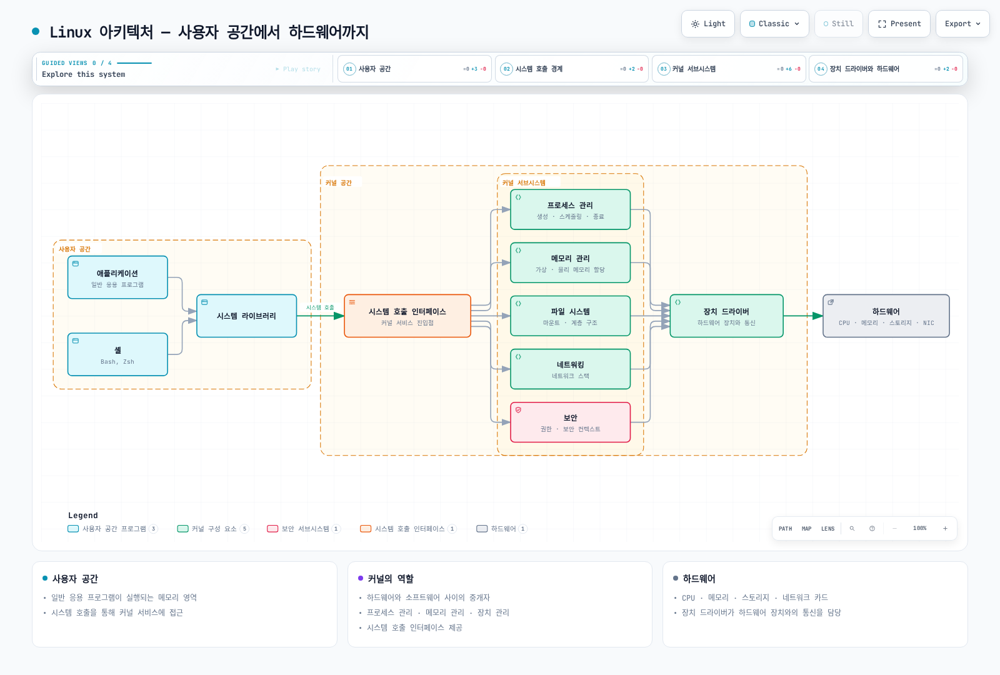
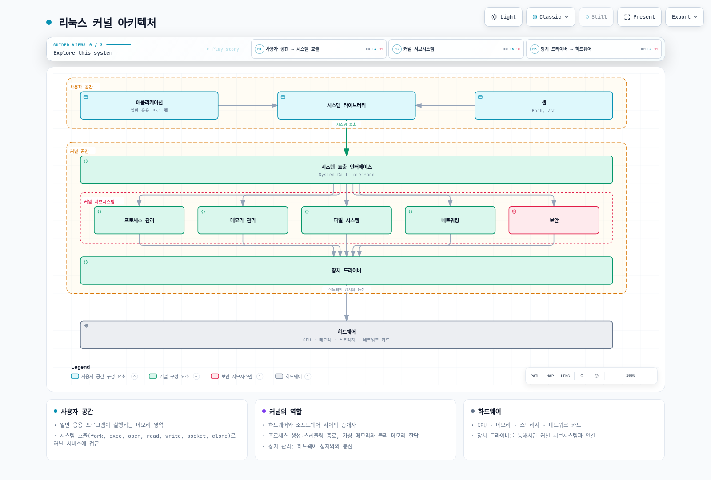
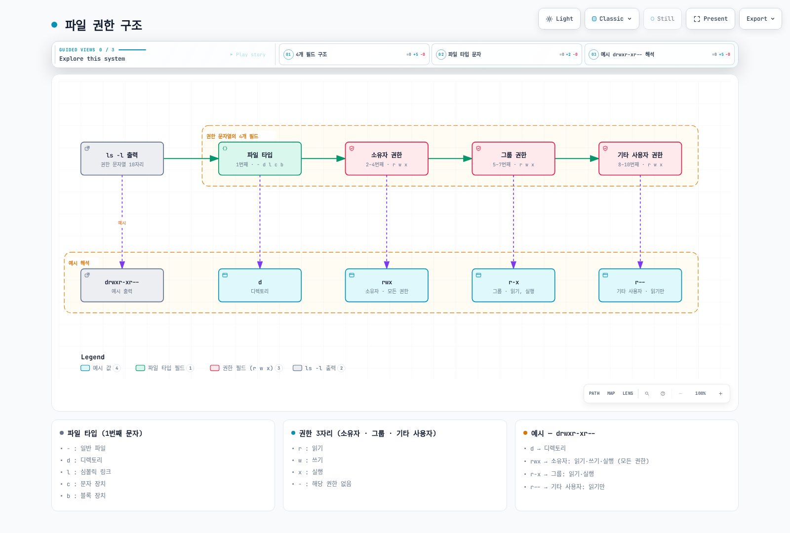
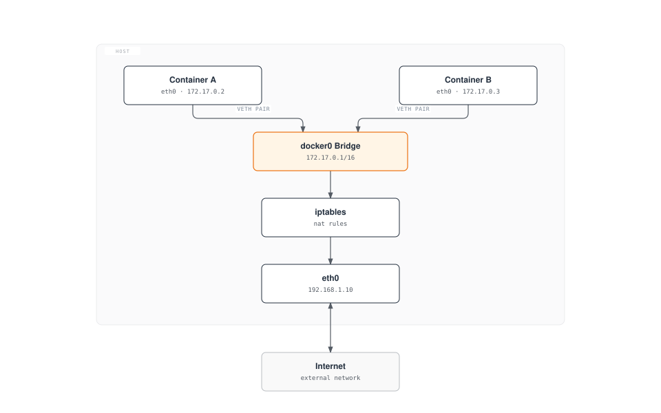

# Linux 기초

> **지원 버전**: 모든 주요 Linux 배포판 (Ubuntu 20.04+, CentOS/RHEL 8+, Debian 11+) **마지막 업데이트**: 2026년 2월 11일

Kubernetes와 컨테이너 기술을 이해하기 위해서는 Linux에 대한 기본적인 이해가 필수적입니다. 이 문서에서는 Kubernetes 환경에서 특히 중요한 Linux의 핵심 개념들을 다룹니다.

## 실습 환경 설정

이 문서의 예제를 따라하기 위해서는 다음과 같은 환경이 필요합니다:

### 필수 환경

* Linux 운영체제 (Ubuntu 20.04+, CentOS/RHEL 8+, Debian 11+ 권장)
* 터미널 액세스
* sudo 권한

### 클라우드 환경 설정 (선택 사항)

AWS EC2 인스턴스를 사용하는 경우:

```bash
# Amazon Linux 2 인스턴스 시작
aws ec2 run-instances \
  --image-id ami-0c55b159cbfafe1f0 \
  --instance-type t3.micro \
  --key-name your-key-pair \
  --security-group-ids sg-12345678 \
  --subnet-id subnet-12345678

# SSH 접속
ssh -i your-key.pem ec2-user@your-instance-public-ip
```

### 로컬 환경 설정 (선택 사항)

로컬 환경에서 실습하려면 다음 중 하나를 사용할 수 있습니다:

* **VirtualBox + Vagrant**: 가상 머신 환경 구성
* **WSL2**: Windows에서 Linux 환경 사용
* **Docker**: 컨테이너 환경에서 실습

## 목차

* [Linux 커널과 사용자 공간](01-linux-basics.md#linux-커널과-사용자-공간)
* [프로세스 관리](01-linux-basics.md#프로세스-관리)
* [네임스페이스](01-linux-basics.md#네임스페이스)
* [cgroups (Control Groups)](01-linux-basics.md#cgroups-control-groups)
* [파일 시스템](01-linux-basics.md#파일-시스템)
* [네트워킹 기초](01-linux-basics.md#네트워킹-기초)
* [보안 컨텍스트](01-linux-basics.md#보안-컨텍스트)
* [systemd와 서비스 관리](01-linux-basics.md#systemd와-서비스-관리)
* [커널 파라미터와 모듈](01-linux-basics.md#커널-파라미터와-모듈)
* [시스템 리소스 제한](01-linux-basics.md#시스템-리소스-제한)
* [로그 관리](01-linux-basics.md#로그-관리)
* [DNS와 네트워크 설정](01-linux-basics.md#dns와-네트워크-설정)
* [시간 동기화](01-linux-basics.md#시간-동기화)
* [패키지 관리](01-linux-basics.md#패키지-관리)
* [주요 Linux 명령어](01-linux-basics.md#주요-linux-명령어)
* [컨테이너 관련 Linux 기능](01-linux-basics.md#컨테이너-관련-linux-기능)

## Linux 커널과 사용자 공간

### 커널의 역할

> **핵심 개념**: Linux 커널은 운영체제의 핵심으로, 하드웨어와 소프트웨어 사이의 중개자 역할을 합니다.

Linux 커널은 운영체제의 핵심으로, 하드웨어와 소프트웨어 사이의 중개자 역할을 합니다. 주요 기능은 다음과 같습니다:

* **프로세스 관리**: 프로세스 생성, 스케줄링, 종료
* **메모리 관리**: 가상 메모리, 물리적 메모리 할당
* **장치 관리**: 하드웨어 장치와의 통신
* **시스템 호출 인터페이스**: 사용자 공간 프로그램이 커널 서비스에 접근할 수 있는 방법 제공

### 사용자 공간

사용자 공간은 일반 응용 프로그램이 실행되는 메모리 영역입니다. 사용자 공간 프로그램은 시스템 호출을 통해 커널 서비스에 접근합니다.



[🔍 인터랙티브 다이어그램 보기](https://www.atomai.click/kubernetes-docs/archmaps/ko-basics-01-linux-basics-0.html)

### 시스템 호출 예시

| 시스템 호출     | 설명          | 관련 명령어              |
| ---------- | ----------- | ------------------- |
| `fork()`   | 새 프로세스 생성   | `ps`, `top`         |
| `exec()`   | 프로그램 실행     | `bash`, `sh`        |
| `open()`   | 파일 열기       | `cat`, `less`       |
| `read()`   | 파일에서 데이터 읽기 | `cat`, `grep`       |
| `write()`  | 파일에 데이터 쓰기  | `echo`, `tee`       |
| `socket()` | 네트워크 소켓 생성  | `netstat`, `ss`     |
| `clone()`  | 네임스페이스 생성   | `unshare`, `docker` |

### 리눅스 커널 아키텍처



[🔍 인터랙티브 다이어그램 보기](https://www.atomai.click/kubernetes-docs/archmaps/ko-basics-01-linux-basics-1.html)

## 프로세스 관리

### 프로세스와 스레드

* **프로세스**: 실행 중인 프로그램의 인스턴스로, 독립된 메모리 공간을 가짐
* **스레드**: 프로세스 내에서 실행되는 작업 단위로, 같은 프로세스의 스레드들은 메모리 공간을 공유

### 프로세스 상태

* **실행(Running)**: CPU에서 실행 중
* **대기(Waiting)**: I/O 완료 또는 이벤트 발생 대기
* **준비(Ready)**: 실행 가능하지만 CPU 할당 대기
* **좀비(Zombie)**: 종료되었지만 부모 프로세스가 상태를 확인하지 않은 상태
* **중단(Stopped)**: 일시 중지된 상태

### 주요 프로세스 관리 명령어

```bash
# 프로세스 목록 확인
ps aux

# 실시간 프로세스 모니터링
top

# 더 향상된 실시간 프로세스 모니터링
htop

# 프로세스 종료
kill <PID>
killall <프로세스명>

# 백그라운드 실행
command &

# 작업 관리
jobs
fg %<작업번호>
bg %<작업번호>
```

## 네임스페이스

네임스페이스는 Linux 커널의 기능으로, 프로세스 그룹을 격리하여 각 그룹이 시스템 자원을 독립적으로 볼 수 있게 합니다. 이는 컨테이너 기술의 핵심 요소입니다.

### 주요 네임스페이스 유형

* **PID 네임스페이스**: 프로세스 ID 격리, 컨테이너가 자체 PID 1(init)을 가질 수 있게 함
* **네트워크 네임스페이스**: 네트워크 스택 격리 (인터페이스, IP 주소, 라우팅 테이블, 방화벽 등), 컨테이너 네트워킹의 기반
* **마운트 네임스페이스**: 파일 시스템 마운트 포인트 격리, 컨테이너별 독립적인 파일 시스템 제공
* **UTS 네임스페이스**: 호스트명과 도메인명 격리, 각 컨테이너에 고유한 호스트 식별자 부여
* **IPC 네임스페이스**: 프로세스 간 통신 자원 격리 (공유 메모리, 세마포어, 메시지 큐 등), 마이크로서비스 아키텍처에서 서비스 간 격리에 중요
* **사용자 네임스페이스**: 사용자 및 그룹 ID 격리, 루트리스(rootless) 컨테이너 실행 지원으로 보안 강화
* **cgroup 네임스페이스**: cgroup 루트 디렉토리 격리, 컨테이너 내부에서 리소스 제한 가시성 제공
* **시간 네임스페이스**: 시스템 클록 격리, 컨테이너별 독립적인 시간 설정 가능 (Linux 5.6+)

### 네임스페이스 관련 명령어

```bash
# 프로세스의 네임스페이스 확인
ls -la /proc/<PID>/ns/

# 새로운 네임스페이스에서 명령 실행
unshare --net --pid --fork --mount-proc bash

# 기존 프로세스의 네임스페이스에 진입
nsenter --target <PID> --net --pid bash

# 네트워크 네임스페이스 생성 및 관리
ip netns add <name>
ip netns exec <name> <command>

# 루트리스(rootless) 컨테이너 실행을 위한 사용자 네임스페이스 활용
unshare --user --map-root-user --mount --net bash

# 시간 네임스페이스 사용 (Linux 5.6+)
unshare --time bash
```

## cgroups (Control Groups)

cgroups는 프로세스 그룹의 자원 사용을 제한하고 격리하는 Linux 커널 기능입니다. 컨테이너의 자원 제한을 구현하는 데 사용됩니다. 클라우드 네이티브 환경과 Kubernetes에서 리소스 관리의 핵심 기술입니다.

### cgroups의 주요 기능

* **CPU 시간 제한**: 프로세스 그룹이 사용할 수 있는 CPU 시간 제한 및 CPU 코어 할당
* **메모리 제한**: 프로세스 그룹이 사용할 수 있는 메모리 양 제한 및 OOM(Out of Memory) 동작 제어
* **블록 I/O 제한**: 디스크 I/O 대역폭 제한 및 우선순위 설정
* **네트워크 대역폭 제한**: 네트워크 트래픽 제한 (tc와 결합)
* **장치 접근 제어**: 특정 장치에 대한 접근 제어 및 권한 관리
* **pids 제어**: 프로세스 생성 수 제한으로 fork 폭탄 방지
* **freezer**: 프로세스 그룹 일시 중지 및 재개 (컨테이너 일시 중지에 활용)
* **cpuset**: 특정 CPU 코어와 NUMA 노드에 프로세스 바인딩

### cgroups v1과 v2

* **cgroups v1**: 각 자원 유형별로 별도의 계층 구조, 레거시 시스템에서 여전히 사용
* **cgroups v2**: 통합된 단일 계층 구조로 더 일관된 관리 제공, 최신 배포판의 기본값
* **하이브리드 모드**: v1과 v2를 함께 사용하여 호환성 유지하면서 새 기능 활용

### cgroups 관련 명령어

```bash
# cgroups 확인
ls -la /sys/fs/cgroup/                     # cgroups v2
ls -la /sys/fs/cgroup/cpu /sys/fs/cgroup/memory  # cgroups v1

# systemd를 통한 cgroups 관리 (현대적인 방식)
systemctl set-property <서비스명> CPUQuota=20%
systemctl set-property <서비스명> MemoryLimit=1G
systemctl set-property <서비스명> IOWeight=500

# 프로세스의 cgroup 확인
cat /proc/<PID>/cgroup

# cgroups v2 직접 조작 (고급)
echo $$ > /sys/fs/cgroup/user.slice/cgroup.procs
echo "max 100000" > /sys/fs/cgroup/user.slice/memory.max
echo "100000 500000" > /sys/fs/cgroup/user.slice/memory.high

# 컨테이너 런타임과 cgroups
podman stats  # 컨테이너 리소스 사용량 모니터링
docker run --cpus=0.5 --memory=512m nginx  # 리소스 제한 설정
```

## 파일 시스템

### 파일 시스템 계층 구조

Linux는 단일 루트 디렉토리(`/`)에서 시작하는 계층적 파일 시스템 구조를 가집니다.

주요 디렉토리:

* `/bin`: 기본 명령어
* `/sbin`: 시스템 관리 명령어
* `/etc`: 시스템 구성 파일
* `/home`: 사용자 홈 디렉토리
* `/var`: 가변 데이터 (로그, 캐시 등)
* `/tmp`: 임시 파일
* `/usr`: 사용자 프로그램 및 데이터
* `/proc`: 프로세스 및 커널 정보 (가상 파일 시스템)
* `/sys`: 시스템 및 하드웨어 정보 (가상 파일 시스템)

### 파일 시스템 유형

* **ext4**: Linux의 기본 파일 시스템
* **XFS**: 대용량 파일 시스템에 적합
* **Btrfs**: 스냅샷, 압축 등 고급 기능 제공
* **OverlayFS**: 여러 디렉토리를 겹쳐서 단일 디렉토리로 표현 (컨테이너에서 많이 사용)
* **tmpfs**: 메모리 기반 임시 파일 시스템

### 마운트와 볼륨

```bash
# 파일 시스템 마운트
mount -t <파일시스템유형> <소스> <마운트포인트>

# 마운트된 파일 시스템 확인
mount
df -h

# 파일 시스템 언마운트
umount <마운트포인트>
```

## 네트워킹 기초

### 네트워크 인터페이스

* **lo**: 루프백 인터페이스 (127.0.0.1)
* **eth0, ens3 등**: 물리적 네트워크 인터페이스
* **docker0, cni0 등**: 가상 브릿지 인터페이스 (컨테이너 네트워킹)

### 네트워크 구성 명령어

```bash
# 네트워크 인터페이스 확인
ip addr show
ifconfig

# 라우팅 테이블 확인
ip route
route -n

# 네트워크 연결 확인
netstat -tuln
ss -tuln

# 네트워크 패킷 분석
tcpdump -i <인터페이스>
```

### 네트워크 네임스페이스와 가상 인터페이스

```bash
# 네트워크 네임스페이스 생성
ip netns add <네임스페이스명>

# 가상 이더넷 페어 생성
ip link add <veth1> type veth peer name <veth2>

# 가상 인터페이스를 네임스페이스에 연결
ip link set <veth2> netns <네임스페이스명>
```

## 보안 컨텍스트

### 사용자와 그룹

* **UID (User ID)**: 사용자 식별자
* **GID (Group ID)**: 그룹 식별자
* **root (UID 0)**: 관리자 권한을 가진 특별한 사용자

### 파일 권한

Linux 파일 권한은 소유자, 그룹, 기타 사용자에 대한 읽기(r), 쓰기(w), 실행(x) 권한으로 구성됩니다.



[🔍 인터랙티브 다이어그램 보기](https://www.atomai.click/kubernetes-docs/archmaps/ko-basics-01-linux-basics-2.html)

### 권한 관련 명령어

```bash
# 파일 권한 변경
chmod 755 <파일명>  # rwxr-xr-x
chmod u+x <파일명>  # 소유자에게 실행 권한 추가

# 파일 소유자 변경
chown <사용자>:<그룹> <파일명>

# 특수 권한
chmod 4755 <파일명>  # setuid 설정
chmod 2755 <파일명>  # setgid 설정
chmod 1755 <파일명>  # sticky bit 설정
```

### SELinux와 AppArmor

* **SELinux (Security-Enhanced Linux)**: NSA에서 개발한 강제적 접근 제어 시스템
* **AppArmor**: 프로그램별 보안 프로필을 통한 접근 제어 시스템

```bash
# SELinux 상태 확인
getenforce

# SELinux 모드 변경
setenforce 0  # Permissive 모드
setenforce 1  # Enforcing 모드

# AppArmor 상태 확인
aa-status

# AppArmor 프로필 관리
aa-enforce /etc/apparmor.d/<프로필>
aa-complain /etc/apparmor.d/<프로필>
```

## systemd와 서비스 관리

systemd는 현대적인 Linux 시스템의 init 시스템이자 서비스 관리자입니다. Kubernetes 노드에서 kubelet, containerd 등 핵심 서비스를 관리하는 데 사용됩니다.

### systemd의 주요 기능

* **서비스 관리**: 시스템 서비스의 시작, 중지, 재시작, 활성화/비활성화
* **의존성 관리**: 서비스 간 의존성 자동 관리 및 병렬 시작
* **로깅**: journald를 통한 통합 로그 관리
* **타이머**: cron 대신 사용할 수 있는 타이머 유닛
* **리소스 관리**: cgroups를 통한 서비스별 리소스 제한

### systemd 유닛 타입

* **service**: 시스템 서비스 (예: kubelet.service, containerd.service)
* **socket**: 소켓 기반 활성화
* **target**: 유닛 그룹 (런레벨과 유사)
* **timer**: 예약 작업
* **mount**: 파일 시스템 마운트
* **device**: 장치 유닛

### systemd 명령어

```bash
# 서비스 상태 확인
systemctl status kubelet
systemctl status containerd

# 서비스 제어
systemctl start <서비스>
systemctl stop <서비스>
systemctl restart <서비스>
systemctl reload <서비스>  # 설정 다시 읽기

# 부팅 시 자동 시작 설정
systemctl enable <서비스>
systemctl disable <서비스>

# 서비스 로그 확인
journalctl -u kubelet -f  # 실시간 로그
journalctl -u kubelet --since "1 hour ago"
journalctl -u kubelet --no-pager

# 모든 서비스 목록
systemctl list-units --type=service
systemctl list-unit-files --type=service

# 실패한 서비스 확인
systemctl --failed

# systemd 설정 다시 읽기
systemctl daemon-reload
```

### systemd 유닛 파일 작성

Kubernetes 관련 서비스의 systemd 유닛 파일 예시:

```ini
# /etc/systemd/system/kubelet.service
[Unit]
Description=kubelet: The Kubernetes Node Agent
Documentation=https://kubernetes.io/docs/
Wants=network-online.target
After=network-online.target

[Service]
ExecStart=/usr/bin/kubelet
Restart=always
StartLimitInterval=0
RestartSec=10

[Install]
WantedBy=multi-user.target
```

### systemd 리소스 제한

```bash
# CPU 제한 (20%)
systemctl set-property kubelet CPUQuota=20%

# 메모리 제한 (1GB)
systemctl set-property kubelet MemoryLimit=1G

# I/O 가중치 설정 (100-1000, 기본 100)
systemctl set-property kubelet IOWeight=500

# 설정 확인
systemctl show kubelet | grep -E 'CPUQuota|MemoryLimit|IOWeight'
```

## 커널 파라미터와 모듈

### sysctl을 통한 커널 파라미터 설정

sysctl은 실행 중인 커널의 파라미터를 조회하고 변경하는 도구입니다. Kubernetes 클러스터 구성 시 네트워크 및 시스템 파라미터 튜닝에 필수적입니다.

#### Kubernetes에 필요한 주요 sysctl 설정

```bash
# IP 포워딩 활성화 (컨테이너 네트워킹에 필수)
sysctl -w net.ipv4.ip_forward=1
sysctl -w net.ipv6.conf.all.forwarding=1

# 브릿지 트래픽이 iptables를 통과하도록 설정 (CNI 플러그인에 필수)
sysctl -w net.bridge.bridge-nf-call-iptables=1
sysctl -w net.bridge.bridge-nf-call-ip6tables=1

# 최대 파일 디스크립터 수 증가
sysctl -w fs.file-max=2097152

# 네트워크 성능 튜닝
sysctl -w net.core.somaxconn=32768
sysctl -w net.ipv4.tcp_max_syn_backlog=8192
sysctl -w net.core.netdev_max_backlog=16384

# ARP 캐시 설정 (대규모 클러스터)
sysctl -w net.ipv4.neigh.default.gc_thresh1=80000
sysctl -w net.ipv4.neigh.default.gc_thresh2=90000
sysctl -w net.ipv4.neigh.default.gc_thresh3=100000

# 현재 설정 확인
sysctl net.ipv4.ip_forward
sysctl -a | grep bridge-nf-call

# 영구 설정 (/etc/sysctl.conf 또는 /etc/sysctl.d/*.conf)
cat <<EOF | sudo tee /etc/sysctl.d/99-kubernetes.conf
net.ipv4.ip_forward = 1
net.bridge.bridge-nf-call-iptables = 1
net.bridge.bridge-nf-call-ip6tables = 1
EOF

# 설정 적용
sysctl --system
```

### 커널 모듈 관리

많은 CNI 플러그인과 스토리지 드라이버가 특정 커널 모듈을 필요로 합니다.

```bash
# 모듈 로드
modprobe overlay  # OverlayFS (컨테이너 스토리지)
modprobe br_netfilter  # 브릿지 네트워킹
modprobe ip_vs  # IPVS 로드 밸런싱 (kube-proxy IPVS 모드)
modprobe ip_vs_rr  # Round Robin 알고리즘
modprobe ip_vs_wrr  # Weighted Round Robin
modprobe ip_vs_sh  # Source Hashing

# 로드된 모듈 확인
lsmod | grep overlay
lsmod | grep br_netfilter

# 모듈 정보 확인
modinfo overlay

# 부팅 시 자동 로드 설정
cat <<EOF | sudo tee /etc/modules-load.d/kubernetes.conf
overlay
br_netfilter
ip_vs
ip_vs_rr
ip_vs_wrr
ip_vs_sh
EOF

# 모듈 언로드
modprobe -r <모듈명>
```

### 커널 버전 및 기능 확인

```bash
# 커널 버전 확인
uname -r

# 커널 컴파일 옵션 확인
cat /boot/config-$(uname -r) | grep OVERLAY
cat /boot/config-$(uname -r) | grep NETFILTER

# 사용 가능한 커널 기능 확인
cat /proc/filesystems  # 지원되는 파일 시스템
cat /proc/sys/net/ipv4/ip_forward  # IP 포워딩 상태
```

## 시스템 리소스 제한

### ulimit - 사용자별 리소스 제한

ulimit은 프로세스가 사용할 수 있는 시스템 리소스를 제한합니다. Kubernetes 노드에서 충분한 리소스를 확보하기 위해 조정이 필요할 수 있습니다.

```bash
# 현재 제한 확인
ulimit -a

# 주요 제한 항목
ulimit -n      # 열 수 있는 파일 디스크립터 수
ulimit -u      # 최대 프로세스 수
ulimit -m      # 최대 메모리 크기
ulimit -v      # 가상 메모리 크기

# 제한 변경 (현재 세션)
ulimit -n 65536  # 파일 디스크립터를 65536으로 증가

# 영구 설정 (/etc/security/limits.conf)
sudo tee -a /etc/security/limits.conf <<EOF
*               soft    nofile          65536
*               hard    nofile          65536
*               soft    nproc           32768
*               hard    nproc           32768
EOF

# 특정 사용자/그룹 설정
sudo tee -a /etc/security/limits.conf <<EOF
root            soft    nofile          65536
root            hard    nofile          65536
@docker         soft    nofile          65536
@docker         hard    nofile          65536
EOF
```

### PAM 제한 설정

```bash
# PAM 설정 확인
cat /etc/pam.d/common-session
cat /etc/pam.d/common-session-noninteractive

# limits.conf가 적용되도록 PAM 설정에 추가
echo "session required pam_limits.so" | sudo tee -a /etc/pam.d/common-session
```

### 프로세스별 리소스 확인

```bash
# 프로세스의 현재 리소스 제한 확인
cat /proc/<PID>/limits

# 특정 프로세스의 파일 디스크립터 확인
ls -l /proc/<PID>/fd | wc -l
```

## 로그 관리

### journald - systemd 통합 로깅

journald는 systemd의 로깅 시스템으로, Kubernetes 노드의 시스템 서비스 로그를 관리합니다.

```bash
# 전체 시스템 로그
journalctl

# 특정 서비스 로그
journalctl -u kubelet
journalctl -u containerd
journalctl -u docker

# 실시간 로그 (tail -f와 유사)
journalctl -u kubelet -f

# 시간 범위 지정
journalctl --since "2025-11-24 10:00:00"
journalctl --since "1 hour ago"
journalctl --since yesterday
journalctl --until "2025-11-24 12:00:00"

# 우선순위별 필터링
journalctl -p err        # 에러만
journalctl -p warning    # 경고 이상
journalctl -p debug      # 디버그 포함 모두

# 출력 형식 변경
journalctl -u kubelet -o json        # JSON 형식
journalctl -u kubelet -o json-pretty # Pretty JSON
journalctl -u kubelet -o cat         # 메시지만

# 부팅 로그
journalctl -b           # 현재 부팅 로그
journalctl -b -1        # 이전 부팅 로그
journalctl --list-boots # 부팅 목록

# 디스크 사용량 확인
journalctl --disk-usage

# 로그 정리
journalctl --vacuum-time=7d   # 7일 이상된 로그 삭제
journalctl --vacuum-size=1G   # 1GB 이상 로그 삭제
```

### journald 설정

```bash
# journald 설정 파일
sudo vi /etc/systemd/journald.conf

# 주요 설정 옵션
# Storage=persistent        # 디스크에 영구 저장
# SystemMaxUse=1G          # 최대 디스크 사용량
# SystemKeepFree=500M      # 최소 여유 공간
# MaxRetentionSec=1month   # 최대 보관 기간

# 설정 적용
sudo systemctl restart systemd-journald
```

### 전통적인 syslog

일부 시스템에서는 여전히 syslog를 사용합니다.

```bash
# syslog 파일 위치
/var/log/syslog         # Debian/Ubuntu
/var/log/messages       # RHEL/CentOS

# 실시간 로그 확인
tail -f /var/log/syslog

# 로그 검색
grep "kubelet" /var/log/syslog
grep -i "error" /var/log/syslog
```

### 로그 로테이션

로그 파일이 무한정 커지지 않도록 로그 로테이션을 설정합니다.

```bash
# logrotate 설정
sudo vi /etc/logrotate.d/kubernetes

# 예시 설정
/var/log/kubernetes/*.log {
    daily
    rotate 7
    missingok
    notifempty
    compress
    delaycompress
    copytruncate
}

# 수동으로 로테이션 실행
sudo logrotate -f /etc/logrotate.d/kubernetes
```

## DNS와 네트워크 설정

### DNS 설정

DNS는 Kubernetes 클러스터 내부 서비스 디스커버리의 핵심입니다.

```bash
# DNS 설정 파일
cat /etc/resolv.conf

# 예시 설정
nameserver 8.8.8.8
nameserver 8.8.4.4
search cluster.local svc.cluster.local
options ndots:5

# DNS 조회 테스트
nslookup kubernetes.default.svc.cluster.local
dig kubernetes.default.svc.cluster.local

# hosts 파일
cat /etc/hosts
```

### systemd-resolved

현대적인 Linux 배포판에서는 systemd-resolved를 사용합니다.

```bash
# systemd-resolved 상태 확인
systemctl status systemd-resolved

# DNS 서버 확인
resolvectl status

# DNS 캐시 통계
resolvectl statistics

# DNS 캐시 초기화
resolvectl flush-caches
```

### 네트워크 설정 파일

```bash
# NetworkManager (RHEL/CentOS 8+, Ubuntu 18.04+)
nmcli connection show
nmcli device status

# netplan (Ubuntu 18.04+)
cat /etc/netplan/*.yaml

# 예시 netplan 설정
network:
  version: 2
  ethernets:
    eth0:
      dhcp4: true
      nameservers:
        addresses: [8.8.8.8, 8.8.4.4]

# 설정 적용
sudo netplan apply
```

## 시간 동기화

시간 동기화는 분산 시스템에서 매우 중요합니다. Kubernetes 클러스터의 모든 노드는 정확한 시간을 유지해야 합니다.

### chronyd (권장)

chronyd는 현대적인 NTP 클라이언트로, ntpd보다 빠르게 시간을 동기화합니다.

```bash
# chronyd 설치 (RHEL/CentOS)
sudo yum install chrony

# chronyd 설치 (Ubuntu/Debian)
sudo apt install chrony

# 서비스 상태 확인
systemctl status chronyd

# 시간 동기화 상태 확인
chronyc tracking

# NTP 서버 목록
chronyc sources

# 상세 정보
chronyc sourcestats

# 수동 시간 동기화
sudo chronyc makestep
```

### chronyd 설정

```bash
# 설정 파일
sudo vi /etc/chrony.conf

# 주요 설정
# NTP 서버 설정
server 0.pool.ntp.org iburst
server 1.pool.ntp.org iburst
server 2.pool.ntp.org iburst
server 3.pool.ntp.org iburst

# 빠른 동기화
makestep 1.0 3

# 설정 적용
sudo systemctl restart chronyd
```

### timesyncd (Ubuntu 기본)

Ubuntu는 기본적으로 systemd-timesyncd를 사용합니다.

```bash
# 상태 확인
timedatectl status

# NTP 동기화 상태
timedatectl show-timesync --all

# 설정 파일
sudo vi /etc/systemd/timesyncd.conf

# 예시 설정
[Time]
NTP=0.pool.ntp.org 1.pool.ntp.org
FallbackNTP=time.google.com

# 서비스 재시작
sudo systemctl restart systemd-timesyncd
```

### 시간대 설정

```bash
# 현재 시간 및 시간대 확인
timedatectl

# 시간대 목록
timedatectl list-timezones

# 시간대 변경
sudo timedatectl set-timezone Asia/Seoul

# 시간 수동 설정 (NTP 비활성화 시)
sudo timedatectl set-time "2025-11-24 12:00:00"

# NTP 활성화/비활성화
sudo timedatectl set-ntp true
```

## 패키지 관리

Kubernetes와 관련 도구를 설치하고 관리하기 위한 패키지 관리자 사용법입니다.

### apt (Debian/Ubuntu)

```bash
# 패키지 목록 업데이트
sudo apt update

# 패키지 업그레이드
sudo apt upgrade

# 패키지 설치
sudo apt install <패키지명>

# 패키지 제거
sudo apt remove <패키지명>
sudo apt purge <패키지명>  # 설정 파일도 함께 제거

# 패키지 검색
apt search <키워드>

# 패키지 정보 확인
apt show <패키지명>

# 설치된 패키지 목록
apt list --installed

# 저장소 추가 (Kubernetes 예시)
sudo apt install -y apt-transport-https ca-certificates curl
curl -fsSL https://pkgs.k8s.io/core:/stable:/v1.28/deb/Release.key | \
  sudo gpg --dearmor -o /etc/apt/keyrings/kubernetes-apt-keyring.gpg
echo 'deb [signed-by=/etc/apt/keyrings/kubernetes-apt-keyring.gpg] \
  https://pkgs.k8s.io/core:/stable:/v1.28/deb/ /' | \
  sudo tee /etc/apt/sources.list.d/kubernetes.list

# 불필요한 패키지 정리
sudo apt autoremove
sudo apt autoclean
```

### yum/dnf (RHEL/CentOS/Fedora)

```bash
# 패키지 설치
sudo yum install <패키지명>
sudo dnf install <패키지명>  # Fedora/RHEL 8+

# 패키지 업데이트
sudo yum update
sudo dnf update

# 패키지 제거
sudo yum remove <패키지명>
sudo dnf remove <패키지명>

# 패키지 검색
yum search <키워드>
dnf search <키워드>

# 패키지 정보
yum info <패키지명>
dnf info <패키지명>

# 설치된 패키지 목록
yum list installed
dnf list installed

# 저장소 추가 (Kubernetes 예시)
cat <<EOF | sudo tee /etc/yum.repos.d/kubernetes.repo
[kubernetes]
name=Kubernetes
baseurl=https://pkgs.k8s.io/core:/stable:/v1.28/rpm/
enabled=1
gpgcheck=1
gpgkey=https://pkgs.k8s.io/core:/stable:/v1.28/rpm/repodata/repomd.xml.key
EOF

# 캐시 정리
sudo yum clean all
sudo dnf clean all
```

### 패키지 버전 고정

Kubernetes 구성 요소는 버전 호환성이 중요하므로 자동 업데이트를 방지해야 합니다.

```bash
# apt (Ubuntu/Debian)
sudo apt-mark hold kubelet kubeadm kubectl

# apt hold 해제
sudo apt-mark unhold kubelet kubeadm kubectl

# yum (RHEL/CentOS)
sudo yum install yum-plugin-versionlock
sudo yum versionlock add kubelet kubeadm kubectl

# yum versionlock 해제
sudo yum versionlock delete kubelet kubeadm kubectl
```

## 주요 Linux 명령어

### 파일 및 디렉토리 관리

```bash
ls -la           # 파일 목록 (숨김 파일 포함)
cd <디렉토리>     # 디렉토리 변경
pwd              # 현재 디렉토리 확인
mkdir -p <경로>   # 디렉토리 생성 (필요시 상위 디렉토리도 생성)
rm -rf <경로>     # 파일/디렉토리 삭제
cp -r <소스> <대상> # 파일/디렉토리 복사
mv <소스> <대상>   # 파일/디렉토리 이동 또는 이름 변경
find <경로> -name "<패턴>" # 파일 검색
```

### 텍스트 처리

```bash
cat <파일>        # 파일 내용 출력
less <파일>       # 파일 내용 페이지별 확인
grep "<패턴>" <파일> # 파일에서 패턴 검색
sed 's/<패턴>/<대체>/' <파일> # 텍스트 치환
awk '{print $1}' <파일> # 텍스트 처리
```

### 시스템 정보

```bash
uname -a         # 커널 정보
lsb_release -a   # 배포판 정보
free -h          # 메모리 사용량
df -h            # 디스크 사용량
du -sh <경로>     # 디렉토리 크기
```

### 프로세스 및 서비스 관리

```bash
systemctl status <서비스> # 서비스 상태 확인
systemctl start/stop/restart <서비스> # 서비스 제어
journalctl -u <서비스> # 서비스 로그 확인
```

## 컨테이너 관련 Linux 기능

### OverlayFS

OverlayFS는 여러 디렉토리를 겹쳐서 단일 디렉토리로 표현하는 유니온 마운트 파일 시스템입니다. Docker와 같은 컨테이너 런타임에서 이미지 레이어를 구현하는 데 사용됩니다.


### 네트워크 브릿지와 NAT

컨테이너 네트워킹은 주로 브릿지 인터페이스와 NAT(Network Address Translation)를 사용하여 구현됩니다.



### 시스템 호출 필터링 (seccomp)

seccomp(Secure Computing Mode)는 프로세스가 사용할 수 있는 시스템 호출을 제한하는 Linux 커널 기능입니다. 컨테이너의 보안을 강화하는 데 사용됩니다.

### 기능(Capabilities) 제한

Linux 기능은 전통적인 root 권한을 더 작은 권한 단위로 나눈 것입니다. 컨테이너는 필요한 기능만 부여받아 보안을 강화합니다.

주요 기능:

* `CAP_NET_ADMIN`: 네트워크 설정 변경
* `CAP_SYS_ADMIN`: 시스템 관리 작업
* `CAP_CHOWN`: 파일 소유권 변경
* `CAP_DAC_OVERRIDE`: 파일 권한 무시

## 결론

Linux의 기본 개념과 기능은 Kubernetes와 컨테이너 기술을 이해하는 데 필수적입니다. 이 문서에서 다룬 주요 내용을 정리하면:

### 핵심 기술

* **네임스페이스와 cgroups**: 컨테이너 격리와 자원 관리의 기반
* **OverlayFS**: 컨테이너 이미지 레이어링의 핵심
* **systemd**: Kubernetes 노드 서비스 관리

### 운영 필수 지식

* **커널 파라미터 튜닝**: sysctl을 통한 네트워킹 및 시스템 최적화
* **모듈 관리**: CNI 플러그인과 스토리지 드라이버 지원
* **로그 관리**: journald를 통한 시스템 및 서비스 로그 분석
* **시간 동기화**: 분산 시스템의 일관성 유지

### 문제 해결

* **리소스 제한**: ulimit과 cgroups를 통한 리소스 관리
* **네트워킹**: DNS, 브릿지, iptables 설정
* **패키지 관리**: Kubernetes 구성 요소의 버전 관리

이러한 Linux 기초 지식을 바탕으로 Kubernetes 환경에서 발생하는 문제를 효과적으로 해결하고, 클러스터를 최적화하며, 안정적으로 운영할 수 있습니다.

## 퀴즈

이 장에서 배운 내용을 테스트하려면 [Linux 기초 퀴즈](../quizzes/basics/01-linux-basics-quiz.md)를 풀어보세요.

## 참고 자료

* [The Linux Documentation Project](https://tldp.org/)
* [Linux Kernel Documentation](https://www.kernel.org/doc/)
* [Linux Namespaces](https://man7.org/linux/man-pages/man7/namespaces.7.html)
* [Control Groups v2](https://www.kernel.org/doc/html/latest/admin-guide/cgroup-v2.html)
