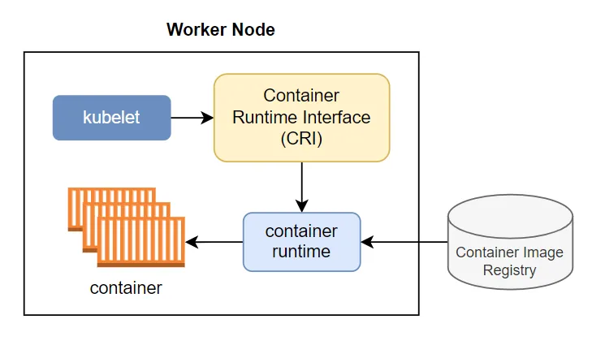
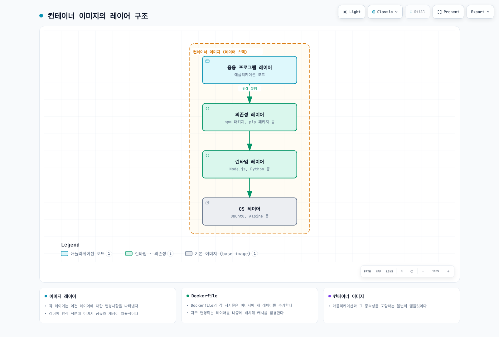

# 컨테이너 기술

> **지원 버전**: 유지 관리 중인 Linux Docker/CRI 릴리스; Kubernetes CRI v1; Node.js 24 빌드 예제 **마지막 업데이트**: 2026년 9월 11일

컨테이너는 애플리케이션과 그 종속성을 함께 패키징하여 다양한 환경에서 일관되게 실행할 수 있게 해주는 기술입니다. 이 문서에서는 컨테이너의 기본 개념, 작동 원리, 그리고 Kubernetes와의 관계에 대해 설명합니다.

## 목차

* [컨테이너란?](03-container-technology.md#컨테이너란)
* [컨테이너 vs 가상 머신](03-container-technology.md#컨테이너-vs-가상-머신)
* [컨테이너의 기술적 기반](03-container-technology.md#컨테이너의-기술적-기반)
* [컨테이너 런타임](03-container-technology.md#컨테이너-런타임)
* [컨테이너 이미지](03-container-technology.md#컨테이너-이미지)
* [Dockerfile](03-container-technology.md#dockerfile)
* [컨테이너 네트워킹](03-container-technology.md#컨테이너-네트워킹)
* [컨테이너 스토리지](03-container-technology.md#컨테이너-스토리지)
* [컨테이너 보안](03-container-technology.md#컨테이너-보안)
* [컨테이너 라이프사이클 관리](03-container-technology.md#컨테이너-라이프사이클-관리)
* [컨테이너 오케스트레이션](03-container-technology.md#컨테이너-오케스트레이션)
* [AWS에서의 컨테이너](03-container-technology.md#aws에서의-컨테이너)

> 아래 Linux 명령은 Linux Docker 호스트를 기준으로 합니다. Docker Desktop에서는 데몬이 VM 안에서 실행되므로 호스트 PID/파일 경로를 데스크톱 OS에서 그대로 조회할 수 없습니다. 이미지 실행은 CPU 아키텍처/OS/커널 호환성이 필요합니다. Kata/Fargate 같은 VM 기반 실행 환경은 여기서 설명하는 기본 프로세스 격리 모델과 구분합니다.

## 컨테이너란?

컨테이너는 애플리케이션과 그 실행에 필요한 모든 것(코드, 런타임, 시스템 도구, 시스템 라이브러리, 설정)을 포함하는 표준화된 소프트웨어 유닛입니다. 컨테이너는 호스트 운영체제의 커널을 공유하면서도 서로 격리된 환경에서 실행됩니다.

### 컨테이너의 주요 특징

1. **이식성**: 개발, 테스트, 프로덕션 환경 간에 일관된 실행 환경 제공
2. **경량성**: 가상 머신보다 적은 리소스 사용
3. **격리**: 다른 컨테이너 및 호스트 시스템과 격리된 실행 환경
4. **신속한 시작 및 종료**: 빠른 시작이 가능하지만 이미지 다운로드와 애플리케이션 초기화에 따라 준비 시간이 달라짐
5. **확장성**: 쉽게 복제하여 수평적 확장 가능
6. **버전 관리**: 이미지 버전 관리를 통한 애플리케이션 라이프사이클 관리

### 컨테이너 기술의 역사

* **2000년대 초**: Linux VServer, OpenVZ 등의 초기 컨테이너 기술 등장
* **2008년**: Linux 2.6.24 릴리스에 초기 cgroups 구현 포함
* **2008년**: LXC(Linux Containers) 프로젝트 시작
* **2013년**: Docker 출시, 컨테이너 기술 대중화
* **2015년**: Open Container Initiative(OCI) 설립, 컨테이너 표준화
* **2017년**: containerd가 CNCF 프로젝트로 기부됨

## 컨테이너 vs 가상 머신

### 가상 머신 아키텍처 vs 컨테이너 아키텍쳐


### 주요 차이점

아래는 구조 비교이며 측정한 성능/시작 시간 벤치마크가 아닙니다. 이미지 크기, 초기화 및 VM 복원 방식에 따라 결과가 달라집니다.

| 특성      | 컨테이너                   | 가상 머신                        |
| ------- | ---------------------- | ---------------------------- |
| 크기      | 애플리케이션/사용자 공간 레이어; 크기는 가변            | 게스트 OS와 애플리케이션; 크기는 가변                   |
| 시작 시간   | 이미지가 로컬에 있으면 빠른 시작 가능           | 부팅/복원 방식에 따라 다름                         |
| 격리 수준   | 프로세스 수준 격리             | 하드웨어 수준 격리                   |
| OS      | 호스트 OS 커널 공유           | 각 VM마다 전체 OS 필요              |
| 성능      | 거의 네이티브                | 약간의 오버헤드                     |
| 보안      | 공유 커널이므로 보안 강화 필요       | 하이퍼바이저 경계가 추가되지만 보안 강화 필요             |
| 리소스 효율성 | 높음                     | 중간                           |
| 사용 사례   | 마이크로서비스, CI/CD, 개발/테스트 | 레거시 앱, 다양한 OS 요구사항, 높은 보안 요구 |

## 컨테이너의 기술적 기반

컨테이너는 Linux 커널의 여러 기능을 활용하여 구현됩니다. 이러한 기술들은 01-linux-basics.md에서 상세히 다루었으며, 여기서는 컨테이너와의 관계를 중심으로 설명합니다.

### 네임스페이스를 통한 격리

컨테이너는 Linux 네임스페이스를 사용하여 프로세스를 격리합니다. 네임스페이스 공유는 구성에 따라 다르며 같은 Kubernetes Pod의 컨테이너는 네트워크 네임스페이스를 공유합니다.

```bash
# 컨테이너의 네임스페이스 확인
docker inspect <container-id> | grep -A 10 "Pid"
ls -la /proc/<pid>/ns/

# 컨테이너 내부에서 프로세스 확인 (격리된 PID 네임스페이스)
docker exec <container-id> ps aux

# 호스트에서 같은 프로세스 확인 (실제 PID)
ps aux | grep <process-name>
```

**컨테이너가 사용하는 네임스페이스**:

* **PID**: 컨테이너는 자신만의 프로세스 트리를 가짐 (PID 1부터 시작)
* **Network**: 독립적인 네트워크 스택 (IP 주소, 라우팅 테이블, 포트)
* **Mount**: 독립적인 파일 시스템 뷰
* **UTS**: 독립적인 호스트네임
* **IPC**: 독립적인 프로세스 간 통신 공간
* **User**: 독립적인 사용자 ID 매핑 (선택적)

### cgroups를 통한 리소스 제한

컨테이너는 cgroups를 사용하여 리소스 사용량을 제한하고 모니터링합니다.

```bash
# CPU 제한이 있는 컨테이너 실행
docker run --cpus=0.5 --memory=512m nginx

# 컨테이너의 리소스 사용량 확인
docker stats <container-id>

# 컨테이너의 cgroup 설정 확인
docker inspect <container-id> | grep -A 20 "Cgroup"

# On a Linux cgroup v2 host, inspect a running container's actual path.
CONTAINER_PID=$(docker inspect -f '{{.State.Pid}}' <container-id>)
if [ "$CONTAINER_PID" -gt 0 ]; then
  CGROUP_PATH=$(awk -F: '$1 == "0" {print $3}' "/proc/$CONTAINER_PID/cgroup")
  cat "/sys/fs/cgroup$CGROUP_PATH/cpu.max"
  cat "/sys/fs/cgroup$CGROUP_PATH/memory.max"
fi
```

**컨테이너가 사용하는 cgroup 리소스 제어**:

* **CPU**: CPU 시간 제한 및 CPU 코어 할당
* **Memory**: 메모리 사용량 제한 및 OOM 동작 제어
* **Block I/O**: 디스크 I/O 대역폭 제한
* **Network**: tc/eBPF와 연동한 트래픽 분류
* **PIDs**: 컨테이너 내 프로세스 수 제한

### OverlayFS를 통한 레이어 관리

Docker Engine 29.0 이상 새 설치는 containerd 이미지 저장소/snapshotter가 기본입니다. 기존 설치는 classic overlay2가 유지될 수 있으므로 docker info로 확인합니다. GraphDriver.Data 경로는 모든 설치에서 제공되지 않습니다.

OCI 이미지 레이어 형식은 저장 구현과 독립적입니다. OverlayFS는 흔한 Linux 백엔드이며 런타임은 다른 스토리지 드라이버/snapshotter도 사용할 수 있습니다.

```bash
# 이미지 레이어 확인
docker history <image-name>

# 컨테이너의 파일 시스템 레이어 확인
docker info --format '{{.Driver}} {{json .DriverStatus}}'
docker image inspect <image-name> --format '{{json .RootFS.Layers}}'

# OverlayFS 마운트 정보 확인
mount | grep overlay
```

**OverlayFS 구조**:

* **LowerDir**: 읽기 전용 이미지 레이어들 (하위 레이어 → 상위 레이어)
* **UpperDir**: 읽기/쓰기 가능한 컨테이너 레이어
* **WorkDir**: OverlayFS 작업 디렉토리
* **MergedDir**: 통합된 뷰 (컨테이너가 보는 파일 시스템)

### 실습: 컨테이너의 기술적 기반 이해하기

```bash
# 1. 간단한 컨테이너 실행
docker run -d --name test-container nginx

# 2. 컨테이너의 PID 확인
CONTAINER_PID=$(docker inspect -f '{{.State.Pid}}' test-container)
echo "Container PID: $CONTAINER_PID"

# 3. 컨테이너의 네임스페이스 확인
ls -la /proc/$CONTAINER_PID/ns/

# 4. 컨테이너의 cgroup 확인
cat /proc/$CONTAINER_PID/cgroup

# 5. 컨테이너의 파일 시스템 레이어 확인
docker inspect test-container | jq '.[0].GraphDriver'

# 6. 정리
docker stop test-container
docker rm test-container
```

## 컨테이너 런타임

컨테이너 런타임은 컨테이너의 생명주기를 관리하는 소프트웨어입니다. 컨테이너 이미지를 실행하고, 컨테이너의 리소스 사용을 제한하며, 네트워킹과 스토리지를 설정합니다.

### 컨테이너 런타임 계층 구조

1. **저수준 런타임 (OCI 호환)**
   * **runc**: Docker의 기본 런타임, OCI 표준 구현체
   * **crun**: C로 작성된 경량 OCI 런타임
   * **kata-containers**: 하드웨어 가상화를 사용한 보안 강화 런타임
   * **gVisor**: 사용자 공간에서 커널 기능을 에뮬레이션하는 보안 런타임
2. **고수준 런타임**
   * **containerd**: Docker에서 분리된 산업 표준 컨테이너 런타임
   * **CRI-O**: Kubernetes를 위해 특별히 설계된 경량 런타임
   * **Docker Engine**: 가장 널리 사용되는 컨테이너 플랫폼

### Kubernetes의 컨테이너 런타임 인터페이스 (CRI)

Kubernetes는 CRI(Container Runtime Interface)를 통해 다양한 컨테이너 런타임과 통합됩니다. CRI는 Kubernetes와 컨테이너 런타임 사이의 표준화된 인터페이스를 제공합니다.



Kubernetes 1.26 이상은 CRI v1을 요구합니다. 지원 중인 containerd/CRI-O 릴리스와 kubelet의 cgroup 드라이버를 맞춥니다. Docker Engine 자체는 CRI를 구현하지 않으며 내장 dockershim은 1.24에서 제거되었습니다. Docker Engine을 연결하려면 cri-dockerd 같은 별도 CRI 어댑터가 필요합니다. Docker로 만든 OCI 이미지는 계속 사용할 수 있습니다. CRI는 kubelet과 런타임의 API 규약이며 별도로 배포하는 중간 서비스 자체를 뜻하지 않습니다.

## 컨테이너 이미지

컨테이너 이미지는 애플리케이션과 그 종속성을 포함하는 불변의 템플릿입니다. 이미지는 여러 레이어로 구성되며, 각 레이어는 파일 시스템의 변경사항을 나타냅니다.

### 이미지 레이어

컨테이너 이미지는 여러 레이어의 스택으로 구성됩니다. 각 레이어는 이전 레이어에 대한 변경사항을 나타냅니다. 이 레이어 방식은 이미지 공유와 캐싱을 효율적으로 만듭니다.




[🔍 인터랙티브 다이어그램 보기](https://www.atomai.click/kubernetes-docs/archmaps/ko-basics-03-container-technology-0.html)

### 이미지 레지스트리

컨테이너 이미지는 레지스트리에 저장되고 공유됩니다. 주요 레지스트리는 다음과 같습니다:

* **Docker Hub**: 가장 큰 공개 레지스트리
* **Amazon ECR**: AWS의 컨테이너 레지스트리 서비스
* **Google Artifact Registry**: 현재 Google Cloud 레지스트리. Container Registry는 2025년 종료되었으며 Artifact Registry 기반 gcr.io 저장소는 별개
* **Azure Container Registry**: Microsoft Azure의 레지스트리
* **GitHub Container Registry**: GitHub의 컨테이너 레지스트리
* **Harbor**: 오픈소스 엔터프라이즈급 레지스트리

### 이미지 태그와 다이제스트

* **태그**: 사람이 읽을 수 있는 참조이며 레지스트리 불변성 정책이 없다면 다른 이미지로 재지정 가능 (예: `nginx:1.30.4`)
* **다이제스트**: 이미지 manifest 또는 다중 플랫폼 index의 콘텐츠 다이제스트(보통 SHA256)이며 config/layer 다이제스트를 참조 (예: `nginx@sha256:2834dc507516af02784808c5f48b7cbe38b8ed5d0f4837f16e78d00deb7e7767`)

## Dockerfile

Dockerfile은 컨테이너 이미지를 빌드하기 위한 지시사항을 포함하는 텍스트 파일입니다. 파일 시스템을 변경하는 지시문은 레이어를 만들 수 있지만 ENV/CMD 같은 메타데이터 지시문은 파일 시스템 diff를 추가하지 않습니다.

### 주요 Dockerfile 지시문

```dockerfile
FROM node:24-alpine
WORKDIR /app
ENV NODE_ENV=production
# Requires a committed package-lock.json matching package.json.
COPY package.json package-lock.json ./
RUN npm ci --omit=dev
COPY --chown=node:node . .
RUN mkdir -p /app/data && chown node:node /app/data
USER node
EXPOSE 3000
VOLUME /app/data
CMD ["node", "server.js"]
```

Node.js 14는 지원이 종료되어 예제는 지원 중인 Node.js 24를 사용합니다. 네이티브 모듈은 Alpine의 musl 호환성을 확인합니다. .dockerignore를 준비하여 호스트 node_modules나 자격 증명을 이미지에 복사하지 않습니다. EXPOSE는 메타데이터이며 포트를 공개하지 않습니다. 포트 공개는 docker run -p 또는 오케스트레이터 설정이 필요합니다.

```text
# .dockerignore
node_modules
.git
.env
.env.*
npm-debug.log
```

### 다단계 빌드

다단계 빌드는 최종 이미지 크기를 줄이기 위해 여러 빌드 단계를 사용하는 기법입니다.

```dockerfile
FROM node:24 AS build
WORKDIR /app
COPY package.json package-lock.json ./
RUN npm ci
COPY . .
RUN npm run build

FROM nginx:1.30.4-alpine
# This example assumes a static build written to dist/.
COPY --from=build /app/dist /usr/share/nginx/html
EXPOSE 80
CMD ["nginx", "-g", "daemon off;"]
```

### 이미지 최적화 기법

1. **적절한 기본 이미지 선택**: Alpine과 같은 경량 이미지 사용
2. **다단계 빌드 사용**: 빌드 도구와 중간 파일 제외
3. **레이어 내용과 캐시 최적화**: 패키지 설치/정리를 하나의 RUN에서 처리하며 레이어 수만 줄여도 크기가 감소하는 것은 아님
4. **불필요한 파일 제외**: .dockerignore 파일 사용
5. **캐시 활용**: 자주 변경되는 레이어를 나중에 배치

## 컨테이너 네트워킹

컨테이너 네트워킹은 컨테이너 간, 그리고 컨테이너와 외부 세계 간의 통신을 가능하게 합니다.

### 네트워크 드라이버

Docker는 다양한 네트워크 드라이버를 제공합니다:

1. **bridge**: 기본 네트워크 드라이버, 동일한 호스트의 컨테이너 간 통신
2. **host**: 호스트 네트워크 네임스페이스를 공유하며 다른 컨테이너 격리는 유지
3. **overlay**: 다중 호스트 간 컨테이너 통신
4. **macvlan**: 컨테이너에 MAC 주소 할당, 물리 네트워크 장치처럼 보이게 함
5. **none**: 루프백만 남기고 외부 네트워크 연결 제거

### 포트 매핑

컨테이너의 내부 포트를 호스트의 포트에 매핑하여 외부에서 접근 가능하게 합니다.

```bash
# 호스트의 8080 포트를 컨테이너의 80 포트에 매핑
docker run -p 8080:80 nginx
```

포트 공개는 기본적으로 모든 호스트 주소에 바인딩합니다. 로컬 실습 전용이면 `-p 127.0.0.1:8080:80`을 사용합니다.

### 컨테이너 간 통신

1. **동일 네트워크**: 같은 사용자 정의 bridge의 컨테이너는 이름으로 확인할 수 있으며 기본 bridge에는 자동 이름 DNS가 없음
2. **링크**: 레거시 방식, 컨테이너 간 직접 링크 설정
3. **외부 네트워크**: 호스트 포트를 통한 통신

## 컨테이너 스토리지

Docker 컨테이너의 쓰기 레이어는 stop/start 후에도 유지되지만 컨테이너 삭제 시 제거됩니다. 영속 데이터는 볼륨 또는 외부 저장소에 보관합니다.

### 스토리지 유형

1. **임시 스토리지**: 컨테이너 내부 파일 시스템, 컨테이너 삭제 시 데이터 손실
2. **볼륨**: Docker가 관리하는 호스트 파일 시스템의 영역
3. **바인드 마운트**: 호스트의 특정 경로를 컨테이너에 마운트
4. **tmpfs 마운트**: 메모리 기반 임시 저장소이며 페이지가 디스크 swap에 기록될 수 있음

### 볼륨 사용 예시

```bash
# 볼륨 생성
docker volume create my-vol

# 볼륨을 사용하는 컨테이너 실행
docker run -v my-vol:/app/data nginx

# 바인드 마운트 사용
docker run -v /host/path:/container/path nginx

# 읽기 전용 마운트
docker run -v /host/path:/container/path:ro nginx
```

### 데이터 공유 패턴

1. **볼륨 공유**: 여러 컨테이너가 동일한 볼륨 사용
2. **데이터 볼륨 컨테이너**: 데이터만 포함하는 컨테이너 생성 후 공유
3. **외부 스토리지 통합**: AWS EBS, NFS 등 외부 스토리지 시스템 사용

## 컨테이너 보안

컨테이너 보안은 이미지, 컨테이너 런타임, 호스트 시스템 등 여러 계층에서 고려해야 합니다.

### 이미지 보안

1. **취약점 스캐닝**: Trivy, Clair 등의 도구로 이미지 취약점 검사
2. **신뢰할 수 있는 기본 이미지**: 공식 이미지 또는 검증된 이미지 사용
3. **최소 권한 원칙**: 필요한 패키지와 권한만 포함
4. **이미지 서명**: Cosign 등 유지 관리되는 이미지 서명 절차를 사용합니다. Docker Content Trust는 종료 예정이며 Docker Notary v1 서비스 종료 예정일은 2026-12-08입니다.

### 런타임 보안

1. **권한 제한**: 루트가 아닌 사용자로 컨테이너 실행
2. **기능(capabilities) 제한**: 필요한 Linux 기능만 부여
3. **seccomp 프로필**: 시스템 호출 제한
4. **AppArmor/SELinux**: 강제적 접근 제어 적용
5. **읽기 전용 파일 시스템**: 가능한 경우 파일 시스템을 읽기 전용으로 마운트

### 보안 모범 사례

1. **정기적인 업데이트**: 컨테이너 이미지와 호스트 시스템 정기 업데이트
2. **네트워크 분리**: 적절한 네트워크 정책으로 컨테이너 간 통신 제한
3. **시크릿 관리**: 플랫폼 시크릿 또는 외부 관리자를 사용합니다. Docker Swarm secrets는 서비스용이며 일반 docker run에는 적용되지 않고 Compose 파일 시크릿은 보장 범위가 다릅니다.
4. **리소스 제한**: CPU, 메모리 등 리소스 사용량 제한
5. **모니터링 및 로깅**: 컨테이너 활동 모니터링 및 로그 중앙화

## 컨테이너 라이프사이클 관리

컨테이너의 전체 라이프사이클을 이해하는 것은 효과적인 컨테이너 운영에 필수적입니다.

### 컨테이너 상태

컨테이너는 여러 상태를 가질 수 있습니다:

* **Created**: 컨테이너가 생성되었으나 아직 시작되지 않음
* **Running**: 컨테이너가 실행 중
* **Paused**: Linux 프로세스를 freezer cgroup으로 일시 중지
* **Restarting**: 컨테이너가 재시작 중
* **Exited**: 컨테이너가 종료됨
* **Removing**: 컨테이너 삭제 진행 중
* **Dead**: 일부만 제거된 비정상 컨테이너이며 재시작할 수 없어 정리 필요

```bash
# 컨테이너 상태 확인
docker ps -a

# 특정 컨테이너 상태 상세 정보
docker inspect <container-id> | jq '.[0].State'

# 컨테이너 상태 전환
docker create nginx  # Created 상태
docker start <container-id>  # Running 상태로 전환
docker pause <container-id>  # Paused 상태로 전환
docker unpause <container-id>  # Running 상태로 복귀
docker stop <container-id>  # Exited 상태로 전환
docker rm <container-id>  # 컨테이너 제거
```

### 컨테이너 생성 및 실행

```bash
# 컨테이너 생성만 (시작하지 않음)
docker create --name my-nginx nginx

# 컨테이너 시작
docker start my-nginx

# 컨테이너 생성 및 시작 (한 번에)
docker run --name my-nginx2 -d nginx

# 인터랙티브 모드로 실행
docker run -it ubuntu bash

# 백그라운드에서 실행
docker run -d nginx

# 컨테이너 종료 시 자동 제거
docker run --rm nginx

# 환경 변수와 함께 실행
docker run -e "DB_HOST=localhost" -e "DB_PORT=5432" myapp

# 포트 매핑과 함께 실행
docker run -p 8080:80 nginx

# 볼륨 마운트와 함께 실행
docker run -v /host/path:/container/path nginx
```

### 컨테이너 제어

```bash
# 실행 중인 컨테이너 목록
docker ps

# 모든 컨테이너 목록 (중지된 것 포함)
docker ps -a

# 설정한 종료 신호(기본 SIGTERM) 전송 후 제한 시간 초과 시 SIGKILL
docker stop <container-id>

# 컨테이너 강제 종료 (SIGKILL)
docker kill <container-id>

# 컨테이너 재시작
docker restart <container-id>

# 컨테이너 일시 중지
docker pause <container-id>

# 컨테이너 재개
docker unpause <container-id>

# 실행 중인 컨테이너에 명령 실행
docker exec -it <container-id> bash
docker exec <container-id> ls -la /app

# 컨테이너에서 파일 복사
docker cp <container-id>:/path/to/file /local/path
docker cp /local/path <container-id>:/path/to/file
```

### 컨테이너 로깅 및 모니터링

```bash
# 컨테이너 로그 확인
docker logs <container-id>

# 실시간 로그 스트리밍
docker logs -f <container-id>

# 마지막 N개 로그 라인
docker logs --tail 100 <container-id>

# 타임스탬프와 함께 로그 출력
docker logs -t <container-id>

# 특정 시간 이후 로그
docker logs --since "2025-11-24T10:00:00" <container-id>

# 컨테이너 리소스 사용량 확인
docker stats <container-id>

# 모든 컨테이너 리소스 사용량
docker stats

# 컨테이너 프로세스 확인
docker top <container-id>

# 컨테이너 상세 정보
docker inspect <container-id>
```

### 컨테이너 정리

```bash
# 중지된 모든 컨테이너 제거
docker container prune

# 중지된 컨테이너, 미사용 네트워크, dangling 이미지 및 빌드 캐시 제거; 볼륨 제외
docker system prune

# 추가로 미사용 익명 볼륨 정리; 실행 중인 리소스는 제거하지 않음
docker system prune --volumes

# 디스크 사용량 확인
docker system df

# 이미지 제거
docker rmi <image-id>

# dangling 이미지 제거; -a는 모든 미사용 이미지 포함
docker image prune

# 볼륨 제거
docker volume rm <volume-name>

# 미사용 익명 볼륨 제거; --all은 미사용 이름 있는 볼륨도 포함
docker volume prune

# 네트워크 제거
docker network rm <network-name>

# 사용하지 않는 네트워크 제거
docker network prune
```

### 헬스 체크

HEALTHCHECK는 Docker 상태를 기록합니다. 일반 Docker의 재시작 정책은 프로세스 종료에 반응하며 unhealthy만으로 재시작하지 않습니다. Kubernetes는 Dockerfile HEALTHCHECK 대신 liveness/readiness/startup probe를 사용합니다.

```dockerfile
FROM nginx:1.30.4-alpine

# Dockerfile에서 헬스 체크 정의
HEALTHCHECK --interval=30s --timeout=3s --start-period=5s --retries=3 \
  CMD wget -q -O /dev/null http://127.0.0.1/ || exit 1
```

```bash
# 실행 시 헬스 체크 정의
docker run -d \
  --health-cmd="wget -q -O /dev/null http://127.0.0.1/ || exit 1" \
  --health-interval=30s \
  --health-timeout=3s \
  --health-retries=3 \
  nginx:1.30.4-alpine

# 헬스 체크 상태 확인
docker inspect <container-id> | jq '.[0].State.Health'
```

### 재시작 정책

컨테이너가 종료될 때 자동으로 재시작하도록 설정할 수 있습니다.

```bash
# 재시작 정책 옵션
# - no: 재시작하지 않음 (기본값)
# - on-failure: 실패 시에만 재시작
# - always: 종료 후 재시작; 수동 중지 후에는 데몬 재시작/명시적 start까지 억제
# - unless-stopped: 명시적으로 중지하지 않는 한 항상 재시작

# 실패 시 재시작 (최대 3회)
docker run -d --restart=on-failure:3 nginx

# 항상 재시작
docker run -d --restart=always nginx

# 명시적으로 중지하지 않는 한 재시작
docker run -d --restart=unless-stopped nginx

# 기존 컨테이너의 재시작 정책 변경
docker update --restart=always <container-id>
```

### 컨테이너 디버깅

bash/ip/netstat/ps는 이미지에 설치되어 있어야 합니다. 최소 이미지에 없다면 호스트의 docker inspect/top 또는 승인된 디버그 이미지를 사용합니다. env/inspect 출력에는 시크릿이 포함될 수 있으므로 공유 로그에 그대로 남기지 않습니다.

```bash
# 컨테이너 내부 파일 시스템 탐색
docker exec -it <container-id> bash

# 컨테이너의 환경 변수 확인
docker exec <container-id> env

# 컨테이너의 네트워크 정보 확인
docker exec <container-id> ip addr
docker exec <container-id> netstat -tuln

# 컨테이너의 프로세스 확인
docker exec <container-id> ps aux

# 컨테이너 이벤트 모니터링
docker events

# 특정 컨테이너 이벤트 필터링
docker events --filter container=<container-id>

# 컨테이너 변경 사항 확인 (이미지와 비교)
docker diff <container-id>
```

## 컨테이너 오케스트레이션

컨테이너 오케스트레이션은 다수의 컨테이너를 관리하고 조정하는 프로세스입니다. 주요 기능으로는 배포 관리, 확장, 네트워킹, 서비스 검색 등이 있습니다.

### 주요 오케스트레이션 도구

1. **Kubernetes**: 가장 널리 사용되는 컨테이너 오케스트레이션 플랫폼
2. **Docker Swarm**: Docker의 내장 오케스트레이션 도구, 간단한 설정
3. **Amazon ECS**: AWS의 컨테이너 오케스트레이션 서비스
4. **HashiCorp Nomad**: 컨테이너 및 비컨테이너 워크로드 모두 지원

### 오케스트레이션의 주요 기능

1. **자동 배포 및 롤백**: 선언적 구성을 통한 애플리케이션 배포 관리
2. **서비스 검색 및 로드 밸런싱**: 컨테이너 간 통신 및 부하 분산
3. **자동 확장**: 부하에 따른 컨테이너 수 조정
4. **자가 복구**: 실패한 컨테이너 자동 재시작
5. **구성 관리**: 애플리케이션 구성 및 시크릿 관리
6. **스토리지 오케스트레이션**: 영구 스토리지 관리
7. **배치 실행**: 일회성 작업 및 크론 작업 실행

## AWS에서의 컨테이너

AWS는 컨테이너 워크로드를 위한 다양한 서비스를 제공합니다.

### Amazon ECS (Elastic Container Service)

AWS의 자체 컨테이너 오케스트레이션 서비스로, EC2 인스턴스 또는 AWS Fargate에서 컨테이너를 실행할 수 있습니다.

**주요 특징**:

* AWS 서비스와의 긴밀한 통합
* 서버리스 컨테이너 실행 (Fargate)
* 간단한 설정 및 관리
* 자동 확장 및 로드 밸런싱

### Amazon EKS (Elastic Kubernetes Service)

AWS에서 관리하는 Kubernetes 서비스로, 표준 Kubernetes API를 사용하여 AWS 인프라에서 Kubernetes를 실행할 수 있습니다.

**주요 특징**:

* 관리형 Kubernetes 컨트롤 플레인
* 여러 가용 영역에 걸친 고가용성
* AWS 서비스와의 통합
* EC2 및 Fargate 지원

### AWS Fargate

서버리스 컨테이너 실행 환경으로, 서버를 관리하지 않고도 컨테이너를 실행할 수 있습니다.

**주요 특징**:

* 서버 관리 불필요
* ECS 태스크 또는 EKS Pod에 요청한 리소스 기준 과금이며 개별 애플리케이션 컨테이너당 별도 과금은 아님
* ECS 및 EKS와 통합
* 보안 격리

### Amazon ECR (Elastic Container Registry)

AWS의 관리형 컨테이너 이미지 레지스트리 서비스입니다.

**주요 특징**:

* 이미지 취약점 스캐닝
* IAM과의 통합
* 이미지 라이프사이클 관리
* 고가용성 및 확장성

## 용어집

| 용어             | 설명                                                                       |
| -------------- | ------------------------------------------------------------------------ |
| **컨테이너**       | 애플리케이션과 그 종속성을 함께 패키징한 표준화된 소프트웨어 유닛으로, 어디서나 일관되게 실행할 수 있습니다.            |
| **이미지**        | 컨테이너를 생성하는 데 사용되는 읽기 전용 템플릿으로, 애플리케이션 코드, 라이브러리, 종속성, 도구 및 기타 파일을 포함합니다. |
| **Dockerfile** | 컨테이너 이미지를 빌드하기 위한 지시사항이 포함된 텍스트 파일입니다.                                   |
| **레지스트리**      | 컨테이너 이미지를 저장하고 배포하는 저장소입니다. (예: Docker Hub, Amazon ECR)                  |
| **컨테이너 런타임**   | 컨테이너를 실행하는 소프트웨어입니다. (예: Docker, containerd, CRI-O)                      |
| **네임스페이스**     | Linux 커널 기능으로, 프로세스가 시스템의 다른 부분을 볼 수 없도록 격리합니다.                          |
| **cgroups**    | Linux 커널 기능으로, 프로세스 그룹의 리소스 사용(CPU, 메모리 등)을 제한하고 모니터링합니다.                |
| **레이어**        | 컨테이너 이미지는 여러 레이어로 구성되며, 레이어는 파일 시스템 diff이며 메타데이터 전용 지시문은 파일 시스템 레이어를 만들지 않습니다.                    |
| **볼륨**         | 컨테이너의 데이터를 영구적으로 저장하기 위한 메커니즘입니다.                                        |
| **오케스트레이션**    | 여러 컨테이너의 배포, 관리, 확장, 네트워킹을 자동화하는 프로세스입니다.                                |
| **ECS**        | Amazon Elastic Container Service의 약자로, AWS의 컨테이너 오케스트레이션 서비스입니다.         |
| **ECR**        | Amazon Elastic Container Registry의 약자로, AWS의 컨테이너 이미지 레지스트리 서비스입니다.      |
| **Fargate**    | AWS의 서버리스 컨테이너 실행 환경으로, 인프라 관리 없이 컨테이너를 실행할 수 있습니다.                      |

## 결론

컨테이너 기술은 애플리케이션 개발 및 배포 방식을 혁신적으로 변화시켰습니다. 이식성, 일관성, 효율성을 제공하여 개발자 생산성을 향상시키고 운영 복잡성을 줄였습니다. Kubernetes와 같은 오케스트레이션 도구와 결합하면 대규모 분산 애플리케이션을 효과적으로 관리할 수 있습니다.

컨테이너의 기본 개념과 작동 원리를 이해하는 것은 현대적인 클라우드 네이티브 애플리케이션을 개발하고 운영하는 데 필수적입니다. 이러한 지식은 Kubernetes를 효과적으로 활용하기 위한 기반이 됩니다.

## 퀴즈

이 장에서 배운 내용을 테스트하려면 [컨테이너 기술 퀴즈](../quizzes/basics/03-container-technology-quiz.md)를 풀어보세요.

## 참고 자료

* [Docker 공식 문서](https://docs.docker.com/)
* [OCI (Open Container Initiative)](https://opencontainers.org/)
* [containerd 프로젝트](https://containerd.io/)
* [CNCF 컨테이너 런타임 개요](https://www.cncf.io/blog/2019/06/27/an-introduction-to-container-runtimes/)
* [AWS 컨테이너 서비스](https://aws.amazon.com/containers/)

## 검증 참고 자료

- https://kubernetes.io/docs/setup/production-environment/container-runtimes/
- https://docs.docker.com/reference/cli/docker/container/pause/
- https://docs.docker.com/reference/cli/docker/container/ls/
- https://docs.docker.com/engine/containers/start-containers-automatically/
- https://docs.docker.com/reference/cli/docker/system/prune/
- https://docs.docker.com/reference/cli/docker/volume/prune/
- https://docs.docker.com/reference/dockerfile/
- https://docs.docker.com/engine/network/drivers/bridge/
- https://docs.docker.com/engine/storage/containerd/
- https://docs.docker.com/engine/storage/tmpfs/
- https://docs.docker.com/engine/security/trust/
- https://docs.docker.com/engine/swarm/secrets/
- https://github.com/opencontainers/image-spec/blob/main/config.md
- https://github.com/opencontainers/image-spec/blob/main/manifest.md
- https://github.com/nodejs/Release/blob/main/schedule.json
- https://github.com/docker-library/official-images/blob/master/library/node
- https://github.com/nodejs/docker-node/blob/main/docs/BestPractices.md
- https://github.com/npm/cli/blob/latest/docs/lib/content/commands/npm-ci.md
- https://cloud.google.com/artifact-registry/docs/transition/transition-from-gcr
- https://man7.org/linux/man-pages/man7/cgroups.7.html
- https://github.com/torvalds/linux/releases/tag/v2.6.24
- https://docs.aws.amazon.com/eks/latest/userguide/fargate.html
- https://docs.aws.amazon.com/AmazonECS/latest/developerguide/AWS_Fargate.html
- https://aws.amazon.com/fargate/pricing/
