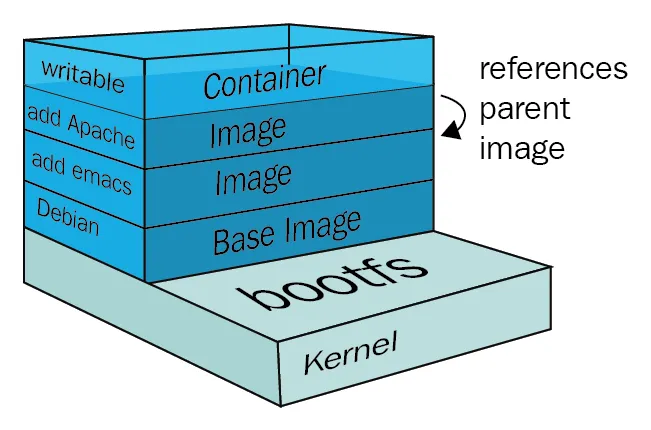
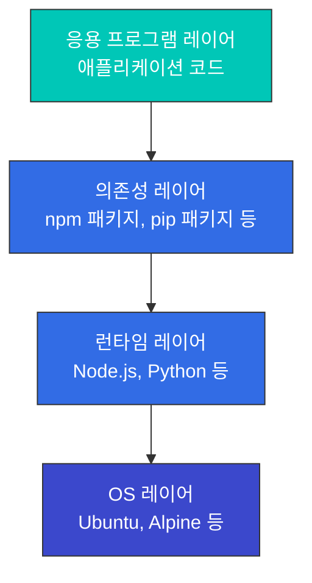

# 컨테이너 기술

> **지원 버전**: Docker 20.10+, containerd 1.6+, CRI-O 1.24+
> **마지막 업데이트**: 2026년 2월 23일

컨테이너는 애플리케이션과 그 종속성을 함께 패키징하여 다양한 환경에서 일관되게 실행할 수 있게 해주는 기술입니다. 이 문서에서는 컨테이너의 기본 개념, 작동 원리, 그리고 Kubernetes와의 관계에 대해 설명합니다.

## 목차
- [컨테이너란?](#컨테이너란)
- [컨테이너 vs 가상 머신](#컨테이너-vs-가상-머신)
- [컨테이너의 기술적 기반](#컨테이너의-기술적-기반)
- [컨테이너 런타임](#컨테이너-런타임)
- [컨테이너 이미지](#컨테이너-이미지)
- [Dockerfile](#dockerfile)
- [컨테이너 네트워킹](#컨테이너-네트워킹)
- [컨테이너 스토리지](#컨테이너-스토리지)
- [컨테이너 보안](#컨테이너-보안)
- [컨테이너 라이프사이클 관리](#컨테이너-라이프사이클-관리)
- [컨테이너 오케스트레이션](#컨테이너-오케스트레이션)
- [AWS에서의 컨테이너](#aws에서의-컨테이너)

## 컨테이너란?

컨테이너는 애플리케이션과 그 실행에 필요한 모든 것(코드, 런타임, 시스템 도구, 시스템 라이브러리, 설정)을 포함하는 표준화된 소프트웨어 유닛입니다. 컨테이너는 호스트 운영체제의 커널을 공유하면서도 서로 격리된 환경에서 실행됩니다.

### 컨테이너의 주요 특징

1. **이식성**: 개발, 테스트, 프로덕션 환경 간에 일관된 실행 환경 제공
2. **경량성**: 가상 머신보다 적은 리소스 사용
3. **격리**: 다른 컨테이너 및 호스트 시스템과 격리된 실행 환경
4. **신속한 시작 및 종료**: 밀리초 단위의 빠른 시작 시간
5. **확장성**: 쉽게 복제하여 수평적 확장 가능
6. **버전 관리**: 이미지 버전 관리를 통한 애플리케이션 라이프사이클 관리

### 컨테이너 기술의 역사

- **2000년대 초**: Linux VServer, OpenVZ 등의 초기 컨테이너 기술 등장
- **2007년**: cgroups(Control Groups)가 Linux 커널에 통합
- **2008년**: LXC(Linux Containers) 프로젝트 시작
- **2013년**: Docker 출시, 컨테이너 기술 대중화
- **2015년**: Open Container Initiative(OCI) 설립, 컨테이너 표준화
- **2017년**: containerd가 CNCF 프로젝트로 기부됨

## 컨테이너 vs 가상 머신

### 가상 머신 아키텍처 vs 컨테이너 아키텍쳐


### 주요 차이점

| 특성 | 컨테이너 | 가상 머신 |
|------|---------|---------|
| 크기 | 일반적으로 수십 MB | 일반적으로 수 GB |
| 시작 시간 | 초 단위 또는 그 이하 | 분 단위 |
| 격리 수준 | 프로세스 수준 격리 | 하드웨어 수준 격리 |
| OS | 호스트 OS 커널 공유 | 각 VM마다 전체 OS 필요 |
| 성능 | 거의 네이티브 | 약간의 오버헤드 |
| 보안 | 상대적으로 낮음 (공유 커널) | 상대적으로 높음 (완전 격리) |
| 리소스 효율성 | 높음 | 중간 |
| 사용 사례 | 마이크로서비스, CI/CD, 개발/테스트 | 레거시 앱, 다양한 OS 요구사항, 높은 보안 요구 |

## 컨테이너의 기술적 기반

컨테이너는 Linux 커널의 여러 기능을 활용하여 구현됩니다. 이러한 기술들은 01-linux-basics.md에서 상세히 다루었으며, 여기서는 컨테이너와의 관계를 중심으로 설명합니다.

### 네임스페이스를 통한 격리

컨테이너는 Linux 네임스페이스를 사용하여 프로세스를 격리합니다. 각 컨테이너는 고유한 네임스페이스 집합을 가지며, 이를 통해 독립적인 실행 환경을 제공받습니다.

```bash
# 컨테이너의 네임스페이스 확인
docker inspect <container-id> | grep -A 10 "Pid"
ls -la /proc/<pid>/ns/

# 컨테이너 내부에서 프로세스 확인 (격리된 PID 네임스페이스)
docker exec <container-id> ps aux

# 호스트에서 같은 프로세스 확인 (실제 PID)
ps aux | grep <process-name>
```

**컨테이너가 사용하는 네임스페이스**:
- **PID**: 컨테이너는 자신만의 프로세스 트리를 가짐 (PID 1부터 시작)
- **Network**: 독립적인 네트워크 스택 (IP 주소, 라우팅 테이블, 포트)
- **Mount**: 독립적인 파일 시스템 뷰
- **UTS**: 독립적인 호스트네임
- **IPC**: 독립적인 프로세스 간 통신 공간
- **User**: 독립적인 사용자 ID 매핑 (선택적)

### cgroups를 통한 리소스 제한

컨테이너는 cgroups를 사용하여 리소스 사용량을 제한하고 모니터링합니다.

```bash
# CPU 제한이 있는 컨테이너 실행
docker run --cpus=0.5 --memory=512m nginx

# 컨테이너의 리소스 사용량 확인
docker stats <container-id>

# 컨테이너의 cgroup 설정 확인
docker inspect <container-id> | grep -A 20 "Cgroup"

# 호스트에서 컨테이너의 cgroup 확인
cat /sys/fs/cgroup/system.slice/docker-<container-id>.scope/cpu.max
cat /sys/fs/cgroup/system.slice/docker-<container-id>.scope/memory.max
```

**컨테이너가 사용하는 cgroup 리소스 제어**:
- **CPU**: CPU 시간 제한 및 CPU 코어 할당
- **Memory**: 메모리 사용량 제한 및 OOM 동작 제어
- **Block I/O**: 디스크 I/O 대역폭 제한
- **Network**: 네트워크 대역폭 제한 (tc와 결합)
- **PIDs**: 컨테이너 내 프로세스 수 제한

### OverlayFS를 통한 레이어 관리

컨테이너 이미지는 OverlayFS를 사용하여 여러 레이어를 효율적으로 관리합니다.

```bash
# 이미지 레이어 확인
docker history <image-name>

# 컨테이너의 파일 시스템 레이어 확인
docker inspect <container-id> | grep -A 10 "GraphDriver"

# OverlayFS 마운트 정보 확인
mount | grep overlay
```

**OverlayFS 구조**:
- **LowerDir**: 읽기 전용 이미지 레이어들 (하위 레이어 → 상위 레이어)
- **UpperDir**: 읽기/쓰기 가능한 컨테이너 레이어
- **WorkDir**: OverlayFS 작업 디렉토리
- **MergedDir**: 통합된 뷰 (컨테이너가 보는 파일 시스템)

### 실습: 컨테이너의 기술적 기반 이해하기

```bash
# 1. 간단한 컨테이너 실행
docker run -d --name test-container nginx

# 2. 컨테이너의 PID 확인
CONTAINER_PID=$(docker inspect -f '{{.State.Pid}}' test-container)
echo "Container PID: $CONTAINER_PID"

# 3. 컨테이너의 네임스페이스 확인
ls -la /proc/$CONTAINER_PID/ns/

# 4. 컨테이너의 cgroup 확인
cat /proc/$CONTAINER_PID/cgroup

# 5. 컨테이너의 파일 시스템 레이어 확인
docker inspect test-container | jq '.[0].GraphDriver'

# 6. 정리
docker stop test-container
docker rm test-container
```

## 컨테이너 런타임

컨테이너 런타임은 컨테이너의 생명주기를 관리하는 소프트웨어입니다. 컨테이너 이미지를 실행하고, 컨테이너의 리소스 사용을 제한하며, 네트워킹과 스토리지를 설정합니다.

### 컨테이너 런타임 계층 구조

1. **저수준 런타임 (OCI 호환)**
   - **runc**: Docker의 기본 런타임, OCI 표준 구현체
   - **crun**: C로 작성된 경량 OCI 런타임
   - **kata-containers**: 하드웨어 가상화를 사용한 보안 강화 런타임
   - **gVisor**: 사용자 공간에서 커널 기능을 에뮬레이션하는 보안 런타임

2. **고수준 런타임**
   - **containerd**: Docker에서 분리된 산업 표준 컨테이너 런타임
   - **CRI-O**: Kubernetes를 위해 특별히 설계된 경량 런타임
   - **Docker Engine**: 가장 널리 사용되는 컨테이너 플랫폼

### Kubernetes의 컨테이너 런타임 인터페이스 (CRI)

Kubernetes는 CRI(Container Runtime Interface)를 통해 다양한 컨테이너 런타임과 통합됩니다. CRI는 Kubernetes와 컨테이너 런타임 사이의 표준화된 인터페이스를 제공합니다.


## 컨테이너 이미지

컨테이너 이미지는 애플리케이션과 그 종속성을 포함하는 불변의 템플릿입니다. 이미지는 여러 레이어로 구성되며, 각 레이어는 파일 시스템의 변경사항을 나타냅니다.

### 이미지 레이어

컨테이너 이미지는 여러 레이어의 스택으로 구성됩니다. 각 레이어는 이전 레이어에 대한 변경사항을 나타냅니다. 이 레이어 방식은 이미지 공유와 캐싱을 효율적으로 만듭니다.




### 이미지 레지스트리

컨테이너 이미지는 레지스트리에 저장되고 공유됩니다. 주요 레지스트리는 다음과 같습니다:

- **Docker Hub**: 가장 큰 공개 레지스트리
- **Amazon ECR**: AWS의 컨테이너 레지스트리 서비스
- **Google Container Registry**: Google Cloud의 레지스트리
- **Azure Container Registry**: Microsoft Azure의 레지스트리
- **GitHub Container Registry**: GitHub의 컨테이너 레지스트리
- **Harbor**: 오픈소스 엔터프라이즈급 레지스트리

### 이미지 태그와 다이제스트

- **태그**: 이미지의 특정 버전을 식별하는 사람이 읽을 수 있는 이름 (예: `nginx:1.21.0`)
- **다이제스트**: 이미지 내용의 SHA256 해시로, 이미지의 고유한 식별자 (예: `nginx@sha256:2834dc507516af02784808c5f48b7cbe38b8ed5d0f4837f16e78d00deb7e7767`)

## Dockerfile

Dockerfile은 컨테이너 이미지를 빌드하기 위한 지시사항을 포함하는 텍스트 파일입니다. 각 지시문은 이미지에 새로운 레이어를 추가합니다.

### 주요 Dockerfile 지시문

```dockerfile
# 기본 이미지 지정
FROM node:14-alpine

# 작업 디렉토리 설정
WORKDIR /app

# 환경 변수 설정
ENV NODE_ENV=production

# 파일 복사
COPY package*.json ./
COPY . .

# 명령 실행
RUN npm install --production

# 포트 노출
EXPOSE 3000

# 볼륨 정의
VOLUME /app/data

# 컨테이너 시작 시 실행할 명령
CMD ["node", "server.js"]
```

### 다단계 빌드

다단계 빌드는 최종 이미지 크기를 줄이기 위해 여러 빌드 단계를 사용하는 기법입니다.

```dockerfile
# 빌드 단계
FROM node:14 AS build
WORKDIR /app
COPY package*.json ./
COPY . .
RUN npm install
RUN npm run build

# 실행 단계
FROM nginx:alpine
COPY --from=build /app/dist /usr/share/nginx/html
EXPOSE 80
CMD ["nginx", "-g", "daemon off;"]
```

### 이미지 최적화 기법

1. **적절한 기본 이미지 선택**: Alpine과 같은 경량 이미지 사용
2. **다단계 빌드 사용**: 빌드 도구와 중간 파일 제외
3. **레이어 최소화**: RUN, COPY 등의 명령을 결합
4. **불필요한 파일 제외**: .dockerignore 파일 사용
5. **캐시 활용**: 자주 변경되는 레이어를 나중에 배치

## 컨테이너 네트워킹

컨테이너 네트워킹은 컨테이너 간, 그리고 컨테이너와 외부 세계 간의 통신을 가능하게 합니다.

### 네트워크 드라이버

Docker는 다양한 네트워크 드라이버를 제공합니다:

1. **bridge**: 기본 네트워크 드라이버, 동일한 호스트의 컨테이너 간 통신
2. **host**: 호스트 네트워크를 직접 사용, 격리 없음
3. **overlay**: 다중 호스트 간 컨테이너 통신
4. **macvlan**: 컨테이너에 MAC 주소 할당, 물리 네트워크 장치처럼 보이게 함
5. **none**: 모든 네트워킹 비활성화

### 포트 매핑

컨테이너의 내부 포트를 호스트의 포트에 매핑하여 외부에서 접근 가능하게 합니다.

```bash
# 호스트의 8080 포트를 컨테이너의 80 포트에 매핑
docker run -p 8080:80 nginx
```

### 컨테이너 간 통신

1. **동일 네트워크**: 같은 네트워크에 있는 컨테이너는 컨테이너 이름으로 통신 가능
2. **링크**: 레거시 방식, 컨테이너 간 직접 링크 설정
3. **외부 네트워크**: 호스트 포트를 통한 통신

## 컨테이너 스토리지

컨테이너는 기본적으로 상태를 유지하지 않지만, 영구 데이터 저장을 위한 여러 옵션이 있습니다.

### 스토리지 유형

1. **임시 스토리지**: 컨테이너 내부 파일 시스템, 컨테이너 삭제 시 데이터 손실
2. **볼륨**: Docker가 관리하는 호스트 파일 시스템의 영역
3. **바인드 마운트**: 호스트의 특정 경로를 컨테이너에 마운트
4. **tmpfs 마운트**: 메모리에만 데이터 저장, 높은 I/O 성능 필요 시 사용

### 볼륨 사용 예시

```bash
# 볼륨 생성
docker volume create my-vol

# 볼륨을 사용하는 컨테이너 실행
docker run -v my-vol:/app/data nginx

# 바인드 마운트 사용
docker run -v /host/path:/container/path nginx

# 읽기 전용 마운트
docker run -v /host/path:/container/path:ro nginx
```

### 데이터 공유 패턴

1. **볼륨 공유**: 여러 컨테이너가 동일한 볼륨 사용
2. **데이터 볼륨 컨테이너**: 데이터만 포함하는 컨테이너 생성 후 공유
3. **외부 스토리지 통합**: AWS EBS, NFS 등 외부 스토리지 시스템 사용

## 컨테이너 보안

컨테이너 보안은 이미지, 컨테이너 런타임, 호스트 시스템 등 여러 계층에서 고려해야 합니다.

### 이미지 보안

1. **취약점 스캐닝**: Trivy, Clair 등의 도구로 이미지 취약점 검사
2. **신뢰할 수 있는 기본 이미지**: 공식 이미지 또는 검증된 이미지 사용
3. **최소 권한 원칙**: 필요한 패키지와 권한만 포함
4. **이미지 서명**: Docker Content Trust 또는 Cosign으로 이미지 서명 및 검증

### 런타임 보안

1. **권한 제한**: 루트가 아닌 사용자로 컨테이너 실행
2. **기능(capabilities) 제한**: 필요한 Linux 기능만 부여
3. **seccomp 프로필**: 시스템 호출 제한
4. **AppArmor/SELinux**: 강제적 접근 제어 적용
5. **읽기 전용 파일 시스템**: 가능한 경우 파일 시스템을 읽기 전용으로 마운트

### 보안 모범 사례

1. **정기적인 업데이트**: 컨테이너 이미지와 호스트 시스템 정기 업데이트
2. **네트워크 분리**: 적절한 네트워크 정책으로 컨테이너 간 통신 제한
3. **시크릿 관리**: 환경 변수 대신 Docker Secrets 또는 외부 시크릿 관리 도구 사용
4. **리소스 제한**: CPU, 메모리 등 리소스 사용량 제한
5. **모니터링 및 로깅**: 컨테이너 활동 모니터링 및 로그 중앙화

## 컨테이너 라이프사이클 관리

컨테이너의 전체 라이프사이클을 이해하는 것은 효과적인 컨테이너 운영에 필수적입니다.

### 컨테이너 상태

컨테이너는 여러 상태를 가질 수 있습니다:

- **Created**: 컨테이너가 생성되었으나 아직 시작되지 않음
- **Running**: 컨테이너가 실행 중
- **Paused**: 컨테이너의 모든 프로세스가 일시 중지됨
- **Restarting**: 컨테이너가 재시작 중
- **Exited**: 컨테이너가 종료됨
- **Dead**: 컨테이너 데몬이 제거하려 했지만 실패함

```bash
# 컨테이너 상태 확인
docker ps -a

# 특정 컨테이너 상태 상세 정보
docker inspect <container-id> | jq '.[0].State'

# 컨테이너 상태 전환
docker create nginx  # Created 상태
docker start <container-id>  # Running 상태로 전환
docker pause <container-id>  # Paused 상태로 전환
docker unpause <container-id>  # Running 상태로 복귀
docker stop <container-id>  # Exited 상태로 전환
docker rm <container-id>  # 컨테이너 제거
```

### 컨테이너 생성 및 실행

```bash
# 컨테이너 생성만 (시작하지 않음)
docker create --name my-nginx nginx

# 컨테이너 시작
docker start my-nginx

# 컨테이너 생성 및 시작 (한 번에)
docker run --name my-nginx2 -d nginx

# 인터랙티브 모드로 실행
docker run -it ubuntu bash

# 백그라운드에서 실행
docker run -d nginx

# 컨테이너 종료 시 자동 제거
docker run --rm nginx

# 환경 변수와 함께 실행
docker run -e "DB_HOST=localhost" -e "DB_PORT=5432" myapp

# 포트 매핑과 함께 실행
docker run -p 8080:80 nginx

# 볼륨 마운트와 함께 실행
docker run -v /host/path:/container/path nginx
```

### 컨테이너 제어

```bash
# 실행 중인 컨테이너 목록
docker ps

# 모든 컨테이너 목록 (중지된 것 포함)
docker ps -a

# 컨테이너 중지 (SIGTERM 후 SIGKILL)
docker stop <container-id>

# 컨테이너 강제 종료 (SIGKILL)
docker kill <container-id>

# 컨테이너 재시작
docker restart <container-id>

# 컨테이너 일시 중지
docker pause <container-id>

# 컨테이너 재개
docker unpause <container-id>

# 실행 중인 컨테이너에 명령 실행
docker exec -it <container-id> bash
docker exec <container-id> ls -la /app

# 컨테이너에서 파일 복사
docker cp <container-id>:/path/to/file /local/path
docker cp /local/path <container-id>:/path/to/file
```

### 컨테이너 로깅 및 모니터링

```bash
# 컨테이너 로그 확인
docker logs <container-id>

# 실시간 로그 스트리밍
docker logs -f <container-id>

# 마지막 N개 로그 라인
docker logs --tail 100 <container-id>

# 타임스탬프와 함께 로그 출력
docker logs -t <container-id>

# 특정 시간 이후 로그
docker logs --since "2025-11-24T10:00:00" <container-id>

# 컨테이너 리소스 사용량 확인
docker stats <container-id>

# 모든 컨테이너 리소스 사용량
docker stats

# 컨테이너 프로세스 확인
docker top <container-id>

# 컨테이너 상세 정보
docker inspect <container-id>
```

### 컨테이너 정리

```bash
# 중지된 모든 컨테이너 제거
docker container prune

# 사용하지 않는 모든 리소스 제거 (컨테이너, 이미지, 네트워크, 볼륨)
docker system prune

# 볼륨 포함하여 모든 리소스 제거
docker system prune --volumes

# 디스크 사용량 확인
docker system df

# 이미지 제거
docker rmi <image-id>

# 사용하지 않는 이미지 제거
docker image prune

# 볼륨 제거
docker volume rm <volume-name>

# 사용하지 않는 볼륨 제거
docker volume prune

# 네트워크 제거
docker network rm <network-name>

# 사용하지 않는 네트워크 제거
docker network prune
```

### 헬스 체크

컨테이너의 건강 상태를 모니터링하여 자동으로 복구할 수 있습니다.

```dockerfile
FROM nginx:alpine

# Dockerfile에서 헬스 체크 정의
HEALTHCHECK --interval=30s --timeout=3s --start-period=5s --retries=3 \
  CMD wget --quiet --tries=1 --spider http://localhost/ || exit 1
```

```bash
# 실행 시 헬스 체크 정의
docker run -d \
  --health-cmd="curl -f http://localhost/ || exit 1" \
  --health-interval=30s \
  --health-timeout=3s \
  --health-retries=3 \
  nginx

# 헬스 체크 상태 확인
docker inspect <container-id> | jq '.[0].State.Health'
```

### 재시작 정책

컨테이너가 종료될 때 자동으로 재시작하도록 설정할 수 있습니다.

```bash
# 재시작 정책 옵션
# - no: 재시작하지 않음 (기본값)
# - on-failure: 실패 시에만 재시작
# - always: 항상 재시작
# - unless-stopped: 명시적으로 중지하지 않는 한 항상 재시작

# 실패 시 재시작 (최대 3회)
docker run -d --restart=on-failure:3 nginx

# 항상 재시작
docker run -d --restart=always nginx

# 명시적으로 중지하지 않는 한 재시작
docker run -d --restart=unless-stopped nginx

# 기존 컨테이너의 재시작 정책 변경
docker update --restart=always <container-id>
```

### 컨테이너 디버깅

```bash
# 컨테이너 내부 파일 시스템 탐색
docker exec -it <container-id> bash

# 컨테이너의 환경 변수 확인
docker exec <container-id> env

# 컨테이너의 네트워크 정보 확인
docker exec <container-id> ip addr
docker exec <container-id> netstat -tuln

# 컨테이너의 프로세스 확인
docker exec <container-id> ps aux

# 컨테이너 이벤트 모니터링
docker events

# 특정 컨테이너 이벤트 필터링
docker events --filter container=<container-id>

# 컨테이너 변경 사항 확인 (이미지와 비교)
docker diff <container-id>
```

## 컨테이너 오케스트레이션

컨테이너 오케스트레이션은 다수의 컨테이너를 관리하고 조정하는 프로세스입니다. 주요 기능으로는 배포 관리, 확장, 네트워킹, 서비스 검색 등이 있습니다.

### 주요 오케스트레이션 도구

1. **Kubernetes**: 가장 널리 사용되는 컨테이너 오케스트레이션 플랫폼
2. **Docker Swarm**: Docker의 내장 오케스트레이션 도구, 간단한 설정
3. **Amazon ECS**: AWS의 컨테이너 오케스트레이션 서비스
4. **HashiCorp Nomad**: 컨테이너 및 비컨테이너 워크로드 모두 지원

### 오케스트레이션의 주요 기능

1. **자동 배포 및 롤백**: 선언적 구성을 통한 애플리케이션 배포 관리
2. **서비스 검색 및 로드 밸런싱**: 컨테이너 간 통신 및 부하 분산
3. **자동 확장**: 부하에 따른 컨테이너 수 조정
4. **자가 복구**: 실패한 컨테이너 자동 재시작
5. **구성 관리**: 애플리케이션 구성 및 시크릿 관리
6. **스토리지 오케스트레이션**: 영구 스토리지 관리
7. **배치 실행**: 일회성 작업 및 크론 작업 실행

## AWS에서의 컨테이너

AWS는 컨테이너 워크로드를 위한 다양한 서비스를 제공합니다.

### Amazon ECS (Elastic Container Service)

AWS의 자체 컨테이너 오케스트레이션 서비스로, EC2 인스턴스 또는 AWS Fargate에서 컨테이너를 실행할 수 있습니다.

**주요 특징**:
- AWS 서비스와의 긴밀한 통합
- 서버리스 컨테이너 실행 (Fargate)
- 간단한 설정 및 관리
- 자동 확장 및 로드 밸런싱

### Amazon EKS (Elastic Kubernetes Service)

AWS에서 관리하는 Kubernetes 서비스로, 표준 Kubernetes API를 사용하여 AWS 인프라에서 Kubernetes를 실행할 수 있습니다.

**주요 특징**:
- 관리형 Kubernetes 컨트롤 플레인
- 여러 가용 영역에 걸친 고가용성
- AWS 서비스와의 통합
- EC2 및 Fargate 지원

### AWS Fargate

서버리스 컨테이너 실행 환경으로, 서버를 관리하지 않고도 컨테이너를 실행할 수 있습니다.

**주요 특징**:
- 서버 관리 불필요
- 컨테이너 단위 과금
- ECS 및 EKS와 통합
- 보안 격리

### Amazon ECR (Elastic Container Registry)

AWS의 관리형 컨테이너 이미지 레지스트리 서비스입니다.

**주요 특징**:
- 이미지 취약점 스캐닝
- IAM과의 통합
- 이미지 라이프사이클 관리
- 고가용성 및 확장성

## 용어집

| 용어 | 설명 |
|------|------|
| **컨테이너** | 애플리케이션과 그 종속성을 함께 패키징한 표준화된 소프트웨어 유닛으로, 어디서나 일관되게 실행할 수 있습니다. |
| **이미지** | 컨테이너를 생성하는 데 사용되는 읽기 전용 템플릿으로, 애플리케이션 코드, 라이브러리, 종속성, 도구 및 기타 파일을 포함합니다. |
| **Dockerfile** | 컨테이너 이미지를 빌드하기 위한 지시사항이 포함된 텍스트 파일입니다. |
| **레지스트리** | 컨테이너 이미지를 저장하고 배포하는 저장소입니다. (예: Docker Hub, Amazon ECR) |
| **컨테이너 런타임** | 컨테이너를 실행하는 소프트웨어입니다. (예: Docker, containerd, CRI-O) |
| **네임스페이스** | Linux 커널 기능으로, 프로세스가 시스템의 다른 부분을 볼 수 없도록 격리합니다. |
| **cgroups** | Linux 커널 기능으로, 프로세스 그룹의 리소스 사용(CPU, 메모리 등)을 제한하고 모니터링합니다. |
| **레이어** | 컨테이너 이미지는 여러 레이어로 구성되며, 각 레이어는 Dockerfile의 명령에 해당합니다. |
| **볼륨** | 컨테이너의 데이터를 영구적으로 저장하기 위한 메커니즘입니다. |
| **오케스트레이션** | 여러 컨테이너의 배포, 관리, 확장, 네트워킹을 자동화하는 프로세스입니다. |
| **ECS** | Amazon Elastic Container Service의 약자로, AWS의 컨테이너 오케스트레이션 서비스입니다. |
| **ECR** | Amazon Elastic Container Registry의 약자로, AWS의 컨테이너 이미지 레지스트리 서비스입니다. |
| **Fargate** | AWS의 서버리스 컨테이너 실행 환경으로, 인프라 관리 없이 컨테이너를 실행할 수 있습니다. |

## 결론

컨테이너 기술은 애플리케이션 개발 및 배포 방식을 혁신적으로 변화시켰습니다. 이식성, 일관성, 효율성을 제공하여 개발자 생산성을 향상시키고 운영 복잡성을 줄였습니다. Kubernetes와 같은 오케스트레이션 도구와 결합하면 대규모 분산 애플리케이션을 효과적으로 관리할 수 있습니다.

컨테이너의 기본 개념과 작동 원리를 이해하는 것은 현대적인 클라우드 네이티브 애플리케이션을 개발하고 운영하는 데 필수적입니다. 이러한 지식은 Kubernetes를 효과적으로 활용하기 위한 기반이 됩니다.

## 퀴즈

이 장에서 배운 내용을 테스트하려면 [컨테이너 기술 퀴즈](../quizzes/basics/03-container-technology-quiz.md)를 풀어보세요.

## 참고 자료

- [Docker 공식 문서](https://docs.docker.com/)
- [OCI (Open Container Initiative)](https://opencontainers.org/)
- [containerd 프로젝트](https://containerd.io/)
- [CNCF 컨테이너 런타임 개요](https://www.cncf.io/blog/2019/06/27/an-introduction-to-container-runtimes/)
- [AWS 컨테이너 서비스](https://aws.amazon.com/containers/)
