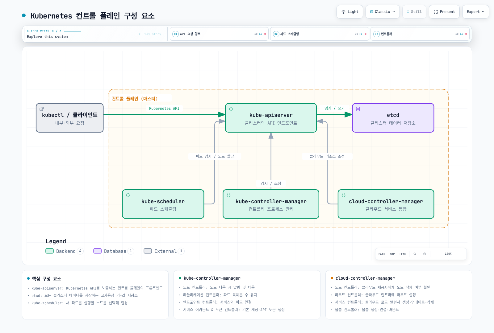
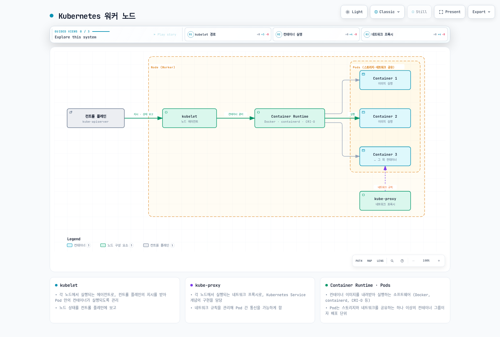
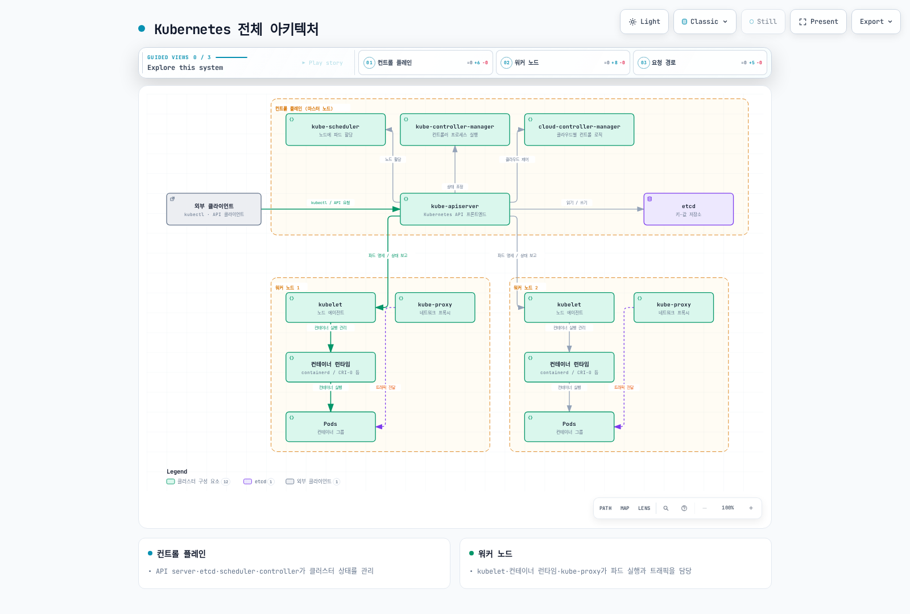
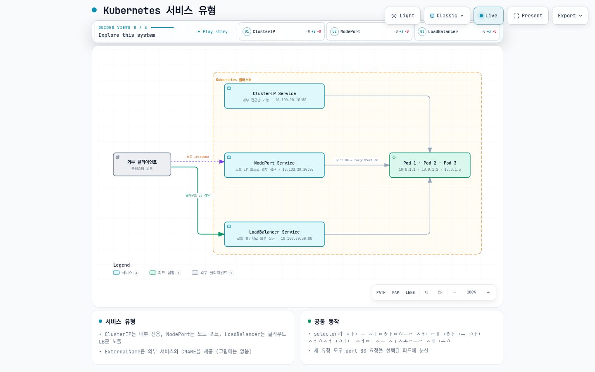
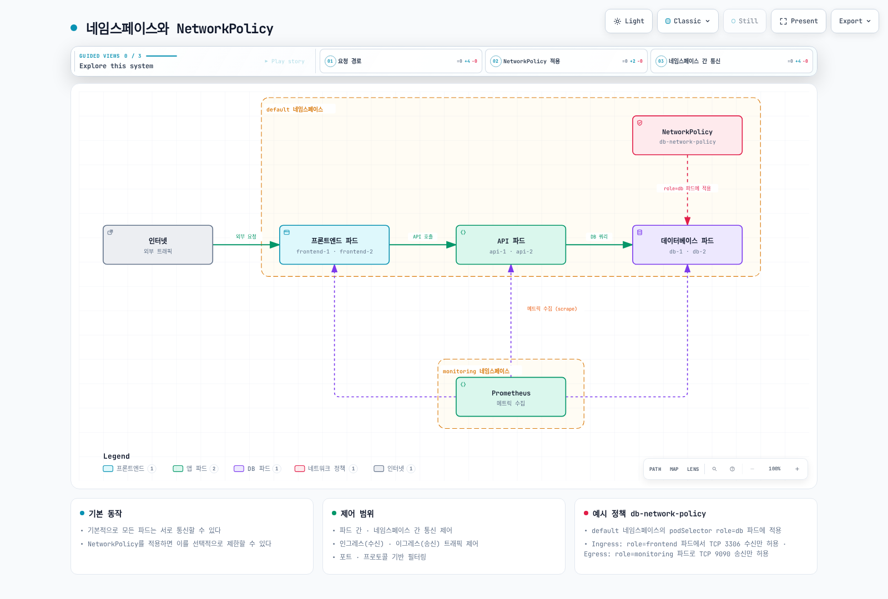
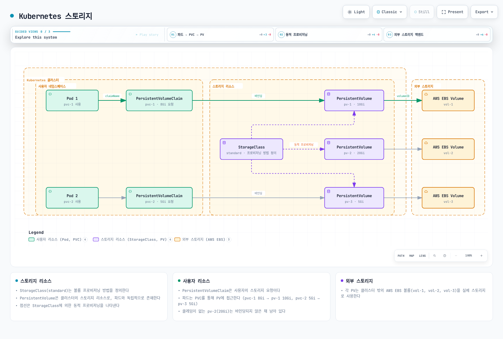

# Kubernetes 소개

> **지원 버전**: Upstream Kubernetes 1.35, 1.36, 1.37; EKS 표준 지원 1.34–1.36 (2026-09-11) **마지막 업데이트**: 2026년 9월 11일

Kubernetes(K8s)는 컨테이너화된 애플리케이션의 배포, 확장 및 관리를 자동화하는 오픈소스 컨테이너 오케스트레이션 플랫폼입니다. 이 문서에서는 Kubernetes의 기본 개념, 아키텍처, 주요 구성 요소 및 기능에 대해 설명합니다.

이 문서의 매니페스트는 서로 독립적인 학습 예제이며 문법/스키마와 공식 문서를 기준으로 검토했습니다. 실제 클러스터에서 배포 검증한 프로덕션 구성은 아닙니다. 커스텀 이미지, 이름/레이블, TLS, IAM/RBAC, CNI 및 스토리지 요구를 대상 환경에서 확인하고 자리표시자를 바꿔야 합니다.

## 실습 환경 설정

이 문서의 예제를 따라하기 위해서는 다음과 같은 도구와 환경이 필요합니다:

### 필수 도구

* **kubectl**: Kubernetes 클러스터와 상호 작용하는 명령줄 도구
* **로컬 클러스터 드라이버**: minikube/kind가 지원하는 컨테이너 엔진/VM 드라이버; Kubernetes 노드는 CRI v1 런타임 사용
* **minikube** 또는 **kind**: 로컬 Kubernetes 클러스터 (개발 및 학습용)

### 설치 방법

**kubectl 설치**:

```bash
# macOS: use a kubectl version within one minor of the API server.
brew install kubectl
```

```bash
# Linux: select an explicit compatible version and architecture.
set -euo pipefail
: "${KUBECTL_VERSION:?Set a cluster-compatible version, e.g. v1.37.0}"
case "$(uname -m)" in
  x86_64) KUBECTL_ARCH=amd64 ;;
  aarch64|arm64) KUBECTL_ARCH=arm64 ;;
  *) echo "Choose a supported kubectl architecture" >&2; exit 1 ;;
esac
curl --fail --location --output kubectl "https://dl.k8s.io/release/$KUBECTL_VERSION/bin/linux/$KUBECTL_ARCH/kubectl"
curl --fail --location --output kubectl.sha256 "https://dl.k8s.io/release/$KUBECTL_VERSION/bin/linux/$KUBECTL_ARCH/kubectl.sha256"
echo "$(cat kubectl.sha256)  kubectl" | sha256sum --check
sudo install -m 0755 kubectl /usr/local/bin/kubectl
```

```powershell
$ErrorActionPreference = "Stop"
$KubectlVersion = Read-Host "Cluster-compatible kubectl version (vX.Y.Z)"
$KubectlArch = Read-Host "Architecture (amd64 or arm64)"
if ($KubectlVersion -notmatch '^v\d+\.\d+\.\d+$' -or $KubectlArch -notin @('amd64','arm64')) { throw "Invalid version/architecture" }
$BaseUrl = "https://dl.k8s.io/release/$KubectlVersion/bin/windows/$KubectlArch"
Invoke-WebRequest "$BaseUrl/kubectl.exe" -OutFile kubectl.exe
Invoke-WebRequest "$BaseUrl/kubectl.exe.sha256" -OutFile kubectl.exe.sha256
if ((Get-FileHash kubectl.exe -Algorithm SHA256).Hash -ne (Get-Content kubectl.exe.sha256).Trim()) { throw "Checksum mismatch" }
# Move the verified binary to a directory included in PATH.
```

**minikube 설치**:

minikube의 공식 시작 안내에서 OS/아키텍처/드라이버에 맞는 바이너리와 체크섬을 선택합니다. Linux와 Windows 명령은 각각 해당 셸에서 실행하며 검증한 바이너리를 PATH에 추가합니다. macOS 예시는 다음과 같습니다:

```bash
brew install minikube
minikube version
```

### 로컬 클러스터 시작

```bash
minikube start
```

## 목차

* [Kubernetes란?](04-kubernetes-introduction.md#kubernetes란)
* [Kubernetes의 역사](04-kubernetes-introduction.md#kubernetes의-역사)
* [Kubernetes 아키텍처](04-kubernetes-introduction.md#kubernetes-아키텍처)
* [Kubernetes 주요 구성 요소](04-kubernetes-introduction.md#kubernetes-주요-구성-요소)
* [Kubernetes 기본 객체](04-kubernetes-introduction.md#kubernetes-기본-객체)
* [Kubernetes 워크로드 리소스](04-kubernetes-introduction.md#kubernetes-워크로드-리소스)
* [Kubernetes 서비스와 네트워킹](04-kubernetes-introduction.md#kubernetes-서비스와-네트워킹)
* [Kubernetes 스토리지](04-kubernetes-introduction.md#kubernetes-스토리지)
* [Kubernetes 구성 및 보안](04-kubernetes-introduction.md#kubernetes-구성-및-보안)
* [Kubernetes vs Amazon EKS](04-kubernetes-introduction.md#kubernetes-vs-amazon-eks)
* [Kubernetes 시작하기](04-kubernetes-introduction.md#kubernetes-시작하기)

## Kubernetes란?

Kubernetes는 그리스어로 '조타수' 또는 '파일럿'을 의미하며, 컨테이너화된 애플리케이션의 배포, 확장, 운영을 자동화하는 오픈소스 시스템입니다. Google에서 내부적으로 사용하던 Borg 시스템에서 영감을 받아 개발되었으며, 2014년에 오픈소스로 공개되었습니다.

### Kubernetes의 주요 기능

1. **서비스 디스커버리와 로드 밸런싱**: 컨테이너를 외부에 노출하고 트래픽을 분산
2. **스토리지 오케스트레이션**: 로컬 또는 클라우드 스토리지 시스템을 자동으로 마운트
3. **롤아웃과 롤백**: 애플리케이션을 점진적으로 업데이트하고 운영자/도구가 롤백할 수 있습니다. Deployment 실패만으로 자동 롤백하지는 않습니다.
4. **자동 빈 패킹**: 리소스 요구사항에 따라 컨테이너를 노드에 배치
5. **자가 복구**: 실패한 컨테이너를 재시작하고, 응답하지 않는 컨테이너를 교체
6. **시크릿과 구성 관리**: 민감한 정보를 저장하고 구성 정보를 업데이트할 수 있음
7. **수평적 확장**: 간단한 명령이나 UI를 통해 애플리케이션을 확장
8. **배치 실행**: 배치 및 CI 워크로드 관리

### Kubernetes가 해결하는 문제

* **컨테이너 오케스트레이션**: 수백, 수천 개의 컨테이너를 효율적으로 관리
* **고가용성**: 복제본, 배치, probe 및 용량을 구성하여 복원력 있는 애플리케이션 설계 지원
* **확장성**: 트래픽 증가에 따른 자동 확장
* **복구**: 실패한 워크로드를 조정하며 재해 복구에는 검증한 백업/복원 계획도 필요
* **리소스 효율성**: 하드웨어 리소스를 효율적으로 활용
* **선언적 구성**: 인프라를 코드로 관리
* **멀티 클라우드 및 하이브리드 클라우드**: 다양한 환경에서 일관된 배포 및 관리

## Kubernetes의 역사

### 탄생 배경

* **2003-2013**: Google은 내부적으로 Borg라는 컨테이너 오케스트레이션 시스템을 사용
* **2014년 6월**: Google이 Kubernetes 프로젝트를 오픈소스로 공개
* **2015년 7월**: Kubernetes 1.0 출시 및 Cloud Native Computing Foundation(CNCF)에 기부
* **2016-2017**: 주요 클라우드 제공업체들이 관리형 Kubernetes 서비스 출시
* **2018년 이후**: 컨테이너 오케스트레이션의 사실상 표준으로 자리매김

### 이름의 유래

Kubernetes(κυβερνήτης)는 그리스어로 '조타수' 또는 '파일럿'을 의미합니다. 이는 컨테이너화된 애플리케이션의 항해를 안내하는 역할을 상징합니다. K8s라는 약어는 'K'와 's' 사이에 8개의 문자가 있기 때문에 사용됩니다.

### 로고의 의미

Kubernetes의 로고는 7개의 스포크가 있는 항해용 방향타(helm)를 형상화했으며, 이는 컨테이너화된 애플리케이션의 항로를 안내하는 Kubernetes의 역할을 상징합니다.

## Kubernetes 아키텍처

Kubernetes는 마스터-노드 아키텍처를 따릅니다. 마스터 노드(컨트롤 플레인)는 클러스터를 관리하고, 워커 노드는 실제 애플리케이션 워크로드를 실행합니다.

### 컨트롤 플레인 (마스터) 구성 요소



[🔍 인터랙티브 다이어그램 보기](https://www.atomai.click/kubernetes-docs/archmaps/ko-basics-04-kubernetes-introduction-0.html)

1. **kube-apiserver**: Kubernetes API를 노출하는 컨트롤 플레인의 프론트엔드
2. **etcd**: Kubernetes API 객체와 클러스터 상태(애플리케이션 볼륨 내용 제외)를 저장하는 일관성 있고 고가용성을 갖춘 키-값 저장소
3. **kube-scheduler**: 노드에 파드를 할당하는 구성 요소
4. **kube-controller-manager**: 컨트롤러 프로세스를 실행하는 구성 요소
   * 노드 컨트롤러: 노드가 다운되었을 때 알림 및 대응
   * 레플리케이션 컨트롤러: 파드 복제본의 올바른 수를 유지
   * EndpointSlice 컨트롤러: Service 엔드포인트 정보 유지(기존 Endpoints는 deprecated)
   * ServiceAccount 컨트롤러: 기본 계정 생성; 현대 Pod 토큰은 TokenRequest와 kubelet 갱신 사용
5. **cloud-controller-manager**: 클라우드별 컨트롤 로직을 포함하는 구성 요소
   * 노드 컨트롤러: 클라우드 제공자에게 노드가 삭제되었는지 확인
   * 라우트 컨트롤러: 클라우드 인프라에서 라우트 설정
   * 서비스 컨트롤러: 클라우드 제공자 로드 밸런서 생성, 업데이트, 삭제

### 노드 구성 요소



[🔍 인터랙티브 다이어그램 보기](https://www.atomai.click/kubernetes-docs/archmaps/ko-basics-04-kubernetes-introduction-1.html)

1. **kubelet**: 각 노드에서 실행되는 에이전트로, 파드 내 컨테이너가 실행되도록 관리
2. **kube-proxy**: 각 노드에서 실행되는 네트워크 프록시로, Kubernetes 서비스 개념의 구현을 담당
3. **컨테이너 런타임**: containerd/CRI-O 등 CRI v1 구현체; Docker Engine에는 별도 CRI 어댑터 필요

### 전체 아키텍처



[🔍 인터랙티브 다이어그램 보기](https://www.atomai.click/kubernetes-docs/archmaps/ko-basics-04-kubernetes-introduction-2.html)

## Kubernetes 주요 구성 요소

### API 서버 (kube-apiserver)

API 서버는 Kubernetes API를 노출하는 컨트롤 플레인의 프론트엔드입니다. Kubernetes API 요청을 처리하며 애플리케이션 트래픽과 스토리지 I/O가 API 서버를 거치는 것은 아닙니다.

**주요 기능**:

* REST API 제공
* 인증 및 권한 부여
* 요청 검증
* etcd와의 통신
* 수평적 확장 가능

### etcd

etcd는 Kubernetes API 객체와 클러스터 상태(애플리케이션 볼륨 내용 제외)를 저장하는 일관성 있고 고가용성을 갖춘 키-값 저장소입니다.

**주요 특징**:

* 분산 시스템
* 강한 일관성
* 고가용성
* 안전한 데이터 저장
* 워치(watch) 기능으로 변경 사항 모니터링

### 스케줄러 (kube-scheduler)

스케줄러는 새로 생성된 파드를 실행할 노드를 선택하는 컨트롤 플레인 구성 요소입니다.

**스케줄링 과정**:

1. **필터링**: 파드를 실행할 수 있는 노드 식별
2. **스코어링**: 적합한 노드에 점수 부여
3. **바인딩**: 최적의 노드에 파드 할당

**고려 요소**:

* 리소스 요구사항 (CPU, 메모리)
* 하드웨어/소프트웨어/정책 제약 조건
* 어피니티/안티-어피니티 명세
* 데이터 지역성
* 워크로드 간섭

### 컨트롤러 매니저 (kube-controller-manager)

컨트롤러 매니저는 여러 컨트롤러 프로세스를 실행하는 컨트롤 플레인 구성 요소입니다.

**주요 컨트롤러**:

* **노드 컨트롤러**: 노드 상태 모니터링 및 대응
* **레플리케이션 컨트롤러**: 파드 복제본 수 유지
* **EndpointSlice 컨트롤러**: Service 엔드포인트 정보 유지(기존 Endpoints는 deprecated)
* **ServiceAccount 컨트롤러**: 기본 계정 생성; 현대 Pod 토큰은 TokenRequest와 kubelet 갱신 사용
* **잡 컨트롤러**: 일회성 작업 관리
* **크론잡 컨트롤러**: 예약된 작업 관리
* **DaemonSet 컨트롤러**: 각 적합한 노드의 Pod를 조정
* **스테이트풀셋 컨트롤러**: 상태 유지 애플리케이션 관리
* **PV 컨트롤러**: 영구 볼륨 관리

### 클라우드 컨트롤러 매니저 (cloud-controller-manager)

클라우드 컨트롤러 매니저는 클라우드별 컨트롤 로직을 포함합니다. 스토리지 생성/연결/마운트는 CSI sidecar/드라이버 및 kubelet/노드 플러그인의 역할이며 CCM 볼륨 컨트롤러의 역할이 아닙니다.

**주요 컨트롤러**:

* **노드 컨트롤러**: 클라우드 제공자 API를 통해 노드 상태 확인
* **라우트 컨트롤러**: 클라우드 환경에서 라우트 설정
* **서비스 컨트롤러**: 클라우드 로드 밸런서 생성, 업데이트, 삭제

### kubelet

kubelet은 각 노드에서 실행되는 에이전트로, 파드 내 컨테이너가 실행되도록 관리합니다.

**주요 기능**:

* PodSpec(파드 명세)에 따라 컨테이너 실행
* 컨테이너 상태 보고
* 컨테이너 헬스 체크 수행
* 컨테이너 라이프사이클 관리
* 노드 상태 보고

### kube-proxy

kube-proxy는 각 노드에서 실행되는 네트워크 프록시로, Kubernetes 서비스 개념의 구현을 담당합니다.

**주요 기능**:

* 서비스 IP 및 포트에 대한 네트워크 규칙 유지
* 연결 포워딩
* 로드 밸런싱 구현

**작동 모드**:

* **nftables 모드**: 1.33부터 stable이며 커널/네트워크 플러그인 호환성 확인
* **iptables 모드**: 리눅스 iptables를 사용한 NAT 구현 (기본)
* **IPVS 모드**: 1.35부터 deprecated이므로 전환 계획 필요. 과거 userspace 모드는 제거됨

## Kubernetes 기본 객체

Kubernetes 객체는 클러스터의 상태를 나타내는 영구적인 엔티티입니다. 이러한 객체는 클러스터에서 실행 중인 애플리케이션, 사용 가능한 리소스, 정책 등을 설명합니다.

### 파드 (Pod)

파드는 Kubernetes의 가장 작은 배포 단위로, 하나 이상의 컨테이너 그룹을 나타냅니다. Pod의 컨테이너는 네트워크와 명시적으로 마운트한 볼륨을 공유하고 같은 노드에서 실행됩니다. 루트 파일 시스템이 자동 공유되지는 않습니다.

**주요 특징**:

* 고유한 IP 주소 보유
* 공유 네트워크 네임스페이스 (동일한 IP 및 포트 공간)
* 공유 IPC 네임스페이스
* 공유 호스트네임
* 컨테이너 간 로컬호스트 통신 가능

**파드 예시**:

```yaml
apiVersion: v1
kind: Pod
metadata:
  name: nginx-pod
  labels:
    app: nginx
spec:
  containers:
  - name: nginx
    image: nginx:1.30.4
    ports:
    - containerPort: 80
    volumeMounts:
    - name: logs
      mountPath: /var/log/nginx
  - name: log-sidecar
    image: busybox:1.37.0
    command:
    - /bin/sh
    - -c
    - until [ -f /var/log/nginx/access.log ]; do sleep 1; done; tail -F /var/log/nginx/access.log
    volumeMounts:
    - name: logs
      mountPath: /var/log/nginx
      readOnly: true
  volumes:
  - name: logs
    emptyDir: {}
```

### 네임스페이스 (Namespace)

네임스페이스는 단일 클러스터 내에서 리소스 그룹을 격리하는 방법을 제공합니다. 여러 팀/프로젝트 구분에 유용하지만 네임스페이스만으로 네트워크/권한 격리가 강제되지는 않습니다.

**기본 네임스페이스**:

* **default**: 기본 네임스페이스
* **kube-system**: Kubernetes 시스템에서 생성한 객체를 위한 네임스페이스
* **kube-public**: 공개 정보를 위한 관례적 네임스페이스이며 실제 객체 접근은 RBAC에 따름
* **kube-node-lease**: 노드 하트비트를 위한 네임스페이스

**네임스페이스 예시**:

```yaml
apiVersion: v1
kind: Namespace
metadata:
  name: development
```

### 레이블 (Labels)과 셀렉터 (Selectors)

레이블은 객체에 연결된 키-값 쌍으로, 객체를 식별하고 선택하는 데 사용됩니다. 셀렉터는 레이블을 기반으로 객체를 필터링하는 방법을 제공합니다.

**레이블 예시**:

```yaml
metadata:
  labels:
    app: nginx
    environment: production
    tier: frontend
```

**셀렉터 유형**:

* **동등성 기반**: `=`, `!=`
* **집합 기반**: `in`, `notin`, `exists`

**셀렉터 예시**:

```yaml
selector:
  matchLabels:
    app: nginx
  matchExpressions:
    - {key: tier, operator: In, values: [frontend, middleware]}
    - {key: environment, operator: NotIn, values: [dev]}
```

### 어노테이션 (Annotations)

어노테이션은 객체에 대한 비식별 메타데이터를 저장하는 키-값 쌍입니다. 어노테이션은 도구나 라이브러리에서 사용하는 정보를 저장하는 데 유용합니다.

**어노테이션 예시**:

```yaml
metadata:
  annotations:
    example.com/created-by: "admin"
    example.com/last-modified: "2023-07-01T12:00:00Z"
    prometheus.io/scrape: "true"
    prometheus.io/port: "9090"
```

### 노드 (Node)

노드는 Kubernetes 클러스터의 워커 머신으로, 파드를 실행합니다. 노드는 물리적 머신이나 가상 머신일 수 있습니다.

**노드 상태**:

* **주소**: 호스트 이름, 내부 IP, 외부 IP
* **컨디션**: Ready, DiskPressure, MemoryPressure, PIDPressure, NetworkUnavailable
* **용량**: CPU, 메모리, 최대 파드 수
* **정보**: 커널 버전, 컨테이너 런타임 버전, kubelet 버전

**Node 상태 예시(노드/컨트롤러가 보고하며 노드 생성용 매니페스트가 아님)**:

```yaml
apiVersion: v1
kind: Node
metadata:
  name: worker-1
  labels:
    kubernetes.io/hostname: worker-1
    node-role.kubernetes.io/worker: ""
    topology.kubernetes.io/zone: us-east-1a
status:
  capacity:
    cpu: "4"
    memory: 8Gi
    pods: "110"
  conditions:
    - type: Ready
      status: "True"
  # ...
```

## Kubernetes 워크로드 리소스

워크로드 리소스는 파드를 관리하고 실행하는 데 사용되는 객체입니다. 이러한 리소스는 파드의 생성, 확장, 업데이트, 종료를 관리합니다.

### 레플리카셋 (ReplicaSet)

ReplicaSet은 원하는 Pod 객체 수를 조정하며 준비 상태는 용량, 올바른 설정 및 애플리케이션에 달려 있습니다. 파드가 실패하거나 삭제되면 레플리카셋은 자동으로 대체 파드를 생성합니다.

**주요 기능**:

* 지정된 수의 파드 복제본 유지
* 파드 템플릿 정의
* 셀렉터를 통한 파드 식별

**레플리카셋 예시**:

```yaml
apiVersion: apps/v1
kind: ReplicaSet
metadata:
  name: nginx-replicaset
  labels:
    app: nginx
spec:
  replicas: 3
  selector:
    matchLabels:
      app: nginx
  template:
    metadata:
      labels:
        app: nginx
    spec:
      containers:
      - name: nginx
        image: nginx:1.30.4
        ports:
        - containerPort: 80
```

### 디플로이먼트 (Deployment)

디플로이먼트는 레플리카셋을 한 단계 더 추상화하여 애플리케이션의 선언적 업데이트를 제공합니다. 디플로이먼트는 롤링 업데이트, 롤백, 스케일링 등의 기능을 제공합니다.

**주요 기능**:

* 선언적 애플리케이션 업데이트
* 롤링 업데이트 및 롤백
* 배포 이력 관리
* 스케일링

**디플로이먼트 예시**:

```yaml
apiVersion: apps/v1
kind: Deployment
metadata:
  name: nginx-deployment
  labels:
    app: nginx
spec:
  replicas: 3
  selector:
    matchLabels:
      app: nginx
  strategy:
    type: RollingUpdate
    rollingUpdate:
      maxSurge: 1
      maxUnavailable: 0
  template:
    metadata:
      labels:
        app: nginx
    spec:
      containers:
      - name: nginx
        image: nginx:1.30.4
        ports:
        - containerPort: 80
        resources:
          requests:
            cpu: 100m
            memory: 128Mi
          limits:
            cpu: 200m
            memory: 256Mi
        livenessProbe:
          httpGet:
            path: /
            port: 80
          initialDelaySeconds: 30
          periodSeconds: 10
        readinessProbe:
          httpGet:
            path: /
            port: 80
          initialDelaySeconds: 5
          periodSeconds: 5
```

아래 MySQL은 단일 인스턴스 영속 저장 예제입니다. StatefulSet이 복제/장애 조치/백업을 자동 구성하지 않습니다. mysql-secret의 password 키와 실제 StorageClass를 먼저 준비하고 자리표시자를 바꿉니다. 복제본만 늘리면 독립 데이터베이스가 생기므로 HA는 검증한 DB 오퍼레이터/복제 구성이 필요합니다.

### 스테이트풀셋 (StatefulSet)

스테이트풀셋은 상태 유지가 필요한 애플리케이션을 위한 워크로드 리소스입니다. 각 파드에 고유한 식별자를 부여하고, 안정적인 네트워크 식별자와 영구 스토리지를 제공합니다.

**주요 기능**:

* 안정적이고 고유한 네트워크 식별자
* 안정적이고 영구적인 스토리지
* 순차적인 배포 및 스케일링
* 순차적인 업데이트

**스테이트풀셋 예시**:

```yaml
apiVersion: v1
kind: Service
metadata:
  name: mysql
spec:
  clusterIP: None
  selector:
    app: mysql
  ports:
  - name: mysql
    port: 3306
    targetPort: 3306
---
apiVersion: apps/v1
kind: StatefulSet
metadata:
  name: mysql
spec:
  selector:
    matchLabels:
      app: mysql
  serviceName: mysql
  replicas: 1
  template:
    metadata:
      labels:
        app: mysql
        role: db
    spec:
      containers:
      - name: mysql
        image: mysql:8.4
        env:
        - name: MYSQL_ROOT_PASSWORD
          valueFrom:
            secretKeyRef:
              name: mysql-secret
              key: password
        ports:
        - containerPort: 3306
          name: mysql
        volumeMounts:
        - name: data
          mountPath: /var/lib/mysql
        readinessProbe:
          tcpSocket:
            port: 3306
          initialDelaySeconds: 10
          periodSeconds: 5
  volumeClaimTemplates:
  - metadata:
      name: data
    spec:
      accessModes:
      - ReadWriteOnce
      storageClassName: replace-with-storage-class
      resources:
        requests:
          storage: 10Gi
```

아래 Linux Fluent Bit 예제는 CRI 로그를 stdout으로 출력하는 실습용입니다. 자체 로그는 제외하여 재수집 루프를 막으며 상태 DB를 별도 경로에 유지합니다. 같은 로그를 다시 stdout으로 내보내는 다른 수집기와 함께 배포하지 않습니다. 운영 환경은 중앙 로그 저장소로 전달하고 호스트 경로/권한/PSS 예외를 검토합니다.

### 데몬셋 (DaemonSet)

DaemonSet은 각 적합한 노드에 Pod를 생성하며 nodeSelector, taint, 용량 및 admission 정책의 영향을 받습니다. 노드가 클러스터에 추가되면 파드가 자동으로 추가되고, 노드가 제거되면 파드도 제거됩니다.

**주요 사용 사례**:

* 로그 수집기 (Fluentd, Logstash)
* 모니터링 에이전트 (Prometheus Node Exporter)
* 네트워크 플러그인 (Calico, Cilium)
* 스토리지 데몬 (Ceph)

**데몬셋 예시**:

```yaml
apiVersion: v1
kind: ConfigMap
metadata:
  name: intro-log-agent-config
  namespace: kube-system
data:
  fluent-bit.conf: |
    [SERVICE]
        Flush 5
        Parsers_File /fluent-bit/etc/parsers.conf
    [INPUT]
        Name tail
        Path /var/log/containers/*.log
        Exclude_Path /var/log/containers/intro-log-agent-*_kube-system_fluent-bit-*.log
        Parser cri
        Tag kube.*
        DB /var/lib/fluent-bit/tail.db
        Mem_Buf_Limit 5MB
        Skip_Long_Lines On
    [OUTPUT]
        Name stdout
        Match *
---
apiVersion: apps/v1
kind: DaemonSet
metadata:
  name: intro-log-agent
  namespace: kube-system
spec:
  selector:
    matchLabels:
      app: intro-log-agent
  template:
    metadata:
      labels:
        app: intro-log-agent
    spec:
      automountServiceAccountToken: false
      tolerations:
      - key: node-role.kubernetes.io/control-plane
        operator: Exists
        effect: NoSchedule
      containers:
      - name: fluent-bit
        image: cr.fluentbit.io/fluent/fluent-bit:5.1.2
        securityContext:
          runAsUser: 0
          allowPrivilegeEscalation: false
          readOnlyRootFilesystem: true
          capabilities:
            drop: [ALL]
        args:
        - -c
        - /fluent-bit/custom/fluent-bit.conf
        resources:
          requests:
            cpu: 100m
            memory: 100Mi
          limits:
            memory: 200Mi
        volumeMounts:
        - name: varlog
          mountPath: /var/log
          readOnly: true
        - name: config
          mountPath: /fluent-bit/custom
          readOnly: true
        - name: state
          mountPath: /var/lib/fluent-bit
      volumes:
      - name: varlog
        hostPath:
          path: /var/log
          type: Directory
      - name: config
        configMap:
          name: intro-log-agent-config
      - name: state
        hostPath:
          path: /var/lib/intro-log-agent
          type: DirectoryOrCreate
      nodeSelector:
        kubernetes.io/os: linux
```

### 잡 (Job)

잡은 하나 이상의 파드를 생성하고 지정된 수의 파드가 성공적으로 종료될 때까지 실행을 계속합니다. 배치 처리 작업에 적합합니다.

**주요 기능**:

* 일회성 작업 실행
* 병렬 작업 실행
* 성공 완료 횟수를 추적하며 실패/기한 제한에 따라 Job이 실패할 수 있음
* 실패 시 재시도

**잡 예시**:

```yaml
apiVersion: batch/v1
kind: Job
metadata:
  name: pi-calculator
spec:
  completions: 5
  parallelism: 2
  backoffLimit: 3
  template:
    spec:
      containers:
      - name: pi
        image: perl
        command: ["perl", "-Mbignum=bpi", "-wle", "print bpi(2000)"]
      restartPolicy: Never
```

Job은 실패/기한 제한으로 실패할 수 있고 동일 작업이 재실행될 수 있으므로 멱등성을 확보합니다. CronJob 스케줄도 정확히 한 번 실행을 보장하지 않으며 Forbid는 해당 CronJob의 겹치는 실행만 제어합니다.

### 크론잡 (CronJob)

크론잡은 지정된 일정에 따라 잡을 주기적으로 실행합니다. 리눅스 크론 작업과 유사한 방식으로 작동합니다.

**주요 기능**:

* 일정에 따른 작업 실행
* 크론 표현식 지원
* 동시성 정책 설정
* 이력 제한

**크론잡 예시**:

```yaml
apiVersion: batch/v1
kind: CronJob
metadata:
  name: database-backup
spec:
  timeZone: Etc/UTC
  schedule: "0 2 * * *"  # 매일 02:00에 실행
  concurrencyPolicy: Forbid
  successfulJobsHistoryLimit: 3
  failedJobsHistoryLimit: 1
  jobTemplate:
    spec:
      template:
        spec:
          containers:
          - name: backup
            image: database-backup:v1
            env:
            - name: DB_HOST
              value: "db.example.com"
          restartPolicy: OnFailure
```

## Kubernetes 서비스와 네트워킹

Kubernetes의 네트워킹 모델은 호환되는 CNI가 Pod 네트워크를 제공하고 실제 통신은 NetworkPolicy/방화벽/토폴로지에 영향을 받는다는 것을 기본 전제로 합니다. 서비스는 파드 집합에 대한 안정적인 엔드포인트를 제공합니다.

### 서비스 (Service)

서비스는 파드 집합에 대한 단일 엔드포인트와 로드 밸런싱을 제공합니다. 파드는 동적으로 생성되고 삭제되므로, 서비스는 이러한 변화에도 불구하고 안정적인 네트워크 주소를 제공합니다.

**서비스 유형**:

* **ClusterIP**: 클러스터 내부에서만 접근 가능한 서비스 (기본값)
* **NodePort**: 각 노드의 IP와 특정 포트를 통해 외부에서 접근 가능
* **LoadBalancer**: 클라우드 제공자의 로드 밸런서를 사용하여 외부에서 접근 가능
* **ExternalName**: 외부 서비스에 대한 CNAME 레코드 생성



[🔍 인터랙티브 다이어그램 보기](https://www.atomai.click/kubernetes-docs/archmaps/ko-basics-04-kubernetes-introduction-3.html)

**서비스 예시**:

```yaml
apiVersion: v1
kind: Service
metadata:
  name: nginx-service
spec:
  selector:
    app: nginx
  ports:
  - port: 80
    targetPort: 80
  type: ClusterIP
```

**NodePort 서비스 예시**:

```yaml
apiVersion: v1
kind: Service
metadata:
  name: nginx-nodeport
spec:
  selector:
    app: nginx
  ports:
  - port: 80
    targetPort: 80
    nodePort: 30080
  type: NodePort
```

이 AWS 예제는 AWS Load Balancer Controller와 IAM/네트워크 사전 구성이 필요합니다. EKS Auto Mode는 다른 loadBalancerClass를 사용하며 로컬 클러스터는 자체 LoadBalancer 구현이 필요합니다.

**LoadBalancer 서비스 예시**:

```yaml
apiVersion: v1
kind: Service
metadata:
  name: nginx-lb
  annotations:
    service.beta.kubernetes.io/aws-load-balancer-scheme: internet-facing
    service.beta.kubernetes.io/aws-load-balancer-nlb-target-type: ip
spec:
  selector:
    app: nginx
  ports:
  - port: 80
    targetPort: 80
  type: LoadBalancer
  loadBalancerClass: service.k8s.aws/nlb
```

이 예제는 설치된 Traefik과 traefik IngressClass, app1/app2 Service, TLS Secret이 필요합니다. /app1과 /app2 경로를 그대로 전달하므로 백엔드가 해당 경로를 제공해야 합니다. Ingress 리소스만으로 컨트롤러가 설치되지는 않습니다.

### 인그레스 (Ingress)

인그레스는 클러스터 외부에서 클러스터 내부 서비스로의 HTTP 및 HTTPS 라우팅을 관리하는 API 객체입니다. 인그레스는 로드 밸런싱, SSL 종료, 이름 기반 가상 호스팅 등을 제공합니다.

**인그레스 컨트롤러**:

* **ingress-nginx(2026년 3월 종료)**: 과거 커뮤니티 컨트롤러이며 신규 설치는 유지 관리되는 컨트롤러를 선택합니다. F5 NGINX Ingress Controller는 별도 프로젝트입니다.
* **AWS Load Balancer Controller**: AWS Application Load Balancer 기반 인그레스 컨트롤러
* **Traefik**: 클라우드 네이티브 엣지 라우터
* **Istio Ingress**: 서비스 메시 기반 인그레스

**인그레스 예시**:

```yaml
apiVersion: networking.k8s.io/v1
kind: Ingress
metadata:
  name: example-ingress
spec:
  ingressClassName: traefik
  rules:
  - host: example.com
    http:
      paths:
      - path: /app1
        pathType: Prefix
        backend:
          service:
            name: app1-service
            port:
              number: 80
      - path: /app2
        pathType: Prefix
        backend:
          service:
            name: app2-service
            port:
              number: 80
  tls:
  - hosts:
    - example.com
    secretName: example-tls
```

### 네트워크 정책 (NetworkPolicy)

네트워크 정책은 파드 간의 통신을 제어하는 방법을 제공합니다. 기본적으로 모든 파드는 서로 통신할 수 있지만, 네트워크 정책을 사용하면 이를 제한할 수 있습니다.



[🔍 인터랙티브 다이어그램 보기](https://www.atomai.click/kubernetes-docs/archmaps/ko-basics-04-kubernetes-introduction-4.html)

**주요 기능**:

* 파드 간 통신 제어
* 네임스페이스 간 통신 제어
* 인그레스(수신) 및 이그레스(송신) 트래픽 제어
* 포트 및 프로토콜 기반 필터링

**네트워크 정책 예시**:

```yaml
apiVersion: networking.k8s.io/v1
kind: NetworkPolicy
metadata:
  name: db-network-policy
  namespace: default
spec:
  podSelector:
    matchLabels:
      role: db
  policyTypes:
  - Ingress
  - Egress
  ingress:
  - from:
    - podSelector:
        matchLabels:
          role: api
    ports:
    - protocol: TCP
      port: 3306
  - from:
    - namespaceSelector:
        matchLabels:
          kubernetes.io/metadata.name: monitoring
      podSelector:
        matchLabels:
          app: prometheus
    ports:
    - protocol: TCP
      port: 9104
  egress:
  - to:
    - namespaceSelector:
        matchLabels:
          kubernetes.io/metadata.name: kube-system
      podSelector:
        matchLabels:
          k8s-app: kube-dns
    ports:
    - protocol: UDP
      port: 53
    - protocol: TCP
      port: 53
```

NetworkPolicy의 허용 규칙은 합산됩니다. 위 정책은 role=api에서 DB3306으로의 접근과 monitoring 네임스페이스의 app=prometheus에서 DB exporter9104로의 스크레이프를 허용합니다. 9104 exporter는 별도로 설치해야 하며 DB가 Prometheus9090으로 연결하는 규칙이 아닙니다. DNS egress 레이블은 실제 클러스터 DNS/NodeLocal DNS 구성에 맞춥니다.

### DNS

Kubernetes 배포판은 보통 CoreDNS로 서비스 검색을 제공합니다. ConfigMap 수정 시 배포판 관리 설정을 유지합니다. 아래 pods insecure는 Pod 존재를 검증하지 않는 레거시 IP 기반 레코드 모드이며 불필요하면 disabled, 검증이 필요하면 추가 watch/메모리 비용을 고려해 verified를 선택합니다.

**DNS 이름 형식**:

* **서비스**: `<서비스명>.<네임스페이스>.svc.cluster.local`
* **파드**: `<점-대신-하이픈을-쓴-Pod-IP>.<네임스페이스>.pod.cluster.local` (IPv4 레코드; CoreDNS pods 모드에 따라 다름)

**DNS 구성 예시**:

```yaml
apiVersion: v1
kind: ConfigMap
metadata:
  name: coredns
  namespace: kube-system
data:
  Corefile: |
    .:53 {
        errors
        health
        ready
        kubernetes cluster.local in-addr.arpa ip6.arpa {
          pods insecure
          fallthrough in-addr.arpa ip6.arpa
        }
        prometheus :9153
        forward . /etc/resolv.conf
        cache 30
        loop
        reload
        loadbalance
    }
```

### 서비스 메시 (Service Mesh)

서비스 메시는 마이크로서비스 간의 통신을 관리하는 인프라 레이어입니다. 서비스 메시는 트래픽 관리, 보안, 관찰성 등을 제공합니다.

**주요 서비스 메시**:

* **Istio**: 가장 널리 사용되는 서비스 메시
* **Linkerd**: 경량화된 서비스 메시
* **AWS App Mesh(2026-09-30 지원 종료 예정)**: 마이그레이션이 필요하며 신규 배포 권장 대상은 아님

**Istio 가상 서비스 예시**:

```yaml
apiVersion: networking.istio.io/v1
kind: VirtualService
metadata:
  name: reviews-route
spec:
  hosts:
  - reviews
  http:
  - match:
    - headers:
        end-user:
          exact: jason
    route:
    - destination:
        host: reviews
        subset: v2
  - route:
    - destination:
        host: reviews
        subset: v1
---
apiVersion: networking.istio.io/v1
kind: DestinationRule
metadata:
  name: reviews-subsets
spec:
  host: reviews
  subsets:
  - name: v1
    labels:
      version: v1
  - name: v2
    labels:
      version: v2
```

## Kubernetes 스토리지

Kubernetes는 컨테이너화된 애플리케이션에 다양한 스토리지 옵션을 제공합니다. 파드가 재시작되거나 재스케줄링되더라도 데이터를 유지할 수 있는 방법을 제공합니다.



[🔍 인터랙티브 다이어그램 보기](https://www.atomai.click/kubernetes-docs/archmaps/ko-basics-04-kubernetes-introduction-5.html)

### 볼륨 (Volume)

볼륨은 파드 내의 컨테이너에 마운트할 수 있는 디렉토리로, 파드의 수명 주기 동안 데이터를 유지합니다. 볼륨은 파드 내의 컨테이너 간에 데이터를 공유하는 데도 사용됩니다.

**주요 볼륨 유형**:

* **emptyDir**: 빈 디렉토리로 시작하며, 파드가 삭제되면 함께 삭제됨
* **hostPath**: 호스트 노드의 파일 시스템에서 파드로 마운트
* **configMap**: ConfigMap을 볼륨으로 마운트
* **secret**: Secret을 볼륨으로 마운트
* **persistentVolumeClaim**: 영구 볼륨을 파드에 마운트

**emptyDir 볼륨 예시**:

```yaml
apiVersion: v1
kind: Pod
metadata:
  name: test-pd
spec:
  containers:
  - name: test-container
    image: nginx:1.30.4
    volumeMounts:
    - mountPath: /cache
      name: cache-volume
  volumes:
  - name: cache-volume
    emptyDir: {}
```

### 영구 볼륨 (PersistentVolume, PV)

영구 볼륨은 클러스터의 스토리지 리소스를 나타내는 API 객체입니다. 파드와 독립적으로 존재하며, 관리자가 정적으로 또는 provisioner가 동적으로 생성합니다.

**접근 모드**:

* **ReadWriteOnce (RWO)**: 단일 노드에서 읽기/쓰기 가능
* **ReadOnlyMany (ROX)**: 여러 노드에서 읽기 전용으로 마운트 가능
* **ReadWriteMany (RWX)**: 여러 노드에서 읽기/쓰기 가능
* **ReadWriteOncePod (RWOP)**: 지원하는 CSI 볼륨의 단일 Pod 접근; RWO만으로는 같은 노드의 여러 Pod 접근을 막지 않음

EBS CSI 드라이버와 IAM 권한을 먼저 구성합니다. 실제 기존 볼륨 ID와 AZ를 사용하며 다른 곳에서 사용 중인 볼륨을 중복 연결하지 않습니다. 이 스토리지 예제는 AWS용이며 로컬 클러스터는 자체 provisioner가 필요합니다.

**영구 볼륨 예시**:

```yaml
apiVersion: v1
kind: PersistentVolume
metadata:
  name: pv-example
spec:
  capacity:
    storage: 10Gi
  accessModes:
  - ReadWriteOnce
  persistentVolumeReclaimPolicy: Retain
  storageClassName: ebs-gp3
  csi:
    driver: ebs.csi.aws.com
    volumeHandle: vol-0123456789abcdef0
    fsType: ext4
  nodeAffinity:
    required:
      nodeSelectorTerms:
      - matchExpressions:
        - key: topology.kubernetes.io/zone
          operator: In
          values:
          - replace-with-volume-az
```

### 영구 볼륨 클레임 (PersistentVolumeClaim, PVC)

영구 볼륨 클레임은 사용자의 스토리지 요청을 나타내는 API 객체입니다. 파드는 PVC를 통해 PV에 접근합니다.

**영구 볼륨 클레임 예시**:

```yaml
apiVersion: v1
kind: PersistentVolumeClaim
metadata:
  name: pvc-example
spec:
  accessModes:
  - ReadWriteOnce
  resources:
    requests:
      storage: 5Gi
  storageClassName: ebs-gp3
```

**PVC를 사용하는 파드 예시**:

```yaml
apiVersion: v1
kind: Pod
metadata:
  name: mypod
spec:
  containers:
    - name: myfrontend
      image: nginx:1.30.4
      volumeMounts:
      - mountPath: "/var/www/html"
        name: mypd
  volumes:
    - name: mypd
      persistentVolumeClaim:
        claimName: pvc-example
```

### 스토리지 클래스 (StorageClass)

스토리지 클래스는 관리자가 제공하는 스토리지의 "클래스"를 설명합니다. 다양한 서비스 품질 수준, 백업 정책, 또는 클러스터 관리자가 결정한 임의의 정책을 제공할 수 있습니다.

**스토리지 클래스 예시**:

```yaml
apiVersion: storage.k8s.io/v1
kind: StorageClass
metadata:
  name: ebs-gp3
provisioner: ebs.csi.aws.com
parameters:
  type: gp3
  csi.storage.k8s.io/fstype: ext4
  encrypted: 'true'
reclaimPolicy: Delete
allowVolumeExpansion: true
volumeBindingMode: WaitForFirstConsumer
```

### 동적 프로비저닝

동적 프로비저닝은 스토리지 클래스를 사용하여 PVC가 요청될 때 자동으로 PV를 생성하는 기능입니다.

**동적 프로비저닝 예시**:

```yaml
apiVersion: v1
kind: PersistentVolumeClaim
metadata:
  name: dynamic-pvc
spec:
  accessModes:
  - ReadWriteOnce
  resources:
    requests:
      storage: 10Gi
  storageClassName: ebs-gp3
```

### CSI (Container Storage Interface)

CSI는 Kubernetes와 스토리지 시스템 간의 표준 인터페이스를 제공합니다. 이를 통해 스토리지 제공업체는 Kubernetes 코드를 수정하지 않고도 자체 스토리지 드라이버를 개발할 수 있습니다.

**주요 CSI 드라이버**:

* **AWS EBS CSI Driver**: Amazon EBS 볼륨 관리
* **AWS EFS CSI Driver**: Amazon EFS 파일 시스템 관리
* **AWS FSx for Lustre CSI Driver**: FSx for Lustre 파일 시스템 관리
* **GCE PD CSI Driver**: Google Compute Engine 영구 디스크 관리
* **Azure Disk CSI Driver**: Azure 디스크 관리

**설치된 CSI 드라이버를 사용하는 StorageClass 예시**:

```yaml
apiVersion: storage.k8s.io/v1
kind: StorageClass
metadata:
  name: ebs-sc
provisioner: ebs.csi.aws.com
parameters:
  type: gp3
  encrypted: 'true'
  csi.storage.k8s.io/fstype: ext4
volumeBindingMode: WaitForFirstConsumer
```

## Kubernetes 구성 및 보안

Kubernetes는 애플리케이션 구성과 보안을 관리하기 위한 다양한 객체와 메커니즘을 제공합니다.

### ConfigMap

ConfigMap은 키-값 쌍의 형태로 구성 데이터를 저장하는 API 객체입니다. 파드는 환경 변수, 명령줄 인수 또는 구성 파일로 ConfigMap의 데이터를 사용할 수 있습니다.

**ConfigMap 예시**:

```yaml
apiVersion: v1
kind: ConfigMap
metadata:
  name: app-config
data:
  app.properties: |
    app.name=MyApp
    app.version=1.0.0
    app.environment=production
  log-level: INFO
  max-connections: "100"
```

환경 변수는 자동 갱신되지 않아 변경 시 Pod를 재생성합니다. 볼륨 갱신은 지연될 수 있고 앱 reload가 필요하며 subPath 마운트는 갱신되지 않습니다.

**ConfigMap을 사용하는 파드 예시**:

```yaml
apiVersion: v1
kind: Pod
metadata:
  name: config-pod
spec:
  containers:
  - name: app
    image: myapp:1.0
    env:
    - name: LOG_LEVEL
      valueFrom:
        configMapKeyRef:
          name: app-config
          key: log-level
    volumeMounts:
    - name: config-volume
      mountPath: /etc/config
  volumes:
  - name: config-volume
    configMap:
      name: app-config
```

### Secret

Secret은 암호, 토큰, 키와 같은 민감한 정보를 저장하는 API 객체입니다. ConfigMap과 유사하지만, 민감한 데이터를 위해 설계되었습니다.

**Secret 유형**:

* **Opaque**: 임의의 사용자 정의 데이터 (기본값)
* **kubernetes.io/service-account-token**: 수동 요청하는 장기 레거시 토큰 Secret; TokenRequest/projected 토큰 권장
* **kubernetes.io/dockercfg**: 직렬화된 \~/.dockercfg 파일
* **kubernetes.io/dockerconfigjson**: 직렬화된 \~/.docker/config.json 파일
* **kubernetes.io/basic-auth**: 기본 인증을 위한 자격 증명
* **kubernetes.io/ssh-auth**: SSH 인증을 위한 자격 증명
* **kubernetes.io/tls**: TLS 클라이언트 또는 서버를 위한 데이터

data 필드는 base64 인코딩이며 암호화가 아닙니다. RBAC와 클러스터에 맞는 저장 암호화를 사용합니다. EKS는 1.28 이상에서 모든 Kubernetes API 데이터를 기본 암호화합니다. 아래 값은 설명용이며 실제 배포 시 교체해야 합니다.

**Secret 예시**:

```yaml
apiVersion: v1
kind: Secret
metadata:
  name: db-credentials
type: Opaque
data:
  username: YWRtaW4=  # base64 인코딩된 "admin"
  password: cGFzc3dvcmQxMjM=  # base64 인코딩된 "password123"
```

**Secret을 사용하는 파드 예시**:

```yaml
apiVersion: v1
kind: Pod
metadata:
  name: secret-pod
spec:
  containers:
  - name: db-client
    image: db-client:1.0
    env:
    - name: DB_USERNAME
      valueFrom:
        secretKeyRef:
          name: db-credentials
          key: username
    - name: DB_PASSWORD
      valueFrom:
        secretKeyRef:
          name: db-credentials
          key: password
```

### RBAC (Role-Based Access Control)

RBAC는 Kubernetes API에 대한 접근을 제어하는 메커니즘입니다. 역할(Role)과 역할 바인딩(RoleBinding)을 사용하여 사용자나 서비스 계정에 특정 권한을 부여합니다.

**주요 RBAC 객체**:

* **Role**: 네임스페이스 내에서 권한 집합을 정의
* **ClusterRole**: 클러스터/네임스페이스 리소스의 재사용 가능한 규칙이며 실제 적용 범위는 바인딩에 따름
* **RoleBinding**: 역할을 사용자, 그룹 또는 서비스 계정에 바인딩
* **ClusterRoleBinding**: 클러스터 역할을 사용자, 그룹 또는 서비스 계정에 바인딩

**Role 예시**:

```yaml
apiVersion: rbac.authorization.k8s.io/v1
kind: Role
metadata:
  namespace: default
  name: pod-reader
rules:
- apiGroups: [""]
  resources: ["pods"]
  verbs: ["get", "watch", "list"]
```

**RoleBinding 예시**:

```yaml
apiVersion: rbac.authorization.k8s.io/v1
kind: RoleBinding
metadata:
  name: read-pods
  namespace: default
subjects:
- kind: User
  name: jane
  apiGroup: rbac.authorization.k8s.io
roleRef:
  kind: Role
  name: pod-reader
  apiGroup: rbac.authorization.k8s.io
```

### 서비스 계정 (ServiceAccount)

서비스 계정은 파드 내에서 실행되는 프로세스의 ID를 제공합니다. 파드는 서비스 계정을 사용하여 Kubernetes API와 통신합니다.

**서비스 계정 예시**:

```yaml
apiVersion: v1
kind: ServiceAccount
metadata:
  name: app-sa
  namespace: default
```

**서비스 계정을 사용하는 파드 예시**:

```yaml
apiVersion: v1
kind: Pod
metadata:
  name: sa-pod
spec:
  serviceAccountName: app-sa
  containers:
  - name: app
    image: myapp:1.0
```

### 네트워크 정책 (NetworkPolicy)

네트워크 정책은 파드 간의 통신을 제어하는 방법을 제공합니다. 기본적으로 모든 파드는 서로 통신할 수 있지만, 네트워크 정책을 사용하면 이를 제한할 수 있습니다.

**네트워크 정책 예시**:

```yaml
apiVersion: networking.k8s.io/v1
kind: NetworkPolicy
metadata:
  name: db-network-policy
  namespace: default
spec:
  podSelector:
    matchLabels:
      role: db
  policyTypes:
  - Ingress
  - Egress
  ingress:
  - from:
    - podSelector:
        matchLabels:
          role: api
    ports:
    - protocol: TCP
      port: 3306
  - from:
    - namespaceSelector:
        matchLabels:
          kubernetes.io/metadata.name: monitoring
      podSelector:
        matchLabels:
          app: prometheus
    ports:
    - protocol: TCP
      port: 9104
  egress:
  - to:
    - namespaceSelector:
        matchLabels:
          kubernetes.io/metadata.name: kube-system
      podSelector:
        matchLabels:
          k8s-app: kube-dns
    ports:
    - protocol: UDP
      port: 53
    - protocol: TCP
      port: 53
```

### Pod Security Admission과 SecurityContext

PodSecurityPolicy는 1.25에서 제거되었습니다. Pod Security Admission은 네임스페이스 레이블로 Pod Security Standards를 적용합니다. SecurityContext는 워크로드 자체 설정이며 admission 강제를 대신하지 않습니다.

**파드 보안 컨텍스트 예시**:

```yaml
apiVersion: v1
kind: Pod
metadata:
  name: security-context-pod
spec:
  securityContext:
    runAsUser: 1000
    runAsGroup: 3000
    fsGroup: 2000
    runAsNonRoot: true
    seccompProfile:
      type: RuntimeDefault
  containers:
  - name: app
    image: myapp:1.0
    securityContext:
      allowPrivilegeEscalation: false
      capabilities:
        drop:
        - ALL
```

### 파드 보안 표준 (Pod Security Standards)

파드 보안 표준은 파드의 보안 요구사항을 정의하는 세 가지 정책 수준을 제공합니다:

1. **Privileged**: 제한 없음, 모든 기능 허용
2. **Baseline**: 알려진 권한 에스컬레이션 방지
3. **Restricted**: 강력한 제한으로 모범 사례 적용

**파드 보안 표준 적용 예시**:

```yaml
apiVersion: v1
kind: Namespace
metadata:
  name: my-namespace
  labels:
    pod-security.kubernetes.io/enforce: restricted
    pod-security.kubernetes.io/audit: restricted
    pod-security.kubernetes.io/warn: restricted
```

## Kubernetes vs Amazon EKS

Amazon EKS(Elastic Kubernetes Service)는 AWS에서 제공하는 관리형 Kubernetes 서비스입니다. EKS는 표준 Kubernetes API와 AWS 통합을 제공합니다. 아래 비교는 일반 EC2 노드 그룹 기준이며 Auto Mode/Fargate/Hybrid Nodes는 책임과 지원 기능이 다릅니다.

### 주요 차이점

| 특성         | 자체 관리형 Kubernetes   | Amazon EKS                       |
| ---------- | ------------------- | -------------------------------- |
| 컨트롤 플레인 관리 | 사용자가 직접 관리          | AWS에서 관리                         |
| 고가용성       | 사용자가 구성 필요          | 기본 제공 (여러 가용 영역에 걸쳐 배포)          |
| 업그레이드      | 사용자가 직접 수행          | AWS가 컨트롤 플레인 업그레이드 관리; 노드/애드온은 별도 조정            |
| 보안 패치      | 사용자가 직접 적용          | AWS가 컨트롤 플레인 패치; 관리형 노드 AMI 배포는 사용자 책임(Auto Mode는 별도)                      |
| 인증         | 다양한 옵션 구성 필요        | AWS IAM과 통합                      |
| 네트워킹       | CNI 플러그인 선택 및 구성 필요 | Amazon VPC CNI 기본 제공             |
| 로드 밸런싱     | 수동 구성 필요            | AWS Load Balancer Controller 통합  |
| 스토리지       | 스토리지 드라이버 구성 필요     | EBS, EFS, FSx CSI 드라이버 통합        |
| 모니터링       | 수동 설정 필요            | CloudWatch Container Insights 통합 |
| 비용         | 인프라 비용 및 운영 비용          | 컨트롤 플레인 비용 + 인프라 비용              |

### EKS의 추가 기능

1. **AWS IAM 통합**: Kubernetes RBAC와 AWS IAM의 통합
2. **AWS Load Balancer Controller**: ALB 및 NLB를 Kubernetes 서비스 및 인그레스와 통합
3. **EKS 관리형 노드 그룹**: 노드 수명 주기 관리 자동화
4. **Fargate 프로필**: 서버리스 Kubernetes 파드 실행
5. **VPC CNI 플러그인**: AWS VPC 네트워킹과의 통합
6. **CloudWatch Container Insights**: 컨테이너 모니터링 및 로깅
7. **AWS App Mesh**: 기존 연동; 2026-09-30 지원 종료 예정
8. **AWS Distro for OpenTelemetry**: 분산 추적 및 모니터링
9. **EKS 콘솔 및 CLI**: 관리 인터페이스 제공
10. **EKS 블루프린트**: 모범 사례 기반 클러스터 구성

### EKS 특화 구성 요소

1. **EKS 컨트롤 플레인**: 여러 가용 영역에 걸쳐 고가용성 보장
2. **EKS 노드 AMI**: AWS 제공 AL2023/Bottlerocket/Windows 옵션 및 Ubuntu 같은 별도 호환 AMI
3. **EKS 관리형 노드 그룹**: 노드 그룹 업데이트 지원; 워크로드 기반 노드 확장은 별도 autoscaler 필요
4. **EKS Fargate**: 서버리스 컨테이너 실행 환경
5. **EKS Connector**: 외부 Kubernetes 클러스터를 AWS 콘솔에 연결
6. **EKS Anywhere**: 온프레미스 환경에서 EKS 호환 클러스터 실행
7. **EKS Distro**: AWS에서 관리하는 Kubernetes 배포판

### AWS 서비스 통합

EKS는 다음과 같은 AWS 서비스와 통합됩니다:

1. **Amazon VPC**: 네트워킹 인프라
2. **AWS IAM**: 인증 및 권한 부여
3. **Amazon ECR**: 컨테이너 이미지 저장소
4. **AWS Load Balancer**: 애플리케이션 트래픽 분산
5. **Amazon EBS/EFS/FSx**: 영구 스토리지
6. **AWS CloudWatch**: 모니터링 및 로깅
7. **AWS CloudTrail**: AWS API 감사; Kubernetes API 감사에는 EKS audit 로깅 필요
8. **AWS KMS**: 암호화 키 관리
9. **AWS WAF**: ALB 등 지원되는 애플리케이션 진입점에 연결하며 EKS API 엔드포인트에 직접 연결하지 않음
10. **AWS Shield**: DDoS 보호
11. **AWS X-Ray**: 분산 추적
12. **AWS App Mesh**: 2026-09-30 지원 종료 예정; 기존 워크로드 마이그레이션 필요
13. **AWS SageMaker**: 기계 학습 워크로드
14. **AWS Bedrock**: 생성형 AI 워크로드

## Kubernetes 시작하기

Kubernetes를 시작하는 방법은 여러 가지가 있습니다. 여기서는 로컬 개발 환경과 AWS EKS에서 Kubernetes를 시작하는 방법을 간략히 소개합니다.

### 로컬 개발 환경

#### Minikube

Minikube는 로컬 Kubernetes 클러스터를 실행하며 단일/다중 노드 구성을 지원합니다.

**설치 및 시작**:

```bash
# 설치
brew install minikube

# 시작
minikube start

# 상태 확인
minikube status

# 워크로드 확인; 아래 유지 관리되는 Headlamp UI 절차 참고
kubectl get pods -A
```

#### Kind (Kubernetes in Docker)

Kind는 지원되는 Docker/Podman/nerdctl 제공자를 통해 컨테이너를 노드로 사용하는 로컬 클러스터 도구입니다.

**설치 및 시작**:

```bash
# 설치
brew install kind

# 클러스터 생성
kind create cluster --name my-cluster

# 클러스터 확인
kind get clusters
kubectl cluster-info --context kind-my-cluster
```

#### Docker Desktop

Docker Desktop은 Mac 및 Windows에서 Kubernetes를 쉽게 실행할 수 있는 기능을 제공합니다.

**설정**:

1. Docker Desktop 설치
2. 설정 > Kubernetes > "Enable Kubernetes" 체크
3. "Apply & Restart" 클릭

### AWS EKS

#### eksctl을 사용한 EKS 클러스터 생성

eksctl은 EKS 클러스터를 생성하고 관리하기 위한 간단한 CLI 도구입니다.

**설치 및 클러스터 생성**:

```bash
# Install a reviewed eksctl release from the official eksctl-io GitHub releases,
# verify eksctl_checksums.txt, and place the binary in PATH.
eksctl version
# Use an existing short-lived AWS login/SSO profile with required permissions.
aws sts get-caller-identity
# This example provisions real AWS resources. Choose the intended account/Region,
# supported EKS version, networking and IAM configuration before running it.
: "${EKS_VERSION:?Set a version supported by EKS, not upstream latest}"
eksctl create cluster \
  --name my-cluster \
  --region ap-northeast-2 \
  --version "$EKS_VERSION" \
  --nodegroup-name standard-workers \
  --node-type t3.medium \
  --node-ami-family AmazonLinux2023 \
  --node-private-networking \
  --nodes 3 --nodes-min 1 --nodes-max 4 --managed
kubectl get nodes
```

#### AWS Management Console을 사용한 EKS 클러스터 생성

AWS Management Console을 통해 EKS 클러스터를 생성할 수도 있습니다.

**단계**:

1. AWS Management Console에 로그인
2. EKS 서비스로 이동
3. "클러스터 생성" 클릭
4. 클러스터 이름, IAM 역할, VPC 및 서브넷 구성
5. 보안 그룹 구성
6. 로깅 옵션 구성
7. 클러스터 생성
8. 노드 그룹 추가

### kubectl 설치 및 구성

kubectl은 Kubernetes 클러스터와 상호 작용하기 위한 명령줄 도구입니다.

**설치**:

```bash
# macOS: use a kubectl version within one minor of the API server.
brew install kubectl
```

```bash
# Linux: select an explicit compatible version and architecture.
set -euo pipefail
: "${KUBECTL_VERSION:?Set a cluster-compatible version, e.g. v1.37.0}"
case "$(uname -m)" in
  x86_64) KUBECTL_ARCH=amd64 ;;
  aarch64|arm64) KUBECTL_ARCH=arm64 ;;
  *) echo "Choose a supported kubectl architecture" >&2; exit 1 ;;
esac
curl --fail --location --output kubectl "https://dl.k8s.io/release/$KUBECTL_VERSION/bin/linux/$KUBECTL_ARCH/kubectl"
curl --fail --location --output kubectl.sha256 "https://dl.k8s.io/release/$KUBECTL_VERSION/bin/linux/$KUBECTL_ARCH/kubectl.sha256"
echo "$(cat kubectl.sha256)  kubectl" | sha256sum --check
sudo install -m 0755 kubectl /usr/local/bin/kubectl
```

```powershell
$ErrorActionPreference = "Stop"
$KubectlVersion = Read-Host "Cluster-compatible kubectl version (vX.Y.Z)"
$KubectlArch = Read-Host "Architecture (amd64 or arm64)"
if ($KubectlVersion -notmatch '^v\d+\.\d+\.\d+$' -or $KubectlArch -notin @('amd64','arm64')) { throw "Invalid version/architecture" }
$BaseUrl = "https://dl.k8s.io/release/$KubectlVersion/bin/windows/$KubectlArch"
Invoke-WebRequest "$BaseUrl/kubectl.exe" -OutFile kubectl.exe
Invoke-WebRequest "$BaseUrl/kubectl.exe.sha256" -OutFile kubectl.exe.sha256
if ((Get-FileHash kubectl.exe -Algorithm SHA256).Hash -ne (Get-Content kubectl.exe.sha256).Trim()) { throw "Checksum mismatch" }
# Move the verified binary to a directory included in PATH.
```

**기본 명령어**:

```bash
# 클러스터 정보 확인
kubectl cluster-info

# 노드 목록 확인
kubectl get nodes

# 모든 네임스페이스의 파드 확인
kubectl get pods --all-namespaces

# 배포 생성
kubectl create deployment nginx --image=nginx:1.30.4

# 서비스 노출
kubectl expose deployment nginx --port=80 --type=ClusterIP
# Run port-forward in a separate terminal; stop it when finished.
kubectl port-forward service/nginx 8080:80

# 로그 확인
kubectl logs <pod-name>

# 파드 내 컨테이너에 명령 실행
kubectl exec -it <pod-name> -- /bin/bash
```

### Headlamp UI 사용

Kubernetes Dashboard는 보관되어 유지 관리되지 않습니다. Headlamp를 사용하고 사용자의 기존 RBAC 범위로 로그인합니다. 아래 Helm 예제는 자동 cluster-admin 바인딩을 생성하지 않으며 인증을 우회하는 서비스 계정 토큰 모드도 비활성화합니다. 필요한 경우 관리자가 별도로 최소 권한을 부여합니다.

```bash
helm repo add headlamp https://kubernetes-sigs.github.io/headlamp/
helm repo update headlamp
: "${HEADLAMP_CHART_VERSION:?Set a reviewed chart version}"
helm upgrade --install headlamp headlamp/headlamp \
  --namespace kube-system --version "$HEADLAMP_CHART_VERSION" \
  --set clusterRoleBinding.create=false \
  --set config.unsafeUseServiceAccountToken=false
kubectl -n kube-system port-forward service/headlamp 8080:80
```

로컬 http://localhost:8080에서 설치한 Headlamp 버전의 로그인 절차를 따릅니다. 공개 인그레스로 노출하려면 TLS/인증 구성을 별도로 준비해야 합니다.

## 결론

Kubernetes는 컨테이너화된 애플리케이션의 배포, 확장 및 관리를 자동화하는 강력한 플랫폼입니다. 이 문서에서 다룬 핵심 내용을 정리하면:

### 핵심 아키텍처

* **컨트롤 플레인**: 클러스터의 두뇌 역할 (API Server, etcd, Scheduler, Controller Manager)
* **워커 노드**: 실제 애플리케이션을 실행하는 노드 (kubelet, kube-proxy, Container Runtime)
* **선언적 구성**: 원하는 상태를 정의하면 Kubernetes가 현재 상태를 원하는 상태로 맞춤

### 주요 객체 및 리소스

* **기본 객체**: Pod, Service, Volume, Namespace
* **워크로드 리소스**: Deployment, StatefulSet, DaemonSet, Job, CronJob
* **구성 및 보안**: ConfigMap, Secret, RBAC, ServiceAccount
* **네트워킹**: Service, Ingress, NetworkPolicy
* **스토리지**: PersistentVolume, PersistentVolumeClaim, StorageClass

### 학습 경로 권장사항

**1단계: 로컬 환경 구축**

* minikube 또는 kind로 로컬 클러스터 생성
* kubectl 명령어 익히기
* 기본 객체(Pod, Deployment, Service) 실습

**2단계: 핵심 개념 마스터**

* 워크로드 리소스 이해 및 실습
* ConfigMap과 Secret으로 구성 관리
* Service와 Ingress로 네트워킹 구성
* PV와 PVC로 스토리지 관리

**3단계: 고급 기능 학습**

* RBAC와 보안 정책
* 자동 확장 (HPA, VPA, Cluster Autoscaler)
* 모니터링 및 로깅 (Prometheus, Grafana)
* 서비스 메시 (Istio, Linkerd)

**4단계: 프로덕션 운영**

* Amazon EKS 또는 다른 관리형 Kubernetes 사용
* CI/CD 파이프라인 통합
* 재해 복구 및 백업 전략
* 비용 최적화 및 리소스 관리

### 다음 단계

* **EKS 심화 학습**: EKS 특화 기능 (Fargate, VPC CNI, ALB Controller)
* **고급 네트워킹**: CNI 플러그인 (Calico, Cilium)
* **옵저버빌리티**: 메트릭, 로그, 트레이싱
* **GitOps**: ArgoCD, Flux
* **보안 강화**: Pod Security Standards, Network Policies, OPA/Gatekeeper

Kubernetes는 계속 발전하고 있으며, 클라우드 네이티브 애플리케이션 개발 및 운영의 핵심 요소가 되었습니다. 이 문서가 Kubernetes 여정을 시작하는 데 도움이 되기를 바랍니다.

### 추가 학습 리소스

* **공식 문서**: [Kubernetes 공식 문서](https://kubernetes.io/docs/)는 가장 정확하고 최신의 정보를 제공합니다
* **인터랙티브 튜토리얼**: [Kubernetes Tutorials](https://kubernetes.io/docs/tutorials/)에서 실습 가능
* **커뮤니티**: [Kubernetes Slack](https://slack.k8s.io/), [Reddit r/kubernetes](https://reddit.com/r/kubernetes)
* **인증**: CKA(Certified Kubernetes Administrator), CKAD(Certified Kubernetes Application Developer)
* **한국 커뮤니티**: Kubernetes Korea User Group, AWS Korea User Group

## 퀴즈

이 장에서 배운 내용을 테스트하려면 [Kubernetes 소개 퀴즈](../quizzes/basics/04-kubernetes-introduction-quiz.md)를 풀어보세요.

## 참고 자료

* [Kubernetes 공식 문서](https://kubernetes.io/docs/)
* [Amazon EKS 문서](https://docs.aws.amazon.com/eks/)
* [Kubernetes GitHub 저장소](https://github.com/kubernetes/kubernetes)
* [CNCF(Cloud Native Computing Foundation)](https://www.cncf.io/)
* [Kubernetes The Hard Way](https://github.com/kelseyhightower/kubernetes-the-hard-way)
* [Kubernetes Patterns](https://www.oreilly.com/library/view/kubernetes-patterns/9781492050278/)

## 검증 참고 자료

- https://kubernetes.io/releases/version-skew-policy/
- https://kubernetes.io/docs/tasks/tools/install-kubectl-windows/
- https://kubernetes.io/docs/setup/production-environment/container-runtimes/
- https://kubernetes.io/docs/concepts/workloads/controllers/deployment/
- https://kubernetes.io/docs/concepts/workloads/controllers/statefulset/
- https://kubernetes.io/docs/concepts/storage/persistent-volumes/
- https://kubernetes.io/docs/reference/networking/virtual-ips/
- https://kubernetes.io/docs/concepts/services-networking/network-policies/
- https://kubernetes.io/blog/2025/11/11/ingress-nginx-retirement/
- https://coredns.io/plugins/kubernetes/
- https://github.com/fluent/fluent-bit/releases/tag/v5.1.2
- https://github.com/fluent/fluent-bit/blob/v5.1.2/conf/parsers.conf
- https://docs.aws.amazon.com/app-mesh/latest/userguide/what-is-app-mesh.html
- https://docs.aws.amazon.com/eks/latest/userguide/managed-node-groups.html
- https://docs.aws.amazon.com/eks/latest/userguide/kubernetes-versions-standard.html
- https://docs.aws.amazon.com/eks/latest/userguide/envelope-encryption.html
- https://docs.aws.amazon.com/eks/latest/userguide/lbc-helm.html
- https://eksctl.io/installation/
- https://minikube.sigs.k8s.io/docs/tutorials/multi_node/
- https://kind.sigs.k8s.io/docs/user/quick-start/
- https://github.com/kubernetes/dashboard/blob/master/README.md
- https://headlamp.dev/docs/latest/installation/in-cluster/
- https://github.com/kubernetes-sigs/headlamp/blob/main/charts/headlamp/values.yaml
