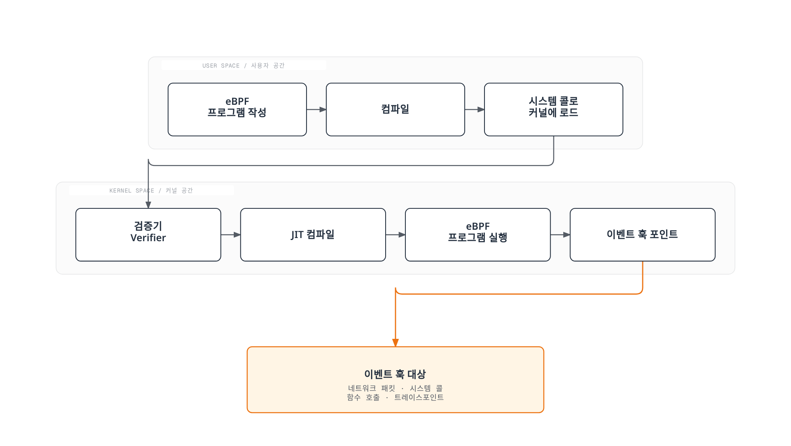
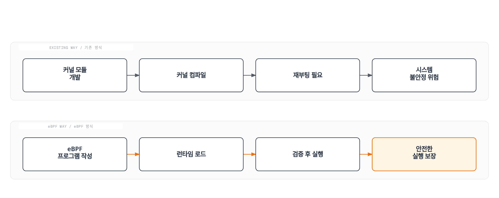
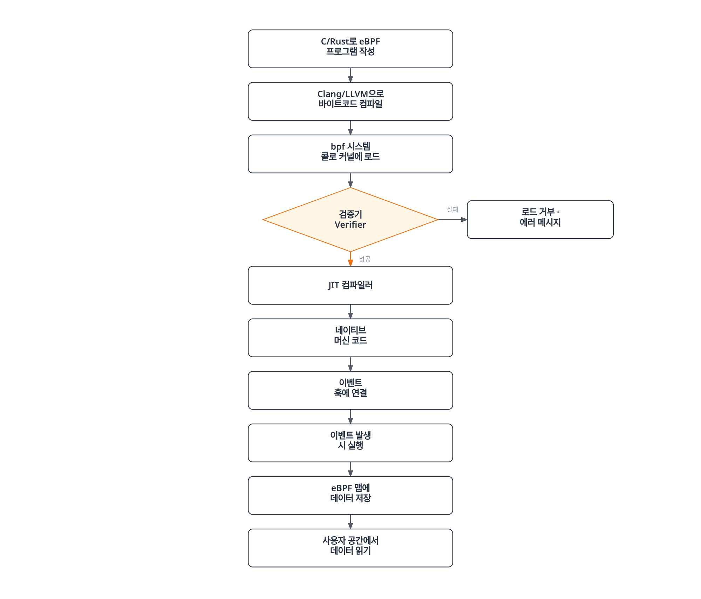
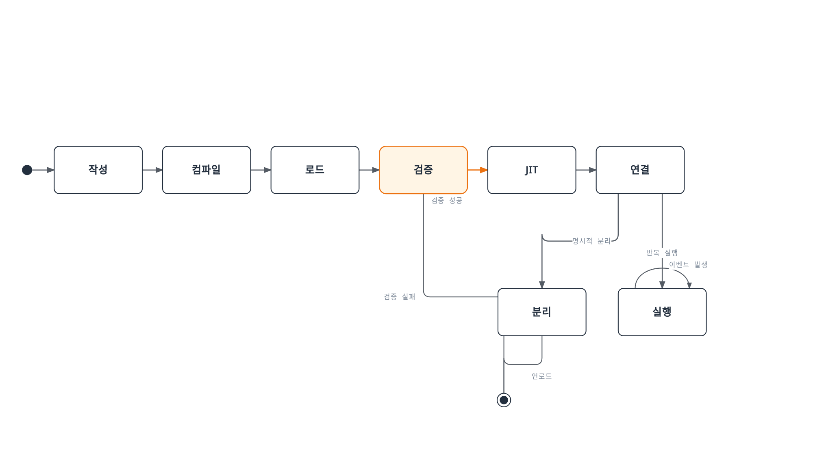
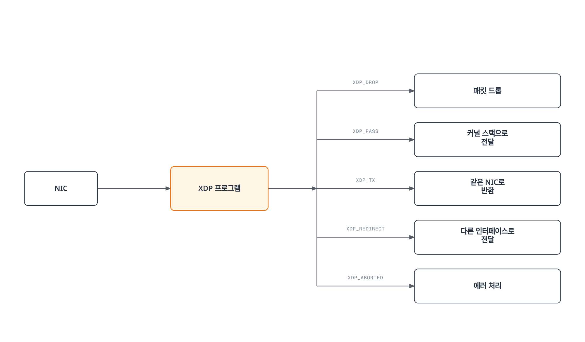
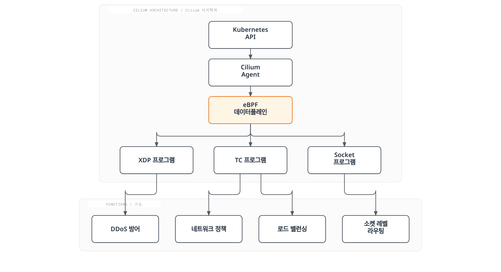
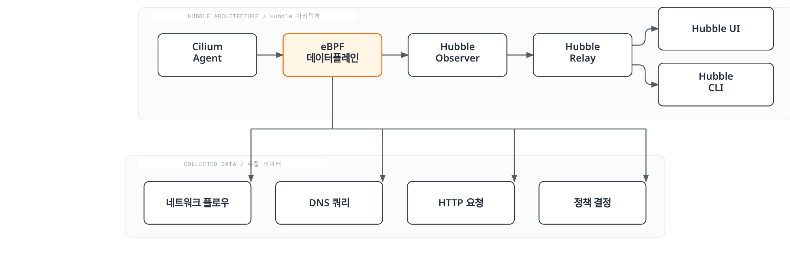
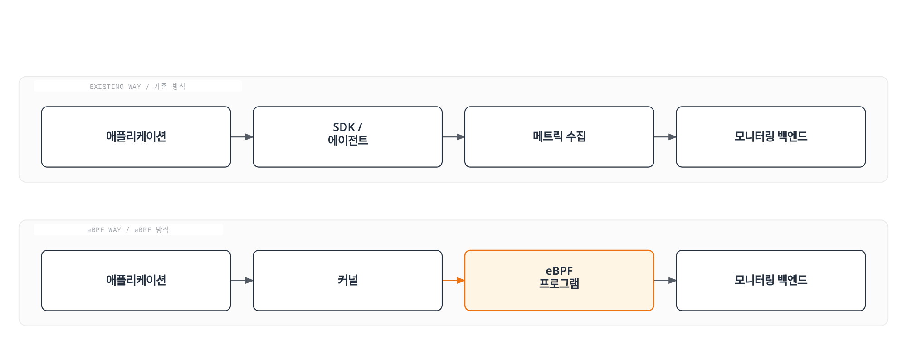
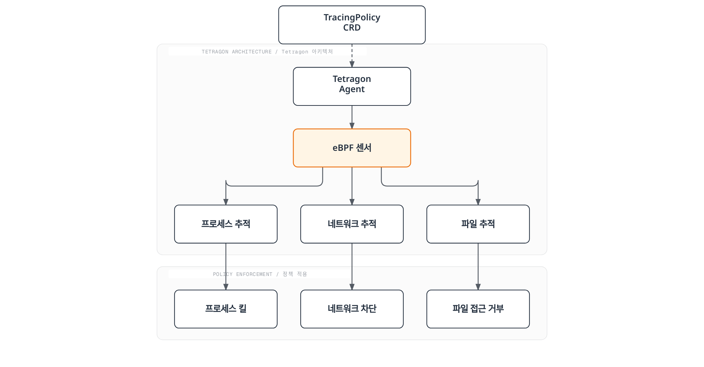

# eBPF 기초와 Kubernetes 활용

> **지원 버전**: Linux Kernel 4.18+, Kubernetes 1.25+
> **마지막 업데이트**: 2026년 2월 23일

eBPF는 Linux 커널 내에서 샌드박스화된 프로그램을 실행할 수 있게 해주는 혁신적인 기술입니다. 이 문서에서는 eBPF의 기본 개념부터 Kubernetes 환경에서의 활용까지 전반적인 내용을 다룹니다.

## 목차

* [1. eBPF 소개](#1-ebpf-소개)
* [2. eBPF 아키텍처](#2-ebpf-아키텍처)
* [3. eBPF 프로그램 유형](#3-ebpf-프로그램-유형)
* [4. eBPF 개발 도구](#4-ebpf-개발-도구)
* [5. eBPF와 Kubernetes 네트워킹](#5-ebpf와-kubernetes-네트워킹)
* [6. eBPF 기반 관찰성](#6-ebpf-기반-관찰성)
* [7. eBPF 기반 보안](#7-ebpf-기반-보안)
* [8. eBPF 실전 활용 예제](#8-ebpf-실전-활용-예제)
* [9. eBPF 제한 사항과 주의점](#9-ebpf-제한-사항과-주의점)
* [10. 다음 단계](#10-다음-단계)

## 실습 환경 설정

이 문서의 예제를 따라하기 위해서는 다음과 같은 환경이 필요합니다.

### 필수 환경
- Linux 커널 4.18 이상 (5.10+ 권장)
- bpftool, bcc-tools
- Kubernetes 클러스터 (선택 사항)

### 환경 설정

```bash
# Ubuntu/Debian에서 필요한 패키지 설치
sudo apt-get update
sudo apt-get install -y linux-tools-common linux-tools-generic bpfcc-tools

# 커널 버전 확인
uname -r

# eBPF 기능 지원 확인
sudo bpftool feature
```

---

## 1. eBPF 소개

### 1.1 eBPF란 무엇인가?

**eBPF(extended Berkeley Packet Filter)**는 Linux 커널 내에서 안전하게 사용자 정의 프로그램을 실행할 수 있게 해주는 기술입니다. 원래 네트워크 패킷 필터링을 위해 설계되었던 BPF를 확장하여, 이제는 네트워킹, 보안, 추적, 성능 분석 등 다양한 영역에서 활용됩니다.

> **핵심 개념**: eBPF를 사용하면 커널 소스 코드를 수정하거나 커널 모듈을 로드하지 않고도 커널의 동작을 확장하고 관찰할 수 있습니다.



### 1.2 전통적인 BPF에서 eBPF로의 진화

**초기 BPF (1992년)**:
- UC 버클리에서 개발
- 네트워크 패킷 캡처 및 필터링 전용
- 2개의 32비트 레지스터
- 최대 4,096개 명령어 제한

**eBPF (2014년~)**:
- 64비트 아키텍처 지원
- 11개의 레지스터
- 맵(Maps)을 통한 상태 저장
- 다양한 훅 포인트 지원
- JIT 컴파일을 통한 네이티브 성능

| 특성 | 전통적 BPF | eBPF |
|------|-----------|------|
| 레지스터 | 2개 (32비트) | 11개 (64비트) |
| 명령어 수 | 4,096개 | 100만+ |
| 맵 지원 | 없음 | 다양한 맵 유형 |
| 용도 | 패킷 필터링 | 범용 커널 프로그래밍 |
| 호출 기능 | 없음 | 헬퍼 함수, BPF-to-BPF 호출 |
| 상태 저장 | 불가능 | 맵을 통해 가능 |

### 1.3 eBPF가 혁신적인 이유

eBPF는 다음과 같은 이유로 혁신적입니다:

1. **커널 수정 없는 기능 확장**: 커널 소스 코드를 변경하지 않고도 커널 기능을 확장
2. **안전한 실행**: 검증기가 프로그램의 안전성을 보장
3. **높은 성능**: JIT 컴파일로 네이티브 코드 수준의 성능
4. **동적 로딩**: 재부팅 없이 프로그램 로드/언로드 가능
5. **프로덕션 안정성**: 크래시나 무한 루프 없이 안전하게 실행



### 1.4 eBPF vs 커널 모듈 비교

| 측면 | eBPF | 커널 모듈 |
|------|------|----------|
| **안전성** | 검증기가 안전성 보장 | 커널 크래시 가능 |
| **이식성** | CO-RE로 커널 버전 독립적 | 커널 버전별 재컴파일 필요 |
| **로딩** | 동적 로드/언로드 | insmod/rmmod 필요 |
| **권한** | CAP_BPF 또는 CAP_SYS_ADMIN | root 권한 필요 |
| **디버깅** | 제한적 | 전체 커널 디버깅 가능 |
| **성능** | JIT 컴파일로 최적화 | 네이티브 성능 |
| **기능 범위** | 정해진 훅 포인트만 | 무제한 |
| **개발 난이도** | 상대적으로 쉬움 | 높은 전문성 필요 |

---

## 2. eBPF 아키텍처

### 2.1 eBPF 실행 흐름



### 2.2 검증기 (Verifier)

검증기는 eBPF의 핵심 보안 메커니즘입니다. 프로그램이 커널에서 실행되기 전에 다음 사항을 검증합니다:

**검증 항목**:
- 무한 루프 없음 (DAG 구조 확인)
- 범위를 벗어난 메모리 접근 없음
- 초기화되지 않은 변수 사용 없음
- 올바른 헬퍼 함수 호출
- 프로그램 종료 보장

```c
// 검증기가 거부하는 예제
int bad_example(void *ctx) {
    int i;
    for (i = 0; i < 1000000; i++) {  // 무한 루프 가능성
        // ...
    }
    return 0;
}

// 검증기가 허용하는 예제
int good_example(void *ctx) {
    #pragma unroll
    for (int i = 0; i < 10; i++) {  // 컴파일 시 언롤링
        // ...
    }
    return 0;
}
```

### 2.3 JIT 컴파일러

JIT(Just-In-Time) 컴파일러는 eBPF 바이트코드를 네이티브 머신 코드로 변환합니다:

```bash
# JIT 컴파일러 상태 확인
cat /proc/sys/net/core/bpf_jit_enable

# JIT 컴파일러 활성화 (0: 비활성화, 1: 활성화, 2: 디버그 모드)
echo 1 | sudo tee /proc/sys/net/core/bpf_jit_enable
```

**JIT 컴파일 이점**:
- 인터프리터 대비 4~5배 성능 향상
- 네이티브 CPU 명령어로 직접 실행
- 아키텍처별 최적화 적용

### 2.4 eBPF 맵 (Maps)

eBPF 맵은 커널과 사용자 공간 간 데이터를 공유하고 상태를 저장하는 데이터 구조입니다.

**주요 맵 유형**:

| 맵 유형 | 설명 | 사용 사례 |
|---------|------|----------|
| `BPF_MAP_TYPE_HASH` | 해시 테이블 | 키-값 저장, 연결 추적 |
| `BPF_MAP_TYPE_ARRAY` | 고정 크기 배열 | 인덱스 기반 접근, 설정 값 |
| `BPF_MAP_TYPE_PERF_EVENT_ARRAY` | 이벤트 배열 | 사용자 공간으로 이벤트 전송 |
| `BPF_MAP_TYPE_RINGBUF` | 링 버퍼 | 고성능 이벤트 스트리밍 |
| `BPF_MAP_TYPE_LRU_HASH` | LRU 해시 | 캐시, 자동 항목 제거 |
| `BPF_MAP_TYPE_PERCPU_ARRAY` | CPU별 배열 | 락 없는 통계 수집 |
| `BPF_MAP_TYPE_LPM_TRIE` | LPM 트라이 | IP 주소 매칭, 라우팅 |

```c
// 해시 맵 정의 예제
struct {
    __uint(type, BPF_MAP_TYPE_HASH);
    __uint(max_entries, 1024);
    __type(key, __u32);      // 키: 프로세스 ID
    __type(value, __u64);    // 값: 카운터
} packet_count SEC(".maps");
```

### 2.5 헬퍼 함수 (Helper Functions)

eBPF 프로그램은 커널이 제공하는 헬퍼 함수를 통해 커널 기능에 접근합니다.

**주요 헬퍼 함수**:

```c
// 맵 조작
void *bpf_map_lookup_elem(struct bpf_map *map, const void *key);
int bpf_map_update_elem(struct bpf_map *map, const void *key, const void *value, u64 flags);
int bpf_map_delete_elem(struct bpf_map *map, const void *key);

// 시간 관련
u64 bpf_ktime_get_ns(void);  // 나노초 단위 현재 시간

// 패킷 조작
int bpf_skb_load_bytes(const struct sk_buff *skb, u32 offset, void *to, u32 len);
int bpf_xdp_adjust_head(struct xdp_md *xdp_md, int delta);

// 추적
int bpf_probe_read(void *dst, u32 size, const void *src);
int bpf_trace_printk(const char *fmt, u32 fmt_size, ...);

// 프로세스 정보
u64 bpf_get_current_pid_tgid(void);    // PID/TGID 획득
u64 bpf_get_current_uid_gid(void);     // UID/GID 획득
int bpf_get_current_comm(void *buf, u32 size);  // 프로세스 이름
```

### 2.6 프로그램 라이프사이클



---

## 3. eBPF 프로그램 유형

### 3.1 XDP (eXpress Data Path)

XDP는 네트워크 드라이버 레벨에서 패킷을 처리하는 가장 빠른 방법입니다.



**XDP 동작 모드**:
| 모드 | 설명 | 성능 |
|------|------|------|
| Native XDP | NIC 드라이버에서 직접 실행 | 최고 |
| Offloaded XDP | 스마트 NIC에서 실행 | 최고+ |
| Generic XDP | 소프트웨어 에뮬레이션 | 테스트용 |

```c
// XDP 프로그램 예제: 특정 포트 트래픽 드롭
SEC("xdp")
int xdp_drop_port(struct xdp_md *ctx) {
    void *data = (void *)(long)ctx->data;
    void *data_end = (void *)(long)ctx->data_end;

    struct ethhdr *eth = data;
    if ((void *)(eth + 1) > data_end)
        return XDP_PASS;

    if (eth->h_proto != htons(ETH_P_IP))
        return XDP_PASS;

    struct iphdr *ip = (void *)(eth + 1);
    if ((void *)(ip + 1) > data_end)
        return XDP_PASS;

    if (ip->protocol != IPPROTO_TCP)
        return XDP_PASS;

    struct tcphdr *tcp = (void *)ip + (ip->ihl * 4);
    if ((void *)(tcp + 1) > data_end)
        return XDP_PASS;

    // 포트 8080 트래픽 드롭
    if (tcp->dest == htons(8080))
        return XDP_DROP;

    return XDP_PASS;
}
```

### 3.2 TC (Traffic Control)

TC 프로그램은 네트워크 스택의 트래픽 제어 계층에서 실행됩니다.

```bash
# TC 프로그램 연결 예제
tc qdisc add dev eth0 clsact
tc filter add dev eth0 ingress bpf da obj tc_prog.o sec classifier
tc filter add dev eth0 egress bpf da obj tc_prog.o sec classifier
```

**TC vs XDP 비교**:
| 특성 | XDP | TC |
|------|-----|-----|
| 실행 위치 | 드라이버 레벨 | 네트워크 스택 |
| 성능 | 최고 | 높음 |
| SKB 접근 | 불가 | 가능 |
| 방향 | 수신만 | 송수신 모두 |
| 패킷 수정 | 제한적 | 자유로움 |

### 3.3 Kprobes/Uprobes

Kprobes와 Uprobes는 함수 호출을 동적으로 추적합니다.

```c
// Kprobe 예제: tcp_connect 함수 추적
SEC("kprobe/tcp_connect")
int BPF_KPROBE(trace_tcp_connect, struct sock *sk) {
    u32 pid = bpf_get_current_pid_tgid() >> 32;

    // 목적지 IP 주소 획득
    u32 daddr = BPF_CORE_READ(sk, __sk_common.skc_daddr);
    u16 dport = BPF_CORE_READ(sk, __sk_common.skc_dport);

    bpf_printk("PID %d connecting to %pI4:%d\n", pid, &daddr, ntohs(dport));
    return 0;
}

// Uprobe 예제: malloc 함수 추적
SEC("uprobe/libc.so.6:malloc")
int BPF_UPROBE(trace_malloc, size_t size) {
    u32 pid = bpf_get_current_pid_tgid() >> 32;
    bpf_printk("PID %d malloc(%zu)\n", pid, size);
    return 0;
}
```

### 3.4 Tracepoints

Tracepoints는 커널에 미리 정의된 정적 추적점입니다.

```bash
# 사용 가능한 tracepoints 확인
sudo ls /sys/kernel/debug/tracing/events/

# 특정 카테고리의 tracepoints
sudo ls /sys/kernel/debug/tracing/events/sched/
sudo ls /sys/kernel/debug/tracing/events/syscalls/
```

```c
// Tracepoint 예제: 프로세스 시작 추적
SEC("tracepoint/sched/sched_process_exec")
int handle_exec(struct trace_event_raw_sched_process_exec *ctx) {
    char comm[16];
    bpf_get_current_comm(&comm, sizeof(comm));

    u32 pid = bpf_get_current_pid_tgid() >> 32;
    bpf_printk("Process started: %s (PID: %d)\n", comm, pid);

    return 0;
}
```

### 3.5 LSM (Linux Security Module) BPF

LSM BPF는 보안 정책을 동적으로 적용합니다.

```c
// LSM BPF 예제: 파일 열기 제한
SEC("lsm/file_open")
int BPF_PROG(restrict_file_open, struct file *file, int ret) {
    if (ret != 0)
        return ret;

    char path[256];
    bpf_d_path(&file->f_path, path, sizeof(path));

    // /etc/shadow 접근 차단
    if (bpf_strncmp(path, 11, "/etc/shadow") == 0)
        return -EACCES;

    return 0;
}
```

### 3.6 Socket Filter

소켓 레벨에서 패킷을 필터링합니다.

```c
// Socket Filter 예제
SEC("socket")
int socket_filter(struct __sk_buff *skb) {
    // IPv4 패킷만 허용
    if (skb->protocol != htons(ETH_P_IP))
        return 0;  // 드롭

    return skb->len;  // 패킷 길이 반환 (허용)
}
```

### 3.7 Cgroup 프로그램

컨테이너의 리소스와 네트워크를 제어합니다.

```c
// Cgroup 소켓 프로그램 예제: 외부 연결 차단
SEC("cgroup/connect4")
int restrict_connect(struct bpf_sock_addr *ctx) {
    // 로컬 네트워크가 아닌 연결 차단
    __u32 dst = ctx->user_ip4;

    // 10.0.0.0/8 대역만 허용
    if ((dst & 0xFF) != 10)
        return 0;  // 연결 거부

    return 1;  // 연결 허용
}
```

---

## 4. eBPF 개발 도구

### 4.1 bpftool

bpftool은 eBPF 프로그램과 맵을 관리하는 공식 도구입니다.

```bash
# 로드된 eBPF 프로그램 목록
sudo bpftool prog list

# 프로그램 상세 정보
sudo bpftool prog show id <ID>

# 프로그램 덤프 (바이트코드)
sudo bpftool prog dump xlated id <ID>

# JIT 컴파일된 코드 덤프
sudo bpftool prog dump jited id <ID>

# 맵 목록
sudo bpftool map list

# 맵 내용 조회
sudo bpftool map dump id <MAP_ID>

# 맵에 값 추가
sudo bpftool map update id <MAP_ID> key 0x01 0x00 0x00 0x00 value 0xFF 0x00 0x00 0x00

# 커널의 eBPF 기능 확인
sudo bpftool feature

# BTF (BPF Type Format) 정보
sudo bpftool btf list
```

### 4.2 bpftrace

bpftrace는 DTrace 스타일의 고수준 추적 언어입니다.

```bash
# 설치
sudo apt-get install -y bpftrace

# 시스템 콜 카운트
sudo bpftrace -e 'tracepoint:raw_syscalls:sys_enter { @[comm] = count(); }'

# 프로세스별 읽기 바이트 수
sudo bpftrace -e 'tracepoint:syscalls:sys_exit_read /args->ret > 0/ { @bytes[comm] = sum(args->ret); }'

# 파일 열기 추적
sudo bpftrace -e 'tracepoint:syscalls:sys_enter_openat { printf("%s opened %s\n", comm, str(args->filename)); }'

# TCP 연결 추적
sudo bpftrace -e 'kprobe:tcp_connect { printf("%s -> %s\n", ntop(((struct sock *)arg0)->__sk_common.skc_rcv_saddr), ntop(((struct sock *)arg0)->__sk_common.skc_daddr)); }'

# 지연 시간 히스토그램
sudo bpftrace -e 'kprobe:vfs_read { @start[tid] = nsecs; } kretprobe:vfs_read /@start[tid]/ { @ns = hist(nsecs - @start[tid]); delete(@start[tid]); }'
```

**유용한 bpftrace 원라이너**:

```bash
# CPU 사용량 상위 프로세스
sudo bpftrace -e 'profile:hz:99 { @[comm] = count(); }'

# 블록 I/O 지연 시간
sudo bpftrace -e 'tracepoint:block:block_rq_issue { @start[args->dev, args->sector] = nsecs; } tracepoint:block:block_rq_complete /@start[args->dev, args->sector]/ { @usecs = hist((nsecs - @start[args->dev, args->sector]) / 1000); delete(@start[args->dev, args->sector]); }'

# 새 프로세스 추적
sudo bpftrace -e 'tracepoint:sched:sched_process_exec { printf("%-10d %-16s\n", pid, comm); }'

# 메모리 할당 추적
sudo bpftrace -e 'tracepoint:kmem:kmalloc { @bytes = hist(args->bytes_alloc); }'
```

### 4.3 BCC (BPF Compiler Collection)

BCC는 Python과 Lua를 통해 eBPF 프로그램을 작성할 수 있게 해주는 도구입니다.

```bash
# 설치
sudo apt-get install -y bpfcc-tools python3-bpfcc

# 포함된 도구들
ls /usr/share/bcc/tools/
```

**주요 BCC 도구**:

| 도구 | 설명 |
|------|------|
| `execsnoop` | 새로운 프로세스 실행 추적 |
| `opensnoop` | 파일 열기 추적 |
| `biolatency` | 블록 I/O 지연 시간 |
| `tcpconnect` | TCP 연결 추적 |
| `tcpaccept` | TCP 수신 연결 추적 |
| `tcpretrans` | TCP 재전송 추적 |
| `runqlat` | CPU 실행 큐 지연 시간 |
| `profile` | CPU 프로파일링 |
| `funccount` | 함수 호출 횟수 |
| `trace` | 범용 함수 추적 |

```bash
# 사용 예제
sudo /usr/share/bcc/tools/execsnoop    # 프로세스 실행 추적
sudo /usr/share/bcc/tools/tcpconnect   # TCP 연결 추적
sudo /usr/share/bcc/tools/biolatency   # 디스크 I/O 지연 시간
sudo /usr/share/bcc/tools/profile -F 99 10  # 10초간 CPU 프로파일링
```

### 4.4 libbpf와 CO-RE

libbpf는 eBPF 프로그램 로딩을 위한 C 라이브러리이며, CO-RE(Compile Once, Run Everywhere)를 지원합니다.

**CO-RE의 장점**:
- 컴파일된 eBPF 프로그램을 다양한 커널 버전에서 실행
- BTF(BPF Type Format)를 사용한 구조체 재배치
- 커널 헤더 의존성 감소

```c
// CO-RE를 사용한 예제
#include "vmlinux.h"
#include <bpf/bpf_helpers.h>
#include <bpf/bpf_core_read.h>

SEC("kprobe/do_sys_open")
int BPF_KPROBE(do_sys_open, int dfd, const char *filename) {
    u32 pid = bpf_get_current_pid_tgid() >> 32;

    char fname[256];
    bpf_probe_read_user_str(fname, sizeof(fname), filename);

    bpf_printk("PID %d opened: %s\n", pid, fname);
    return 0;
}

char LICENSE[] SEC("license") = "GPL";
```

**BTF 생성 및 확인**:

```bash
# BTF 지원 확인
ls /sys/kernel/btf/vmlinux

# vmlinux.h 생성 (CO-RE 개발용)
bpftool btf dump file /sys/kernel/btf/vmlinux format c > vmlinux.h

# 프로그램의 BTF 정보 확인
bpftool prog show id <ID> --pretty
```

---

## 5. eBPF와 Kubernetes 네트워킹

### 5.1 Cilium: eBPF 기반 CNI

Cilium은 eBPF를 활용한 가장 대표적인 Kubernetes CNI(Container Network Interface)입니다.



#### kube-proxy 대체

Cilium은 eBPF를 사용하여 kube-proxy를 완전히 대체할 수 있습니다.

**기존 kube-proxy (iptables 모드)**:
```
패킷 → Netfilter → iptables 규칙 평가 → DNAT → 라우팅
```

**Cilium eBPF 모드**:
```
패킷 → eBPF 맵 조회 → 직접 라우팅
```

```bash
# Cilium 설치 (kube-proxy 대체 모드)
helm install cilium cilium/cilium --version 1.14.0 \
  --namespace kube-system \
  --set kubeProxyReplacement=strict \
  --set k8sServiceHost=${API_SERVER_IP} \
  --set k8sServicePort=${API_SERVER_PORT}

# kube-proxy 제거
kubectl -n kube-system delete ds kube-proxy
kubectl -n kube-system delete cm kube-proxy
```

#### 네트워크 정책

Cilium은 eBPF를 사용하여 L3/L4/L7 네트워크 정책을 적용합니다.

```yaml
# Cilium 네트워크 정책 예제
apiVersion: cilium.io/v2
kind: CiliumNetworkPolicy
metadata:
  name: allow-http-only
spec:
  endpointSelector:
    matchLabels:
      app: web
  ingress:
    - fromEndpoints:
        - matchLabels:
            app: frontend
      toPorts:
        - ports:
            - port: "80"
              protocol: TCP
          rules:
            http:
              - method: GET
                path: "/api/.*"
```

#### 로드 밸런싱

```yaml
# Cilium LoadBalancer 서비스 예제
apiVersion: v1
kind: Service
metadata:
  name: my-service
  annotations:
    io.cilium/lb-ipam-ips: "192.168.1.100"
spec:
  type: LoadBalancer
  selector:
    app: my-app
  ports:
    - port: 80
      targetPort: 8080
```

### 5.2 Calico eBPF 모드

Calico도 eBPF 데이터플레인을 지원합니다.

```bash
# Calico eBPF 모드 활성화
kubectl patch installation.operator.tigera.io default --type merge -p '{"spec":{"calicoNetwork":{"linuxDataplane":"BPF"}}}'
```

**Calico eBPF 모드 특징**:
- 소스 IP 보존
- 직접 서버 리턴 (DSR) 지원
- 호스트 엔드포인트 정책
- 암호화된 노드 간 통신

### 5.3 성능 비교: iptables vs eBPF

| 측면 | iptables | eBPF |
|------|----------|------|
| **확장성** | O(n) - 서비스 수에 비례 | O(1) - 맵 조회 |
| **지연 시간** | 규칙 수에 따라 증가 | 일정 |
| **CPU 사용량** | 높음 | 낮음 |
| **업데이트** | 전체 테이블 재작성 | 맵 항목 업데이트 |
| **관찰성** | 제한적 | Hubble 통합 |
| **메모리** | 규칙당 메모리 사용 | 최적화된 맵 구조 |

**벤치마크 결과** (1000개 서비스 기준):

```
| 지표              | iptables    | eBPF      | 개선율    |
|------------------|-------------|-----------|----------|
| 연결 설정 시간    | 2.5ms       | 0.3ms     | 8.3x     |
| CPU 사용량       | 15%         | 3%        | 5x       |
| 메모리 사용량    | 256MB       | 32MB      | 8x       |
| 초당 연결 수     | 50,000      | 250,000   | 5x       |
```

```bash
# Cilium 상태 확인
cilium status

# eBPF 맵 확인
cilium bpf lb list
cilium bpf ct list global

# 네트워크 정책 상태
cilium policy get
```

---

## 6. eBPF 기반 관찰성 (Observability)

eBPF는 시스템과 애플리케이션의 동작을 심층적으로 관찰할 수 있게 해줍니다. 기존의 에이전트 기반 모니터링과 달리, eBPF는 커널 레벨에서 데이터를 수집하여 더 낮은 오버헤드로 더 풍부한 정보를 제공합니다.

### 6.1 Hubble: Cilium 네트워크 관찰성

Hubble은 Cilium에 내장된 네트워크 관찰성 플랫폼입니다.



```bash
# Hubble 설치
helm upgrade cilium cilium/cilium --version 1.14.0 \
  --namespace kube-system \
  --reuse-values \
  --set hubble.relay.enabled=true \
  --set hubble.ui.enabled=true

# Hubble CLI 사용
hubble observe --pod my-pod
hubble observe --namespace default
hubble observe --protocol http
hubble observe --verdict DROPPED

# 특정 서비스 간 트래픽 관찰
hubble observe --from-pod default/frontend --to-pod default/backend

# 네트워크 플로우 실시간 모니터링
hubble observe -f --type trace

# 서비스 맵 생성
hubble observe --namespace default -o jsonpb | hubble relay --serviceMap
```

**Hubble UI 접속**:

```bash
# 포트 포워딩
kubectl port-forward -n kube-system svc/hubble-ui 12000:80

# 브라우저에서 http://localhost:12000 접속
```

### 6.2 Pixie: 자동 계측 관찰성

Pixie는 eBPF를 사용하여 애플리케이션 코드 수정 없이 자동으로 텔레메트리를 수집합니다.

**Pixie 특징**:
- 자동 프로토콜 파싱 (HTTP, gRPC, MySQL, PostgreSQL, Kafka 등)
- 서비스 맵 자동 생성
- 분산 추적
- CPU 프로파일링
- 동적 로깅

```bash
# Pixie 설치
px deploy

# Pixie CLI 쿼리 예제
# HTTP 요청 지연 시간
px script run px/http_data

# 서비스 간 트래픽
px script run px/service_stats

# 느린 요청 분석
px script run px/slow_requests -- start_time=-5m latency_ns=100000000

# Pod 리소스 사용량
px script run px/pod_stats
```

**PxL (Pixie Query Language) 예제**:

```python
# 느린 HTTP 요청 찾기
import px

df = px.DataFrame(table='http_events', start_time='-5m')
df = df[df.latency > 100000000]  # 100ms 이상
df = df.groupby(['service', 'req_path']).agg(
    count=('latency', px.count),
    avg_latency=('latency', px.mean),
    p99_latency=('latency', px.quantiles, 0.99)
)
px.display(df)
```

### 6.3 Coroot: "No-Code" 모니터링

Coroot는 eBPF를 사용하여 추가 설정 없이 자동으로 시스템을 모니터링합니다.

```bash
# Helm으로 Coroot 설치
helm repo add coroot https://coroot.github.io/helm-charts
helm install coroot coroot/coroot -n coroot --create-namespace
```

**Coroot 기능**:
- 서비스 자동 발견
- 의존성 맵 자동 생성
- SLO 모니터링
- 이상 탐지
- 근본 원인 분석

### 6.4 Kepler: 에너지 소비 모니터링

Kepler(Kubernetes-based Efficient Power Level Exporter)는 eBPF를 사용하여 컨테이너의 에너지 소비를 모니터링합니다.

```bash
# Kepler 설치
kubectl apply -f https://raw.githubusercontent.com/sustainable-computing-io/kepler/main/manifests/kubernetes/deployment.yaml

# Prometheus 메트릭 확인
curl localhost:9103/metrics | grep kepler
```

**Kepler 메트릭**:
- `kepler_container_joules_total`: 컨테이너별 에너지 소비
- `kepler_container_gpu_joules_total`: GPU 에너지 소비
- `kepler_node_core_joules_total`: 노드 CPU 에너지

### 6.5 기존 에이전트 vs eBPF 계측 비교

| 측면 | 기존 에이전트 | eBPF 계측 |
|------|-------------|-----------|
| **오버헤드** | 높음 (5-15%) | 낮음 (<1%) |
| **코드 수정** | 필요 (SDK/라이브러리) | 불필요 |
| **커버리지** | 계측된 부분만 | 전체 시스템 |
| **배포** | 애플리케이션별 | 노드별 |
| **권한** | 일반 권한 | CAP_BPF 필요 |
| **데이터 깊이** | 애플리케이션 레벨 | 커널 레벨 |
| **프로토콜 지원** | 명시적 지원 필요 | 자동 파싱 |



---

## 7. eBPF 기반 보안

### 7.1 Tetragon: 런타임 보안

Tetragon은 Cilium 프로젝트에서 제공하는 eBPF 기반 런타임 보안 솔루션입니다.



```bash
# Tetragon 설치
helm repo add cilium https://helm.cilium.io
helm install tetragon cilium/tetragon -n kube-system

# 이벤트 관찰
kubectl logs -n kube-system -l app.kubernetes.io/name=tetragon -c export-stdout -f | tetra getevents -o compact
```

**TracingPolicy 예제**:

```yaml
# 민감한 파일 접근 모니터링
apiVersion: cilium.io/v1alpha1
kind: TracingPolicy
metadata:
  name: sensitive-file-access
spec:
  kprobes:
    - call: security_file_open
      syscall: false
      args:
        - index: 0
          type: file
      selectors:
        - matchArgs:
            - index: 0
              operator: Prefix
              values:
                - /etc/shadow
                - /etc/passwd
                - /etc/sudoers
          matchActions:
            - action: Sigkill  # 프로세스 종료
```

```yaml
# 네트워크 연결 제어
apiVersion: cilium.io/v1alpha1
kind: TracingPolicy
metadata:
  name: restrict-outbound
spec:
  kprobes:
    - call: tcp_connect
      syscall: false
      args:
        - index: 0
          type: sock
      selectors:
        - matchArgs:
            - index: 0
              operator: NotEqual
              values:
                - "10.0.0.0/8"  # 내부 네트워크
          matchActions:
            - action: Sigkill
```

### 7.2 Falco: eBPF 기반 이상 탐지

Falco는 CNCF 프로젝트로, eBPF를 사용하여 런타임 이상 동작을 탐지합니다.

```bash
# Falco 설치 (eBPF 드라이버)
helm repo add falcosecurity https://falcosecurity.github.io/charts
helm install falco falcosecurity/falco \
  --namespace falco --create-namespace \
  --set driver.kind=modern_ebpf
```

**Falco 규칙 예제**:

```yaml
# /etc/shadow 읽기 탐지
- rule: Read sensitive file
  desc: Detect reading of sensitive files
  condition: >
    open_read and
    fd.name in (/etc/shadow, /etc/sudoers) and
    not proc.name in (systemd, sudo, login)
  output: >
    Sensitive file opened (file=%fd.name user=%user.name
    process=%proc.name container=%container.name)
  priority: WARNING

# 컨테이너에서 셸 실행 탐지
- rule: Shell in container
  desc: Detect shell execution in container
  condition: >
    spawned_process and
    container and
    proc.name in (bash, sh, zsh, dash) and
    proc.pname != containerd-shim
  output: >
    Shell spawned in container (container=%container.name
    shell=%proc.name parent=%proc.pname)
  priority: NOTICE

# 권한 상승 탐지
- rule: Privilege escalation
  desc: Detect privilege escalation attempts
  condition: >
    spawned_process and
    proc.name in (sudo, su, doas) and
    container
  output: >
    Privilege escalation attempt (user=%user.name
    command=%proc.cmdline container=%container.name)
  priority: WARNING
```

### 7.3 seccomp-bpf: 시스템 콜 필터링

seccomp-bpf는 BPF를 사용하여 프로세스가 호출할 수 있는 시스템 콜을 제한합니다.

```yaml
# Kubernetes Pod에서 seccomp 프로필 적용
apiVersion: v1
kind: Pod
metadata:
  name: secure-pod
spec:
  securityContext:
    seccompProfile:
      type: RuntimeDefault  # 또는 Localhost
  containers:
    - name: app
      image: nginx
```

**커스텀 seccomp 프로필**:

```json
{
  "defaultAction": "SCMP_ACT_ERRNO",
  "architectures": ["SCMP_ARCH_X86_64"],
  "syscalls": [
    {
      "names": ["read", "write", "open", "close", "stat", "fstat", "mmap", "mprotect", "munmap", "brk", "rt_sigaction", "rt_sigprocmask", "ioctl", "access", "pipe", "select", "sched_yield", "mremap", "msync", "mincore", "madvise", "shmget", "shmat", "shmctl", "dup", "dup2", "pause", "nanosleep", "getitimer", "alarm", "setitimer", "getpid", "socket", "connect", "accept", "sendto", "recvfrom", "bind", "listen", "getsockname", "getpeername", "socketpair", "setsockopt", "getsockopt", "clone", "fork", "vfork", "execve", "exit", "wait4", "kill", "uname", "fcntl", "flock", "fsync", "fdatasync", "truncate", "ftruncate", "getdents", "getcwd", "chdir", "rename", "mkdir", "rmdir", "creat", "link", "unlink", "symlink", "readlink", "chmod", "fchmod", "chown", "fchown", "lchown", "umask", "gettimeofday", "getrlimit", "getrusage", "sysinfo", "times", "ptrace", "getuid", "syslog", "getgid", "setuid", "setgid", "geteuid", "getegid", "setpgid", "getppid", "getpgrp", "setsid", "setreuid", "setregid", "getgroups", "setgroups", "setresuid", "getresuid", "setresgid", "getresgid", "getpgid", "setfsuid", "setfsgid", "getsid", "capget", "capset", "rt_sigpending", "rt_sigtimedwait", "rt_sigqueueinfo", "rt_sigsuspend", "sigaltstack", "utime", "mknod", "personality", "ustat", "statfs", "fstatfs", "sysfs", "getpriority", "setpriority", "sched_setparam", "sched_getparam", "sched_setscheduler", "sched_getscheduler", "sched_get_priority_max", "sched_get_priority_min", "sched_rr_get_interval", "mlock", "munlock", "mlockall", "munlockall", "vhangup", "pivot_root", "prctl", "arch_prctl", "adjtimex", "setrlimit", "chroot", "sync", "acct", "settimeofday", "mount", "umount2", "swapon", "swapoff", "reboot", "sethostname", "setdomainname", "ioperm", "iopl", "create_module", "init_module", "delete_module", "get_kernel_syms", "query_module", "quotactl", "nfsservctl", "getpmsg", "putpmsg", "afs_syscall", "tuxcall", "security", "gettid", "readahead", "setxattr", "lsetxattr", "fsetxattr", "getxattr", "lgetxattr", "fgetxattr", "listxattr", "llistxattr", "flistxattr", "removexattr", "lremovexattr", "fremovexattr", "tkill", "time", "futex", "sched_setaffinity", "sched_getaffinity", "set_thread_area", "io_setup", "io_destroy", "io_getevents", "io_submit", "io_cancel", "get_thread_area", "lookup_dcookie", "epoll_create", "epoll_ctl_old", "epoll_wait_old", "remap_file_pages", "getdents64", "set_tid_address", "restart_syscall", "semtimedop", "fadvise64", "timer_create", "timer_settime", "timer_gettime", "timer_getoverrun", "timer_delete", "clock_settime", "clock_gettime", "clock_getres", "clock_nanosleep", "exit_group", "epoll_wait", "epoll_ctl", "tgkill", "utimes", "vserver", "mbind", "set_mempolicy", "get_mempolicy", "mq_open", "mq_unlink", "mq_timedsend", "mq_timedreceive", "mq_notify", "mq_getsetattr", "kexec_load", "waitid", "add_key", "request_key", "keyctl", "ioprio_set", "ioprio_get", "inotify_init", "inotify_add_watch", "inotify_rm_watch", "migrate_pages", "openat", "mkdirat", "mknodat", "fchownat", "futimesat", "newfstatat", "unlinkat", "renameat", "linkat", "symlinkat", "readlinkat", "fchmodat", "faccessat", "pselect6", "ppoll", "unshare", "set_robust_list", "get_robust_list", "splice", "tee", "sync_file_range", "vmsplice", "move_pages", "utimensat", "epoll_pwait", "signalfd", "timerfd_create", "eventfd", "fallocate", "timerfd_settime", "timerfd_gettime", "accept4", "signalfd4", "eventfd2", "epoll_create1", "dup3", "pipe2", "inotify_init1", "preadv", "pwritev", "rt_tgsigqueueinfo", "perf_event_open", "recvmmsg", "fanotify_init", "fanotify_mark", "prlimit64", "name_to_handle_at", "open_by_handle_at", "clock_adjtime", "syncfs", "sendmmsg", "setns", "getcpu", "process_vm_readv", "process_vm_writev", "kcmp", "finit_module", "sched_setattr", "sched_getattr", "renameat2", "seccomp", "getrandom", "memfd_create", "kexec_file_load", "bpf"],
      "action": "SCMP_ACT_ALLOW"
    }
  ]
}
```

### 7.4 LSM BPF: 동적 보안 정책

LSM BPF는 Linux Security Module과 eBPF를 결합하여 동적으로 보안 정책을 적용합니다.

```c
// LSM BPF 예제: 실행 파일 제한
SEC("lsm/bprm_check_security")
int BPF_PROG(restrict_exec, struct linux_binprm *bprm, int ret) {
    char filename[256];
    bpf_probe_read_kernel_str(filename, sizeof(filename), bprm->filename);

    // /tmp에서 실행 차단
    if (bpf_strncmp(filename, 5, "/tmp/") == 0)
        return -EPERM;

    return 0;
}

// LSM BPF 예제: 네트워크 소켓 제한
SEC("lsm/socket_connect")
int BPF_PROG(restrict_connect, struct socket *sock, struct sockaddr *address, int addrlen, int ret) {
    if (ret != 0)
        return ret;

    struct sockaddr_in *addr = (struct sockaddr_in *)address;

    // 특정 포트 연결 차단
    if (ntohs(addr->sin_port) == 6666)
        return -EACCES;

    return 0;
}
```

---

## 8. eBPF 실전 활용 예제

### 8.1 bpftrace로 시스템 성능 분석하기

**TCP 연결 추적**:

```bash
# TCP 연결 추적
sudo bpftrace -e '
tracepoint:tcp:tcp_connect {
    printf("%s -> %s:%d\n",
        ntop(args->saddr),
        ntop(args->daddr),
        args->dport);
}'
```

**시스템 콜 지연 시간 분석**:

```bash
# read 시스템 콜 지연 시간 히스토그램
sudo bpftrace -e '
tracepoint:syscalls:sys_enter_read { @start[tid] = nsecs; }
tracepoint:syscalls:sys_exit_read /@start[tid]/ {
    @latency = hist((nsecs - @start[tid]) / 1000);
    delete(@start[tid]);
}'
```

**디스크 I/O 분석**:

```bash
# 블록 I/O 요청 추적
sudo bpftrace -e '
tracepoint:block:block_rq_issue {
    printf("%s %s %d\n",
        comm,
        args->rwbs,
        args->bytes / 1024);
}'

# I/O 지연 시간 히스토그램
sudo bpftrace -e '
tracepoint:block:block_rq_issue { @start[args->dev, args->sector] = nsecs; }
tracepoint:block:block_rq_complete /@start[args->dev, args->sector]/ {
    @us = hist((nsecs - @start[args->dev, args->sector]) / 1000);
    delete(@start[args->dev, args->sector]);
}'
```

### 8.2 Cilium Hubble로 네트워크 흐름 관찰

```bash
# 실시간 네트워크 플로우 관찰
hubble observe -f

# 특정 네임스페이스 트래픽
hubble observe --namespace production

# HTTP 트래픽만 필터링
hubble observe --protocol http

# 드롭된 패킷 분석
hubble observe --verdict DROPPED

# DNS 쿼리 추적
hubble observe --protocol dns

# 특정 Pod 간 트래픽
hubble observe --from-pod default/frontend --to-pod default/backend

# JSON 출력으로 상세 분석
hubble observe --namespace default -o json | jq '.flow.destination.pod_name'

# 플로우 통계
hubble observe --namespace default -o jsonpb | \
  jq -r '.flow | "\(.source.pod_name // .source.identity) -> \(.destination.pod_name // .destination.identity)"' | \
  sort | uniq -c | sort -rn | head -20
```

### 8.3 Tetragon으로 프로세스 보안 모니터링

```bash
# Tetragon 이벤트 실시간 모니터링
kubectl logs -n kube-system -l app.kubernetes.io/name=tetragon -c export-stdout -f | \
  tetra getevents -o compact

# 프로세스 실행 이벤트만 필터링
kubectl logs -n kube-system -l app.kubernetes.io/name=tetragon -c export-stdout -f | \
  tetra getevents -o compact --process-filter

# 특정 네임스페이스 이벤트
kubectl logs -n kube-system -l app.kubernetes.io/name=tetragon -c export-stdout -f | \
  tetra getevents -o json | jq 'select(.process_exec.process.pod.namespace == "default")'
```

**파일 접근 모니터링 정책**:

```yaml
apiVersion: cilium.io/v1alpha1
kind: TracingPolicy
metadata:
  name: file-access-monitor
spec:
  kprobes:
    - call: security_file_open
      syscall: false
      return: false
      args:
        - index: 0
          type: file
      selectors:
        - matchArgs:
            - index: 0
              operator: Prefix
              values:
                - /etc/
                - /var/run/secrets/
          matchActions:
            - action: Post
```

### 8.4 eBPF를 사용한 지연 시간 분석

**서비스 응답 시간 측정**:

```bash
# HTTP 요청 지연 시간 추적 (BCC)
sudo /usr/share/bcc/tools/funclatency 'c:read' -i 1

# TCP 핸드셰이크 지연 시간
sudo bpftrace -e '
kprobe:tcp_v4_connect { @start[tid] = nsecs; }
kretprobe:tcp_v4_connect /@start[tid]/ {
    @connect_latency_us = hist((nsecs - @start[tid]) / 1000);
    delete(@start[tid]);
}'

# DNS 조회 지연 시간
sudo bpftrace -e '
tracepoint:net:net_dev_xmit /args->protocol == 0x0800/ {
    @dns_start[args->skbaddr] = nsecs;
}
tracepoint:net:netif_receive_skb /args->protocol == 0x0800 && @dns_start[args->skbaddr]/ {
    @dns_latency = hist((nsecs - @dns_start[args->skbaddr]) / 1000);
    delete(@dns_start[args->skbaddr]);
}'
```

**애플리케이션 성능 분석 스크립트**:

```bash
#!/bin/bash
# app-latency-analysis.bt

sudo bpftrace -e '
BEGIN {
    printf("Tracing application latency... Hit Ctrl-C to end.\n");
}

uprobe:/usr/lib/x86_64-linux-gnu/libc.so.6:malloc {
    @malloc_start[tid] = nsecs;
}

uretprobe:/usr/lib/x86_64-linux-gnu/libc.so.6:malloc /@malloc_start[tid]/ {
    @malloc_ns = hist(nsecs - @malloc_start[tid]);
    delete(@malloc_start[tid]);
}

kprobe:tcp_sendmsg {
    @send_start[tid] = nsecs;
}

kretprobe:tcp_sendmsg /@send_start[tid]/ {
    @tcp_send_ns = hist(nsecs - @send_start[tid]);
    delete(@send_start[tid]);
}

END {
    printf("\n=== Malloc Latency ===\n");
    print(@malloc_ns);
    printf("\n=== TCP Send Latency ===\n");
    print(@tcp_send_ns);
}
'
```

---

## 9. eBPF 제한 사항과 주의점

### 9.1 기술적 제한 사항

| 제한 사항 | 값 | 설명 |
|----------|-----|------|
| **스택 크기** | 512 bytes | 로컬 변수 저장 공간 제한 |
| **최대 명령어** | 100만 개 | 프로그램 복잡도 제한 |
| **최대 중첩 호출** | 8 레벨 | BPF-to-BPF 함수 호출 깊이 |
| **맵 항목 수** | 맵 유형별 상이 | 메모리 제한에 따름 |
| **프로그램 크기** | 맵 유형별 상이 | JIT 컴파일 후 제한 |

**스택 크기 제한 우회**:

```c
// 잘못된 예: 스택 크기 초과
int bad_function(void *ctx) {
    char buffer[1024];  // 스택 크기 초과!
    return 0;
}

// 올바른 예: 맵 사용
struct {
    __uint(type, BPF_MAP_TYPE_PERCPU_ARRAY);
    __uint(max_entries, 1);
    __type(key, __u32);
    __type(value, char[1024]);
} buffer_map SEC(".maps");

int good_function(void *ctx) {
    __u32 key = 0;
    char *buffer = bpf_map_lookup_elem(&buffer_map, &key);
    if (!buffer)
        return 0;
    // buffer 사용
    return 0;
}
```

### 9.2 루프 제한

eBPF 검증기는 프로그램 종료를 보장하기 위해 루프를 제한합니다.

```c
// 검증기가 거부: 무제한 루프
for (int i = 0; i < n; i++) {  // n이 런타임에 결정됨
    // ...
}

// 검증기가 허용: 제한된 루프 (커널 5.3+)
#pragma clang loop unroll(disable)
for (int i = 0; i < 100 && i < n; i++) {  // 상한 명시
    // ...
}

// 검증기가 허용: 컴파일 타임 언롤링
#pragma unroll
for (int i = 0; i < 10; i++) {
    // ...
}

// bpf_loop 헬퍼 사용 (커널 5.17+)
static int callback(u32 index, void *ctx) {
    // 반복 작업
    return 0;
}

int main_prog(void *ctx) {
    bpf_loop(1000, callback, NULL, 0);
    return 0;
}
```

### 9.3 커널 버전 호환성

| 기능 | 최소 커널 버전 |
|------|--------------|
| 기본 eBPF | 3.18 |
| XDP | 4.8 |
| BTF | 4.18 |
| CO-RE | 5.2 |
| BPF 링 버퍼 | 5.8 |
| BPF 루프 | 5.3 |
| LSM BPF | 5.7 |
| bpf_loop 헬퍼 | 5.17 |

```bash
# 커널 버전 확인
uname -r

# eBPF 기능 지원 확인
sudo bpftool feature probe kernel

# BTF 지원 확인
ls /sys/kernel/btf/vmlinux
```

### 9.4 디버깅의 어려움

eBPF 프로그램 디버깅은 전통적인 방법과 다릅니다:

**디버깅 방법**:

```c
// bpf_printk (디버그용, 성능 영향)
bpf_printk("value = %d\n", value);

// 디버그 메시지 확인
sudo cat /sys/kernel/debug/tracing/trace_pipe
```

```bash
# 검증기 로그 확인 (로드 실패 시)
sudo bpftool prog load my_prog.o /sys/fs/bpf/my_prog -d

# 프로그램 통계 확인
sudo bpftool prog show id <ID> --json | jq '.run_time_ns, .run_cnt'

# 맵 내용 덤프
sudo bpftool map dump id <MAP_ID>
```

### 9.5 권한 요구사항

| 권한 | 용도 |
|------|------|
| `CAP_BPF` | eBPF 프로그램 로드 (커널 5.8+) |
| `CAP_SYS_ADMIN` | 전통적인 eBPF 권한 |
| `CAP_PERFMON` | 성능 모니터링 이벤트 연결 |
| `CAP_NET_ADMIN` | XDP/TC 프로그램 연결 |

```bash
# 권한 확인
capsh --print

# 특정 권한으로 프로그램 실행
sudo setcap cap_bpf,cap_perfmon+ep ./my_bpf_loader
```

**Kubernetes에서의 권한 설정**:

```yaml
apiVersion: v1
kind: Pod
metadata:
  name: ebpf-pod
spec:
  containers:
    - name: ebpf-container
      image: my-ebpf-app
      securityContext:
        capabilities:
          add:
            - BPF
            - PERFMON
            - NET_ADMIN
        privileged: false
      volumeMounts:
        - name: bpf-maps
          mountPath: /sys/fs/bpf
        - name: debug
          mountPath: /sys/kernel/debug
  volumes:
    - name: bpf-maps
      hostPath:
        path: /sys/fs/bpf
    - name: debug
      hostPath:
        path: /sys/kernel/debug
```

### 9.6 보안 고려사항

eBPF는 강력한 도구이지만 보안 위험도 존재합니다:

- **정보 유출**: 민감한 데이터에 접근 가능
- **DoS 공격**: 성능 저하 유발 가능
- **권한 상승**: 잘못된 설정 시 취약점 발생 가능

**보안 모범 사례**:

```bash
# 비권한 eBPF 비활성화
echo 0 | sudo tee /proc/sys/kernel/unprivileged_bpf_disabled

# BPF 보안 잠금
echo 1 | sudo tee /proc/sys/kernel/bpf_spec_v1
echo 2 | sudo tee /proc/sys/kernel/bpf_spec_v4
```

---

## 10. 다음 단계

### 10.1 관련 퀴즈

이 문서의 내용을 확인하려면 다음 퀴즈를 풀어보세요:

- [eBPF 기초 퀴즈](../quizzes/basics/05-ebpf-fundamentals-quiz.md)

### 10.2 심화 학습 자료

**공식 문서 및 리소스**:
- [eBPF.io](https://ebpf.io) - 공식 eBPF 문서
- [Cilium Documentation](https://docs.cilium.io) - Cilium 공식 문서
- [BPF Performance Tools](https://www.brendangregg.com/bpf-performance-tools-book.html) - Brendan Gregg의 BPF 성능 도구 책

**실습 환경**:
- [eBPF Tutorial](https://github.com/lizrice/learning-ebpf) - Liz Rice의 eBPF 튜토리얼
- [BCC Tutorial](https://github.com/iovisor/bcc/blob/master/docs/tutorial.md) - BCC 공식 튜토리얼
- [bpftrace Tutorial](https://github.com/iovisor/bpftrace/blob/master/docs/tutorial_one_liners.md) - bpftrace 원라이너 튜토리얼

**커뮤니티**:
- [eBPF Summit](https://ebpf.io/summit/) - 연례 eBPF 컨퍼런스
- [Cilium Slack](https://cilium.io/slack) - Cilium 커뮤니티

### 10.3 관련 문서

이 문서와 관련된 심화 내용은 다음 문서를 참고하세요:

| 주제 | 문서 링크 | 설명 |
|------|----------|------|
| Cilium 소개 | [Cilium 개요](../networking/cilium/01-introduction.md) | eBPF 기반 CNI 소개 |
| eBPF 심층 분석 | [eBPF 기술 심층 분석](../networking/cilium/02-ebpf.md) | 고급 eBPF 기술 |
| 네트워킹 | [Cilium 네트워킹](../networking/cilium/03-networking.md) | eBPF 네트워킹 구현 |
| 보안 | [Cilium 보안](../networking/cilium/06-security-visibility.md) | eBPF 기반 보안 |
| Kubernetes 네트워킹 | [서비스와 네트워킹](../core/03-services-networking.md) | 기본 네트워킹 개념 |

### 10.4 실습 체크리스트

eBPF 학습을 위한 실습 체크리스트:

```
[ ] bpftool을 사용하여 로드된 eBPF 프로그램 확인
[ ] bpftrace로 시스템 콜 추적 실행
[ ] BCC 도구로 네트워크 트래픽 분석
[ ] Cilium 설치 및 Hubble로 네트워크 관찰
[ ] Tetragon으로 보안 이벤트 모니터링
[ ] 간단한 XDP 프로그램 작성 및 로드
```

---

## 요약

eBPF는 Linux 커널의 동작을 안전하게 확장하고 관찰할 수 있게 해주는 혁신적인 기술입니다. 이 문서에서 다룬 핵심 내용을 정리하면:

1. **eBPF 기본 개념**: 커널 내에서 안전하게 실행되는 샌드박스 프로그램
2. **아키텍처**: 검증기, JIT 컴파일러, 맵, 헬퍼 함수로 구성
3. **프로그램 유형**: XDP, TC, Kprobes, Tracepoints, LSM BPF 등
4. **개발 도구**: bpftool, bpftrace, BCC, libbpf
5. **Kubernetes 활용**: Cilium, Calico eBPF 모드로 고성능 네트워킹
6. **관찰성**: Hubble, Pixie, Coroot를 통한 깊은 시스템 관찰
7. **보안**: Tetragon, Falco, seccomp-bpf를 통한 런타임 보안
8. **제한 사항**: 스택 크기, 루프, 커널 버전 호환성 고려 필요

eBPF는 클라우드 네이티브 환경에서 네트워킹, 보안, 관찰성의 미래를 이끌어가는 핵심 기술입니다.
