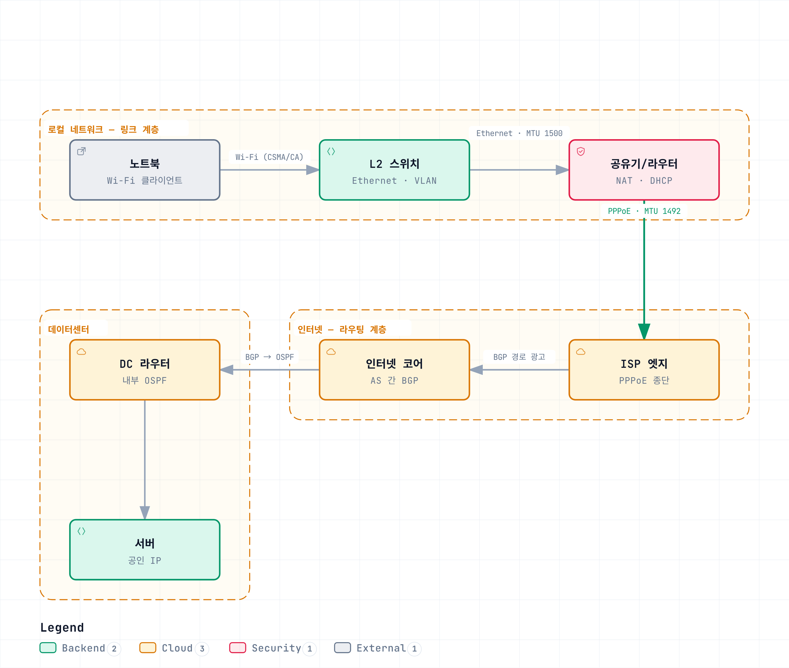

# 네트워크 기초 Part 1 — 계층 모델과 링크·라우팅 계층

> **마지막 업데이트**: 2026년 8월 28일

::: tip 4부작 시리즈입니다
**Part 1: 계층 모델과 링크·라우팅** *(현재 문서)* ·
[Part 2: 전송 계층과 TLS](./06-network-fundamentals-part2.md) ·
[Part 3: 애플리케이션 프로토콜](./06-network-fundamentals-part3.md) ·
[Part 4: 요청의 여정과 클라우드](./06-network-fundamentals-part4.md)
:::

브라우저에 주소를 입력하고 엔터를 누르는 순간, 최소 10개 이상의 프로토콜이 순서대로 동작합니다. 우리는 보통 그중 HTTP 하나만 의식하고 살지만, 장애가 터지는 지점은 대개 나머지 9개입니다.

이 글에서는 인터넷을 실제로 굴러가게 만드는 프로토콜 25개를 **계층 순서대로 아래에서 위로** 정리합니다. 계층을 아래에서부터 쌓는 이유는 단순합니다. 상위 계층은 하위 계층이 이미 동작한다고 가정하고 설계되어 있기 때문에, 위에서부터 읽으면 "그건 어떻게 되는 건데?"가 계속 남습니다.

각 항목은 **한 줄 정의 → 동작 방식 → 실무에서 걸리는 지점** 순으로 씁니다.

---

## 0. 계층 지도 한 장

| 계층 | 하는 일 | 이 글에서 다루는 프로토콜 |
|---|---|---|
| 애플리케이션 | 실제 서비스 의미론 | HTTP/3, WebSocket, WebRTC, gRPC, DNS, DoH, DHCP, MQTT, SSH, SMTP |
| 보안 | 암호화·인증 (전송 계층에 얹힘) | TLS |
| 전송 | 종단 간(end-to-end) 데이터 전달 | TCP, UDP, QUIC |
| 인터넷 / 라우팅 | 네트워크 간 경로 결정 | IPv4, IPv6, ICMP, BGP, OSPF, NAT |
| 링크 | 같은 물리 구간 내 전달 | Ethernet, Wi-Fi, VLAN, PPP, ARP |

계층 경계가 깔끔하게 지켜지지 않는 항목이 몇 개 있습니다. TLS는 전송과 애플리케이션 사이에 끼어 있고, QUIC은 UDP 위에 얹혀서 전송 계층 역할을 하며, ARP는 IP와 링크 사이를 잇습니다. NAT는 아예 프로토콜이라기보다 기능입니다. 이런 "예외"들이 실무 트러블슈팅의 대부분을 차지합니다.

---

[🔍 인터랙티브 다이어그램 보기](https://www.atomai.click/kubernetes-docs/archmaps/ko-basics-06-network-fundamentals-part1-0.html)

---

## 1. 링크 계층 — 같은 구간 안에서 옮기기

링크 계층의 관심사는 딱 하나입니다. **바로 옆에 붙어 있는 장비에게 어떻게 비트를 넘기는가.** 목적지가 지구 반대편이든 옆 서버든, 이 계층은 "다음 홉(next hop)"까지만 책임집니다.

### Ethernet

**정의:** 유선 로컬 네트워크에서 프레임을 실어 나르는 링크 계층 표준.

**동작:** 데이터를 프레임 단위로 감싸고, 앞에 목적지·출처 MAC 주소를 붙입니다. 스위치는 MAC 주소 테이블을 보고 해당 포트로만 프레임을 흘려보냅니다. 초기 이더넷은 충돌 감지(CSMA/CD)에 의존했지만, 현대의 스위치 기반 풀듀플렉스 환경에서는 충돌 자체가 거의 사라졌습니다.

**실무 포인트:** MTU가 여기서 결정됩니다. 기본 1500바이트, 점보 프레임은 9001바이트. 클라우드에서 VPN이나 오버레이 네트워크를 얹으면 캡슐화 헤더 때문에 실효 MTU가 줄어들고, 이때 발생하는 MTU 블랙홀은 "핑은 되는데 큰 응답만 멈춘다"는 형태로 나타납니다. 원인 파악이 유독 오래 걸리는 유형의 장애입니다.

**MTU와 MSS의 관계:** MTU가 링크 계층 프레임의 최대 크기(기본 1500)라면, MSS(Maximum Segment Size)는 그 안에서 IP 헤더 20바이트와 TCP 헤더 20바이트를 뺀 TCP 페이로드 상한(기본 1460)입니다. TCP는 핸드셰이크에서 MSS를 교환하므로, 터널 구간에서 MTU 문제가 반복될 때는 라우터에서 MSS 클램핑(TCP MSS를 강제로 낮추는 설정)으로 우회하는 방법이 널리 쓰입니다.

### Wi-Fi

**정의:** 무선 구간에서 LAN 프레임을 실어 나르는 링크 계층 표준(IEEE 802.11).

**동작:** 공기라는 공유 매체를 쓰기 때문에 이더넷과 근본적으로 다릅니다. 충돌을 "감지"할 수 없으므로 "회피"합니다(CSMA/CA). 프레임을 보내기 전에 채널이 비었는지 확인하고, 보낸 뒤에는 ACK를 기다립니다. 즉 링크 계층에 이미 재전송이 들어 있습니다.

**실무 포인트:** 링크 계층 재전송과 TCP 재전송이 겹치면서 지연 변동(jitter)이 커집니다. 실시간 통신 품질 문제가 "서버 탓"으로 보고되지만 실제로는 클라이언트의 무선 구간인 경우가 많습니다. 로그에서 이걸 구분하려면 서버 측 RTT 분포를 봐야 합니다.

### VLAN

**정의:** 하나의 물리 스위치를 논리적으로 여러 개의 L2 네트워크로 쪼개는 기술(IEEE 802.1Q).

**동작:** 이더넷 프레임에 4바이트 태그를 삽입해 VLAN ID를 표시합니다. 같은 VLAN끼리만 브로드캐스트가 도달하므로, 물리 배선을 바꾸지 않고 네트워크를 분리할 수 있습니다. VLAN 간 통신은 반드시 L3 장비(라우터 또는 L3 스위치)를 거쳐야 합니다.

**실무 포인트:** 국내 금융권의 망분리 구현에서 오래 쓰인 기본 도구입니다. 다만 VLAN은 논리 분리이지 물리 분리가 아니므로, 규제상 물리적 분리를 요구하는 구간에는 그대로 대응되지 않습니다. 클라우드로 넘어오면 이 역할은 VPC와 서브넷, 보안 그룹으로 대체됩니다.

> 📎 EKS의 VPC 구성은 [EKS 네트워킹 기초](../eks/03-eks-networking-part1.md) 참고.

### PPP

**정의:** 두 노드를 직접 연결하는 점대점 링크에서 패킷을 실어 나르는 프로토콜.

**동작:** 이더넷과 달리 주소 지정이 필요 없습니다. 링크 양 끝에 노드가 하나씩만 있으니까요. 대신 링크 수립·인증·상위 프로토콜 협상 절차(LCP/NCP)를 갖추고 있습니다.

**실무 포인트:** 다이얼업 시대의 유물처럼 보이지만, PPPoE 형태로 여전히 상당수의 가정용 인터넷 회선에서 살아 있습니다. 그리고 PPPoE 헤더 8바이트가 MTU를 1492로 깎아먹습니다. 앞서 말한 MTU 문제의 대표적 원인입니다.

### ARP

**정의:** IP 주소를 같은 네트워크 안의 MAC 주소로 변환하는 프로토콜.

**동작:** IP 계층은 "10.0.1.5로 보내라"고 지시하지만, 이더넷은 MAC 주소만 이해합니다. 그래서 호스트는 브로드캐스트로 "10.0.1.5의 MAC 주소를 가진 분?"이라고 묻고, 해당 호스트가 응답합니다. 결과는 ARP 캐시에 수 분간 저장됩니다.

**실무 포인트:** ARP는 인증이 없습니다. 아무나 "그 IP는 제 겁니다"라고 응답할 수 있어서 ARP 스푸핑이 성립합니다. 반대로 이 성질을 이용하는 정상 기법도 있습니다. 페일오버 시 새 액티브 노드가 Gratuitous ARP를 뿌려 스위치의 MAC 테이블을 갱신하는 방식이 대표적입니다. VIP 기반 HA 구성에서 전환이 느릴 때는 이 갱신이 지연되는 경우를 의심해볼 수 있습니다.

> 📎 Cilium이 eBPF로 이 계층을 어떻게 대체하는지는 [Cilium 네트워킹](../networking/cilium/03-networking.md) 참고.

---

## 2. 인터넷·라우팅 계층 — 네트워크를 건너가기

링크 계층이 "옆집까지"라면, 이 계층은 "지구 반대편까지"를 담당합니다. 핵심 질문은 **어디로 보낼 것인가**입니다.

### IPv4

**정의:** 32비트 주소 체계 기반의 인터넷 계층 프로토콜.

**동작:** 각 패킷에 출발지·목적지 IP를 붙이고, 라우터는 라우팅 테이블에서 가장 구체적인(longest prefix match) 경로를 찾아 다음 홉으로 넘깁니다. 배달을 보장하지 않는 최선 노력(best-effort) 방식이며, 순서 보장도 없습니다. 그 보장은 위층(TCP)의 일입니다.

**실무 포인트:** 주소 공간이 약 43억 개로 이미 고갈됐습니다. 그래서 NAT가 사실상 필수가 됐고, 사설 주소 대역(10.0.0.0/8, 172.16.0.0/12, 192.168.0.0/16)이 내부망 표준이 됐습니다. 대규모 조직에서 클라우드 마이그레이션할 때 가장 먼저 부딪히는 문제가 이 사설 대역의 중복입니다. 온프레미스와 VPC의 CIDR이 겹치면 VPN이든 Direct Connect든 라우팅이 성립하지 않습니다. IP 주소 설계는 프로젝트 시작 시점에 확정해야 하는 항목입니다.

### IPv6

**정의:** 128비트 주소 체계의 차세대 인터넷 계층 프로토콜.

**동작:** 주소가 128비트로 늘어나 고갈 문제가 사라집니다. 헤더가 단순해져 라우터 처리 부담이 줄고, 라우터에서의 단편화가 폐지됐습니다. SLAAC를 통해 DHCP 없이도 주소를 자동 설정할 수 있고, ARP는 NDP(Neighbor Discovery Protocol)로 대체됩니다.

**실무 포인트:** IPv4와 하위 호환되지 않습니다. 그래서 현실에서는 듀얼 스택으로 운영하며, 이는 방화벽 규칙과 보안 정책을 두 벌 관리해야 한다는 뜻입니다. IPv6 경로에 대한 규칙 누락은 흔한 보안 공백입니다. 클라우드 환경에서는 IPv6가 NAT 없이 동작하기 때문에 "인터넷에서 직접 도달 가능"이 기본값이 되는 점도 주의해야 합니다.

**전환 메커니즘:** IPv4와 공존하는 현실적 방법은 세 갈래입니다. **듀얼 스택**(두 프로토콜을 나란히 운영 — 가장 흔하지만 정책 이중화 비용), **터널링**(IPv6 패킷을 IPv4로 감싸 통과), 그리고 **NAT64/DNS64**(IPv6 전용 클라이언트가 IPv4 서버에 접근하도록 변환 — 모바일 통신망이 464XLAT 형태로 대규모로 사용). 쿠버네티스도 듀얼 스택 Service를 지원하므로, 클러스터 CIDR 설계 시 IPv6 대역을 함께 고려할 수 있습니다.

### ICMP

**정의:** 네트워크 오류와 상태를 보고하는 제어 프로토콜.

**동작:** 데이터를 전달하지 않고 제어 메시지만 주고받습니다. 목적지 도달 불가, TTL 초과, 단편화 필요 등을 알립니다. ping은 Echo Request/Reply를, traceroute는 TTL을 1씩 늘려가며 돌아오는 Time Exceeded를 이용합니다.

**실무 포인트:** "보안상" ICMP를 전면 차단하는 정책이 흔한데, 이게 앞서 언급한 MTU 블랙홀의 직접적 원인입니다. Path MTU Discovery는 ICMP Fragmentation Needed 메시지에 의존하기 때문에, 이걸 막으면 경로 MTU를 알아낼 방법이 없어집니다. 최소한 Type 3 Code 4는 통과시켜야 합니다.

> 📎 EKS에서 이 문제가 실제로 나타나는 형태는 [EKS 네트워킹 심화](../eks/03-eks-networking-part3.md) 참고.

### OSPF

**정의:** 하나의 자율 시스템 내부에서 최적 경로를 계산하는 링크 상태 라우팅 프로토콜.

**동작:** 각 라우터가 자신의 링크 상태를 영역 전체에 전파하고, 모든 라우터가 동일한 토폴로지 데이터베이스를 갖습니다. 그 위에서 다익스트라 알고리즘으로 최단 경로를 계산합니다. 대역폭 기반 코스트를 쓰며, 규모 확장을 위해 영역(Area)으로 나눕니다.

**실무 포인트:** 내부망(IGP)용입니다. 수렴이 빠르고 자동으로 최적 경로를 찾지만, 라우터마다 전체 토폴로지를 유지해야 하므로 대규모에서는 영역 설계가 성능을 좌우합니다.

### BGP

**정의:** 자율 시스템(AS) 간에 경로 정보를 교환하는 경로 벡터 라우팅 프로토콜.

**동작:** OSPF와 목적이 다릅니다. "가장 빠른 길"이 아니라 "정책적으로 원하는 길"을 고릅니다. 각 AS는 자신이 도달 가능한 프리픽스와 AS 경로를 이웃에게 광고하고, 수신 측은 AS_PATH 길이, Local Preference, MED 등의 속성으로 우선순위를 결정합니다. 인터넷 전체의 라우팅이 이 위에서 성립합니다.

**실무 포인트:** BGP는 광고를 기본적으로 신뢰합니다. 그래서 잘못된 프리픽스 광고 하나가 대륙 단위 장애로 번지는 사고가 반복적으로 발생했습니다. RPKI 기반 경로 검증이 대응책으로 확산되고 있습니다. 클라우드 관점에서는 Direct Connect나 Site-to-Site VPN이 BGP로 경로를 교환하므로, AS 번호와 광고 프리픽스 설계, 그리고 이중화 시 경로 우선순위 조정(AS_PATH prepending 등)이 실제 설계 항목으로 들어옵니다.

> 📎 Calico가 BGP를 클러스터 내부에서 어떻게 쓰는지는 [Calico BGP 심화](../networking/calico/04-bgp-deep-dive.md) 참고.

### NAT

**정의:** 패킷의 IP 주소와 포트를 변환하는 네트워크 기능.

**동작:** 사설 IP를 공인 IP로 바꿔주면서, 여러 내부 호스트가 하나의 공인 IP를 공유하게 합니다(PAT/NAPT). 변환 테이블에 세션별 매핑을 유지해 응답 패킷을 올바른 내부 호스트로 되돌립니다.

**실무 포인트:** 계층 모델을 위반하는 대표적 존재입니다. L3 장비인데 L4 포트를 건드리고, 종단 간 연결성이라는 인터넷의 원래 전제를 깨뜨립니다. 그 결과 P2P 통신이 어려워지고, STUN/TURN 같은 우회 기법이 필요해집니다(뒤의 WebRTC 참고). 클라우드에서는 NAT Gateway의 포트 고갈과 데이터 처리 비용이 실무 이슈입니다. 아웃바운드 트래픽이 많은 워크로드라면 VPC 엔드포인트로 NAT를 우회하는 설계가 비용 면에서 유의미한 차이를 만듭니다.

---

**다음:** [Part 2: 전송 계층과 TLS](./06-network-fundamentals-part2.md)
