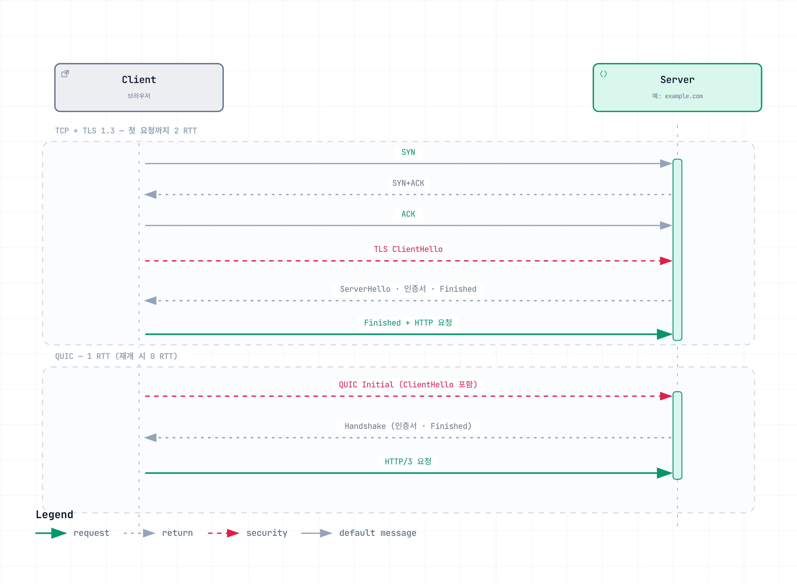

# 네트워크 기초 Part 2 — 전송 계층과 TLS

> **마지막 업데이트**: 2026년 8월 28일

::: tip 4부작 시리즈입니다
[Part 1: 계층 모델과 링크·라우팅](./06-network-fundamentals-part1.md) ·
**Part 2: 전송 계층과 TLS** *(현재 문서)* ·
[Part 3: 애플리케이션 프로토콜](./06-network-fundamentals-part3.md) ·
[Part 4: 요청의 여정과 클라우드](./06-network-fundamentals-part4.md)
:::

Part 1이 패킷을 목적지 호스트까지 보냈다면, 이 파트는 그 위에서 **신뢰성 있는 대화**를 만드는 TCP·UDP·QUIC과, 그 대화를 암호화하는 TLS를 다룹니다.

먼저 이 파트의 핵심을 그림 하나로 요약하면 이렇습니다.

[🔍 인터랙티브 다이어그램 보기](https://www.atomai.click/kubernetes-docs/archmaps/ko-basics-06-network-fundamentals-part2-0.html)

---

## 3. 전송 계층 — 종단 간 전달

여기서부터는 "네트워크"가 아니라 "프로세스"가 대화 상대입니다. 포트 번호가 등장하는 이유입니다.

### TCP

**정의:** 신뢰성 있는 순차적 바이트 스트림을 제공하는 연결 지향 전송 프로토콜.

**동작:** 3-way 핸드셰이크(SYN → SYN+ACK → ACK)로 연결을 수립합니다. 시퀀스 번호로 순서를 보장하고, ACK와 재전송으로 손실을 복구하며, 슬라이딩 윈도우로 흐름을 제어하고, 혼잡 제어 알고리즘으로 네트워크 부하에 적응합니다. 애플리케이션에게는 "빈틈없이 이어지는 바이트 흐름"이라는 깔끔한 추상화를 제공합니다.

**실무 포인트:** 그 추상화의 대가가 **HOL(Head-of-Line) 블로킹**입니다. 순서를 보장한다는 건, 앞의 세그먼트가 손실되면 뒤에 도착한 데이터를 이미 받았어도 애플리케이션에 올려줄 수 없다는 뜻입니다. HTTP/2가 하나의 TCP 연결에서 여러 스트림을 다중화했을 때, 패킷 하나의 손실이 모든 스트림을 멈추게 만든 원인이 바로 이것입니다. QUIC이 등장한 직접적 배경입니다.

핸드셰이크 비용도 무시할 수 없습니다. 연결마다 1 RTT, TLS까지 얹으면 추가 1~2 RTT입니다. 지연이 큰 경로에서는 연결 재사용과 커넥션 풀 설정이 성능을 좌우합니다.

**혼잡 제어의 계보:** 어떤 혼잡 제어 알고리즘을 쓰는지가 처리량을 좌우합니다. 고전 **Reno**는 손실을 신호로 창을 절반으로 줄이는 방식이고, 리눅스 기본값인 **CUBIC**은 같은 손실 기반이지만 대역폭이 큰 경로에서 더 빨리 회복합니다. Google이 설계한 **BBR**은 손실 대신 대역폭과 RTT를 직접 모델링해서, 약간의 손실이 상존하는 장거리·모바일 경로에서 손실 기반 알고리즘보다 훨씬 높은 처리량을 냅니다. `sysctl net.ipv4.tcp_congestion_control`로 확인·변경할 수 있습니다.

**TIME_WAIT와 포트 고갈:** 연결을 먼저 닫은 쪽은 TIME_WAIT 상태로 일정 시간 소켓을 붙잡습니다. 프록시나 로드밸런서처럼 짧은 연결을 대량으로 만드는 장비에서는 이 소켓들이 로컬 포트를 소진시켜 "연결이 안 된다"는 장애로 나타납니다. 연결 재사용(keep-alive)이 첫 번째 처방이고, 커널 파라미터 조정은 그다음입니다.

### UDP

**정의:** 연결 설정 없이 데이터그램을 보내는 최소 기능 전송 프로토콜.

**동작:** 헤더 8바이트에 출발지 포트, 목적지 포트, 길이, 체크섬만 있습니다. 핸드셰이크 없음, 재전송 없음, 순서 보장 없음, 혼잡 제어 없음. "IP에 포트 번호만 붙인 것"에 가깝습니다.

**실무 포인트:** 기능이 없는 게 단점이 아니라 선택입니다. 실시간 음성·영상은 "늦게 도착한 정확한 프레임"보다 "제때 도착한 불완전한 프레임"이 낫습니다. DNS 질의처럼 단발성 요청도 핸드셰이크 비용이 아깝습니다. 그리고 필요한 신뢰성은 애플리케이션이 직접 구현하면 됩니다. QUIC이 정확히 그 길을 갔습니다.

주의할 점은 상태가 없어서 스푸핑과 증폭 공격에 쓰이기 쉽다는 것입니다. UDP 기반 서비스를 외부에 노출할 때는 응답 크기 제한과 요청량 제어를 함께 고려해야 합니다.

### QUIC

**정의:** UDP 위에 구현된, 보안이 내장된 다중화 전송 프로토콜.

**동작:** TCP+TLS가 하던 일을 UDP 위에서 처음부터 다시 설계했습니다. 핵심 특징 네 가지입니다.

1. **스트림별 독립 전달** — 하나의 연결 안에 여러 스트림이 있고, 각 스트림이 독립적으로 손실을 복구합니다. TCP의 HOL 블로킹이 구조적으로 사라집니다.
2. **암호화 내장** — TLS 1.3이 프로토콜의 일부입니다. 별도 협상 단계가 없어 연결 수립이 1 RTT, 재접속 시 0 RTT로 끝납니다.
3. **연결 ID** — IP나 포트가 바뀌어도 연결이 유지됩니다. Wi-Fi에서 셀룰러로 전환할 때 세션이 끊기지 않습니다.
4. **사용자 공간 구현** — 커널이 아니라 애플리케이션 레벨이므로, 혼잡 제어 알고리즘 개선을 OS 업데이트 없이 배포할 수 있습니다.

**실무 포인트:** UDP 443을 막아둔 방화벽에서는 QUIC이 동작하지 않고 TCP로 폴백합니다. 국내 금융권처럼 UDP 정책이 엄격한 환경에서는 HTTP/3의 이점을 실제로 못 받는 경우가 많으니, "HTTP/3 활성화했는데 왜 빠르지 않은가"를 볼 때 먼저 확인할 지점입니다. 또한 사용자 공간 처리라 CPU 사용량이 커널 TCP보다 높습니다.

한 가지 보안 주의점: **0-RTT 재개 데이터는 재생(replay) 공격이 가능합니다.** 네트워크 중간자가 0-RTT 패킷을 복사해 다시 보내면 서버가 같은 요청을 두 번 처리할 수 있습니다. 그래서 0-RTT로는 멱등 요청(GET 등)만 보내는 것이 원칙이고, 서버·CDN 설정에서도 0-RTT 허용 범위를 명시적으로 제한해야 합니다.

---

## 4. 보안 — TLS

### TLS

**정의:** 전송 구간의 기밀성, 무결성, 인증을 제공하는 프로토콜.

**동작:** 핸드셰이크와 레코드 단계로 나뉩니다. 핸드셰이크에서 암호 스위트를 협상하고, 인증서로 서버 신원을 검증하고, 키 교환으로 세션 키를 만듭니다. 이후 레코드 단계에서 그 세션 키로 데이터를 암호화하고 MAC으로 무결성을 검증합니다.

TLS 1.3은 이전 버전에서 크게 정리됐습니다. 핸드셰이크가 1 RTT로 줄고(세션 재개 시 0 RTT), RSA 키 교환과 취약한 암호 스위트가 제거돼 전방 비밀성(forward secrecy)이 사실상 필수가 됐습니다.

**실무 포인트:** 세 가지가 반복적으로 문제가 됩니다.

- **인증서 만료** — 여전히 장애 원인 상위권입니다. 자동 갱신과 만료 모니터링을 분리해서 갖춰야 합니다.
- **SNI 노출** — TLS 1.3에서도 접속 도메인은 평문으로 나갑니다. ECH가 이를 가리려는 시도인데, 역설적으로 트래픽 가시성을 요구하는 규제 환경과 충돌합니다.
- **종료 지점 설계** — 로드밸런서에서 TLS를 끊고 뒤는 평문으로 갈 것인가, 종단까지 암호화할 것인가. 국내 금융권에서는 내부 구간 암호화까지 요구되는 경우가 있어 mTLS나 서비스 메시(Istio 등)로 처리하는 패턴이 늘고 있습니다.

**인증서 체인과 OCSP 스테이플링:** 서버 인증서는 단독으로 검증되지 않고 중간 CA → 루트 CA로 이어지는 체인으로 검증됩니다. 배포 시 중간 인증서를 빠뜨리면 일부 클라이언트에서만 실패하는 까다로운 장애가 됩니다. 폐기 확인도 실무 포인트입니다. 클라이언트가 CA에 매번 묻는 대신, 서버가 서명된 폐기 상태 증명을 미리 받아 핸드셰이크에 끼워 보내는 **OCSP 스테이플링**이 지연과 프라이버시 면에서 표준적인 선택입니다.

> 📎 Istio가 이를 자동화하는 방식은 [Istio mTLS](../service-mesh/istio/security/01-mtls.md) 참고.

---

**다음:** [Part 3: 애플리케이션 프로토콜](./06-network-fundamentals-part3.md)
