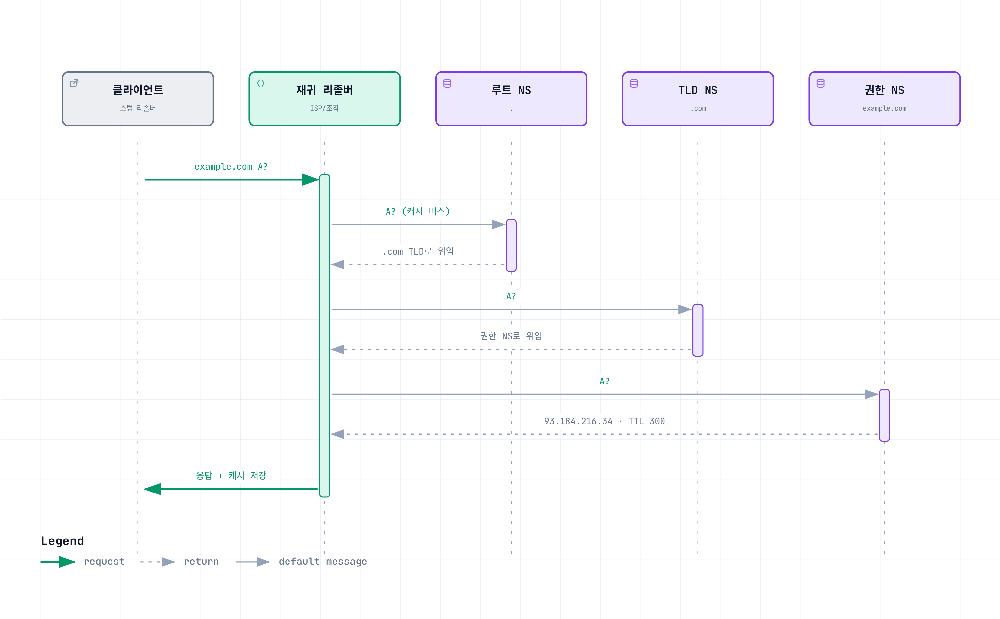

# 네트워크 기초 Part 3 — 애플리케이션 프로토콜 10종

> **마지막 업데이트**: 2026년 8월 28일

::: tip 4부작 시리즈입니다
[Part 1: 계층 모델과 링크·라우팅](./06-network-fundamentals-part1.md) ·
[Part 2: 전송 계층과 TLS](./06-network-fundamentals-part2.md) ·
**Part 3: 애플리케이션 프로토콜** *(현재 문서)* ·
[Part 4: 요청의 여정과 클라우드](./06-network-fundamentals-part4.md)
:::

전송 계층이 "믿을 수 있는 파이프"를 만들었으니, 이제 그 파이프로 **실제 서비스**가 오갑니다. 이 파트는 이름 해석(DNS·DoH), 부트스트랩(DHCP), 운영 접속(SSH), 메일(SMTP), 그리고 웹의 현재를 이루는 HTTP/3·WebSocket·WebRTC·gRPC·MQTT를 다룹니다.

---

## 5. 애플리케이션 계층 — 실제 서비스

### DNS

**정의:** 도메인 이름을 IP 주소 등의 레코드로 변환하는 분산 디렉터리 시스템.

**동작:** 계층적 위임 구조입니다. 리졸버가 루트 → TLD → 권한 있는 네임서버 순으로 물어 내려가고, 각 단계 결과를 TTL 동안 캐시합니다. 레코드 타입에 따라 용도가 다릅니다. A/AAAA는 IP, CNAME은 별칭, MX는 메일 서버, TXT는 검증 문자열입니다.

**실무 포인트:** DNS는 인터넷의 단일 실패 지점에 가깝습니다. 대규모 장애의 상당수가 DNS에서 시작합니다. 실무에서 특히 중요한 건 **TTL과 캐시**입니다. 페일오버를 DNS로 하겠다고 계획했다면, TTL을 짧게 잡아도 클라이언트나 중간 리졸버가 이를 존중하지 않는 경우가 있어 전환이 기대보다 훨씬 오래 걸립니다. 빠른 전환이 필요하면 DNS보다 앞단의 애니캐스트나 로드밸런서 레벨에서 처리하는 게 맞습니다.

**자주 쓰는 레코드 타입 한눈에:**

| 타입 | 용도 | 실무 메모 |
|---|---|---|
| A / AAAA | 도메인 → IPv4 / IPv6 | 가장 기본 |
| CNAME | 별칭 → 정식 이름 | 루트(apex) 도메인에는 불가 → ALIAS/ANAME 또는 Route 53 Alias |
| MX | 메일 수신 서버 | 우선순위 숫자가 낮을수록 먼저 |
| TXT | 임의 문자열 | SPF/DKIM/DMARC, 도메인 소유 검증 |
| NS | 위임 네임서버 | 하위 존 위임 |
| SRV | 서비스 위치(호스트+포트) | 일부 프로토콜의 디스커버리 |
| CAA | 인증서 발급 허용 CA 제한 | 잘못된 CA 발급 방지 |

**DNSSEC과 DoH는 다른 문제를 풉니다.** DNSSEC은 응답이 위조되지 않았음을 서명으로 검증(무결성)하고, DoH는 질의 내용을 암호화(기밀성)합니다. DNSSEC은 응답을 숨기지 않고, DoH는 위조를 막지 않습니다 — 함께 쓸 수 있는 보완 관계입니다.

[🔍 인터랙티브 다이어그램 보기](https://www.atomai.click/kubernetes-docs/archmaps/ko-basics-06-network-fundamentals-part3-0.html)

### DoH

**정의:** DNS 질의를 HTTPS로 감싸 전송하는 방식.

**동작:** 전통적 DNS는 UDP 53으로 평문 전송됩니다. 누가 어떤 사이트를 찾는지 경로상에서 그대로 보입니다. DoH는 이를 HTTPS 요청으로 바꿔 암호화하고, 일반 웹 트래픽과 구분되지 않게 만듭니다.

**실무 포인트:** 프라이버시 개선인 동시에 관리 측면에서는 골칫거리입니다. 기업 네트워크에서 DNS 기반 필터링과 로깅이 무력화되기 때문입니다. 브라우저가 자체 DoH 리졸버를 쓰면 조직의 내부 DNS를 우회해 내부 도메인 해석이 깨지기도 합니다. 규제 대상 환경에서는 브라우저 정책으로 DoH를 통제하고 조직 리졸버를 강제하는 설정이 보통 함께 갑니다.

### DHCP

**정의:** 호스트에게 IP 주소와 네트워크 설정을 자동으로 할당하는 프로토콜.

**동작:** DORA 4단계입니다. Discover(클라이언트 브로드캐스트) → Offer(서버 제안) → Request(클라이언트 선택) → Acknowledge(서버 확정). IP뿐 아니라 서브넷 마스크, 기본 게이트웨이, DNS 서버 주소까지 함께 내려줍니다. 할당에는 임대 기간이 있고, 만료 전에 갱신합니다.

**실무 포인트:** 클라우드에서는 대부분 추상화되어 보이지 않지만, VPC의 DHCP 옵션 세트로 DNS 서버와 도메인 네임을 지정하는 지점에서 다시 만납니다. 온프레미스 DNS를 쓰는 하이브리드 구성에서 이름 해석이 안 될 때 확인해야 하는 설정입니다.

### SSH

**정의:** 암호화된 원격 셸 접속과 터널링을 제공하는 프로토콜.

**동작:** 서버 호스트 키로 서버를 인증하고, 키 교환으로 세션 키를 만든 뒤 사용자를 인증합니다(공개키 또는 비밀번호). 이후 모든 트래픽이 암호화됩니다. 원격 셸 외에 포트 포워딩, SFTP, 에이전트 포워딩까지 지원합니다.

**실무 포인트:** 편리한 터널링 기능이 그대로 보안 구멍이 됩니다. 로컬/리모트 포워딩으로 방화벽을 우회할 수 있고, 에이전트 포워딩은 중간 서버가 침해됐을 때 키를 노출시킵니다. 그리고 SSH 키는 만료가 없어서 퇴사자 키가 몇 년간 살아 있는 사고가 반복됩니다.

이런 이유로 클라우드에서는 SSH 자체를 없애는 방향으로 갑니다. 세션 매니저나 IAM 기반 접속으로 대체하면 22번 포트를 열지 않고, 키를 배포하지 않으며, 접속 기록이 감사 로그로 남습니다. 감사 요구가 강한 환경에서는 이 차이가 큽니다.

### SMTP

**정의:** 메일 서버 간에 메시지를 전달하는 프로토콜.

**동작:** 발신 클라이언트가 서버에 메시지를 제출하고, 서버들이 MX 레코드를 조회해 릴레이하며 목적지까지 전달합니다. 수신은 SMTP가 아니라 IMAP/POP3의 영역입니다.

**실무 포인트:** 원래 설계에 인증이 없었습니다. 그래서 발신자 위조가 자유롭고, 스팸과 피싱의 기반이 됐습니다. 오늘날 실무의 핵심은 SMTP 자체가 아니라 그 위에 얹힌 **인증 체계 3종**입니다.

- **SPF** — 이 도메인의 메일을 보낼 수 있는 IP 목록을 DNS에 게시
- **DKIM** — 메시지에 도메인 키로 서명해 위조와 변조를 탐지
- **DMARC** — SPF/DKIM 실패 시 처리 정책과 리포팅 방식을 선언

세 개를 다 설정하지 않으면 전달률이 떨어지고, 도메인이 사칭에 쓰이는 것을 막을 수 없습니다.

### HTTP/3

**정의:** QUIC 위에서 동작하는 HTTP의 세 번째 메이저 버전.

**동작:** 의미론(메서드, 상태 코드, 헤더)은 HTTP/2와 사실상 같고, 전송 계층만 TCP+TLS에서 QUIC으로 교체됐습니다. 이 교체로 얻는 것이 앞서 QUIC에서 본 그대로입니다. 스트림별 독립 전달로 HOL 블로킹 해소, 1 RTT 연결 수립, 네트워크 전환 시 연결 유지. 헤더 압축은 HPACK에서 QPACK으로 바뀌었습니다(순서 없는 전달에 대응하기 위해).

**실무 포인트:** 클라이언트가 HTTP/3를 어떻게 아는가 하는 문제가 있습니다. 서버가 `Alt-Svc` 헤더로 알리는 방식이 기본이라, 첫 접속은 대개 TCP로 이뤄지고 이후 승격됩니다. HTTPS DNS 레코드를 쓰면 이 왕복을 줄일 수 있습니다.

효과가 가장 큰 조건은 **손실률이 있고 지연이 큰 모바일 네트워크**입니다. 반대로 데이터센터 내부처럼 손실이 거의 없고 RTT가 짧은 구간에서는 개선 폭이 작고, CPU 오버헤드 때문에 오히려 불리할 수 있습니다. 도입 판단은 실제 사용자 네트워크 프로파일을 보고 해야 합니다.

**세 세대 비교로 보는 진화 방향:**

| | HTTP/1.1 | HTTP/2 | HTTP/3 |
|---|---|---|---|
| 전송 | TCP | TCP | QUIC (UDP) |
| 연결당 요청 | 1개씩 순차(파이프라이닝 사실상 미사용) | 다중화 | 다중화 |
| HOL 블로킹 | 애플리케이션 레벨 | TCP 레벨에 잔존 | 구조적으로 해소 |
| 헤더 압축 | 없음 | HPACK | QPACK |
| 암호화 | 선택(HTTPS) | 사실상 필수 | 프로토콜에 내장 |

방향은 일관됩니다. 병렬성은 올리고, 블로킹은 아래 계층으로 밀어내다가 결국 전송 계층 자체를 교체했습니다.

### WebSocket

**정의:** 하나의 연결에서 양방향 메시지를 주고받는 애플리케이션 프로토콜.

**동작:** HTTP 요청으로 시작해 `Upgrade` 헤더로 프로토콜을 전환합니다. 전환 후에는 HTTP 요청-응답 모델을 벗어나 서버와 클라이언트가 대칭적으로 프레임을 보낼 수 있습니다. 서버 푸시를 위해 폴링할 필요가 없어집니다.

**실무 포인트:** 상태를 갖는 장기 연결이라는 점이 운영상 모든 어려움의 근원입니다. 로드밸런서의 유휴 타임아웃에 걸려 끊기고(핑/퐁 프레임으로 유지해야 함), 배포 때 연결이 한꺼번에 끊겨 재연결 폭풍이 발생하고(지터를 넣은 지수 백오프 필요), 스케일 아웃 시 인스턴스별 연결 상태를 공유해야 합니다(Redis Pub/Sub 등). 프록시나 방화벽이 Upgrade를 제대로 통과시키는지도 확인 대상입니다.

### WebRTC

**정의:** 브라우저 간에 실시간 미디어와 데이터를 P2P로 주고받는 프레임워크.

**동작:** 여기서 앞서 본 NAT 문제가 정면으로 등장합니다. 양쪽이 모두 NAT 뒤에 있으면 서로에게 직접 연결할 수 없습니다. 그래서 ICE 프레임워크가 후보 경로를 수집합니다. STUN 서버로 자신의 공인 IP·포트를 알아내고, 그것으로 홀 펀칭을 시도하며, 그래도 안 되면 TURN 서버로 트래픽을 중계합니다. 미디어는 SRTP로, 데이터 채널은 SCTP over DTLS로 전송됩니다.

**실무 포인트:** TURN 중계 비율이 비용을 결정합니다. P2P가 성립하면 서버 비용이 거의 안 들지만, 대칭형 NAT 환경에서는 중계가 불가피하고 그때 대역폭 비용이 발생합니다. 엄격한 방화벽 정책이 많은 기업 환경에서 이 비율이 높게 나옵니다. 참여자가 많은 회의라면 P2P 메시가 아니라 SFU를 쓰는 게 정석입니다.

### gRPC

**정의:** HTTP/2 위에서 동작하는 스키마 기반 RPC 프레임워크.

**동작:** Protocol Buffers로 서비스와 메시지를 정의하면 클라이언트·서버 코드가 생성됩니다. 바이너리 직렬화라 JSON보다 작고 빠르며, HTTP/2 다중화 위에서 단방향 요청뿐 아니라 서버 스트리밍, 클라이언트 스트리밍, 양방향 스트리밍을 지원합니다.

**실무 포인트:** 마이크로서비스 간 내부 통신에 잘 맞고, 외부 공개 API로는 덜 맞습니다. 브라우저에서 직접 호출이 안 돼 gRPC-Web과 프록시가 필요하고, 사람이 읽을 수 없어 디버깅이 번거롭습니다.

로드밸런싱이 특히 함정입니다. gRPC는 하나의 TCP 연결을 오래 유지하며 그 위에서 요청을 다중화하기 때문에, L4 로드밸런서를 쓰면 연결 단위로만 분산되어 특정 백엔드에 트래픽이 몰립니다. L7 로드밸런싱이나 클라이언트 사이드 로드밸런싱, 또는 서비스 메시가 필요합니다. 스키마 진화 규칙(필드 번호 재사용 금지 등)을 지키지 않으면 배포 순서에 따라 호환성이 깨지는 것도 주의할 점입니다.

> 📎 Istio에서의 gRPC 처리는 [Istio gRPC 고급](../service-mesh/istio/advanced/05-grpc.md) 참고.

### MQTT

**정의:** 발행-구독 모델의 경량 메시징 프로토콜.

**동작:** 클라이언트가 브로커에 연결해 토픽으로 메시지를 발행하거나 구독합니다. 발행자와 구독자는 서로를 알 필요가 없습니다. 헤더가 최소 2바이트로 매우 작고, QoS 세 단계(최대 1회 / 최소 1회 / 정확히 1회)를 제공하며, 클라이언트가 사라졌을 때 대신 알려주는 Last Will 기능이 있습니다.

**실무 포인트:** 대역폭이 좁고 연결이 불안정하며 전력이 제한된 환경, 즉 IoT를 겨냥해 설계됐습니다. QoS 레벨 선택이 곧 비용과 복잡도의 트레이드오프입니다. QoS 2는 4-way 핸드셰이크가 필요해 오버헤드가 크므로, 대개 QoS 1에 애플리케이션 레벨 멱등성 처리를 붙이는 편이 실용적입니다. 브로커가 단일 실패 지점이 되지 않도록 클러스터링을 고려해야 하고, 디바이스 인증은 TLS 클라이언트 인증서 기반이 권장됩니다.

---

**다음:** [Part 4: 요청의 여정과 클라우드](./06-network-fundamentals-part4.md)
