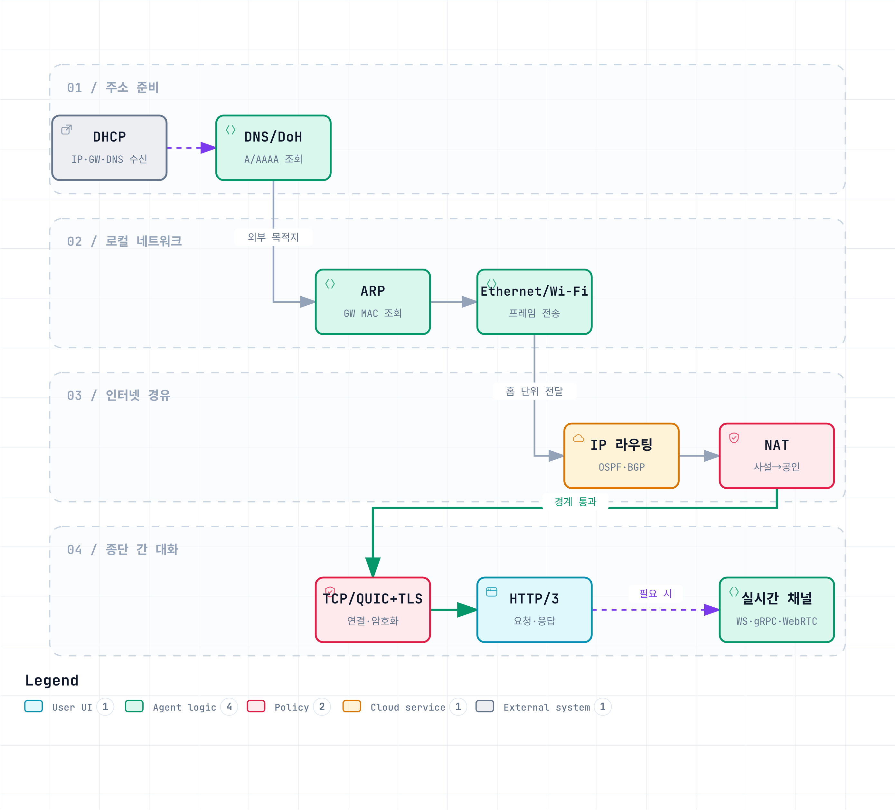

# 네트워크 기초 Part 4 — 요청의 여정과 클라우드 매핑

> **마지막 업데이트**: 2026년 8월 28일

::: tip 4부작 시리즈입니다
[Part 1: 계층 모델과 링크·라우팅](./06-network-fundamentals-part1.md) ·
[Part 2: 전송 계층과 TLS](./06-network-fundamentals-part2.md) ·
[Part 3: 애플리케이션 프로토콜](./06-network-fundamentals-part3.md) ·
**Part 4: 요청의 여정과 클라우드** *(현재 문서)*
:::

지금까지 본 25개 조각이 실제로 어떻게 맞물리는지 하나의 요청으로 종합하고, 이 개념들이 클라우드와 쿠버네티스에서 어떤 이름으로 다시 나타나는지 매핑합니다.

[🔍 인터랙티브 다이어그램 보기](https://www.atomai.click/kubernetes-docs/archmaps/ko-basics-06-network-fundamentals-part4-0.html)

---

## 6. 하나의 요청을 끝까지 따라가기

지금까지 본 조각들이 실제로 어떻게 맞물리는지, `https://example.com` 접속을 예로 순서대로 정리하면 이렇습니다.

1. **DHCP** — 부팅 시 IP, 게이트웨이, DNS 서버 주소를 받아둡니다.
2. **DNS (또는 DoH)** — `example.com`의 A/AAAA 레코드를 조회합니다. 캐시가 없으면 루트부터 내려갑니다.
3. **ARP** — 목적지가 외부이므로 기본 게이트웨이의 MAC 주소를 알아냅니다.
4. **Ethernet / Wi-Fi** — 프레임에 담아 게이트웨이로 보냅니다.
5. **IP + BGP/OSPF** — 라우터들이 각자의 라우팅 테이블(내부는 OSPF, 외부는 BGP로 학습한)을 보고 홉을 이어갑니다.
6. **NAT** — 경계에서 사설 IP가 공인 IP로 변환됩니다.
7. **TCP 또는 QUIC** — 종단 간 전송 연결을 수립합니다.
8. **TLS** — 인증서를 검증하고 세션 키를 만듭니다. QUIC이면 7번과 통합됩니다.
9. **HTTP/3** — 요청을 보내고 응답을 받습니다.
10. **WebSocket / gRPC / WebRTC** — 페이지가 실시간 기능을 쓰면 여기서 추가 연결이 열립니다.

그리고 이 과정 어디서든 문제가 생기면 **ICMP**가 알려줍니다. 알려줄 수 있게 열어두었다면 말이죠.

---

## 7. 클라우드에서 이 개념들은 어디로 가는가

온프레미스 네트워크 지식이 클라우드에서 쓸모없어지는 게 아니라, 이름만 바뀌어 그대로 남습니다. AWS 기준으로 대응 관계를 정리하면 다음과 같습니다.

| 전통적 개념 | AWS에서의 대응 |
|---|---|
| VLAN / 서브넷 분리 | VPC, 서브넷, 보안 그룹, NACL |
| 라우팅 테이블 | VPC 라우트 테이블, Transit Gateway |
| BGP 피어링 | Direct Connect, Site-to-Site VPN |
| NAT 장비 | NAT Gateway, VPC 엔드포인트(우회) |
| DNS 서버 | Route 53, Resolver 엔드포인트 |
| DHCP | VPC DHCP 옵션 세트 |
| TLS 종료 | ALB/NLB, ACM, CloudFront |
| L7 로드밸런싱 | ALB, App Mesh, Istio |
| SSH 접속 | Systems Manager Session Manager |
| 내부 구간 암호화 | 서비스 메시 mTLS |

**설계 시 먼저 결정해야 하는 항목 세 가지**를 꼽자면 이렇습니다.

1. **IP 주소 계획** — 온프레미스와 겹치지 않는 CIDR을 조직 차원에서 확정해야 합니다. 나중에 바꾸는 비용이 가장 큰 항목입니다.
2. **아웃바운드 경로** — NAT Gateway를 거칠 것인가, VPC 엔드포인트로 우회할 것인가. 트래픽량이 크면 비용 차이가 상당합니다.
3. **암호화 종료 지점** — 어디서 TLS를 끊을 것인가. 규제 요구사항과 직결됩니다.

---

## 8. 쿠버네티스에서는 누가 이 일을 하는가

클러스터 안에서도 같은 개념이 컴포넌트 이름만 바꿔 반복됩니다. 이 표가 이 시리즈와 이후 심화 문서들을 잇는 다리입니다.

| 전통적 개념 | 쿠버네티스에서의 대응 |
|---|---|
| DHCP / IP 할당 | CNI 플러그인의 IPAM (VPC CNI, Cilium 등) |
| ARP / L2 전달 | CNI 데이터패스 (veth, eBPF 등 구현별 상이) |
| DNS | CoreDNS (`서비스명.네임스페이스.svc.cluster.local`) |
| NAT + L4 분산 | kube-proxy의 Service 구현 (iptables/IPVS/eBPF) |
| 방화벽 규칙 | NetworkPolicy (CNI가 집행) |
| L7 라우팅 / TLS 종료 | Ingress, Gateway API |
| 내부 구간 mTLS | 서비스 메시 (Istio, Linkerd, Cilium) |
| BGP 라우팅 | Calico BGP 모드, MetalLB |

예를 들어 파드가 다른 서비스를 호출하면: CoreDNS가 ClusterIP를 돌려주고(DNS), kube-proxy 규칙이 그 가상 IP를 실제 파드 IP로 변환하며(NAT), CNI가 노드 간 패킷을 옮기고(라우팅), 서비스 메시를 쓴다면 그 위에 mTLS(TLS)가 얹힙니다 — 이 문서에서 본 계층이 그대로 다시 나옵니다.

---

## 마무리

25개를 훑고 나면 한 가지 패턴이 보입니다. **모든 프로토콜은 무언가를 포기하고 무언가를 얻는 거래**라는 것입니다.

TCP는 신뢰성을 얻고 지연을 냅니다. UDP는 그 반대입니다. QUIC은 TCP의 거래 조건이 현대 네트워크에 안 맞다고 판단해 UDP 위에서 다시 설계했습니다. NAT는 주소 부족을 해결하면서 종단 간 연결성을 희생했고, 그 청구서를 WebRTC가 STUN/TURN으로 지불하고 있습니다. DoH는 프라이버시를 얻고 조직의 가시성을 잃었습니다.

그래서 프로토콜을 외우는 것보다 **각 프로토콜이 어떤 거래를 했는지 이해하는 편**이 실무에 오래 남습니다. 장애를 만났을 때 "이 계층이 뭘 보장하고 뭘 보장하지 않는가"를 떠올릴 수 있다면, 대개 원인 범위를 빠르게 좁힐 수 있습니다.

---

## 다음 문서

이 기초 위에서 클러스터 네트워킹으로 넘어갑니다.

- [eBPF 기초](./05-ebpf-fundamentals.md) — 커널에서 패킷을 처리하는 방식
- [Cilium 네트워킹](../networking/cilium/03-networking.md) — eBPF 기반 CNI
- [Calico BGP 심화](../networking/calico/04-bgp-deep-dive.md) — 클러스터 내 BGP 라우팅
- [Amazon VPC CNI](../networking/01-vpc-cni.md) — VPC CNI와 IP 할당

## 참고

프로토콜 목록 구성은 ByteByteGo의 "What Keeps the Internet Running?" 인포그래픽을
출발점으로 삼았으며, 설명과 실무 관점은 별도로 작성했습니다.
