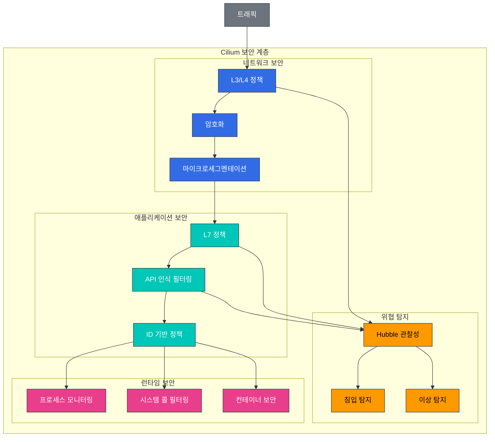

# 보안 및 가시성

> **지원 버전**: Cilium 1.18  
> **마지막 업데이트**: 2025년 11월 24일

## 실습 환경 설정

이 문서의 예제를 따라하기 위해서는 다음과 같은 도구와 환경이 필요합니다:

### 필수 도구
- kubectl v1.31 이상
- 작동하는 Kubernetes 클러스터 (EKS, minikube, kind 등)
- Cilium CLI
- Hubble CLI

### Hubble 설치 및 설정

```bash
# Hubble 활성화
cilium hubble enable --ui

# Hubble CLI 설치
export HUBBLE_VERSION=$(curl -s https://raw.githubusercontent.com/cilium/hubble/master/stable.txt)
curl -L --remote-name-all https://github.com/cilium/hubble/releases/download/$HUBBLE_VERSION/hubble-linux-amd64.tar.gz
tar xzvfC hubble-linux-amd64.tar.gz /usr/local/bin
rm hubble-linux-amd64.tar.gz

# Hubble 포트 포워딩 설정
cilium hubble port-forward &

# Hubble 연결 확인
hubble status
```

## Cilium의 보안 기능

Cilium은 eBPF를 활용하여 컨테이너화된 환경을 위한 강력한 보안 기능을 제공합니다. 이러한 기능은 네트워크 계층부터 애플리케이션 계층까지 포괄적인 보안을 제공합니다.

### Cilium 보안 아키텍처



### 네트워크 보안 기능:

1. **마이크로세그멘테이션**:
   - 세분화된 네트워크 정책으로 횡적 이동 방지
   - 최소 권한 원칙 적용
   - 서비스 간 통신 제한

2. **암호화**:
   - 노드 간 IPsec 또는 WireGuard 암호화
   - 전송 중 데이터 보호
   - 투명한 암호화 구현

3. **위협 탐지**:
   - 비정상적인 네트워크 활동 탐지
   - 알려진 공격 패턴 식별
   - 실시간 알림 및 대응

4. **DNS 보안**:
   - DNS 기반 네트워크 정책
   - 악성 도메인 차단
   - DNS 요청 모니터링

### 애플리케이션 보안 기능:

1. **API 인식 보안**:
   - HTTP 메서드, 경로, 헤더 기반 필터링
   - gRPC 메서드 및 메타데이터 기반 필터링
   - Kafka 주제 및 작업 기반 필터링

2. **ID 기반 보안**:
   - 서비스 ID 기반 정책
   - 상호 TLS(mTLS) 통합
   - SPIFFE/SPIRE 통합

3. **런타임 보안**:
   - 프로세스 및 시스템 콜 모니터링
   - 컨테이너 이스케이프 탐지
   - 권한 에스컬레이션 방지

### 보안 정책 예제:

```yaml
# comprehensive-security-policy.yaml
apiVersion: "cilium.io/v2"
kind: CiliumNetworkPolicy
metadata:
  name: "comprehensive-security"
  namespace: app
spec:
  endpointSelector:
    matchLabels:
      app: backend
  ingress:
  - fromEndpoints:
    - matchLabels:
        app: frontend
    toPorts:
    - ports:
      - port: "8080"
        protocol: TCP
      rules:
        http:
        - method: "GET"
          path: "/api/v1/data"
  egress:
  - toEndpoints:
    - matchLabels:
        app: database
    toPorts:
    - ports:
      - port: "3306"
        protocol: TCP
  - toFQDNs:
    - matchName: "api.example.com"
    toPorts:
    - ports:
      - port: "443"
        protocol: TCP
```

## Hubble을 통한 네트워크 가시성

> **핵심 개념**: Hubble은 Cilium의 관찰성 계층으로, eBPF를 활용하여 네트워크 흐름을 실시간으로 모니터링하고 분석합니다.

Hubble은 Cilium의 관찰성 계층으로, eBPF를 활용하여 네트워크 흐름을 실시간으로 모니터링하고 분석합니다. 이를 통해 네트워크 문제 해결, 보안 모니터링, 성능 분석 등 다양한 용도로 활용할 수 있습니다.

```yaml
kind: CiliumNetworkPolicy
metadata:
  name: "comprehensive-security"
spec:
  endpointSelector:
    matchLabels:
      app: secure-app
  ingress:
  - fromEndpoints:
    - matchLabels:
        app: authorized-client
        io.kubernetes.pod.namespace: default
    toPorts:
    - ports:
      - port: "8443"
        protocol: TCP
      rules:
        http:
        - method: "GET"
          path: "/api/v1/secure"
          headers:
          - "Authorization: Bearer [a-zA-Z0-9\\.]*"
  egress:
  - toEndpoints:
    - matchLabels:
        k8s:app: kube-dns
        k8s:io.kubernetes.pod.namespace: kube-system
    toPorts:
    - ports:
      - port: "53"
        protocol: UDP
  - toFQDNs:
    - matchName: "api.internal.secure"
    toPorts:
    - ports:
      - port: "443"
        protocol: TCP
  - toCIDR:
    - 10.0.0.0/8
    toPorts:
    - ports:
      - port: "5432"
        protocol: TCP
```

### 암호화 구성:

```yaml
# encryption-config.yaml
apiVersion: v1
kind: ConfigMap
metadata:
  name: cilium-config
  namespace: kube-system
data:
  # IPsec 암호화 활성화
  enable-ipsec: "true"
  ipsec-key-file: /etc/ipsec/keys
  
  # 또는 WireGuard 암호화 활성화
  enable-wireguard: "true"
  
  # 암호화 노드 선택
  encrypt-node: "true"
  
  # 암호화 인터페이스
  encrypt-interface: "eth0"
```

## 네트워크 가시성 및 모니터링

Cilium은 Hubble을 통해 컨테이너화된 환경에서 포괄적인 네트워크 가시성 및 모니터링 기능을 제공합니다. 이를 통해 네트워크 흐름을 실시간으로 관찰하고 문제를 해결할 수 있습니다.

### Hubble 아키텍처:

```
+-------------------+        +-------------------+
| Hubble UI         |        | Grafana           |
+--------+----------+        +--------+----------+
         |                            |
         v                            v
+-------------------+        +-------------------+
| Hubble Relay      |        | Prometheus        |
+--------+----------+        +--------+----------+
         |                            |
         v                            v
+-------------------+        +-------------------+
| Hubble            |<-------| Cilium            |
+-------------------+        +-------------------+
         |                            |
         v                            v
+-------------------+        +-------------------+
| eBPF 맵           |        | 커널             |
+-------------------+        +-------------------+
```

### Hubble 구성 요소:

1. **Hubble 서버**:
   - Cilium 에이전트와 통합
   - eBPF 맵에서 네트워크 흐름 데이터 수집
   - 로컬 API 엔드포인트 제공

2. **Hubble Relay**:
   - 여러 Hubble 서버의 데이터 집계
   - 클러스터 전체 가시성 제공
   - gRPC API 엔드포인트 제공

3. **Hubble UI**:
   - 네트워크 흐름 시각화
   - 서비스 의존성 맵
   - 대화형 쿼리 인터페이스

4. **Hubble CLI**:
   - 명령줄 인터페이스
   - 네트워크 흐름 쿼리 및 필터링
   - 문제 해결 도구

### Hubble 설치:

```bash
# Hubble 활성화
cilium hubble enable --ui

# Hubble 상태 확인
cilium hubble status

# Hubble UI 포트 포워딩
cilium hubble ui

# Hubble CLI 설치
curl -L --remote-name-all https://github.com/cilium/hubble/releases/latest/download/hubble-linux-amd64.tar.gz
sudo tar xzvfC hubble-linux-amd64.tar.gz /usr/local/bin
```

### Hubble CLI 사용 예제:

```bash
# 모든 네트워크 흐름 관찰
hubble observe

# 특정 네임스페이스의 흐름 필터링
hubble observe --namespace default

# HTTP 요청 필터링
hubble observe --protocol http

# 드롭된 패킷 필터링
hubble observe --verdict DROPPED

# 특정 포드 간 통신 필터링
hubble observe --pod app1/pod-1 --to-pod app2/pod-2

# 특정 서비스로의 통신 필터링
hubble observe --to-service kube-system/kube-dns

# JSON 형식으로 출력
hubble observe -o json
```

## Hubble 아키텍처 및 활용

Hubble은 Cilium의 eBPF 기반 관찰 가능성 계층으로, 컨테이너 네트워크의 심층적인 가시성을 제공합니다. Hubble은 네트워크 흐름, 애플리케이션 프로토콜, 보안 이벤트 등에 대한 실시간 정보를 제공합니다.

### Hubble 데이터 흐름:

1. **데이터 수집**:
   - eBPF 프로그램이 네트워크 이벤트 캡처
   - 패킷 메타데이터 추출
   - 연결 추적 정보 수집

2. **데이터 처리**:
   - 흐름 레코드 생성
   - L7 프로토콜 파싱
   - 메트릭 집계

3. **데이터 저장**:
   - 링 버퍼에 임시 저장
   - 선택적 영구 저장소 지원
   - 메트릭 내보내기

4. **데이터 쿼리**:
   - 실시간 흐름 관찰
   - 필터링 및 집계
   - 시각화 및 분석

### Hubble 메트릭:

Hubble은 다양한 메트릭을 수집하여 네트워크 성능 및 보안 상태를 모니터링할 수 있습니다:

- **TCP/IP 메트릭**: 연결 수, 재전송, RTT
- **HTTP 메트릭**: 요청 수, 응답 코드, 지연 시간
- **DNS 메트릭**: 쿼리 수, 응답 코드, 지연 시간
- **보안 메트릭**: 정책 결정, 드롭된 패킷, 보안 이벤트
- **서비스 메트릭**: 서비스 간 통신, 로드 밸런싱 결정

### Prometheus 통합:

Hubble은 Prometheus와 통합하여 네트워크 메트릭을 수집하고 모니터링할 수 있습니다:

```yaml
# prometheus-config.yaml
apiVersion: v1
kind: ConfigMap
metadata:
  name: prometheus-config
  namespace: monitoring
data:
  prometheus.yml: |
    global:
      scrape_interval: 15s
    scrape_configs:
      - job_name: 'cilium-hubble'
        static_configs:
          - targets: ['hubble-metrics.cilium.io:9091']
        metrics_path: '/metrics'
```

### Grafana 대시보드:

Hubble은 Grafana와 통합하여 네트워크 메트릭을 시각화할 수 있습니다:

1. **네트워크 개요 대시보드**:
   - 전체 네트워크 트래픽 볼륨
   - 프로토콜 분포
   - 상위 통신 엔드포인트

2. **서비스 맵 대시보드**:
   - 서비스 간 의존성 시각화
   - 통신 패턴 분석
   - 서비스 상태 모니터링

3. **보안 대시보드**:
   - 정책 결정 시각화
   - 드롭된 패킷 분석
   - 보안 이벤트 추적

4. **HTTP 대시보드**:
   - 엔드포인트별 요청 볼륨
   - 응답 코드 분포
   - 지연 시간 분포

## 실시간 위협 탐지

Cilium과 Hubble은 eBPF를 활용하여 실시간 위협 탐지 기능을 제공합니다. 이를 통해 네트워크 기반 공격을 탐지하고 대응할 수 있습니다.

### 탐지 가능한 위협 유형:

1. **네트워크 스캔**:
   - 포트 스캔 탐지
   - 서비스 열거 시도
   - 무차별 대입 공격

2. **비정상적인 트래픽 패턴**:
   - 갑작스러운 트래픽 증가
   - 비정상적인 프로토콜 사용
   - 비정상적인 연결 패턴

3. **정책 위반**:
   - 허용되지 않은 서비스 간 통신
   - 허용되지 않은 외부 연결
   - 허용되지 않은 프로토콜 사용

4. **알려진 공격 패턴**:
   - SQL 인젝션 시도
   - XSS(Cross-Site Scripting) 시도
   - 명령 인젝션 시도

### 위협 탐지 구성:

```yaml
# threat-detection-config.yaml
apiVersion: v1
kind: ConfigMap
metadata:
  name: cilium-config
  namespace: kube-system
data:
  # 위협 탐지 활성화
  enable-threat-detection: "true"
  
  # 이상 탐지 활성화
  enable-anomaly-detection: "true"
  
  # 알림 구성
  alert-to-slack: "true"
  slack-webhook-url: "https://hooks.slack.com/services/..."
  
  # 로깅 구성
  log-level: "info"
  enable-flow-logs: "true"
```

### 위협 대응 자동화:

Cilium은 탐지된 위협에 대한 자동 대응을 구성할 수 있습니다:

1. **자동 차단**:
   - 악성 IP 주소 차단
   - 비정상적인 포드 격리
   - 악성 도메인 차단

2. **속도 제한**:
   - 과도한 요청 제한
   - 연결 수 제한
   - 대역폭 제한

3. **알림 및 로깅**:
   - Slack, PagerDuty 등으로 알림
   - 중앙 로깅 시스템으로 로그 전송
   - 보안 정보 및 이벤트 관리(SIEM) 통합

### 위협 탐지 모니터링:

```bash
# 드롭된 패킷 모니터링
hubble observe --verdict DROPPED

# 정책 위반 모니터링
hubble observe --verdict POLICY_DENIED

# HTTP 오류 모니터링
hubble observe --protocol http --http-status 4.. --http-status 5..

# 특정 IP로부터의 트래픽 모니터링
hubble observe --ip 10.0.0.1

# 실시간 위협 알림 설정
hubble observe --verdict DROPPED --output json | jq -c 'select(.verdict.reason == "Policy denied")' | webhook-forwarder
```

## 실습: Hubble 설치 및 활용

### 1. Hubble 설치 및 구성:

```bash
# Hubble 활성화
cilium hubble enable --ui

# Hubble 상태 확인
cilium hubble status

# Hubble UI 접근
cilium hubble ui
```

### 2. 네트워크 정책 적용 및 모니터링:

```bash
# 기본 거부 정책 적용
kubectl apply -f - <<EOF
apiVersion: "cilium.io/v2"
kind: CiliumNetworkPolicy
metadata:
  name: "deny-all"
spec:
  endpointSelector: {}
  ingress:
  - {}
  egress:
  - toEndpoints:
    - matchLabels:
        k8s:app: kube-dns
        k8s:io.kubernetes.pod.namespace: kube-system
    toPorts:
    - ports:
      - port: "53"
        protocol: UDP
EOF

# 정책 위반 모니터링
hubble observe --verdict DROPPED
```

### 3. 서비스 의존성 맵 생성:

```bash
# 테스트 애플리케이션 배포
kubectl apply -f https://raw.githubusercontent.com/cilium/cilium/master/examples/minikube/http-sw-app.yaml

# 트래픽 생성
kubectl exec -ti deployment/xwing -- curl -s -XPOST deathstar.default.svc.cluster.local/v1/request-landing

# 서비스 맵 확인
cilium hubble ui
```

### 4. 보안 이벤트 모니터링:

```bash
# 보안 이벤트 모니터링
hubble observe --type drop --output json

# 특정 포드의 보안 이벤트 모니터링
hubble observe --pod app=deathstar --verdict DROPPED

# 보안 이벤트 통계
hubble observe --verdict DROPPED --output json | jq -c '.verdict.reason' | sort | uniq -c
```

[메인 페이지로 돌아가기](README.md)

## 퀴즈

이 장에서 배운 내용을 테스트하려면 [주제 퀴즈](../quizzes/cilium/06-security-visibility-quiz.md)를 풀어보세요.
