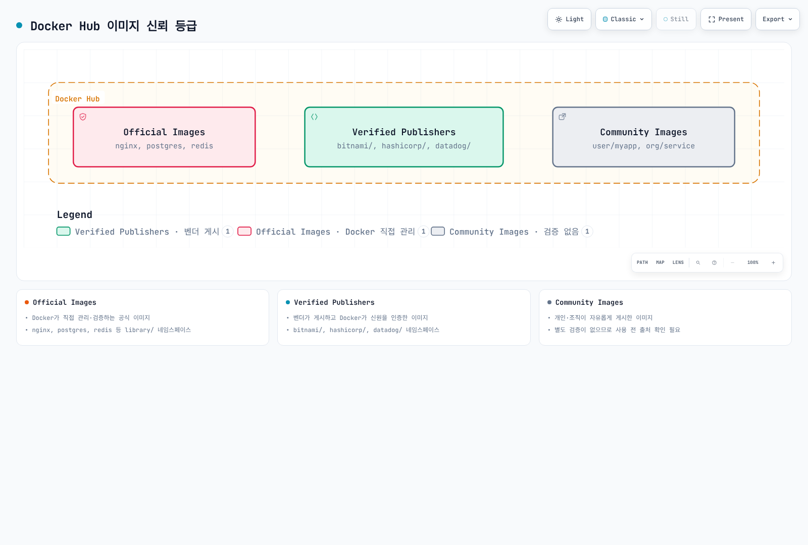
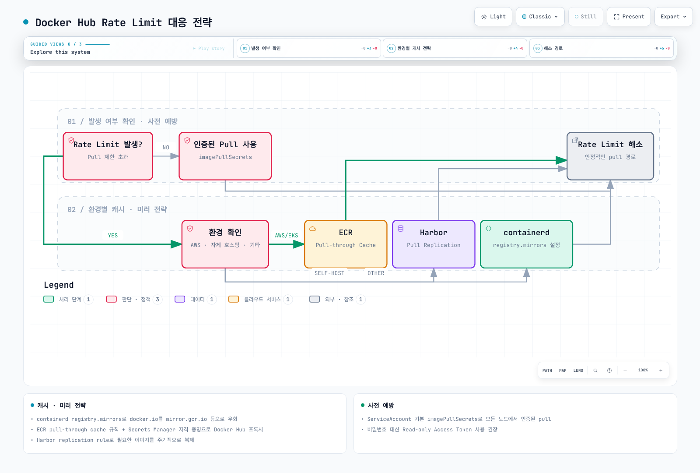

# Docker Hub

> **마지막 업데이트**: 2026년 2월 25일

## 개요

Docker Hub는 세계에서 가장 큰 컨테이너 이미지 저장소로, 수백만 개의 공개 이미지를 호스팅합니다. Docker Official Images, Verified Publishers, 커뮤니티 이미지를 제공하며, 개인 및 팀을 위한 프라이빗 저장소 기능도 지원합니다.



[🔍 인터랙티브 다이어그램 보기](https://www.atomai.click/kubernetes-docs/archmaps/ko-container-registry-01-docker-hub-0.html)

---

## Docker Hub 플랜 비교

### 플랜별 기능

| 기능 | Free | Pro | Team | Business |
|------|------|-----|------|----------|
| **가격** | 무료 | $5/월 | $9/사용자/월 | 문의 |
| **공개 저장소** | 무제한 | 무제한 | 무제한 | 무제한 |
| **프라이빗 저장소** | 1개 | 무제한 | 무제한 | 무제한 |
| **팀 기능** | ❌ | ❌ | ✅ | ✅ |
| **SSO/SAML** | ❌ | ❌ | ❌ | ✅ |
| **감사 로그** | ❌ | ❌ | ❌ | ✅ |
| **취약점 스캐닝** | 제한적 | ✅ | ✅ | ✅ |
| **병렬 빌드** | 1 | 5 | 15 | 무제한 |

### Rate Limits (Pull 제한)

Docker Hub는 익명 및 무료 사용자에게 pull 제한을 적용합니다:

| 인증 상태 | Rate Limit | 기준 |
|----------|------------|------|
| **익명** | 100 pulls / 6시간 | IP 주소당 |
| **Free (인증됨)** | 200 pulls / 6시간 | 사용자당 |
| **Pro** | 무제한 | - |
| **Team** | 무제한 | - |
| **Business** | 무제한 | - |

**Rate Limit 확인 방법:**

```bash
# 현재 rate limit 상태 확인
TOKEN=$(curl -s "https://auth.docker.io/token?service=registry.docker.io&scope=repository:library/nginx:pull" | jq -r .token)

curl -s -H "Authorization: Bearer $TOKEN" \
  -I "https://registry-1.docker.io/v2/library/nginx/manifests/latest" 2>&1 | \
  grep -i ratelimit

# 출력 예시:
# ratelimit-limit: 100;w=21600
# ratelimit-remaining: 95;w=21600
```

---

## Kubernetes에서 Docker Hub 사용

### imagePullSecrets 설정

**1. Docker Hub 자격 증명으로 Secret 생성:**

```bash
kubectl create secret docker-registry dockerhub-secret \
  --docker-server=https://index.docker.io/v1/ \
  --docker-username=<username> \
  --docker-password=<password-or-access-token> \
  --docker-email=<email> \
  -n default
```

**2. Pod에서 Secret 참조:**

```yaml
apiVersion: v1
kind: Pod
metadata:
  name: myapp
spec:
  containers:
  - name: myapp
    image: username/myapp:v1.0.0
  imagePullSecrets:
  - name: dockerhub-secret
```

**3. ServiceAccount에 기본 imagePullSecrets 설정:**

```yaml
apiVersion: v1
kind: ServiceAccount
metadata:
  name: myapp-sa
  namespace: default
imagePullSecrets:
- name: dockerhub-secret
```

```yaml
apiVersion: apps/v1
kind: Deployment
metadata:
  name: myapp
spec:
  template:
    spec:
      serviceAccountName: myapp-sa
      containers:
      - name: myapp
        image: username/myapp:v1.0.0
        # imagePullSecrets 자동 적용
```

### Access Token 사용 (권장)

비밀번호 대신 Access Token 사용을 권장합니다:

```bash
# Docker Hub > Account Settings > Security > Access Tokens

# Access Token으로 Secret 생성
kubectl create secret docker-registry dockerhub-secret \
  --docker-server=https://index.docker.io/v1/ \
  --docker-username=<username> \
  --docker-password=<access-token> \
  -n default
```

**Access Token 권한 범위:**
- **Read-only**: 이미지 pull만 허용
- **Read & Write**: pull + push 허용
- **Read, Write & Delete**: 전체 권한

---

## Docker Hub Rate Limit 대응 전략



[🔍 인터랙티브 다이어그램 보기](https://www.atomai.click/kubernetes-docs/archmaps/ko-container-registry-01-docker-hub-1.html)

### 전략 1: Pull-through Cache (containerd)

containerd 설정으로 Docker Hub를 캐싱합니다:

```toml
# /etc/containerd/config.toml

[plugins."io.containerd.grpc.v1.cri".registry]
  [plugins."io.containerd.grpc.v1.cri".registry.mirrors]
    [plugins."io.containerd.grpc.v1.cri".registry.mirrors."docker.io"]
      endpoint = ["https://mirror.gcr.io", "https://registry-1.docker.io"]
```

### 전략 2: Amazon ECR Pull-through Cache

ECR을 Docker Hub의 프록시 캐시로 사용:

```bash
# ECR pull-through cache 규칙 생성
aws ecr create-pull-through-cache-rule \
  --ecr-repository-prefix docker-hub \
  --upstream-registry-url registry-1.docker.io \
  --credential-arn arn:aws:secretsmanager:ap-northeast-2:123456789012:secret:dockerhub-creds

# 사용 예시 (원본 -> 캐시)
# docker.io/library/nginx:latest
# -> 123456789012.dkr.ecr.ap-northeast-2.amazonaws.com/docker-hub/library/nginx:latest
```

**Kubernetes에서 사용:**

```yaml
apiVersion: apps/v1
kind: Deployment
metadata:
  name: nginx
spec:
  template:
    spec:
      containers:
      - name: nginx
        # ECR pull-through cache 사용
        image: 123456789012.dkr.ecr.ap-northeast-2.amazonaws.com/docker-hub/library/nginx:1.25
```

### 전략 3: Harbor Pull Replication

Harbor에서 필요한 이미지를 자동으로 복제:

```yaml
# Harbor replication rule
Source: docker.io
Destination: harbor.internal/docker-cache
Filter:
  - library/nginx
  - library/redis
  - bitnami/**
Trigger: Scheduled (every 6 hours)
```

### 전략 4: 인증된 Pull 사용

모든 노드에서 인증된 pull을 수행하도록 설정:

```yaml
# 모든 노드에 기본 imagePullSecrets 적용
apiVersion: v1
kind: ServiceAccount
metadata:
  name: default
  namespace: kube-system
imagePullSecrets:
- name: dockerhub-secret
```

---

## 자동화된 빌드 (Automated Builds)

Docker Hub는 GitHub/GitLab 연동을 통한 자동 빌드를 지원합니다.

### GitHub 연동 설정

**1. Docker Hub에서 GitHub 계정 연결:**
- Docker Hub > Account Settings > Linked Accounts > GitHub

**2. Automated Build 저장소 생성:**
- Create Repository > GitHub에서 저장소 선택
- Build Rules 설정

**Build Rules 예시:**

| Source Type | Source | Docker Tag | Dockerfile Location |
|-------------|--------|------------|---------------------|
| Branch | main | latest | /Dockerfile |
| Branch | develop | dev | /Dockerfile |
| Tag | /^v([0-9.]+)$/ | {\1} | /Dockerfile |

### 빌드 훅 (Build Hooks)

빌드 프로세스를 커스터마이징하는 훅 스크립트:

```bash
# hooks/build
#!/bin/bash
# 커스텀 빌드 명령
docker build \
  --build-arg BUILD_DATE=$(date -u +'%Y-%m-%dT%H:%M:%SZ') \
  --build-arg VCS_REF=$(git rev-parse --short HEAD) \
  -t $IMAGE_NAME .
```

```bash
# hooks/post_push
#!/bin/bash
# 추가 태그 푸시
docker tag $IMAGE_NAME $DOCKER_REPO:$SOURCE_COMMIT
docker push $DOCKER_REPO:$SOURCE_COMMIT
```

### GitHub Actions 대안 (권장)

Docker Hub Automated Builds 대신 GitHub Actions 사용:

```yaml
# .github/workflows/docker-publish.yml
name: Docker Build and Push

on:
  push:
    branches: [main]
    tags: ['v*']

env:
  REGISTRY: docker.io
  IMAGE_NAME: ${{ github.repository }}

jobs:
  build:
    runs-on: ubuntu-latest
    steps:
    - uses: actions/checkout@v4

    - name: Login to Docker Hub
      uses: docker/login-action@v3
      with:
        username: ${{ secrets.DOCKERHUB_USERNAME }}
        password: ${{ secrets.DOCKERHUB_TOKEN }}

    - name: Extract metadata
      id: meta
      uses: docker/metadata-action@v5
      with:
        images: ${{ env.REGISTRY }}/${{ env.IMAGE_NAME }}
        tags: |
          type=ref,event=branch
          type=semver,pattern={{version}}
          type=sha,prefix=

    - name: Build and push
      uses: docker/build-push-action@v5
      with:
        context: .
        push: true
        tags: ${{ steps.meta.outputs.tags }}
        labels: ${{ steps.meta.outputs.labels }}
```

---

## 공개 이미지 보안 사례

### Supply Chain Attack 사례

**사례 1: Typosquatting**
```
# 악성 이미지
docker pull mongobd/mongo    # 'mongodb' 오타
docker pull nginx-proxy      # 공식: nginxproxy/nginx-proxy
```

**사례 2: 계정 탈취**
- 인기 이미지 메인테이너 계정 탈취
- 악성 코드가 포함된 새 버전 푸시

**사례 3: Base Image 오염**
```dockerfile
# 검증되지 않은 base image
FROM some-random-user/python:3.11  # 위험!
```

### 안전한 이미지 선택 가이드

**1. Official Images 우선:**

```yaml
# 권장
image: nginx:1.25
image: postgres:16
image: redis:7

# 비권장
image: random-user/nginx:latest
```

**2. Verified Publishers:**

```yaml
# Verified Publisher 이미지
image: bitnami/postgresql:16
image: hashicorp/vault:1.15
image: datadog/agent:7
```

**3. 이미지 검증:**

```bash
# 이미지 다이제스트 확인
docker pull nginx:1.25
docker inspect nginx:1.25 --format='{{.RepoDigests}}'
# [nginx@sha256:abc123...]

# 다이제스트로 고정
image: nginx@sha256:abc123def456...
```

**4. Content Trust 활성화:**

```bash
# Docker Content Trust 활성화
export DOCKER_CONTENT_TRUST=1
docker pull nginx:1.25
# 서명 검증 후 pull
```

### Kubernetes Admission Control

서명되지 않은 이미지 차단:

```yaml
# Kyverno 정책 예시
apiVersion: kyverno.io/v1
kind: ClusterPolicy
metadata:
  name: require-verified-images
spec:
  validationFailureAction: Enforce
  rules:
  - name: verify-image-source
    match:
      any:
      - resources:
          kinds:
          - Pod
    validate:
      message: "Images must be from verified sources"
      pattern:
        spec:
          containers:
          - image: "docker.io/library/* | docker.io/bitnami/* | docker.io/hashicorp/*"
```

---

## Docker Hub API 활용

### 태그 목록 조회

```bash
# 공개 이미지 태그 조회 (인증 불필요)
curl -s "https://hub.docker.com/v2/repositories/library/nginx/tags?page_size=100" | \
  jq -r '.results[].name'

# 사용자 이미지 태그 조회
TOKEN=$(curl -s -X POST "https://hub.docker.com/v2/users/login" \
  -H "Content-Type: application/json" \
  -d '{"username":"<username>","password":"<password>"}' | jq -r .token)

curl -s -H "Authorization: Bearer $TOKEN" \
  "https://hub.docker.com/v2/repositories/<username>/<repo>/tags?page_size=100" | \
  jq -r '.results[].name'
```

### 이미지 정보 조회

```bash
# 이미지 상세 정보
curl -s "https://hub.docker.com/v2/repositories/library/nginx" | jq .

# 응답 예시
{
  "name": "nginx",
  "namespace": "library",
  "description": "Official build of Nginx.",
  "star_count": 18000,
  "pull_count": 3000000000,
  "last_updated": "2024-01-15T10:00:00.000000Z"
}
```

### 취약점 스캐닝 결과 조회

```bash
# Docker Scout (Pro 이상)
docker scout cves nginx:1.25

# 또는 API
curl -s -H "Authorization: Bearer $TOKEN" \
  "https://hub.docker.com/v2/repositories/library/nginx/tags/1.25/vulnerabilities" | jq .
```

### 저장소 관리

```bash
# 저장소 생성
curl -s -X POST "https://hub.docker.com/v2/repositories/" \
  -H "Authorization: Bearer $TOKEN" \
  -H "Content-Type: application/json" \
  -d '{
    "namespace": "<username>",
    "name": "myapp",
    "description": "My application",
    "is_private": true
  }'

# 저장소 삭제
curl -s -X DELETE "https://hub.docker.com/v2/repositories/<username>/myapp" \
  -H "Authorization: Bearer $TOKEN"
```

---

## CI/CD 통합

### GitLab CI 예시

```yaml
# .gitlab-ci.yml
stages:
  - build
  - scan
  - push

variables:
  DOCKER_IMAGE: $CI_REGISTRY_IMAGE:$CI_COMMIT_SHA

build:
  stage: build
  image: docker:24
  services:
    - docker:24-dind
  script:
    - docker build -t $DOCKER_IMAGE .
    - docker save $DOCKER_IMAGE > image.tar
  artifacts:
    paths:
      - image.tar

scan:
  stage: scan
  image: docker:24
  services:
    - docker:24-dind
  script:
    - docker load < image.tar
    - docker run --rm -v /var/run/docker.sock:/var/run/docker.sock
        aquasec/trivy image --exit-code 1 --severity HIGH,CRITICAL $DOCKER_IMAGE

push:
  stage: push
  image: docker:24
  services:
    - docker:24-dind
  script:
    - docker load < image.tar
    - echo "$DOCKERHUB_TOKEN" | docker login -u "$DOCKERHUB_USERNAME" --password-stdin
    - docker tag $DOCKER_IMAGE $DOCKERHUB_USERNAME/myapp:$CI_COMMIT_TAG
    - docker push $DOCKERHUB_USERNAME/myapp:$CI_COMMIT_TAG
  only:
    - tags
```

### Jenkins Pipeline

```groovy
// Jenkinsfile
pipeline {
    agent any

    environment {
        DOCKERHUB_CREDENTIALS = credentials('dockerhub-creds')
        IMAGE_NAME = 'username/myapp'
    }

    stages {
        stage('Build') {
            steps {
                sh "docker build -t ${IMAGE_NAME}:${BUILD_NUMBER} ."
            }
        }

        stage('Scan') {
            steps {
                sh "trivy image --exit-code 1 --severity HIGH,CRITICAL ${IMAGE_NAME}:${BUILD_NUMBER}"
            }
        }

        stage('Push') {
            steps {
                sh "echo ${DOCKERHUB_CREDENTIALS_PSW} | docker login -u ${DOCKERHUB_CREDENTIALS_USR} --password-stdin"
                sh "docker push ${IMAGE_NAME}:${BUILD_NUMBER}"
                sh "docker tag ${IMAGE_NAME}:${BUILD_NUMBER} ${IMAGE_NAME}:latest"
                sh "docker push ${IMAGE_NAME}:latest"
            }
        }
    }

    post {
        always {
            sh "docker logout"
        }
    }
}
```

---

## 모범 사례

### 1. 보안

```yaml
# ✅ 권장
- Official Images 또는 Verified Publishers 사용
- 이미지 다이제스트로 고정
- Content Trust 활성화
- 정기적인 취약점 스캐닝

# ❌ 비권장
- 검증되지 않은 커뮤니티 이미지
- :latest 태그 사용
- 비밀번호 직접 사용 (Access Token 사용)
```

### 2. Rate Limit 관리

```yaml
# ✅ 권장
- Pro/Team 플랜 (프로덕션)
- Pull-through cache 구성
- 인증된 pull 사용

# ❌ 비권장
- 익명 pull (프로덕션)
- 캐시 없이 직접 pull
```

### 3. 저장소 관리

```yaml
# ✅ 권장
- 의미 있는 저장소/태그 명명
- README 및 설명 작성
- 불필요한 태그 정리

# ❌ 비권장
- 개인 정보 포함 저장소 이름
- 설명 없는 저장소
- 태그 무분별한 누적
```

### 4. 자격 증명 관리

```bash
# Access Token 생성 (권장)
# Docker Hub > Account Settings > Security > New Access Token

# 범위 최소화
# - CI/CD push: Read & Write
# - Kubernetes pull: Read-only

# 정기적 로테이션
# - 90일마다 토큰 갱신
```

---

## 요약

| 항목 | 권장 사항 |
|------|----------|
| **플랜** | 프로덕션: Pro 이상, 팀: Team |
| **이미지** | Official Images, Verified Publishers |
| **태그** | 버전 고정, 다이제스트 사용 |
| **인증** | Access Token (비밀번호 대신) |
| **Rate Limit** | Pull-through cache, 인증된 pull |
| **보안** | Content Trust, 취약점 스캐닝 |
| **CI/CD** | GitHub Actions 권장 |

---

## 참고 자료

- [Docker Hub 공식 문서](https://docs.docker.com/docker-hub/)
- [Docker Hub Rate Limits](https://docs.docker.com/docker-hub/download-rate-limit/)
- [Docker Official Images](https://hub.docker.com/search?q=&type=image&image_filter=official)
- [Docker Content Trust](https://docs.docker.com/engine/security/trust/)
- [Docker Scout](https://docs.docker.com/scout/)
