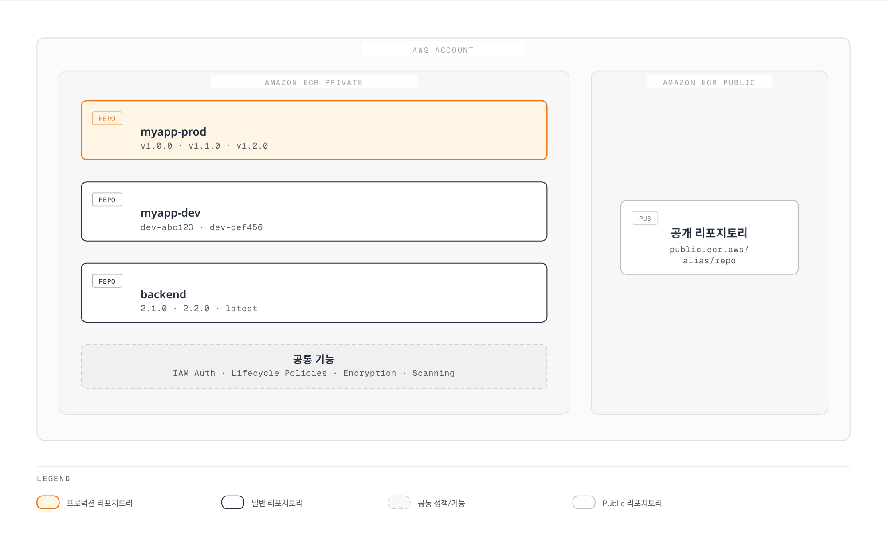
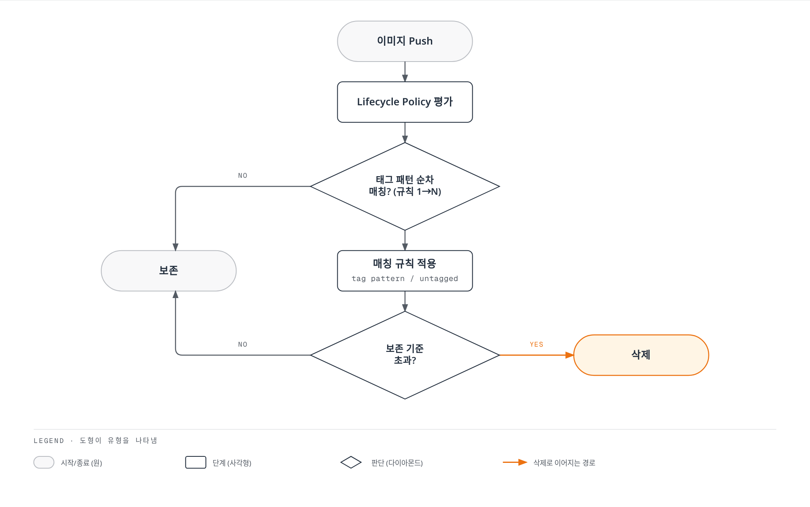
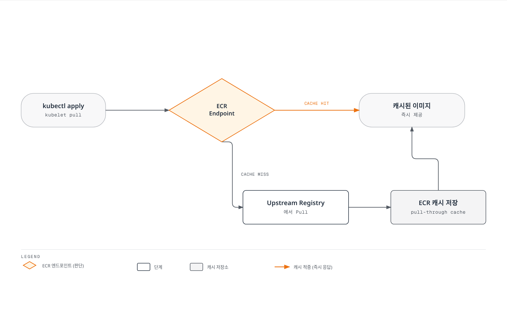

# Amazon ECR (Elastic Container Registry)

> **마지막 업데이트**: 2026년 2월 25일

## 개요

Amazon Elastic Container Registry(ECR)는 AWS에서 제공하는 완전관리형 컨테이너 레지스트리 서비스입니다. Docker 이미지, OCI 이미지 및 OCI 호환 아티팩트를 저장, 관리, 배포할 수 있으며, AWS IAM과 통합되어 세밀한 접근 제어가 가능합니다.

### 아키텍처



### Private vs Public ECR

| 특성 | ECR Private | ECR Public |
|------|-------------|------------|
| **URL 형식** | `<account>.dkr.ecr.<region>.amazonaws.com/<repo>` | `public.ecr.aws/<alias>/<repo>` |
| **인증** | IAM 기반 필수 | 선택적 (익명 pull 가능) |
| **리전** | 모든 상용 리전 | us-east-1만 (글로벌 배포) |
| **비용** | 스토리지 + 전송 | 스토리지 + 전송 (50GB 무료) |
| **사용 사례** | 프라이빗 워크로드 | 오픈소스, 공개 배포 |

### 가격 모델

| 항목 | 비용 | 비고 |
|------|------|------|
| **스토리지** | $0.10/GB/월 | 모든 리전 동일 |
| **데이터 전송 (리전 내)** | 무료 | 같은 리전 EKS/EC2 |
| **데이터 전송 (리전 간)** | $0.01-0.02/GB | 리전별 상이 |
| **데이터 전송 (인터넷)** | $0.09/GB~ | 용량별 할인 |

**비용 예시 (월간):**
```
저장 이미지: 50GB = $5.00
리전 내 전송: 100GB = $0.00
인터넷 전송: 10GB = $0.90
---
총 비용: ~$5.90/월
```

---

## 리포지토리 생성 및 구성

### AWS CLI로 리포지토리 생성

```bash
# 기본 리포지토리 생성
aws ecr create-repository \
  --repository-name myapp \
  --region ap-northeast-2

# 전체 옵션 설정
aws ecr create-repository \
  --repository-name myapp \
  --region ap-northeast-2 \
  --image-tag-mutability IMMUTABLE \
  --image-scanning-configuration scanOnPush=true \
  --encryption-configuration encryptionType=KMS,kmsKey=arn:aws:kms:ap-northeast-2:123456789012:key/12345678-1234-1234-1234-123456789012 \
  --tags Key=Environment,Value=Production Key=Team,Value=Platform
```

**주요 옵션:**

| 옵션 | 설명 | 권장 값 |
|------|------|--------|
| `--image-tag-mutability` | 태그 변경 가능 여부 | `IMMUTABLE` (프로덕션) |
| `--image-scanning-configuration` | 푸시 시 스캐닝 | `scanOnPush=true` |
| `--encryption-configuration` | 암호화 설정 | `KMS` (민감 데이터) |

### AWS CDK로 리포지토리 생성

```typescript
// lib/ecr-stack.ts
import * as cdk from 'aws-cdk-lib';
import * as ecr from 'aws-cdk-lib/aws-ecr';
import { Construct } from 'constructs';

export class EcrStack extends cdk.Stack {
  public readonly repository: ecr.Repository;

  constructor(scope: Construct, id: string, props?: cdk.StackProps) {
    super(scope, id, props);

    // 프로덕션 리포지토리
    this.repository = new ecr.Repository(this, 'MyAppRepository', {
      repositoryName: 'myapp-prod',
      imageScanOnPush: true,
      imageTagMutability: ecr.TagMutability.IMMUTABLE,
      encryption: ecr.RepositoryEncryption.AES_256,
      removalPolicy: cdk.RemovalPolicy.RETAIN,
      lifecycleRules: [
        {
          description: 'Keep last 100 production images',
          maxImageCount: 100,
          tagStatus: ecr.TagStatus.TAGGED,
          tagPrefixList: ['v'],
        },
        {
          description: 'Expire untagged images after 3 days',
          maxImageAge: cdk.Duration.days(3),
          tagStatus: ecr.TagStatus.UNTAGGED,
        },
      ],
    });

    // 리포지토리 URL 출력
    new cdk.CfnOutput(this, 'RepositoryUri', {
      value: this.repository.repositoryUri,
    });
  }
}
```

### Immutable Tags 설정

Immutable tags는 한번 푸시된 태그를 덮어쓸 수 없게 합니다:

```bash
# 기존 리포지토리의 태그 불변성 변경
aws ecr put-image-tag-mutability \
  --repository-name myapp \
  --image-tag-mutability IMMUTABLE

# 확인
aws ecr describe-repositories \
  --repository-names myapp \
  --query 'repositories[].imageTagMutability'
```

**Immutable Tags의 장점:**
- 프로덕션 이미지 무결성 보장
- 감사 추적 용이
- 롤백 시 일관성 보장

**주의사항:**
- `latest` 태그 사용 불가 (매번 새 태그 필요)
- CI/CD 파이프라인 조정 필요

### 암호화 설정

**AES-256 (기본):**
```bash
# AWS 관리형 키 사용 (추가 비용 없음)
aws ecr create-repository \
  --repository-name myapp \
  --encryption-configuration encryptionType=AES256
```

**KMS (고객 관리형):**
```bash
# 고객 관리형 KMS 키 사용
aws ecr create-repository \
  --repository-name myapp-sensitive \
  --encryption-configuration \
    encryptionType=KMS,kmsKey=arn:aws:kms:ap-northeast-2:123456789012:key/mrk-xxxxx
```

**KMS 사용 사례:**
- 규제 준수 (키 로테이션 감사)
- 교차 계정 암호화 제어
- 세분화된 접근 제어

### 취약점 스캐닝

**Basic Scanning (기본):**
```bash
# 푸시 시 자동 스캐닝 활성화
aws ecr put-image-scanning-configuration \
  --repository-name myapp \
  --image-scanning-configuration scanOnPush=true

# 수동 스캐닝
aws ecr start-image-scan \
  --repository-name myapp \
  --image-id imageTag=v1.0.0

# 스캐닝 결과 조회
aws ecr describe-image-scan-findings \
  --repository-name myapp \
  --image-id imageTag=v1.0.0
```

**Enhanced Scanning (Amazon Inspector):**
```bash
# Enhanced Scanning 활성화 (계정 레벨)
aws ecr put-registry-scanning-configuration \
  --scan-type ENHANCED \
  --rules '[
    {
      "repositoryFilters": [{"filter": "*", "filterType": "WILDCARD"}],
      "scanFrequency": "CONTINUOUS_SCAN"
    }
  ]'
```

| 특성 | Basic Scanning | Enhanced Scanning |
|------|----------------|-------------------|
| **엔진** | Clair (오픈소스) | Amazon Inspector |
| **커버리지** | OS 패키지 | OS + 언어 패키지 |
| **주기** | 푸시 시 / 수동 | 지속적 + 새 CVE 발견 시 |
| **비용** | 무료 | Inspector 요금 |

---

## 인증 및 접근 제어

### Docker 로그인

```bash
# AWS CLI v2로 로그인
aws ecr get-login-password --region ap-northeast-2 | \
  docker login --username AWS --password-stdin \
  123456789012.dkr.ecr.ap-northeast-2.amazonaws.com

# 토큰 유효 기간: 12시간
```

### amazon-ecr-credential-helper

Docker 자격 증명을 자동으로 관리합니다:

```bash
# 설치 (Amazon Linux 2023 / AL2)
sudo yum install -y amazon-ecr-credential-helper

# macOS
brew install docker-credential-helper-ecr

# Docker 설정
cat > ~/.docker/config.json << 'EOF'
{
  "credHelpers": {
    "123456789012.dkr.ecr.ap-northeast-2.amazonaws.com": "ecr-login",
    "public.ecr.aws": "ecr-login"
  }
}
EOF

# 이후 docker push/pull 시 자동 인증
docker push 123456789012.dkr.ecr.ap-northeast-2.amazonaws.com/myapp:v1.0.0
```

### IAM 정책 예시

**읽기 전용 (Pull):**
```json
{
  "Version": "2012-10-17",
  "Statement": [
    {
      "Sid": "ECRReadOnly",
      "Effect": "Allow",
      "Action": [
        "ecr:GetAuthorizationToken"
      ],
      "Resource": "*"
    },
    {
      "Sid": "ECRPull",
      "Effect": "Allow",
      "Action": [
        "ecr:BatchCheckLayerAvailability",
        "ecr:GetDownloadUrlForLayer",
        "ecr:BatchGetImage",
        "ecr:DescribeImages",
        "ecr:DescribeRepositories",
        "ecr:ListImages"
      ],
      "Resource": "arn:aws:ecr:ap-northeast-2:123456789012:repository/myapp-*"
    }
  ]
}
```

**Push 권한:**
```json
{
  "Version": "2012-10-17",
  "Statement": [
    {
      "Sid": "ECRAuth",
      "Effect": "Allow",
      "Action": "ecr:GetAuthorizationToken",
      "Resource": "*"
    },
    {
      "Sid": "ECRPush",
      "Effect": "Allow",
      "Action": [
        "ecr:BatchCheckLayerAvailability",
        "ecr:GetDownloadUrlForLayer",
        "ecr:BatchGetImage",
        "ecr:PutImage",
        "ecr:InitiateLayerUpload",
        "ecr:UploadLayerPart",
        "ecr:CompleteLayerUpload"
      ],
      "Resource": "arn:aws:ecr:ap-northeast-2:123456789012:repository/myapp-*"
    }
  ]
}
```

**관리자 권한:**
```json
{
  "Version": "2012-10-17",
  "Statement": [
    {
      "Sid": "ECRAdmin",
      "Effect": "Allow",
      "Action": "ecr:*",
      "Resource": "*"
    }
  ]
}
```

### 교차 계정 접근

**리소스 기반 정책 (대상 리포지토리에 설정):**

```json
{
  "Version": "2012-10-17",
  "Statement": [
    {
      "Sid": "CrossAccountPull",
      "Effect": "Allow",
      "Principal": {
        "AWS": [
          "arn:aws:iam::111111111111:root",
          "arn:aws:iam::222222222222:role/EKSNodeRole"
        ]
      },
      "Action": [
        "ecr:BatchCheckLayerAvailability",
        "ecr:GetDownloadUrlForLayer",
        "ecr:BatchGetImage"
      ]
    }
  ]
}
```

```bash
# 리소스 정책 적용
aws ecr set-repository-policy \
  --repository-name myapp \
  --policy-text file://ecr-resource-policy.json
```

**교차 계정에서 pull:**
```bash
# 계정 111111111111에서 계정 123456789012의 이미지 pull
aws ecr get-login-password --region ap-northeast-2 | \
  docker login --username AWS --password-stdin \
  123456789012.dkr.ecr.ap-northeast-2.amazonaws.com

docker pull 123456789012.dkr.ecr.ap-northeast-2.amazonaws.com/myapp:v1.0.0
```

---

## Lifecycle Policy 심화

ECR Lifecycle Policy는 이미지 보존 규칙을 자동화하여 스토리지 비용을 최적화합니다. 이 섹션에서는 다양한 전략과 그 장단점을 상세히 설명합니다.

### Lifecycle Policy 동작 원리



**규칙 평가 순서:**
1. 규칙은 `rulePriority` 숫자가 낮은 것부터 평가
2. 각 규칙은 선택 기준에 맞는 이미지를 식별
3. 삭제 대상으로 표시된 이미지는 실제 삭제 실행
4. 한 이미지가 여러 규칙에 매칭되면 첫 번째 매칭 규칙 적용

**선택 기준 (Selection Criteria):**

| 기준 | 설명 | 예시 |
|------|------|------|
| `tagStatus` | 태그 상태 | `tagged`, `untagged`, `any` |
| `tagPatternList` | 태그 패턴 (glob) | `["v*", "release-*"]` |
| `countType` | 카운트 방식 | `imageCountMoreThan`, `sinceImagePushed` |
| `countNumber` | 보존할 개수 | `100` |
| `countUnit` | 시간 단위 | `days` |

**중요 제한사항:**
- 단일 규칙에서 `imageCountMoreThan`과 `sinceImagePushed`를 OR 조건으로 결합할 수 없음
- 규칙 간 우선순위로만 조합 가능
- "N개 또는 M일 중 더 많은 쪽" 로직은 네이티브 지원 안 됨

---

### Strategy A: 분리된 리포지토리 (권장)

프로덕션과 개발 이미지를 별도 리포지토리로 분리하면 각각에 최적화된 lifecycle 정책을 적용할 수 있습니다.

**아키텍처:**
```
myapp-prod/          myapp-dev/
├── v1.0.0           ├── dev-abc123
├── v1.1.0           ├── dev-def456
├── v1.2.0           ├── stage-ghi789
├── v2.0.0           ├── feature-xyz
└── ... (최대 100개)  └── ... (60일 이내)
```

**프로덕션 리포지토리 (myapp-prod) Lifecycle Policy:**

```json
{
  "rules": [
    {
      "rulePriority": 1,
      "description": "프로덕션 SemVer 이미지 최대 100개 보존",
      "selection": {
        "tagStatus": "tagged",
        "tagPatternList": ["*"],
        "countType": "imageCountMoreThan",
        "countNumber": 100
      },
      "action": {
        "type": "expire"
      }
    },
    {
      "rulePriority": 2,
      "description": "태그 없는 이미지 1일 후 삭제",
      "selection": {
        "tagStatus": "untagged",
        "countType": "sinceImagePushed",
        "countNumber": 1,
        "countUnit": "days"
      },
      "action": {
        "type": "expire"
      }
    }
  ]
}
```

**개발 리포지토리 (myapp-dev) Lifecycle Policy:**

```json
{
  "rules": [
    {
      "rulePriority": 1,
      "description": "60일 이상 된 개발 이미지 삭제",
      "selection": {
        "tagStatus": "tagged",
        "tagPatternList": ["*"],
        "countType": "sinceImagePushed",
        "countNumber": 60,
        "countUnit": "days"
      },
      "action": {
        "type": "expire"
      }
    },
    {
      "rulePriority": 2,
      "description": "안전망: 최소 30개 미만이면 유지 (개수 기반)",
      "selection": {
        "tagStatus": "tagged",
        "tagPatternList": ["*"],
        "countType": "imageCountMoreThan",
        "countNumber": 30
      },
      "action": {
        "type": "expire"
      }
    },
    {
      "rulePriority": 3,
      "description": "태그 없는 이미지 3일 후 삭제",
      "selection": {
        "tagStatus": "untagged",
        "countType": "sinceImagePushed",
        "countNumber": 3,
        "countUnit": "days"
      },
      "action": {
        "type": "expire"
      }
    }
  ]
}
```

**Strategy A 장점:**
- 환경별 명확한 정책 분리
- 프로덕션 이미지 실수 삭제 방지
- 간단하고 예측 가능한 동작
- Immutable tags를 프로덕션에만 적용 가능

**Strategy A 단점:**
- 이미지 프로모션 시 cross-repo 복사 필요
- 리포지토리 수 증가

---

### Strategy B: 단일 리포지토리 + 우선순위 규칙

하나의 리포지토리에서 태그 패턴으로 환경을 구분합니다.

**태그 컨벤션:**
```
myapp/
├── 1.0.0          # 프로덕션 (SemVer)
├── 1.1.0          # 프로덕션 (SemVer)
├── dev-abc123     # 개발
├── dev-def456     # 개발
├── stage-ghi789   # 스테이징
└── staging-xyz    # 스테이징
```

**Lifecycle Policy:**

```json
{
  "rules": [
    {
      "rulePriority": 1,
      "description": "프로덕션 SemVer 이미지 최대 100개 보존",
      "selection": {
        "tagStatus": "tagged",
        "tagPatternList": ["[0-9]*.[0-9]*.[0-9]*"],
        "countType": "imageCountMoreThan",
        "countNumber": 100
      },
      "action": {
        "type": "expire"
      }
    },
    {
      "rulePriority": 2,
      "description": "개발/스테이징 이미지 60일 후 삭제",
      "selection": {
        "tagStatus": "tagged",
        "tagPatternList": ["dev-*", "stage-*", "staging-*"],
        "countType": "sinceImagePushed",
        "countNumber": 60,
        "countUnit": "days"
      },
      "action": {
        "type": "expire"
      }
    },
    {
      "rulePriority": 3,
      "description": "태그 없는 이미지 3일 후 삭제",
      "selection": {
        "tagStatus": "untagged",
        "countType": "sinceImagePushed",
        "countNumber": 3,
        "countUnit": "days"
      },
      "action": {
        "type": "expire"
      }
    }
  ]
}
```

**⚠️ Strategy B의 중요한 제한사항:**

단일 리포지토리 + 우선순위 규칙 전략에서는 "N개 또는 M일 중 더 많이 보존" 로직을 구현할 수 없습니다.

**문제 시나리오:**
```
목표: 개발 이미지를 "최소 10개" 또는 "60일 이내" 중 더 관대한 조건으로 보존

현실:
- 규칙 2 (60일 규칙)가 먼저 적용됨
- 10개 미만의 dev 이미지가 있어도 60일 지나면 모두 삭제됨
- ECR lifecycle은 OR/UNION 로직을 지원하지 않음
```

**구체적 예시:**
```
현재 dev 이미지 상황:
- dev-001 (70일 전) -> 삭제됨 (60일 초과)
- dev-002 (65일 전) -> 삭제됨 (60일 초과)
- dev-003 (55일 전) -> 유지
- dev-004 (30일 전) -> 유지
- dev-005 (10일 전) -> 유지

결과: 3개만 남음 (10개 보존 목표 달성 불가)
```

**이 제한을 우회하려면:**
- Strategy A (분리 리포지토리) 사용
- Strategy C (Lambda 기반 커스텀 로직) 사용

---

### Strategy C: Lambda 기반 커스텀 Lifecycle (고급)

ECR 네이티브 lifecycle의 한계를 극복하려면 Lambda를 사용한 커스텀 로직이 필요합니다.

**아키텍처:**
```
┌─────────────┐     ┌─────────────┐     ┌─────────────┐
│ EventBridge │────▶│   Lambda    │────▶│    ECR      │
│ (Schedule)  │     │  Function   │     │ Repository  │
│ daily 2AM   │     │             │     │             │
└─────────────┘     │ - List imgs │     │ - Delete    │
                    │ - Apply     │     │   expired   │
                    │   logic     │     │   images    │
                    └─────────────┘     └─────────────┘
```

**Lambda 함수 (Python):**

```python
# lambda_function.py
import boto3
from datetime import datetime, timezone, timedelta
import re

ecr = boto3.client('ecr')

def lambda_handler(event, context):
    """
    커스텀 lifecycle 정책:
    - 프로덕션 (SemVer): 최대 100개 보존
    - 개발/스테이징: max(10개, 60일) 보존 (더 관대한 조건)
    - 태그 없음: 3일 후 삭제
    """

    repository_name = event.get('repository_name', 'myapp')

    # 모든 이미지 조회
    images = list_all_images(repository_name)

    # 이미지 분류
    prod_images = []
    dev_images = []
    untagged_images = []

    semver_pattern = re.compile(r'^\d+\.\d+\.\d+$')
    dev_pattern = re.compile(r'^(dev|stage|staging)-')

    for img in images:
        if not img.get('imageTags'):
            untagged_images.append(img)
        else:
            tag = img['imageTags'][0]
            if semver_pattern.match(tag):
                prod_images.append(img)
            elif dev_pattern.match(tag):
                dev_images.append(img)

    images_to_delete = []

    # 프로덕션: 100개 초과 시 오래된 것부터 삭제
    if len(prod_images) > 100:
        prod_sorted = sorted(prod_images, key=lambda x: x['imagePushedAt'], reverse=True)
        images_to_delete.extend(prod_sorted[100:])

    # 개발: max(10개, 60일) - OR 로직
    cutoff_date = datetime.now(timezone.utc) - timedelta(days=60)
    dev_sorted = sorted(dev_images, key=lambda x: x['imagePushedAt'], reverse=True)

    for i, img in enumerate(dev_sorted):
        keep_by_count = i < 10  # 최신 10개는 무조건 보존
        keep_by_age = img['imagePushedAt'] > cutoff_date  # 60일 이내는 보존

        if not keep_by_count and not keep_by_age:
            images_to_delete.append(img)

    # 태그 없음: 3일 초과 시 삭제
    untagged_cutoff = datetime.now(timezone.utc) - timedelta(days=3)
    for img in untagged_images:
        if img['imagePushedAt'] < untagged_cutoff:
            images_to_delete.append(img)

    # 삭제 실행
    deleted_count = delete_images(repository_name, images_to_delete)

    return {
        'statusCode': 200,
        'body': {
            'repository': repository_name,
            'deleted_count': deleted_count,
            'prod_remaining': len(prod_images) - len([i for i in images_to_delete if i in prod_images]),
            'dev_remaining': len(dev_images) - len([i for i in images_to_delete if i in dev_images])
        }
    }

def list_all_images(repository_name):
    """모든 이미지 메타데이터 조회"""
    images = []
    paginator = ecr.get_paginator('describe_images')

    for page in paginator.paginate(repositoryName=repository_name):
        images.extend(page['imageDetails'])

    return images

def delete_images(repository_name, images):
    """이미지 배치 삭제"""
    if not images:
        return 0

    image_ids = []
    for img in images:
        if img.get('imageDigest'):
            image_ids.append({'imageDigest': img['imageDigest']})

    # 배치 삭제 (최대 100개씩)
    deleted = 0
    for i in range(0, len(image_ids), 100):
        batch = image_ids[i:i+100]
        response = ecr.batch_delete_image(
            repositoryName=repository_name,
            imageIds=batch
        )
        deleted += len(response.get('imageIds', []))

    return deleted
```

### Lifecycle Policy Dry-Run 테스트

정책을 적용하기 전에 미리 결과를 확인할 수 있습니다:

```bash
# Dry-run 시작
aws ecr start-lifecycle-policy-preview \
  --repository-name myapp \
  --lifecycle-policy-text file://lifecycle-policy.json

# 결과 조회
aws ecr get-lifecycle-policy-preview \
  --repository-name myapp

# 결과 예시
{
  "registryId": "123456789012",
  "repositoryName": "myapp",
  "lifecyclePolicyText": "...",
  "status": "COMPLETE",
  "previewResults": [
    {
      "imageTags": ["dev-old-001"],
      "imageDigest": "sha256:abc123...",
      "imagePushedAt": "2024-01-15T10:00:00Z",
      "action": {
        "type": "EXPIRE"
      },
      "appliedRulePriority": 2
    }
  ]
}
```

---

### Lifecycle Policy 전략 비교

| 전략 | 복잡성 | 유연성 | 운영 부담 | 권장 사용 사례 |
|------|--------|--------|----------|---------------|
| **A: 분리 리포지토리** | 낮음 | 높음 | 낮음 | 대부분의 팀 (권장) |
| **B: 단일 + 우선순위** | 중간 | 중간 | 낮음 | 소규모 프로젝트 |
| **C: Lambda 커스텀** | 높음 | 매우 높음 | 높음 | 복잡한 보존 요구사항 |

---

## 멀티 환경 태그 전략

### 태그 네이밍 컨벤션

**권장 태그 형식:**

| 환경 | 태그 형식 | 예시 |
|------|----------|------|
| 프로덕션 | SemVer | `1.2.3`, `2.0.0` |
| 스테이징 | `stage-{semver}` | `stage-1.2.3` |
| 개발 | `dev-{git-sha}` | `dev-abc1234` |
| Feature | `feature-{name}-{sha}` | `feature-login-def5678` |
| PR | `pr-{number}` | `pr-123` |

**CI/CD에서 태그 생성:**

```bash
# Git 정보 기반 태그 생성
GIT_SHA=$(git rev-parse --short HEAD)
GIT_BRANCH=$(git rev-parse --abbrev-ref HEAD)
BUILD_DATE=$(date +%Y%m%d)

# 브랜치별 태그 전략
case $GIT_BRANCH in
  main)
    # SemVer 태그 (릴리스 시)
    TAG="${VERSION}"
    ;;
  develop)
    TAG="dev-${GIT_SHA}"
    ;;
  release/*)
    TAG="stage-${VERSION}-${GIT_SHA}"
    ;;
  feature/*)
    FEATURE_NAME=$(echo $GIT_BRANCH | sed 's/feature\///')
    TAG="feature-${FEATURE_NAME}-${GIT_SHA}"
    ;;
  *)
    TAG="branch-${GIT_BRANCH}-${GIT_SHA}"
    ;;
esac

docker tag myapp:latest ${ECR_REPO}:${TAG}
docker push ${ECR_REPO}:${TAG}
```

### 태그 프로모션 워크플로우

```
┌─────────────┐     ┌─────────────┐     ┌─────────────┐
│   Build     │────▶│   Stage     │────▶│ Production  │
│             │     │             │     │             │
│ dev-abc123  │     │stage-1.0.0  │     │   1.0.0     │
└─────────────┘     └─────────────┘     └─────────────┘
        │                  │                   │
        ▼                  ▼                   ▼
   myapp-dev/         myapp-stage/       myapp-prod/
   (ECR Repo)         (ECR Repo)         (ECR Repo)
```

**프로모션 스크립트:**

```bash
#!/bin/bash
# promote.sh - 이미지 환경 간 프로모션

SOURCE_ENV=$1   # dev, stage
TARGET_ENV=$2   # stage, prod
IMAGE_TAG=$3    # abc123, 1.0.0

SOURCE_REPO="${ECR_REGISTRY}/myapp-${SOURCE_ENV}"
TARGET_REPO="${ECR_REGISTRY}/myapp-${TARGET_ENV}"

# 이미지 pull
docker pull ${SOURCE_REPO}:${IMAGE_TAG}

# 새 태그 지정
case $TARGET_ENV in
  stage)
    NEW_TAG="stage-${IMAGE_TAG}"
    ;;
  prod)
    NEW_TAG="${IMAGE_TAG}"  # SemVer만
    ;;
esac

# 대상 리포지토리에 push
docker tag ${SOURCE_REPO}:${IMAGE_TAG} ${TARGET_REPO}:${NEW_TAG}
docker push ${TARGET_REPO}:${NEW_TAG}

echo "Promoted ${SOURCE_REPO}:${IMAGE_TAG} -> ${TARGET_REPO}:${NEW_TAG}"
```

### Immutable Tags 사용 이유

```yaml
# ❌ 문제: Mutable 태그
# v1.0.0 태그가 덮어쓰기될 수 있음
image: myapp:v1.0.0  # 어제와 오늘 다른 이미지일 수 있음

# ✅ 해결: Immutable 태그
# v1.0.0은 항상 동일한 이미지
image: myapp:v1.0.0  # 항상 같은 이미지 보장

# 또는 다이제스트 사용
image: myapp@sha256:abc123def456...  # 절대 불변
```

---

## EKS 통합

### IRSA (IAM Roles for Service Accounts)

```yaml
# 1. IAM 정책 생성
# ecr-pull-policy.json
{
  "Version": "2012-10-17",
  "Statement": [
    {
      "Effect": "Allow",
      "Action": [
        "ecr:GetAuthorizationToken"
      ],
      "Resource": "*"
    },
    {
      "Effect": "Allow",
      "Action": [
        "ecr:BatchCheckLayerAvailability",
        "ecr:GetDownloadUrlForLayer",
        "ecr:BatchGetImage"
      ],
      "Resource": "arn:aws:ecr:ap-northeast-2:123456789012:repository/*"
    }
  ]
}
```

```bash
# 2. OIDC Provider 확인
aws eks describe-cluster --name my-cluster \
  --query "cluster.identity.oidc.issuer" --output text

# 3. IAM Role 생성 (eksctl)
eksctl create iamserviceaccount \
  --name ecr-pull-sa \
  --namespace default \
  --cluster my-cluster \
  --attach-policy-arn arn:aws:iam::123456789012:policy/ecr-pull-policy \
  --approve
```

```yaml
# 4. Pod에서 ServiceAccount 사용
apiVersion: v1
kind: Pod
metadata:
  name: myapp
spec:
  serviceAccountName: ecr-pull-sa
  containers:
  - name: myapp
    image: 123456789012.dkr.ecr.ap-northeast-2.amazonaws.com/myapp:v1.0.0
```

### EKS Pod Identity (신규 권장)

```bash
# Pod Identity Association 생성
aws eks create-pod-identity-association \
  --cluster-name my-cluster \
  --namespace default \
  --service-account ecr-pull-sa \
  --role-arn arn:aws:iam::123456789012:role/ecr-pull-role
```

### imagePullSecrets 방식

```bash
# ECR 자격 증명 Secret 생성 (12시간마다 갱신 필요)
kubectl create secret docker-registry ecr-secret \
  --docker-server=123456789012.dkr.ecr.ap-northeast-2.amazonaws.com \
  --docker-username=AWS \
  --docker-password=$(aws ecr get-login-password --region ap-northeast-2)

# CronJob으로 자동 갱신
```

```yaml
apiVersion: batch/v1
kind: CronJob
metadata:
  name: ecr-credentials-sync
spec:
  schedule: "0 */10 * * *"  # 10시간마다
  jobTemplate:
    spec:
      template:
        spec:
          serviceAccountName: ecr-credentials-sync-sa
          containers:
          - name: sync
            image: amazon/aws-cli:2.15.0
            command:
            - /bin/sh
            - -c
            - |
              TOKEN=$(aws ecr get-login-password --region ap-northeast-2)
              kubectl delete secret ecr-secret --ignore-not-found
              kubectl create secret docker-registry ecr-secret \
                --docker-server=123456789012.dkr.ecr.ap-northeast-2.amazonaws.com \
                --docker-username=AWS \
                --docker-password=$TOKEN
          restartPolicy: OnFailure
```

### Private Endpoint 접근

VPC 내에서 인터넷 없이 ECR 접근이 필요한 경우, VPC Endpoint를 구성합니다:

- **ecr.api**: ECR API 호출용 Interface 엔드포인트
- **ecr.dkr**: Docker 레지스트리 프로토콜용 Interface 엔드포인트
- **s3**: 이미지 레이어 저장소 접근용 Gateway 엔드포인트

```bash
# VPC Endpoint 생성 (AWS CLI)
aws ec2 create-vpc-endpoint \
  --vpc-id vpc-12345678 \
  --service-name com.amazonaws.ap-northeast-2.ecr.api \
  --vpc-endpoint-type Interface \
  --subnet-ids subnet-11111111 subnet-22222222 \
  --security-group-ids sg-12345678 \
  --private-dns-enabled

aws ec2 create-vpc-endpoint \
  --vpc-id vpc-12345678 \
  --service-name com.amazonaws.ap-northeast-2.ecr.dkr \
  --vpc-endpoint-type Interface \
  --subnet-ids subnet-11111111 subnet-22222222 \
  --security-group-ids sg-12345678 \
  --private-dns-enabled

aws ec2 create-vpc-endpoint \
  --vpc-id vpc-12345678 \
  --service-name com.amazonaws.ap-northeast-2.s3 \
  --vpc-endpoint-type Gateway \
  --route-table-ids rtb-12345678
```

### ECR Pull-through Cache

외부 레지스트리를 ECR을 통해 캐싱하여 외부 의존성을 줄이고 pull 성능을 향상시킵니다.



#### 지원 Upstream 레지스트리

| Upstream 레지스트리 | ECR Prefix | 인증 필요 | 비고 |
|---|---|---|---|
| Docker Hub | `docker-hub` | Yes (Secrets Manager) | rate limit 우회 |
| Quay.io | `quay` | No | Red Hat / CoreOS 이미지 |
| GitHub Container Registry | `ghcr` | Yes (Secrets Manager) | GitHub Actions 이미지 |
| registry.k8s.io | `k8s` | No | Kubernetes 핵심 컴포넌트 |
| ECR Public | `ecr-public` | No | AWS 공개 이미지 |

#### Secrets Manager 설정 (인증 필요 레지스트리)

```bash
# Docker Hub 자격 증명 저장
aws secretsmanager create-secret \
  --name ecr-pullthroughcache/docker-hub \
  --secret-string '{"username":"your-dockerhub-username","accessToken":"dckr_pat_xxxxx"}'

# GitHub Container Registry 자격 증명 저장
aws secretsmanager create-secret \
  --name ecr-pullthroughcache/ghcr \
  --secret-string '{"username":"your-github-username","accessToken":"ghp_xxxxx"}'
```

#### Pull-through Cache 규칙 생성

```bash
# Docker Hub 캐시 규칙 생성
aws ecr create-pull-through-cache-rule \
  --ecr-repository-prefix docker-hub \
  --upstream-registry-url registry-1.docker.io \
  --credential-arn arn:aws:secretsmanager:ap-northeast-2:123456789012:secret:ecr-pullthroughcache/docker-hub

# Quay.io 캐시 규칙
aws ecr create-pull-through-cache-rule \
  --ecr-repository-prefix quay \
  --upstream-registry-url quay.io

# GitHub Container Registry 캐시 규칙
aws ecr create-pull-through-cache-rule \
  --ecr-repository-prefix ghcr \
  --upstream-registry-url ghcr.io \
  --credential-arn arn:aws:secretsmanager:ap-northeast-2:123456789012:secret:ecr-pullthroughcache/ghcr

# Kubernetes 레지스트리 캐시 규칙
aws ecr create-pull-through-cache-rule \
  --ecr-repository-prefix k8s \
  --upstream-registry-url registry.k8s.io

# ECR Public 캐시 규칙
aws ecr create-pull-through-cache-rule \
  --ecr-repository-prefix ecr-public \
  --upstream-registry-url public.ecr.aws
```

#### Pull-through Cache용 IAM 정책

```json
{
  "Version": "2012-10-17",
  "Statement": [
    {
      "Sid": "PullThroughCachePermissions",
      "Effect": "Allow",
      "Action": [
        "ecr:BatchImportUpstreamImage",
        "ecr:CreateRepository",
        "ecr:TagResource"
      ],
      "Resource": "arn:aws:ecr:ap-northeast-2:123456789012:repository/*"
    },
    {
      "Sid": "SecretsManagerAccess",
      "Effect": "Allow",
      "Action": [
        "secretsmanager:GetSecretValue"
      ],
      "Resource": "arn:aws:secretsmanager:ap-northeast-2:123456789012:secret:ecr-pullthroughcache/*"
    }
  ]
}
```

#### 검증

```bash
# 캐시 규칙 확인
aws ecr describe-pull-through-cache-rules

# 테스트 pull (Docker Hub nginx)
docker pull 123456789012.dkr.ecr.ap-northeast-2.amazonaws.com/docker-hub/library/nginx:1.25

# 캐시된 리포지토리 확인
aws ecr describe-repositories \
  --repository-names docker-hub/library/nginx

# Kubernetes 레지스트리 이미지 테스트
docker pull 123456789012.dkr.ecr.ap-northeast-2.amazonaws.com/k8s/pause:3.9
```

#### containerd 설정 (투명한 Pull-through)

Pod의 이미지 경로를 변경하지 않고도 캐시를 사용할 수 있도록 containerd 미러를 구성합니다:

```toml
# /etc/containerd/config.toml
[plugins."io.containerd.grpc.v1.cri".registry.mirrors."docker.io"]
  endpoint = ["https://123456789012.dkr.ecr.ap-northeast-2.amazonaws.com/docker-hub/"]

[plugins."io.containerd.grpc.v1.cri".registry.mirrors."quay.io"]
  endpoint = ["https://123456789012.dkr.ecr.ap-northeast-2.amazonaws.com/quay/"]

[plugins."io.containerd.grpc.v1.cri".registry.mirrors."registry.k8s.io"]
  endpoint = ["https://123456789012.dkr.ecr.ap-northeast-2.amazonaws.com/k8s/"]

[plugins."io.containerd.grpc.v1.cri".registry.mirrors."ghcr.io"]
  endpoint = ["https://123456789012.dkr.ecr.ap-northeast-2.amazonaws.com/ghcr/"]
```

> **참고:** EKS 관리형 노드 그룹에서는 Launch Template의 사용자 데이터를 통해 containerd 설정을 적용합니다.

**사용 예시:**

```yaml
# 원본 이미지 -> Pull-through 캐시
# docker.io/library/nginx:1.25
# -> 123456789012.dkr.ecr.ap-northeast-2.amazonaws.com/docker-hub/library/nginx:1.25

apiVersion: apps/v1
kind: Deployment
metadata:
  name: nginx
spec:
  template:
    spec:
      containers:
      - name: nginx
        image: 123456789012.dkr.ecr.ap-northeast-2.amazonaws.com/docker-hub/library/nginx:1.25
```

---

## 멀티 리전 복제

### 복제 구성

```bash
# 복제 규칙 설정
aws ecr put-replication-configuration \
  --replication-configuration '{
    "rules": [
      {
        "destinations": [
          {
            "region": "us-west-2",
            "registryId": "123456789012"
          },
          {
            "region": "eu-west-1",
            "registryId": "123456789012"
          }
        ],
        "repositoryFilters": [
          {
            "filter": "prod-",
            "filterType": "PREFIX_MATCH"
          }
        ]
      }
    ]
  }'
```

### DR 고려사항

```yaml
# 멀티 리전 배포 시 이미지 참조
# Primary: ap-northeast-2
# DR: us-west-2

# Helm values (region별)
# values-ap-northeast-2.yaml
image:
  repository: 123456789012.dkr.ecr.ap-northeast-2.amazonaws.com/myapp
  tag: v1.0.0

# values-us-west-2.yaml (DR)
image:
  repository: 123456789012.dkr.ecr.us-west-2.amazonaws.com/myapp
  tag: v1.0.0
```

---

## 모니터링 및 비용 최적화

### CloudWatch 메트릭

```bash
# 리포지토리 pull 횟수
aws cloudwatch get-metric-statistics \
  --namespace AWS/ECR \
  --metric-name RepositoryPullCount \
  --dimensions Name=RepositoryName,Value=myapp \
  --start-time 2024-01-01T00:00:00Z \
  --end-time 2024-01-31T23:59:59Z \
  --period 86400 \
  --statistics Sum
```

**CloudWatch 대시보드:**

```json
{
  "widgets": [
    {
      "type": "metric",
      "properties": {
        "title": "ECR Pull Count",
        "metrics": [
          ["AWS/ECR", "RepositoryPullCount", "RepositoryName", "myapp-prod"],
          [".", ".", ".", "myapp-dev"]
        ],
        "period": 3600,
        "stat": "Sum"
      }
    },
    {
      "type": "metric",
      "properties": {
        "title": "Image Scan Findings",
        "metrics": [
          ["AWS/ECR", "ImageScanFindingsSeverityCounts", "RepositoryName", "myapp-prod", "SeverityCount", "CRITICAL"],
          [".", ".", ".", ".", ".", "HIGH"]
        ],
        "period": 86400,
        "stat": "Maximum"
      }
    }
  ]
}
```

### 비용 분석

```bash
# ECR 스토리지 사용량 확인
aws ecr describe-repositories \
  --query 'repositories[*].[repositoryName]' \
  --output text | while read repo; do
    size=$(aws ecr describe-images \
      --repository-name $repo \
      --query 'sum(imageDetails[].imageSizeInBytes)' \
      --output text)
    echo "$repo: $(echo "scale=2; $size/1024/1024/1024" | bc) GB"
done

# Cost Explorer API로 ECR 비용 조회
aws ce get-cost-and-usage \
  --time-period Start=2024-01-01,End=2024-01-31 \
  --granularity MONTHLY \
  --metrics BlendedCost \
  --filter '{
    "Dimensions": {
      "Key": "SERVICE",
      "Values": ["Amazon EC2 Container Registry (ECR)"]
    }
  }'
```

### 비용 최적화 팁

**1. Lifecycle Policy 적극 활용:**
```json
{
  "rules": [
    {
      "rulePriority": 1,
      "description": "dev 이미지 14일 후 삭제",
      "selection": {
        "tagStatus": "tagged",
        "tagPatternList": ["dev-*"],
        "countType": "sinceImagePushed",
        "countNumber": 14,
        "countUnit": "days"
      },
      "action": { "type": "expire" }
    }
  ]
}
```

**2. 멀티스테이지 빌드로 이미지 크기 줄이기:**
```dockerfile
# 빌드 스테이지
FROM golang:1.21 AS builder
WORKDIR /app
COPY . .
RUN CGO_ENABLED=0 go build -o main .

# 런타임 스테이지 (작은 베이스 이미지)
FROM gcr.io/distroless/static-debian12
COPY --from=builder /app/main /
ENTRYPOINT ["/main"]
```

**3. 리전 간 전송 최소화:**
```yaml
# 각 리전에서 로컬 ECR 사용
# ap-northeast-2 클러스터
image: 123456789012.dkr.ecr.ap-northeast-2.amazonaws.com/myapp:v1.0.0

# us-west-2 클러스터 (복제된 이미지 사용)
image: 123456789012.dkr.ecr.us-west-2.amazonaws.com/myapp:v1.0.0
```

---

## 요약

| 항목 | 권장 사항 |
|------|----------|
| **리포지토리 구조** | 환경별 분리 (prod/dev) |
| **태그 전략** | SemVer (prod), git-sha (dev) |
| **태그 불변성** | 프로덕션: IMMUTABLE |
| **스캐닝** | Enhanced Scanning (프로덕션) |
| **Lifecycle** | Strategy A (분리 리포지토리) |
| **인증** | IRSA 또는 Pod Identity |
| **비용** | Lifecycle + 멀티스테이지 빌드 |
| **DR** | 멀티 리전 복제 |

---

## 참고 자료

- [Amazon ECR 사용 설명서](https://docs.aws.amazon.com/AmazonECR/latest/userguide/)
- [ECR Lifecycle Policies](https://docs.aws.amazon.com/AmazonECR/latest/userguide/LifecyclePolicies.html)
- [ECR 이미지 스캐닝](https://docs.aws.amazon.com/AmazonECR/latest/userguide/image-scanning.html)
- [ECR Pull-through Cache](https://docs.aws.amazon.com/AmazonECR/latest/userguide/pull-through-cache.html)
- [EKS에서 ECR 사용](https://docs.aws.amazon.com/eks/latest/userguide/ECR.html)
- [ECR 가격](https://aws.amazon.com/ecr/pricing/)
