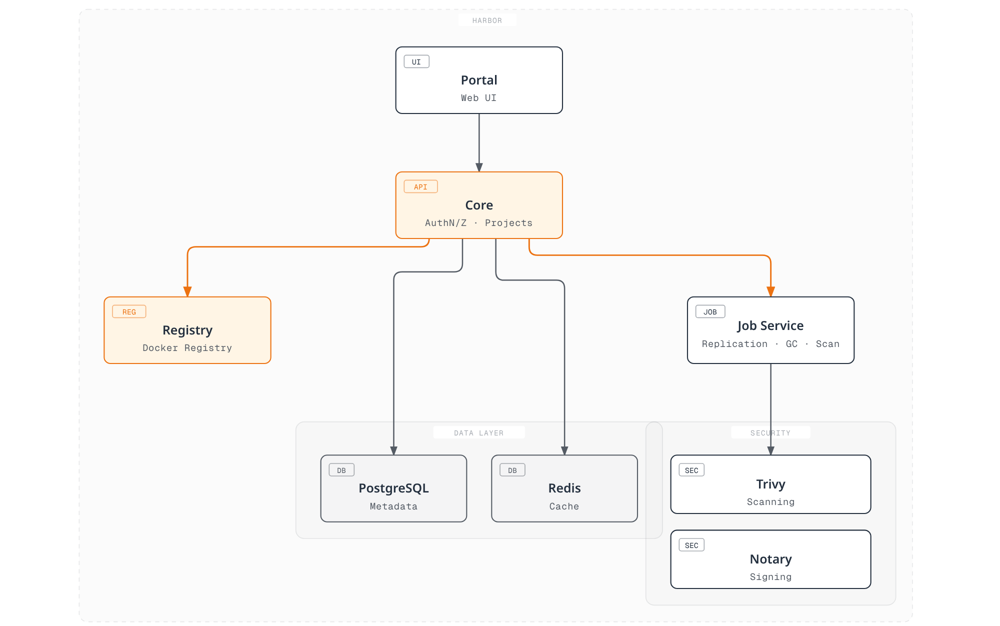
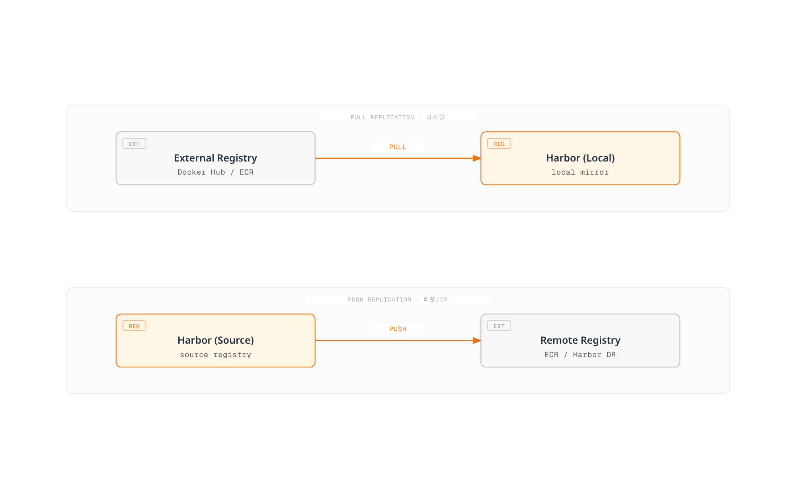
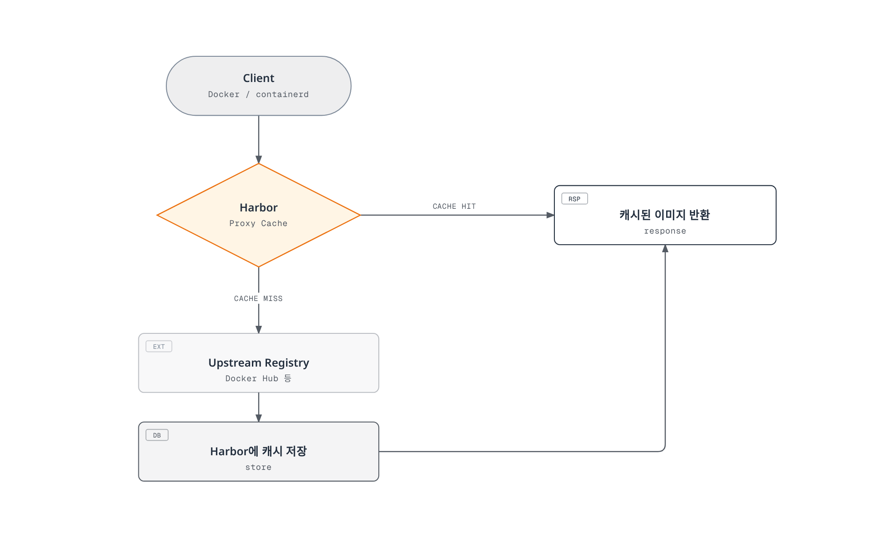

# Harbor

> **마지막 업데이트**: 2026년 2월 25일

## 개요

Harbor는 CNCF Graduated 프로젝트로, 오픈소스 컨테이너 레지스트리입니다. 보안, 정책, 역할 기반 접근 제어를 제공하며, 특히 에어갭(폐쇄망) 환경에서 Kubernetes 클러스터를 운영할 때 필수적인 솔루션입니다.

### 아키텍처



### 주요 컴포넌트

| 컴포넌트 | 역할 | 설명 |
|----------|------|------|
| **Core** | API 및 인증 | 사용자 인증, 프로젝트 관리, API 제공 |
| **Registry** | 이미지 저장 | Docker Distribution (registry:2) 기반 |
| **Job Service** | 비동기 작업 | 복제, GC, 스캐닝 작업 처리 |
| **Portal** | Web UI | 관리 대시보드 |
| **Trivy** | 취약점 스캐닝 | 이미지 보안 스캔 |
| **Notary** | 이미지 서명 | Content Trust (선택적) |
| **PostgreSQL** | 메타데이터 | 프로젝트, 사용자, 정책 저장 |
| **Redis** | 캐시 | 세션, 작업 큐 |

---

## Helm을 사용한 설치

### 사전 요구사항

```bash
# Helm 3 설치 확인
helm version

# 네임스페이스 생성
kubectl create namespace harbor

# 스토리지 클래스 확인
kubectl get storageclass
```

### Helm Chart 설치

```bash
# Harbor Helm repo 추가
helm repo add harbor https://helm.goharbor.io
helm repo update

# 기본 설치 (테스트용)
helm install harbor harbor/harbor \
  --namespace harbor \
  --set expose.type=loadBalancer \
  --set externalURL=https://harbor.example.com \
  --set harborAdminPassword=Harbor12345

# 프로덕션 설치 (values 파일 사용)
helm install harbor harbor/harbor \
  --namespace harbor \
  -f values.yaml
```

### 프로덕션 values.yaml

```yaml
# values.yaml

# 외부 접근 설정
expose:
  type: ingress
  tls:
    enabled: true
    certSource: secret
    secret:
      secretName: harbor-tls
  ingress:
    hosts:
      core: harbor.example.com
    className: nginx
    annotations:
      nginx.ingress.kubernetes.io/ssl-redirect: "true"
      nginx.ingress.kubernetes.io/proxy-body-size: "0"
      nginx.ingress.kubernetes.io/proxy-read-timeout: "600"
      nginx.ingress.kubernetes.io/proxy-send-timeout: "600"

# 외부 URL (필수)
externalURL: https://harbor.example.com

# 관리자 비밀번호
harborAdminPassword: "<strong-password>"

# 내부 TLS
internalTLS:
  enabled: true

# 영구 저장소 설정
persistence:
  enabled: true
  resourcePolicy: "keep"
  persistentVolumeClaim:
    registry:
      storageClass: "gp3"
      size: 100Gi
    jobservice:
      storageClass: "gp3"
      size: 10Gi
    database:
      storageClass: "gp3"
      size: 10Gi
    redis:
      storageClass: "gp3"
      size: 5Gi
    trivy:
      storageClass: "gp3"
      size: 5Gi

# 외부 데이터베이스 사용 (프로덕션 권장)
database:
  type: external
  external:
    host: "harbor-db.cluster-xxxxx.ap-northeast-2.rds.amazonaws.com"
    port: "5432"
    username: "harbor"
    password: "<db-password>"
    coreDatabase: "harbor_core"
    sslmode: "require"

# 외부 Redis 사용 (프로덕션 권장)
redis:
  type: external
  external:
    addr: "harbor-redis.xxxxx.cache.amazonaws.com:6379"
    password: ""

# Trivy 스캐너 설정
trivy:
  enabled: true
  gitHubToken: "<github-token>"  # 취약점 DB 다운로드용

# 메트릭 (Prometheus)
metrics:
  enabled: true
  serviceMonitor:
    enabled: true

# 리소스 제한
core:
  resources:
    requests:
      cpu: 100m
      memory: 256Mi
    limits:
      cpu: 1000m
      memory: 1Gi

registry:
  resources:
    requests:
      cpu: 100m
      memory: 256Mi
    limits:
      cpu: 2000m
      memory: 2Gi

jobservice:
  resources:
    requests:
      cpu: 100m
      memory: 256Mi
    limits:
      cpu: 1000m
      memory: 1Gi
```

### 설치 확인

```bash
# Pod 상태 확인
kubectl get pods -n harbor

# 서비스 확인
kubectl get svc -n harbor

# Ingress 확인
kubectl get ingress -n harbor

# 로그인 테스트
docker login harbor.example.com -u admin
# Password: <harborAdminPassword>
```

---

## 프로젝트 및 RBAC

### 프로젝트 유형

| 유형 | 설명 | 사용 사례 |
|------|------|----------|
| **Public** | 인증 없이 pull 가능 | 공개 이미지, 베이스 이미지 |
| **Private** | 인증 필요 | 내부 애플리케이션 |

### 프로젝트 생성

```bash
# Harbor API로 프로젝트 생성
curl -X POST "https://harbor.example.com/api/v2.0/projects" \
  -H "Content-Type: application/json" \
  -u "admin:Harbor12345" \
  -d '{
    "project_name": "myapp",
    "metadata": {
      "public": "false",
      "enable_content_trust": "true",
      "auto_scan": "true",
      "severity": "high"
    },
    "storage_limit": 10737418240
  }'
```

### 멤버 역할

| 역할 | 권한 | 설명 |
|------|------|------|
| **Project Admin** | 전체 | 프로젝트 설정, 멤버 관리 |
| **Maintainer** | Push/Pull/Delete | 이미지 관리 |
| **Developer** | Push/Pull | 이미지 업로드/다운로드 |
| **Guest** | Pull | 읽기 전용 |
| **Limited Guest** | Pull (특정 태그) | 제한된 읽기 |

### 멤버 추가

```bash
# 사용자 멤버 추가
curl -X POST "https://harbor.example.com/api/v2.0/projects/myapp/members" \
  -H "Content-Type: application/json" \
  -u "admin:Harbor12345" \
  -d '{
    "role_id": 2,
    "member_user": {
      "username": "developer1"
    }
  }'

# role_id: 1=Admin, 2=Developer, 3=Guest, 4=Maintainer
```

### Robot Accounts

CI/CD 파이프라인용 서비스 계정:

```bash
# Robot Account 생성
curl -X POST "https://harbor.example.com/api/v2.0/projects/myapp/robots" \
  -H "Content-Type: application/json" \
  -u "admin:Harbor12345" \
  -d '{
    "name": "ci-pipeline",
    "description": "CI/CD pipeline robot",
    "duration": 365,
    "level": "project",
    "permissions": [
      {
        "kind": "project",
        "namespace": "myapp",
        "access": [
          {"resource": "repository", "action": "push"},
          {"resource": "repository", "action": "pull"},
          {"resource": "artifact", "action": "read"},
          {"resource": "scan", "action": "create"}
        ]
      }
    ]
  }'

# 응답에서 name과 secret 저장
# name: robot$myapp+ci-pipeline
# secret: <generated-token>
```

```bash
# Robot Account로 Docker 로그인
docker login harbor.example.com \
  -u 'robot$myapp+ci-pipeline' \
  -p '<generated-token>'
```

---

## 이미지 복제



### 복제 모드

| 모드 | 방향 | 설명 | 사용 사례 |
|------|------|------|----------|
| **Pull** | 외부 → Harbor | 외부 이미지를 Harbor로 복제 | 미러링, 캐싱 |
| **Push** | Harbor → 외부 | Harbor 이미지를 외부로 복제 | 배포, DR |

### Pull Replication (미러링)

Docker Hub 이미지를 Harbor로 미러링:

```bash
# 1. Registry Endpoint 생성 (Docker Hub)
curl -X POST "https://harbor.example.com/api/v2.0/registries" \
  -H "Content-Type: application/json" \
  -u "admin:Harbor12345" \
  -d '{
    "name": "docker-hub",
    "type": "docker-hub",
    "url": "https://hub.docker.com",
    "credential": {
      "type": "basic",
      "access_key": "<dockerhub-username>",
      "access_secret": "<dockerhub-password>"
    }
  }'

# 2. Replication Rule 생성
curl -X POST "https://harbor.example.com/api/v2.0/replication/policies" \
  -H "Content-Type: application/json" \
  -u "admin:Harbor12345" \
  -d '{
    "name": "mirror-nginx",
    "src_registry": {
      "id": 1
    },
    "dest_namespace": "docker-cache",
    "filters": [
      {"type": "name", "value": "library/nginx"},
      {"type": "tag", "value": "1.*"}
    ],
    "trigger": {
      "type": "scheduled",
      "trigger_settings": {
        "cron": "0 0 * * *"
      }
    },
    "enabled": true,
    "deletion": false
  }'
```

### Push Replication (DR/배포)

Harbor에서 다른 레지스트리로 복제:

```yaml
# Web UI에서 설정하는 경우:
# 1. Administration > Registries > + New Endpoint
#    - Provider: AWS ECR / Harbor / etc.
#    - Endpoint URL: https://123456789012.dkr.ecr.ap-northeast-2.amazonaws.com
#    - Credential: AWS Access Key

# 2. Projects > myapp > Replication > + New Rule
#    - Name: push-to-ecr
#    - Replication mode: Push-based
#    - Source: myapp/**
#    - Destination: ECR endpoint
#    - Trigger: Event Based (on push)
```

### 스케줄된 복제

```bash
# 매일 자정 복제
curl -X POST "https://harbor.example.com/api/v2.0/replication/policies" \
  -H "Content-Type: application/json" \
  -u "admin:Harbor12345" \
  -d '{
    "name": "daily-sync",
    "src_registry": {"id": 1},
    "dest_namespace": "mirror",
    "filters": [
      {"type": "name", "value": "**"},
      {"type": "tag", "value": "v*"}
    ],
    "trigger": {
      "type": "scheduled",
      "trigger_settings": {
        "cron": "0 0 * * *"
      }
    },
    "enabled": true
  }'
```

---

## 취약점 스캐닝

### Trivy 통합

Harbor는 기본적으로 Trivy를 취약점 스캐너로 사용합니다.

**스캐닝 설정:**

```yaml
# values.yaml
trivy:
  enabled: true
  # GitHub Token (취약점 DB 다운로드 rate limit 방지)
  gitHubToken: "<github-personal-access-token>"
  # 오프라인 모드 (에어갭)
  offlineScan: false
  # 타임아웃
  timeout: 5m0s

# 프로젝트별 자동 스캐닝
# Web UI: Projects > Settings > Auto scan images on push
```

### 수동 스캐닝

```bash
# 특정 이미지 스캔
curl -X POST "https://harbor.example.com/api/v2.0/projects/myapp/repositories/backend/artifacts/sha256:abc123/scan" \
  -u "admin:Harbor12345"

# 스캔 결과 조회
curl "https://harbor.example.com/api/v2.0/projects/myapp/repositories/backend/artifacts/sha256:abc123/additions/vulnerabilities" \
  -u "admin:Harbor12345" | jq .
```

### CVE Allowlist

알려진 취약점을 예외 처리:

```bash
# 프로젝트 CVE Allowlist 설정
curl -X PUT "https://harbor.example.com/api/v2.0/projects/myapp" \
  -H "Content-Type: application/json" \
  -u "admin:Harbor12345" \
  -d '{
    "metadata": {
      "auto_scan": "true"
    },
    "cve_allowlist": {
      "items": [
        {"cve_id": "CVE-2021-44228"},
        {"cve_id": "CVE-2022-12345"}
      ],
      "expires_at": 1735689600
    }
  }'
```

### 스캔 정책 적용

특정 심각도 이상의 취약점이 있으면 pull 차단:

```yaml
# 프로젝트 설정
# Web UI: Projects > Configuration
# - Prevent vulnerable images from running: Yes
# - Severity: Critical, High
```

---

## 이미지 서명

### Cosign 통합 (권장)

Sigstore Cosign을 사용한 이미지 서명:

```bash
# Cosign 설치
brew install cosign  # macOS
# 또는
go install github.com/sigstore/cosign/v2/cmd/cosign@latest

# 키 쌍 생성
cosign generate-key-pair

# 이미지 서명
cosign sign --key cosign.key harbor.example.com/myapp/backend:v1.0.0

# 서명 검증
cosign verify --key cosign.pub harbor.example.com/myapp/backend:v1.0.0
```

### Notation 통합

```bash
# Notation 설치
brew install notation  # macOS

# 키 생성 (self-signed)
notation cert generate-test --default "mycompany.com"

# 이미지 서명
notation sign harbor.example.com/myapp/backend:v1.0.0

# 서명 검증
notation verify harbor.example.com/myapp/backend:v1.0.0
```

### Harbor에서 서명 강제

```yaml
# 프로젝트 설정
# Web UI: Projects > Configuration
# - Content Trust: Enable content trust
# - Cosign: Enable cosign

# 서명되지 않은 이미지 pull 시도 시 에러
docker pull harbor.example.com/myapp/unsigned:latest
# Error: image is not signed
```

---

## 에어갭 환경에서의 Harbor

### 오프라인 설치

**1. 온라인 환경에서 이미지 다운로드:**

```bash
# Harbor offline installer 다운로드
wget https://github.com/goharbor/harbor/releases/download/v2.10.0/harbor-offline-installer-v2.10.0.tgz

# 압축 해제
tar xvf harbor-offline-installer-v2.10.0.tgz
cd harbor

# Docker 이미지 추출 (tar)
docker save \
  goharbor/harbor-core:v2.10.0 \
  goharbor/harbor-db:v2.10.0 \
  goharbor/harbor-jobservice:v2.10.0 \
  goharbor/registry-photon:v2.10.0 \
  goharbor/harbor-portal:v2.10.0 \
  goharbor/trivy-adapter-photon:v2.10.0 \
  goharbor/redis-photon:v2.10.0 \
  -o harbor-images.tar
```

**2. 에어갭 환경으로 전송:**

```bash
# USB, DVD, 또는 내부 파일 서버를 통해 전송
scp harbor-images.tar user@airgap-server:/tmp/
scp harbor-offline-installer-v2.10.0.tgz user@airgap-server:/tmp/
```

**3. 에어갭 환경에서 설치:**

```bash
# 이미지 로드
docker load -i harbor-images.tar

# Harbor 설치
tar xvf harbor-offline-installer-v2.10.0.tgz
cd harbor
cp harbor.yml.tmpl harbor.yml

# harbor.yml 편집
vim harbor.yml

# 설치 실행
./install.sh --with-trivy
```

### Kubernetes용 에어갭 이미지 준비

```bash
#!/bin/bash
# save-k8s-images.sh

IMAGES=(
  "registry.k8s.io/kube-apiserver:v1.29.0"
  "registry.k8s.io/kube-controller-manager:v1.29.0"
  "registry.k8s.io/kube-scheduler:v1.29.0"
  "registry.k8s.io/kube-proxy:v1.29.0"
  "registry.k8s.io/pause:3.9"
  "registry.k8s.io/coredns/coredns:v1.11.1"
  "registry.k8s.io/etcd:3.5.10-0"
  "quay.io/cilium/cilium:v1.15.0"
  "quay.io/cilium/operator-generic:v1.15.0"
)

# 이미지 pull 및 저장
for img in "${IMAGES[@]}"; do
  docker pull $img
done

docker save "${IMAGES[@]}" -o k8s-images.tar
echo "Saved ${#IMAGES[@]} images to k8s-images.tar"
```

### 에어갭 Harbor로 이미지 업로드

```bash
#!/bin/bash
# load-to-harbor.sh

HARBOR_URL="harbor.airgap.local"
PROJECT="k8s-system"

# 이미지 로드
docker load -i k8s-images.tar

# Harbor 로그인
docker login $HARBOR_URL -u admin

# 이미지 리태그 및 푸시
IMAGES=(
  "registry.k8s.io/kube-apiserver:v1.29.0"
  "registry.k8s.io/kube-controller-manager:v1.29.0"
  # ... 기타 이미지
)

for img in "${IMAGES[@]}"; do
  # 원본 태그에서 이미지 이름 추출
  name=$(echo $img | sed 's|.*/||')

  # Harbor로 리태그
  docker tag $img $HARBOR_URL/$PROJECT/$name

  # 푸시
  docker push $HARBOR_URL/$PROJECT/$name
done
```

### 에어갭 클러스터 containerd 설정

```toml
# /etc/containerd/config.toml

[plugins."io.containerd.grpc.v1.cri".registry]
  [plugins."io.containerd.grpc.v1.cri".registry.mirrors]
    [plugins."io.containerd.grpc.v1.cri".registry.mirrors."docker.io"]
      endpoint = ["https://harbor.airgap.local/v2/docker-cache"]

    [plugins."io.containerd.grpc.v1.cri".registry.mirrors."registry.k8s.io"]
      endpoint = ["https://harbor.airgap.local/v2/k8s-system"]

    [plugins."io.containerd.grpc.v1.cri".registry.mirrors."quay.io"]
      endpoint = ["https://harbor.airgap.local/v2/quay-cache"]

  [plugins."io.containerd.grpc.v1.cri".registry.configs]
    [plugins."io.containerd.grpc.v1.cri".registry.configs."harbor.airgap.local".tls]
      ca_file = "/etc/containerd/certs.d/harbor.airgap.local/ca.crt"

    [plugins."io.containerd.grpc.v1.cri".registry.configs."harbor.airgap.local".auth]
      username = "admin"
      password = "Harbor12345"
```

---

## Harbor + Kubernetes 통합

### imagePullSecrets 설정

```bash
# Harbor 자격 증명 Secret 생성
kubectl create secret docker-registry harbor-secret \
  --docker-server=harbor.example.com \
  --docker-username=robot\$myapp+k8s-pull \
  --docker-password=<robot-token> \
  -n default
```

```yaml
# Pod에서 사용
apiVersion: v1
kind: Pod
metadata:
  name: myapp
spec:
  containers:
  - name: myapp
    image: harbor.example.com/myapp/backend:v1.0.0
  imagePullSecrets:
  - name: harbor-secret
```

### Proxy Cache



Harbor를 외부 레지스트리의 프록시 캐시로 사용:

```yaml
# Harbor 프록시 캐시 프로젝트 생성
# Web UI: Projects > + New Project
# - Project Name: docker-hub-cache
# - Access Level: Public (또는 Private)
# - Proxy Cache: Enable
# - Registry: docker-hub (사전 등록된 endpoint)

# 사용 예시
# 원본: docker.io/library/nginx:1.25
# 캐시: harbor.example.com/docker-hub-cache/library/nginx:1.25
```

### Garbage Collection

사용되지 않는 blob 정리:

```bash
# GC 실행 (API)
curl -X POST "https://harbor.example.com/api/v2.0/system/gc/schedule" \
  -H "Content-Type: application/json" \
  -u "admin:Harbor12345" \
  -d '{
    "schedule": {
      "type": "Manual"
    },
    "parameters": {
      "delete_untagged": true,
      "dry_run": false
    }
  }'

# GC 상태 확인
curl "https://harbor.example.com/api/v2.0/system/gc" \
  -u "admin:Harbor12345" | jq .
```

**스케줄된 GC:**

```yaml
# Web UI: Administration > Garbage Collection
# Schedule: Weekly on Sunday at 00:00
# Delete untagged artifacts: Yes
```

### Tag Retention Policy

이미지 보존 정책:

```bash
# 태그 보존 규칙 생성
curl -X POST "https://harbor.example.com/api/v2.0/projects/myapp/tag-retention" \
  -H "Content-Type: application/json" \
  -u "admin:Harbor12345" \
  -d '{
    "algorithm": "or",
    "rules": [
      {
        "action": "retain",
        "template": "latestPushedK",
        "params": {
          "latestPushedK": 10
        },
        "tag_selectors": [
          {"kind": "doublestar", "decoration": "matches", "pattern": "v*"}
        ],
        "scope_selectors": {
          "repository": [
            {"kind": "doublestar", "decoration": "matches", "pattern": "**"}
          ]
        }
      }
    ],
    "trigger": {
      "kind": "Schedule",
      "settings": {
        "cron": "0 0 * * *"
      }
    },
    "scope": {
      "level": "project",
      "ref": 1
    }
  }'
```

---

## 모범 사례

### 1. 고가용성 구성

```yaml
# values.yaml - HA 설정
core:
  replicas: 2
  affinity:
    podAntiAffinity:
      requiredDuringSchedulingIgnoredDuringExecution:
      - labelSelector:
          matchLabels:
            component: core
        topologyKey: kubernetes.io/hostname

registry:
  replicas: 2
  affinity:
    podAntiAffinity:
      requiredDuringSchedulingIgnoredDuringExecution:
      - labelSelector:
          matchLabels:
            component: registry
        topologyKey: kubernetes.io/hostname

# 외부 DB 및 Redis 사용 (단일 장애점 제거)
database:
  type: external
  external:
    host: "harbor-db.cluster-xxxxx.rds.amazonaws.com"

redis:
  type: external
  external:
    addr: "harbor-redis.xxxxx.cache.amazonaws.com:6379"

# S3 스토리지 (공유 스토리지)
persistence:
  imageChartStorage:
    type: s3
    s3:
      region: ap-northeast-2
      bucket: harbor-registry
      accesskey: AKIAXXXXXXXX
      secretkey: <secret>
```

### 2. 보안 강화

```yaml
# TLS 필수
expose:
  tls:
    enabled: true
    certSource: secret

internalTLS:
  enabled: true

# 강력한 비밀번호 정책
# Web UI: Administration > Configuration > Authentication
# - Password min length: 12
# - Password must contain: uppercase, lowercase, number, special char

# Robot Account 만료 설정
# duration: 90 (days)
```

### 3. 백업 전략

```bash
#!/bin/bash
# harbor-backup.sh

BACKUP_DIR="/backup/harbor/$(date +%Y%m%d)"
mkdir -p $BACKUP_DIR

# 1. Database 백업
pg_dump -h harbor-db.rds.amazonaws.com \
  -U harbor harbor_core > $BACKUP_DIR/harbor_core.sql

# 2. Registry 데이터 (S3 사용 시 S3 복제 활용)
aws s3 sync s3://harbor-registry s3://harbor-registry-backup

# 3. Harbor 설정
kubectl get secret -n harbor -o yaml > $BACKUP_DIR/secrets.yaml
kubectl get configmap -n harbor -o yaml > $BACKUP_DIR/configmaps.yaml
helm get values harbor -n harbor > $BACKUP_DIR/values.yaml
```

### 4. 모니터링

```yaml
# ServiceMonitor for Prometheus
apiVersion: monitoring.coreos.com/v1
kind: ServiceMonitor
metadata:
  name: harbor
  namespace: monitoring
spec:
  selector:
    matchLabels:
      app: harbor
  namespaceSelector:
    matchNames:
    - harbor
  endpoints:
  - port: http-metrics
    interval: 30s
    path: /metrics
```

---

## 요약

| 항목 | 권장 사항 |
|------|----------|
| **설치** | Helm + 외부 DB/Redis (프로덕션) |
| **접근 제어** | RBAC + Robot Accounts (CI/CD) |
| **스캐닝** | Trivy 자동 스캔 활성화 |
| **서명** | Cosign (권장) |
| **복제** | Pull (미러링) + Push (DR) |
| **에어갭** | Offline installer + 이미지 preload |
| **HA** | 2+ replicas + 외부 DB/Redis + S3 |
| **백업** | DB dump + S3 복제 |

---

## 참고 자료

- [Harbor 공식 문서](https://goharbor.io/docs/)
- [Harbor Helm Chart](https://github.com/goharbor/harbor-helm)
- [Harbor API Reference](https://editor.swagger.io/?url=https://raw.githubusercontent.com/goharbor/harbor/main/api/v2.0/swagger.yaml)
- [Trivy Documentation](https://aquasecurity.github.io/trivy/)
- [Cosign Documentation](https://docs.sigstore.dev/cosign/overview/)
- [Harbor in Air-gapped Environment](https://goharbor.io/docs/2.10.0/install-config/configure-yml-file/)
