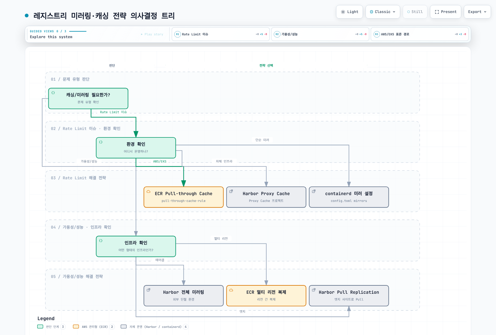
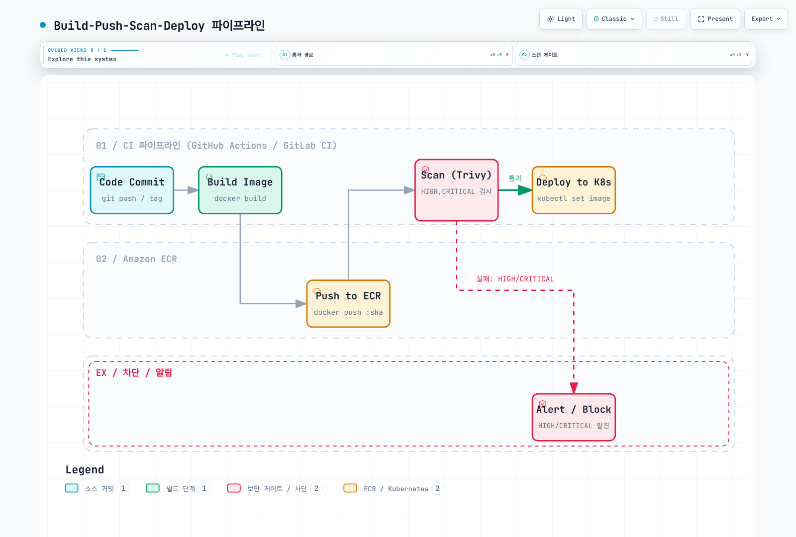

# 컨테이너 레지스트리 모범 사례

> **마지막 업데이트**: 2026년 2월 25일

## 개요

이 문서는 Docker Hub, Amazon ECR, Harbor 등 컨테이너 레지스트리를 운영할 때 적용해야 할 모범 사례를 다룹니다. 태그 전략, 보안, 비용 최적화, CI/CD 통합 패턴을 포함합니다.

---

## 태그 관리 전략

### Immutable Tags 사용

**프로덕션 환경에서는 반드시 immutable tags를 사용합니다:**

```yaml
# ❌ 문제: Mutable 태그
image: myapp:latest
# - 배포 간 이미지가 다를 수 있음
# - 롤백 시 어떤 버전인지 불명확
# - 감사 추적 불가

# ✅ 해결: Immutable 태그
image: myapp:v1.2.3
# - 항상 동일한 이미지 보장
# - 명확한 버전 추적
# - 재현 가능한 배포
```

**ECR Immutable Tags 설정:**

```bash
aws ecr put-image-tag-mutability \
  --repository-name myapp-prod \
  --image-tag-mutability IMMUTABLE
```

### Semantic Versioning

```
MAJOR.MINOR.PATCH

예시:
1.0.0  - 초기 릴리스
1.1.0  - 하위 호환 기능 추가
1.1.1  - 버그 수정
2.0.0  - 하위 호환성 깨지는 변경
```

**버전 태그 자동화 (Git Tag 기반):**

```bash
#!/bin/bash
# version-tag.sh

# Git 태그에서 버전 추출
VERSION=$(git describe --tags --abbrev=0 2>/dev/null || echo "0.0.0")

# 버전 파싱
MAJOR=$(echo $VERSION | cut -d. -f1 | tr -d 'v')
MINOR=$(echo $VERSION | cut -d. -f2)
PATCH=$(echo $VERSION | cut -d. -f3)

# 이미지 태그
docker tag myapp:build \
  ${ECR_REPO}:${MAJOR}.${MINOR}.${PATCH} \
  ${ECR_REPO}:${MAJOR}.${MINOR} \
  ${ECR_REPO}:${MAJOR}

# 푸시
docker push ${ECR_REPO}:${MAJOR}.${MINOR}.${PATCH}
docker push ${ECR_REPO}:${MAJOR}.${MINOR}
docker push ${ECR_REPO}:${MAJOR}
```

### :latest 태그 금지

```yaml
# ❌ 프로덕션에서 절대 사용 금지
image: nginx:latest
image: myapp:latest

# ✅ 명시적 버전 사용
image: nginx:1.25.3
image: myapp:v1.2.3

# ✅ 또는 다이제스트 사용
image: nginx@sha256:abc123def456...
```

**Kubernetes Admission Controller로 :latest 차단:**

```yaml
# Kyverno 정책
apiVersion: kyverno.io/v1
kind: ClusterPolicy
metadata:
  name: disallow-latest-tag
spec:
  validationFailureAction: Enforce
  rules:
  - name: require-specific-tag
    match:
      any:
      - resources:
          kinds:
          - Pod
    validate:
      message: "Using ':latest' tag is not allowed. Use a specific version tag."
      pattern:
        spec:
          containers:
          - image: "!*:latest"
          initContainers:
          - image: "!*:latest"
```

### Tag Promotion Workflow

```
┌─────────────┐     ┌─────────────┐     ┌─────────────┐     ┌─────────────┐
│    Build    │────▶│     Dev     │────▶│   Staging   │────▶│ Production  │
│             │     │             │     │             │     │             │
│ sha-abc123  │     │ dev-abc123  │     │stage-1.2.3  │     │   v1.2.3    │
└─────────────┘     └─────────────┘     └─────────────┘     └─────────────┘
```

**프로모션 스크립트:**

```bash
#!/bin/bash
# promote-image.sh

promote() {
  local SOURCE_TAG=$1
  local TARGET_TAG=$2
  local REPO=$3

  # 이미지 매니페스트 복사 (pull/push 없이)
  MANIFEST=$(aws ecr batch-get-image \
    --repository-name $REPO \
    --image-ids imageTag=$SOURCE_TAG \
    --query 'images[].imageManifest' \
    --output text)

  aws ecr put-image \
    --repository-name $REPO \
    --image-tag $TARGET_TAG \
    --image-manifest "$MANIFEST"
}

# dev -> staging
promote "dev-abc123" "stage-1.2.3" "myapp"

# staging -> prod
promote "stage-1.2.3" "v1.2.3" "myapp"
```

---

## 이미지 네이밍 컨벤션

### 표준 형식

```
[registry/]organization/application:tag

예시:
docker.io/myorg/backend:v1.2.3
123456789012.dkr.ecr.ap-northeast-2.amazonaws.com/myapp:v1.2.3
harbor.example.com/platform/api-gateway:2.0.0
```

### 환경 접두사

```yaml
# 개발 환경
image: myapp-dev:abc123
image: myapp:dev-abc123

# 스테이징 환경
image: myapp-stage:1.2.3
image: myapp:stage-1.2.3

# 프로덕션 환경
image: myapp-prod:1.2.3
image: myapp:v1.2.3  # SemVer만 (환경 접두사 없음)
```

### Multi-arch 태그

```bash
# 멀티 아키텍처 이미지 빌드
docker buildx build \
  --platform linux/amd64,linux/arm64 \
  --tag myapp:v1.2.3 \
  --push .

# 아키텍처별 태그 (필요시)
myapp:v1.2.3          # 멀티 아키텍처 매니페스트
myapp:v1.2.3-amd64    # x86_64 전용
myapp:v1.2.3-arm64    # ARM64 전용
```

### 메타데이터 태그

```dockerfile
# Dockerfile
ARG BUILD_DATE
ARG VCS_REF
ARG VERSION

LABEL org.opencontainers.image.created="${BUILD_DATE}" \
      org.opencontainers.image.revision="${VCS_REF}" \
      org.opencontainers.image.version="${VERSION}" \
      org.opencontainers.image.source="https://github.com/myorg/myapp"
```

```bash
# 빌드 시 인자 전달
docker build \
  --build-arg BUILD_DATE=$(date -u +'%Y-%m-%dT%H:%M:%SZ') \
  --build-arg VCS_REF=$(git rev-parse --short HEAD) \
  --build-arg VERSION=1.2.3 \
  -t myapp:v1.2.3 .
```

---

## 레지스트리 미러링 및 캐싱



[🔍 인터랙티브 다이어그램 보기](https://www.atomai.click/kubernetes-docs/archmaps/ko-container-registry-04-best-practices-0.html)

### containerd 레지스트리 미러 설정

```toml
# /etc/containerd/config.toml

version = 2

[plugins."io.containerd.grpc.v1.cri".registry]
  [plugins."io.containerd.grpc.v1.cri".registry.mirrors]
    # Docker Hub 미러
    [plugins."io.containerd.grpc.v1.cri".registry.mirrors."docker.io"]
      endpoint = ["https://mirror.example.com", "https://registry-1.docker.io"]

    # Kubernetes 레지스트리 미러
    [plugins."io.containerd.grpc.v1.cri".registry.mirrors."registry.k8s.io"]
      endpoint = ["https://mirror.example.com/k8s", "https://registry.k8s.io"]

    # Quay.io 미러
    [plugins."io.containerd.grpc.v1.cri".registry.mirrors."quay.io"]
      endpoint = ["https://mirror.example.com/quay", "https://quay.io"]
```

### ECR Pull-through Cache

```bash
# Docker Hub 캐시
aws ecr create-pull-through-cache-rule \
  --ecr-repository-prefix docker-hub \
  --upstream-registry-url registry-1.docker.io \
  --credential-arn arn:aws:secretsmanager:ap-northeast-2:123456789012:secret:dockerhub-creds

# Quay.io 캐시
aws ecr create-pull-through-cache-rule \
  --ecr-repository-prefix quay \
  --upstream-registry-url quay.io

# 사용 예시
# docker.io/library/nginx:1.25
# -> 123456789012.dkr.ecr.ap-northeast-2.amazonaws.com/docker-hub/library/nginx:1.25
```

### Harbor Proxy Cache

```yaml
# Harbor 프로젝트 설정
# Web UI: Projects > New Project
# - Project Name: docker-hub-cache
# - Proxy Cache: Enable
# - Registry: Docker Hub (endpoint)

# containerd에서 사용
[plugins."io.containerd.grpc.v1.cri".registry.mirrors."docker.io"]
  endpoint = ["https://harbor.internal/v2/docker-hub-cache"]
```

### 외부 의존성 최소화

```yaml
# 외부 레지스트리 직접 참조 (비권장)
containers:
- name: app
  image: docker.io/library/nginx:1.25
- name: sidecar
  image: quay.io/prometheus/prometheus:v2.48.0

# 내부 캐시/미러 사용 (권장)
containers:
- name: app
  image: 123456789012.dkr.ecr.ap-northeast-2.amazonaws.com/docker-hub/library/nginx:1.25
- name: sidecar
  image: 123456789012.dkr.ecr.ap-northeast-2.amazonaws.com/quay/prometheus/prometheus:v2.48.0
```

---

## 재해 복구

### 멀티 리전 복제

**ECR 복제:**

```bash
# AWS CLI로 복제 구성
aws ecr put-replication-configuration \
  --replication-configuration '{
    "rules": [
      {
        "destinations": [
          {"region": "us-west-2", "registryId": "123456789012"},
          {"region": "eu-west-1", "registryId": "123456789012"}
        ],
        "repositoryFilters": [
          {"filter": "prod-", "filterType": "PREFIX_MATCH"}
        ]
      }
    ]
  }'
```

**Harbor 복제:**

```bash
# Push-based 복제 (Primary -> DR)
curl -X POST "https://harbor-primary.example.com/api/v2.0/replication/policies" \
  -H "Content-Type: application/json" \
  -u "admin:password" \
  -d '{
    "name": "dr-replication",
    "src_registry": null,
    "dest_registry": {"id": 1},
    "dest_namespace": "mirror",
    "filters": [{"type": "name", "value": "prod/**"}],
    "trigger": {"type": "event_based"},
    "enabled": true
  }'
```

### 백업 전략

**ECR 백업 (S3 Export):**

```bash
#!/bin/bash
# ecr-backup.sh

REPOS=$(aws ecr describe-repositories --query 'repositories[].repositoryName' --output text)

for repo in $REPOS; do
  echo "Backing up $repo..."

  # 모든 이미지 태그 조회
  TAGS=$(aws ecr describe-images \
    --repository-name $repo \
    --query 'imageDetails[].imageTags[]' \
    --output text)

  for tag in $TAGS; do
    # 이미지 pull
    docker pull ${ECR_REGISTRY}/${repo}:${tag}

    # tar로 저장
    docker save ${ECR_REGISTRY}/${repo}:${tag} | \
      gzip > backup/${repo}_${tag}.tar.gz

    # S3 업로드
    aws s3 cp backup/${repo}_${tag}.tar.gz \
      s3://ecr-backup/${repo}/${tag}.tar.gz
  done
done
```

### RTO/RPO 고려사항

| 복제 전략 | RPO | RTO | 비용 |
|----------|-----|-----|------|
| 실시간 복제 | ~0 | 분 단위 | 높음 |
| 스케줄 복제 (1시간) | 1시간 | 분 단위 | 중간 |
| 백업 복원 | 백업 주기 | 시간 단위 | 낮음 |

**권장 구성:**

```yaml
프로덕션 이미지:
  복제: 실시간 (event-based)
  백업: 일간
  RPO: ~0
  RTO: 5분

개발 이미지:
  복제: 스케줄 (6시간)
  백업: 주간
  RPO: 6시간
  RTO: 30분
```

---

## 비용 최적화

### Lifecycle Policies

**ECR:**

```json
{
  "rules": [
    {
      "rulePriority": 1,
      "description": "개발 이미지 30일 후 삭제",
      "selection": {
        "tagStatus": "tagged",
        "tagPatternList": ["dev-*", "feature-*", "pr-*"],
        "countType": "sinceImagePushed",
        "countNumber": 30,
        "countUnit": "days"
      },
      "action": {"type": "expire"}
    },
    {
      "rulePriority": 2,
      "description": "태그 없는 이미지 즉시 삭제",
      "selection": {
        "tagStatus": "untagged",
        "countType": "sinceImagePushed",
        "countNumber": 1,
        "countUnit": "days"
      },
      "action": {"type": "expire"}
    }
  ]
}
```

**Harbor:**

```bash
# Tag Retention Policy
curl -X POST "https://harbor.example.com/api/v2.0/projects/myapp/tag-retention" \
  -u "admin:password" \
  -d '{
    "algorithm": "or",
    "rules": [
      {
        "template": "latestPushedK",
        "params": {"latestPushedK": 10},
        "tag_selectors": [{"kind": "doublestar", "pattern": "dev-*"}]
      }
    ],
    "trigger": {"kind": "Schedule", "settings": {"cron": "0 0 * * *"}}
  }'
```

### 이미지 크기 최적화

**멀티스테이지 빌드:**

```dockerfile
# ❌ 비효율적 (500MB+)
FROM node:20
WORKDIR /app
COPY . .
RUN npm install && npm run build
CMD ["node", "dist/main.js"]

# ✅ 최적화 (50MB)
FROM node:20-alpine AS builder
WORKDIR /app
COPY package*.json ./
RUN npm ci --only=production
COPY . .
RUN npm run build

FROM node:20-alpine
WORKDIR /app
COPY --from=builder /app/dist ./dist
COPY --from=builder /app/node_modules ./node_modules
CMD ["node", "dist/main.js"]
```

**Distroless 이미지:**

```dockerfile
# Go 애플리케이션
FROM golang:1.21 AS builder
WORKDIR /app
COPY . .
RUN CGO_ENABLED=0 go build -o main .

FROM gcr.io/distroless/static-debian12
COPY --from=builder /app/main /
ENTRYPOINT ["/main"]
# 결과: ~5MB
```

### 전송 비용 절감

```yaml
# 리전 간 전송 최소화
# - 각 리전에 복제본 유지
# - 리전 내 ECR 사용

# ECR Private Endpoint (NAT Gateway 비용 절감)
# VPC Endpoint로 인터넷 경유 없이 ECR 접근
```

### ECR vs 자체 호스팅 비용 비교

| 항목 | ECR (500GB) | Harbor (EC2) |
|------|-------------|--------------|
| 스토리지 | $50/월 | EBS ~$40/월 |
| 컴퓨트 | 포함 | EC2 ~$100/월 |
| 전송 (리전 내) | 무료 | 무료 |
| 운영 | 없음 | 인력 비용 |
| **총 비용** | **~$50/월** | **~$140/월+** |

**결론:** 500GB 미만 규모에서는 ECR이 비용 효율적. 대규모 또는 에어갭 환경에서는 Harbor 고려.

---

## 보안 체크리스트

### 1. 이미지 스캐닝

```yaml
# ECR Enhanced Scanning
aws ecr put-registry-scanning-configuration \
  --scan-type ENHANCED \
  --rules '[{"repositoryFilters":[{"filter":"*","filterType":"WILDCARD"}],"scanFrequency":"CONTINUOUS_SCAN"}]'

# Harbor Trivy 스캐닝
# Web UI: Projects > Configuration > Auto scan images on push
```

### 2. Admission Controller (서명된 이미지만 허용)

```yaml
# Kyverno - Cosign 서명 검증
apiVersion: kyverno.io/v1
kind: ClusterPolicy
metadata:
  name: verify-image-signature
spec:
  validationFailureAction: Enforce
  webhookTimeoutSeconds: 30
  rules:
  - name: verify-signature
    match:
      any:
      - resources:
          kinds:
          - Pod
    verifyImages:
    - imageReferences:
      - "harbor.example.com/myapp/*"
      attestors:
      - count: 1
        entries:
        - keys:
            publicKeys: |-
              -----BEGIN PUBLIC KEY-----
              MFkwEwYHKoZIzj0CAQYIKoZIzj0DAQcDQgAE...
              -----END PUBLIC KEY-----
```

### 3. 최소 권한 원칙

```json
{
  "Version": "2012-10-17",
  "Statement": [
    {
      "Sid": "MinimalPullAccess",
      "Effect": "Allow",
      "Action": [
        "ecr:GetAuthorizationToken"
      ],
      "Resource": "*"
    },
    {
      "Sid": "SpecificRepoPull",
      "Effect": "Allow",
      "Action": [
        "ecr:BatchCheckLayerAvailability",
        "ecr:GetDownloadUrlForLayer",
        "ecr:BatchGetImage"
      ],
      "Resource": [
        "arn:aws:ecr:ap-northeast-2:123456789012:repository/myapp-prod",
        "arn:aws:ecr:ap-northeast-2:123456789012:repository/base-images/*"
      ]
    }
  ]
}
```

### 4. 네트워크 정책

```yaml
# 레지스트리 접근 제한
apiVersion: networking.k8s.io/v1
kind: NetworkPolicy
metadata:
  name: allow-registry-access
  namespace: production
spec:
  podSelector: {}
  policyTypes:
  - Egress
  egress:
  # ECR VPC Endpoint
  - to:
    - ipBlock:
        cidr: 10.0.0.0/16  # VPC CIDR
    ports:
    - protocol: TCP
      port: 443
  # Internal Harbor
  - to:
    - namespaceSelector:
        matchLabels:
          name: harbor
    ports:
    - protocol: TCP
      port: 443
```

### 5. 보안 체크리스트

```yaml
레지스트리 보안:
  [ ] TLS 필수 적용
  [ ] 강력한 인증 (IAM/OIDC)
  [ ] Immutable tags (프로덕션)
  [ ] 취약점 스캐닝 활성화
  [ ] 이미지 서명 적용
  [ ] Admission Controller로 정책 강제

이미지 보안:
  [ ] 최소 base image (distroless/alpine)
  [ ] 비루트 사용자 실행
  [ ] 불필요한 패키지 제거
  [ ] 시크릿 하드코딩 금지
  [ ] 멀티스테이지 빌드

접근 제어:
  [ ] 최소 권한 IAM 정책
  [ ] Robot Account (CI/CD)
  [ ] 정기적인 자격증명 로테이션
  [ ] VPC Endpoint 사용
```

---

## CI/CD 통합 패턴

### GitHub Actions + ECR

```yaml
# .github/workflows/build-push.yml
name: Build and Push to ECR

on:
  push:
    branches: [main]
    tags: ['v*']

env:
  AWS_REGION: ap-northeast-2
  ECR_REPOSITORY: myapp

jobs:
  build:
    runs-on: ubuntu-latest
    permissions:
      id-token: write
      contents: read

    steps:
    - uses: actions/checkout@v4

    - name: Configure AWS credentials
      uses: aws-actions/configure-aws-credentials@v4
      with:
        role-to-assume: arn:aws:iam::123456789012:role/github-actions-ecr
        aws-region: ${{ env.AWS_REGION }}

    - name: Login to Amazon ECR
      id: login-ecr
      uses: aws-actions/amazon-ecr-login@v2

    - name: Extract metadata
      id: meta
      uses: docker/metadata-action@v5
      with:
        images: ${{ steps.login-ecr.outputs.registry }}/${{ env.ECR_REPOSITORY }}
        tags: |
          type=ref,event=branch
          type=semver,pattern={{version}}
          type=sha,prefix=

    - name: Build and push
      uses: docker/build-push-action@v5
      with:
        context: .
        push: true
        tags: ${{ steps.meta.outputs.tags }}
        labels: ${{ steps.meta.outputs.labels }}
        cache-from: type=gha
        cache-to: type=gha,mode=max

    - name: Scan image
      uses: aquasecurity/trivy-action@master
      with:
        image-ref: ${{ steps.login-ecr.outputs.registry }}/${{ env.ECR_REPOSITORY }}:${{ github.sha }}
        format: 'sarif'
        output: 'trivy-results.sarif'

    - name: Upload scan results
      uses: github/codeql-action/upload-sarif@v3
      with:
        sarif_file: 'trivy-results.sarif'
```

### GitLab CI + ECR

```yaml
# .gitlab-ci.yml
stages:
  - build
  - scan
  - push
  - deploy

variables:
  AWS_REGION: ap-northeast-2
  ECR_REGISTRY: 123456789012.dkr.ecr.ap-northeast-2.amazonaws.com
  IMAGE_NAME: myapp

.aws_login: &aws_login
  - aws ecr get-login-password --region $AWS_REGION | docker login --username AWS --password-stdin $ECR_REGISTRY

build:
  stage: build
  image: docker:24
  services:
    - docker:24-dind
  before_script:
    - apk add --no-cache aws-cli
    - *aws_login
  script:
    - docker build -t $ECR_REGISTRY/$IMAGE_NAME:$CI_COMMIT_SHA .
    - docker push $ECR_REGISTRY/$IMAGE_NAME:$CI_COMMIT_SHA

scan:
  stage: scan
  image: aquasec/trivy:latest
  script:
    - trivy image --exit-code 1 --severity HIGH,CRITICAL $ECR_REGISTRY/$IMAGE_NAME:$CI_COMMIT_SHA
  allow_failure: false

push:
  stage: push
  image: docker:24
  services:
    - docker:24-dind
  before_script:
    - apk add --no-cache aws-cli
    - *aws_login
  script:
    - docker pull $ECR_REGISTRY/$IMAGE_NAME:$CI_COMMIT_SHA
    - docker tag $ECR_REGISTRY/$IMAGE_NAME:$CI_COMMIT_SHA $ECR_REGISTRY/$IMAGE_NAME:$CI_COMMIT_TAG
    - docker push $ECR_REGISTRY/$IMAGE_NAME:$CI_COMMIT_TAG
  only:
    - tags

deploy:
  stage: deploy
  image: bitnami/kubectl:latest
  script:
    - kubectl set image deployment/myapp myapp=$ECR_REGISTRY/$IMAGE_NAME:$CI_COMMIT_TAG -n production
  only:
    - tags
  environment:
    name: production
```

### Build-Push-Scan-Deploy 파이프라인



[🔍 인터랙티브 다이어그램 보기](https://www.atomai.click/kubernetes-docs/archmaps/ko-container-registry-04-best-practices-1.html)

### ArgoCD 이미지 업데이트 자동화

```yaml
# argocd-image-updater 설정
apiVersion: argoproj.io/v1alpha1
kind: Application
metadata:
  name: myapp
  annotations:
    argocd-image-updater.argoproj.io/image-list: myapp=123456789012.dkr.ecr.ap-northeast-2.amazonaws.com/myapp
    argocd-image-updater.argoproj.io/myapp.update-strategy: semver
    argocd-image-updater.argoproj.io/myapp.allow-tags: regexp:^v[0-9]+\.[0-9]+\.[0-9]+$
spec:
  destination:
    namespace: production
    server: https://kubernetes.default.svc
  source:
    repoURL: https://github.com/myorg/gitops
    path: apps/myapp
    targetRevision: main
```

---

## skopeo를 활용한 이미지 관리

[skopeo](https://github.com/containers/skopeo)는 컨테이너 이미지를 검사, 복사, 동기화할 수 있는 CLI 도구입니다. Docker 데몬 없이 동작하며, root 권한이 필요하지 않아 CI/CD 파이프라인과 에어갭 환경에서 특히 유용합니다.

### skopeo 설치

```bash
# RHEL/CentOS/Amazon Linux
sudo yum install -y skopeo

# Ubuntu/Debian
sudo apt-get install -y skopeo

# macOS
brew install skopeo
```

### skopeo inspect — 원격 이미지 검사

이미지를 pull하지 않고 메타데이터를 확인할 수 있습니다:

```bash
# Docker Hub 이미지 검사
skopeo inspect docker://docker.io/library/nginx:1.25

# ECR 이미지 검사 (AWS 인증 필요)
skopeo inspect docker://123456789012.dkr.ecr.ap-northeast-2.amazonaws.com/myapp:v1.0.0

# 원시 매니페스트 확인
skopeo inspect --raw docker://docker.io/library/nginx:1.25 | jq .

# 특정 아키텍처 매니페스트 확인
skopeo inspect --override-arch arm64 docker://docker.io/library/nginx:1.25
```

### skopeo copy — 레지스트리 간 이미지 복사

이미지를 로컬에 pull하지 않고 레지스트리 간 직접 복사합니다:

```bash
# Docker Hub → ECR 복사
skopeo copy \
  docker://docker.io/library/nginx:1.25 \
  docker://123456789012.dkr.ecr.ap-northeast-2.amazonaws.com/nginx:1.25

# ECR → Harbor 복사
skopeo copy \
  docker://123456789012.dkr.ecr.ap-northeast-2.amazonaws.com/myapp:v1.0.0 \
  docker://harbor.example.com/myapp/backend:v1.0.0

# 포맷 변환 (Docker → OCI)
skopeo copy \
  docker://docker.io/library/nginx:1.25 \
  oci:nginx-oci:1.25

# OCI archive로 저장
skopeo copy \
  docker://docker.io/library/nginx:1.25 \
  oci-archive:nginx-1.25.tar
```

### skopeo sync — 대량 레지스트리 동기화

여러 이미지를 한번에 동기화합니다:

```bash
# Docker Hub → ECR 동기화 (특정 이미지)
skopeo sync --src docker --dest docker \
  docker.io/library/nginx \
  123456789012.dkr.ecr.ap-northeast-2.amazonaws.com/docker-hub

# YAML 매니페스트 기반 동기화
cat > sync-manifest.yaml << 'EOF'
docker.io:
  images:
    nginx:
      - "1.25"
      - "1.24"
    redis:
      - "7-alpine"
      - "6-alpine"
  images-by-tag-regex:
    busybox:
      - "^1\\.3[5-6]"
EOF

skopeo sync --src yaml --dest docker \
  sync-manifest.yaml \
  123456789012.dkr.ecr.ap-northeast-2.amazonaws.com/mirror
```

### 에어갭 환경 이미지 전송

skopeo는 에어갭 환경으로의 이미지 전송에 최적화되어 있습니다:

```bash
# 1단계: 온라인 환경에서 이미지를 tar로 내보내기
skopeo copy docker://nginx:1.25 oci-archive:nginx-1.25.tar
skopeo copy docker://redis:7-alpine oci-archive:redis-7.tar
skopeo copy docker://registry.k8s.io/pause:3.9 oci-archive:pause-3.9.tar

# 2단계: USB/보안 전송으로 에어갭 환경에 전달

# 3단계: 에어갭 환경에서 Harbor로 import
skopeo copy oci-archive:nginx-1.25.tar \
  docker://harbor.internal/library/nginx:1.25
skopeo copy oci-archive:redis-7.tar \
  docker://harbor.internal/library/redis:7-alpine
skopeo copy oci-archive:pause-3.9.tar \
  docker://harbor.internal/k8s/pause:3.9
```

> **팁:** `docker save/load`와 달리 skopeo는 Docker 데몬 없이 동작하므로, 서버에 Docker가 설치되지 않은 에어갭 환경에서도 사용할 수 있습니다.

### 도구 비교

| 기능 | skopeo | docker | crane | ctr |
|------|--------|--------|-------|-----|
| **데몬 필요** | No | Yes | No | Yes (containerd) |
| **Root 권한** | No | Yes (기본) | No | Yes |
| **원격 검사** | Yes | No (pull 필요) | Yes | No |
| **레지스트리 간 복사** | Yes | pull+tag+push | Yes | No |
| **대량 동기화** | Yes (sync) | No | No | No |
| **OCI 지원** | Full | 부분적 | Full | Full |
| **에어갭 전송** | oci-archive | docker save | - | export |
| **멀티 아키텍처** | Yes | 제한적 | Yes | No |
| **CI/CD 친화성** | 높음 | 중간 | 높음 | 낮음 |

---

## 요약

| 카테고리 | 권장 사항 |
|----------|----------|
| **태그** | Immutable, SemVer, :latest 금지 |
| **네이밍** | org/app:tag, 환경 접두사 |
| **미러링** | Pull-through cache, 내부 미러 |
| **DR** | 멀티 리전 복제, 일간 백업 |
| **비용** | Lifecycle policy, 멀티스테이지 빌드 |
| **보안** | 스캐닝, 서명, Admission Controller |
| **CI/CD** | GitHub Actions/GitLab CI + Trivy |

---

## 참고 자료

- [OCI Image Spec](https://github.com/opencontainers/image-spec)
- [Semantic Versioning](https://semver.org/)
- [Trivy Documentation](https://aquasecurity.github.io/trivy/)
- [Cosign Documentation](https://docs.sigstore.dev/cosign/overview/)
- [Kyverno Image Verification](https://kyverno.io/docs/writing-policies/verify-images/)
- [ArgoCD Image Updater](https://argocd-image-updater.readthedocs.io/)
