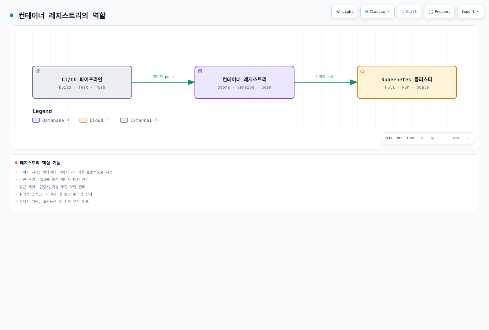
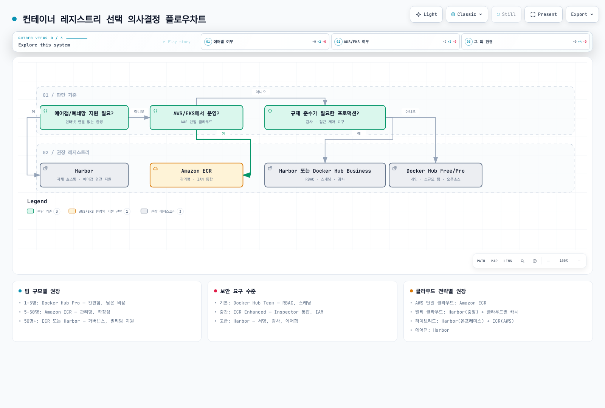

# 컨테이너 레지스트리

> **마지막 업데이트**: 2026년 9월 11일

## 개요

컨테이너 레지스트리는 Kubernetes 에코시스템에서 컨테이너 이미지를 저장, 관리, 배포하는 핵심 인프라입니다. 일반적인 배포는 레지스트리에서 이미지를 가져오지만, 망분리 환경 등에서는 노드에 미리 적재한 이미지를 사용할 수도 있습니다.

### 컨테이너 레지스트리의 역할



[🔍 인터랙티브 다이어그램 보기](https://www.atomai.click/kubernetes-docs/archmaps/ko-container-registry-readme-0.html)

**핵심 기능:**
- **이미지 저장**: 컨테이너 이미지 레이어를 효율적으로 저장
- **버전 관리**: 태그를 통한 이미지 버전 관리
- **접근 제어**: 인증/인가를 통한 보안 관리
- **취약점 스캐닝**: 이미지 내 보안 취약점 탐지
- **복제/미러링**: 고가용성 및 지역 분산 배포

---

## 레지스트리 비교

| 특성 | Docker Hub | Amazon ECR | Harbor |
|------|------------|------------|--------|
| **유형** | SaaS (Public) | AWS 관리형 | 자체 호스팅 (CNCF) |
| **비용** | Personal + 유료 구독 | 사용량 기반 | 인프라·운영·백업 비용 |
| **Private 저장소** | Personal 1개, 유료 플랜별 제공 | 서비스 쿼터 내 지원 | 운영자가 쿼터 설정 |
| **Rate Limit** | 계정 유형별 pull 제한·공정 사용 정책 | API별 서비스 쿼터 | 운영자 설정·인프라 용량 |
| **취약점 스캐닝** | Docker Scout의 플랜별 제공 범위 | Basic + Enhanced(Inspector) | Trivy 통합 |
| **이미지 서명** | DCT 또는 별도 OCI 서명 도구 | AWS Signer 관리형/수동 서명 | Cosign/Notation |
| **복제** | 미지원 | 멀티 리전 | Pull/Push 복제 |
| **완전한 에어갭** | 외부 Hub 접속 필요 | AWS 서비스 연결 필요; VPC 엔드포인트는 사설 접속 | 이미지·스캔 DB·설치 의존성을 반입해 자체 운영 |
| **IAM 통합** | 없음 | AWS IAM | LDAP/OIDC |
| **Lifecycle 정책** | 플랜·관리 기능 확인 | 자동화 규칙 | 태그 보존 정책 |

ECR에도 API 요청률과 리포지터리 수 등의 [서비스 쿼터](https://docs.aws.amazon.com/AmazonECR/latest/userguide/service-quotas.html)가 있습니다. [AWS Signer 통합](https://docs.aws.amazon.com/AmazonECR/latest/userguide/image-signing.html)은 현재 지원 기능이며, 서명 저장과 배포 시 검증 정책은 별도로 구성합니다. Docker Hub의 수치 제한은 [공식 사용 정책](https://docs.docker.com/docker-hub/usage/)과 실제 응답 헤더를 확인합니다.

---

## 주요 장단점

### Docker Hub

**장점:**
- 가장 큰 공개 이미지 생태계
- 간편한 시작 (계정 생성 즉시 사용)
- Official Images 및 Verified Publishers

**단점:**
- Rate limit (Free 플랜)
- Private 저장소 비용
- 기업 환경 접근 제어 한계

**적합한 사용 사례:**
- 오픈소스 프로젝트
- 개인/소규모 팀
- 공개 이미지 기반 개발

### Amazon ECR

**장점:**
- AWS 서비스와 네이티브 통합 (EKS, IAM, CloudWatch)
- IAM 기반 접근과 조정 가능한 API 서비스 쿼터
- 관리형 서비스 (운영 부담 최소화)
- Enhanced 스캐닝 (Amazon Inspector)

**단점:**
- AWS 종속성
- 멀티 클라우드 환경에서 복잡성
- 전송 비용 (리전 간)

**적합한 사용 사례:**
- AWS 기반 인프라
- EKS 클러스터 운영
- 엔터프라이즈 규모 워크로드

### Harbor

**장점:**
- 완전한 제어 (자체 호스팅)
- 에어갭 환경 완벽 지원
- 풍부한 기능 (복제, 스캐닝, 서명)
- 클라우드 중립

**단점:**
- 운영 부담 (설치, 업그레이드, 백업)
- 인프라 비용
- 초기 설정 복잡성

**적합한 사용 사례:**
- 에어갭/폐쇄망 환경
- 멀티 클라우드 전략
- 규제 준수가 필요한 환경

---

## 선택 기준 가이드

### 1. 팀 규모 및 조직 구조

| 팀의 환경 | 검토할 레지스트리 | 이유 |
|---------|----------------|------|
| 공개 이미지 중심, 운영 인력 제한 | Docker Hub | 관리 부담과 현재 플랜 요구 비교 |
| AWS 워크로드 중심 | Amazon ECR | IAM·실행 환경 통합과 비용 경로 비교 |
| 자체 운영 능력과 망분리/배포 통제 요구 | Harbor | 운영·복구 책임을 포함해 선택 |

인원수만으로 제품을 결정하지 않고 네트워크, 권한, 지원 및 운영 요구를 먼저 확인합니다.

### 2. 보안 요구사항

레지스트리를 일렬로 나열해 보안 수준을 판단하지 않습니다. 다음 통제의 구현과 운영 책임을 비교합니다.

- **접근 제어**: 계정/프로젝트 권한, IAM, 자격 증명 수명
- **공급망 검증**: 취약점 스캔, 이미지 digest 고정, 서명과 admission 검증
- **네트워크 경계**: 인터넷 접근, AWS 사설 연결, 완전한 망분리 여부
- **운영 책임**: 관리형 서비스의 책임 범위와 자체 호스팅의 패치·백업·복구 체계

### 3. 클라우드 전략

| 전략 | 권장 레지스트리 |
|------|----------------|
| AWS 단일 클라우드 | Amazon ECR |
| 멀티 클라우드 | Harbor (중앙) + 클라우드별 캐시 |
| 하이브리드 | Harbor (온프레미스) + ECR (AWS) |
| 에어갭 | Harbor |

### 4. 비용 고려사항

- **Docker Hub**: 사용자 수, 월간/연간 결제, 포함된 Scout/빌드 사용량을 [현재 요금표](https://www.docker.com/pricing/)로 비교합니다. 과거 Pro $5, Team $9 가격을 현재 예산으로 사용하지 않습니다.
- **ECR**: 저장 용량 × 리전별 저장 단가에 데이터 전송, Inspector, AWS Signer, VPC 엔드포인트 비용을 합산합니다. 공식 요금 예제의 $0.10/GB-month를 적용하면 100GB의 **저장 비용만** $10/월이며 전체 비용은 아닙니다. [ECR 요금](https://aws.amazon.com/ecr/pricing/)을 확인합니다.
- **Harbor**: 서버/DB/스토리지/로드 밸런서뿐 아니라 HA, 백업, 스캔 DB 갱신과 운영 인력을 포함합니다. 데이터가 많다는 이유만으로 항상 더 저렴한 것은 아닙니다.

---

## 의사결정 플로우차트



[🔍 인터랙티브 다이어그램 보기](https://www.atomai.click/kubernetes-docs/archmaps/ko-container-registry-readme-1.html)

---

## 이 섹션의 문서

| 문서 | 설명 |
|------|------|
| [Docker Hub](./01-docker-hub.md) | Docker Hub 사용법, rate limit 대응, 자동화 빌드 |
| [Amazon ECR](./02-amazon-ecr.md) | ECR 설정, Lifecycle 정책, EKS 통합, 멀티 리전 복제 |
| [Harbor](./03-harbor.md) | Harbor 설치, RBAC, 복제, 에어갭 환경 구성 |
| [모범 사례](./04-best-practices.md) | 태그 전략, 보안, 비용 최적화, CI/CD 통합 |

---

## 빠른 시작

로컬에 `myapp:v1` 이미지가 준비돼 있어야 합니다. Docker Hub 리포지터리와 Harbor 프로젝트를 먼저 생성하고 push 권한이 있는 계정을 사용합니다. 아래 ECR 예제에는 리포지터리 생성도 포함됩니다.

### Docker Hub

```bash
# 로그인
docker login -u <username>

# 이미지 푸시
docker tag myapp:v1 username/myapp:v1
docker push username/myapp:v1
```

### Amazon ECR

```bash
# 로그인 (AWS CLI v2)
aws ecr create-repository --repository-name myapp \
  --image-tag-mutability IMMUTABLE --region ap-northeast-2
aws ecr get-login-password --region ap-northeast-2 | \
  docker login --username AWS --password-stdin 123456789012.dkr.ecr.ap-northeast-2.amazonaws.com

# 이미지 푸시
docker tag myapp:v1 123456789012.dkr.ecr.ap-northeast-2.amazonaws.com/myapp:v1
docker push 123456789012.dkr.ecr.ap-northeast-2.amazonaws.com/myapp:v1
```

### Harbor

```bash
# 로그인
docker login harbor.example.com -u admin

# 이미지 푸시
docker tag myapp:v1 harbor.example.com/myproject/myapp:v1
docker push harbor.example.com/myproject/myapp:v1
```

---

## 다음 단계

1. **[Docker Hub](./01-docker-hub.md)**: 가장 널리 사용되는 공개 레지스트리
2. **[Amazon ECR](./02-amazon-ecr.md)**: AWS 환경에서의 권장 레지스트리
3. **[Harbor](./03-harbor.md)**: 자체 호스팅 엔터프라이즈 레지스트리
4. **[모범 사례](./04-best-practices.md)**: 레지스트리 운영 베스트 프랙티스
