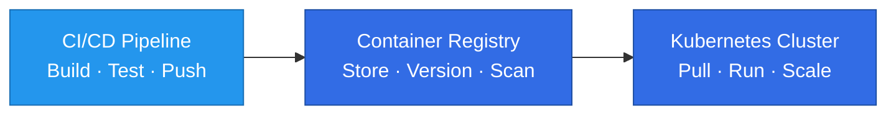
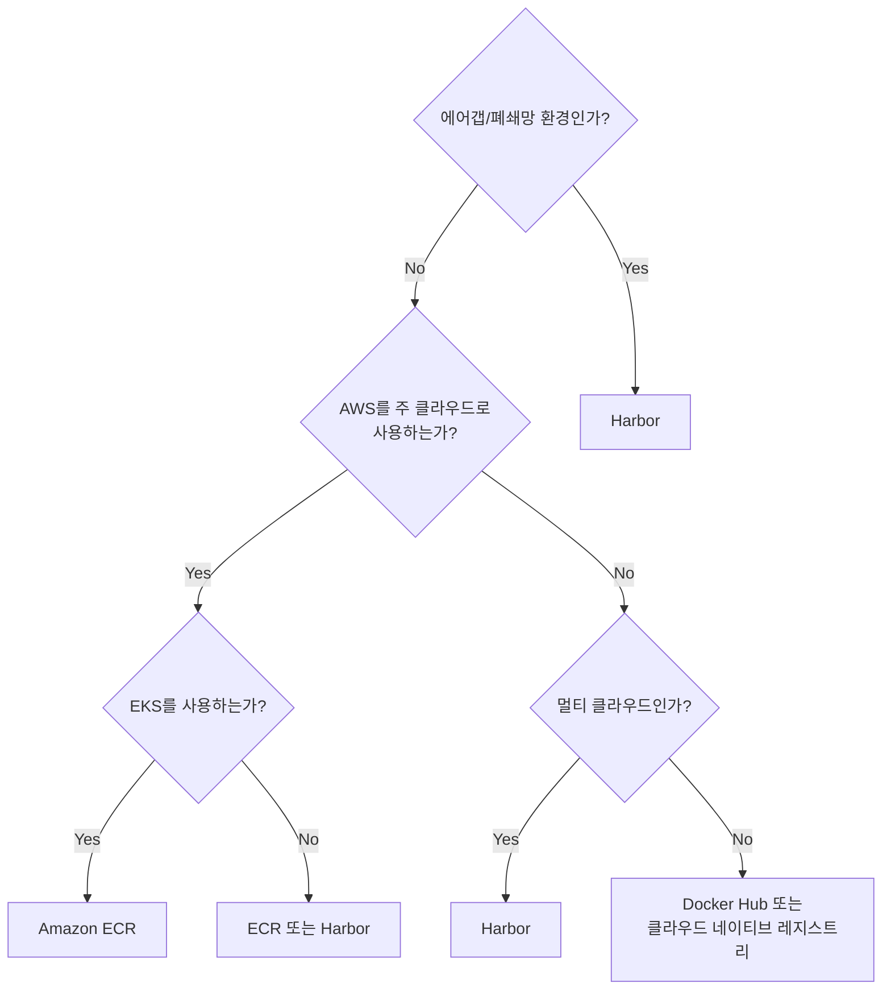

# 컨테이너 레지스트리

> **마지막 업데이트**: 2025년 2월 25일

## 개요

컨테이너 레지스트리는 Kubernetes 에코시스템에서 컨테이너 이미지를 저장, 관리, 배포하는 핵심 인프라입니다. 모든 Kubernetes 워크로드는 컨테이너 이미지로 패키징되어 레지스트리에 저장된 후 클러스터로 배포됩니다.

### 컨테이너 레지스트리의 역할



**핵심 기능:**
- **이미지 저장**: 컨테이너 이미지 레이어를 효율적으로 저장
- **버전 관리**: 태그를 통한 이미지 버전 관리
- **접근 제어**: 인증/인가를 통한 보안 관리
- **취약점 스캐닝**: 이미지 내 보안 취약점 탐지
- **복제/미러링**: 고가용성 및 지역 분산 배포

---

## 레지스트리 비교

| 특성 | Docker Hub | Amazon ECR | Harbor |
|------|------------|------------|--------|
| **유형** | SaaS (Public) | AWS 관리형 | 자체 호스팅 (CNCF) |
| **비용** | Free 플랜 있음 | 사용량 기반 | 인프라 비용만 |
| **Private 저장소** | 유료 플랜 | 기본 지원 | 기본 지원 |
| **Rate Limit** | Free: 100 pulls/6h | 없음 | 없음 |
| **취약점 스캐닝** | Pro 이상 | 기본 + Enhanced | Trivy 통합 |
| **이미지 서명** | Content Trust | 미지원 (외부 도구) | Cosign/Notation |
| **복제** | 미지원 | 멀티 리전 | Pull/Push 복제 |
| **에어갭 지원** | 불가 | VPC 엔드포인트 | 완전 지원 |
| **IAM 통합** | 없음 | AWS IAM | LDAP/OIDC |
| **Lifecycle 정책** | 수동 | 자동화 규칙 | 태그 보존 정책 |

---

## 주요 장단점

### Docker Hub

**장점:**
- 가장 큰 공개 이미지 생태계
- 간편한 시작 (계정 생성 즉시 사용)
- Official Images 및 Verified Publishers

**단점:**
- Rate limit (Free 플랜)
- Private 저장소 비용
- 기업 환경 접근 제어 한계

**적합한 사용 사례:**
- 오픈소스 프로젝트
- 개인/소규모 팀
- 공개 이미지 기반 개발

### Amazon ECR

**장점:**
- AWS 서비스와 네이티브 통합 (EKS, IAM, CloudWatch)
- Rate limit 없음
- 관리형 서비스 (운영 부담 최소화)
- Enhanced 스캐닝 (Amazon Inspector)

**단점:**
- AWS 종속성
- 멀티 클라우드 환경에서 복잡성
- 전송 비용 (리전 간)

**적합한 사용 사례:**
- AWS 기반 인프라
- EKS 클러스터 운영
- 엔터프라이즈 규모 워크로드

### Harbor

**장점:**
- 완전한 제어 (자체 호스팅)
- 에어갭 환경 완벽 지원
- 풍부한 기능 (복제, 스캐닝, 서명)
- 클라우드 중립

**단점:**
- 운영 부담 (설치, 업그레이드, 백업)
- 인프라 비용
- 초기 설정 복잡성

**적합한 사용 사례:**
- 에어갭/폐쇄망 환경
- 멀티 클라우드 전략
- 규제 준수가 필요한 환경

---

## 선택 기준 가이드

### 1. 팀 규모 및 조직 구조

| 팀 규모 | 권장 레지스트리 | 이유 |
|---------|----------------|------|
| 1-5명 | Docker Hub Pro | 간편함, 낮은 비용 |
| 5-50명 | Amazon ECR | 관리형, 확장성 |
| 50명+ | ECR 또는 Harbor | 거버넌스, 멀티팀 지원 |

### 2. 보안 요구사항

```
낮음 ────────────────────────────────────────────── 높음

Docker Hub Free → Docker Hub Team → ECR Basic → ECR Enhanced → Harbor + Notary
```

- **기본 보안**: Docker Hub Team (RBAC, 스캐닝)
- **중간 보안**: ECR Enhanced (Inspector 통합, IAM)
- **고급 보안**: Harbor (서명, 감사, 에어갭)

### 3. 클라우드 전략

| 전략 | 권장 레지스트리 |
|------|----------------|
| AWS 단일 클라우드 | Amazon ECR |
| 멀티 클라우드 | Harbor (중앙) + 클라우드별 캐시 |
| 하이브리드 | Harbor (온프레미스) + ECR (AWS) |
| 에어갭 | Harbor |

### 4. 비용 고려사항

**소규모 (월 100GB 미만):**
- Docker Hub Pro: ~$5/월
- ECR: ~$10/월 (스토리지 + 전송)
- Harbor: 인프라 비용 변동

**중규모 (월 500GB):**
- Docker Hub Team: ~$9/사용자/월
- ECR: ~$50/월
- Harbor: EC2 비용 ~$100/월+

**대규모 (월 2TB+):**
- ECR: 스토리지 비용 효율적
- Harbor: 대규모에서 비용 절감 가능

---

## 의사결정 플로우차트



---

## 이 섹션의 문서

| 문서 | 설명 |
|------|------|
| [Docker Hub](./01-docker-hub.md) | Docker Hub 사용법, rate limit 대응, 자동화 빌드 |
| [Amazon ECR](./02-amazon-ecr.md) | ECR 설정, Lifecycle 정책, EKS 통합, 멀티 리전 복제 |
| [Harbor](./03-harbor.md) | Harbor 설치, RBAC, 복제, 에어갭 환경 구성 |
| [모범 사례](./04-best-practices.md) | 태그 전략, 보안, 비용 최적화, CI/CD 통합 |

---

## 빠른 시작

### Docker Hub

```bash
# 로그인
docker login -u <username>

# 이미지 푸시
docker tag myapp:v1 username/myapp:v1
docker push username/myapp:v1
```

### Amazon ECR

```bash
# 로그인 (AWS CLI v2)
aws ecr get-login-password --region ap-northeast-2 | \
  docker login --username AWS --password-stdin 123456789012.dkr.ecr.ap-northeast-2.amazonaws.com

# 이미지 푸시
docker tag myapp:v1 123456789012.dkr.ecr.ap-northeast-2.amazonaws.com/myapp:v1
docker push 123456789012.dkr.ecr.ap-northeast-2.amazonaws.com/myapp:v1
```

### Harbor

```bash
# 로그인
docker login harbor.example.com -u admin

# 이미지 푸시
docker tag myapp:v1 harbor.example.com/myproject/myapp:v1
docker push harbor.example.com/myproject/myapp:v1
```

---

## 다음 단계

1. **[Docker Hub](./01-docker-hub.md)**: 가장 널리 사용되는 공개 레지스트리
2. **[Amazon ECR](./02-amazon-ecr.md)**: AWS 환경에서의 권장 레지스트리
3. **[Harbor](./03-harbor.md)**: 자체 호스팅 엔터프라이즈 레지스트리
4. **[모범 사례](./04-best-practices.md)**: 레지스트리 운영 베스트 프랙티스
