# 클러스터 아키텍처

> **지원 버전**: Kubernetes 1.32, 1.33, 1.34  
> **마지막 업데이트**: 2026년 7월 11일

## 실습 환경 설정

이 문서의 개념을 실습하기 위해서는 다음과 같은 도구와 환경이 필요합니다:

### 필수 도구
- kubectl v1.34 이상
- 작동하는 Kubernetes 클러스터 (EKS, minikube, kind 등)

### 로컬 개발 환경 설정

```bash
# minikube 설치 (로컬 개발용)
curl -LO https://storage.googleapis.com/minikube/releases/latest/minikube-linux-amd64
sudo install minikube-linux-amd64 /usr/local/bin/minikube

# 클러스터 시작
minikube start

# 클러스터 상태 확인
kubectl cluster-info

# 컨트롤 플레인 구성 요소 확인
kubectl get pods -n kube-system
```

## 클러스터 아키텍처 개요

> **핵심 개념**: Kubernetes 클러스터는 컨트롤 플레인과 워커 노드로 구성되며, 각각 특정 역할을 담당하는 여러 구성 요소로 이루어져 있습니다.

Kubernetes 클러스터는 컨테이너화된 애플리케이션을 실행하기 위한 일련의 노드(가상 또는 물리적 머신)로 구성됩니다. 클러스터는 크게 컨트롤 플레인과 워커 노드로 나뉩니다.

### 클러스터 아키텍처 다이어그램

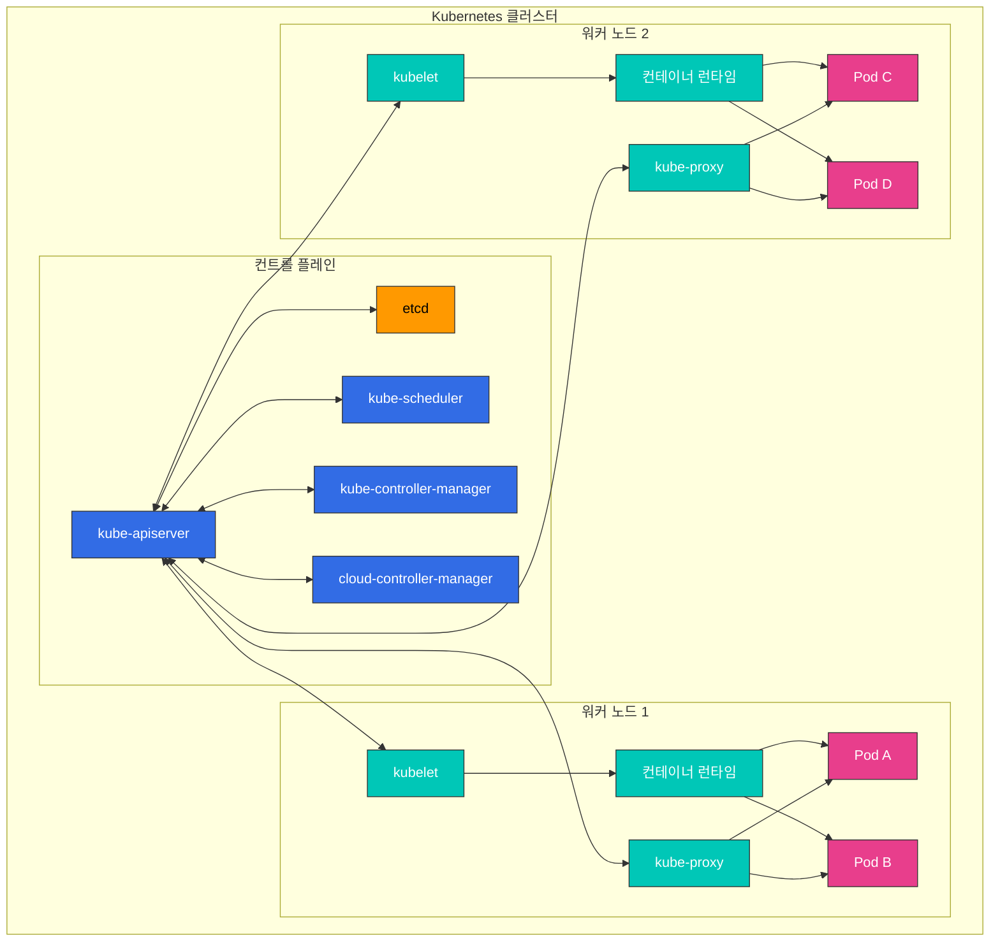

**컨트롤 플레인 구성 요소**:
- **kube-apiserver**: Kubernetes API를 노출하는 프론트엔드
- **etcd**: 모든 클러스터 데이터를 저장하는 키-값 저장소
- **kube-scheduler**: 새로 생성된 파드를 실행할 노드 선택
- **kube-controller-manager**: 클러스터 상태를 관리하는 컨트롤러 실행
- **cloud-controller-manager**: 클라우드 제공업체 API와 상호 작용

**워커 노드 구성 요소**:
- **kubelet**: 각 노드에서 실행되는 에이전트, 컨테이너 실행 관리
- **kube-proxy**: 네트워크 규칙 유지 및 연결 포워딩
- **컨테이너 런타임**: 컨테이너 실행 (containerd, CRI-O 등)

## 컨트롤 플레인 구성 요소

컨트롤 플레인은 Kubernetes 클러스터의 "두뇌" 역할을 하며, 클러스터의 전반적인 상태를 관리하고 제어합니다. 컨트롤 플레인 구성 요소는 일반적으로 전용 머신에서 실행되며, 고가용성을 위해 여러 인스턴스로 복제될 수 있습니다.

### 컨트롤 플레인 구성 요소 상세 설명

| 구성 요소 | 주요 기능 | 통신 대상 | 고가용성 구성 |
|----------|----------|----------|-------------|
| **kube-apiserver** | - Kubernetes API 제공<br>- 인증 및 권한 부여<br>- API 요청 처리 | - 모든 구성 요소<br>- etcd | 여러 인스턴스로 수평 확장 |
| **etcd** | - 클러스터 데이터 저장<br>- 분산 키-값 저장소<br>- 일관성 보장 | - kube-apiserver | 다중 노드 클러스터 |
| **kube-scheduler** | - 파드 배치 결정<br>- 노드 리소스 평가<br>- 어피니티/안티-어피니티 적용 | - kube-apiserver | 액티브-스탠바이 구성 |
| **kube-controller-manager** | - 노드 컨트롤러<br>- 레플리케이션 컨트롤러<br>- 엔드포인트 컨트롤러<br>- 서비스 어카운트 컨트롤러 | - kube-apiserver | 액티브-스탠바이 구성 |
| **cloud-controller-manager** | - 클라우드 제공업체 통합<br>- 노드 라이프사이클<br>- 라우팅 및 로드 밸런싱 | - kube-apiserver<br>- 클라우드 API | 액티브-스탠바이 구성 |

### 컨트롤 플레인 통신 흐름

1. 사용자 또는 컨트롤러가 kube-apiserver에 요청 전송
2. kube-apiserver가 인증, 권한 부여 및 승인 수행
3. kube-apiserver가 etcd에서 데이터 읽기/쓰기
4. 컨트롤러와 스케줄러가 kube-apiserver를 통해 클러스터 상태 감시
5. kubelet이 kube-apiserver에 노드 상태 보고

### kube-apiserver

kube-apiserver는 Kubernetes API를 노출하는 컨트롤 플레인의 프론트엔드입니다. 모든 내부 및 외부 요청은 이 API 서버를 통해 처리됩니다.

**주요 기능**:
- REST API 제공
- 인증 및 권한 부여
- 요청 검증 및 처리
- etcd와의 통신
- 수평적 확장 가능 (여러 인스턴스로 확장 가능)

**주요 플래그 및 구성 옵션**:
```bash
# 기본 구성 예시
kube-apiserver \
  --advertise-address=192.168.1.10 \
  --allow-privileged=true \
  --authorization-mode=Node,RBAC \
  --enable-admission-plugins=NodeRestriction \
  --enable-bootstrap-token-auth=true \
  --etcd-servers=https://127.0.0.1:2379 \
  --kubelet-client-certificate=/etc/kubernetes/pki/apiserver-kubelet-client.crt \
  --kubelet-client-key=/etc/kubernetes/pki/apiserver-kubelet-client.key \
  --service-account-key-file=/etc/kubernetes/pki/sa.pub \
  --service-cluster-ip-range=10.96.0.0/12 \
  --tls-cert-file=/etc/kubernetes/pki/apiserver.crt \
  --tls-private-key-file=/etc/kubernetes/pki/apiserver.key
```

**API 서버 보안**:
- TLS 인증서를 통한 보안 통신
- 다양한 인증 방식 지원 (X.509 인증서, 서비스 계정 토큰, OIDC, 웹훅 등)
- RBAC(Role-Based Access Control)을 통한 권한 관리
- 어드미션 컨트롤러를 통한 요청 검증 및 변경

### etcd

etcd는 모든 클러스터 데이터를 저장하는 일관성 있고 고가용성을 갖춘 키-값 저장소입니다. Kubernetes의 "소스 오브 트루스(source of truth)"로 작동합니다.

**주요 특징**:
- 분산 시스템
- 강한 일관성 (Raft 합의 알고리즘 사용)
- 고가용성 (여러 노드로 구성 가능)
- 안전한 데이터 저장
- 워치(watch) 기능으로 변경 사항 모니터링

**etcd 클러스터 구성**:
```bash
# etcd 클러스터 구성 예시 (3노드)
etcd \
  --name etcd-1 \
  --initial-advertise-peer-urls https://192.168.1.11:2380 \
  --listen-peer-urls https://192.168.1.11:2380 \
  --listen-client-urls https://192.168.1.11:2379,https://127.0.0.1:2379 \
  --advertise-client-urls https://192.168.1.11:2379 \
  --initial-cluster-token etcd-cluster \
  --initial-cluster etcd-1=https://192.168.1.11:2380,etcd-2=https://192.168.1.12:2380,etcd-3=https://192.168.1.13:2380 \
  --initial-cluster-state new \
  --data-dir=/var/lib/etcd
```

**etcd 백업 및 복구**:
```bash
# etcd 백업
ETCDCTL_API=3 etcdctl snapshot save snapshot.db \
  --endpoints=https://127.0.0.1:2379 \
  --cacert=/etc/kubernetes/pki/etcd/ca.crt \
  --cert=/etc/kubernetes/pki/etcd/server.crt \
  --key=/etc/kubernetes/pki/etcd/server.key

# etcd 복구
ETCDCTL_API=3 etcdctl snapshot restore snapshot.db \
  --data-dir=/var/lib/etcd-restore \
  --name=etcd-1 \
  --initial-cluster=etcd-1=https://192.168.1.11:2380 \
  --initial-cluster-token=etcd-cluster \
  --initial-advertise-peer-urls=https://192.168.1.11:2380
```

**etcd 성능 최적화**:
- 디스크 I/O 최적화 (SSD 사용 권장)
- 적절한 메모리 할당
- 정기적인 압축 및 조각 모음
- 클러스터 크기에 따른 적절한 etcd 노드 수 설정 (일반적으로 3 또는 5)

#### 2026년 7월 업데이트: etcd v3.7.0 릴리스

2026년 7월 8일 SIG etcd가 etcd v3.7.0을 릴리스했습니다. 주요 변경 사항:

- **RangeStream**: 대용량 Range 응답 전체를 메모리에 버퍼링하지 않고 청크 단위로 스트리밍하는 기능 (오랫동안 요청되어 온 기능)
- **성능 개선**: keys-only Range 요청 최적화, 더 빠르고 안정적인 리스(lease) 처리
- 레거시 v2store 잔재 완전 제거 및 protobuf 전면 개편
- 핵심 의존성 bbolt v1.5.0, raft v3.7.0 포함

자세한 내용은 [공식 발표](https://kubernetes.io/blog/2026/07/08/announcing-etcd-3.7/)와 [etcd v3.7 체인지로그](https://github.com/etcd-io/etcd/blob/main/CHANGELOG/CHANGELOG-3.7.md)를 참고하세요.

### kube-scheduler

kube-scheduler는 새로 생성된 파드를 실행할 노드를 선택하는 컨트롤 플레인 구성 요소입니다.

**스케줄링 과정**:
1. **필터링**: 파드를 실행할 수 있는 노드 식별
   - 리소스 요구사항 (CPU, 메모리)
   - 노드 셀렉터, 노드 어피니티
   - 테인트(taint)와 톨러레이션(toleration)
   - 볼륨 제약 조건

2. **스코어링**: 적합한 노드에 점수 부여
   - 리소스 사용률
   - 파드 간 어피니티/안티-어피니티
   - 데이터 지역성
   - 노드 간 부하 분산

3. **바인딩**: 최적의 노드에 파드 할당

**스케줄러 구성**:
```bash
# 기본 구성 예시
kube-scheduler \
  --kubeconfig=/etc/kubernetes/scheduler.conf \
  --leader-elect=true \
  --v=2
```

**스케줄러 프로필 및 플러그인**:
- 기본 스케줄러 프로필
- 사용자 정의 스케줄러 프로필
- 스케줄러 확장 포인트 (필터, 스코어, 바인드 등)
- 다중 스케줄러 지원

**스케줄링 정책**:
```yaml
# 스케줄링 정책 예시
apiVersion: kubescheduler.config.k8s.io/v1
kind: KubeSchedulerConfiguration
profiles:
- schedulerName: default-scheduler
  plugins:
    score:
      disabled:
      - name: NodeResourcesLeastAllocated
      enabled:
      - name: NodeResourcesMostAllocated
        weight: 1
```

### kube-controller-manager

kube-controller-manager는 여러 컨트롤러 프로세스를 실행하는 컨트롤 플레인 구성 요소입니다. 각 컨트롤러는 클러스터의 특정 측면을 관리합니다.

**주요 컨트롤러**:
- **노드 컨트롤러**: 노드 상태 모니터링 및 대응
- **레플리케이션 컨트롤러**: 파드 복제본 수 유지
- **엔드포인트 컨트롤러**: 서비스와 파드 연결
- **서비스 어카운트 & 토큰 컨트롤러**: 네임스페이스에 대한 기본 계정 및 API 토큰 생성
- **잡 컨트롤러**: 일회성 작업 관리
- **크론잡 컨트롤러**: 예약된 작업 관리
- **데몬셋 컨트롤러**: 모든 노드에 특정 파드 실행 보장
- **스테이트풀셋 컨트롤러**: 상태 유지 애플리케이션 관리
- **PV 컨트롤러**: 영구 볼륨 관리
- **네임스페이스 컨트롤러**: 네임스페이스 수명 주기 관리
- **가비지 컬렉터**: 종속성이 없는 객체 정리

**컨트롤러 매니저 구성**:
```bash
# 기본 구성 예시
kube-controller-manager \
  --kubeconfig=/etc/kubernetes/controller-manager.conf \
  --leader-elect=true \
  --use-service-account-credentials=true \
  --root-ca-file=/etc/kubernetes/pki/ca.crt \
  --service-account-private-key-file=/etc/kubernetes/pki/sa.key \
  --cluster-signing-cert-file=/etc/kubernetes/pki/ca.crt \
  --cluster-signing-key-file=/etc/kubernetes/pki/ca.key \
  --controllers=*,bootstrapsigner,tokencleaner
```

**컨트롤러 동작 방식**:
1. 컨트롤러는 API 서버를 통해 클러스터 상태를 지속적으로 감시
2. 현재 상태와 원하는 상태 간의 차이 감지
3. 차이를 해소하기 위한 작업 수행
4. 상태 변경 사항을 API 서버에 보고

### cloud-controller-manager

cloud-controller-manager는 클라우드별 컨트롤 로직을 포함하는 컨트롤 플레인 구성 요소입니다. 이를 통해 Kubernetes 코어와 클라우드 제공업체의 API를 분리할 수 있습니다.

**주요 컨트롤러**:
- **노드 컨트롤러**: 클라우드 제공자 API를 통해 노드 상태 확인
- **라우트 컨트롤러**: 클라우드 환경에서 라우트 설정
- **서비스 컨트롤러**: 클라우드 로드 밸런서 생성, 업데이트, 삭제
- **볼륨 컨트롤러**: 클라우드 스토리지 볼륨 생성, 연결, 마운트

**클라우드 제공업체별 구현**:
- AWS Cloud Controller Manager
- Azure Cloud Controller Manager
- GCP Cloud Controller Manager
- OpenStack Cloud Controller Manager
- vSphere Cloud Controller Manager

**클라우드 컨트롤러 매니저 구성**:
```bash
# AWS 클라우드 컨트롤러 매니저 예시
cloud-controller-manager \
  --cloud-provider=aws \
  --cloud-config=/etc/kubernetes/cloud-config \
  --kubeconfig=/etc/kubernetes/cloud-controller-manager.conf \
  --leader-elect=true
```

**클라우드 컨트롤러 매니저 장점**:
- 클라우드 제공업체별 코드와 Kubernetes 코어 분리
- 클라우드 제공업체가 자체 기능을 독립적으로 개발 가능
- Kubernetes 코어 변경 없이 클라우드 기능 추가 가능
## 노드 구성 요소

노드는 Kubernetes 클러스터에서 워커 머신으로, 컨테이너화된 애플리케이션을 실행합니다. 각 노드는 컨트롤 플레인에 의해 관리되며, 여러 구성 요소로 이루어져 있습니다.

### kubelet

kubelet은 각 노드에서 실행되는 에이전트로, 파드 내 컨테이너가 실행되도록 관리합니다. kubelet은 다양한 메커니즘을 통해 파드 스펙(PodSpec)을 받아 컨테이너가 해당 스펙에 따라 건강하게 실행되도록 보장합니다.

**주요 기능**:
- PodSpec에 따라 컨테이너 실행
- 컨테이너 상태 모니터링 및 보고
- 컨테이너 라이프사이클 관리
- 볼륨 마운트 관리
- 노드 상태 보고
- 컨테이너 헬스 체크 수행

**kubelet 구성**:
```bash
# 기본 구성 예시
kubelet \
  --kubeconfig=/etc/kubernetes/kubelet.conf \
  --config=/var/lib/kubelet/config.yaml \
  --container-runtime=remote \
  --container-runtime-endpoint=unix:///var/run/containerd/containerd.sock \
  --pod-infra-container-image=k8s.gcr.io/pause:3.6
```

**kubelet 구성 파일 예시**:
```yaml
# /var/lib/kubelet/config.yaml
apiVersion: kubelet.config.k8s.io/v1beta1
kind: KubeletConfiguration
address: 0.0.0.0
authentication:
  anonymous:
    enabled: false
  webhook:
    cacheTTL: 2m0s
    enabled: true
  x509:
    clientCAFile: /etc/kubernetes/pki/ca.crt
authorization:
  mode: Webhook
  webhook:
    cacheAuthorizedTTL: 5m0s
    cacheUnauthorizedTTL: 30s
cgroupDriver: systemd
clusterDomain: cluster.local
cpuManagerPolicy: none
evictionHard:
  memory.available: 100Mi
  nodefs.available: 10%
  nodefs.inodesFree: 5%
failSwapOn: true
healthzBindAddress: 127.0.0.1
healthzPort: 10248
```

**정적 파드**:
kubelet은 API 서버를 통하지 않고 직접 관리하는 정적 파드를 실행할 수 있습니다. 이는 주로 컨트롤 플레인 구성 요소를 실행하는 데 사용됩니다.

```yaml
# /etc/kubernetes/manifests/kube-apiserver.yaml
apiVersion: v1
kind: Pod
metadata:
  name: kube-apiserver
  namespace: kube-system
spec:
  containers:
  - name: kube-apiserver
    image: k8s.gcr.io/kube-apiserver:v1.24.0
    command:
    - kube-apiserver
    - --advertise-address=192.168.1.10
    # ... 추가 플래그
```

### kube-proxy

kube-proxy는 각 노드에서 실행되는 네트워크 프록시로, Kubernetes 서비스 개념의 구현을 담당합니다. 노드의 네트워크 규칙을 유지하고 연결 포워딩을 수행합니다.

**주요 기능**:
- 서비스 IP 및 포트에 대한 네트워크 규칙 유지
- 연결 포워딩
- 로드 밸런싱 구현
- 서비스 디스커버리 지원

**작동 모드**:
1. **userspace 모드**: 사용자 공간에서 프록시 실행 (레거시)
2. **iptables 모드**: 리눅스 iptables를 사용한 NAT 구현 (기본)
3. **IPVS 모드**: 리눅스 커널의 IP Virtual Server 사용 (고성능)

**kube-proxy 구성**:
```bash
# 기본 구성 예시
kube-proxy \
  --config=/var/lib/kube-proxy/config.conf \
  --hostname-override=node1
```

**kube-proxy 구성 파일 예시**:
```yaml
# /var/lib/kube-proxy/config.conf
apiVersion: kubeproxy.config.k8s.io/v1alpha1
kind: KubeProxyConfiguration
bindAddress: 0.0.0.0
clientConnection:
  acceptContentTypes: ""
  burst: 10
  contentType: application/vnd.kubernetes.protobuf
  kubeconfig: /var/lib/kube-proxy/kubeconfig.conf
  qps: 5
clusterCIDR: 10.244.0.0/16
configSyncPeriod: 15m0s
conntrack:
  maxPerCore: 32768
  min: 131072
  tcpCloseWaitTimeout: 1h0m0s
  tcpEstablishedTimeout: 24h0m0s
enableProfiling: false
healthzBindAddress: 0.0.0.0:10256
hostnameOverride: node1
iptables:
  masqueradeAll: false
  masqueradeBit: 14
  minSyncPeriod: 0s
  syncPeriod: 30s
ipvs:
  excludeCIDRs: null
  minSyncPeriod: 0s
  scheduler: ""
  syncPeriod: 30s
mode: "iptables"
```

**IPVS vs iptables 모드 비교**:

| 특성 | iptables 모드 | IPVS 모드 |
|------|--------------|-----------|
| 성능 | 서비스 수가 많을 때 성능 저하 | 대규모 클러스터에서 더 나은 성능 |
| 로드 밸런싱 알고리즘 | 라운드 로빈만 지원 | 다양한 알고리즘 지원 (rr, lc, dh, sh, sed, nq) |
| 구현 | 네트워크 패킷 필터링 체인 | 해시 테이블 기반 |
| 커널 요구사항 | 기본 커널 모듈 | IPVS 커널 모듈 필요 |

### 컨테이너 런타임

컨테이너 런타임은 컨테이너를 실행하는 소프트웨어입니다. Kubernetes는 Container Runtime Interface(CRI)를 통해 다양한 컨테이너 런타임을 지원합니다.

**주요 컨테이너 런타임**:
1. **containerd**: 경량 컨테이너 런타임 (현재 가장 널리 사용됨)
2. **CRI-O**: Kubernetes를 위해 특별히 설계된 경량 런타임
3. **Docker Engine**: Docker shim을 통해 지원 (Kubernetes 1.24부터 지원 중단)

**컨테이너 런타임 계층 구조**:

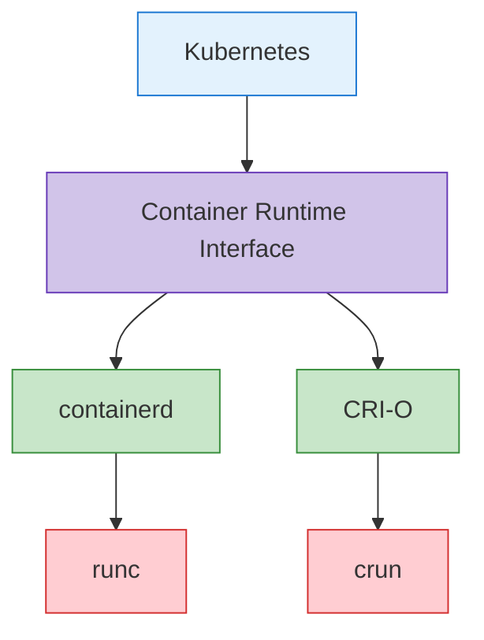

**containerd 구성 예시**:
```toml
# /etc/containerd/config.toml
version = 2

[plugins]
  [plugins."io.containerd.grpc.v1.cri"]
    sandbox_image = "k8s.gcr.io/pause:3.6"
    [plugins."io.containerd.grpc.v1.cri".containerd]
      default_runtime_name = "runc"
      [plugins."io.containerd.grpc.v1.cri".containerd.runtimes]
        [plugins."io.containerd.grpc.v1.cri".containerd.runtimes.runc]
          runtime_type = "io.containerd.runc.v2"
          [plugins."io.containerd.grpc.v1.cri".containerd.runtimes.runc.options]
            SystemdCgroup = true
```

**CRI-O 구성 예시**:
```toml
# /etc/crio/crio.conf
[crio]
root = "/var/lib/containers/storage"
runroot = "/var/run/containers/storage"
storage_driver = "overlay"
storage_option = ["overlay.mountopt=nodev"]

[crio.runtime]
default_runtime = "runc"
conmon = "/usr/bin/conmon"
conmon_cgroup = "pod"
cgroup_manager = "systemd"

[crio.image]
pause_image = "k8s.gcr.io/pause:3.6"
```

### 애드온 구성 요소

애드온은 Kubernetes 클러스터의 기능을 확장하는 추가 구성 요소입니다. 일부 중요한 애드온은 다음과 같습니다:

1. **CNI 네트워크 플러그인**: 파드 네트워킹 구현
   - Calico, Cilium, Flannel, Weave Net 등

2. **DNS**: 클러스터 내 DNS 서비스 제공
   - CoreDNS (기본)

3. **대시보드**: 웹 기반 UI 제공
   - Kubernetes Dashboard

4. **인그레스 컨트롤러**: HTTP/HTTPS 라우팅 관리
   - NGINX Ingress Controller, Traefik, HAProxy 등

5. **메트릭 서버**: 리소스 사용량 메트릭 수집
   - Metrics Server

6. **로깅 및 모니터링**: 로그 수집 및 모니터링
   - Prometheus, Grafana, Elasticsearch, Fluentd, Kibana 등

**CoreDNS 구성 예시**:
```yaml
apiVersion: v1
kind: ConfigMap
metadata:
  name: coredns
  namespace: kube-system
data:
  Corefile: |
    .:53 {
        errors
        health {
            lameduck 5s
        }
        ready
        kubernetes cluster.local in-addr.arpa ip6.arpa {
            pods insecure
            fallthrough in-addr.arpa ip6.arpa
            ttl 30
        }
        prometheus :9153
        forward . /etc/resolv.conf {
            max_concurrent 1000
        }
        cache 30
        loop
        reload
        loadbalance
    }
```

**Calico CNI 구성 예시**:
```yaml
apiVersion: v1
kind: ConfigMap
metadata:
  name: calico-config
  namespace: kube-system
data:
  calico_backend: "bird"
  cni_network_config: |-
    {
      "name": "k8s-pod-network",
      "cniVersion": "0.3.1",
      "plugins": [
        {
          "type": "calico",
          "log_level": "info",
          "datastore_type": "kubernetes",
          "nodename": "__KUBERNETES_NODE_NAME__",
          "mtu": __CNI_MTU__,
          "ipam": {
            "type": "calico-ipam"
          },
          "policy": {
            "type": "k8s"
          },
          "kubernetes": {
            "kubeconfig": "__KUBECONFIG_FILEPATH__"
          }
        },
        {
          "type": "portmap",
          "snat": true,
          "capabilities": {"portMappings": true}
        }
      ]
    }
```
## 클러스터 통신 경로

Kubernetes 클러스터 내에서는 여러 구성 요소 간의 통신이 이루어집니다. 이러한 통신 경로를 이해하는 것은 클러스터 설계, 보안 및 문제 해결에 중요합니다.

### 컨트롤 플레인 내부 통신

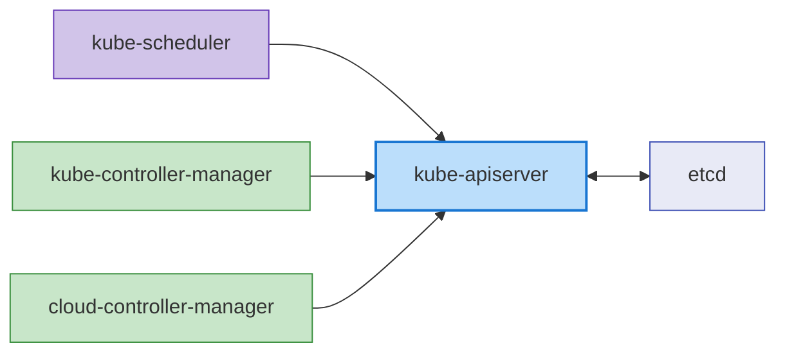

컨트롤 플레인 구성 요소 간의 통신은 다음과 같습니다:

1. **kube-apiserver와 etcd**: kube-apiserver는 클러스터 상태를 저장하고 검색하기 위해 etcd와 통신합니다.
   - 프로토콜: gRPC
   - 포트: 2379/TCP
   - 보안: TLS 인증서 기반 인증

2. **kube-scheduler와 kube-apiserver**: kube-scheduler는 파드 스케줄링을 위해 kube-apiserver와 통신합니다.
   - 프로토콜: HTTPS
   - 포트: 6443/TCP (kube-apiserver)
   - 보안: TLS 인증서 기반 인증

3. **kube-controller-manager와 kube-apiserver**: 컨트롤러는 클러스터 상태를 감시하고 변경하기 위해 kube-apiserver와 통신합니다.
   - 프로토콜: HTTPS
   - 포트: 6443/TCP (kube-apiserver)
   - 보안: TLS 인증서 기반 인증

4. **cloud-controller-manager와 kube-apiserver**: 클라우드 컨트롤러는 클러스터 상태를 감시하고 클라우드 리소스를 관리하기 위해 kube-apiserver와 통신합니다.
   - 프로토콜: HTTPS
   - 포트: 6443/TCP (kube-apiserver)
   - 보안: TLS 인증서 기반 인증

### 컨트롤 플레인과 노드 간 통신

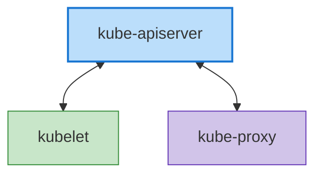

컨트롤 플레인과 노드 간의 통신은 다음과 같습니다:

1. **kube-apiserver와 kubelet**: kube-apiserver는 파드 스펙을 전달하고 노드 상태를 수집하기 위해 kubelet과 통신합니다.
   - 프로토콜: HTTPS
   - 포트: 10250/TCP (kubelet)
   - 보안: TLS 인증서 기반 인증

2. **kubelet과 kube-apiserver**: kubelet은 노드 등록, 파드 상태 보고, 이벤트 전송을 위해 kube-apiserver와 통신합니다.
   - 프로토콜: HTTPS
   - 포트: 6443/TCP (kube-apiserver)
   - 보안: TLS 인증서 기반 인증

3. **kube-proxy와 kube-apiserver**: kube-proxy는 서비스 정보를 가져오기 위해 kube-apiserver와 통신합니다.
   - 프로토콜: HTTPS
   - 포트: 6443/TCP (kube-apiserver)
   - 보안: TLS 인증서 기반 인증

### 노드 간 통신

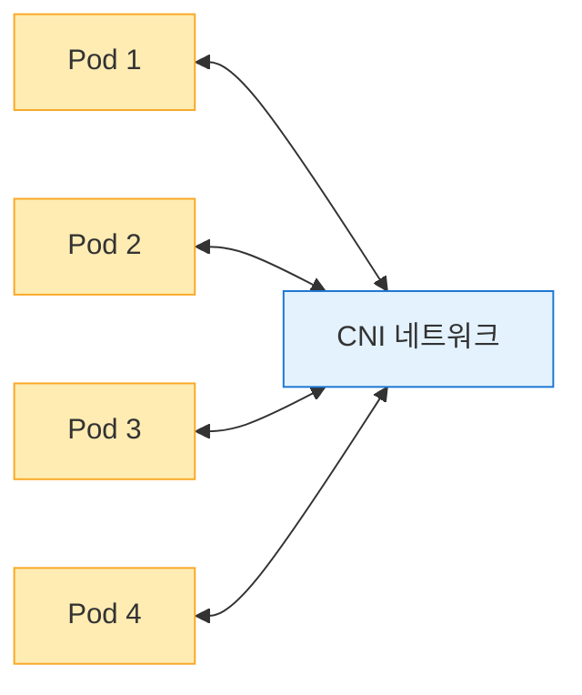

노드 간의 통신은 다음과 같습니다:

1. **파드 간 통신**: 파드는 CNI 플러그인이 제공하는 네트워크를 통해 서로 통신합니다.
   - 프로토콜: 애플리케이션에 따라 다름 (TCP, UDP 등)
   - 포트: 애플리케이션에 따라 다름
   - 보안: 네트워크 정책으로 제어 가능

2. **노드 간 파드 통신**: 서로 다른 노드에 있는 파드 간의 통신은 CNI 플러그인에 의해 처리됩니다.
   - 프로토콜: 애플리케이션에 따라 다름 (TCP, UDP 등)
   - 포트: 애플리케이션에 따라 다름
   - 보안: 네트워크 정책으로 제어 가능

### 외부 통신

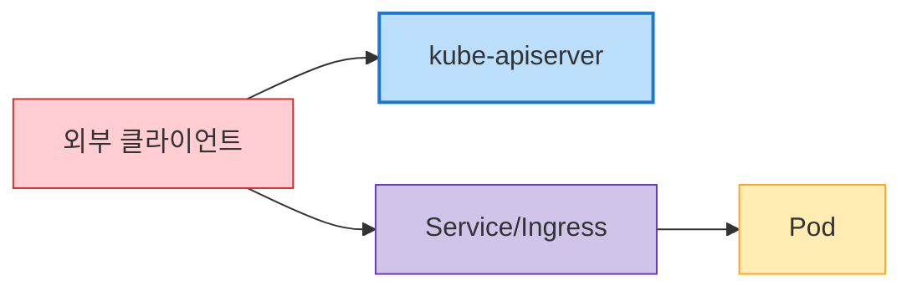

클러스터 외부와의 통신은 다음과 같습니다:

1. **클라이언트와 kube-apiserver**: 사용자 및 외부 시스템은 kube-apiserver를 통해 클러스터와 상호 작용합니다.
   - 프로토콜: HTTPS
   - 포트: 6443/TCP (kube-apiserver)
   - 보안: TLS 인증서, 토큰, 사용자 인증 등

2. **외부 트래픽과 서비스**: 외부 트래픽은 NodePort, LoadBalancer 서비스 또는 인그레스를 통해 클러스터 내 애플리케이션에 접근합니다.
   - 프로토콜: HTTP, HTTPS, TCP, UDP 등
   - 포트: 서비스 구성에 따라 다름
   - 보안: 인그레스 컨트롤러, 서비스 구성에 따라 다름

### 통신 보안

Kubernetes 클러스터 내 통신의 보안은 다음과 같은 방법으로 구현됩니다:

1. **TLS 인증서**: 모든 컨트롤 플레인 구성 요소 간의 통신은 TLS 인증서로 암호화됩니다.
2. **인증 및 권한 부여**: API 서버에 대한 모든 요청은 인증 및 권한 부여 과정을 거칩니다.
3. **네트워크 정책**: 파드 간 통신은 네트워크 정책을 통해 제한할 수 있습니다.
4. **암호화된 시크릿**: etcd에 저장되는 시크릿은 암호화할 수 있습니다.

**API 서버 통신 보안 구성 예시**:
```yaml
apiVersion: apiserver.config.k8s.io/v1
kind: EncryptionConfiguration
resources:
  - resources:
    - secrets
    providers:
    - aescbc:
        keys:
        - name: key1
          secret: <base64-encoded-key>
    - identity: {}
```

### 고가용성 클러스터 구성

고가용성(HA) Kubernetes 클러스터는 단일 장애점을 제거하고 서비스 중단 없이 운영을 계속할 수 있도록 설계되었습니다.

### 컨트롤 플레인 고가용성

컨트롤 플레인의 고가용성은 다음과 같은 방법으로 구현됩니다:

1. **다중 컨트롤 플레인 노드**: 일반적으로 3개 또는 5개의 컨트롤 플레인 노드를 배포하여 중복성 제공
2. **etcd 클러스터**: 여러 etcd 인스턴스로 구성된 클러스터 배포 (일반적으로 3개 또는 5개)
3. **로드 밸런서**: API 서버 앞에 로드 밸런서를 배치하여 트래픽 분산

**고가용성 컨트롤 플레인 아키텍처**:

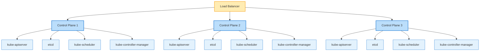

**etcd 클러스터 구성**:

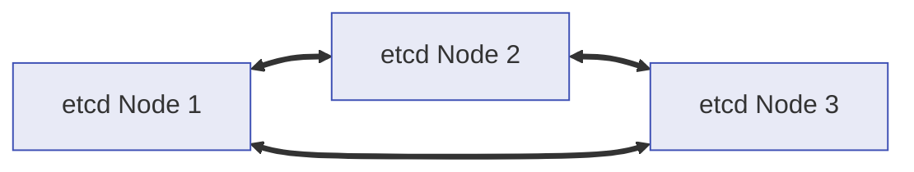

### 워커 노드 고가용성

워커 노드의 고가용성은 다음과 같은 방법으로 구현됩니다:

1. **다중 워커 노드**: 여러 워커 노드에 워크로드 분산
2. **노드 자동 복구**: 클라우드 제공업체의 자동 복구 기능 활용
3. **자동 확장**: 클러스터 자동 확장기를 통한 노드 자동 확장
4. **다중 가용 영역**: 여러 가용 영역에 노드 배포

**워커 노드 분산 배포**:

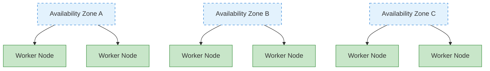

### 애플리케이션 고가용성

애플리케이션의 고가용성은 다음과 같은 방법으로 구현됩니다:

1. **레플리카셋/디플로이먼트**: 여러 파드 복제본 실행
2. **파드 분산 규칙**: 파드 안티-어피니티를 통한 여러 노드에 파드 분산
3. **PodDisruptionBudget**: 계획된 중단 시 최소 가용성 보장
4. **서비스 및 로드 밸런싱**: 트래픽을 여러 파드에 분산

**파드 안티-어피니티 예시**:
```yaml
apiVersion: apps/v1
kind: Deployment
metadata:
  name: web-server
spec:
  replicas: 3
  template:
    metadata:
      labels:
        app: web-server
    spec:
      affinity:
        podAntiAffinity:
          requiredDuringSchedulingIgnoredDuringExecution:
          - labelSelector:
              matchExpressions:
              - key: app
                operator: In
                values:
                - web-server
            topologyKey: "kubernetes.io/hostname"
      containers:
      - name: web-server
        image: nginx:1.21
```

**PodDisruptionBudget 예시**:
```yaml
apiVersion: policy/v1
kind: PodDisruptionBudget
metadata:
  name: web-server-pdb
spec:
  minAvailable: 2
  selector:
    matchLabels:
      app: web-server
```

### 재해 복구 전략

Kubernetes 클러스터의 재해 복구 전략은 다음과 같은 방법으로 구현됩니다:

1. **etcd 백업 및 복구**: 정기적인 etcd 데이터 백업 및 복구 절차 수립
2. **다중 리전 배포**: 여러 리전에 클러스터 배포
3. **클러스터 페더레이션**: 여러 클러스터를 연합하여 관리
4. **지속적인 백업**: 애플리케이션 데이터의 지속적인 백업

**etcd 백업 스크립트 예시**:
```bash
#!/bin/bash
ETCDCTL_API=3 etcdctl snapshot save /backup/etcd-snapshot-$(date +%Y%m%d-%H%M%S).db \
  --endpoints=https://127.0.0.1:2379 \
  --cacert=/etc/kubernetes/pki/etcd/ca.crt \
  --cert=/etc/kubernetes/pki/etcd/server.crt \
  --key=/etc/kubernetes/pki/etcd/server.key
```

**etcd 복구 스크립트 예시**:
```bash
#!/bin/bash
# 클러스터 중지
systemctl stop kubelet
docker stop $(docker ps -q)

# etcd 데이터 복구
ETCDCTL_API=3 etcdctl snapshot restore /backup/etcd-snapshot.db \
  --data-dir=/var/lib/etcd-restore \
  --name=master \
  --initial-cluster=master=https://127.0.0.1:2380 \
  --initial-cluster-token=etcd-cluster \
  --initial-advertise-peer-urls=https://127.0.0.1:2380

# 복구된 데이터로 etcd 디렉토리 교체
mv /var/lib/etcd /var/lib/etcd.old
mv /var/lib/etcd-restore /var/lib/etcd

# 클러스터 재시작
systemctl start kubelet
```
## 클러스터 네트워킹

Kubernetes 네트워킹은 파드, 서비스, 외부 세계 간의 통신을 가능하게 하는 핵심 구성 요소입니다. Kubernetes 네트워킹 모델은 모든 파드가 고유한 IP 주소를 가지며, NAT 없이 서로 통신할 수 있다는 것을 기본 전제로 합니다.

### 네트워킹 모델

Kubernetes 네트워킹 모델은 다음과 같은 요구사항을 가집니다:

1. **파드 간 통신**: 모든 파드는 NAT 없이 다른 모든 파드와 통신할 수 있어야 함
2. **노드와 파드 간 통신**: 노드는 NAT 없이 모든 파드와 통신할 수 있어야 함
3. **파드와 외부 간 통신**: 파드는 외부 세계와 통신할 수 있어야 함 (일반적으로 NAT 사용)

### CNI (Container Network Interface)

CNI는 Kubernetes에서 네트워킹을 구현하기 위한 표준 인터페이스입니다. 다양한 CNI 플러그인이 있으며, 각각 다른 기능과 성능 특성을 가집니다.

**주요 CNI 플러그인**:

1. **Calico**: BGP 기반 네트워킹, 네트워크 정책 지원
   - 특징: 고성능, 네트워크 정책, 암호화, eBPF 지원
   - 사용 사례: 대규모 클러스터, 보안이 중요한 환경

2. **Cilium**: eBPF 기반 네트워킹 및 보안
   - 특징: L3-L7 보안 정책, 고성능, 관찰성
   - 사용 사례: 마이크로서비스, 보안이 중요한 환경

3. **Flannel**: 간단한 오버레이 네트워크
   - 특징: 설정 간단, 가벼움
   - 사용 사례: 소규모 클러스터, 개발 환경

4. **Weave Net**: 멀티 호스트 컨테이너 네트워킹
   - 특징: 암호화, 네트워크 정책, 멀티클라우드
   - 사용 사례: 하이브리드 클라우드, 멀티클라우드

**CNI 구성 예시 (Calico)**:
```yaml
apiVersion: v1
kind: ConfigMap
metadata:
  name: calico-config
  namespace: kube-system
data:
  calico_backend: "bird"
  cni_network_config: |-
    {
      "name": "k8s-pod-network",
      "cniVersion": "0.3.1",
      "plugins": [
        {
          "type": "calico",
          "log_level": "info",
          "datastore_type": "kubernetes",
          "nodename": "__KUBERNETES_NODE_NAME__",
          "mtu": __CNI_MTU__,
          "ipam": {
            "type": "calico-ipam"
          },
          "policy": {
            "type": "k8s"
          },
          "kubernetes": {
            "kubeconfig": "__KUBECONFIG_FILEPATH__"
          }
        },
        {
          "type": "portmap",
          "snat": true,
          "capabilities": {"portMappings": true}
        }
      ]
    }
```

### 서비스 네트워킹

Kubernetes 서비스는 파드 집합에 대한 안정적인 엔드포인트를 제공합니다. 서비스는 ClusterIP, NodePort, LoadBalancer, ExternalName 등 여러 유형이 있습니다.

**서비스 네트워킹 구성 요소**:

1. **ClusterIP**: 클러스터 내부에서만 접근 가능한 가상 IP
2. **kube-proxy**: 서비스 IP에 대한 트래픽을 파드로 라우팅
3. **CoreDNS**: 서비스 디스커버리를 위한 DNS 서비스

**서비스 네트워킹 흐름**:
```
클라이언트 -> 서비스 (ClusterIP) -> kube-proxy -> 파드
```

**서비스 예시**:
```yaml
apiVersion: v1
kind: Service
metadata:
  name: my-service
spec:
  selector:
    app: my-app
  ports:
  - port: 80
    targetPort: 8080
  type: ClusterIP
```

### 인그레스 네트워킹

인그레스는 클러스터 외부에서 클러스터 내부 서비스로의 HTTP 및 HTTPS 라우팅을 관리합니다. 인그레스 컨트롤러는 인그레스 리소스를 구현하는 역할을 합니다.

**주요 인그레스 컨트롤러**:
1. **NGINX Ingress Controller**: NGINX 기반 인그레스 컨트롤러
2. **AWS ALB Ingress Controller**: AWS Application Load Balancer 기반
3. **Traefik**: 클라우드 네이티브 엣지 라우터
4. **HAProxy Ingress**: HAProxy 기반 인그레스 컨트롤러

**인그레스 네트워킹 흐름**:
```
클라이언트 -> 인그레스 컨트롤러 -> 서비스 -> 파드
```

**인그레스 예시**:
```yaml
apiVersion: networking.k8s.io/v1
kind: Ingress
metadata:
  name: my-ingress
  annotations:
    nginx.ingress.kubernetes.io/rewrite-target: /
spec:
  ingressClassName: nginx
  rules:
  - host: example.com
    http:
      paths:
      - path: /app
        pathType: Prefix
        backend:
          service:
            name: my-service
            port:
              number: 80
```

### 네트워크 정책

네트워크 정책은 파드 간의 통신을 제어하는 방법을 제공합니다. 기본적으로 모든 파드는 서로 통신할 수 있지만, 네트워크 정책을 사용하면 이를 제한할 수 있습니다.

**네트워크 정책 예시**:
```yaml
apiVersion: networking.k8s.io/v1
kind: NetworkPolicy
metadata:
  name: db-network-policy
spec:
  podSelector:
    matchLabels:
      role: db
  policyTypes:
  - Ingress
  - Egress
  ingress:
  - from:
    - podSelector:
        matchLabels:
          role: frontend
    ports:
    - protocol: TCP
      port: 3306
  egress:
  - to:
    - podSelector:
        matchLabels:
          role: monitoring
    ports:
    - protocol: TCP
      port: 9090
```

### 네트워크 문제 해결

Kubernetes 네트워킹 문제를 해결하기 위한 일반적인 도구와 명령어:

1. **ping, traceroute**: 기본적인 네트워크 연결 테스트
2. **tcpdump**: 네트워크 패킷 캡처 및 분석
3. **netstat, ss**: 네트워크 연결 상태 확인
4. **nslookup, dig**: DNS 조회 테스트
5. **kubectl exec**: 파드 내에서 네트워크 명령 실행

**네트워크 디버깅 예시**:
```bash
# 파드 내에서 네트워크 연결 테스트
kubectl exec -it <pod-name> -- ping <target-ip>

# 파드 내에서 DNS 조회 테스트
kubectl exec -it <pod-name> -- nslookup <service-name>

# 파드 내에서 네트워크 패킷 캡처
kubectl exec -it <pod-name> -- tcpdump -i eth0 -n

# 서비스 엔드포인트 확인
kubectl get endpoints <service-name>
```

## 클러스터 스토리지

Kubernetes 스토리지는 컨테이너화된 애플리케이션에 데이터 지속성을 제공합니다. Kubernetes는 다양한 스토리지 옵션과 추상화를 제공하여 애플리케이션이 스토리지를 효율적으로 사용할 수 있게 합니다.

### 스토리지 아키텍처

Kubernetes 스토리지 아키텍처는 다음과 같은 구성 요소로 이루어져 있습니다:

1. **볼륨**: 파드 내의 컨테이너에 마운트할 수 있는 디렉토리
2. **영구 볼륨 (PV)**: 클러스터의 스토리지 리소스
3. **영구 볼륨 클레임 (PVC)**: 사용자의 스토리지 요청
4. **스토리지 클래스**: 스토리지의 "클래스" 또는 유형을 정의
5. **CSI (Container Storage Interface)**: 스토리지 시스템과의 표준 인터페이스

**스토리지 아키텍처 흐름**:


### 볼륨 유형

Kubernetes는 다양한 유형의 볼륨을 지원합니다:

1. **임시 볼륨**:
   - **emptyDir**: 빈 디렉토리로 시작하며, 파드가 삭제되면 함께 삭제됨
   - **configMap**: ConfigMap을 볼륨으로 마운트
   - **secret**: Secret을 볼륨으로 마운트
   - **downwardAPI**: 파드 및 컨테이너 정보를 파일로 노출

2. **영구 볼륨**:
   - **awsElasticBlockStore**: AWS EBS 볼륨
   - **azureDisk**: Azure Disk
   - **gcePersistentDisk**: GCE 영구 디스크
   - **nfs**: NFS 볼륨
   - **csi**: CSI 드라이버를 통한 볼륨

**볼륨 예시**:
```yaml
apiVersion: v1
kind: Pod
metadata:
  name: test-pd
spec:
  containers:
  - name: test-container
    image: nginx
    volumeMounts:
    - mountPath: /test-pd
      name: test-volume
  volumes:
  - name: test-volume
    persistentVolumeClaim:
      claimName: test-pvc
```

### 영구 볼륨 및 클레임

영구 볼륨(PV)은 관리자가 프로비저닝하거나 스토리지 클래스를 통해 동적으로 프로비저닝되는 클러스터의 스토리지 리소스입니다. 영구 볼륨 클레임(PVC)은 사용자의 스토리지 요청입니다.

**영구 볼륨 예시**:
```yaml
apiVersion: v1
kind: PersistentVolume
metadata:
  name: pv-example
spec:
  capacity:
    storage: 10Gi
  accessModes:
    - ReadWriteOnce
  persistentVolumeReclaimPolicy: Retain
  storageClassName: standard
  awsElasticBlockStore:
    volumeID: vol-0123456789abcdef0
    fsType: ext4
```

**영구 볼륨 클레임 예시**:
```yaml
apiVersion: v1
kind: PersistentVolumeClaim
metadata:
  name: pvc-example
spec:
  accessModes:
    - ReadWriteOnce
  resources:
    requests:
      storage: 5Gi
  storageClassName: standard
```

### 스토리지 클래스

스토리지 클래스는 관리자가 제공하는 스토리지의 "클래스"를 설명합니다. 스토리지 클래스를 사용하면 PVC가 요청될 때 동적으로 PV를 프로비저닝할 수 있습니다.

**스토리지 클래스 예시**:
```yaml
apiVersion: storage.k8s.io/v1
kind: StorageClass
metadata:
  name: standard
provisioner: kubernetes.io/aws-ebs
parameters:
  type: gp3
  fsType: ext4
reclaimPolicy: Delete
allowVolumeExpansion: true
```

### CSI (Container Storage Interface)

CSI는 Kubernetes와 스토리지 시스템 간의 표준 인터페이스를 제공합니다. CSI를 통해 스토리지 제공업체는 Kubernetes 코드를 수정하지 않고도 자체 스토리지 드라이버를 개발할 수 있습니다.

**CSI 아키텍처**:

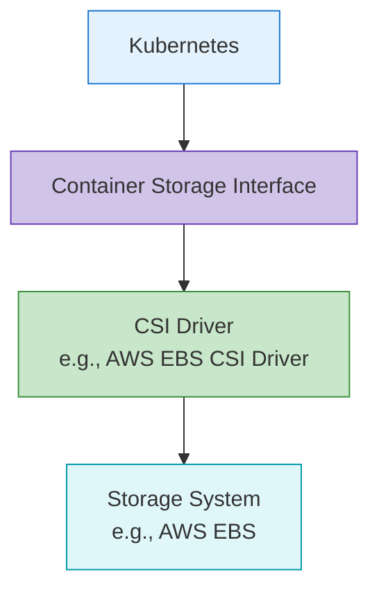

**CSI 드라이버 배포 예시**:
```yaml
apiVersion: storage.k8s.io/v1
kind: StorageClass
metadata:
  name: ebs-sc
provisioner: ebs.csi.aws.com
parameters:
  type: gp3
  fsType: ext4
  encrypted: "true"
volumeBindingMode: WaitForFirstConsumer
```

### 스토리지 모범 사례

Kubernetes 스토리지 사용에 대한 모범 사례:

1. **적절한 스토리지 유형 선택**: 워크로드 특성에 맞는 스토리지 유형 선택
2. **동적 프로비저닝 사용**: 스토리지 클래스를 통한 동적 프로비저닝 활용
3. **적절한 접근 모드 선택**: 워크로드 요구사항에 맞는 접근 모드 선택
4. **리소스 요청 및 제한 설정**: 적절한 스토리지 용량 요청
5. **백업 및 복구 전략 수립**: 중요 데이터에 대한 백업 및 복구 전략 마련
6. **스토리지 모니터링**: 스토리지 사용량 및 성능 모니터링
## 클러스터 확장성

Kubernetes 클러스터의 확장성은 클러스터가 증가하는 부하와 요구사항을 처리할 수 있는 능력을 의미합니다. 확장성은 수평적 확장(스케일 아웃)과 수직적 확장(스케일 업) 두 가지 방식으로 구현될 수 있습니다.

### 클러스터 규모 제한

Kubernetes 클러스터는 다음과 같은 규모 제한을 가집니다:

1. **노드 수**: 최대 5,000개 노드
2. **파드 수**: 클러스터당 최대 150,000개 파드
3. **노드당 파드 수**: 노드당 최대 110개 파드 (기본값)
4. **서비스 수**: 클러스터당 최대 10,000개 서비스
5. **컨테이너 수**: 파드당 최대 20개 컨테이너

이러한 제한은 Kubernetes 버전과 클러스터 구성에 따라 다를 수 있습니다.

### 수평적 확장

수평적 확장은 더 많은 노드를 추가하여 클러스터의 용량을 늘리는 방식입니다.

**노드 자동 확장**:
Kubernetes 클러스터 자동 확장기(Cluster Autoscaler)는 워크로드 요구사항에 따라 노드 수를 자동으로 조정합니다.

```yaml
# AWS Auto Scaling Group 태그 예시
tags:
  k8s.io/cluster-autoscaler/enabled: "true"
  k8s.io/cluster-autoscaler/my-cluster: "owned"
```

**클러스터 자동 확장기 배포 예시**:
```yaml
apiVersion: apps/v1
kind: Deployment
metadata:
  name: cluster-autoscaler
  namespace: kube-system
spec:
  replicas: 1
  selector:
    matchLabels:
      app: cluster-autoscaler
  template:
    metadata:
      labels:
        app: cluster-autoscaler
    spec:
      containers:
      - name: cluster-autoscaler
        image: k8s.gcr.io/autoscaling/cluster-autoscaler:v1.24.0
        command:
        - ./cluster-autoscaler
        - --cloud-provider=aws
        - --nodes=2:10:my-asg-group
        - --scale-down-unneeded-time=10m
```

**Karpenter**:
Karpenter는 AWS에서 개발한 새로운 노드 자동 확장 도구로, 더 빠르고 효율적인 노드 프로비저닝을 제공합니다.

```yaml
apiVersion: karpenter.sh/v1
kind: NodePool
metadata:
  name: default
spec:
  template:
    spec:
      requirements:
        - key: karpenter.sh/capacity-type
          operator: In
          values: ["spot", "on-demand"]
      nodeClassRef:
        name: default-class
  limits:
    cpu: 1000
    memory: 1000Gi
---
apiVersion: karpenter.k8s.aws/v1
kind: EC2NodeClass
metadata:
  name: default-class
spec:
  subnetSelector:
    karpenter.sh/discovery: my-cluster
  securityGroupSelector:
    karpenter.sh/discovery: my-cluster
```

### 수직적 확장

수직적 확장은 기존 노드의 리소스(CPU, 메모리)를 늘리는 방식입니다.

**Vertical Pod Autoscaler (VPA)**:
VPA는 파드의 CPU 및 메모리 요청을 자동으로 조정합니다.

```yaml
apiVersion: autoscaling.k8s.io/v1
kind: VerticalPodAutoscaler
metadata:
  name: my-app-vpa
spec:
  targetRef:
    apiVersion: "apps/v1"
    kind: Deployment
    name: my-app
  updatePolicy:
    updateMode: "Auto"
  resourcePolicy:
    containerPolicies:
    - containerName: '*'
      minAllowed:
        cpu: 100m
        memory: 50Mi
      maxAllowed:
        cpu: 1
        memory: 500Mi
```

### 애플리케이션 확장

애플리케이션 수준에서의 확장은 파드 복제본 수를 조정하여 구현됩니다.

**Horizontal Pod Autoscaler (HPA)**:
HPA는 CPU 사용률이나 사용자 정의 메트릭에 따라 파드 복제본 수를 자동으로 조정합니다.

```yaml
apiVersion: autoscaling/v2
kind: HorizontalPodAutoscaler
metadata:
  name: my-app-hpa
spec:
  scaleTargetRef:
    apiVersion: apps/v1
    kind: Deployment
    name: my-app
  minReplicas: 2
  maxReplicas: 10
  metrics:
  - type: Resource
    resource:
      name: cpu
      target:
        type: Utilization
        averageUtilization: 80
```

**KEDA (Kubernetes Event-driven Autoscaling)**:
KEDA는 이벤트 기반 자동 확장을 제공하여 다양한 이벤트 소스에 기반한 확장을 가능하게 합니다.

```yaml
apiVersion: keda.sh/v1alpha1
kind: ScaledObject
metadata:
  name: my-app-scaledobject
spec:
  scaleTargetRef:
    name: my-app
  minReplicaCount: 0
  maxReplicaCount: 10
  triggers:
  - type: kafka
    metadata:
      bootstrapServers: kafka.svc:9092
      consumerGroup: my-group
      topic: my-topic
      lagThreshold: "10"
```

### 확장성 모범 사례

Kubernetes 클러스터 확장성을 위한 모범 사례:

1. **리소스 요청 및 제한 설정**: 모든 파드에 적절한 리소스 요청 및 제한 설정
2. **노드 풀 전략**: 워크로드 특성에 맞는 여러 노드 풀 구성
3. **자동 확장 구성**: 클러스터 자동 확장기, HPA, VPA 적절히 구성
4. **효율적인 파드 배치**: 노드 어피니티, 파드 어피니티/안티-어피니티 활용
5. **클러스터 모니터링**: 리소스 사용량 및 성능 지속적 모니터링
6. **부하 테스트**: 확장 전략 검증을 위한 정기적인 부하 테스트

## 클러스터 보안

Kubernetes 클러스터 보안은 여러 계층에서 구현되어야 합니다. 이는 인증, 권한 부여, 네트워크 정책, 파드 보안 등을 포함합니다.

### 인증 (Authentication)

Kubernetes API 서버에 대한 접근을 인증하는 방법:

1. **X.509 인증서**: TLS 클라이언트 인증서를 사용한 인증
2. **서비스 계정 토큰**: 파드 내에서 API 서버 접근을 위한 토큰
3. **OpenID Connect (OIDC)**: 외부 ID 제공자를 통한 인증
4. **웹훅 토큰 인증**: 외부 인증 서비스를 통한 인증
5. **인증 프록시**: 인증 프록시를 통한 인증

**kubeconfig 예시**:
```yaml
apiVersion: v1
kind: Config
clusters:
- name: my-cluster
  cluster:
    certificate-authority-data: <CA-DATA>
    server: https://api.my-cluster.example.com
users:
- name: admin
  user:
    client-certificate-data: <CERT-DATA>
    client-key-data: <KEY-DATA>
contexts:
- name: my-context
  context:
    cluster: my-cluster
    user: admin
current-context: my-context
```

### 권한 부여 (Authorization)

인증된 사용자의 작업을 제어하는 방법:

1. **RBAC (Role-Based Access Control)**: 역할 기반 접근 제어
2. **ABAC (Attribute-Based Access Control)**: 속성 기반 접근 제어
3. **Node Authorization**: 노드에 대한 특별한 권한 부여
4. **Webhook Authorization**: 외부 서비스를 통한 권한 부여

**RBAC 예시**:
```yaml
# 역할 정의
apiVersion: rbac.authorization.k8s.io/v1
kind: Role
metadata:
  namespace: default
  name: pod-reader
rules:
- apiGroups: [""]
  resources: ["pods"]
  verbs: ["get", "watch", "list"]

# 역할 바인딩
apiVersion: rbac.authorization.k8s.io/v1
kind: RoleBinding
metadata:
  name: read-pods
  namespace: default
subjects:
- kind: User
  name: jane
  apiGroup: rbac.authorization.k8s.io
roleRef:
  kind: Role
  name: pod-reader
  apiGroup: rbac.authorization.k8s.io
```

### 네트워크 보안

클러스터 내 네트워크 트래픽을 보호하는 방법:

1. **네트워크 정책**: 파드 간 통신 제어
2. **암호화된 통신**: TLS를 통한 통신 암호화
3. **서비스 메시**: Istio, Linkerd 등을 통한 고급 네트워크 보안

**네트워크 정책 예시**:
```yaml
apiVersion: networking.k8s.io/v1
kind: NetworkPolicy
metadata:
  name: default-deny-all
spec:
  podSelector: {}
  policyTypes:
  - Ingress
  - Egress
```

### 파드 보안

파드 수준에서의 보안 구현:

1. **파드 보안 컨텍스트**: 파드 및 컨테이너 수준의 보안 설정
2. **파드 보안 표준**: 파드 보안 요구사항 정의
3. **seccomp 프로필**: 시스템 호출 제한
4. **AppArmor/SELinux**: 강제적 접근 제어

**파드 보안 컨텍스트 예시**:
```yaml
apiVersion: v1
kind: Pod
metadata:
  name: security-context-pod
spec:
  securityContext:
    runAsUser: 1000
    runAsGroup: 3000
    fsGroup: 2000
  containers:
  - name: app
    image: myapp:1.0
    securityContext:
      allowPrivilegeEscalation: false
      capabilities:
        drop:
        - ALL
```

### 시크릿 관리

민감한 정보를 안전하게 관리하는 방법:

1. **Kubernetes 시크릿**: 기본 시크릿 리소스 사용
2. **암호화된 etcd**: etcd에 저장된 시크릿 암호화
3. **외부 시크릿 관리**: HashiCorp Vault, AWS Secrets Manager 등 활용

**암호화된 etcd 구성 예시**:
```yaml
apiVersion: apiserver.config.k8s.io/v1
kind: EncryptionConfiguration
resources:
  - resources:
    - secrets
    providers:
    - aescbc:
        keys:
        - name: key1
          secret: <base64-encoded-key>
    - identity: {}
```

### 보안 모범 사례

Kubernetes 클러스터 보안을 위한 모범 사례:

1. **최소 권한 원칙**: 필요한 최소한의 권한만 부여
2. **정기적인 업데이트**: 클러스터 및 구성 요소 정기적 업데이트
3. **네트워크 분리**: 네트워크 정책을 통한 파드 간 통신 제한
4. **이미지 보안**: 신뢰할 수 있는 이미지만 사용, 취약점 스캐닝 구현
5. **감사 로깅**: 클러스터 활동에 대한 감사 로그 활성화
6. **보안 벤치마크**: CIS 벤치마크 등 보안 표준 준수

## 클러스터 업그레이드

Kubernetes 클러스터 업그레이드는 새로운 기능, 보안 패치, 버그 수정을 적용하기 위해 필요합니다. 업그레이드는 신중하게 계획하고 실행해야 합니다.

### 업그레이드 전략

Kubernetes 클러스터 업그레이드를 위한 전략:

1. **블루/그린 업그레이드**: 새 버전의 클러스터를 별도로 생성하고 워크로드 마이그레이션
2. **인플레이스 업그레이드**: 기존 클러스터를 직접 업그레이드
3. **카나리 업그레이드**: 일부 노드만 먼저 업그레이드하여 검증

### 업그레이드 순서

Kubernetes 클러스터 업그레이드의 일반적인 순서:

1. **컨트롤 플레인 업그레이드**: kube-apiserver, kube-controller-manager, kube-scheduler, etcd
2. **DNS 및 CNI 업그레이드**: CoreDNS, CNI 플러그인 등 주요 애드온 업그레이드
3. **워커 노드 업그레이드**: 워커 노드 순차적 업그레이드

**kubeadm 업그레이드 예시**:
```bash
# 컨트롤 플레인 업그레이드
kubeadm upgrade plan
kubeadm upgrade apply v1.24.0

# 워커 노드 업그레이드
kubectl drain <node-name> --ignore-daemonsets
# 노드에서 kubelet 및 kubeadm 업그레이드
apt-get update && apt-get install -y kubelet=1.24.0-00 kubeadm=1.24.0-00
kubeadm upgrade node
systemctl restart kubelet
kubectl uncordon <node-name>
```

### 업그레이드 고려사항

Kubernetes 클러스터 업그레이드 시 고려해야 할 사항:

1. **API 변경사항**: 새 버전에서의 API 변경사항 확인
2. **기능 게이트**: 새로운 기능 게이트 및 기본값 변경 확인
3. **종속성**: CNI, CSI 등 종속 구성 요소의 호환성 확인
4. **다운타임**: 업그레이드 중 예상되는 다운타임 계획
5. **롤백 계획**: 문제 발생 시 롤백 계획 수립

### 업그레이드 모범 사례

Kubernetes 클러스터 업그레이드를 위한 모범 사례:

1. **테스트 환경에서 먼저 테스트**: 프로덕션 환경 업그레이드 전 테스트 환경에서 검증
2. **점진적 업그레이드**: 한 번에 한 마이너 버전씩 업그레이드
3. **백업**: 업그레이드 전 etcd 데이터 백업
4. **문서화**: 업그레이드 절차 및 결과 문서화
5. **모니터링**: 업그레이드 중 및 후 클러스터 상태 모니터링
6. **업그레이드 윈도우**: 트래픽이 적은 시간대에 업그레이드 수행

## Amazon EKS 클러스터 아키텍처

Amazon EKS(Elastic Kubernetes Service)는 AWS에서 제공하는 관리형 Kubernetes 서비스입니다. EKS는 Kubernetes의 기본 기능을 모두 제공하면서도 AWS 서비스와의 통합과 관리 편의성을 추가로 제공합니다.

### EKS 아키텍처 개요

EKS 클러스터는 다음과 같은 구성 요소로 이루어져 있습니다:

1. **EKS 컨트롤 플레인**: AWS에서 관리하는 Kubernetes 컨트롤 플레인
2. **EKS 노드**: 사용자가 관리하는 워커 노드 (EC2 인스턴스)
3. **EKS 관리형 노드 그룹**: AWS에서 관리하는 노드 그룹
4. **EKS Fargate 프로필**: 서버리스 컨테이너 실행 환경
5. **VPC 및 서브넷**: 클러스터 네트워킹을 위한 VPC 및 서브넷

**EKS 아키텍처 다이어그램**:

```mermaid
graph TD
    classDef aws fill:#e8f5e9,stroke:#2e7d32,stroke-width:1px;
    classDef eks fill:#fce4ec,stroke:#c2185b,stroke-width:1px;
    classDef controlplane fill:#bbdefb,stroke:#1976d2,stroke-width:2px;
    classDef nodes fill:#c8e6c9,stroke:#388e3c,stroke-width:1px;
    classDef services fill:#d1c4e9,stroke:#673ab7,stroke-width:1px;
    classDef network fill:#f3e5f5,stroke:#7b1fa2,stroke-width:1px;
    
    AWS[AWS Cloud] --> CP[EKS Control Plane<br>AWS Managed]
    AWS --> WN[Worker Nodes]
    AWS --> AWSS[AWS Services]
    AWS --> VPC[VPC & Networking]
    
    CP --> API[kube-apiserver]
    CP --> ETCD[etcd]
    CP --> SCHED[kube-scheduler]
    CP --> CTRL[kube-controller-manager]
    
    WN --> NG1[Node Group 1<br>EC2 instances]
    WN --> NG2[Node Group 2<br>EC2 instances]
    WN --> FG[Fargate Profile<br>Serverless]
    
    AWSS --> IAM[IAM]
    AWSS --> ECR[ECR]
    AWSS --> ELB[ELB/ALB/NLB]
    AWSS --> EBS[EBS/EFS/FSx]
    AWSS --> CW[CloudWatch]
    
    VPC --> VPCM[VPC]
    VPC --> SN[Subnets]
    VPC --> SG[Security Groups]
    VPC --> RT[Route Tables]
    VPC --> CNI[VPC CNI]
    
    class AWS aws;
    class CP controlplane;
    class WN nodes;
    class AWSS,IAM,ECR,ELB,EBS,CW services;
    class VPC,VPCM,SN,SG,RT,CNI network;
    class API,ETCD,SCHED,CTRL,NG1,NG2,FG eks;
```

### EKS 컨트롤 플레인

EKS 컨트롤 플레인은 AWS에서 관리하며, 여러 가용 영역에 걸쳐 고가용성을 제공합니다.

**주요 특징**:
1. **관리형 서비스**: AWS에서 컨트롤 플레인 관리 및 업그레이드
2. **고가용성**: 여러 가용 영역에 걸쳐 배포
3. **자동 확장**: 부하에 따라 자동 확장
4. **보안**: AWS 보안 서비스와 통합

### EKS 노드 유형

EKS는 다양한 유형의 노드를 지원합니다:

1. **자체 관리형 노드**: 사용자가 직접 EC2 인스턴스 관리
2. **관리형 노드 그룹**: AWS에서 노드 수명 주기 관리
3. **Fargate**: 서버리스 컨테이너 실행 환경
4. **Bottlerocket 노드**: 컨테이너 워크로드에 최적화된 OS

**관리형 노드 그룹 예시**:
```yaml
apiVersion: eksctl.io/v1alpha5
kind: ClusterConfig
metadata:
  name: my-cluster
  region: ap-northeast-2
managedNodeGroups:
  - name: ng-1
    instanceType: m5.large
    desiredCapacity: 3
    minSize: 2
    maxSize: 5
    volumeSize: 80
    privateNetworking: true
    labels:
      role: worker
    tags:
      nodegroup-role: worker
    iam:
      withAddonPolicies:
        autoScaler: true
        albIngress: true
```

### EKS 네트워킹

EKS 네트워킹은 Amazon VPC를 기반으로 하며, 다음과 같은 구성 요소를 포함합니다:

1. **VPC CNI 플러그인**: AWS VPC 네트워킹과의 통합
2. **보안 그룹**: 노드 및 파드 수준의 네트워크 보안
3. **로드 밸런서 통합**: ELB, ALB, NLB와의 통합
4. **VPC 엔드포인트**: AWS 서비스와의 프라이빗 통신

**VPC CNI 구성 예시**:
```yaml
apiVersion: v1
kind: ConfigMap
metadata:
  name: amazon-vpc-cni
  namespace: kube-system
data:
  enable-network-policy: "true"
  enable-pod-eni: "true"
  warm-ip-target: "5"
  minimum-ip-target: "10"
```

### EKS 스토리지

EKS는 다양한 AWS 스토리지 서비스와 통합됩니다:

1. **EBS CSI 드라이버**: Amazon EBS 볼륨 관리
2. **EFS CSI 드라이버**: Amazon EFS 파일 시스템 관리
3. **FSx for Lustre CSI 드라이버**: FSx for Lustre 파일 시스템 관리
4. **S3**: 객체 스토리지

**EBS CSI 드라이버 예시**:
```yaml
apiVersion: storage.k8s.io/v1
kind: StorageClass
metadata:
  name: ebs-sc
provisioner: ebs.csi.aws.com
parameters:
  type: gp3
  encrypted: "true"
volumeBindingMode: WaitForFirstConsumer
```

### EKS 보안

EKS는 AWS의 보안 서비스와 통합되어 강력한 보안을 제공합니다:

1. **IAM 통합**: AWS IAM과 Kubernetes RBAC의 통합
2. **VPC 보안**: VPC 보안 그룹 및 네트워크 ACL
3. **AWS KMS**: 시크릿 암호화를 위한 KMS 통합
4. **AWS WAF**: 웹 애플리케이션 방화벽 통합
5. **AWS Shield**: DDoS 보호

**IAM 역할 서비스 계정 예시**:
```yaml
apiVersion: v1
kind: ServiceAccount
metadata:
  name: s3-reader
  namespace: default
  annotations:
    eks.amazonaws.com/role-arn: arn:aws:iam::123456789012:role/s3-reader-role
```

### EKS 모니터링 및 로깅

EKS는 AWS의 모니터링 및 로깅 서비스와 통합됩니다:

1. **CloudWatch Container Insights**: 컨테이너 모니터링
2. **CloudWatch Logs**: 로그 수집 및 분석
3. **X-Ray**: 분산 추적
4. **Prometheus 및 Grafana**: 오픈소스 모니터링 도구 통합

**CloudWatch Container Insights 예시**:
```yaml
apiVersion: v1
kind: Namespace
metadata:
  name: amazon-cloudwatch
---
apiVersion: apps/v1
kind: DaemonSet
metadata:
  name: cloudwatch-agent
  namespace: amazon-cloudwatch
spec:
  selector:
    matchLabels:
      name: cloudwatch-agent
  template:
    metadata:
      labels:
        name: cloudwatch-agent
    spec:
      containers:
      - name: cloudwatch-agent
        image: amazon/cloudwatch-agent:1.247347.6b250880
        # ... 추가 구성
```

### EKS 비용 최적화

EKS 클러스터의 비용을 최적화하는 방법:

1. **Spot 인스턴스**: 비용 효율적인 Spot 인스턴스 활용
2. **Fargate**: 서버리스 컨테이너 실행으로 유휴 리소스 비용 절감
3. **자동 확장**: 클러스터 자동 확장기를 통한 리소스 최적화
4. **Graviton 프로세서**: ARM 기반 Graviton 인스턴스 활용
5. **리소스 요청 최적화**: 적절한 리소스 요청 및 제한 설정

**Spot 인스턴스 노드 그룹 예시**:
```yaml
apiVersion: eksctl.io/v1alpha5
kind: ClusterConfig
metadata:
  name: my-cluster
  region: ap-northeast-2
managedNodeGroups:
  - name: spot-ng
    instanceTypes: ["m5.large", "m5a.large", "m5d.large", "m5ad.large"]
    spot: true
    desiredCapacity: 3
    minSize: 2
    maxSize: 10
```

## 더 알아보기

이 문서에서 다룬 클러스터 아키텍처에 대한 이해를 더욱 깊게 하려면 다음 주제들을 참조하세요:

- [Kubernetes 소개](../basics/04-kubernetes-introduction.md) - Kubernetes의 기본 개념과 역사
- [파드와 워크로드](./02-pods-and-workloads.md) - 클러스터에서 실행되는 워크로드 관리
- [서비스와 네트워킹](./03-services-networking.md) - 클러스터 내 네트워킹 구성
- [스케줄링, 선점 및 축출](./08-scheduling-preemption-eviction.md) - 노드에 파드를 배치하는 방법
- [클러스터 관리](./09-cluster-administration.md) - 클러스터 운영 및 관리
- [EKS 소개](../eks/01-eks-introduction.md) - Amazon EKS 서비스 개요
- [EKS 클러스터 생성](../eks/02-eks-cluster-creation-part1.md) - EKS 클러스터 생성 방법

### 실습 및 심화 학습

- [Kubernetes 공식 튜토리얼](https://kubernetes.io/docs/tutorials/) - 실습을 통한 학습
- [Kubernetes The Hard Way](https://github.com/kelseyhightower/kubernetes-the-hard-way) - 수동으로 Kubernetes 클러스터 구축하기
- [Cilium 네트워킹](../networking/cilium/01-introduction.md) - 고급 네트워킹 및 보안 기능

## 결론

이 문서에서는 Kubernetes 클러스터의 아키텍처, 주요 구성 요소, 그리고 이들이 어떻게 함께 작동하는지에 대해 자세히 살펴보았습니다. 또한 클러스터의 네트워킹, 스토리지, 확장성, 보안, 업그레이드 등 중요한 측면들을 다루었으며, Amazon EKS 클러스터의 아키텍처에 대해서도 알아보았습니다.

Kubernetes 클러스터의 아키텍처를 이해하는 것은 효과적인 클러스터 설계, 배포, 운영을 위한 기반이 됩니다. 이 지식을 바탕으로 안정적이고 확장 가능하며 보안이 강화된 Kubernetes 환경을 구축할 수 있습니다.

## 퀴즈

이 장에서 배운 내용을 테스트하려면 [클러스터 아키텍처 퀴즈](../quizzes/core/01-cluster-architecture-quiz.md)를 풀어보세요.

## 참고 자료

- [Kubernetes 공식 문서](https://kubernetes.io/docs/)
- [Amazon EKS 문서](https://docs.aws.amazon.com/eks/)
- [Kubernetes The Hard Way](https://github.com/kelseyhightower/kubernetes-the-hard-way)
- [Kubernetes Patterns](https://www.oreilly.com/library/view/kubernetes-patterns/9781492050278/)
- [Kubernetes Up & Running](https://www.oreilly.com/library/view/kubernetes-up-and/9781492046523/)
- [Kubernetes Best Practices](https://www.oreilly.com/library/view/kubernetes-best-practices/9781492056461/)
